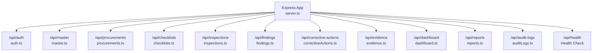
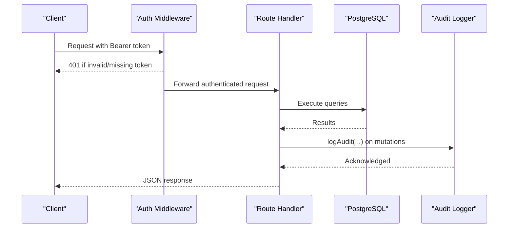
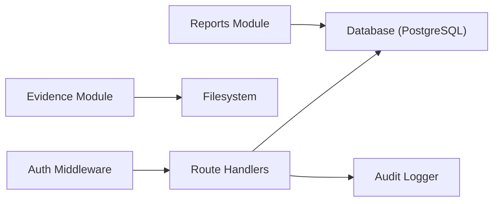
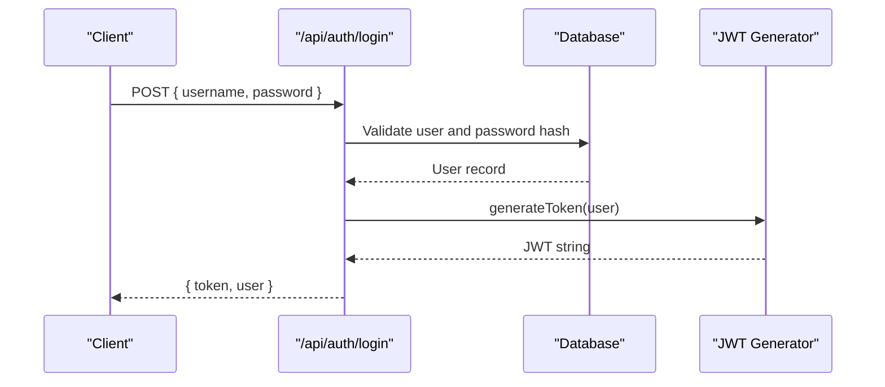

# API Reference

<cite>
**Referenced Files in This Document**
- [server.ts](file://server.ts)
- [auth.ts](file://server/routes/auth.ts)
- [master.ts](file://server/routes/master.ts)
- [procurements.ts](file://server/routes/procurements.ts)
- [checklists.ts](file://server/routes/checklists.ts)
- [inspections.ts](file://server/routes/inspections.ts)
- [findings.ts](file://server/routes/findings.ts)
- [correctiveActions.ts](file://server/routes/correctiveActions.ts)
- [evidence.ts](file://server/routes/evidence.ts)
- [dashboard.ts](file://server/routes/dashboard.ts)
- [reports.ts](file://server/routes/reports.ts)
- [auditLogs.ts](file://server/routes/auditLogs.ts)
- [auth.ts (middleware)](file://server/middleware/auth.ts)
- [schema.sql](file://database/schema.sql)
</cite>

## Table of Contents
1. Introduction
2. Project Structure
3. Core Components
4. Architecture Overview
5. Detailed Component Analysis
6. Dependency Analysis
7. Performance Considerations
8. Troubleshooting Guide
9. Conclusion
10. Appendices

## Introduction
This document provides comprehensive API documentation for the NVC Procurement Monitoring & Inspection System RESTful endpoints. It covers authentication, master data, procurements, checklists, inspections, findings, corrective actions, evidence, dashboard, reports, and audit logs. For each endpoint group, you will find HTTP methods, URL patterns, request/response schemas, authentication requirements, parameter specifications, error formats, status codes, and concrete examples.

Authentication is token-based using JWT. All protected endpoints require a valid Bearer token or a query parameter token. Role-based access control (RBAC) is enforced via middleware to restrict sensitive operations to authorized roles such as admin, inspector, and reviewer.

## Project Structure
The server mounts multiple route modules under a common base path /api. The application initializes the database, sets up CORS and JSON parsing, serves static uploads, and exposes a health check endpoint.

**Diagram sources**
- [server.ts:44-55](file://server.ts#L44-L55)
- [server.ts:57-65](file://server.ts#L57-L65)

**Section sources**
- [server.ts:23-55](file://server.ts#L23-L55)
- [server.ts:57-65](file://server.ts#L57-L65)

## Core Components
- Authentication and Authorization: JWT-based authentication with role checks.
- Master Data: Provinces, districts, municipalities, ministries, offices, fiscal years, roles, checklist stages.
- Procurements: CRUD and filtering for procurement records.
- Checklists: Master checklist items and stage-specific retrieval; admin-only creation/update.
- Inspections: Lifecycle management, checklist results, completion percentage, risk scoring.
- Findings: Creation, updates, deletion, and filtering by risk/status/office.
- Corrective Actions: Tracking, verification workflow, overdue detection.
- Evidence: File upload, listing, download, and deletion.
- Dashboard: Aggregated KPIs, compliance stats, risk distribution, alerts.
- Reports: Full inspection report packet and CSV exports.
- Audit Logs: Queryable audit trail with filters.

**Section sources**
- [auth.ts (middleware):20-86](file://server/middleware/auth.ts#L20-L86)
- [schema.sql:8-283](file://database/schema.sql#L8-L283)

## Architecture Overview
The system uses Express routes that delegate to PostgreSQL via a shared DB utility. Middleware enforces authentication and RBAC. Audit logging is invoked on key mutations.

**Diagram sources**
- [auth.ts (middleware):36-86](file://server/middleware/auth.ts#L36-L86)
- [auth.ts:10-80](file://server/routes/auth.ts#L10-L80)
- [procurements.ts:175-325](file://server/routes/procurements.ts#L175-L325)

## Detailed Component Analysis

### Authentication
Base path: /api/auth

- POST /api/auth/login
  - Purpose: Authenticate user and return JWT.
  - Request body: username, password
  - Success response: { message, token, user }
  - Errors: 400 missing fields, 401 invalid credentials, 500 server error
  - Notes: Audits login event.

- GET /api/auth/me
  - Purpose: Get current user profile.
  - Auth: Required
  - Response: User object with role, designation, office info
  - Errors: 401 unauthorized, 404 not found, 500 server error

- GET /api/auth/users
  - Purpose: List users (Admin only).
  - Auth: Required + role admin
  - Response: Array of users
  - Errors: 401/403 unauthorized, 500 server error

- POST /api/auth/users
  - Purpose: Create user (Admin only).
  - Auth: Required + role admin
  - Request body: username, password, full_name, email, role, optional designation, phone, office_id
  - Validation: Required fields checked; duplicate username/email rejected
  - Response: Created user (201)
  - Errors: 400 validation/duplicate, 500 server error

- PUT /api/auth/users/:id
  - Purpose: Update user (Admin only).
  - Auth: Required + role admin
  - Request body: partial update fields including optional password reset
  - Response: Updated user
  - Errors: 404 not found, 500 server error

Example requests/responses:
- Login request:
  - Method: POST
  - Path: /api/auth/login
  - Body: { "username": "admin", "password": "secret" }
  - Response: { "message": "...", "token": "eyJ...", "user": { ... } }
- Get profile request:
  - Method: GET
  - Path: /api/auth/me
  - Headers: Authorization: Bearer <token>
  - Response: { "id": 1, "username": "admin", "role": "admin", ... }

**Section sources**
- [auth.ts:10-80](file://server/routes/auth.ts#L10-L80)
- [auth.ts:83-104](file://server/routes/auth.ts#L83-L104)
- [auth.ts:107-121](file://server/routes/auth.ts#L107-L121)
- [auth.ts:124-163](file://server/routes/auth.ts#L124-L163)
- [auth.ts:166-225](file://server/routes/auth.ts#L166-L225)
- [auth.ts (middleware):20-86](file://server/middleware/auth.ts#L20-L86)

### Master Data
Base path: /api/master

- GET /api/master/stages
  - Purpose: Retrieve all checklist stages with active item counts.
  - Response: Array of stages with checklist_items_count

- GET /api/master/provinces
  - Purpose: List provinces.
  - Response: Array of provinces

- GET /api/master/districts?province_id=...
  - Purpose: List districts, optionally filtered by province.
  - Response: Array of districts

- GET /api/master/municipalities?district_id=...
  - Purpose: List municipalities, optionally filtered by district.
  - Response: Array of municipalities

- GET /api/master/ministries
  - Purpose: List ministries.
  - Response: Array of ministries

- GET /api/master/offices?ministry_id=...&province_id=...
  - Purpose: List active offices with ministry/province/district names.
  - Response: Array of offices

- POST /api/master/offices
  - Purpose: Create office (Admin only).
  - Auth: Required + role admin
  - Request body: name, code, ministry_id, province_id, district_id, address
  - Response: Created office (201)
  - Errors: 400 validation, 500 server error

- GET /api/master/fiscal-years
  - Purpose: List fiscal years.
  - Response: Array of fiscal years

- GET /api/master/roles
  - Purpose: List roles.
  - Response: Array of roles

Examples:
- Filter districts by province:
  - GET /api/master/districts?province_id=5
  - Response: [{ "id": 12, "name_ne": "...", ... }]
- Create office:
  - POST /api/master/offices
  - Body: { "name": "Office X", "code": "OFF-001", "ministry_id": 1, "province_id": 2 }
  - Response: { "id": 10, "name": "Office X", ... }

**Section sources**
- [master.ts:9-22](file://server/routes/master.ts#L9-L22)
- [master.ts:25-32](file://server/routes/master.ts#L25-L32)
- [master.ts:35-50](file://server/routes/master.ts#L35-L50)
- [master.ts:53-68](file://server/routes/master.ts#L53-L68)
- [master.ts:71-78](file://server/routes/master.ts#L71-L78)
- [master.ts:81-107](file://server/routes/master.ts#L81-L107)
- [master.ts:110-139](file://server/routes/master.ts#L110-L139)
- [master.ts:142-149](file://server/routes/master.ts#L142-L149)
- [master.ts:152-159](file://server/routes/master.ts#L152-L159)

### Procurements
Base path: /api/procurements

- GET /api/procurements
  - Purpose: List procurements with filters and pagination.
  - Query params: search, office_id, ministry_id, province_id, fiscal_year_id, procurement_type, procurement_method, current_status, limit (default 100), offset (default 0)
  - Response: Array of procurements with joined names and latest inspection summary

- GET /api/procurements/:id
  - Purpose: Get single procurement details with associated inspections and documents.
  - Response: Procurement object plus inspections[] and documents[]

- POST /api/procurements
  - Purpose: Register new procurement (Admin or Inspector).
  - Auth: Required + role admin|inspector
  - Request body: procurement_number, office_id, ministry_id, province_id, district_id, municipality_id, ward, title, procurement_type, procurement_method, fiscal_year_id, budget_source, estimated_cost, contract_amount, contract_number, contract_date, contractor_name, contract_start_date, contract_completion_date, current_status, inspection_date, inspection_team, lead_inspector, remarks
  - Validation: Required fields validated; auto-generates unique procurement ID code
  - Side effects: Seeds default document checklist items; creates initial inspection record
  - Response: Created procurement (201)

- PUT /api/procurements/:id
  - Purpose: Update procurement (Admin, Inspector, Reviewer).
  - Auth: Required + role admin|inspector|reviewer
  - Request body: Partial update fields
  - Response: Updated procurement

- PUT /api/procurements/:id/documents/:docId
  - Purpose: Update document status and remarks.
  - Auth: Required
  - Request body: status, remarks
  - Response: Updated document

Examples:
- Create procurement:
  - POST /api/procurements
  - Body: { "title": "Road Construction", "procurement_type": "Works", "procurement_method": "Open Competitive Bidding", "office_id": 1, "fiscal_year_id": 10, "estimated_cost": 5000000, "contract_amount": 4800000, "current_status": "संचालनमा" }
  - Response: { "id": 101, "procurement_id_code": "NVC-PROC-2081-001", ... }
- Filter procurements:
  - GET /api/procurements?office_id=1&procurement_type=Works&limit=20&offset=0

**Section sources**
- [procurements.ts:9-113](file://server/routes/procurements.ts#L9-L113)
- [procurements.ts:116-172](file://server/routes/procurements.ts#L116-L172)
- [procurements.ts:175-325](file://server/routes/procurements.ts#L175-L325)
- [procurements.ts:329-443](file://server/routes/procurements.ts#L329-L443)
- [procurements.ts:446-464](file://server/routes/procurements.ts#L446-L464)

### Checklists
Base path: /api/checklists

- GET /api/checklists
  - Purpose: Get all master checklist items with optional filters.
  - Query params: stage_number, is_active
  - Response: Array of checklist items with stage titles

- GET /api/checklists/stages/:stage
  - Purpose: Get checklist items for a specific stage (active only).
  - Response: Array of checklist items

- POST /api/checklists
  - Purpose: Add new checklist item (Admin only).
  - Auth: Required + role admin
  - Request body: stage_number, inspection_area, legal_reference, required_documents, inspection_question, possible_irregularity, default_risk_level, sort_order
  - Validation: Required fields validated; stage existence checked; generates unique checklist code
  - Response: Created item (201)

- PUT /api/checklists/:id
  - Purpose: Update checklist item (Admin only).
  - Auth: Required + role admin
  - Request body: Partial update fields including is_active
  - Response: Updated item

Examples:
- Get items for stage 3:
  - GET /api/checklists/stages/3
  - Response: [{ "checklist_code": "PROC-012", "inspection_area": "...", ... }]
- Create checklist item:
  - POST /api/checklists
  - Body: { "stage_number": 3, "inspection_area": "Financial", "inspection_question": "Is budget allocation verified?", "default_risk_level": "उच्च" }
  - Response: { "id": 200, "checklist_code": "PROC-045", ... }

**Section sources**
- [checklists.ts:9-34](file://server/routes/checklists.ts#L9-L34)
- [checklists.ts:37-52](file://server/routes/checklists.ts#L37-L52)
- [checklists.ts:55-123](file://server/routes/checklists.ts#L55-L123)
- [checklists.ts:126-189](file://server/routes/checklists.ts#L126-L189)

### Inspections
Base path: /api/inspections

- GET /api/inspections
  - Purpose: List inspections with filters.
  - Query params: status, procurement_id, office_id, search
  - Response: Array of inspections with procurement and office names, counts of findings

- GET /api/inspections/:id
  - Purpose: Get inspection details with compliance statistics.
  - Response: Inspection object plus stats (total items, compliant/partial/non-compliant/NA/missing evidence counts, high/critical risks, total financial impact)

- POST /api/inspections
  - Purpose: Create inspection (Admin or Inspector).
  - Auth: Required + role admin|inspector
  - Request body: procurement_id, inspection_date, inspection_team, summary_notes
  - Validation: procurement_id required; auto-generates inspection code
  - Response: Created inspection (201)

- PUT /api/inspections/:id
  - Purpose: Update inspection metadata/status.
  - Auth: Required
  - Request body: inspection_date, status, inspection_team, summary_notes
  - Workflow: Only Admin/Reviewer can set Verified/Closed; sets verified_by/verified_at when Verified

- GET /api/inspections/:id/checklist
  - Purpose: Get stage-by-stage checklist with existing results for this inspection.
  - Query params: stage (optional)
  - Response: Array of checklist items with result data and evidence/findings counts

- POST /api/inspections/:id/checklist/save-item
  - Purpose: Save or update a checklist item result; recalculates completion percentage and risk score.
  - Auth: Required
  - Request body: checklist_item_id, compliance_status, risk_level, evidence_reference, observation, financial_impact, inspector_comment
  - Validation: checklist_item_id and compliance_status required
  - Side effects: Updates inspection completion_percentage and risk_score; may transition status from Draft to In Progress
  - Response: { success: true, result: {...}, completion_percentage, risk_score }

Examples:
- Save checklist result:
  - POST /api/inspections/10/checklist/save-item
  - Body: { "checklist_item_id": 12, "compliance_status": "परिपालन नभएको", "risk_level": "उच्च", "financial_impact": 150000 }
  - Response: { "success": true, "result": {...}, "completion_percentage": 45, "risk_score": 1.5 }

**Section sources**
- [inspections.ts:9-67](file://server/routes/inspections.ts#L9-L67)
- [inspections.ts:70-146](file://server/routes/inspections.ts#L70-L146)
- [inspections.ts:149-197](file://server/routes/inspections.ts#L149-L197)
- [inspections.ts:200-255](file://server/routes/inspections.ts#L200-L255)
- [inspections.ts:258-307](file://server/routes/inspections.ts#L258-L307)
- [inspections.ts:310-406](file://server/routes/inspections.ts#L310-L406)

### Findings
Base path: /api/findings

- GET /api/findings
  - Purpose: List findings with filters.
  - Query params: risk_level, status, procurement_id, inspection_id, office_id, search
  - Response: Array of findings with related procurement/office/checklist info and counts of corrective actions

- GET /api/findings/:id
  - Purpose: Get single finding with associated corrective actions.
  - Response: Finding object plus corrective_actions[]

- POST /api/findings
  - Purpose: Create finding (Admin or Inspector).
  - Auth: Required + role admin|inspector
  - Request body: inspection_id, procurement_id, checklist_item_id, checklist_result_id, title, description, legal_reference, evidence_summary, possible_irregularity, risk_level, estimated_financial_impact, responsible_office, responsible_officer, recommended_corrective_action, deadline, status, inspector_remarks
  - Validation: Required fields validated; auto-generates finding code
  - Side effects: If recommended_corrective_action provided, automatically creates a corrective action record
  - Response: Created finding (201)

- PUT /api/findings/:id
  - Purpose: Update finding (Admin, Inspector, Reviewer).
  - Auth: Required + role admin|inspector|reviewer
  - Request body: Partial update fields
  - Response: Updated finding

- DELETE /api/findings/:id
  - Purpose: Delete finding (Admin only).
  - Auth: Required + role admin
  - Response: { success: true, message: "Finding deleted." }

Examples:
- Create finding:
  - POST /api/findings
  - Body: { "procurement_id": 101, "title": "Budget Misallocation", "description": "...", "risk_level": "उच्च", "estimated_financial_impact": 200000, "recommended_corrective_action": "Reallocate funds per approved plan" }
  - Response: { "id": 50, "finding_code": "FND-2081-001", ... }

**Section sources**
- [findings.ts:9-76](file://server/routes/findings.ts#L9-L76)
- [findings.ts:79-120](file://server/routes/findings.ts#L79-L120)
- [findings.ts:123-221](file://server/routes/findings.ts#L123-L221)
- [findings.ts:224-302](file://server/routes/findings.ts#L224-L302)
- [findings.ts:305-332](file://server/routes/findings.ts#L305-L332)

### Corrective Actions
Base path: /api/corrective-actions

- GET /api/corrective-actions
  - Purpose: List corrective actions with filters.
  - Query params: status, finding_id, inspection_id, office_id, overdue (true/false)
  - Response: Array of corrective actions with overriden is_overdue flag based on deadline and status

- POST /api/corrective-actions
  - Purpose: Create corrective action (Admin, Inspector, Reviewer).
  - Auth: Required + role admin|inspector|reviewer
  - Request body: finding_id, inspection_id, corrective_action_text, responsible_office, responsible_officer, deadline, status
  - Validation: finding_id and corrective_action_text required; defaults status to 'बाँकी'
  - Response: Created action (201)

- PUT /api/corrective-actions/:id
  - Purpose: Update corrective action progress/status.
  - Auth: Required
  - Request body: corrective_action_text, responsible_office, responsible_officer, deadline, progress_notes, completion_date, status
  - Logic: Auto-flag overdue if past deadline and not completed; updates timestamps

- PUT /api/corrective-actions/:id/verify
  - Purpose: Verify corrective action (Admin or Reviewer).
  - Auth: Required + role admin|reviewer
  - Request body: verification_status, verification_remarks
  - Logic: Sets verification fields; if Verified, updates linked finding status to Resolved
  - Response: Updated action

Examples:
- Verify corrective action:
  - PUT /api/corrective-actions/10/verify
  - Body: { "verification_status": "Verified", "verification_remarks": "Completed as per plan" }
  - Response: { "id": 10, "verification_status": "Verified", "status": "प्रमाणित", ... }

**Section sources**
- [correctiveActions.ts:9-66](file://server/routes/correctiveActions.ts#L9-L66)
- [correctiveActions.ts:69-121](file://server/routes/correctiveActions.ts#L69-L121)
- [correctiveActions.ts:124-193](file://server/routes/correctiveActions.ts#L124-L193)
- [correctiveActions.ts:196-248](file://server/routes/correctiveActions.ts#L196-L248)

### Evidence
Base path: /api/evidence

- GET /api/evidence/inspections/:id
  - Purpose: List evidence files for an inspection, optionally filtered by checklist_item_id.
  - Response: Array of evidence files with uploader and checklist info

- POST /api/evidence/upload
  - Purpose: Upload evidence file.
  - Auth: Required
  - Content-Type: multipart/form-data
  - Form fields: file (required), inspection_id (required), checklist_item_id (optional), document_number, document_date, page_number, description
  - Allowed extensions: .pdf, .doc, .docx, .xls, .xlsx, .jpg, .jpeg, .png, .mp3, .mp4
  - Max size: 25 MB
  - Response: Created evidence record (201)

- GET /api/evidence/file/:id
  - Purpose: Download/serve evidence file.
  - Response: File stream with original filename

- DELETE /api/evidence/:id
  - Purpose: Delete evidence file (and physical file).
  - Auth: Required
  - Response: { success: true, message: "Evidence file deleted." }

Examples:
- Upload evidence:
  - POST /api/evidence/upload
  - Form: file=<binary>, inspection_id=10, description="Lab test report"
  - Response: { "id": 300, "file_name": "report.pdf", "stored_file_name": "EVD-...", "file_path": "/uploads/EVD-..." }

**Section sources**
- [evidence.ts:44-68](file://server/routes/evidence.ts#L44-L68)
- [evidence.ts:71-134](file://server/routes/evidence.ts#L71-L134)
- [evidence.ts:137-156](file://server/routes/evidence.ts#L137-L156)
- [evidence.ts:159-192](file://server/routes/evidence.ts#L159-L192)

### Dashboard
Base path: /api/dashboard

- GET /api/dashboard/summary
  - Purpose: Retrieve dashboard KPIs, compliance stats, risk distribution, stage-level findings, province-level inspections, and recent critical alerts.
  - Response: { kpis, compliance, risk, stages, provinces, alerts }

Example:
- GET /api/dashboard/summary
- Response: { "kpis": { "total_procurements": 120, "total_inspections": 85, ... }, "compliance": [...], "risk": [...], "stages": [...], "provinces": [...], "alerts": [...] }

**Section sources**
- [dashboard.ts:7-107](file://server/routes/dashboard.ts#L7-L107)

### Reports
Base path: /api/reports

- GET /api/reports/inspection/:id
  - Purpose: Get full inspection report packet including inspection details, checklist results, findings, corrective actions, evidence, and statistics.
  - Auth: Required
  - Response: { inspection, checklist, findings, corrective_actions, evidence, stats }

- GET /api/reports/export/procurements.csv
  - Purpose: Export procurements as CSV.
  - Auth: Required
  - Response: text/csv with UTF-8 BOM

- GET /api/reports/export/findings.csv
  - Purpose: Export findings as CSV.
  - Auth: Required
  - Response: text/csv with UTF-8 BOM

Examples:
- Inspection report:
  - GET /api/reports/inspection/10
  - Response: { "inspection": {...}, "checklist": [...], "findings": [...], "corrective_actions": [...], "evidence": [...], "stats": {...} }
- Export procurements:
  - GET /api/reports/export/procurements.csv
  - Response: CSV content with header row and rows of procurement data

**Section sources**
- [reports.ts:8-140](file://server/routes/reports.ts#L8-L140)
- [reports.ts:143-178](file://server/routes/reports.ts#L143-L178)
- [reports.ts:181-216](file://server/routes/reports.ts#L181-L216)

### Audit Logs
Base path: /api/audit-logs

- GET /api/audit-logs
  - Purpose: Query audit logs with filters.
  - Auth: Required + role admin|reviewer
  - Query params: action, entity_type, limit (default 100)
  - Response: Array of audit log entries sorted by timestamp DESC

Example:
- GET /api/audit-logs?action=CREATE_PROCUREMENT&entity_type=Procurement&limit=50
- Response: [{ "id": 1, "action": "CREATE_PROCUREMENT", "entity_type": "Procurement", "new_values": {...}, ... }]

**Section sources**
- [auditLogs.ts:8-32](file://server/routes/auditLogs.ts#L8-L32)

## Dependency Analysis
Key dependencies and relationships:
- Routes depend on shared DB utility and auth middleware.
- Audit logging is integrated into mutation handlers across modules.
- Evidence module depends on Multer for file handling and filesystem storage.
- Reports aggregate data from multiple tables for export and inspection packets.

**Diagram sources**
- [auth.ts (middleware):36-86](file://server/middleware/auth.ts#L36-L86)
- [evidence.ts:17-41](file://server/routes/evidence.ts#L17-L41)
- [reports.ts:8-140](file://server/routes/reports.ts#L8-L140)

**Section sources**
- [server.ts:44-55](file://server.ts#L44-L55)
- [evidence.ts:17-41](file://server/routes/evidence.ts#L17-L41)
- [reports.ts:8-140](file://server/routes/reports.ts#L8-L140)

## Performance Considerations
- Pagination: Use limit and offset on list endpoints (e.g., procurements) to avoid large payloads.
- Filtering: Leverage query parameters to reduce data transfer (e.g., office_id, status, risk_level).
- Database indexes: Schema includes indexes on frequently queried columns (e.g., procurements.office_id, inspections.procurement_id, findings.risk_level).
- File uploads: Enforce size limits and allowed extensions to prevent abuse and ensure performance.
- Aggregations: Dashboard and reports use grouped queries; consider caching for high-traffic scenarios.

[No sources needed since this section provides general guidance]

## Troubleshooting Guide
Common errors and resolutions:
- 401 Unauthorized: Missing or invalid JWT token. Ensure Authorization header contains Bearer token or pass token via query parameter.
- 403 Forbidden: Insufficient role permissions. Confirm your role matches the endpoint’s requirement (admin, inspector, reviewer).
- 400 Bad Request: Missing required fields or invalid input. Validate request payload against endpoint specifications.
- 404 Not Found: Resource does not exist. Verify IDs and existence before requesting.
- 500 Server Error: Internal server issues. Check logs and database connectivity.

Security considerations:
- Always use HTTPS in production to protect tokens and data in transit.
- Rotate JWT secret regularly and store securely via environment variables.
- Validate and sanitize inputs on the client side and rely on server-side validation.
- Limit file types and sizes for uploads to mitigate malicious payloads.
- Enable rate limiting at the reverse proxy or application level to prevent abuse.

**Section sources**
- [auth.ts (middleware):36-86](file://server/middleware/auth.ts#L36-L86)
- [evidence.ts:29-41](file://server/routes/evidence.ts#L29-L41)
- [server.ts:32-35](file://server.ts#L32-L35)

## Conclusion
This API reference outlines the complete set of RESTful endpoints for the NVC Procurement Monitoring & Inspection System. It provides detailed specifications for authentication, master data, procurements, checklists, inspections, findings, corrective actions, evidence, dashboard, reports, and audit logs. Consumers should adhere to the documented request/response schemas, enforce proper authentication and authorization, and follow best practices for security and performance.

[No sources needed since this section summarizes without analyzing specific files]

## Appendices

### Authentication Flow

**Diagram sources**
- [auth.ts:10-80](file://server/routes/auth.ts#L10-L80)
- [auth.ts (middleware):20-34](file://server/middleware/auth.ts#L20-L34)

### Role-Based Access Control Matrix
- Admin: Full access to user management, master data creation, and most write operations.
- Inspector: Can create/update procurements, inspections, findings, and corrective actions.
- Reviewer: Can verify/close inspections and verify corrective actions; can read audit logs.

**Section sources**
- [auth.ts (middleware):74-86](file://server/middleware/auth.ts#L74-L86)
- [auth.ts:107-121](file://server/routes/auth.ts#L107-L121)
- [inspections.ts:200-255](file://server/routes/inspections.ts#L200-L255)
- [correctiveActions.ts:196-248](file://server/routes/correctiveActions.ts#L196-L248)
- [auditLogs.ts:8-32](file://server/routes/auditLogs.ts#L8-L32)