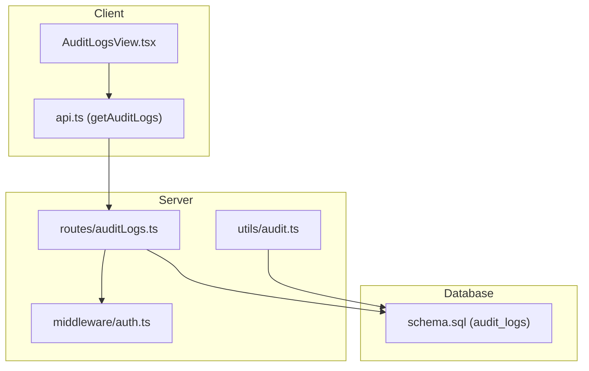
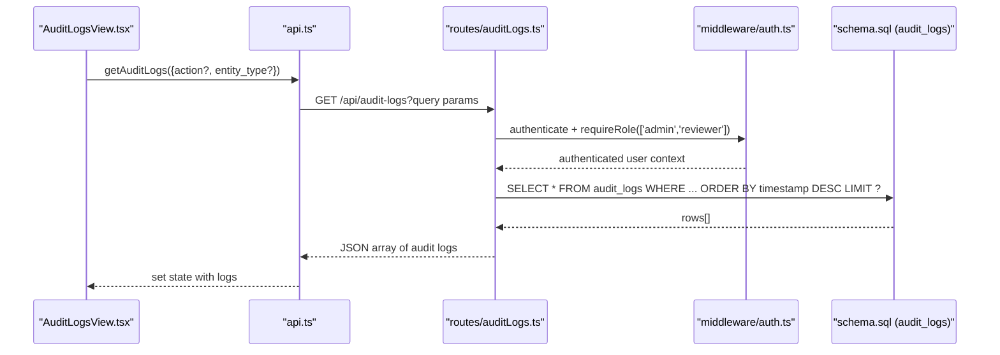
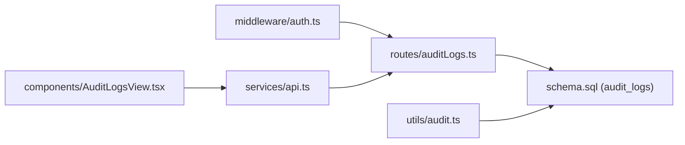

# Audit Logs API

<cite>
**Referenced Files in This Document**
- [auditLogs.ts](file://server/routes/auditLogs.ts)
- [audit.ts](file://server/utils/audit.ts)
- [auth.ts](file://server/middleware/auth.ts)
- [schema.sql](file://database/schema.sql)
- [api.ts](file://src/services/api.ts)
- [index.ts](file://src/types/index.ts)
- [AuditLogsView.tsx](file://src/components/AuditLogsView.tsx)
</cite>

## Table of Contents
1. [Introduction](#introduction)
2. [Project Structure](#project-structure)
3. [Core Components](#core-components)
4. [Architecture Overview](#architecture-overview)
5. [Detailed Component Analysis](#detailed-component-analysis)
6. [Dependency Analysis](#dependency-analysis)
7. [Performance Considerations](#performance-considerations)
8. [Troubleshooting Guide](#troubleshooting-guide)
9. [Conclusion](#conclusion)
10. [Appendices](#appendices)

## Introduction
This document provides comprehensive API documentation for the audit log endpoints that enable system activity tracking and compliance monitoring. It covers available HTTP methods, query parameters, request/response schemas, pagination behavior, and usage examples for compliance reporting and forensic analysis. It also outlines security considerations and operational guidance for retention and rotation of sensitive audit data.

## Project Structure
The audit log feature spans server routes, middleware, database schema, and client-side integration:
- Server route exposes a GET endpoint to retrieve audit logs with optional filters.
- Middleware enforces authentication and role-based access control.
- Database schema defines the audit_logs table and indexes.
- Client service and types define how the frontend consumes the API.

**Diagram sources**
- [auditLogs.ts:1-35](file://server/routes/auditLogs.ts#L1-L35)
- [auth.ts:36-86](file://server/middleware/auth.ts#L36-L86)
- [audit.ts:1-32](file://server/utils/audit.ts#L1-L32)
- [schema.sql:258-283](file://database/schema.sql#L258-L283)
- [api.ts:427-438](file://src/services/api.ts#L427-L438)
- [AuditLogsView.tsx:1-92](file://src/components/AuditLogsView.tsx#L1-L92)

**Section sources**
- [auditLogs.ts:1-35](file://server/routes/auditLogs.ts#L1-L35)
- [auth.ts:36-86](file://server/middleware/auth.ts#L36-L86)
- [schema.sql:258-283](file://database/schema.sql#L258-L283)
- [api.ts:427-438](file://src/services/api.ts#L427-L438)
- [AuditLogsView.tsx:1-92](file://src/components/AuditLogsView.tsx#L1-L92)

## Core Components
- Audit Log Retrieval Endpoint: GET /api/audit-logs
  - Authentication required; restricted to roles admin and reviewer.
  - Query parameters: action, entity_type, limit (default 100).
  - Returns an array of audit log entries sorted by timestamp descending.
- Audit Logging Utility: Inserts audit records into the audit_logs table with user context, action, entity details, old/new values, and IP address.
- Security Middleware: JWT-based authentication and role enforcement.
- Data Model: audit_logs table with JSONB fields for old/new values and indexed columns for performance.

**Section sources**
- [auditLogs.ts:7-32](file://server/routes/auditLogs.ts#L7-L32)
- [audit.ts:3-31](file://server/utils/audit.ts#L3-L31)
- [auth.ts:36-86](file://server/middleware/auth.ts#L36-L86)
- [schema.sql:258-283](file://database/schema.sql#L258-L283)

## Architecture Overview
The audit log retrieval flow involves the client calling the API, which is protected by authentication and authorization middleware, then querying the database and returning results.

**Diagram sources**
- [auditLogs.ts:7-32](file://server/routes/auditLogs.ts#L7-L32)
- [auth.ts:36-86](file://server/middleware/auth.ts#L36-L86)
- [schema.sql:258-283](file://database/schema.sql#L258-L283)
- [api.ts:427-438](file://src/services/api.ts#L427-L438)
- [AuditLogsView.tsx:10-24](file://src/components/AuditLogsView.tsx#L10-L24)

## Detailed Component Analysis

### Audit Log Retrieval Endpoint
- Method: GET
- Path: /api/audit-logs
- Authentication: Required (Bearer token)
- Authorization: Roles admin or reviewer
- Query Parameters:
  - action: string (optional) — filter by action
  - entity_type: string (optional) — filter by entity type
  - limit: number (optional, default 100) — maximum number of rows returned
- Response: Array of audit log objects
- Error Responses:
  - 401 Unauthorized if missing or invalid token
  - 403 Forbidden if user lacks required role
  - 500 Internal Server Error on database or processing failure

Example requests:
- Retrieve last 100 logs: GET /api/audit-logs
- Filter by action: GET /api/audit-logs?action=CREATE
- Filter by entity type: GET /api/audit-logs?entity_type=procurement
- Combined filters with limit: GET /api/audit-logs?action=UPDATE&entity_type=finding&limit=50

Response schema (array items):
- id: number
- user_id: number (nullable)
- username: string (nullable)
- action: string
- entity_type: string
- entity_id: string (nullable)
- old_values: JSONB (nullable)
- new_values: JSONB (nullable)
- ip_address: string (nullable)
- timestamp: string (ISO datetime)

Notes:
- Results are ordered by timestamp descending.
- The limit parameter caps the result set size.
- No offset/pagination beyond limit is implemented in this endpoint.

**Section sources**
- [auditLogs.ts:7-32](file://server/routes/auditLogs.ts#L7-L32)
- [auth.ts:36-86](file://server/middleware/auth.ts#L36-L86)
- [schema.sql:258-283](file://database/schema.sql#L258-L283)
- [api.ts:427-438](file://src/services/api.ts#L427-L438)
- [index.ts:281-292](file://src/types/index.ts#L281-L292)

### Audit Logging Utility
Purpose:
- Records system activities into the audit_logs table with contextual information.

Inputs:
- userId: number | null
- username: string | null
- action: string
- entityType: string
- entityId: string | number | null
- oldValues: any (optional)
- newValues: any (optional)
- ipAddress: string (default '127.0.0.1')

Behavior:
- Inserts a row into audit_logs with provided fields.
- Serializes old/new values to JSON when present.
- Handles errors by logging to console without propagating exceptions.

Usage patterns:
- Call after create/update/delete operations on key entities to capture changes.
- Include user context from authenticated requests where applicable.

**Section sources**
- [audit.ts:3-31](file://server/utils/audit.ts#L3-L31)
- [schema.sql:258-283](file://database/schema.sql#L258-L283)

### Security and Access Control
- Authentication:
  - JWT-based via Bearer token in Authorization header.
  - Token validation enforced before route handlers execute.
- Authorization:
  - Role check restricts access to admin and reviewer roles for audit log retrieval.
- Sensitive Data:
  - IP addresses and user identifiers are recorded; ensure secure storage and access controls.
  - JSONB fields may contain sensitive payloads; treat as confidential.

Error handling:
- 401 for unauthorized or expired tokens.
- 403 for insufficient roles.
- 500 for server-side failures during query execution.

**Section sources**
- [auth.ts:36-86](file://server/middleware/auth.ts#L36-L86)
- [auditLogs.ts:7-32](file://server/routes/auditLogs.ts#L7-L32)

### Client Integration
- Frontend component loads audit logs on mount and displays them in a table.
- API service method builds query parameters and attaches auth headers.
- Types define the shape of audit log entries consumed by the UI.

Typical flow:
- On page load, call getAuditLogs() without filters to show recent activity.
- Optionally pass action/entity_type to narrow results for specific views.

**Section sources**
- [AuditLogsView.tsx:10-24](file://src/components/AuditLogsView.tsx#L10-L24)
- [api.ts:427-438](file://src/services/api.ts#L427-L438)
- [index.ts:281-292](file://src/types/index.ts#L281-L292)

## Dependency Analysis
Key dependencies and relationships:
- Routes depend on middleware for authentication and authorization.
- Routes depend on database layer for queries.
- Utility depends on database layer for inserts.
- Client depends on API service and types for consumption.

**Diagram sources**
- [auth.ts:36-86](file://server/middleware/auth.ts#L36-L86)
- [auditLogs.ts:1-35](file://server/routes/auditLogs.ts#L1-L35)
- [audit.ts:1-32](file://server/utils/audit.ts#L1-L32)
- [api.ts:427-438](file://src/services/api.ts#L427-L438)
- [AuditLogsView.tsx:1-92](file://src/components/AuditLogsView.tsx#L1-L92)
- [schema.sql:258-283](file://database/schema.sql#L258-L283)

**Section sources**
- [auditLogs.ts:1-35](file://server/routes/auditLogs.ts#L1-L35)
- [auth.ts:36-86](file://server/middleware/auth.ts#L36-L86)
- [audit.ts:1-32](file://server/utils/audit.ts#L1-L32)
- [api.ts:427-438](file://src/services/api.ts#L427-L438)
- [AuditLogsView.tsx:1-92](file://src/components/AuditLogsView.tsx#L1-L92)
- [schema.sql:258-283](file://database/schema.sql#L258-L283)

## Performance Considerations
- Indexes:
  - An index exists on user_id to support filtering by user if needed.
  - Timestamp ordering uses ORDER BY timestamp DESC; consider adding an index on created_at/timestamp if queries become frequent.
- Pagination:
  - Current implementation supports limit only; no offset-based pagination. For large datasets, implement cursor or offset-based pagination to avoid heavy responses.
- Query Optimization:
  - Use selective filters (action, entity_type) to reduce result sets.
  - Avoid fetching excessive limits; tune based on UI needs.
- Storage:
  - JSONB fields can grow large; consider archiving or partitioning strategies for long-term retention.

[No sources needed since this section provides general guidance]

## Troubleshooting Guide
Common issues and resolutions:
- 401 Unauthorized:
  - Ensure a valid Bearer token is included in the Authorization header.
  - Verify token expiration and re-authenticate if necessary.
- 403 Forbidden:
  - Confirm the authenticated user has admin or reviewer role.
- 500 Internal Server Error:
  - Check database connectivity and permissions.
  - Inspect server logs for SQL errors or constraint violations.
- Empty Results:
  - Apply appropriate filters (action, entity_type) or increase limit.
  - Verify that audit logs have been written via the utility function.

Operational tips:
- Validate input parameters on the client side to minimize unnecessary requests.
- Log and monitor error responses for proactive maintenance.

**Section sources**
- [auth.ts:36-86](file://server/middleware/auth.ts#L36-L86)
- [auditLogs.ts:7-32](file://server/routes/auditLogs.ts#L7-L32)

## Conclusion
The audit log API provides a secure, role-restricted mechanism to retrieve system activity records for compliance and forensic purposes. With simple query parameters and a clear response schema, it enables efficient auditing workflows. Future enhancements may include advanced filtering (date ranges), offset-based pagination, and robust retention policies to manage growing audit data volumes.

[No sources needed since this section summarizes without analyzing specific files]

## Appendices

### Request/Response Examples
- Get recent audit logs:
  - GET /api/audit-logs
  - Headers: Authorization: Bearer <token>
  - Response: Array of audit log entries
- Filter by action:
  - GET /api/audit-logs?action=DELETE
- Filter by entity type:
  - GET /api/audit-logs?entity_type=inspection
- Combined filters with limit:
  - GET /api/audit-logs?action=UPDATE&entity_type=finding&limit=25

[No sources needed since this section provides general guidance]

### Compliance Reporting and Forensic Analysis Use Cases
- Compliance reporting:
  - Aggregate logs by action and entity_type to produce periodic reports on system changes.
  - Export filtered datasets for auditors using date range filters (future enhancement).
- Forensic analysis:
  - Investigate suspicious actions by filtering on specific users or IPs.
  - Correlate old/new values to understand data modifications and detect anomalies.

[No sources needed since this section provides general guidance]

### Retention Policies, Log Rotation, and Security Considerations
- Retention policy:
  - Define a lifecycle policy to archive or purge older audit logs based on regulatory requirements.
- Log rotation:
  - Implement database-level partitioning or archival jobs to rotate historical data efficiently.
- Security considerations:
  - Restrict access to audit logs to authorized roles only.
  - Encrypt sensitive fields at rest if required by policy.
  - Monitor access to audit logs for potential misuse.
  - Sanitize and validate inputs to prevent injection attacks.

[No sources needed since this section provides general guidance]