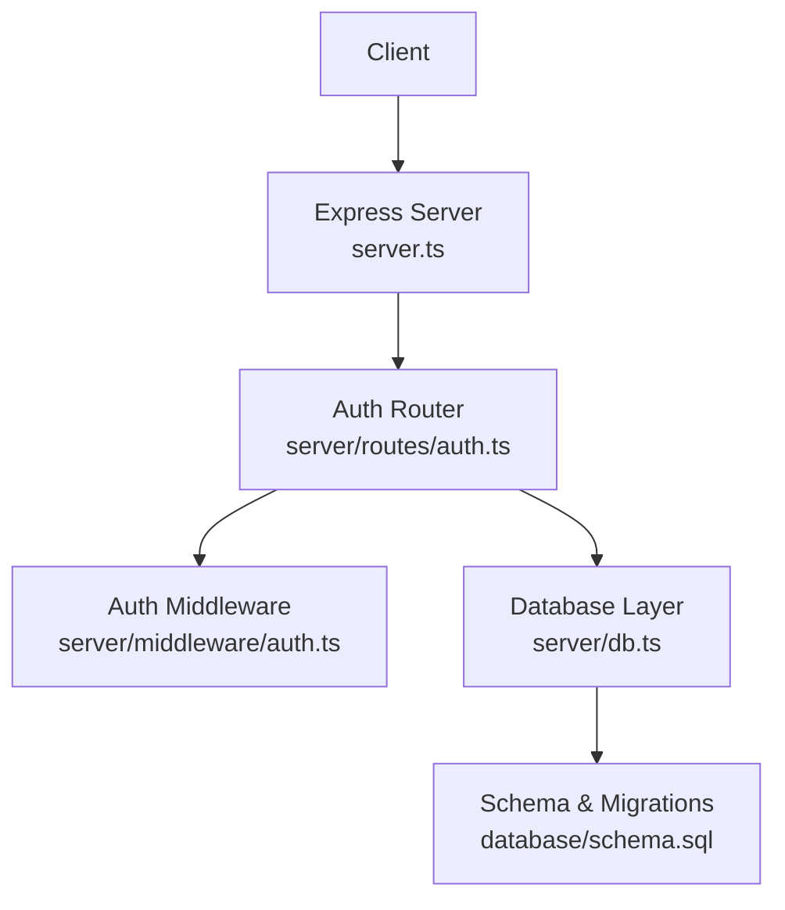
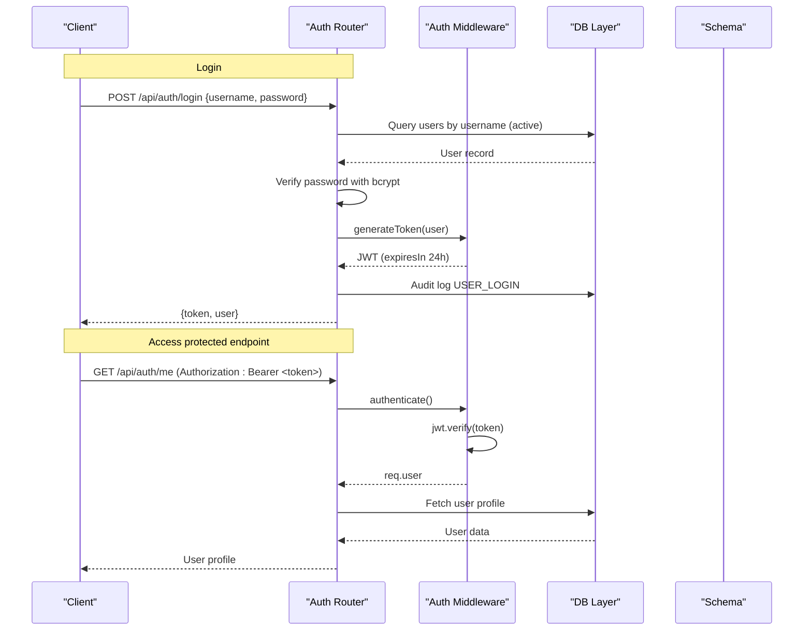
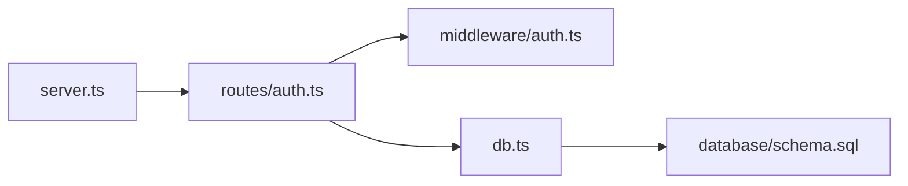

# Authentication API

<cite>
**Referenced Files in This Document**
- [server.ts](file://server.ts)
- [auth.ts](file://server/routes/auth.ts)
- [auth.ts](file://server/middleware/auth.ts)
- [db.ts](file://server/db.ts)
- [schema.sql](file://database/schema.sql)
- [package.json](file://package.json)
</cite>

## Table of Contents
1. [Introduction](#introduction)
2. [Project Structure](#project-structure)
3. [Core Components](#core-components)
4. [Architecture Overview](#architecture-overview)
5. [Detailed Component Analysis](#detailed-component-analysis)
6. [Dependency Analysis](#dependency-analysis)
7. [Performance Considerations](#performance-considerations)
8. [Troubleshooting Guide](#troubleshooting-guide)
9. [Conclusion](#conclusion)

## Introduction
This document provides comprehensive API documentation for the authentication endpoints of the NVC Procurement Monitoring & Inspection System. It covers login, current user retrieval, and user management operations with role-based access control. It also explains JWT token generation and validation, password hashing with bcryptjs, middleware usage, and security considerations.

## Project Structure
The authentication functionality is implemented as an Express router mounted under /api/auth. The server initializes the database, mounts routes, and serves static assets. Authentication middleware validates tokens and enforces roles.

**Diagram sources**
- [server.ts:23-55](file://server.ts#L23-L55)
- [auth.ts:1-228](file://server/routes/auth.ts#L1-L228)
- [auth.ts:1-87](file://server/middleware/auth.ts#L1-L87)
- [db.ts:10-97](file://server/db.ts#L10-L97)
- [schema.sql:67-81](file://database/schema.sql#L67-L81)

**Section sources**
- [server.ts:23-55](file://server.ts#L23-L55)
- [auth.ts:1-228](file://server/routes/auth.ts#L1-L228)
- [auth.ts:1-87](file://server/middleware/auth.ts#L1-L87)
- [db.ts:10-97](file://server/db.ts#L10-L97)
- [schema.sql:67-81](file://database/schema.sql#L67-L81)

## Core Components
- Authentication router: Implements login, profile retrieval, and user CRUD endpoints.
- Middleware: Provides token generation, authentication, optional authentication, and role-based authorization.
- Database layer: Manages connection (external PostgreSQL or embedded PGlite), schema initialization, migrations, and query execution.
- Schema: Defines users, roles, offices, and related tables used by authentication flows.

Key responsibilities:
- POST /api/auth/login: Authenticates a user, verifies credentials, logs audit, issues JWT.
- GET /api/auth/me: Returns current authenticated user profile.
- GET /api/auth/users: Lists all users (admin only).
- POST /api/auth/users: Creates a new user (admin only), hashes password.
- PUT /api/auth/users/:id: Updates user details (admin only), optionally updates password hash.

Security features:
- Passwords are hashed using bcryptjs before storage and verified on login.
- JWT tokens include user identity and role, signed with a secret from environment variables, and expire after 24 hours.
- Role-based access control restricts sensitive operations to admin users.

**Section sources**
- [auth.ts:9-80](file://server/routes/auth.ts#L9-L80)
- [auth.ts:82-104](file://server/routes/auth.ts#L82-L104)
- [auth.ts:106-121](file://server/routes/auth.ts#L106-L121)
- [auth.ts:123-163](file://server/routes/auth.ts#L123-L163)
- [auth.ts:165-225](file://server/routes/auth.ts#L165-L225)
- [auth.ts:20-58](file://server/middleware/auth.ts#L20-L58)
- [auth.ts:74-86](file://server/middleware/auth.ts#L74-L86)
- [schema.sql:67-81](file://database/schema.sql#L67-L81)

## Architecture Overview
Authentication flow overview:
- Login: Client sends username/password; server verifies against stored hash, generates JWT, returns token and user info.
- Protected endpoints: Clients must include Authorization header with Bearer token; middleware decodes and attaches user context.
- Role enforcement: Admin-only endpoints check user role before processing.

**Diagram sources**
- [auth.ts:9-80](file://server/routes/auth.ts#L9-L80)
- [auth.ts:82-104](file://server/routes/auth.ts#L82-L104)
- [auth.ts:20-58](file://server/middleware/auth.ts#L20-L58)
- [db.ts:151-169](file://server/db.ts#L151-L169)
- [schema.sql:67-81](file://database/schema.sql#L67-L81)

## Detailed Component Analysis

### POST /api/auth/login
Purpose: Authenticate a user and issue a JWT token.

Request:
- Method: POST
- Path: /api/auth/login
- Body:
  - username: string (required)
  - password: string (required)

Response:
- Success (200):
  - message: string
  - token: string (JWT)
  - user: object containing id, username, full_name, email, role, role_display_name, designation, phone, office_id, office_name
- Validation error (400):
  - error: string
- Unauthorized (401):
  - error: string (invalid credentials or inactive user)
- Server error (500):
  - error: string

Behavior:
- Validates presence of username and password.
- Queries active user by username.
- Compares provided password with stored bcrypt hash.
- Generates JWT including user identity and role.
- Logs audit entry for login.

Error handling:
- Missing fields return 400.
- Invalid credentials or inactive user return 401.
- Unexpected errors return 500.

Security notes:
- Passwords are never returned; only hashed values are stored.
- JWT includes minimal user claims and expires in 24 hours.

Example request:
- POST /api/auth/login
- Body: {"username": "admin", "password": "your_password"}

Example response (success):
- { "message": "...", "token": "<jwt>", "user": { ... } }

**Section sources**
- [auth.ts:9-80](file://server/routes/auth.ts#L9-L80)
- [auth.ts:20-58](file://server/middleware/auth.ts#L20-L58)
- [schema.sql:67-81](file://database/schema.sql#L67-L81)

### GET /api/auth/me
Purpose: Retrieve the current authenticated user’s profile.

Authorization:
- Requires valid JWT via Authorization header (Bearer token).

Request:
- Method: GET
- Path: /api/auth/me

Response:
- Success (200):
  - User object with id, username, full_name, email, role, role_display_name, designation, phone, office_id, office_name
- Not found (404):
  - error: string (user not found or inactive)
- Unauthorized (401):
  - error: string (missing/invalid token)
- Server error (500):
  - error: string

Behavior:
- Middleware authenticates request and attaches user context.
- Retrieves user profile joined with roles and offices.

**Section sources**
- [auth.ts:82-104](file://server/routes/auth.ts#L82-L104)
- [auth.ts:36-58](file://server/middleware/auth.ts#L36-L58)

### GET /api/auth/users
Purpose: List all users.

Authorization:
- Requires valid JWT and admin role.

Request:
- Method: GET
- Path: /api/auth/users

Response:
- Success (200):
  - Array of user objects with id, username, full_name, email, role, role_display_name, designation, phone, is_active, created_at, office_name
- Unauthorized (401):
  - error: string (missing/invalid token)
- Forbidden (403):
  - error: string (insufficient role)
- Server error (500):
  - error: string

Behavior:
- Middleware authenticates and checks role equals admin.
- Returns list of users ordered by id.

**Section sources**
- [auth.ts:106-121](file://server/routes/auth.ts#L106-L121)
- [auth.ts:74-86](file://server/middleware/auth.ts#L74-L86)

### POST /api/auth/users
Purpose: Create a new user.

Authorization:
- Requires valid JWT and admin role.

Request:
- Method: POST
- Path: /api/auth/users
- Body:
  - username: string (required)
  - password: string (required)
  - full_name: string (required)
  - email: string (required)
  - role: string (required)
  - designation: string (optional)
  - phone: string (optional)
  - office_id: number (optional)

Response:
- Created (201):
  - New user object with id, username, full_name, email, role, designation, phone, is_active, created_at
- Validation error (400):
  - error: string (missing required fields)
- Conflict (400):
  - error: string (username or email already exists)
- Unauthorized (401):
  - error: string (missing/invalid token)
- Forbidden (403):
  - error: string (insufficient role)
- Server error (500):
  - error: string

Behavior:
- Validates required fields.
- Checks uniqueness of username and email.
- Hashes password with bcrypt before storing.
- Inserts user into database.
- Logs audit entry for user creation.

**Section sources**
- [auth.ts:123-163](file://server/routes/auth.ts#L123-L163)
- [auth.ts:74-86](file://server/middleware/auth.ts#L74-L86)
- [schema.sql:67-81](file://database/schema.sql#L67-L81)

### PUT /api/auth/users/:id
Purpose: Update an existing user’s details.

Authorization:
- Requires valid JWT and admin role.

Request:
- Method: PUT
- Path: /api/auth/users/:id
- Body:
  - full_name: string (optional)
  - email: string (optional)
  - role: string (optional)
  - designation: string (optional)
  - phone: string (optional)
  - office_id: number (optional)
  - is_active: boolean (optional)
  - password: string (optional)

Response:
- Success (200):
  - Updated user object with id, username, full_name, email, role, designation, phone, is_active, updated_at
- Not found (404):
  - error: string (user not found)
- Unauthorized (401):
  - error: string (missing/invalid token)
- Forbidden (403):
  - error: string (insufficient role)
- Server error (500):
  - error: string

Behavior:
- Retrieves current user record.
- Optionally updates password by hashing if provided.
- Updates specified fields while preserving others.
- Logs audit entry with old and new values.

**Section sources**
- [auth.ts:165-225](file://server/routes/auth.ts#L165-L225)
- [auth.ts:74-86](file://server/middleware/auth.ts#L74-L86)

### JWT Token Generation and Validation
- Generation:
  - Payload includes id, username, full_name, email, role, designation, office_id.
  - Signed with secret from environment variable JWT_SECRET.
  - Expiration set to 24 hours.
- Validation:
  - Extracted from Authorization header (Bearer) or query parameter token.
  - Verified using the same secret.
  - On success, attaches decoded user to request context.
  - On failure, returns 401 with appropriate error message.

Token expiration handling:
- Expired or invalid tokens result in 401 responses instructing re-login.

**Section sources**
- [auth.ts:20-58](file://server/middleware/auth.ts#L20-L58)

### Role-Based Access Control (RBAC)
- Roles supported:
  - Defined in roles table; typical roles include admin, inspector, reviewer, public_officer.
- Enforcement:
  - requireRole middleware checks that the authenticated user’s role is included in allowedRoles array.
  - If missing or insufficient, returns 403 with error message.

Usage:
- Admin-only endpoints: GET /api/auth/users, POST /api/auth/users, PUT /api/auth/users/:id.

**Section sources**
- [auth.ts:74-86](file://server/middleware/auth.ts#L74-L86)
- [schema.sql:8-14](file://database/schema.sql#L8-L14)

### Password Hashing with bcryptjs
- Storage:
  - Passwords are hashed using bcrypt with a salt rounds value of 10 during user creation and update when password is provided.
- Verification:
  - During login, provided password is compared against stored hash using bcrypt.compare.

Security considerations:
- Never store plaintext passwords.
- Use strong salt rounds for hashing.
- Avoid logging sensitive data.

**Section sources**
- [auth.ts:138-144](file://server/routes/auth.ts#L138-L144)
- [auth.ts:178-181](file://server/routes/auth.ts#L178-L181)
- [auth.ts:33-37](file://server/routes/auth.ts#L33-L37)
- [package.json:24](file://package.json#L24)

### Security Considerations
- Environment configuration:
  - Set a strong JWT_SECRET via environment variables.
- Transport security:
  - Use HTTPS in production to protect tokens in transit.
- Input validation:
  - Validate and sanitize inputs to prevent injection and ensure integrity.
- Rate limiting:
  - Consider adding rate limiting to login to mitigate brute-force attempts.
- Audit logging:
  - Critical actions like login, create, and update are logged for accountability.

**Section sources**
- [auth.ts:36-58](file://server/middleware/auth.ts#L36-L58)
- [auth.ts:49-58](file://server/routes/auth.ts#L49-L58)
- [auth.ts:147-156](file://server/routes/auth.ts#L147-L156)
- [auth.ts:209-218](file://server/routes/auth.ts#L209-L218)

## Dependency Analysis
High-level dependencies:
- Express server mounts auth router under /api/auth.
- Auth router depends on middleware for authentication and role checks.
- Database layer abstracts queries and supports external PostgreSQL or embedded PGlite.
- Schema defines users, roles, and related entities used by authentication flows.

**Diagram sources**
- [server.ts:23-55](file://server.ts#L23-L55)
- [auth.ts:1-228](file://server/routes/auth.ts#L1-L228)
- [auth.ts:1-87](file://server/middleware/auth.ts#L1-L87)
- [db.ts:10-97](file://server/db.ts#L10-L97)
- [schema.sql:67-81](file://database/schema.sql#L67-L81)

**Section sources**
- [server.ts:23-55](file://server.ts#L23-L55)
- [auth.ts:1-228](file://server/routes/auth.ts#L1-L228)
- [auth.ts:1-87](file://server/middleware/auth.ts#L1-L87)
- [db.ts:10-97](file://server/db.ts#L10-L97)
- [schema.sql:67-81](file://database/schema.sql#L67-L81)

## Performance Considerations
- Database connections:
  - External PostgreSQL uses connection pooling; embedded PGlite initializes once per process.
- Query efficiency:
  - Queries select only necessary fields and use indexed columns where applicable.
- Token operations:
  - JWT verification is lightweight; avoid unnecessary payload size.
- Logging:
  - Audit logs are written for critical actions; ensure logging does not become a bottleneck.

[No sources needed since this section provides general guidance]

## Troubleshooting Guide
Common issues and resolutions:
- 401 Unauthorized:
  - Missing or invalid Authorization header; ensure Bearer token is present and valid.
  - Expired token; refresh by re-authenticating.
- 403 Forbidden:
  - Insufficient role; verify user has admin role for restricted endpoints.
- 400 Bad Request:
  - Missing required fields in user creation/update; validate request body.
  - Duplicate username/email; choose unique values.
- 404 Not Found:
  - User not found during profile retrieval or update; verify user id.
- 500 Internal Server Error:
  - Database or unexpected errors; check logs and database connectivity.

Debugging tips:
- Confirm JWT_SECRET is correctly configured.
- Ensure database schema is initialized and migrations applied.
- Review audit logs for failed login attempts and unauthorized access.

**Section sources**
- [auth.ts:36-58](file://server/middleware/auth.ts#L36-L58)
- [auth.ts:74-86](file://server/middleware/auth.ts#L74-L86)
- [auth.ts:123-163](file://server/routes/auth.ts#L123-L163)
- [auth.ts:165-225](file://server/routes/auth.ts#L165-L225)

## Conclusion
The authentication API provides secure login, profile retrieval, and user management with robust role-based access control. It leverages bcrypt for password hashing and JWT for session management with a 24-hour expiration. Proper middleware usage ensures only authenticated and authorized users can access sensitive endpoints. Follow the documented request/response schemas and security best practices to integrate clients effectively.

[No sources needed since this section summarizes without analyzing specific files]