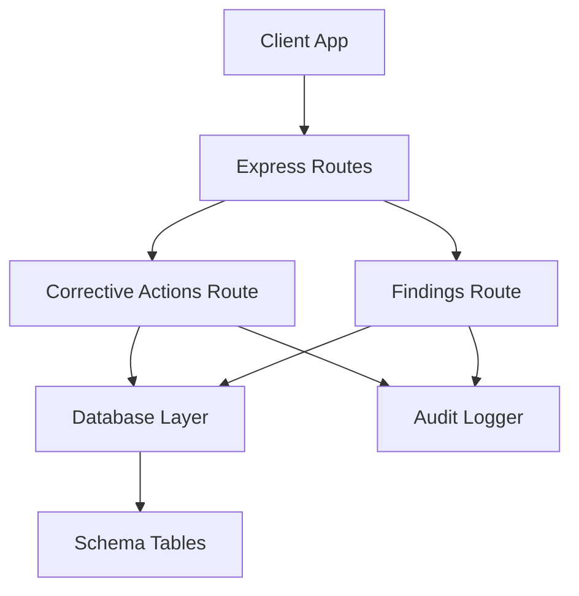
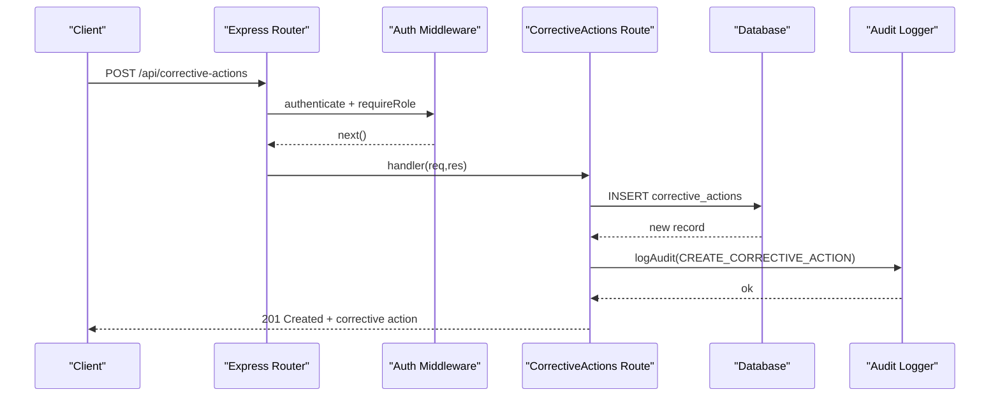
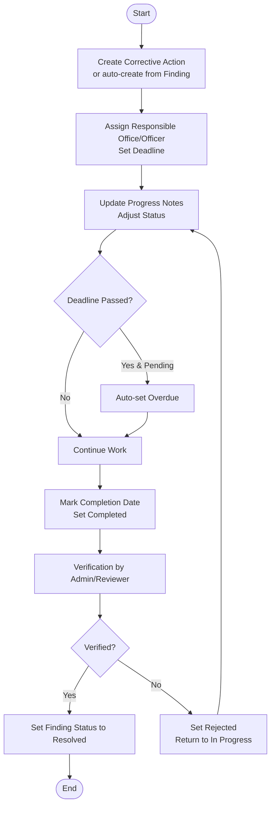
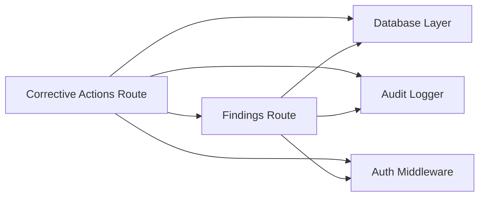

# Corrective Actions API

<cite>
**Referenced Files in This Document**
- [correctiveActions.ts](file://server/routes/correctiveActions.ts)
- [findings.ts](file://server/routes/findings.ts)
- [auth.ts](file://server/middleware/auth.ts)
- [audit.ts](file://server/utils/audit.ts)
- [db.ts](file://server/db.ts)
- [schema.sql](file://database/schema.sql)
- [index.ts](file://src/types/index.ts)
</cite>

## Table of Contents
1. Introduction
2. Project Structure
3. Core Components
4. Architecture Overview
5. Detailed Component Analysis
6. Dependency Analysis
7. Performance Considerations
8. Troubleshooting Guide
9. Conclusion
10. Appendices

## Introduction
This document provides detailed API documentation for corrective action management endpoints covering assignment, tracking, and verification workflows. It documents HTTP methods for creating corrective actions, assigning responsibilities, setting deadlines, managing closure processes, and integrating with findings and audit systems. It also outlines status transitions, request/response schemas, lifecycle examples, deadline management, and the current state of notifications and escalation mechanisms.

## Project Structure
The corrective action feature is implemented as an Express route module that interacts with a PostgreSQL database (either external or embedded PGlite). The schema defines entities for procurements, inspections, findings, and corrective actions, along with audit logging. Authentication and authorization are enforced via middleware.

**Diagram sources**
- [correctiveActions.ts:1-251](file://server/routes/correctiveActions.ts#L1-L251)
- [findings.ts:1-335](file://server/routes/findings.ts#L1-L335)
- [db.ts:1-181](file://server/db.ts#L1-L181)
- [schema.sql:200-244](file://database/schema.sql#L200-L244)
- [audit.ts:1-32](file://server/utils/audit.ts#L1-L32)

**Section sources**
- [correctiveActions.ts:1-251](file://server/routes/correctiveActions.ts#L1-L251)
- [findings.ts:1-335](file://server/routes/findings.ts#L1-L335)
- [db.ts:1-181](file://server/db.ts#L1-L181)
- [schema.sql:200-244](file://database/schema.sql#L200-L244)
- [audit.ts:1-32](file://server/utils/audit.ts#L1-L32)

## Core Components
- Corrective Actions Route: Provides endpoints to list, create, update, and verify corrective actions. Includes overdue detection and integration with findings status on verification.
- Findings Route: Supports creation of findings and automatic generation of corrective actions when recommended corrective action is provided.
- Database Layer: Unified query interface supporting both external PostgreSQL and embedded PGlite; executes schema and migrations at startup.
- Authentication Middleware: JWT-based authentication and role-based access control for protected routes.
- Audit Logging: Records user actions, entity changes, and IP addresses for compliance and traceability.

**Section sources**
- [correctiveActions.ts:1-251](file://server/routes/correctiveActions.ts#L1-L251)
- [findings.ts:1-335](file://server/routes/findings.ts#L1-L335)
- [db.ts:1-181](file://server/db.ts#L1-L181)
- [auth.ts:1-87](file://server/middleware/auth.ts#L1-L87)
- [audit.ts:1-32](file://server/utils/audit.ts#L1-L32)

## Architecture Overview
The API follows a layered architecture:
- Presentation layer: Express routes handling HTTP requests and responses.
- Business logic: Validation, status transition rules, and cross-entity updates (e.g., updating finding status upon verification).
- Data access: Centralized database queries using a unified interface.
- Cross-cutting concerns: Authentication, authorization, and audit logging.

**Diagram sources**
- [correctiveActions.ts:68-121](file://server/routes/correctiveActions.ts#L68-L121)
- [auth.ts:36-86](file://server/middleware/auth.ts#L36-L86)
- [audit.ts:1-32](file://server/utils/audit.ts#L1-L32)
- [db.ts:151-169](file://server/db.ts#L151-L169)

## Detailed Component Analysis

### Endpoints: Corrective Actions
- List corrective actions
  - Method: GET
  - Path: /api/corrective-actions
  - Query parameters:
    - status: filter by status
    - finding_id: filter by finding
    - inspection_id: filter by inspection
    - office_id: filter by procurement office
    - overdue: true/false to include only overdue items
  - Response: Array of corrective action records with joined fields (finding code/title/risk, procurement details, office name, is_overdue flag)
  - Notes: Overdue calculation considers deadline and non-completed statuses
  - Security: Public read (no auth required in route), but typically used within authenticated contexts

- Create corrective action
  - Method: POST
  - Path: /api/corrective-actions
  - Headers: Authorization: Bearer <token>
  - Roles: admin, inspector, reviewer
  - Request body fields:
    - finding_id (required)
    - inspection_id (optional)
    - corrective_action_text (required)
    - responsible_office (optional)
    - responsible_officer (optional)
    - deadline (optional)
    - status (optional; defaults to pending)
  - Response: Created corrective action object
  - Side effects: Audit log entry created

- Update corrective action
  - Method: PUT
  - Path: /api/corrective-actions/:id
  - Headers: Authorization: Bearer <token>
  - Roles: authenticated users (inspector/admin/reviewer based on context)
  - Request body fields:
    - corrective_action_text (optional)
    - responsible_office (optional)
    - responsible_officer (optional)
    - deadline (optional)
    - progress_notes (optional)
    - completion_date (optional)
    - status (optional)
  - Behavior:
    - Auto-overdue detection: If effective deadline is past and status not completed/verified, pending becomes overdue
    - Updates updated_at timestamp
  - Response: Updated corrective action object
  - Side effects: Audit log entry created

- Verify corrective action
  - Method: PUT
  - Path: /api/corrective-actions/:id/verify
  - Headers: Authorization: Bearer <token>
  - Roles: admin, reviewer
  - Request body fields:
    - verification_status: Verified or Rejected
    - verification_remarks (optional)
  - Behavior:
    - Sets verification_status, verification_remarks, verification_officer, verified_at
    - On Verified: sets corrective action status to verified and updates associated finding status to Resolved
  - Response: Updated corrective action object
  - Side effects: Audit log entry created

**Section sources**
- [correctiveActions.ts:8-66](file://server/routes/correctiveActions.ts#L8-L66)
- [correctiveActions.ts:68-121](file://server/routes/correctiveActions.ts#L68-L121)
- [correctiveActions.ts:123-193](file://server/routes/correctiveActions.ts#L123-L193)
- [correctiveActions.ts:195-248](file://server/routes/correctiveActions.ts#L195-L248)

### Endpoints: Findings Integration
- Create finding with optional auto corrective action
  - Method: POST
  - Path: /api/findings
  - Roles: admin, inspector
  - Request body includes fields such as title, description, procurement_id, risk_level, estimated_financial_impact, responsible_office/officer, recommended_corrective_action, deadline, status, inspector_remarks
  - Behavior:
    - If recommended_corrective_action is provided, automatically creates a corrective action linked to the finding
  - Response: Created finding object
  - Side effects: Audit log entry created

- Get single finding with associated corrective actions
  - Method: GET
  - Path: /api/findings/:id
  - Response: Finding object plus array of corrective actions

- Update/Delete findings
  - Methods: PUT / DELETE
  - Paths: /api/findings/:id
  - Roles: admin, inspector (update); admin (delete)
  - Behavior: Updates fields including deadline and status; deletes finding and logs audit

**Section sources**
- [findings.ts:8-76](file://server/routes/findings.ts#L8-L76)
- [findings.ts:78-120](file://server/routes/findings.ts#L78-L120)
- [findings.ts:122-221](file://server/routes/findings.ts#L122-L221)
- [findings.ts:223-332](file://server/routes/findings.ts#L223-L332)

### Data Models and Schemas
- CorrectiveAction model fields include:
  - id, finding_id, finding_code, finding_title, finding_risk_level
  - inspection_id, procurement_id, procurement_title, procurement_id_code
  - office_name
  - corrective_action_text
  - responsible_office, responsible_officer
  - deadline, progress_notes, completion_date
  - status: Pending, In Progress, Completed, Verified, Overdue
  - verification_status: Unverified, Verified, Rejected
  - verification_remarks, verification_officer, verified_at
  - is_overdue (computed in list endpoint)

- Status values and transitions:
  - Creation default: Pending
  - Update may set status explicitly; if deadline passed and still pending, auto-transition to Overdue
  - Verification can set status to Verified; on Verified, associated finding status becomes Resolved

- Related tables:
  - findings: links to procurements and optionally inspections/checklist items
  - corrective_actions: links to findings and optionally inspections
  - audit_logs: captures all mutations

**Section sources**
- [index.ts:237-260](file://src/types/index.ts#L237-L260)
- [schema.sql:200-244](file://database/schema.sql#L200-L244)
- [correctiveActions.ts:144-151](file://server/routes/correctiveActions.ts#L144-L151)
- [correctiveActions.ts:222-231](file://server/routes/correctiveActions.ts#L222-L231)

### Workflows and Lifecycle Examples
- Creating a corrective action from a finding
  - Inspector creates a finding with recommended corrective action; system auto-creates a corrective action
  - Alternatively, admin/inspector/reviewer directly creates a corrective action linked to a finding

- Assigning responsibilities and deadlines
  - Set responsible_office and responsible_officer during creation or update
  - Set deadline; system auto-detects overdue if past due date and not completed/verified

- Tracking progress
  - Update progress_notes and status to reflect work done
  - Mark completion_date when finished

- Verification and closure
  - Reviewer verifies corrective action; on Verified, finding status updates to Resolved
  - Audit log records verification details

**Diagram sources**
- [correctiveActions.ts:68-121](file://server/routes/correctiveActions.ts#L68-L121)
- [correctiveActions.ts:123-193](file://server/routes/correctiveActions.ts#L123-L193)
- [correctiveActions.ts:195-248](file://server/routes/correctiveActions.ts#L195-L248)
- [findings.ts:122-221](file://server/routes/findings.ts#L122-L221)

### Authentication and Authorization
- All write operations require authentication via JWT token in Authorization header or query parameter
- Role-based access control:
  - Create/update corrective actions: admin, inspector, reviewer
  - Verify corrective actions: admin, reviewer
  - Create/update/delete findings: admin, inspector (create/update); admin (delete)

**Section sources**
- [auth.ts:36-86](file://server/middleware/auth.ts#L36-L86)
- [correctiveActions.ts:68-121](file://server/routes/correctiveActions.ts#L68-L121)
- [correctiveActions.ts:195-248](file://server/routes/correctiveActions.ts#L195-L248)
- [findings.ts:122-221](file://server/routes/findings.ts#L122-L221)
- [findings.ts:223-332](file://server/routes/findings.ts#L223-L332)

### Audit Logging
- Every create/update/verify operation logs:
  - User ID and username
  - Action type (e.g., CREATE_CORRECTIVE_ACTION, UPDATE_CORRECTIVE_ACTION, VERIFY_CORRECTIVE_ACTION)
  - Entity type and ID
  - Old/new values (JSON)
  - IP address

**Section sources**
- [audit.ts:1-32](file://server/utils/audit.ts#L1-L32)
- [correctiveActions.ts:105-114](file://server/routes/correctiveActions.ts#L105-L114)
- [correctiveActions.ts:177-186](file://server/routes/correctiveActions.ts#L177-L186)
- [correctiveActions.ts:233-242](file://server/routes/correctiveActions.ts#L233-L242)
- [findings.ts:205-214](file://server/routes/findings.ts#L205-L214)
- [findings.ts:286-295](file://server/routes/findings.ts#L286-L295)
- [findings.ts:317-325](file://server/routes/findings.ts#L317-L325)

## Dependency Analysis
- Corrective actions depend on findings and optionally inspections and procurements for enriched listing
- Findings can trigger creation of corrective actions
- Audit logging depends on database layer
- Authentication middleware protects sensitive endpoints

**Diagram sources**
- [correctiveActions.ts:1-251](file://server/routes/correctiveActions.ts#L1-L251)
- [findings.ts:1-335](file://server/routes/findings.ts#L1-L335)
- [db.ts:1-181](file://server/db.ts#L1-L181)
- [auth.ts:1-87](file://server/middleware/auth.ts#L1-L87)
- [audit.ts:1-32](file://server/utils/audit.ts#L1-L32)

**Section sources**
- [correctiveActions.ts:1-251](file://server/routes/correctiveActions.ts#L1-L251)
- [findings.ts:1-335](file://server/routes/findings.ts#L1-L335)
- [db.ts:1-181](file://server/db.ts#L1-L181)
- [auth.ts:1-87](file://server/middleware/auth.ts#L1-L87)
- [audit.ts:1-32](file://server/utils/audit.ts#L1-L32)

## Performance Considerations
- Use query filters (status, finding_id, inspection_id, office_id, overdue) to reduce result sets
- Database indexes exist for common lookup patterns (e.g., idx_findings_inspection, idx_corrective_actions_finding)
- Avoid excessive joins in custom queries; leverage existing joins in list endpoints
- Batch updates where possible to minimize round trips

[No sources needed since this section provides general guidance]

## Troubleshooting Guide
- Common errors:
  - 401 Unauthorized: Missing or invalid JWT token
  - 403 Forbidden: Insufficient roles for the requested operation
  - 404 Not Found: Corrective action or finding does not exist
  - 500 Server Error: Database or internal processing error

- Debugging steps:
  - Validate request headers and payload fields
  - Check audit logs for action traces
  - Confirm database connectivity and schema initialization
  - Review error messages returned by endpoints

**Section sources**
- [auth.ts:36-86](file://server/middleware/auth.ts#L36-L86)
- [correctiveActions.ts:62-66](file://server/routes/correctiveActions.ts#L62-L66)
- [correctiveActions.ts:117-120](file://server/routes/correctiveActions.ts#L117-L120)
- [correctiveActions.ts:189-192](file://server/routes/correctiveActions.ts#L189-L192)
- [correctiveActions.ts:245-247](file://server/routes/correctiveActions.ts#L245-L247)
- [findings.ts:72-75](file://server/routes/findings.ts#L72-L75)
- [findings.ts:117-119](file://server/routes/findings.ts#L117-L119)
- [findings.ts:217-220](file://server/routes/findings.ts#L217-L220)
- [findings.ts:298-301](file://server/routes/findings.ts#L298-L301)
- [findings.ts:329-331](file://server/routes/findings.ts#L329-L331)

## Conclusion
The Corrective Actions API provides robust endpoints for end-to-end management of corrective actions, including creation, assignment, deadline tracking, progress updates, and verification workflows. It integrates tightly with findings to ensure resolution linkage and maintains comprehensive audit trails. While notification and escalation mechanisms are not currently implemented in the backend, the system supports overdues and verification flows that can be extended for automated alerts and escalations.

[No sources needed since this section summarizes without analyzing specific files]

## Appendices

### API Reference Summary

- List corrective actions
  - GET /api/corrective-actions?status=&finding_id=&inspection_id=&office_id=&overdue=
  - Response: Array of corrective action objects with joined fields

- Create corrective action
  - POST /api/corrective-actions
  - Body: { finding_id, inspection_id?, corrective_action_text, responsible_office?, responsible_officer?, deadline?, status? }
  - Response: Created corrective action

- Update corrective action
  - PUT /api/corrective-actions/:id
  - Body: { corrective_action_text?, responsible_office?, responsible_officer?, deadline?, progress_notes?, completion_date?, status? }
  - Response: Updated corrective action

- Verify corrective action
  - PUT /api/corrective-actions/:id/verify
  - Body: { verification_status, verification_remarks? }
  - Response: Updated corrective action; finding status set to Resolved if verified

- Create finding (auto corrective action)
  - POST /api/findings
  - Body: { inspection_id?, procurement_id, checklist_item_id?, checklist_result_id?, title, description, legal_reference?, evidence_summary?, possible_irregularity?, risk_level?, estimated_financial_impact?, responsible_office?, responsible_officer?, recommended_corrective_action?, deadline?, status?, inspector_remarks? }
  - Response: Created finding; optional corrective action created if recommended_corrective_action provided

- Get finding with corrective actions
  - GET /api/findings/:id
  - Response: Finding object plus corrective_actions array

**Section sources**
- [correctiveActions.ts:8-66](file://server/routes/correctiveActions.ts#L8-L66)
- [correctiveActions.ts:68-121](file://server/routes/correctiveActions.ts#L68-L121)
- [correctiveActions.ts:123-193](file://server/routes/correctiveActions.ts#L123-L193)
- [correctiveActions.ts:195-248](file://server/routes/correctiveActions.ts#L195-L248)
- [findings.ts:122-221](file://server/routes/findings.ts#L122-L221)
- [findings.ts:78-120](file://server/routes/findings.ts#L78-L120)

### Notification and Escalation Mechanisms
- Current implementation: No built-in email or alerting service for notifications or escalations
- Recommended extension points:
  - Trigger notifications on overdue detection during updates or scheduled jobs
  - Send alerts to responsible offices/officers when deadlines are missed
  - Implement escalation workflows based on risk level and overdue duration
  - Integrate with external messaging services (email/SMS) via environment-configured providers

[No sources needed since this section provides general guidance]