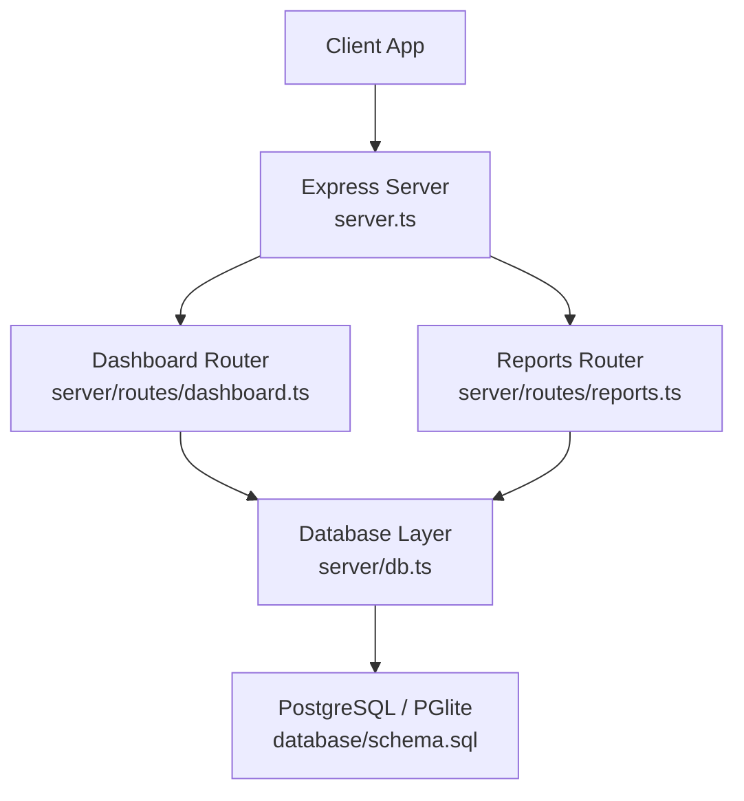
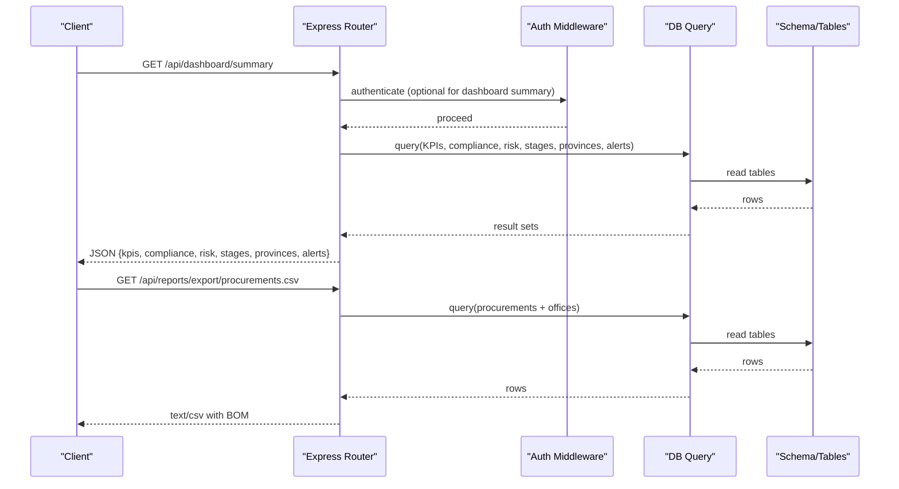
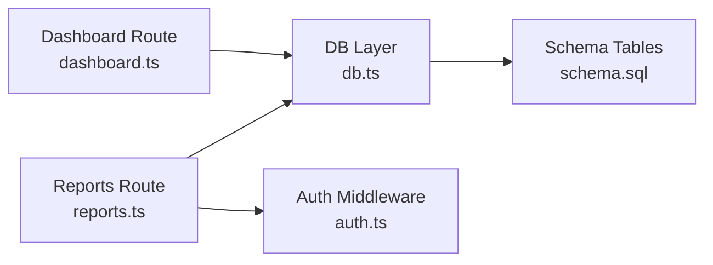

# Dashboard & Reports API

<cite>
**Referenced Files in This Document**
- [server.ts](file://server.ts)
- [dashboard.ts](file://server/routes/dashboard.ts)
- [reports.ts](file://server/routes/reports.ts)
- [auth.ts](file://server/middleware/auth.ts)
- [db.ts](file://server/db.ts)
- [schema.sql](file://database/schema.sql)
- [index.ts](file://src/types/index.ts)
- [api.ts](file://src/services/api.ts)
</cite>

## Table of Contents
1. [Introduction](#introduction)
2. [Project Structure](#project-structure)
3. [Core Components](#core-components)
4. [Architecture Overview](#architecture-overview)
5. [Detailed Component Analysis](#detailed-component-analysis)
6. [Dependency Analysis](#dependency-analysis)
7. [Performance Considerations](#performance-considerations)
8. [Troubleshooting Guide](#troubleshooting-guide)
9. [Conclusion](#conclusion)
10. [Appendices](#appendices)

## Introduction
This document provides detailed API documentation for the Dashboard and Reporting endpoints that power analytics, metrics, and exportable reports for the NVC Public Procurement Monitoring & Inspection System. It covers:
- HTTP methods for retrieving dashboard data and generating reports
- Filtering by date ranges and organizational units (where supported)
- Exporting data in CSV format
- Request/response schemas for analytics data, report parameters, and output formats
- Examples of common reporting scenarios and data aggregation queries
- Caching strategies and real-time update considerations

The API is mounted under /api and uses JSON responses. Authentication is enforced via JWT Bearer tokens where required.

## Project Structure
The server mounts feature routers under /api:
- /api/dashboard — dashboard analytics and KPIs
- /api/reports — inspection reports and CSV exports
- Other modules (auth, master, procurements, inspections, findings, corrective-actions, evidence, audit-logs) are also mounted but out of scope for this document

**Diagram sources**
- [server.ts:44-55](file://server.ts#L44-L55)
- [dashboard.ts:1-109](file://server/routes/dashboard.ts#L1-L109)
- [reports.ts:1-219](file://server/routes/reports.ts#L1-L219)
- [db.ts:151-169](file://server/db.ts#L151-L169)
- [schema.sql:1-283](file://database/schema.sql#L1-L283)

**Section sources**
- [server.ts:44-55](file://server.ts#L44-L55)

## Core Components
- Dashboard Summary endpoint aggregates KPIs, compliance distribution, risk distribution, checklist stages, province-level counts, and recent critical alerts.
- Report endpoints provide a full inspection report packet and CSV exports for procurements and findings.
- Authentication middleware protects sensitive endpoints using JWT Bearer tokens.
- Database layer supports both external PostgreSQL and embedded PGlite with schema initialization and migrations.

**Section sources**
- [dashboard.ts:7-107](file://server/routes/dashboard.ts#L7-L107)
- [reports.ts:8-140](file://server/routes/reports.ts#L8-L140)
- [reports.ts:143-216](file://server/routes/reports.ts#L143-L216)
- [auth.ts:36-58](file://server/middleware/auth.ts#L36-L58)
- [db.ts:10-97](file://server/db.ts#L10-L97)

## Architecture Overview
The dashboard and reports endpoints follow a consistent flow:
- Client sends authenticated requests to Express routes
- Routes execute SQL queries via the database layer
- Results are returned as JSON or CSV files
- Errors are caught and returned with appropriate status codes

**Diagram sources**
- [dashboard.ts:7-107](file://server/routes/dashboard.ts#L7-L107)
- [reports.ts:143-178](file://server/routes/reports.ts#L143-L178)
- [auth.ts:36-58](file://server/middleware/auth.ts#L36-L58)
- [db.ts:151-169](file://server/db.ts#L151-L169)

## Detailed Component Analysis

### Dashboard Summary
- Endpoint: GET /api/dashboard/summary
- Authentication: Not enforced in route; client may still send Authorization header
- Response: Aggregated dashboard data including KPIs, compliance stats, risk distribution, stage metrics, province metrics, and recent alerts

Key response fields:
- kpis: total_procurements, total_inspections, in_progress_inspections, verified_inspections, total_findings, high_critical_findings, open_findings, overdue_corrective_actions, total_financial_impact, total_contract_volume, total_checklist_stages, total_checklist_items
- compliance: array of {compliance_status, count}
- risk: array of {risk_level, count}
- stages: array of {stage_id, stage_number, title_ne, title_en, items_count, findings_count, financial_impact}
- provinces: array of {id, name_ne, name_en, inspections_count, findings_count}
- alerts: array of {id, finding_code, title, risk_level, estimated_financial_impact, deadline, procurement_title, office_name}

Notes:
- The endpoint performs multiple aggregated queries across procurements, inspections, findings, corrective_actions, checklist_stages, checklist_items, provinces, and offices
- No date range or organizational unit filters are currently applied at the endpoint level

Request example:
- Method: GET
- Path: /api/dashboard/summary
- Headers: Authorization: Bearer <token> (optional)

Response example:
- Status: 200 OK
- Body: JSON object with keys described above

Error handling:
- On error: 500 Internal Server Error with an error message string

Common usage:
- Frontend loads dashboard on page load to render KPIs and charts
- Periodic refresh can be implemented via polling or WebSocket if added later

**Section sources**
- [dashboard.ts:7-107](file://server/routes/dashboard.ts#L7-L107)
- [index.ts:294-337](file://src/types/index.ts#L294-L337)

### Full Inspection Report
- Endpoint: GET /api/reports/inspection/:id
- Authentication: Required (JWT Bearer token)
- Purpose: Retrieve a complete inspection report packet including inspection details, checklist results, findings, corrective actions, evidence, and statistics

Path parameter:
- id: numeric inspection ID

Response structure:
- inspection: inspection record with related procurement, office, ministry, province, district, municipality, fiscal year, lead inspector, and verifier names
- checklist: active checklist items joined with inspection results and stage titles
- findings: findings linked to the inspection
- corrective_actions: corrective actions linked to the inspection
- evidence: evidence files linked to the inspection
- stats: aggregated counts and totals for compliance, risk, and financial impact

Request example:
- Method: GET
- Path: /api/reports/inspection/123
- Headers: Authorization: Bearer <token>

Response example:
- Status: 200 OK
- Body: JSON object with keys described above

Error handling:
- 404 Not Found when inspection does not exist
- 500 Internal Server Error on query failure

Common usage:
- Generate printable or downloadable inspection report
- Pre-populate review workflows

**Section sources**
- [reports.ts:8-140](file://server/routes/reports.ts#L8-L140)
- [schema.sql:145-198](file://database/schema.sql#L145-L198)
- [schema.sql:200-244](file://database/schema.sql#L200-L244)

### Export Procurements CSV
- Endpoint: GET /api/reports/export/procurements.csv
- Authentication: Required (JWT Bearer token)
- Purpose: Download all procurements as a CSV file with UTF-8 BOM for proper Excel rendering

Headers:
- Content-Type: text/csv; charset=utf-8
- Content-Disposition: attachment; filename="nvc_procurements_export.csv"

CSV columns:
- ID Code, Procurement No, Title, Office, Type, Method, Estimated Cost (NPR), Contract Amount (NPR), Contractor, Status, Created At

Request example:
- Method: GET
- Path: /api/reports/export/procurements.csv
- Headers: Authorization: Bearer <token>

Response example:
- Status: 200 OK
- Body: CSV text with BOM

Error handling:
- 500 Internal Server Error on query failure

Common usage:
- Bulk data export for analysis or archival
- Cross-checking procurement records

**Section sources**
- [reports.ts:143-178](file://server/routes/reports.ts#L143-L178)
- [schema.sql:83-114](file://database/schema.sql#L83-L114)

### Export Findings CSV
- Endpoint: GET /api/reports/export/findings.csv
- Authentication: Required (JWT Bearer token)
- Purpose: Download all findings as a CSV file with UTF-8 BOM

Headers:
- Content-Type: text/csv; charset=utf-8
- Content-Disposition: attachment; filename="nvc_findings_export.csv"

CSV columns:
- Finding Code, Procurement Code, Procurement, Office, Finding Title, Risk Level, Financial Impact (NPR), Legal Reference, Deadline, Status

Request example:
- Method: GET
- Path: /api/reports/export/findings.csv
- Headers: Authorization: Bearer <token>

Response example:
- Status: 200 OK
- Body: CSV text with BOM

Error handling:
- 500 Internal Server Error on query failure

Common usage:
- Audit and compliance reporting
- External analysis tools ingestion

**Section sources**
- [reports.ts:181-216](file://server/routes/reports.ts#L181-L216)
- [schema.sql:200-224](file://database/schema.sql#L200-L224)

### Data Models and Types
Frontend types define expected shapes for responses and payloads. Key models relevant to dashboard and reports include:
- DashboardSummary: encapsulates KPIs, compliance, risk, stages, provinces, and alerts
- Inspection: includes stats and related fields used in report generation
- EvidenceFile, Finding, CorrectiveAction: referenced in report packets

These types guide client-side consumption and validation.

**Section sources**
- [index.ts:163-203](file://src/types/index.ts#L163-L203)
- [index.ts:205-279](file://src/types/index.ts#L205-L279)
- [index.ts:294-337](file://src/types/index.ts#L294-L337)

## Dependency Analysis
- Dashboard and reports routes depend on the database layer for querying
- Reports endpoints use authentication middleware to enforce access control
- Schema defines relationships between procurements, inspections, findings, corrective actions, and supporting entities
- Frontend service calls mirror backend routes and handle errors consistently

**Diagram sources**
- [dashboard.ts:1-109](file://server/routes/dashboard.ts#L1-L109)
- [reports.ts:1-219](file://server/routes/reports.ts#L1-L219)
- [auth.ts:36-58](file://server/middleware/auth.ts#L36-L58)
- [db.ts:151-169](file://server/db.ts#L151-L169)
- [schema.sql:1-283](file://database/schema.sql#L1-L283)

**Section sources**
- [server.ts:44-55](file://server.ts#L44-L55)
- [auth.ts:36-58](file://server/middleware/auth.ts#L36-L58)
- [db.ts:151-169](file://server/db.ts#L151-L169)

## Performance Considerations
- Aggregation queries: The dashboard summary executes multiple SELECT statements per request. For large datasets, consider:
  - Adding indexes on frequently filtered columns (status, risk_level, deadlines)
  - Using materialized views for heavy aggregations refreshed periodically
- CSV exports: Streaming large datasets directly to the response can reduce memory pressure
- Connection pooling: When using external PostgreSQL, ensure pool size is tuned for concurrency
- Embedded PGlite: Suitable for development; production should use external PostgreSQL for performance and durability

[No sources needed since this section provides general guidance]

## Troubleshooting Guide
- Authentication failures: Ensure Authorization header contains a valid Bearer token; expired tokens return 401
- Missing inspection report: Verify inspection ID exists; otherwise 404 is returned
- Database errors: Check logs for query errors; verify schema and migrations have been applied
- CSV encoding issues: Responses include UTF-8 BOM for Excel compatibility; ensure clients preserve BOM

**Section sources**
- [auth.ts:36-58](file://server/middleware/auth.ts#L36-L58)
- [reports.ts:52-55](file://server/routes/reports.ts#L52-L55)
- [reports.ts:175-177](file://server/routes/reports.ts#L175-L177)
- [reports.ts:213-215](file://server/routes/reports.ts#L213-L215)
- [db.ts:151-169](file://server/db.ts#L151-L169)

## Conclusion
The Dashboard and Reports APIs provide essential analytics and export capabilities for monitoring public procurement activities. They offer:
- A comprehensive dashboard summary with KPIs, compliance, risk, stages, provinces, and alerts
- Full inspection report retrieval for detailed review and printing
- CSV exports for bulk data analysis and archival

For enhanced functionality, consider adding:
- Date range and organizational unit filters for dashboard and reports
- Additional export formats (JSON, PDF)
- Caching layers for dashboard KPIs
- Real-time updates via WebSockets or SSE

[No sources needed since this section summarizes without analyzing specific files]

## Appendices

### API Endpoints Summary
- GET /api/dashboard/summary
  - Returns: JSON {kpis, compliance, risk, stages, provinces, alerts}
  - Auth: Optional in route; recommended to protect in production
- GET /api/reports/inspection/:id
  - Returns: JSON {inspection, checklist, findings, corrective_actions, evidence, stats}
  - Auth: Required
- GET /api/reports/export/procurements.csv
  - Returns: CSV with UTF-8 BOM
  - Auth: Required
- GET /api/reports/export/findings.csv
  - Returns: CSV with UTF-8 BOM
  - Auth: Required

**Section sources**
- [dashboard.ts:7-107](file://server/routes/dashboard.ts#L7-L107)
- [reports.ts:8-140](file://server/routes/reports.ts#L8-L140)
- [reports.ts:143-216](file://server/routes/reports.ts#L143-L216)

### Example Scenarios
- Daily dashboard refresh:
  - Call GET /api/dashboard/summary every few minutes to update KPIs and alerts
- Monthly compliance report:
  - Use GET /api/reports/export/procurements.csv and GET /api/reports/export/findings.csv to aggregate monthly metrics
- Inspection review workflow:
  - Fetch GET /api/reports/inspection/:id to display full context for reviewers

[No sources needed since this section provides general guidance]

### Caching Strategies and Real-Time Updates
- Caching:
  - Implement application-level caching (e.g., in-memory cache) for dashboard KPIs with TTL-based invalidation
  - Cache CSV exports for repeated downloads within short time windows
- Real-time updates:
  - Add WebSocket events for new findings or status changes to trigger dashboard refresh
  - Use Server-Sent Events (SSE) for lightweight push updates to dashboards

[No sources needed since this section provides general guidance]