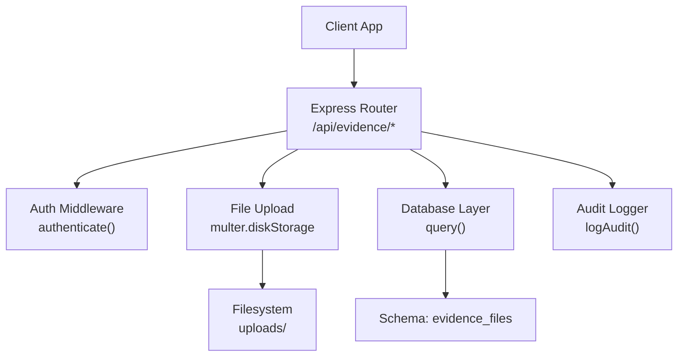
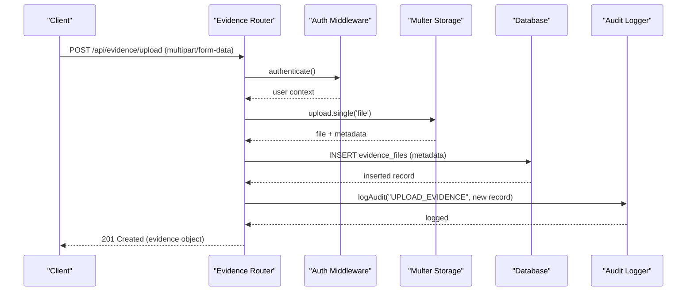
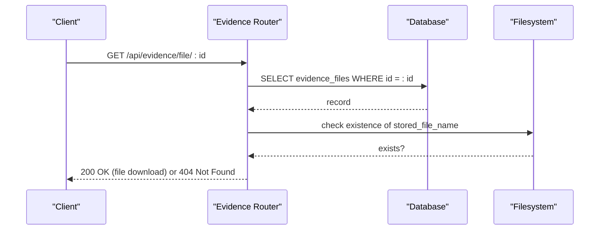
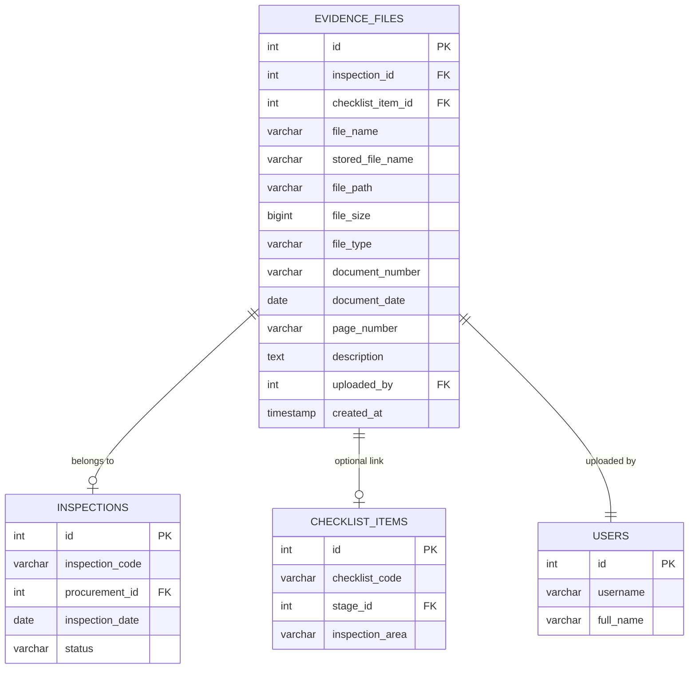
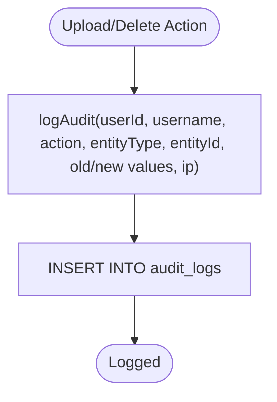
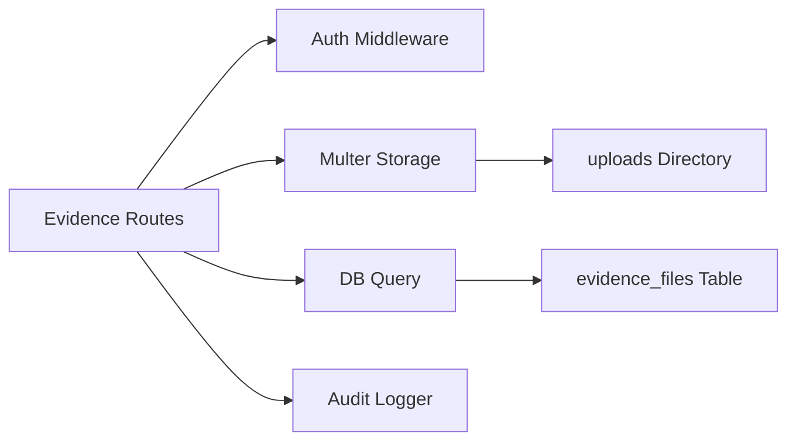

# Evidence Management API

<cite>
**Referenced Files in This Document**
- [evidence.ts](file://server/routes/evidence.ts)
- [auth.ts](file://server/middleware/auth.ts)
- [audit.ts](file://server/utils/audit.ts)
- [db.ts](file://server/db.ts)
- [schema.sql](file://database/schema.sql)
- [api.ts](file://src/services/api.ts)
- [index.ts](file://src/types/index.ts)
</cite>

## Table of Contents
1. [Introduction](#introduction)
2. [Project Structure](#project-structure)
3. [Core Components](#core-components)
4. [Architecture Overview](#architecture-overview)
5. [Detailed Component Analysis](#detailed-component-analysis)
6. [Dependency Analysis](#dependency-analysis)
7. [Performance Considerations](#performance-considerations)
8. [Troubleshooting Guide](#troubleshooting-guide)
9. [Conclusion](#conclusion)
10. [Appendices](#appendices)

## Introduction
This document provides comprehensive API documentation for evidence management endpoints that support uploading, storing, retrieving, and deleting evidence files associated with inspections and checklist items. It also covers metadata handling, file versioning considerations, access controls, and integration with audit logging. The system stores files on disk and maintains references in a relational database, enabling secure retrieval and deletion with full audit trails.

## Project Structure
Evidence-related functionality is implemented as an Express route module with middleware for authentication and utility modules for auditing and database operations. The client-side service layer exposes typed methods to interact with the backend.

**Diagram sources**
- [evidence.ts:1-195](file://server/routes/evidence.ts#L1-L195)
- [auth.ts:36-58](file://server/middleware/auth.ts#L36-L58)
- [audit.ts:3-31](file://server/utils/audit.ts#L3-L31)
- [db.ts:151-169](file://server/db.ts#L151-L169)
- [schema.sql:182-198](file://database/schema.sql#L182-L198)

**Section sources**
- [evidence.ts:1-195](file://server/routes/evidence.ts#L1-L195)
- [api.ts:382-411](file://src/services/api.ts#L382-L411)

## Core Components
- Evidence routes: list, upload, download, delete evidence files.
- Authentication: JWT-based token validation via middleware.
- File storage: local disk storage under uploads directory with unique filenames.
- Database: PostgreSQL schema for evidence_files and related entities.
- Audit logging: records upload and delete actions with user context and IP.

Key responsibilities:
- Validate and sanitize uploaded files (allowed extensions, size limits).
- Persist file metadata and associations to inspections/checklist items.
- Provide secure retrieval and deletion with authorization checks.
- Maintain audit logs for compliance and traceability.

**Section sources**
- [evidence.ts:16-41](file://server/routes/evidence.ts#L16-L41)
- [evidence.ts:43-68](file://server/routes/evidence.ts#L43-L68)
- [evidence.ts:70-134](file://server/routes/evidence.ts#L70-L134)
- [evidence.ts:136-156](file://server/routes/evidence.ts#L136-L156)
- [evidence.ts:158-192](file://server/routes/evidence.ts#L158-L192)
- [auth.ts:36-58](file://server/middleware/auth.ts#L36-L58)
- [audit.ts:3-31](file://server/utils/audit.ts#L3-L31)
- [schema.sql:182-198](file://database/schema.sql#L182-L198)

## Architecture Overview
The evidence management flow involves authenticated requests to upload or retrieve files, with server-side validation, persistence to disk and database, and audit logging.

**Diagram sources**
- [evidence.ts:70-134](file://server/routes/evidence.ts#L70-L134)
- [auth.ts:36-58](file://server/middleware/auth.ts#L36-L58)
- [audit.ts:3-31](file://server/utils/audit.ts#L3-L31)
- [db.ts:151-169](file://server/db.ts#L151-L169)

**Diagram sources**
- [evidence.ts:136-156](file://server/routes/evidence.ts#L136-L156)
- [db.ts:151-169](file://server/db.ts#L151-L169)

## Detailed Component Analysis

### Endpoints Reference
Base path: /api/evidence

- List evidence for an inspection
  - Method: GET
  - Path: /inspections/:id
  - Query params:
    - checklist_item_id (optional): filter by checklist item
  - Auth: required (Bearer token)
  - Response: array of evidence records with joined fields (checklist_code, inspection_area, uploader_name)
  - Error responses: 500 on internal errors

- Upload evidence file
  - Method: POST
  - Path: /upload
  - Content-Type: multipart/form-data
  - Form fields:
    - file (required): binary file content
    - inspection_id (required): integer
    - checklist_item_id (optional): integer
    - document_number (optional): string
    - document_date (optional): date string
    - page_number (optional): string
    - description (optional): text
  - Auth: required (Bearer token)
  - Supported formats: .pdf, .doc, .docx, .xls, .xlsx, .jpg, .jpeg, .png, .mp3, .mp4
  - Size limit: 25 MB per file
  - Response: 201 Created with created evidence record
  - Error responses: 400 if missing file or inspection_id; 500 on server error

- Download evidence file
  - Method: GET
  - Path: /file/:id
  - Auth: required (Bearer token)
  - Response: file stream with original filename
  - Error responses: 404 if record or file not found; 500 on server error

- Delete evidence file
  - Method: DELETE
  - Path: /:id
  - Auth: required (Bearer token)
  - Response: success message
  - Behavior: deletes both database record and physical file from disk
  - Error responses: 404 if record not found; 500 on server error

Notes:
- All endpoints except download require authentication via Bearer token.
- Uploaded files are stored under the uploads directory with unique names prefixed by EVD- and timestamp plus random suffix.
- Metadata includes association to inspection and optional checklist item, plus document-level attributes.

**Section sources**
- [evidence.ts:43-68](file://server/routes/evidence.ts#L43-L68)
- [evidence.ts:70-134](file://server/routes/evidence.ts#L70-L134)
- [evidence.ts:136-156](file://server/routes/evidence.ts#L136-L156)
- [evidence.ts:158-192](file://server/routes/evidence.ts#L158-L192)

### Request/Response Schemas

- Evidence record (response shape)
  - Fields include: id, inspection_id, checklist_item_id, file_name, stored_file_name, file_path, file_size, file_type, document_number, document_date, page_number, description, uploader_name, uploaded_at, plus joined fields like checklist_code and inspection_area when listing.

- Upload request (multipart/form-data)
  - file: binary
  - inspection_id: integer (required)
  - checklist_item_id: integer (optional)
  - document_number: string (optional)
  - document_date: date string (optional)
  - page_number: string (optional)
  - description: text (optional)

- Upload response (201)
  - Returns the newly created evidence record.

- Download response
  - Binary file stream with Content-Disposition set to original filename.

- Delete response
  - JSON with success flag and message.

**Section sources**
- [index.ts:262-279](file://src/types/index.ts#L262-L279)
- [evidence.ts:43-68](file://server/routes/evidence.ts#L43-L68)
- [evidence.ts:70-134](file://server/routes/evidence.ts#L70-L134)
- [evidence.ts:136-156](file://server/routes/evidence.ts#L136-L156)
- [evidence.ts:158-192](file://server/routes/evidence.ts#L158-L192)

### Data Model and Relationships
Evidence files are linked to inspections and optionally to checklist items. The schema ensures referential integrity and supports querying by inspection and filtering by checklist item.

**Diagram sources**
- [schema.sql:145-162](file://database/schema.sql#L145-L162)
- [schema.sql:126-143](file://database/schema.sql#L126-L143)
- [schema.sql:182-198](file://database/schema.sql#L182-L198)
- [schema.sql:67-81](file://database/schema.sql#L67-L81)

**Section sources**
- [schema.sql:182-198](file://database/schema.sql#L182-L198)

### Security and Access Controls
- Authentication: All write operations and listing require a valid Bearer token validated by the authenticate middleware.
- Authorization: Role-based authorization can be enforced using requireRole middleware where needed.
- Input validation: File extension whitelist and size limits prevent malicious uploads.
- Path safety: Downloads resolve stored filenames from the database and verify existence before serving.

**Section sources**
- [auth.ts:36-58](file://server/middleware/auth.ts#L36-L58)
- [auth.ts:74-86](file://server/middleware/auth.ts#L74-L86)
- [evidence.ts:28-41](file://server/routes/evidence.ts#L28-L41)
- [evidence.ts:136-156](file://server/routes/evidence.ts#L136-L156)

### Audit Logging Integration
- Uploads: An audit entry is recorded with action UPLOAD_EVIDENCE, entity type EvidenceFile, and payload including file name and associations.
- Deletions: An audit entry is recorded with action DELETE_EVIDENCE, capturing old values for traceability.
- Logs are persisted to the audit_logs table with user context and IP address.

**Diagram sources**
- [audit.ts:3-31](file://server/utils/audit.ts#L3-L31)
- [evidence.ts:118-127](file://server/routes/evidence.ts#L118-L127)
- [evidence.ts:177-186](file://server/routes/evidence.ts#L177-L186)

**Section sources**
- [audit.ts:3-31](file://server/utils/audit.ts#L3-L31)
- [evidence.ts:118-127](file://server/routes/evidence.ts#L118-L127)
- [evidence.ts:177-186](file://server/routes/evidence.ts#L177-L186)

### Evidence Attachment Workflows

- Attach evidence to an inspection
  - Use POST /api/evidence/upload with inspection_id and optional checklist_item_id.
  - Include document metadata such as document_number, document_date, page_number, description.
  - Server returns the created evidence record.

- Retrieve evidence for an inspection
  - Use GET /api/evidence/inspections/:id with optional checklist_item_id filter.
  - Returns all evidence entries for the inspection, optionally filtered by checklist item.

- Download a specific evidence file
  - Use GET /api/evidence/file/:id to retrieve the file by its database ID.

- Remove evidence
  - Use DELETE /api/evidence/:id to remove both metadata and physical file.

**Section sources**
- [evidence.ts:43-68](file://server/routes/evidence.ts#L43-L68)
- [evidence.ts:70-134](file://server/routes/evidence.ts#L70-L134)
- [evidence.ts:136-156](file://server/routes/evidence.ts#L136-L156)
- [evidence.ts:158-192](file://server/routes/evidence.ts#L158-L192)

### File Versioning
- Current behavior: Each upload generates a unique filename using timestamp and random suffix, effectively creating a new version each time without overwriting previous versions.
- Implication: Multiple versions of the same logical document can coexist; clients should manage versioning semantics at the application level if needed.

**Section sources**
- [evidence.ts:16-26](file://server/routes/evidence.ts#L16-L26)

## Dependency Analysis
Evidence routes depend on:
- Authentication middleware for securing endpoints.
- Multer for file parsing and storage configuration.
- Database layer for persisting metadata and relationships.
- Audit utility for recording actions.

**Diagram sources**
- [evidence.ts:1-195](file://server/routes/evidence.ts#L1-L195)
- [auth.ts:36-58](file://server/middleware/auth.ts#L36-L58)
- [db.ts:151-169](file://server/db.ts#L151-L169)
- [audit.ts:3-31](file://server/utils/audit.ts#L3-L31)

**Section sources**
- [evidence.ts:1-195](file://server/routes/evidence.ts#L1-L195)
- [db.ts:151-169](file://server/db.ts#L151-L169)

## Performance Considerations
- File size limit: 25 MB per upload prevents large payloads impacting memory and disk.
- Disk storage: Files are stored locally; ensure adequate disk space and consider offloading to object storage for scale.
- Database queries: Listing evidence joins with checklist_items and users; indexes on inspection_id and checklist_item_id improve performance.
- Audit logging: Asynchronous logging may be considered to avoid blocking upload/delete operations.

[No sources needed since this section provides general guidance]

## Troubleshooting Guide
Common issues and resolutions:
- Invalid file format: Ensure file extension is in the allowed list; otherwise, the upload will be rejected.
- Missing inspection_id: Upload requires inspection_id; provide it in form data.
- File not found during download: Verify the evidence record exists and the stored file is present on disk.
- Authentication failures: Ensure a valid Bearer token is included in the Authorization header.
- Audit log errors: Check database connectivity and permissions; audit errors are logged but do not block operations.

**Section sources**
- [evidence.ts:28-41](file://server/routes/evidence.ts#L28-L41)
- [evidence.ts:70-134](file://server/routes/evidence.ts#L70-L134)
- [evidence.ts:136-156](file://server/routes/evidence.ts#L136-L156)
- [auth.ts:36-58](file://server/middleware/auth.ts#L36-L58)
- [audit.ts:3-31](file://server/utils/audit.ts#L3-L31)

## Conclusion
The Evidence Management API provides secure, auditable endpoints for uploading, retrieving, and deleting evidence files tied to inspections and checklist items. It enforces strict file validation, persists metadata in a relational database, and integrates with audit logging for compliance. Clients should handle versioning at the application layer and ensure proper authentication for all operations.

[No sources needed since this section summarizes without analyzing specific files]

## Appendices

### Client-Side Usage Examples
- Get evidence files for an inspection:
  - Call getEvidenceFiles(inspectionId, checklistItemId?) from api.ts.
- Upload evidence:
  - Construct FormData with file and metadata, then call uploadEvidence(formData).
- Delete evidence:
  - Call deleteEvidence(id) to remove both metadata and file.

**Section sources**
- [api.ts:382-411](file://src/services/api.ts#L382-L411)