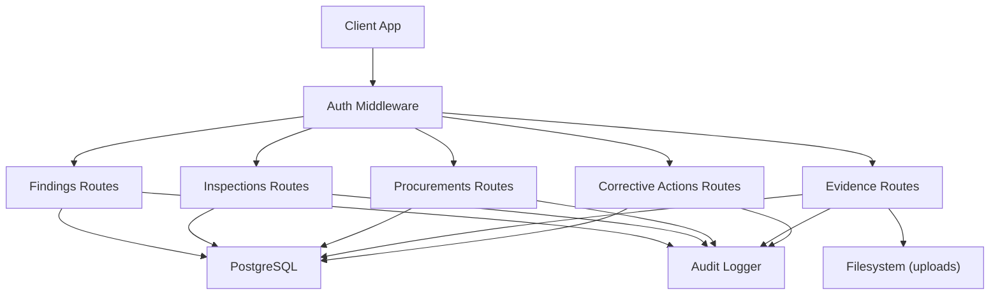
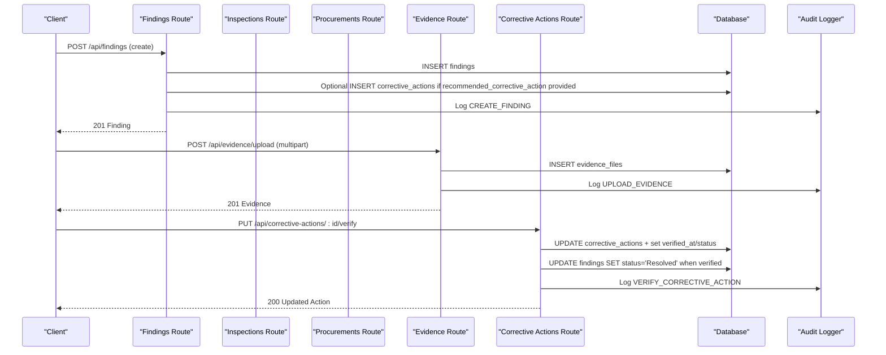
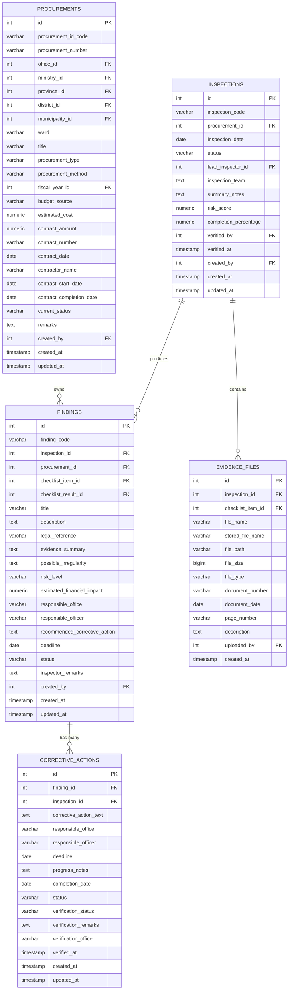

# Findings Management API

<cite>
**Referenced Files in This Document**
- [findings.ts](file://server/routes/findings.ts)
- [inspections.ts](file://server/routes/inspections.ts)
- [procurements.ts](file://server/routes/procurements.ts)
- [evidence.ts](file://server/routes/evidence.ts)
- [correctiveActions.ts](file://server/routes/correctiveActions.ts)
- [audit.ts](file://server/utils/audit.ts)
- [schema.sql](file://database/schema.sql)
- [index.ts](file://src/types/index.ts)
</cite>

## Table of Contents
1. [Introduction](#introduction)
2. [Project Structure](#project-structure)
3. [Core Components](#core-components)
4. [Architecture Overview](#architecture-overview)
5. [Detailed Component Analysis](#detailed-component-analysis)
6. [Dependency Analysis](#dependency-analysis)
7. [Performance Considerations](#performance-considerations)
8. [Troubleshooting Guide](#troubleshooting-guide)
9. [Conclusion](#conclusion)
10. [Appendices](#appendices)

## Introduction
This document provides comprehensive API documentation for findings management endpoints that support issue identification, documentation, and tracking across procurements and inspections. It covers HTTP methods to create, read, update, and delete findings; link findings to inspections and procurements; assign severity levels; manage finding statuses; attach evidence; and integrate with corrective actions and audit trails. It also includes request/response schemas, examples, and workflow guidance.

## Project Structure
The findings feature is implemented as Express routes backed by a PostgreSQL database schema and supported by authentication, audit logging, and related modules for inspections, procurements, evidence, and corrective actions.

**Diagram sources**
- [findings.ts:1-335](file://server/routes/findings.ts#L1-L335)
- [inspections.ts:1-409](file://server/routes/inspections.ts#L1-L409)
- [procurements.ts:1-467](file://server/routes/procurements.ts#L1-L467)
- [evidence.ts:1-195](file://server/routes/evidence.ts#L1-L195)
- [correctiveActions.ts:1-251](file://server/routes/correctiveActions.ts#L1-L251)
- [audit.ts:1-32](file://server/utils/audit.ts#L1-L32)
- [schema.sql:1-283](file://database/schema.sql#L1-L283)

**Section sources**
- [findings.ts:1-335](file://server/routes/findings.ts#L1-L335)
- [schema.sql:1-283](file://database/schema.sql#L1-L283)

## Core Components
- Findings CRUD: list, get, create, update, delete with filtering and search.
- Linking: findings can be linked to an inspection and/or procurement; optional checklist item linkage.
- Severity and status: risk_level and status fields with defaults and updates.
- Evidence attachments: upload, list, download, delete evidence files associated with inspections/checklist items.
- Corrective actions: auto-created from recommended corrective action on finding creation; lifecycle and verification flow.
- Audit trail: all mutations log to audit_logs with old/new values and IP.

**Section sources**
- [findings.ts:8-332](file://server/routes/findings.ts#L8-L332)
- [evidence.ts:43-195](file://server/routes/evidence.ts#L43-L195)
- [correctiveActions.ts:8-251](file://server/routes/correctiveActions.ts#L8-L251)
- [audit.ts:1-32](file://server/utils/audit.ts#L1-L32)
- [schema.sql:200-244](file://database/schema.sql#L200-L244)

## Architecture Overview
Findings are central entities connected to procurements and optionally to inspections and checklist items. Evidence files are attached at the inspection level and optionally scoped to a checklist item. Corrective actions are derived from findings and can drive finding resolution upon verification. All write operations are audited.

**Diagram sources**
- [findings.ts:122-221](file://server/routes/findings.ts#L122-L221)
- [evidence.ts:70-134](file://server/routes/evidence.ts#L70-L134)
- [correctiveActions.ts:195-248](file://server/routes/correctiveActions.ts#L195-L248)
- [audit.ts:1-32](file://server/utils/audit.ts#L1-L32)

## Detailed Component Analysis

### Findings Endpoints
- List findings
  - Method: GET
  - Path: /api/findings
  - Query parameters: risk_level, status, procurement_id, inspection_id, office_id, search
  - Response: array of findings with counts of corrective actions and pending actions
  - Notes: joins to procurements, offices, checklist_items, users; supports ILIKE search across title, code, description, procurement title

- Get single finding
  - Method: GET
  - Path: /api/findings/:id
  - Response: finding details plus associated corrective_actions

- Create finding
  - Method: POST
  - Path: /api/findings
  - Authorization: requires admin or inspector role
  - Request body fields: inspection_id, procurement_id, checklist_item_id, checklist_result_id, title, description, legal_reference, evidence_summary, possible_irregularity, risk_level, estimated_financial_impact, responsible_office, responsible_officer, recommended_corrective_action, deadline, status, inspector_remarks
  - Behavior: generates unique finding_code; sets default risk_level and status; auto-creates corrective_action if recommended_corrective_action provided; logs audit entry

- Update finding
  - Method: PUT
  - Path: /api/findings/:id
  - Authorization: requires admin, inspector, or reviewer role
  - Request body: partial update fields; uses COALESCE to preserve existing values; updates updated_at; logs audit entry

- Delete finding
  - Method: DELETE
  - Path: /api/findings/:id
  - Authorization: requires admin role
  - Behavior: deletes finding; logs audit entry

Request/Response Schemas
- Finding entity fields include identifiers, links to procurement and inspection, descriptive fields, legal reference, evidence summary, irregularity notes, risk_level, financial impact, responsible parties, recommended corrective action, deadline, status, remarks, timestamps, and counts for corrective actions. See type definitions for exact field names and allowed enums.

Example Workflows
- Create finding from inspection:
  - Provide inspection_id and procurement_id along with title, description, risk_level, and other fields. The system will generate a finding_code and persist the record. If recommended_corrective_action is included, a corrective action is created automatically.
- Update status:
  - Send a PUT with status field to transition through Open, Under Review, Corrective Action Required, Resolved, Closed, Referred.
- Reporting queries:
  - Use GET /api/findings with filters such as risk_level, status, procurement_id, inspection_id, office_id, and search to build reports.

Error Handling
- Validation errors return 400 with localized error messages.
- Not found returns 404.
- Server errors return 500 with localized error messages.

Audit Trail
- Every create/update/delete logs to audit_logs with user info, action, entity_type, entity_id, old/new values, and IP address.

**Section sources**
- [findings.ts:8-332](file://server/routes/findings.ts#L8-L332)
- [schema.sql:200-224](file://database/schema.sql#L200-L224)
- [index.ts:205-235](file://src/types/index.ts#L205-L235)
- [audit.ts:1-32](file://server/utils/audit.ts#L1-L32)

### Evidence Attachments
- List evidence for an inspection
  - Method: GET
  - Path: /api/evidence/inspections/:id
  - Query parameter: checklist_item_id (optional)
  - Response: array of evidence files with metadata and uploader name

- Upload evidence file
  - Method: POST
  - Path: /api/evidence/upload
  - Content-Type: multipart/form-data
  - Fields: file (required), inspection_id (required), checklist_item_id (optional), document_number, document_date, page_number, description
  - Allowed extensions: PDF, DOC, DOCX, XLS, XLSX, JPG, JPEG, PNG, MP3, MP4; max size 25 MB
  - Response: created evidence record

- Download evidence file
  - Method: GET
  - Path: /api/evidence/file/:id
  - Response: file stream with original filename

- Delete evidence file
  - Method: DELETE
  - Path: /api/evidence/:id
  - Behavior: removes file from disk and database record; logs audit entry

Evidence Entity Schema
- Includes inspection linkage, optional checklist item linkage, file metadata, document references, uploader info, and timestamps.

**Section sources**
- [evidence.ts:43-195](file://server/routes/evidence.ts#L43-L195)
- [schema.sql:182-198](file://database/schema.sql#L182-L198)
- [index.ts:262-279](file://src/types/index.ts#L262-L279)

### Corrective Actions Integration
- List corrective actions
  - Method: GET
  - Path: /api/corrective-actions
  - Query parameters: status, finding_id, inspection_id, office_id, overdue
  - Response: corrective actions with finding and procurement context; includes overdue flag based on deadline and status

- Create corrective action
  - Method: POST
  - Path: /api/corrective-actions
  - Authorization: admin, inspector, or reviewer
  - Request body: finding_id, inspection_id (optional), corrective_action_text, responsible_office, responsible_officer, deadline, status (defaults to pending)

- Update corrective action
  - Method: PUT
  - Path: /api/corrective-actions/:id
  - Behavior: updates fields including progress_notes, completion_date, status; auto-marks overdue if past deadline and not completed

- Verify corrective action
  - Method: PUT
  - Path: /api/corrective-actions/:id/verify
  - Authorization: admin or reviewer
  - Request body: verification_status, verification_remarks
  - Behavior: updates verification fields and status; if verified, sets associated finding status to Resolved

Workflow States
- Statuses include pending, in-progress, completed, verified, and overdue. Verification transitions finding to Resolved.

**Section sources**
- [correctiveActions.ts:8-251](file://server/routes/correctiveActions.ts#L8-L251)
- [schema.sql:226-244](file://database/schema.sql#L226-L244)
- [index.ts:237-260](file://src/types/index.ts#L237-L260)

### Relationships with Inspections and Procurements
- Findings can be linked to:
  - procurement_id (required for creation)
  - inspection_id (optional)
  - checklist_item_id and checklist_result_id (optional)
- Inspections provide stage-based checklists and results; findings may originate from checklist non-compliance.
- Procurements provide organizational and contract context; findings inherit office and contractor information via joins.

**Section sources**
- [findings.ts:13-76](file://server/routes/findings.ts#L13-L76)
- [inspections.ts:8-67](file://server/routes/inspections.ts#L8-L67)
- [procurements.ts:8-113](file://server/routes/procurements.ts#L8-L113)
- [schema.sql:145-180](file://database/schema.sql#L145-L180)

### Data Models and Types
- Key types used by clients and services:
  - Finding: identifiers, links, descriptive fields, risk_level, financial impact, responsible parties, recommended corrective action, deadline, status, remarks, timestamps, counts
  - EvidenceFile: inspection linkage, file metadata, document references, uploader info, timestamps
  - CorrectiveAction: finding linkage, action text, responsible parties, deadlines, progress, completion, status, verification fields
  - Inspection: lifecycle states, completion percentage, risk score, stats
  - Procurement: master entity with office, ministry, geographic, fiscal year, contract details, latest inspection context

**Section sources**
- [index.ts:69-111](file://src/types/index.ts#L69-L111)
- [index.ts:163-203](file://src/types/index.ts#L163-L203)
- [index.ts:205-279](file://src/types/index.ts#L205-L279)

## Dependency Analysis
- Findings depend on:
  - Procurements (foreign key)
  - Inspections (optional foreign key)
  - Checklist items/results (optional foreign keys)
  - Users (created_by)
- Evidence depends on:
  - Inspections (foreign key)
  - Checklist items (optional foreign key)
  - Users (uploaded_by)
- Corrective actions depend on:
  - Findings (foreign key)
  - Inspections (optional foreign key)
- Audit logs capture changes across all modules.

**Diagram sources**
- [schema.sql:145-244](file://database/schema.sql#L145-L244)

**Section sources**
- [schema.sql:145-244](file://database/schema.sql#L145-L244)

## Performance Considerations
- Queries use indexed columns for common filters:
  - findings.risk_level, findings.inspection_id
  - inspections.procurement_id, inspections.status
  - corrective_actions.finding_id
  - procurements.office_id, procurements.current_status
- Pagination and limits are applied in procurements listing; similar patterns can be adopted for large findings lists if needed.
- File uploads enforce size limits and allowed extensions to prevent abuse.

[No sources needed since this section provides general guidance]

## Troubleshooting Guide
Common issues and resolutions:
- Missing required fields during finding creation: ensure title, description, and procurement_id are provided.
- Unauthorized access: verify user role matches endpoint requirements (admin, inspector, reviewer).
- Evidence upload failures: confirm file extension is allowed and size under limit; inspect server logs for storage errors.
- Not found responses: verify IDs exist before requesting resources.
- Audit log gaps: ensure audit logger is configured and database writable; check for silent failures in audit insertion.

**Section sources**
- [findings.ts:122-221](file://server/routes/findings.ts#L122-L221)
- [evidence.ts:70-134](file://server/routes/evidence.ts#L70-L134)
- [audit.ts:1-32](file://server/utils/audit.ts#L1-L32)

## Conclusion
The findings management API provides robust capabilities to identify, document, and track issues across procurements and inspections. It integrates evidence attachment, corrective action workflows, and comprehensive audit logging. By leveraging filtering and relationships, teams can efficiently manage compliance, risk, and remediation processes.

[No sources needed since this section summarizes without analyzing specific files]

## Appendices

### API Reference Summary

- Findings
  - GET /api/findings
    - Query: risk_level, status, procurement_id, inspection_id, office_id, search
    - Response: array of findings
  - GET /api/findings/:id
    - Response: finding with corrective_actions
  - POST /api/findings
    - Body: inspection_id, procurement_id, checklist_item_id, checklist_result_id, title, description, legal_reference, evidence_summary, possible_irregularity, risk_level, estimated_financial_impact, responsible_office, responsible_officer, recommended_corrective_action, deadline, status, inspector_remarks
    - Response: created finding
  - PUT /api/findings/:id
    - Body: partial fields to update
    - Response: updated finding
  - DELETE /api/findings/:id
    - Response: success message

- Evidence
  - GET /api/evidence/inspections/:id?checklist_item_id=...
    - Response: array of evidence files
  - POST /api/evidence/upload
    - Multipart: file, inspection_id, checklist_item_id, document_number, document_date, page_number, description
    - Response: created evidence
  - GET /api/evidence/file/:id
    - Response: file download
  - DELETE /api/evidence/:id
    - Response: success message

- Corrective Actions
  - GET /api/corrective-actions?status=&finding_id=&inspection_id=&office_id=&overdue=
    - Response: array of corrective actions
  - POST /api/corrective-actions
    - Body: finding_id, inspection_id, corrective_action_text, responsible_office, responsible_officer, deadline, status
    - Response: created action
  - PUT /api/corrective-actions/:id
    - Body: fields to update including progress_notes, completion_date, status
    - Response: updated action
  - PUT /api/corrective-actions/:id/verify
    - Body: verification_status, verification_remarks
    - Response: updated action; finding status set to Resolved if verified

Status Enums and Defaults
- Finding risk_level: low, medium, high, very high (localized values in code)
- Finding status: Open, Under Review, Corrective Action Required, Resolved, Closed, Referred
- Default risk_level on creation: high (localized value)
- Default status on creation: Open

Audit Requirements
- All mutations log to audit_logs with user_id, username, action, entity_type, entity_id, old_values, new_values, ip_address.

**Section sources**
- [findings.ts:8-332](file://server/routes/findings.ts#L8-L332)
- [evidence.ts:43-195](file://server/routes/evidence.ts#L43-L195)
- [correctiveActions.ts:8-251](file://server/routes/correctiveActions.ts#L8-L251)
- [audit.ts:1-32](file://server/utils/audit.ts#L1-L32)
- [schema.sql:200-244](file://database/schema.sql#L200-L244)
- [index.ts:205-279](file://src/types/index.ts#L205-L279)