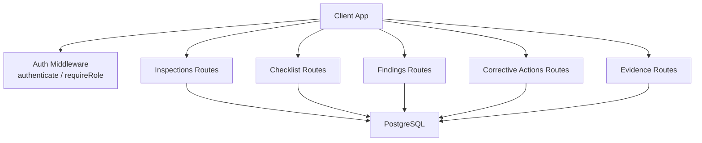
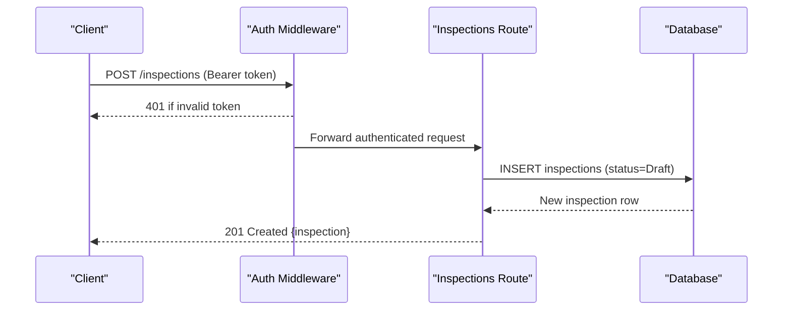
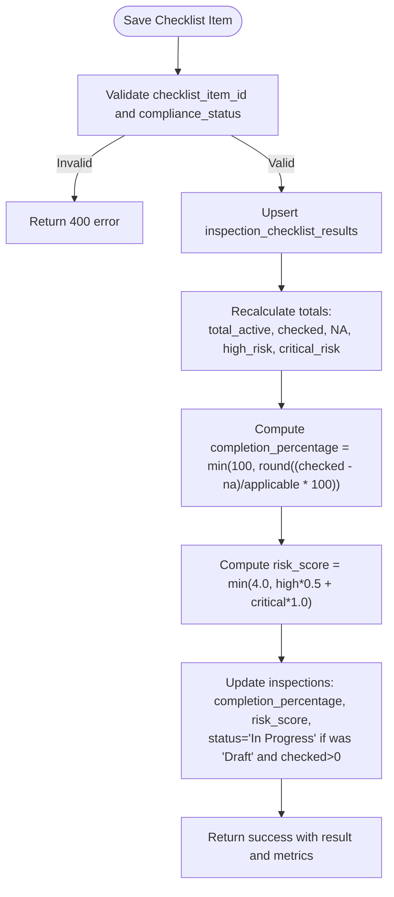
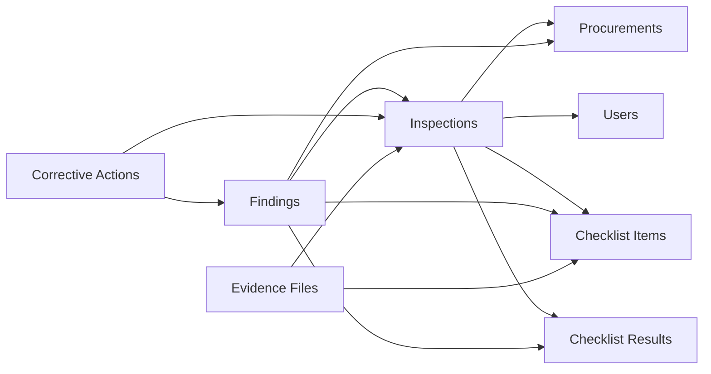
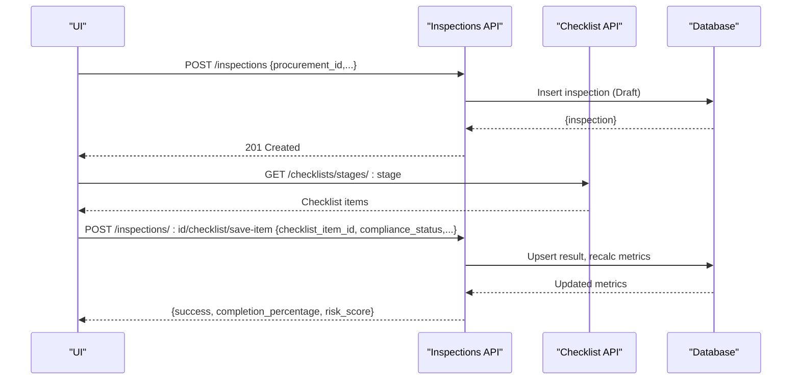
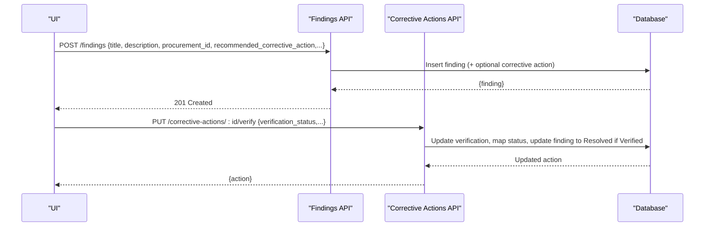

# Inspection Management API

<cite>
**Referenced Files in This Document**
- [inspections.ts](file://server/routes/inspections.ts)
- [checklists.ts](file://server/routes/checklists.ts)
- [findings.ts](file://server/routes/findings.ts)
- [correctiveActions.ts](file://server/routes/correctiveActions.ts)
- [evidence.ts](file://server/routes/evidence.ts)
- [auth.ts](file://server/middleware/auth.ts)
- [schema.sql](file://database/schema.sql)
- [index.ts](file://src/types/index.ts)
</cite>

## Table of Contents
1. [Introduction](#introduction)
2. [Project Structure](#project-structure)
3. [Core Components](#core-components)
4. [Architecture Overview](#architecture-overview)
5. [Detailed Component Analysis](#detailed-component-analysis)
6. [Dependency Analysis](#dependency-analysis)
7. [Performance Considerations](#performance-considerations)
8. [Troubleshooting Guide](#troubleshooting-guide)
9. [Conclusion](#conclusion)
10. [Appendices](#appendices)

## Introduction
This document provides detailed API documentation for inspection management endpoints covering inspection initiation, checklist completion, risk assessment, and workflow management. It documents HTTP methods for creating inspections, managing checklists, scoring evaluations, and tracking inspection progress. It includes request/response schemas for inspection entities, checklist items, evaluation criteria, and status transitions. It also provides examples of inspection workflows, checklist completion processes, and integration with findings and corrective actions modules, along with role-based permissions for different inspection stages.

## Project Structure
The backend exposes RESTful routes under server/routes for Inspections, Checklists, Findings, Corrective Actions, and Evidence. Authentication and authorization are handled via middleware. The database schema defines core entities and relationships. Frontend types define the client-side contracts for these entities.

**Diagram sources**
- [inspections.ts:1-409](file://server/routes/inspections.ts#L1-L409)
- [checklists.ts:1-192](file://server/routes/checklists.ts#L1-L192)
- [findings.ts:1-335](file://server/routes/findings.ts#L1-L335)
- [correctiveActions.ts:1-251](file://server/routes/correctiveActions.ts#L1-L251)
- [evidence.ts:1-195](file://server/routes/evidence.ts#L1-L195)
- [auth.ts:1-87](file://server/middleware/auth.ts#L1-L87)
- [schema.sql:1-283](file://database/schema.sql#L1-L283)

**Section sources**
- [inspections.ts:1-409](file://server/routes/inspections.ts#L1-L409)
- [checklists.ts:1-192](file://server/routes/checklists.ts#L1-L192)
- [findings.ts:1-335](file://server/routes/findings.ts#L1-L335)
- [correctiveActions.ts:1-251](file://server/routes/correctiveActions.ts#L1-L251)
- [evidence.ts:1-195](file://server/routes/evidence.ts#L1-L195)
- [auth.ts:1-87](file://server/middleware/auth.ts#L1-L87)
- [schema.sql:1-283](file://database/schema.sql#L1-L283)

## Core Components
- Inspections: Create, list, retrieve details, update metadata/status, fetch stage-specific checklists, save checklist item results with automatic recalculation of completion percentage and risk score.
- Checklists: Master checklist retrieval by stage or filters; admin-only create/update of checklist items.
- Findings: List, retrieve, create, update, delete findings; optional auto-creation of corrective actions when recommended action is provided.
- Corrective Actions: List, create, update progress/status, verify (admin/reviewer), with overdue detection and finding status updates upon verification.
- Evidence: Upload, list, download, delete evidence files linked to inspections and checklist items.

**Section sources**
- [inspections.ts:1-409](file://server/routes/inspections.ts#L1-L409)
- [checklists.ts:1-192](file://server/routes/checklists.ts#L1-L192)
- [findings.ts:1-335](file://server/routes/findings.ts#L1-L335)
- [correctiveActions.ts:1-251](file://server/routes/correctiveActions.ts#L1-L251)
- [evidence.ts:1-195](file://server/routes/evidence.ts#L1-L195)

## Architecture Overview
The system follows a layered architecture:
- Client requests hit Express routes that enforce authentication and role-based access.
- Route handlers perform business logic and query PostgreSQL using parameterized SQL.
- Responses include entity data plus computed statistics where applicable.
- Audit logs record key operations.

**Diagram sources**
- [inspections.ts:148-197](file://server/routes/inspections.ts#L148-L197)
- [auth.ts:36-58](file://server/middleware/auth.ts#L36-L58)
- [schema.sql:145-162](file://database/schema.sql#L145-L162)

**Section sources**
- [inspections.ts:148-197](file://server/routes/inspections.ts#L148-L197)
- [auth.ts:36-58](file://server/middleware/auth.ts#L36-L58)
- [schema.sql:145-162](file://database/schema.sql#L145-L162)

## Detailed Component Analysis

### Inspections API
- GET /inspections
  - Purpose: List inspections with filters (status, procurement_id, office_id, search).
  - Response: Array of inspection objects enriched with procurement and office info, counts of findings and high-risk findings.
  - Notes: Supports search across title, codes, and office name.

- GET /inspections/:id
  - Purpose: Retrieve inspection details including related procurement, office, ministry/province/district/municipality, fiscal year, lead inspector, verified by.
  - Response: Inspection object plus stats (total_items, checked_items, compliant/partial/non-compliant/NA/missing-evidence items, high/critical risk items, total financial impact).

- POST /inspections
  - Purpose: Create a new inspection linked to a procurement.
  - Required fields: procurement_id. Optional: inspection_date, inspection_team, summary_notes.
  - Behavior: Generates unique inspection code, sets initial status to Draft, records created_by.
  - Roles: admin, inspector.

- PUT /inspections/:id
  - Purpose: Update inspection metadata and status.
  - Role-based validation: Only reviewer or admin can set Verified or Closed.
  - Behavior: On transition to Verified, sets verified_by and verified_at timestamps.
  - Auditing: Logs old/new values.

- GET /inspections/:id/checklist?stage=N
  - Purpose: Fetch stage-by-stage checklist items with existing results for this inspection.
  - Filters: stage_number via query param.
  - Response: Checklist items joined with stages and current results, plus counts of evidence and findings per item.

- POST /inspections/:id/checklist/save-item
  - Purpose: Upsert a checklist item result for an inspection.
  - Required fields: checklist_item_id, compliance_status. Optional: risk_level, evidence_reference, observation, financial_impact, inspector_comment.
  - Behavior: Upserts into inspection_checklist_results; recalculates completion percentage and risk score; updates inspection status from Draft to In Progress if any items checked.
  - Response: Success flag, saved result, updated completion_percentage and risk_score.

**Diagram sources**
- [inspections.ts:309-406](file://server/routes/inspections.ts#L309-L406)

**Section sources**
- [inspections.ts:8-67](file://server/routes/inspections.ts#L8-L67)
- [inspections.ts:69-146](file://server/routes/inspections.ts#L69-L146)
- [inspections.ts:148-197](file://server/routes/inspections.ts#L148-L197)
- [inspections.ts:199-255](file://server/routes/inspections.ts#L199-L255)
- [inspections.ts:257-307](file://server/routes/inspections.ts#L257-L307)
- [inspections.ts:309-406](file://server/routes/inspections.ts#L309-L406)

### Checklists API
- GET /checklists
  - Purpose: Retrieve master checklist items with optional filters (stage_number, is_active).
  - Response: Checklist items joined with stage titles.

- GET /checklists/stages/:stage
  - Purpose: Get checklist items for a specific stage (active only).

- POST /checklists
  - Purpose: Add a new checklist item (Admin only).
  - Required fields: stage_number, inspection_area, inspection_question.
  - Behavior: Validates stage existence, generates unique checklist_code, inserts with defaults (default_risk_level, sort_order).

- PUT /checklists/:id
  - Purpose: Update checklist item (Admin only). Preserves history by not deleting rows.

**Section sources**
- [checklists.ts:8-34](file://server/routes/checklists.ts#L8-L34)
- [checklists.ts:36-52](file://server/routes/checklists.ts#L36-L52)
- [checklists.ts:54-123](file://server/routes/checklists.ts#L54-L123)
- [checklists.ts:125-189](file://server/routes/checklists.ts#L125-L189)

### Findings API
- GET /findings
  - Purpose: List findings with filters (risk_level, status, procurement_id, inspection_id, office_id, search).
  - Response: Findings joined with procurement, office, checklist item, creator; includes counts of corrective actions and pending actions.

- GET /findings/:id
  - Purpose: Retrieve a single finding with associated corrective actions.

- POST /findings
  - Purpose: Create a finding (Admin or Inspector).
  - Required fields: title, description, procurement_id.
  - Behavior: Generates unique finding_code; optionally creates a corrective action if recommended_corrective_action is provided.

- PUT /findings/:id
  - Purpose: Update a finding (Admin, Inspector, Reviewer).

- DELETE /findings/:id
  - Purpose: Delete a finding (Admin only).

**Section sources**
- [findings.ts:8-76](file://server/routes/findings.ts#L8-L76)
- [findings.ts:78-120](file://server/routes/findings.ts#L78-L120)
- [findings.ts:122-221](file://server/routes/findings.ts#L122-L221)
- [findings.ts:223-302](file://server/routes/findings.ts#L223-L302)
- [findings.ts:304-332](file://server/routes/findings.ts#L304-L332)

### Corrective Actions API
- GET /corrective-actions
  - Purpose: List corrective actions with filters (status, finding_id, inspection_id, office_id, overdue).
  - Response: Includes is_overdue flag based on deadline and status.

- POST /corrective-actions
  - Purpose: Create a corrective action (Admin, Inspector, Reviewer).
  - Required fields: finding_id, corrective_action_text.
  - Behavior: Defaults status to "बाँकी".

- PUT /corrective-actions/:id
  - Purpose: Update progress and status. Auto flags overdue if past deadline and not completed.

- PUT /corrective-actions/:id/verify
  - Purpose: Verify corrective action (Admin or Reviewer). Sets verification_status and maps to final status; if Verified, updates associated finding status to Resolved.

**Section sources**
- [correctiveActions.ts:8-66](file://server/routes/correctiveActions.ts#L8-L66)
- [correctiveActions.ts:68-121](file://server/routes/correctiveActions.ts#L68-L121)
- [correctiveActions.ts:123-193](file://server/routes/correctiveActions.ts#L123-L193)
- [correctiveActions.ts:195-248](file://server/routes/correctiveActions.ts#L195-L248)

### Evidence API
- GET /evidence/inspections/:id
  - Purpose: List evidence files for an inspection, optionally filtered by checklist_item_id.

- POST /evidence/upload
  - Purpose: Upload evidence file (Authenticated). Enforces allowed extensions and size limits. Stores file and metadata.

- GET /evidence/file/:id
  - Purpose: Download/served stored file by ID.

- DELETE /evidence/:id
  - Purpose: Delete evidence file and remove disk file.

**Section sources**
- [evidence.ts:43-68](file://server/routes/evidence.ts#L43-L68)
- [evidence.ts:70-134](file://server/routes/evidence.ts#L70-L134)
- [evidence.ts:136-156](file://server/routes/evidence.ts#L136-L156)
- [evidence.ts:158-192](file://server/routes/evidence.ts#L158-L192)

## Dependency Analysis
Key dependencies and relationships:
- Inspections depend on Procurements, Offices, Users, Checklist Items, and Checklist Results.
- Findings link to Inspections, Procurements, Checklist Items, and Checklist Results.
- Corrective Actions link to Findings and Inspections.
- Evidence Files link to Inspections and Checklist Items.
- Authentication middleware enforces JWT-based identity and role checks.

**Diagram sources**
- [schema.sql:145-244](file://database/schema.sql#L145-L244)

**Section sources**
- [schema.sql:145-244](file://database/schema.sql#L145-L244)

## Performance Considerations
- Parameterized queries reduce injection risks and improve plan caching.
- Indexes exist on frequently filtered columns (e.g., inspections.status, findings.risk_level, corrective_actions.finding_id).
- Checklist result saving performs a single upsert followed by aggregated calculations; consider batching updates if large volumes are expected.
- Evidence upload uses disk storage with size limits; ensure adequate disk space and consider CDN for downloads at scale.

[No sources needed since this section provides general guidance]

## Troubleshooting Guide
Common issues and resolutions:
- Unauthorized access: Ensure valid Bearer token is provided; tokens expire after 24 hours.
- Forbidden actions: Some endpoints require specific roles (e.g., Verified/Closed status requires reviewer/admin).
- Validation errors: Missing required fields return 400; review request payload against endpoint requirements.
- File uploads: Only allowed extensions accepted; ensure correct content type and size within limits.
- Overdue corrective actions: If deadline passed and status not completed/verified, status may be automatically flagged as overdue.

**Section sources**
- [auth.ts:36-87](file://server/middleware/auth.ts#L36-L87)
- [inspections.ts:199-255](file://server/routes/inspections.ts#L199-L255)
- [evidence.ts:28-41](file://server/routes/evidence.ts#L28-L41)
- [correctiveActions.ts:123-193](file://server/routes/correctiveActions.ts#L123-L193)

## Conclusion
The Inspection Management API provides a comprehensive workflow for initiating inspections, completing checklists, assessing risks, and managing findings and corrective actions. Role-based controls ensure appropriate governance across stages. The system integrates evidence handling and audit logging to support transparency and accountability.

[No sources needed since this section summarizes without analyzing specific files]

## Appendices

### Request/Response Schemas
- Inspection
  - Fields: id, inspection_code, procurement_id, inspection_date, status, lead_inspector_id, inspection_team, summary_notes, risk_score, completion_percentage, verified_by, verified_at, created_at, updated_at.
  - Source: [index.ts:163-203](file://src/types/index.ts#L163-L203), [schema.sql:145-162](file://database/schema.sql#L145-L162)

- Checklist Item
  - Fields: id, checklist_code, stage_id, stage_number, inspection_area, legal_reference, required_documents, inspection_question, possible_irregularity, default_risk_level, sort_order, is_active.
  - Source: [index.ts:123-137](file://src/types/index.ts#L123-L137), [schema.sql:126-143](file://database/schema.sql#L126-L143)

- Inspection Checklist Result
  - Fields: checklist_item_id, compliance_status, risk_level, evidence_reference, observation, financial_impact, inspector_comment, completed_by, completed_at.
  - Source: [index.ts:139-161](file://src/types/index.ts#L139-L161), [schema.sql:164-180](file://database/schema.sql#L164-L180)

- Finding
  - Fields: id, finding_code, inspection_id, procurement_id, checklist_item_id, checklist_result_id, title, description, legal_reference, evidence_summary, possible_irregularity, risk_level, estimated_financial_impact, responsible_office, responsible_officer, recommended_corrective_action, deadline, status, inspector_remarks, created_at, updated_at.
  - Source: [index.ts:205-235](file://src/types/index.ts#L205-L235), [schema.sql:200-224](file://database/schema.sql#L200-L224)

- Corrective Action
  - Fields: id, finding_id, inspection_id, corrective_action_text, responsible_office, responsible_officer, deadline, progress_notes, completion_date, status, verification_status, verification_remarks, verification_officer, verified_at, created_at, updated_at.
  - Source: [index.ts:237-260](file://src/types/index.ts#L237-L260), [schema.sql:226-244](file://database/schema.sql#L226-L244)

- Evidence File
  - Fields: id, inspection_id, checklist_item_id, file_name, stored_file_name, file_path, file_size, file_type, document_number, document_date, page_number, description, uploaded_by, created_at.
  - Source: [index.ts:262-279](file://src/types/index.ts#L262-L279), [schema.sql:182-198](file://database/schema.sql#L182-L198)

### Status Transitions and Role-Based Permissions
- Inspection status flow: Draft → In Progress → Submitted → Under Review → Returned for Correction → Verified → Closed.
  - Verified/Closed transitions restricted to reviewer/admin.
  - Source: [inspections.ts:199-255](file://server/routes/inspections.ts#L199-L255), [schema.sql:145-162](file://database/schema.sql#L145-L162)

- Finding status: Open → Under Review → Corrective Action Required → Resolved → Closed → Referred.
  - Creation defaults to Open; resolution can occur via corrective action verification.
  - Source: [findings.ts:122-221](file://server/routes/findings.ts#L122-L221), [correctiveActions.ts:195-248](file://server/routes/correctiveActions.ts#L195-L248)

- Corrective action status: बाँकी → प्रक्रियामा → सम्पन्न → प्रमाणित → समयसीमा नाघेको.
  - Verification by admin/reviewer maps to final status and updates finding to Resolved.
  - Source: [correctiveActions.ts:123-193](file://server/routes/correctiveActions.ts#L123-L193), [correctiveActions.ts:195-248](file://server/routes/correctiveActions.ts#L195-L248)

### Example Workflows

#### Inspection Initiation and Checklist Completion

**Diagram sources**
- [inspections.ts:148-197](file://server/routes/inspections.ts#L148-L197)
- [checklists.ts:36-52](file://server/routes/checklists.ts#L36-L52)
- [inspections.ts:309-406](file://server/routes/inspections.ts#L309-L406)

#### Findings and Corrective Actions Integration

**Diagram sources**
- [findings.ts:122-221](file://server/routes/findings.ts#L122-L221)
- [correctiveActions.ts:195-248](file://server/routes/correctiveActions.ts#L195-L248)

### Endpoint Summary
- Inspections
  - GET /inspections
  - GET /inspections/:id
  - POST /inspections
  - PUT /inspections/:id
  - GET /inspections/:id/checklist?stage=N
  - POST /inspections/:id/checklist/save-item

- Checklists
  - GET /checklists
  - GET /checklists/stages/:stage
  - POST /checklists
  - PUT /checklists/:id

- Findings
  - GET /findings
  - GET /findings/:id
  - POST /findings
  - PUT /findings/:id
  - DELETE /findings/:id

- Corrective Actions
  - GET /corrective-actions
  - POST /corrective-actions
  - PUT /corrective-actions/:id
  - PUT /corrective-actions/:id/verify

- Evidence
  - GET /evidence/inspections/:id
  - POST /evidence/upload
  - GET /evidence/file/:id
  - DELETE /evidence/:id

**Section sources**
- [inspections.ts:8-406](file://server/routes/inspections.ts#L8-L406)
- [checklists.ts:8-189](file://server/routes/checklists.ts#L8-L189)
- [findings.ts:8-332](file://server/routes/findings.ts#L8-L332)
- [correctiveActions.ts:8-248](file://server/routes/correctiveActions.ts#L8-L248)
- [evidence.ts:43-192](file://server/routes/evidence.ts#L43-L192)