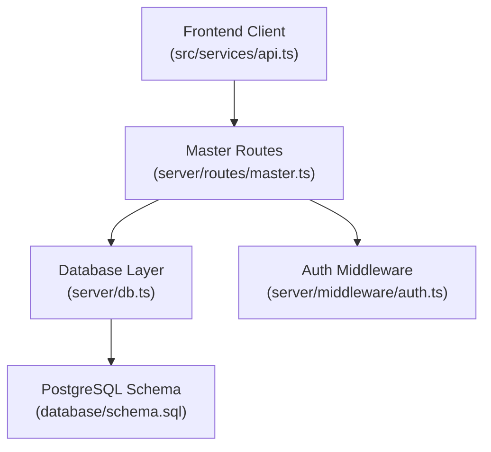
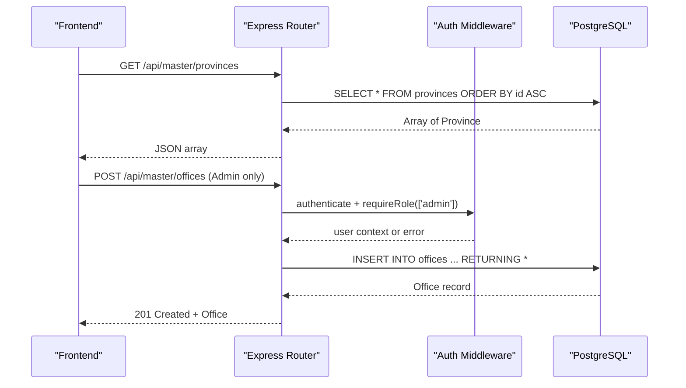
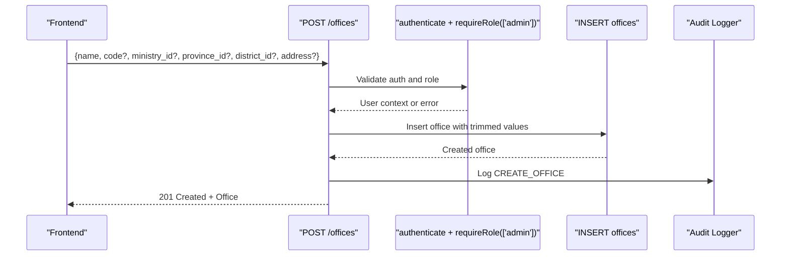
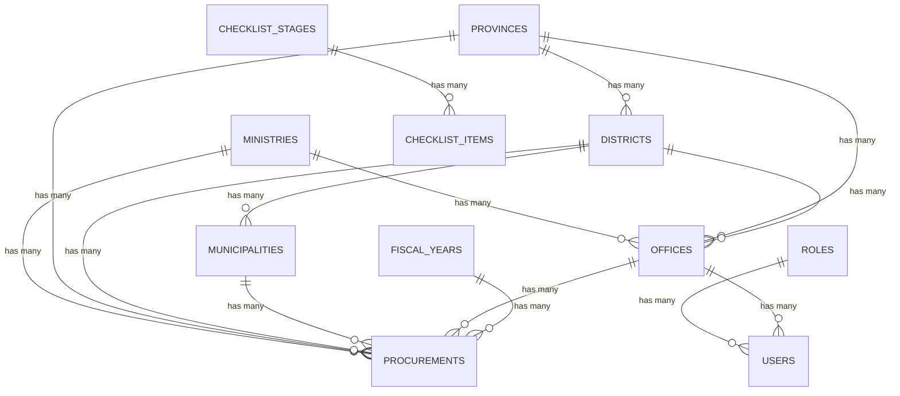

# Master Data API

<cite>
**Referenced Files in This Document**
- [master.ts](file://server/routes/master.ts)
- [schema.sql](file://database/schema.sql)
- [index.ts](file://src/types/index.ts)
- [api.ts](file://src/services/api.ts)
- [auth.ts](file://server/middleware/auth.ts)
- [db.ts](file://server/db.ts)
</cite>

## Table of Contents
1. [Introduction](#introduction)
2. [Project Structure](#project-structure)
3. [Core Components](#core-components)
4. [Architecture Overview](#architecture-overview)
5. [Detailed Component Analysis](#detailed-component-analysis)
6. [Dependency Analysis](#dependency-analysis)
7. [Performance Considerations](#performance-considerations)
8. [Troubleshooting Guide](#troubleshooting-guide)
9. [Conclusion](#conclusion)

## Introduction
This document provides detailed API documentation for master data endpoints that supply reference data used across the system. It covers HTTP methods, request/response schemas, validation rules, business constraints, and referential integrity considerations for entities such as provinces, districts, municipalities, ministries, offices, fiscal years, roles, and checklist stages. It also explains integration patterns with other components (e.g., procurements, inspections) and cascading effects when master data changes.

## Project Structure
The master data functionality is implemented as a set of REST endpoints under a dedicated route module, backed by a PostgreSQL schema and consumed by the frontend via a typed client service.

**Diagram sources**
- [master.ts:1-162](file://server/routes/master.ts#L1-L162)
- [db.ts:10-97](file://server/db.ts#L10-L97)
- [schema.sql:1-283](file://database/schema.sql#L1-L283)
- [auth.ts:36-86](file://server/middleware/auth.ts#L36-L86)

**Section sources**
- [master.ts:1-162](file://server/routes/master.ts#L1-L162)
- [db.ts:10-97](file://server/db.ts#L10-L97)
- [schema.sql:1-283](file://database/schema.sql#L1-L283)
- [auth.ts:36-86](file://server/middleware/auth.ts#L36-L86)

## Core Components
- Master data routes expose read-only endpoints for most reference tables and a protected write endpoint to create offices.
- The database schema defines strict relationships and constraints ensuring referential integrity across master entities.
- Frontend types define the expected shape of responses for each master entity.

Key responsibilities:
- Provide hierarchical geographic data (provinces → districts → municipalities).
- Provide organizational reference data (ministries, offices, fiscal years, roles).
- Provide inspection framework reference data (checklist stages).
- Enforce authentication and role-based access where applicable.

**Section sources**
- [master.ts:8-159](file://server/routes/master.ts#L8-L159)
- [schema.sql:7-65](file://database/schema.sql#L7-L65)
- [index.ts:14-59](file://src/types/index.ts#L14-L59)

## Architecture Overview
The master data API follows a simple layered architecture:
- Client calls typed functions in the frontend service layer.
- Express routes handle requests, apply middleware (authentication/authorization), and query the database.
- Database enforces referential integrity through foreign keys and constraints.

**Diagram sources**
- [master.ts:24-32](file://server/routes/master.ts#L24-L32)
- [master.ts:109-139](file://server/routes/master.ts#L109-L139)
- [auth.ts:36-86](file://server/middleware/auth.ts#L36-L86)
- [schema.sql:47-58](file://database/schema.sql#L47-L58)

## Detailed Component Analysis

### Geographic Reference Data
Endpoints:
- GET /api/master/provinces
- GET /api/master/districts?province_id={id}
- GET /api/master/municipalities?district_id={id}

Behavior:
- Provinces: returns all provinces ordered by id.
- Districts: optional filter by province_id; otherwise returns all districts.
- Municipalities: optional filter by district_id; otherwise returns all municipalities.

Request/Response Schemas:
- Province: id, name_en, name_ne
- District: id, province_id, name_en, name_ne
- Municipality: id, district_id, name_en, name_ne, type

Validation and Constraints:
- province_id must exist in provinces table if provided.
- district_id must exist in districts table if provided.
- All names are required per schema.

Cascading Effects:
- Deleting a province restricts deletion if referenced by districts (ON DELETE RESTRICT).
- Deleting a district restricts deletion if referenced by municipalities (ON DELETE RESTRICT).

Integration:
- Offices and procurements may reference these entities for location context.

**Section sources**
- [master.ts:24-68](file://server/routes/master.ts#L24-L68)
- [schema.sql:16-38](file://database/schema.sql#L16-L38)
- [index.ts:14-33](file://src/types/index.ts#L14-L33)

### Organizational Reference Data
Endpoints:
- GET /api/master/ministries
- GET /api/master/offices?ministry_id={id}&province_id={id}
- POST /api/master/offices (requires authentication and admin role)

Behavior:
- Ministries: returns all ministries ordered by id.
- Offices: returns active offices with joined ministry and province/district names; supports filtering by ministry_id and/or province_id.
- Create Office: validates presence of name; trims inputs; inserts office with optional code, ministry, province, district, address; logs audit event; returns created office.

Request/Response Schemas:
- Ministry: id, name_en, name_ne, code
- Office: id, name, code?, ministry_id?, ministry_name?, province_id?, province_name?, district_id?, district_name?, address?
- Create Office Request: name (required), code?, ministry_id?, province_id?, district_id?, address?

Validation and Constraints:
- Name is required for office creation.
- Code must be unique if provided.
- Foreign key references enforced at DB level.

Cascading Effects:
- If a ministry is deleted, office.ministry_id is set to NULL (ON DELETE SET NULL).
- If a province/district is deleted, corresponding office fields are set to NULL (ON DELETE SET NULL).

Integration:
- Users can be associated with an office; procurements can reference offices and ministries for reporting and filtering.

**Section sources**
- [master.ts:70-139](file://server/routes/master.ts#L70-L139)
- [schema.sql:40-58](file://database/schema.sql#L40-L58)
- [schema.sql:67-81](file://database/schema.sql#L67-L81)
- [index.ts:35-53](file://src/types/index.ts#L35-L53)
- [auth.ts:36-86](file://server/middleware/auth.ts#L36-L86)

### Fiscal Years
Endpoint:
- GET /api/master/fiscal-years

Behavior:
- Returns all fiscal years ordered by id descending.

Request/Response Schemas:
- FiscalYear: id, name, is_current

Constraints:
- Name must be unique.

Integration:
- Procurements reference fiscal_year_id; deleting a fiscal year is restricted if referenced by procurements (ON DELETE RESTRICT).

**Section sources**
- [master.ts:141-149](file://server/routes/master.ts#L141-L149)
- [schema.sql:60-65](file://database/schema.sql#L60-L65)
- [schema.sql:83-114](file://database/schema.sql#L83-L114)

### Roles
Endpoint:
- GET /api/master/roles

Behavior:
- Returns all roles ordered by id.

Request/Response Schemas:
- Role: id, name, display_name, description, created_at

Constraints:
- Role name must be unique.

Integration:
- Users reference roles; deleting a role is restricted if referenced by users (ON DELETE RESTRICT).

**Section sources**
- [master.ts:151-159](file://server/routes/master.ts#L151-L159)
- [schema.sql:7-14](file://database/schema.sql#L7-L14)
- [schema.sql:67-81](file://database/schema.sql#L67-L81)

### Checklist Stages
Endpoint:
- GET /api/master/stages

Behavior:
- Returns all checklist stages with counts of active checklist items per stage, ordered by sort_order.

Request/Response Schemas:
- Stage: id, stage_number, title_ne, title_en, description?, sort_order, checklist_items_count

Constraints:
- stage_number must be unique.

Integration:
- Checklist items reference stages; deleting a stage cascades to related items (ON DELETE CASCADE).

**Section sources**
- [master.ts:8-22](file://server/routes/master.ts#L8-L22)
- [schema.sql:116-124](file://database/schema.sql#L116-L124)
- [schema.sql:126-143](file://database/schema.sql#L126-L143)

### Office Creation Flow (Protected)

**Diagram sources**
- [master.ts:109-139](file://server/routes/master.ts#L109-L139)
- [auth.ts:36-86](file://server/middleware/auth.ts#L36-L86)
- [schema.sql:47-58](file://database/schema.sql#L47-L58)

## Dependency Analysis
Master entities have well-defined relationships that enforce referential integrity and influence behavior when changes occur.

**Diagram sources**
- [schema.sql:16-38](file://database/schema.sql#L16-L38)
- [schema.sql:40-65](file://database/schema.sql#L40-L65)
- [schema.sql:67-114](file://database/schema.sql#L67-L114)
- [schema.sql:116-143](file://database/schema.sql#L116-L143)

Key constraints and cascading behaviors:
- Geographic hierarchy:
  - Deleting a province or district is restricted if referenced by lower-level entities.
- Organizational hierarchy:
  - Deleting a ministry or office sets referencing fields to NULL unless explicitly restricted.
- Fiscal years:
  - Deleting a fiscal year is restricted if referenced by procurements.
- Roles:
  - Deleting a role is restricted if referenced by users.
- Checklist stages:
  - Deleting a stage cascades to related checklist items.

**Section sources**
- [schema.sql:16-38](file://database/schema.sql#L16-L38)
- [schema.sql:40-65](file://database/schema.sql#L40-L65)
- [schema.sql:67-114](file://database/schema.sql#L67-L114)
- [schema.sql:116-143](file://database/schema.sql#L116-L143)

## Performance Considerations
- Queries use indexed columns where available (e.g., office filters, status fields).
- Filtering on large datasets should leverage query parameters (province_id, district_id, ministry_id, province_id for offices).
- Avoid unnecessary joins in client-side rendering; fetch only needed hierarchies.
- Use pagination on future endpoints if datasets grow significantly.

[No sources needed since this section provides general guidance]

## Troubleshooting Guide
Common issues and resolutions:
- Authentication failures:
  - Ensure a valid JWT token is included in Authorization header.
  - Token expiration results in unauthorized errors; re-authenticate.
- Role-based access denied:
  - Creating offices requires admin role; verify user role.
- Validation errors:
  - Office creation requires a non-empty name; ensure payload includes name.
- Referential integrity errors:
  - Cannot delete provinces/districts if referenced by lower-level entities.
  - Cannot delete fiscal years or roles if referenced by dependent records.
- Database connection issues:
  - Verify environment variables for external PostgreSQL or embedded PGlite initialization.

**Section sources**
- [auth.ts:36-86](file://server/middleware/auth.ts#L36-L86)
- [master.ts:109-139](file://server/routes/master.ts#L109-L139)
- [schema.sql:16-38](file://database/schema.sql#L16-L38)
- [schema.sql:60-65](file://database/schema.sql#L60-L65)
- [schema.sql:67-81](file://database/schema.sql#L67-L81)
- [db.ts:10-97](file://server/db.ts#L10-L97)

## Conclusion
The Master Data API provides essential reference data for the system with clear read endpoints and a protected write endpoint for offices. The database schema enforces strong referential integrity, guiding safe updates and deletions. Integration points with procurements, inspections, and users rely on these master entities, making them foundational to consistent reporting and workflow execution.

[No sources needed since this section summarizes without analyzing specific files]