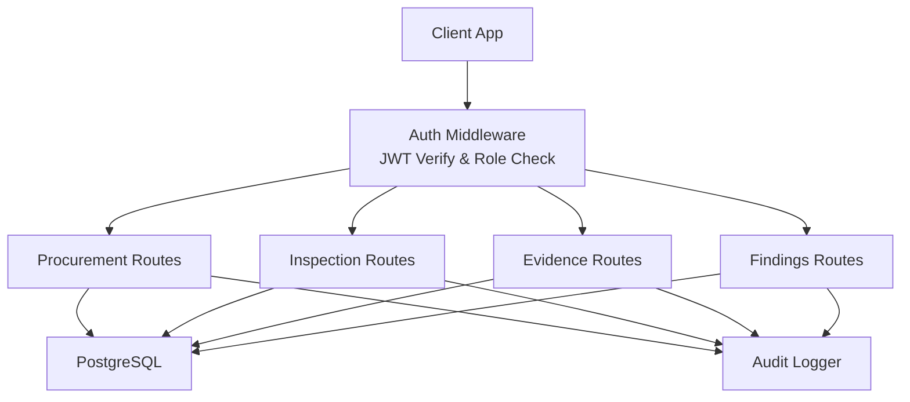
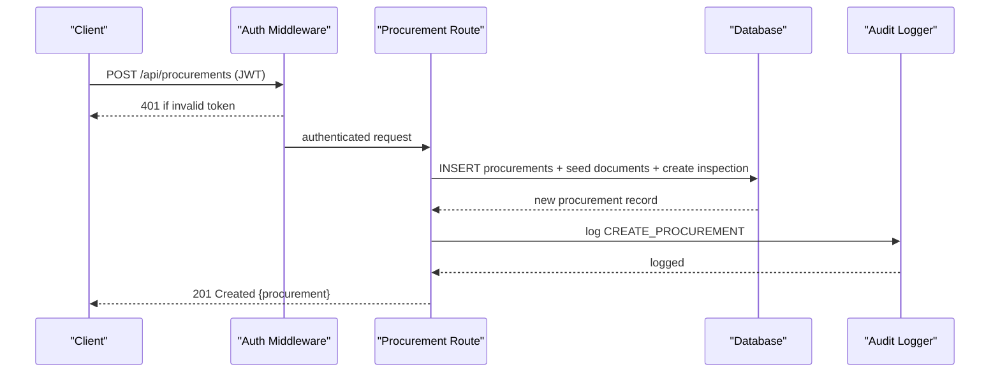
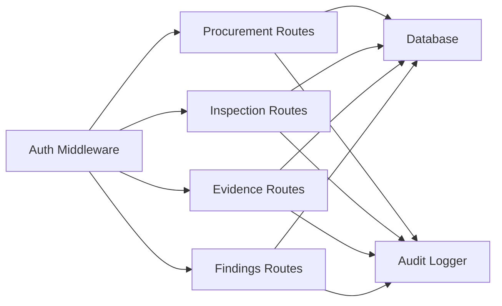
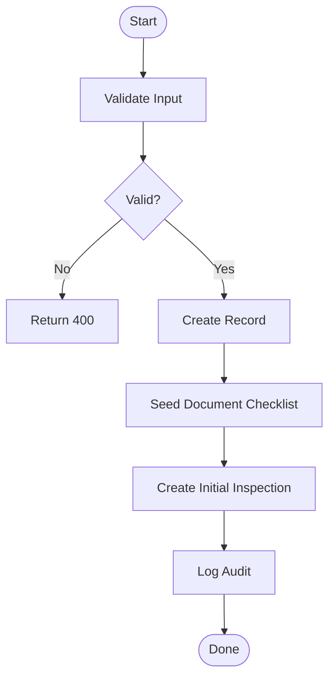

# Procurement Management API

<cite>
**Referenced Files in This Document**
- [procurements.ts](file://server/routes/procurements.ts)
- [inspections.ts](file://server/routes/inspections.ts)
- [evidence.ts](file://server/routes/evidence.ts)
- [findings.ts](file://server/routes/findings.ts)
- [auth.ts](file://server/middleware/auth.ts)
- [audit.ts](file://server/utils/audit.ts)
- [schema.sql](file://database/schema.sql)
- [index.ts](file://src/types/index.ts)
</cite>

## Table of Contents
1. Introduction
2. Project Structure
3. Core Components
4. Architecture Overview
5. Detailed Component Analysis
6. Dependency Analysis
7. Performance Considerations
8. Troubleshooting Guide
9. Conclusion
10. Appendices

## Introduction
This document provides comprehensive API documentation for procurement management endpoints covering the complete procurement lifecycle. It details HTTP methods for creating, reading, updating, and deleting procurement records; status workflow transitions; document completeness tracking; audit logging; request/response schemas; validation rules; business process workflows; examples; and integration points with inspection and evidence modules.

## Project Structure
The backend is an Express-based server exposing RESTful routes under server/routes. The database schema defines entities such as procurements, inspections, findings, corrective actions, evidence files, and audit logs. Authentication and authorization are handled via JWT middleware. Audit logging is centralized to ensure compliance and traceability.

**Diagram sources**
- [auth.ts:36-86](file://server/middleware/auth.ts#L36-L86)
- [procurements.ts:1-467](file://server/routes/procurements.ts#L1-L467)
- [inspections.ts:1-409](file://server/routes/inspections.ts#L1-L409)
- [evidence.ts:1-195](file://server/routes/evidence.ts#L1-L195)
- [findings.ts:1-335](file://server/routes/findings.ts#L1-L335)
- [audit.ts:1-32](file://server/utils/audit.ts#L1-L32)

**Section sources**
- [schema.sql:84-283](file://database/schema.sql#L84-L283)
- [auth.ts:1-87](file://server/middleware/auth.ts#L1-L87)

## Core Components
- Procurement CRUD and filtering
- Inspection lifecycle and checklist results
- Evidence file upload/list/download/delete
- Findings creation/update/deletion and linkage to corrective actions
- Audit logging for all write operations
- Authentication and role-based access control

Key responsibilities:
- Procurement routes manage procurement records, auto-generate codes, seed default document checklist items, create initial inspection, and log audits.
- Inspection routes manage inspection metadata, status transitions, checklist retrieval, and atomic save with completion percentage and risk score recalculation.
- Evidence routes handle file uploads with allowed extensions and size limits, list by inspection or checklist item, serve downloads, and delete with disk cleanup.
- Findings routes provide listing, detail, creation (with optional automatic corrective action), update, and deletion with audit logging.
- Auth middleware validates JWT tokens and enforces roles.
- Audit utility persists changes to audit_logs with old/new values and IP address.

**Section sources**
- [procurements.ts:8-467](file://server/routes/procurements.ts#L8-L467)
- [inspections.ts:8-409](file://server/routes/inspections.ts#L8-L409)
- [evidence.ts:43-195](file://server/routes/evidence.ts#L43-L195)
- [findings.ts:8-335](file://server/routes/findings.ts#L8-L335)
- [auth.ts:36-86](file://server/middleware/auth.ts#L36-L86)
- [audit.ts:3-32](file://server/utils/audit.ts#L3-L32)

## Architecture Overview
The system follows a layered architecture:
- Presentation layer: client applications calling REST APIs
- API layer: Express routes handling requests, validation, and responses
- Business logic: route handlers orchestrate data operations and workflows
- Data layer: PostgreSQL with normalized schema and indexes
- Cross-cutting: authentication, authorization, audit logging

**Diagram sources**
- [procurements.ts:175-326](file://server/routes/procurements.ts#L175-L326)
- [auth.ts:36-58](file://server/middleware/auth.ts#L36-L58)
- [audit.ts:3-32](file://server/utils/audit.ts#L3-L32)

## Detailed Component Analysis

### Procurement Endpoints
- GET /api/procurements
  - Purpose: List procurements with filters and pagination
  - Query parameters: search, office_id, ministry_id, province_id, fiscal_year_id, procurement_type, procurement_method, current_status, limit, offset
  - Response: Array of procurement objects with joined names and latest inspection summary
  - Status codes: 200 OK, 500 Internal Server Error
  - Notes: Includes counts for findings and high-risk findings

- GET /api/procurements/:id
  - Purpose: Get single procurement details including associated inspections and document checklist
  - Response: Procurement object with inspections array and documents array
  - Status codes: 200 OK, 404 Not Found, 500 Internal Server Error

- POST /api/procurements
  - Purpose: Register new procurement
  - Authorization: admin, inspector
  - Request body fields: procurement_number, office_id, ministry_id, province_id, district_id, municipality_id, ward, title, procurement_type, procurement_method, fiscal_year_id, budget_source, estimated_cost, contract_amount, contract_number, contract_date, contractor_name, contract_start_date, contract_completion_date, current_status, inspection_date, inspection_team, lead_inspector, remarks
  - Validation: title, procurement_type, procurement_method, office_id, fiscal_year_id required
  - Behavior: Auto-generates procurement_id_code, seeds default document checklist items, creates initial inspection record, logs audit
  - Response: Newly created procurement
  - Status codes: 201 Created, 400 Bad Request, 500 Internal Server Error

- PUT /api/procurements/:id
  - Purpose: Update procurement fields
  - Authorization: admin, inspector, reviewer
  - Request body: Partial update using COALESCE semantics
  - Behavior: Logs audit with old/new values
  - Response: Updated procurement
  - Status codes: 200 OK, 404 Not Found, 500 Internal Server Error

- PUT /api/procurements/:id/documents/:docId
  - Purpose: Update document status and remarks
  - Authorization: authenticated user
  - Request body: status, remarks
  - Response: Updated document record
  - Status codes: 200 OK, 500 Internal Server Error

Validation rules:
- Required fields on creation: title, procurement_type, procurement_method, office_id, fiscal_year_id
- Numeric fields parsed to floats where applicable
- Default values applied for missing optional fields

Business workflow notes:
- On creation, a default set of document checklist items is seeded with status indicating not available
- An initial inspection record is created with status Draft and linked to the procurement

Example usage:
- Create procurement: POST /api/procurements with required fields
- Update status: PUT /api/procurements/:id with current_status field
- Filter list: GET /api/procurements?current_status=संचालनमा&office_id=123

**Section sources**
- [procurements.ts:8-113](file://server/routes/procurements.ts#L8-L113)
- [procurements.ts:115-172](file://server/routes/procurements.ts#L115-L172)
- [procurements.ts:175-326](file://server/routes/procurements.ts#L175-L326)
- [procurements.ts:329-443](file://server/routes/procurements.ts#L329-L443)
- [procurements.ts:445-464](file://server/routes/procurements.ts#L445-L464)
- [schema.sql:84-114](file://database/schema.sql#L84-L114)
- [index.ts:69-111](file://src/types/index.ts#L69-L111)

### Inspection Endpoints
- GET /api/inspections
  - Purpose: List inspections with filters
  - Query parameters: status, procurement_id, office_id, search
  - Response: Array of inspections with procurement context and counts

- GET /api/inspections/:id
  - Purpose: Get inspection details with statistics
  - Response: Inspection object plus stats (total_items, checked_items, compliant_items, etc.)
  - Status codes: 200 OK, 404 Not Found, 500 Internal Server Error

- POST /api/inspections
  - Purpose: Create inspection
  - Authorization: admin, inspector
  - Request body: procurement_id, inspection_date, inspection_team, summary_notes
  - Behavior: Generates inspection_code, sets status Draft, logs audit
  - Response: New inspection
  - Status codes: 201 Created, 400 Bad Request, 500 Internal Server Error

- PUT /api/inspections/:id
  - Purpose: Update inspection metadata/status
  - Authorization: authenticated user
  - Workflow validation: Only admin/reviewer can set Verified/Closed
  - Behavior: Sets verified_by and verified_at when status becomes Verified, logs audit
  - Response: Updated inspection
  - Status codes: 200 OK, 403 Forbidden, 404 Not Found, 500 Internal Server Error

- GET /api/inspections/:id/checklist
  - Purpose: Retrieve stage-by-stage checklist items with existing results
  - Query parameter: stage (optional)
  - Response: Checklist items with result mappings and counts

- POST /api/inspections/:id/checklist/save-item
  - Purpose: Save or update checklist item result atomically
  - Request body: checklist_item_id, compliance_status, risk_level, evidence_reference, observation, financial_impact, inspector_comment
  - Behavior: Upserts result, recalculates completion_percentage and risk_score, updates status from Draft to In Progress if any items checked
  - Response: Success flag, updated result, computed metrics
  - Status codes: 200 OK, 400 Bad Request, 500 Internal Server Error

Status workflow transitions:
- Draft -> In Progress (when first checklist item saved)
- In Progress -> Submitted -> Under Review -> Returned for Correction -> Verified -> Closed
- Verified/Closed restricted to admin/reviewer roles

**Section sources**
- [inspections.ts:8-67](file://server/routes/inspections.ts#L8-L67)
- [inspections.ts:69-146](file://server/routes/inspections.ts#L69-L146)
- [inspections.ts:148-197](file://server/routes/inspections.ts#L148-L197)
- [inspections.ts:199-255](file://server/routes/inspections.ts#L199-L255)
- [inspections.ts:257-307](file://server/routes/inspections.ts#L257-L307)
- [inspections.ts:309-406](file://server/routes/inspections.ts#L309-L406)
- [schema.sql:145-180](file://database/schema.sql#L145-L180)
- [index.ts:163-203](file://src/types/index.ts#L163-L203)

### Evidence Endpoints
- GET /api/evidence/inspections/:id
  - Purpose: List evidence files for an inspection, optionally filtered by checklist_item_id
  - Response: Array of evidence files with uploader name and checklist info

- POST /api/evidence/upload
  - Purpose: Upload evidence file
  - Authorization: authenticated user
  - File constraints: Allowed extensions .pdf, .doc, .docx, .xls, .xlsx, .jpg, .jpeg, .png, .mp3, .mp4; max 25 MB
  - Request body: inspection_id (required), checklist_item_id, document_number, document_date, page_number, description
  - Behavior: Saves file to disk, inserts record, logs audit
  - Response: Uploaded evidence record
  - Status codes: 201 Created, 400 Bad Request, 500 Internal Server Error

- GET /api/evidence/file/:id
  - Purpose: Download evidence file
  - Response: File stream with original filename
  - Status codes: 200 OK, 404 Not Found, 500 Internal Server Error

- DELETE /api/evidence/:id
  - Purpose: Delete evidence file
  - Authorization: authenticated user
  - Behavior: Deletes physical file and database record, logs audit
  - Response: Success message
  - Status codes: 200 OK, 404 Not Found, 500 Internal Server Error

Integration points:
- Linked to inspections and optionally to checklist items
- Supports document metadata for traceability

**Section sources**
- [evidence.ts:43-68](file://server/routes/evidence.ts#L43-L68)
- [evidence.ts:70-134](file://server/routes/evidence.ts#L70-L134)
- [evidence.ts:136-156](file://server/routes/evidence.ts#L136-L156)
- [evidence.ts:158-192](file://server/routes/evidence.ts#L158-L192)
- [schema.sql:182-198](file://database/schema.sql#L182-L198)
- [index.ts:262-279](file://src/types/index.ts#L262-L279)

### Findings Endpoints
- GET /api/findings
  - Purpose: List findings with filters
  - Query parameters: risk_level, status, procurement_id, inspection_id, office_id, search
  - Response: Array of findings with procurement context and counts

- GET /api/findings/:id
  - Purpose: Get finding details with corrective actions
  - Response: Finding object plus corrective_actions array
  - Status codes: 200 OK, 404 Not Found, 500 Internal Server Error

- POST /api/findings
  - Purpose: Create finding
  - Authorization: admin, inspector
  - Request body: inspection_id, procurement_id, checklist_item_id, checklist_result_id, title, description, legal_reference, evidence_summary, possible_irregularity, risk_level, estimated_financial_impact, responsible_office, responsible_officer, recommended_corrective_action, deadline, status, inspector_remarks
  - Validation: title, description, procurement_id required
  - Behavior: Generates finding_code; if recommended_corrective_action provided, automatically creates corrective action; logs audit
  - Response: New finding
  - Status codes: 201 Created, 400 Bad Request, 500 Internal Server Error

- PUT /api/findings/:id
  - Purpose: Update finding
  - Authorization: admin, inspector, reviewer
  - Behavior: Partial update with COALESCE semantics; logs audit
  - Response: Updated finding
  - Status codes: 200 OK, 404 Not Found, 500 Internal Server Error

- DELETE /api/findings/:id
  - Purpose: Delete finding
  - Authorization: admin
  - Behavior: Deletes record; logs audit
  - Response: Success message
  - Status codes: 200 OK, 404 Not Found, 500 Internal Server Error

**Section sources**
- [findings.ts:8-76](file://server/routes/findings.ts#L8-L76)
- [findings.ts:78-120](file://server/routes/findings.ts#L78-L120)
- [findings.ts:122-221](file://server/routes/findings.ts#L122-L221)
- [findings.ts:223-302](file://server/routes/findings.ts#L223-L302)
- [findings.ts:304-332](file://server/routes/findings.ts#L304-L332)
- [schema.sql:200-244](file://database/schema.sql#L200-L244)
- [index.ts:205-260](file://src/types/index.ts#L205-L260)

### Authentication and Authorization
- JWT-based authentication via Bearer token or query token fallback
- Role enforcement for protected routes
- Token generation utility for login flows

Roles used:
- admin, inspector, reviewer, public_officer

Access control highlights:
- Procurement creation requires admin or inspector
- Procurement update requires admin, inspector, or reviewer
- Inspection verification/closure restricted to admin or reviewer
- Evidence upload/delete requires authentication
- Findings deletion restricted to admin

**Section sources**
- [auth.ts:20-34](file://server/middleware/auth.ts#L20-L34)
- [auth.ts:36-86](file://server/middleware/auth.ts#L36-L86)

### Audit Logging
- Centralized logging function writes to audit_logs table
- Captures user identity, action, entity type, entity ID, old/new values (JSONB), and IP address
- Used across procurement, inspection, evidence, and findings operations

**Section sources**
- [audit.ts:3-32](file://server/utils/audit.ts#L3-L32)
- [schema.sql:258-270](file://database/schema.sql#L258-L270)

## Dependency Analysis
Component relationships and coupling:
- Procurement routes depend on database queries and audit logging
- Inspection routes depend on checklist items and results tables, and integrate with findings and evidence
- Evidence routes depend on file system storage and database records
- Findings routes link to inspections and corrective actions
- All write operations call audit logger
- Authentication middleware protects sensitive endpoints

**Diagram sources**
- [procurements.ts:1-467](file://server/routes/procurements.ts#L1-L467)
- [inspections.ts:1-409](file://server/routes/inspections.ts#L1-L409)
- [evidence.ts:1-195](file://server/routes/evidence.ts#L1-L195)
- [findings.ts:1-335](file://server/routes/findings.ts#L1-L335)
- [auth.ts:36-86](file://server/middleware/auth.ts#L36-L86)
- [audit.ts:3-32](file://server/utils/audit.ts#L3-L32)

**Section sources**
- [schema.sql:84-283](file://database/schema.sql#L84-L283)

## Performance Considerations
- Indexes exist for frequent filter columns (procurements.office_id, procurements.current_status, inspections.procurement_id, inspections.status, checklist_items.stage_id, inspection_checklist_results.inspection_id, findings.inspection_id, findings.risk_level, corrective_actions.finding_id, audit_logs.user_id)
- Use pagination with limit and offset for large lists
- Avoid excessive joins in client-side filtering; prefer server-side filters
- Evidence uploads limited to 25 MB to prevent resource exhaustion
- Checklist result saves compute completion percentage and risk score efficiently using aggregated queries

[No sources needed since this section provides general guidance]

## Troubleshooting Guide
Common issues and resolutions:
- Unauthorized access: Ensure valid JWT token is provided in Authorization header or query parameter
- Validation errors: Check required fields for procurement creation and finding creation
- File upload failures: Verify file extension and size limits; ensure uploads directory exists
- Not found errors: Confirm IDs exist before requesting details
- Permission denied: Verify user role matches endpoint requirements (e.g., Verified/Closed requires admin/reviewer)

Error response patterns:
- 400 Bad Request: Missing required fields or invalid input
- 401 Unauthorized: Invalid or missing token
- 403 Forbidden: Insufficient role permissions
- 404 Not Found: Resource does not exist
- 500 Internal Server Error: Unexpected server error

Audit trail:
- All write operations log actions to audit_logs for accountability and debugging

**Section sources**
- [auth.ts:36-86](file://server/middleware/auth.ts#L36-L86)
- [procurements.ts:204-210](file://server/routes/procurements.ts#L204-L210)
- [evidence.ts:28-41](file://server/routes/evidence.ts#L28-L41)
- [findings.ts:145-148](file://server/routes/findings.ts#L145-L148)
- [audit.ts:3-32](file://server/utils/audit.ts#L3-L32)

## Conclusion
The Procurement Management API provides a robust, auditable, and role-secured interface for managing the full procurement lifecycle. It integrates closely with inspection and evidence modules to support compliance, risk assessment, and corrective actions. The design emphasizes clear validation, comprehensive filtering, and performance-oriented database indexing.

[No sources needed since this section summarizes without analyzing specific files]

## Appendices

### Request/Response Schemas
- Procurement
  - Fields include identifiers, titles, types, methods, dates, amounts, statuses, and contextual names
  - See type definitions for exact structure

- Inspection
  - Includes code, date, status, team, summary, risk score, completion percentage, and verification details

- Evidence File
  - Includes file metadata, storage path, document references, and uploader information

- Finding
  - Includes title, description, legal reference, risk level, financial impact, responsible parties, deadlines, and status

- Audit Log
  - Captures user, action, entity, old/new values, and IP address

**Section sources**
- [index.ts:69-111](file://src/types/index.ts#L69-L111)
- [index.ts:163-203](file://src/types/index.ts#L163-L203)
- [index.ts:262-279](file://src/types/index.ts#L262-L279)
- [index.ts:205-260](file://src/types/index.ts#L205-L260)
- [index.ts:281-292](file://src/types/index.ts#L281-L292)

### Status Codes Reference
- 200 OK: Successful read or update
- 201 Created: Successful creation
- 400 Bad Request: Validation failure
- 401 Unauthorized: Authentication failure
- 403 Forbidden: Authorization failure
- 404 Not Found: Resource not found
- 500 Internal Server Error: Server error

**Section sources**
- [procurements.ts:109-112](file://server/routes/procurements.ts#L109-L112)
- [procurements.ts:140-142](file://server/routes/procurements.ts#L140-L142)
- [procurements.ts:322-325](file://server/routes/procurements.ts#L322-L325)
- [inspections.ts:112-115](file://server/routes/inspections.ts#L112-L115)
- [evidence.ts:141-149](file://server/routes/evidence.ts#L141-L149)
- [findings.ts:102-105](file://server/routes/findings.ts#L102-L105)

### Business Process Workflows
- Procurement Creation Flow
  - Validate inputs
  - Generate unique code
  - Insert procurement
  - Seed document checklist items
  - Create initial inspection
  - Log audit
  - Return created record

- Inspection Status Transition Flow
  - Validate role for Verified/Closed
  - Update status and verification fields
  - Recalculate metrics on checklist saves
  - Log audit

- Evidence Upload Flow
  - Validate file type and size
  - Save to disk
  - Insert record with metadata
  - Log audit
  - Return uploaded record

**Diagram sources**
- [procurements.ts:175-326](file://server/routes/procurements.ts#L175-L326)
- [inspections.ts:148-197](file://server/routes/inspections.ts#L148-L197)
- [evidence.ts:70-134](file://server/routes/evidence.ts#L70-L134)
- [audit.ts:3-32](file://server/utils/audit.ts#L3-L32)