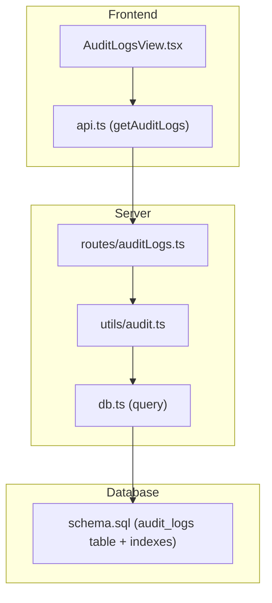
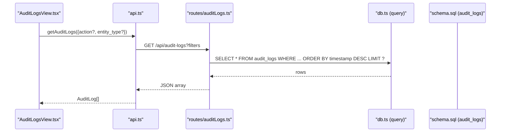
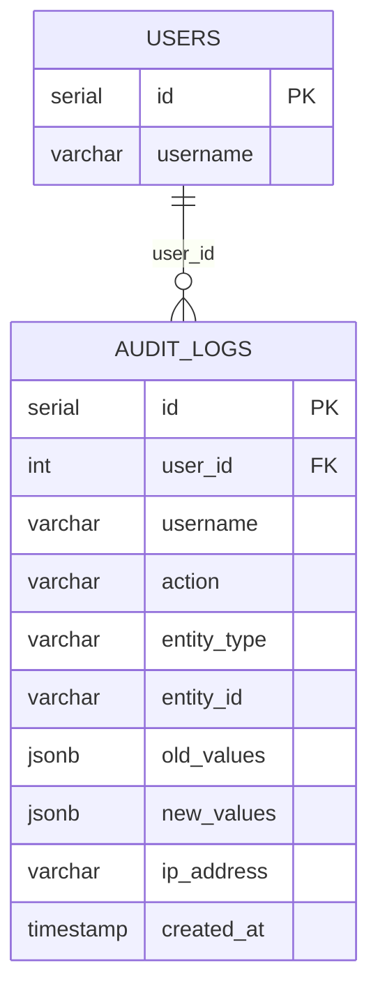
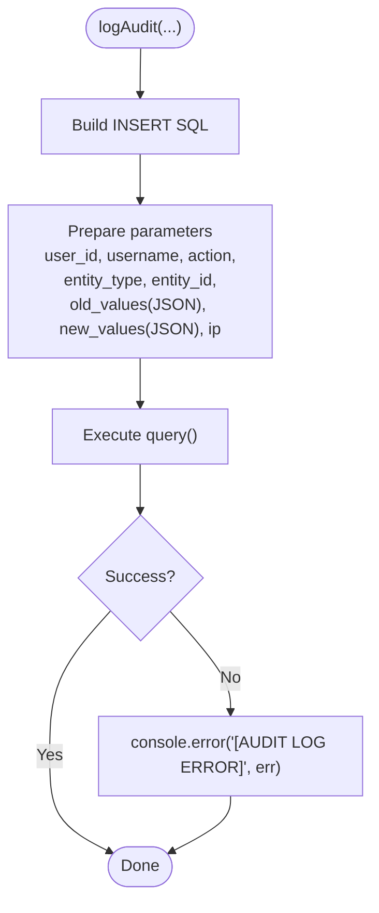
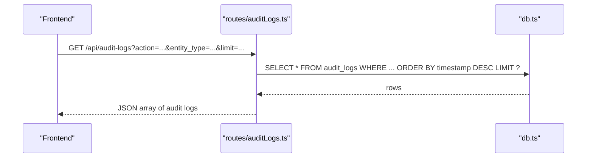
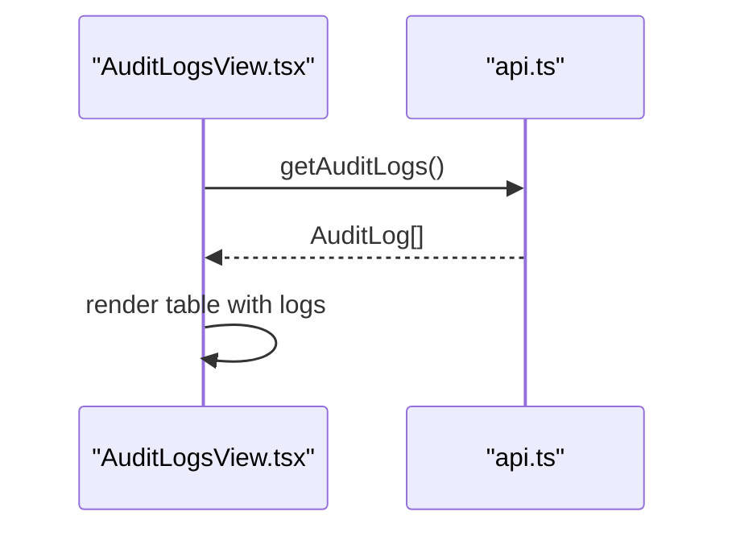
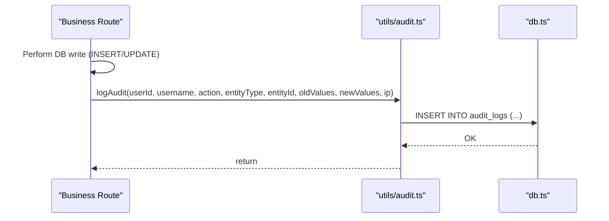
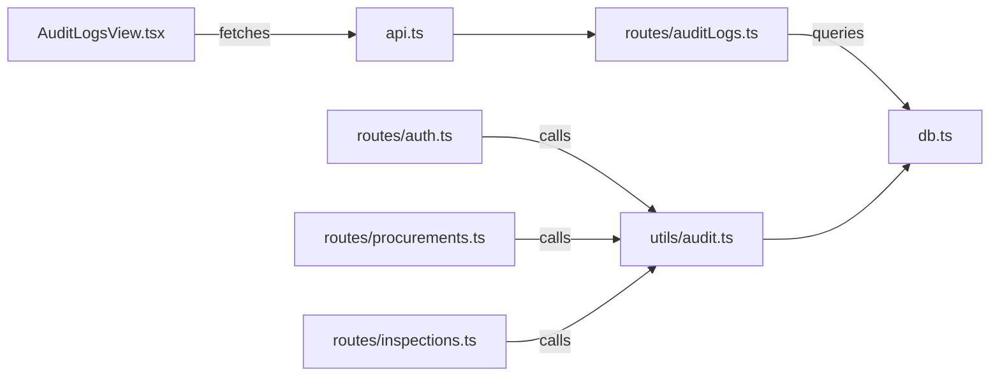

# Audit Logging System

<cite>
**Referenced Files in This Document**
- [audit.ts](file://server/utils/audit.ts)
- [auditLogs.ts](file://server/routes/auditLogs.ts)
- [schema.sql](file://database/schema.sql)
- [AuditLogsView.tsx](file://src/components/AuditLogsView.tsx)
- [api.ts](file://src/services/api.ts)
- [procurements.ts](file://server/routes/procurements.ts)
- [inspections.ts](file://server/routes/inspections.ts)
- [auth.ts](file://server/routes/auth.ts)
- [index.ts](file://src/types/index.ts)
</cite>

## Table of Contents
1. [Introduction](#introduction)
2. [Project Structure](#project-structure)
3. [Core Components](#core-components)
4. [Architecture Overview](#architecture-overview)
5. [Detailed Component Analysis](#detailed-component-analysis)
6. [Dependency Analysis](#dependency-analysis)
7. [Performance Considerations](#performance-considerations)
8. [Troubleshooting Guide](#troubleshooting-guide)
9. [Conclusion](#conclusion)
10. [Appendices](#appendices)

## Introduction
This document explains the audit logging system used to track user actions, data modifications, and system events across the procurement and inspection workflows. It covers the log entry structure, metadata capture, integration points with business logic, filtering and search capabilities, examples for critical operations, retention considerations, performance implications, and debugging approaches.

## Project Structure
The audit logging system spans server utilities, API routes, database schema, and a frontend view:
- Server utility for writing logs
- API route for querying logs with filters
- Database table definition and indexes
- Frontend component to display logs
- API client methods to fetch logs
- Business route integrations that emit audit events

**Diagram sources**
- [AuditLogsView.tsx:1-92](file://src/components/AuditLogsView.tsx#L1-L92)
- [api.ts:427-438](file://src/services/api.ts#L427-L438)
- [auditLogs.ts:1-35](file://server/routes/auditLogs.ts#L1-L35)
- [audit.ts:1-32](file://server/utils/audit.ts#L1-L32)
- [schema.sql:258-283](file://database/schema.sql#L258-L283)

**Section sources**
- [audit.ts:1-32](file://server/utils/audit.ts#L1-L32)
- [auditLogs.ts:1-35](file://server/routes/auditLogs.ts#L1-L35)
- [schema.sql:258-283](file://database/schema.sql#L258-L283)
- [AuditLogsView.tsx:1-92](file://src/components/AuditLogsView.tsx#L1-L92)
- [api.ts:427-438](file://src/services/api.ts#L427-L438)

## Core Components
- Log writer utility: centralizes insertion into the audit_logs table with consistent fields and error handling.
- Audit logs API: provides filtered retrieval of audit entries by action and entity type with pagination via limit.
- Database schema: defines the audit_logs table and supporting indexes for efficient queries.
- Frontend view: renders recent audit entries with timestamp, user, action, entity, ID, and IP address.
- Client API: exposes getAuditLogs with optional filters for action and entity_type.

Key responsibilities:
- Capture who did what, when, and on which entity, including before/after snapshots where applicable.
- Provide secure access to audit logs restricted to authorized roles.
- Support basic filtering and ordering for investigation and reporting.

**Section sources**
- [audit.ts:3-31](file://server/utils/audit.ts#L3-L31)
- [auditLogs.ts:7-32](file://server/routes/auditLogs.ts#L7-L32)
- [schema.sql:258-283](file://database/schema.sql#L258-L283)
- [AuditLogsView.tsx:6-92](file://src/components/AuditLogsView.tsx#L6-L92)
- [api.ts:427-438](file://src/services/api.ts#L427-L438)

## Architecture Overview
End-to-end flow for capturing and viewing an audit event:

**Diagram sources**
- [AuditLogsView.tsx:10-24](file://src/components/AuditLogsView.tsx#L10-L24)
- [api.ts:427-438](file://src/services/api.ts#L427-L438)
- [auditLogs.ts:7-32](file://server/routes/auditLogs.ts#L7-L32)
- [schema.sql:258-283](file://database/schema.sql#L258-L283)

## Detailed Component Analysis

### Log Entry Model and Storage
- Fields captured per log entry:
  - User identity: user_id, username
  - Action: descriptive operation name (e.g., CREATE_PROCUREMENT, UPDATE_INSPECTION)
  - Entity context: entity_type, entity_id
  - Change snapshot: old_values, new_values (JSONB)
  - Request context: ip_address
  - Timestamp: created_at
- Indexes:
  - audit_logs.user_id for fast lookups by user
  - Additional indexes exist for core tables; consider adding indexes on action and entity_type if query patterns require it.

**Diagram sources**
- [schema.sql:258-283](file://database/schema.sql#L258-L283)
- [schema.sql:67-81](file://database/schema.sql#L67-L81)

**Section sources**
- [schema.sql:258-283](file://database/schema.sql#L258-L283)

### Log Writer Utility
- Purpose: Insert audit records with robust error handling and consistent field mapping.
- Behavior:
  - Converts entity_id to string for storage consistency.
  - Serializes old/new values to JSON when present.
  - Defaults IP to loopback when not provided.
  - Logs errors to console without failing the caller.

**Diagram sources**
- [audit.ts:3-31](file://server/utils/audit.ts#L3-L31)

**Section sources**
- [audit.ts:3-31](file://server/utils/audit.ts#L3-L31)

### Audit Logs API Endpoint
- Access control: requires authentication and admin/reviewer role.
- Filtering: supports action and entity_type query parameters.
- Ordering and pagination: orders by timestamp descending and limits results via limit parameter.
- Error handling: returns a localized error message on failure.

**Diagram sources**
- [auditLogs.ts:7-32](file://server/routes/auditLogs.ts#L7-L32)

**Section sources**
- [auditLogs.ts:7-32](file://server/routes/auditLogs.ts#L7-L32)

### Frontend Audit Logs View
- Loads logs on mount using the API client method.
- Displays columns: timestamp, username, action, entity_type, entity_id, ip_address.
- Handles loading state and empty results gracefully.

**Diagram sources**
- [AuditLogsView.tsx:10-24](file://src/components/AuditLogsView.tsx#L10-L24)
- [api.ts:427-438](file://src/services/api.ts#L427-L438)

**Section sources**
- [AuditLogsView.tsx:6-92](file://src/components/AuditLogsView.tsx#L6-L92)
- [api.ts:427-438](file://src/services/api.ts#L427-L438)

### Integration Points with Business Logic
Critical operations that emit audit logs include:

- Procurement changes:
  - Creation: logs CREATE_PROCUREMENT with the newly created record.
  - Updates: logs UPDATE_PROCUREMENT with old and new values.
- Inspection updates:
  - Creation: logs CREATE_INSPECTION with the new inspection.
  - Status/metadata updates: logs UPDATE_INSPECTION with before/after snapshots.
- User management:
  - Login: logs USER_LOGIN with user context.
  - Create user: logs CREATE_USER with the new user object.
  - Update user: logs UPDATE_USER with old and new values.

**Diagram sources**
- [procurements.ts:310-319](file://server/routes/procurements.ts#L310-L319)
- [procurements.ts:427-436](file://server/routes/procurements.ts#L427-L436)
- [inspections.ts:181-190](file://server/routes/inspections.ts#L181-L190)
- [inspections.ts:239-248](file://server/routes/inspections.ts#L239-L248)
- [auth.ts:49-58](file://server/routes/auth.ts#L49-L58)
- [auth.ts:147-156](file://server/routes/auth.ts#L147-L156)
- [auth.ts:209-218](file://server/routes/auth.ts#L209-L218)
- [audit.ts:3-31](file://server/utils/audit.ts#L3-L31)

**Section sources**
- [procurements.ts:310-319](file://server/routes/procurements.ts#L310-L319)
- [procurements.ts:427-436](file://server/routes/procurements.ts#L427-L436)
- [inspections.ts:181-190](file://server/routes/inspections.ts#L181-L190)
- [inspections.ts:239-248](file://server/routes/inspections.ts#L239-L248)
- [auth.ts:49-58](file://server/routes/auth.ts#L49-L58)
- [auth.ts:147-156](file://server/routes/auth.ts#L147-L156)
- [auth.ts:209-218](file://server/routes/auth.ts#L209-L218)

### Examples: Implementing Audit Logs for Critical Operations
- Procurement creation:
  - After inserting a new procurement, call the log utility with action "CREATE_PROCUREMENT", entity_type "Procurement", and the full new record as new_values.
- Procurement update:
  - Before updating, fetch the existing record as old_values; after update, log with action "UPDATE_PROCUREMENT" and both snapshots.
- Inspection creation/update:
  - On create, log "CREATE_INSPECTION" with the new inspection.
  - On status or metadata update, log "UPDATE_INSPECTION" with old and new values.
- User management:
  - On login, log "USER_LOGIN" with user context.
  - On user create/update, log "CREATE_USER"/"UPDATE_USER" with appropriate snapshots.

These examples align with the current implementation in the respective route files.

**Section sources**
- [procurements.ts:310-319](file://server/routes/procurements.ts#L310-L319)
- [procurements.ts:427-436](file://server/routes/procurements.ts#L427-L436)
- [inspections.ts:181-190](file://server/routes/inspections.ts#L181-L190)
- [inspections.ts:239-248](file://server/routes/inspections.ts#L239-L248)
- [auth.ts:49-58](file://server/routes/auth.ts#L49-L58)
- [auth.ts:147-156](file://server/routes/auth.ts#L147-L156)
- [auth.ts:209-218](file://server/routes/auth.ts#L209-L218)

### Log Filtering and Search
- Supported filters:
  - action: exact match on the action field.
  - entity_type: exact match on the entity_type field.
- Ordering:
  - Most recent first by timestamp.
- Pagination:
  - Limit parameter controls number of returned rows.

Implementation is handled in the audit logs route with dynamic SQL construction based on provided query parameters.

**Section sources**
- [auditLogs.ts:7-32](file://server/routes/auditLogs.ts#L7-L32)
- [api.ts:427-438](file://src/services/api.ts#L427-L438)

### Data Types and Contracts
- The frontend defines an AuditLog interface that includes id, user_id, username, action, entity_type, entity_id, old_values, new_values, ip_address, and timestamp.
- The backend returns rows from audit_logs; ensure the frontend maps created_at to timestamp consistently.

**Section sources**
- [index.ts:281-292](file://src/types/index.ts#L281-L292)
- [schema.sql:258-283](file://database/schema.sql#L258-L283)

## Dependency Analysis
- The audit writer depends on the database query helper.
- Routes depend on the audit writer to emit events.
- The audit logs route depends on authentication and role middleware.
- The frontend depends on the API client to fetch logs.

**Diagram sources**
- [auth.ts:49-58](file://server/routes/auth.ts#L49-L58)
- [procurements.ts:310-319](file://server/routes/procurements.ts#L310-L319)
- [inspections.ts:181-190](file://server/routes/inspections.ts#L181-L190)
- [auditLogs.ts:1-35](file://server/routes/auditLogs.ts#L1-L35)
- [audit.ts:1-32](file://server/utils/audit.ts#L1-L32)
- [AuditLogsView.tsx:10-24](file://src/components/AuditLogsView.tsx#L10-L24)
- [api.ts:427-438](file://src/services/api.ts#L427-L438)

**Section sources**
- [auth.ts:49-58](file://server/routes/auth.ts#L49-L58)
- [procurements.ts:310-319](file://server/routes/procurements.ts#L310-L319)
- [inspections.ts:181-190](file://server/routes/inspections.ts#L181-L190)
- [auditLogs.ts:1-35](file://server/routes/auditLogs.ts#L1-L35)
- [audit.ts:1-32](file://server/utils/audit.ts#L1-L32)
- [AuditLogsView.tsx:10-24](file://src/components/AuditLogsView.tsx#L10-L24)
- [api.ts:427-438](file://src/services/api.ts#L427-L438)

## Performance Considerations
- Write path:
  - Each audit write performs a single INSERT; ensure network latency and DB load are acceptable under peak loads.
  - Errors are logged but do not fail the calling operation, preventing side effects on business transactions.
- Read path:
  - Queries filter by action and entity_type and order by timestamp; consider additional indexes on these columns if frequent filtering is required.
  - Use limit to cap result sets for UI responsiveness.
- Storage:
  - JSONB fields can grow large; monitor disk usage and consider archiving or purging strategies over time.
- Concurrency:
  - High-frequency writes may benefit from batching or asynchronous queuing in future enhancements.

[No sources needed since this section provides general guidance]

## Troubleshooting Guide
- Missing logs:
  - Verify that the relevant route calls the audit utility after successful DB operations.
  - Check for silent failures in the audit writer’s error handler.
- Incorrect or missing metadata:
  - Ensure old/new values are passed correctly for updates.
  - Confirm user context (id, username) is available in authenticated requests.
- Query performance:
  - If filtering by action/entity_type is slow, add targeted indexes.
  - Reduce default limit or implement cursor-based pagination for large datasets.
- Frontend display issues:
  - Ensure created_at is mapped to timestamp in the client model.
  - Validate that the API response shape matches the expected interface.

**Section sources**
- [audit.ts:13-31](file://server/utils/audit.ts#L13-L31)
- [auditLogs.ts:7-32](file://server/routes/auditLogs.ts#L7-L32)
- [AuditLogsView.tsx:10-24](file://src/components/AuditLogsView.tsx#L10-L24)
- [index.ts:281-292](file://src/types/index.ts#L281-L292)

## Conclusion
The audit logging system provides a consistent mechanism to record user actions and data changes across key modules. It captures essential metadata, supports basic filtering and ordering, and integrates cleanly with business routes. For production environments, consider enhancing indexing, implementing retention policies, and expanding filtering options to meet compliance and operational needs.

[No sources needed since this section summarizes without analyzing specific files]

## Appendices

### Example: Adding Audit Logs to a New Operation
- Identify the business route where the operation occurs.
- Capture old and new values around the DB mutation.
- Call the audit utility with a descriptive action and entity context.
- Test via the audit logs endpoint and frontend view.

[No sources needed since this section provides general guidance]