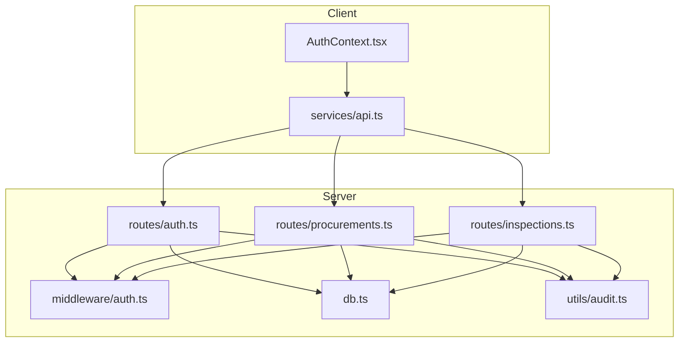
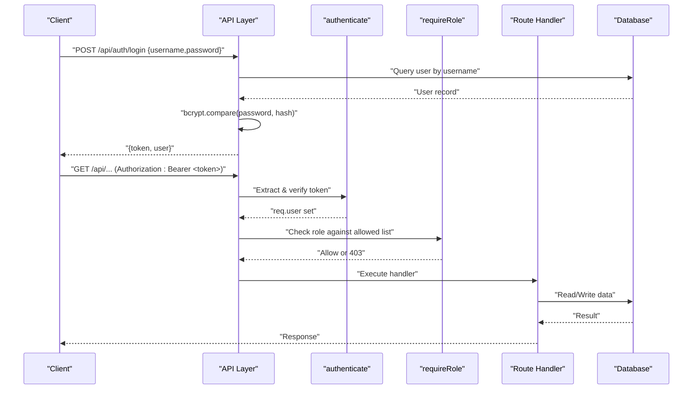
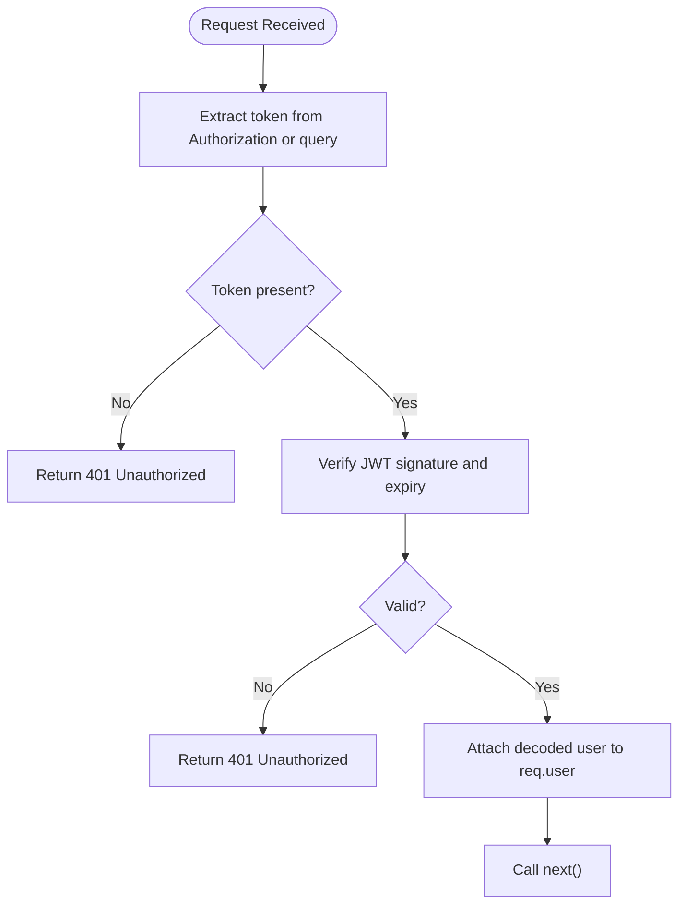
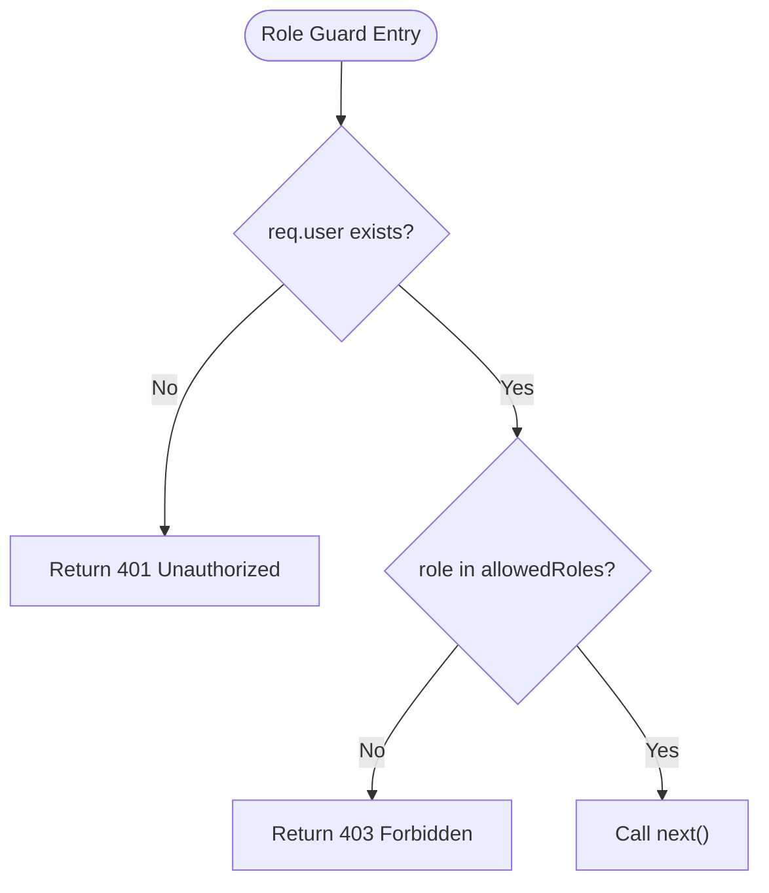
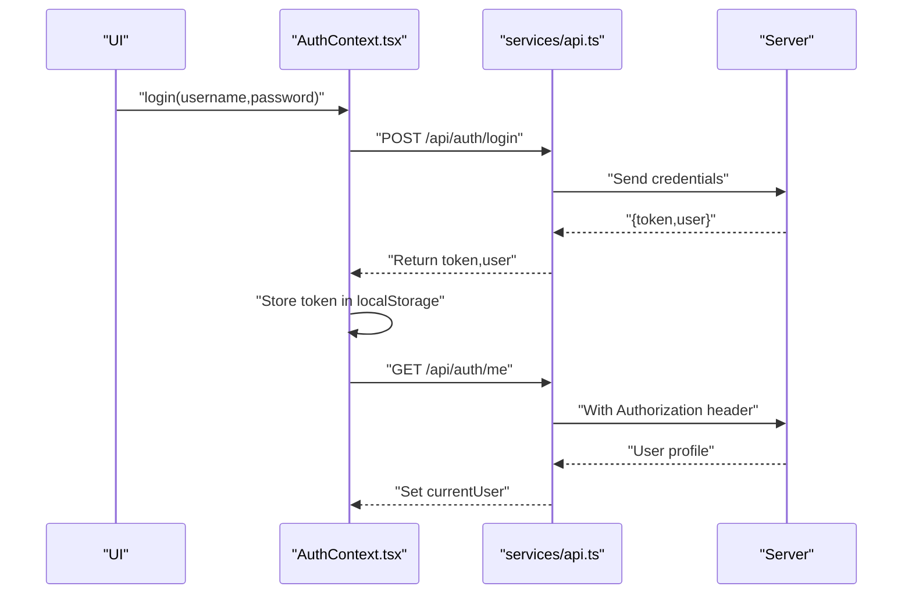
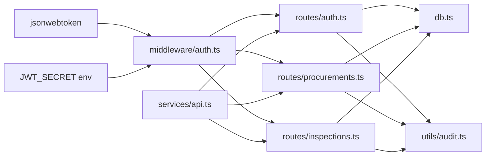

# Authentication Middleware

<cite>
**Referenced Files in This Document**
- [auth.ts](file://server/middleware/auth.ts)
- [auth.ts](file://server/routes/auth.ts)
- [api.ts](file://src/services/api.ts)
- [AuthContext.tsx](file://src/context/AuthContext.tsx)
- [db.ts](file://server/db.ts)
- [audit.ts](file://server/utils/audit.ts)
- [procurements.ts](file://server/routes/procurements.ts)
- [inspections.ts](file://server/routes/inspections.ts)
</cite>

## Table of Contents
1. [Introduction](#introduction)
2. [Project Structure](#project-structure)
3. [Core Components](#core-components)
4. [Architecture Overview](#architecture-overview)
5. [Detailed Component Analysis](#detailed-component-analysis)
6. [Dependency Analysis](#dependency-analysis)
7. [Performance Considerations](#performance-considerations)
8. [Troubleshooting Guide](#troubleshooting-guide)
9. [Conclusion](#conclusion)
10. [Appendices](#appendices)

## Introduction
This document explains the JWT-based authentication middleware system used to protect API routes, enforce role-based access control (RBAC), and manage user sessions across the application. It covers token generation and validation, extraction from headers and query parameters, RBAC via a role-checking middleware, password hashing with bcryptjs, and error handling for invalid or expired tokens. It also includes examples of protected route usage and common authentication patterns on both server and client sides.

## Project Structure
The authentication system spans server-side middleware, route handlers, database utilities, and client-side context and API helpers:
- Server middleware defines token generation/validation and role checks
- Routes apply middleware to protect endpoints
- Database layer provides user queries and audit logging
- Client context manages login state and token persistence
- Client API helper attaches Authorization headers to requests

**Diagram sources**
- [auth.ts:1-87](file://server/middleware/auth.ts#L1-L87)
- [auth.ts:1-228](file://server/routes/auth.ts#L1-L228)
- [api.ts:1-440](file://src/services/api.ts#L1-L440)
- [AuthContext.tsx:1-139](file://src/context/AuthContext.tsx#L1-L139)
- [db.ts:1-181](file://server/db.ts#L1-L181)
- [audit.ts:1-32](file://server/utils/audit.ts#L1-L32)
- [procurements.ts:1-200](file://server/routes/procurements.ts#L1-L200)
- [inspections.ts:1-200](file://server/routes/inspections.ts#L1-L200)

**Section sources**
- [auth.ts:1-87](file://server/middleware/auth.ts#L1-L87)
- [auth.ts:1-228](file://server/routes/auth.ts#L1-L228)
- [api.ts:1-440](file://src/services/api.ts#L1-L440)
- [AuthContext.tsx:1-139](file://src/context/AuthContext.tsx#L1-L139)
- [db.ts:1-181](file://server/db.ts#L1-L181)
- [audit.ts:1-32](file://server/utils/audit.ts#L1-L32)
- [procurements.ts:1-200](file://server/routes/procurements.ts#L1-L200)
- [inspections.ts:1-200](file://server/routes/inspections.ts#L1-L200)

## Core Components
- Token generation and validation:
  - Generates signed JWTs with an expiration time
  - Validates tokens from Authorization header or query parameter
  - Attaches decoded user payload to request object
- Role-based access control:
  - Middleware that enforces allowed roles per route
- Password security:
  - Uses bcryptjs to hash passwords during user creation/update
  - Compares provided passwords against stored hashes at login
- Session management:
  - Stateless session via JWT; client persists token in localStorage
  - Optional auto-login fallback for demo scenarios

Key responsibilities by file:
- server/middleware/auth.ts: Token lifecycle and authorization guards
- server/routes/auth.ts: Login flow, profile retrieval, admin-only user management
- src/services/api.ts: Adds Authorization header to all authenticated requests
- src/context/AuthContext.tsx: Manages login state, token storage, and role flags
- server/db.ts: Database connection and query helper
- server/utils/audit.ts: Logs user actions for compliance

**Section sources**
- [auth.ts:1-87](file://server/middleware/auth.ts#L1-L87)
- [auth.ts:1-228](file://server/routes/auth.ts#L1-L228)
- [api.ts:1-440](file://src/services/api.ts#L1-L440)
- [AuthContext.tsx:1-139](file://src/context/AuthContext.tsx#L1-L139)
- [db.ts:1-181](file://server/db.ts#L1-L181)
- [audit.ts:1-32](file://server/utils/audit.ts#L1-L32)

## Architecture Overview
The authentication pipeline protects routes through Express middleware:
- Client sends requests with Bearer token in Authorization header
- authenticate middleware extracts and verifies the token
- requireRole middleware validates the user’s role against allowed list
- Route handler executes only after successful auth and authorization

**Diagram sources**
- [auth.ts:20-86](file://server/middleware/auth.ts#L20-L86)
- [auth.ts:9-80](file://server/routes/auth.ts#L9-L80)
- [api.ts:23-54](file://src/services/api.ts#L23-L54)
- [db.ts:151-169](file://server/db.ts#L151-L169)

## Detailed Component Analysis

### JWT Token Lifecycle and Validation
- Token generation:
  - Signed with a secret key and configured expiration
  - Payload includes user identity and role information
- Token extraction:
  - Reads Authorization header with Bearer scheme
  - Falls back to query parameter token if present
- Token verification:
  - Verifies signature and expiration
  - Attaches decoded user to request for downstream use
- Error handling:
  - Missing token returns 401 with localized message
  - Invalid/expired token returns 401 with localized message

**Diagram sources**
- [auth.ts:36-58](file://server/middleware/auth.ts#L36-L58)

**Section sources**
- [auth.ts:20-58](file://server/middleware/auth.ts#L20-L58)

### Role-Based Access Control (RBAC)
- The role guard is a higher-order function returning middleware
- Checks presence of authenticated user
- Ensures user role is included in the allowed roles list
- Returns 401 if not authenticated, 403 if unauthorized

**Diagram sources**
- [auth.ts:74-86](file://server/middleware/auth.ts#L74-L86)

**Section sources**
- [auth.ts:74-86](file://server/middleware/auth.ts#L74-L86)

### Protected Route Examples
- Admin-only endpoints:
  - User listing and user creation/update are guarded by authenticate and requireRole(['admin'])
- Role-scoped endpoints:
  - Procurement and inspection creation require authenticate and requireRole(['admin', 'inspector'])
- Public endpoints:
  - Some read endpoints may be unprotected depending on business needs

Examples in codebase:
- Authentication and role enforcement on user management routes
- Authentication and role enforcement on procurement and inspection creation routes

**Section sources**
- [auth.ts:106-225](file://server/routes/auth.ts#L106-L225)
- [procurements.ts:175-200](file://server/routes/procurements.ts#L175-L200)
- [inspections.ts:149-197](file://server/routes/inspections.ts#L149-L197)

### Password Hashing with bcryptjs
- During login:
  - Fetches user record and compares provided password with stored hash
- During user creation/update:
  - Hashes new password before persisting
- Security notes:
  - Passwords are never stored in plaintext
  - Use appropriate salt rounds for performance/security balance

**Section sources**
- [auth.ts:18-37](file://server/routes/auth.ts#L18-L37)
- [auth.ts:138-181](file://server/routes/auth.ts#L138-L181)

### Client-Side Authentication Flow
- Token persistence:
  - Stores JWT in localStorage under a consistent key
- Header injection:
  - All API calls attach Authorization: Bearer <token> when available
- Context management:
  - Initializes current user from server on app start
  - Provides login/logout and role-based UI flags
  - Auto-logs in as default inspector when no token or token is invalid

**Diagram sources**
- [AuthContext.tsx:30-77](file://src/context/AuthContext.tsx#L30-L77)
- [api.ts:23-54](file://src/services/api.ts#L23-L54)
- [auth.ts:9-80](file://server/routes/auth.ts#L9-L80)

**Section sources**
- [AuthContext.tsx:30-100](file://src/context/AuthContext.tsx#L30-L100)
- [api.ts:23-54](file://src/services/api.ts#L23-L54)

### Audit Logging Integration
- After sensitive operations (e.g., login, create/update user), audit entries are recorded
- Captures actor, action, entity, old/new values, and IP address
- Helps track authentication-related events for compliance

**Section sources**
- [auth.ts:49-58](file://server/routes/auth.ts#L49-L58)
- [audit.ts:1-32](file://server/utils/audit.ts#L1-L32)

## Dependency Analysis
- Middleware depends on:
  - jsonwebtoken for signing and verifying tokens
  - Environment variable for secret key
- Routes depend on:
  - Middleware for authentication and authorization
  - Database utility for queries
  - Audit utility for logging
- Client depends on:
  - LocalStorage for token persistence
  - API service to attach Authorization headers

**Diagram sources**
- [auth.ts:1-34](file://server/middleware/auth.ts#L1-L34)
- [auth.ts:1-228](file://server/routes/auth.ts#L1-L228)
- [procurements.ts:1-200](file://server/routes/procurements.ts#L1-L200)
- [inspections.ts:1-200](file://server/routes/inspections.ts#L1-L200)
- [db.ts:1-181](file://server/db.ts#L1-L181)
- [audit.ts:1-32](file://server/utils/audit.ts#L1-L32)
- [api.ts:1-440](file://src/services/api.ts#L1-L440)

**Section sources**
- [auth.ts:1-34](file://server/middleware/auth.ts#L1-L34)
- [auth.ts:1-228](file://server/routes/auth.ts#L1-L228)
- [procurements.ts:1-200](file://server/routes/procurements.ts#L1-L200)
- [inspections.ts:1-200](file://server/routes/inspections.ts#L1-L200)
- [db.ts:1-181](file://server/db.ts#L1-L181)
- [audit.ts:1-32](file://server/utils/audit.ts#L1-L32)
- [api.ts:1-440](file://src/services/api.ts#L1-L440)

## Performance Considerations
- Token verification is lightweight but should be avoided unnecessarily:
  - Ensure only protected routes use authenticate middleware
- Database queries:
  - Keep queries efficient and indexed where necessary
- Password hashing:
  - Choose appropriate bcrypt cost factor balancing security and latency
- Client-side:
  - Avoid redundant re-authentication flows; cache user profile after initial load

[No sources needed since this section provides general guidance]

## Troubleshooting Guide
Common issues and resolutions:
- Missing Authorization header:
  - Ensure client sets Authorization: Bearer <token> for protected endpoints
- Invalid or expired token:
  - Re-authenticate to obtain a new token
  - Check server environment configuration for JWT secret consistency
- Unauthorized role:
  - Confirm user role matches allowed roles for the endpoint
  - Update user role or adjust route permissions as needed
- Login failures:
  - Verify credentials and active user status
  - Check database connectivity and schema integrity

Error responses observed:
- 401 Unauthorized for missing or invalid tokens
- 403 Forbidden for insufficient roles
- 400 Bad Request for missing required fields
- 500 Internal Server Error for unexpected server issues

**Section sources**
- [auth.ts:36-58](file://server/middleware/auth.ts#L36-L58)
- [auth.ts:74-86](file://server/middleware/auth.ts#L74-L86)
- [auth.ts:10-80](file://server/routes/auth.ts#L10-L80)
- [auth.ts:123-163](file://server/routes/auth.ts#L123-L163)

## Conclusion
The system implements a robust JWT-based authentication and authorization framework:
- Tokens are generated with expiration and validated on each protected request
- Role-based access control restricts sensitive operations to authorized users
- Passwords are securely hashed using bcryptjs
- Client-side context ensures seamless session management and UI adaptation
- Audit logging supports compliance and troubleshooting

For enhanced security and scalability, consider:
- Implementing refresh token strategies for long-lived sessions
- Adding rate limiting and brute-force protection on login
- Centralizing error messages and localization
- Rotating JWT secrets with minimal downtime

[No sources needed since this section summarizes without analyzing specific files]

## Appendices

### Example: Protecting a Route
- Apply authenticate and requireRole to secure endpoints:
  - Example: Creating a procurement requires admin or inspector role
  - Example: Managing users requires admin role

**Section sources**
- [procurements.ts:175-200](file://server/routes/procurements.ts#L175-L200)
- [auth.ts:106-163](file://server/routes/auth.ts#L106-L163)

### Example: Custom Authorization Decorator Pattern
- Compose multiple middlewares:
  - authenticate ensures valid session
  - requireRole enforces RBAC
  - Additional custom middlewares can be added similarly

**Section sources**
- [auth.ts:36-86](file://server/middleware/auth.ts#L36-L86)
- [inspections.ts:149-197](file://server/routes/inspections.ts#L149-L197)

### Common Authentication Patterns
- Stateless JWT sessions with client-side persistence
- Role-based route protection
- Audit logging for critical actions
- Graceful fallbacks for demo environments

**Section sources**
- [AuthContext.tsx:30-77](file://src/context/AuthContext.tsx#L30-L77)
- [api.ts:23-54](file://src/services/api.ts#L23-L54)
- [auth.ts:49-58](file://server/routes/auth.ts#L49-L58)