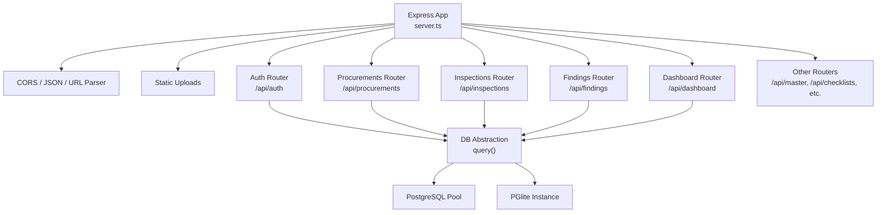
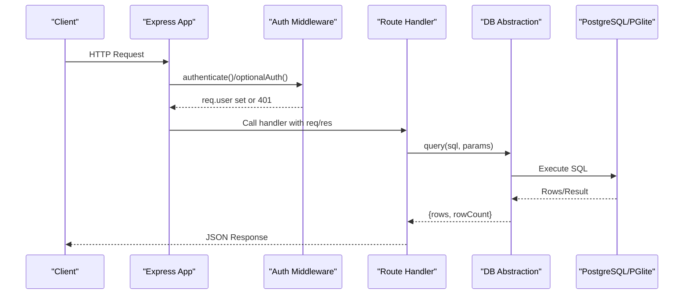
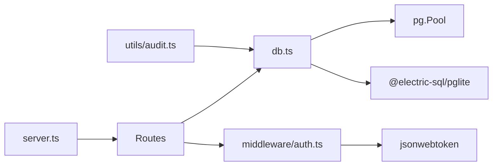

# Backend Services

<cite>
**Referenced Files in This Document**
- [server.ts](file://server.ts)
- [db.ts](file://server/db.ts)
- [auth.ts](file://server/middleware/auth.ts)
- [audit.ts](file://server/utils/audit.ts)
- [auth.ts](file://server/routes/auth.ts)
- [procurements.ts](file://server/routes/procurements.ts)
- [inspections.ts](file://server/routes/inspections.ts)
- [findings.ts](file://server/routes/findings.ts)
- [dashboard.ts](file://server/routes/dashboard.ts)
- [schema.sql](file://database/schema.sql)
- [package.json](file://package.json)
</cite>

## Table of Contents
1. Introduction
2. Project Structure
3. Core Components
4. Architecture Overview
5. Detailed Component Analysis
6. Dependency Analysis
7. Performance Considerations
8. Troubleshooting Guide
9. Conclusion
10. Appendices

## Introduction
This document describes the Express.js backend services for the NVC Procurement Monitoring & Inspection System. It covers server initialization, middleware architecture (authentication and authorization), audit logging utilities, database abstraction with dual support for PostgreSQL and PGlite, route organization, error handling patterns, request/response processing, security measures (JWT validation, password hashing, input sanitization), logging strategies, performance monitoring, debugging approaches, deployment considerations, environment configuration, and scaling strategies.

## Project Structure
The backend is organized into:
- Server entrypoint that initializes Express, mounts middleware, routes, and static assets
- Database abstraction layer supporting external PostgreSQL or embedded PGlite
- Middleware for authentication and role-based authorization
- Utility functions for audit logging
- Feature-scoped route modules for auth, procurements, inspections, findings, dashboard, and more
- Database schema and migrations

**Diagram sources**
- [server.ts:23-55](file://server.ts#L23-L55)
- [db.ts:151-180](file://server/db.ts#L151-L180)

**Section sources**
- [server.ts:23-86](file://server.ts#L23-L86)
- [package.json:14-35](file://package.json#L14-L35)

## Core Components
- Server bootstrap: Initializes DB, sets up CORS, JSON parsing, static uploads, mounts API routers, health endpoint, and Vite integration for development or static serving for production.
- Database abstraction: Provides initDb(), runMigrations(), query(), executeRaw() with dual backends (pg.Pool or PGlite).
- Authentication middleware: JWT token generation/validation, optional auth, and role-based access control.
- Audit logging utility: Inserts audit log entries with user context, action, entity details, and IP address.
- Route handlers: Organized by domain (auth, procurements, inspections, findings, dashboard, etc.) with consistent error handling and audit logging on mutations.

**Section sources**
- [server.ts:23-86](file://server.ts#L23-L86)
- [db.ts:10-97](file://server/db.ts#L10-L97)
- [db.ts:104-149](file://server/db.ts#L104-L149)
- [db.ts:151-180](file://server/db.ts#L151-L180)
- [auth.ts:20-86](file://server/middleware/auth.ts#L20-L86)
- [audit.ts:3-31](file://server/utils/audit.ts#L3-L31)

## Architecture Overview
The system follows a layered architecture:
- HTTP Layer: Express app with middleware and route modules
- Service Layer: Route handlers orchestrate business logic and call DB abstraction
- Data Layer: pg.Pool or PGlite via a unified query interface
- Cross-cutting concerns: Auth middleware, audit logging, error handling, and logging

**Diagram sources**
- [server.ts:32-55](file://server.ts#L32-L55)
- [auth.ts:36-86](file://server/middleware/auth.ts#L36-L86)
- [db.ts:151-180](file://server/db.ts#L151-L180)

## Detailed Component Analysis

### Server Initialization and Middleware
- Initializes DB before starting the server to ensure schema readiness.
- Enables CORS, JSON and URL-encoded body parsers with size limits.
- Serves uploaded files from a dedicated directory.
- Mounts feature routers under /api/* namespaces.
- Provides a health check endpoint.
- Integrates Vite for development and serves built assets in production.

Key behaviors:
- Environment-aware asset serving: dev uses Vite middleware; prod serves static dist folder and fallback to index.html.
- Centralized startup logging and error handling.

**Section sources**
- [server.ts:23-86](file://server.ts#L23-L86)

### Database Abstraction Layer (Dual Support: PostgreSQL and PGlite)
- initDb():
  - Ensures data and uploads directories exist.
  - Chooses backend based on environment variables: DATABASE_URL or PG* env vars trigger external PostgreSQL; otherwise initializes persistent PGlite instance.
  - On first run, executes schema.sql and seed data; otherwise checks for pending migrations.
  - Tracks applied migrations via schema_migrations table to ensure idempotency.
- runMigrations():
  - Creates migration tracking table if missing.
  - Reads and applies .sql migrations in sorted order, recording each applied file.
- query(text, params):
  - Unified interface returning rows and rowCount regardless of backend.
  - Logs errors with context and rethrows.
- executeRaw(sqlText):
  - Executes raw SQL statements through the active backend.

Error handling:
- Graceful reset of PGlite data directory if corrupted.
- Consistent error logging for queries.

Performance notes:
- Uses connection pooling for external PostgreSQL.
- PGlite provides embedded persistence suitable for development or small deployments.

**Section sources**
- [db.ts:10-97](file://server/db.ts#L10-L97)
- [db.ts:104-149](file://server/db.ts#L104-L149)
- [db.ts:151-180](file://server/db.ts#L151-L180)

### Authentication and Authorization Middleware
- Token generation:
  - Encodes user identity and roles into a signed JWT with expiration.
- Authentication:
  - Extracts token from Authorization header (Bearer) or query parameter.
  - Validates token and attaches decoded user to req.user.
  - Returns 401 with localized messages on missing or invalid tokens.
- Optional authentication:
  - Attempts to decode token without failing the request; useful for public endpoints that may show personalized content when authenticated.
- Role-based authorization:
  - Factory function returns middleware that enforces allowed roles.
  - Returns 401 if not authenticated, 403 if role insufficient.

Security considerations:
- Secret key sourced from environment with a safe default for local development.
- Tokens include minimal user claims needed by clients.

**Section sources**
- [auth.ts:20-86](file://server/middleware/auth.ts#L20-L86)

### Audit Logging Utility
- logAudit(userId, username, action, entityType, entityId, oldValues, newValues, ipAddress):
  - Persists structured audit records including JSONB snapshots of old/new values.
  - Captures client IP for traceability.
  - Wraps DB calls with try/catch to avoid disrupting main flows while still logging failures.

Usage pattern:
- Called after successful mutations (e.g., create/update user, procurement, inspection) to record who did what and when.

**Section sources**
- [audit.ts:3-31](file://server/utils/audit.ts#L3-L31)

### Route Handlers Organization and Patterns
- Authentication routes:
  - Login: validates credentials, compares hashed passwords, issues JWT, logs audit event.
  - Get current user: requires authentication.
  - User management: list/create/update users restricted to admin role.
- Procurements routes:
  - List with rich filtering (search, office/ministry/province/fiscal year/type/method/status) and pagination.
  - Single procurement detail includes related inspections and documents.
  - Create procurement: validates inputs, auto-generates unique codes, seeds default checklist items, creates initial inspection, logs audit.
  - Update procurement: partial updates using COALESCE semantics, logs audit.
  - Document status update: modifies document checklist entries.
- Inspections routes:
  - List with filters (status, procurement_id, office_id, search).
  - Detail view includes compliance statistics and related metadata.
  - Create/update inspection with audit logging.
- Findings routes:
  - List with filters (risk_level, status, procurement_id, inspection_id, office_id, search).
  - Detail view includes corrective actions.
  - Create finding with optional automatic creation of corrective actions.
- Dashboard route:
  - Aggregates KPIs, compliance stats, risk distribution, stage metrics, province-level counts, and recent critical alerts.

Common patterns:
- Parameterized SQL queries to prevent injection.
- Consistent error responses with localized messages.
- Audit logging for state-changing operations.
- Role guards where appropriate.

**Section sources**
- [auth.ts:10-228](file://server/routes/auth.ts#L10-L228)
- [procurements.ts:9-467](file://server/routes/procurements.ts#L9-L467)
- [inspections.ts:9-200](file://server/routes/inspections.ts#L9-L200)
- [findings.ts:9-200](file://server/routes/findings.ts#L9-L200)
- [dashboard.ts:7-107](file://server/routes/dashboard.ts#L7-L107)

### Error Handling Patterns
- Route-level try/catch blocks return standardized JSON error objects with HTTP status codes.
- Database query wrapper logs detailed errors and rethrows for upstream handling.
- Health endpoint provides operational status for monitoring.

Recommendations:
- Centralize error formatting middleware for consistent API responses.
- Add structured logging with correlation IDs per request.

**Section sources**
- [db.ts:151-180](file://server/db.ts#L151-L180)
- [auth.ts:10-228](file://server/routes/auth.ts#L10-L228)
- [procurements.ts:9-467](file://server/routes/procurements.ts#L9-L467)
- [inspections.ts:9-200](file://server/routes/inspections.ts#L9-L200)
- [findings.ts:9-200](file://server/routes/findings.ts#L9-L200)
- [dashboard.ts:7-107](file://server/routes/dashboard.ts#L7-L107)

### Security Measures
- JWT token validation:
  - Middleware verifies tokens and decodes user claims.
  - Supports optional authentication for mixed public/private endpoints.
- Password hashing:
  - Uses bcryptjs for secure password storage and comparison during login and user updates.
- Input validation and sanitization:
  - Required fields validated before DB writes.
  - Trimming of text inputs.
  - Numeric fields parsed safely.
  - Parameterized SQL prevents injection.
- Access control:
  - Role-based middleware restricts sensitive operations to authorized roles.

Environment configuration:
- JWT secret should be provided via environment variable in production.
- Database connection parameters via environment variables for external PostgreSQL.

**Section sources**
- [auth.ts:20-86](file://server/middleware/auth.ts#L20-L86)
- [auth.ts:10-228](file://server/routes/auth.ts#L10-L228)
- [procurements.ts:175-326](file://server/routes/procurements.ts#L175-L326)
- [db.ts:18-32](file://server/db.ts#L18-L32)

### Logging Strategies and Debugging
- Startup and DB lifecycle logs indicate initialization phases and outcomes.
- Query errors are logged with SQL and parameters for rapid diagnosis.
- Audit logs capture user actions, entity changes, and IPs for compliance.
- Development mode integrates Vite for hot reloading and debugging.

Debugging tips:
- Enable verbose logging in development.
- Use the health endpoint to verify service availability.
- Inspect audit_logs table for change history and troubleshooting.

**Section sources**
- [server.ts:23-86](file://server.ts#L23-L86)
- [db.ts:10-97](file://server/db.ts#L10-L97)
- [db.ts:151-180](file://server/db.ts#L151-L180)
- [audit.ts:3-31](file://server/utils/audit.ts#L3-L31)

### Deployment Considerations, Environment Configuration, and Scaling
- Environment variables:
  - JWT_SECRET: Strong secret for signing tokens in production.
  - DATABASE_URL or PGHOST/PGUSER/PGPASSWORD/PGDATABASE: External PostgreSQL connection.
  - NODE_ENV: Set to production for optimized static serving.
- Storage:
  - Ensure writable data and uploads directories exist at runtime.
  - For PGlite, persist the data directory to survive restarts.
- Static assets:
  - Build frontend with Vite and serve dist folder in production.
- Scaling:
  - Use external PostgreSQL for multi-instance deployments.
  - Place the server behind a reverse proxy (e.g., Nginx) for TLS termination and load balancing.
  - Configure process manager (PM2) or container orchestrator (Kubernetes) for high availability.
  - Tune connection pool settings for PostgreSQL based on workload.
- Monitoring:
  - Expose health endpoint for liveness/readiness probes.
  - Collect application logs centrally and monitor audit logs for anomalies.

**Section sources**
- [db.ts:18-32](file://server/db.ts#L18-L32)
- [server.ts:67-86](file://server.ts#L67-L86)
- [package.json:6-12](file://package.json#L6-L12)

## Dependency Analysis
High-level dependencies:
- Express app depends on middleware (CORS, body parsers), route modules, and DB abstraction.
- Routes depend on DB abstraction and auth middleware.
- DB abstraction depends on pg.Pool or PGlite based on environment.
- Audit utility depends on DB abstraction.

**Diagram sources**
- [server.ts:23-55](file://server.ts#L23-L55)
- [db.ts:1-7](file://server/db.ts#L1-L7)
- [auth.ts:1-4](file://server/middleware/auth.ts#L1-L4)
- [audit.ts:1-2](file://server/utils/audit.ts#L1-L2)

**Section sources**
- [server.ts:23-55](file://server.ts#L23-L55)
- [db.ts:1-7](file://server/db.ts#L1-L7)
- [auth.ts:1-4](file://server/middleware/auth.ts#L1-L4)
- [audit.ts:1-2](file://server/utils/audit.ts#L1-L2)

## Performance Considerations
- Use parameterized queries consistently to reduce parsing overhead and prevent injection.
- Leverage indexes defined in schema for frequent filters (office, status, procurement_id, risk_level).
- Paginate large result sets using limit/offset in list endpoints.
- Prefer read-only aggregation queries for dashboard endpoints; consider caching results if traffic is high.
- In production, use external PostgreSQL with tuned connection pools and query plans.
- Avoid unnecessary joins; fetch related data only when needed.

[No sources needed since this section provides general guidance]

## Troubleshooting Guide
Common issues and resolutions:
- Database not initialized:
  - Ensure initDb runs before serving requests; check startup logs.
  - Verify schema exists or migrations applied successfully.
- PGlite corruption:
  - The system resets PGlite data directory automatically on detection; confirm disk space and permissions.
- Authentication failures:
  - Validate JWT_SECRET matches between issuer and verifier.
  - Check token format and expiration.
- Permission denied:
  - Confirm user roles and required scopes for endpoints.
- Slow queries:
  - Review execution plans and add indexes where necessary.
  - Optimize complex joins and subqueries in list/detail endpoints.

Operational checks:
- Use /api/health to verify service status.
- Inspect audit_logs for recent activity and errors.
- Review application logs for stack traces and error contexts.

**Section sources**
- [db.ts:10-97](file://server/db.ts#L10-L97)
- [auth.ts:36-86](file://server/middleware/auth.ts#L36-L86)
- [server.ts:57-65](file://server.ts#L57-L65)

## Conclusion
The backend provides a robust, modular Express.js service with clear separation of concerns, strong authentication and authorization, comprehensive audit logging, and a flexible database abstraction supporting both PostgreSQL and PGlite. Route handlers follow consistent patterns for validation, error handling, and auditing. With proper environment configuration and deployment practices, the system can scale reliably in production environments.

[No sources needed since this section summarizes without analyzing specific files]

## Appendices

### Database Schema Highlights
- Core entities: roles, users, offices, ministries, provinces, districts, municipalities, fiscal_years, procurements, inspections, findings, corrective_actions, audit_logs, and supporting tables for checklists and evidence.
- Indexes optimize common queries across statuses, relationships, and risk levels.

**Section sources**
- [schema.sql:8-283](file://database/schema.sql#L8-L283)

### Package Dependencies
- Runtime dependencies include Express, CORS, JSON Web Tokens, bcryptjs, pg, PGlite, multer, and Vite tooling.
- Development dependencies include TypeScript, tsx, Tailwind CSS, and type definitions.

**Section sources**
- [package.json:14-47](file://package.json#L14-L47)