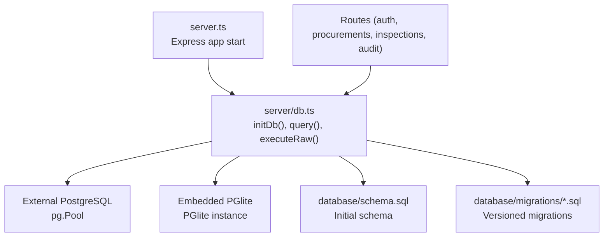
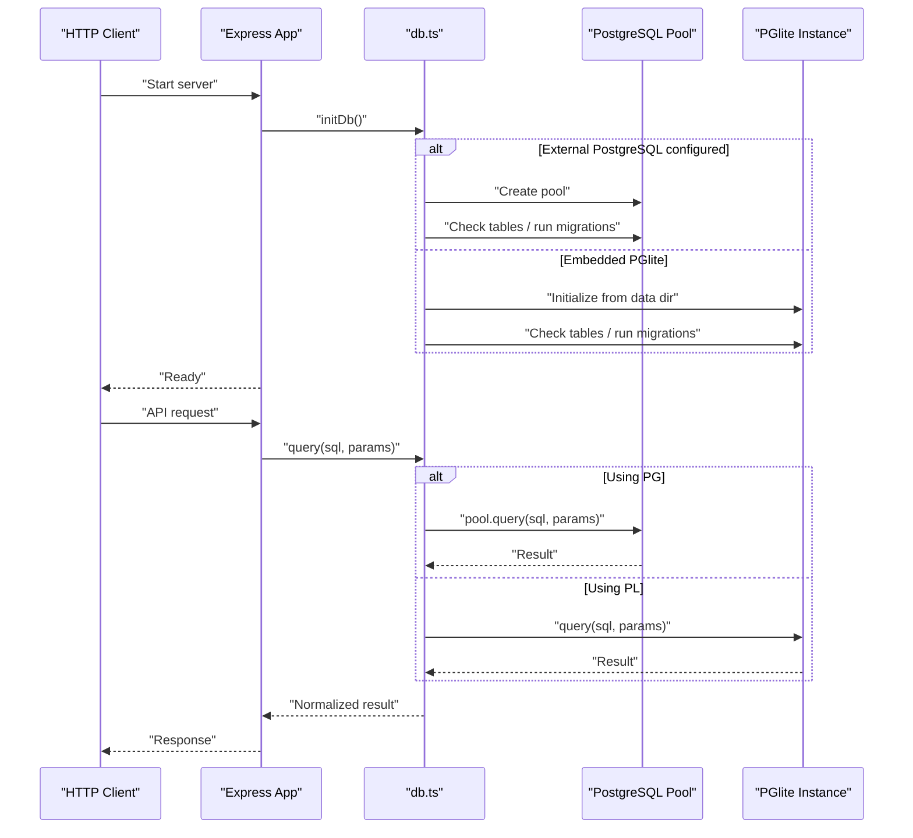
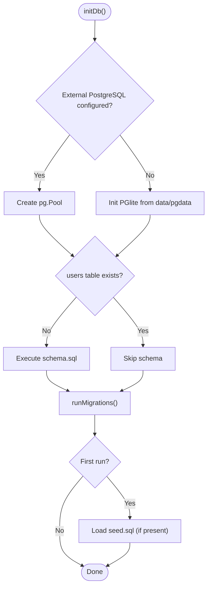
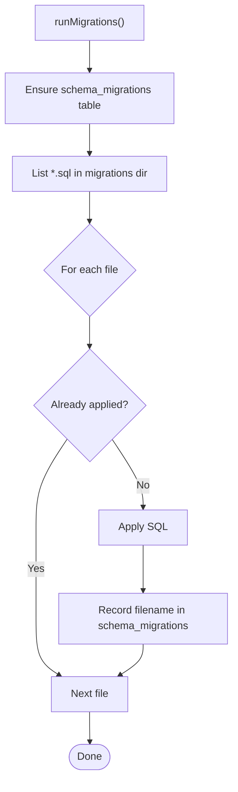
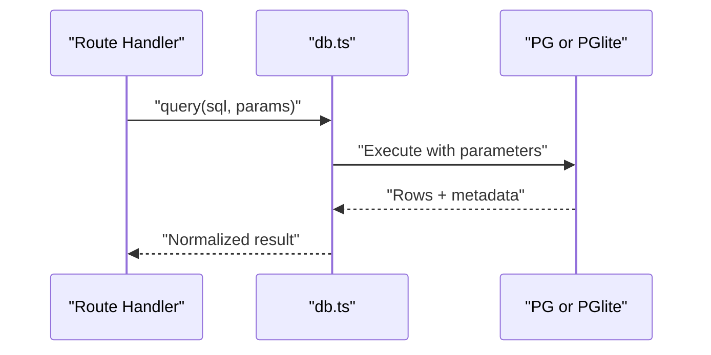
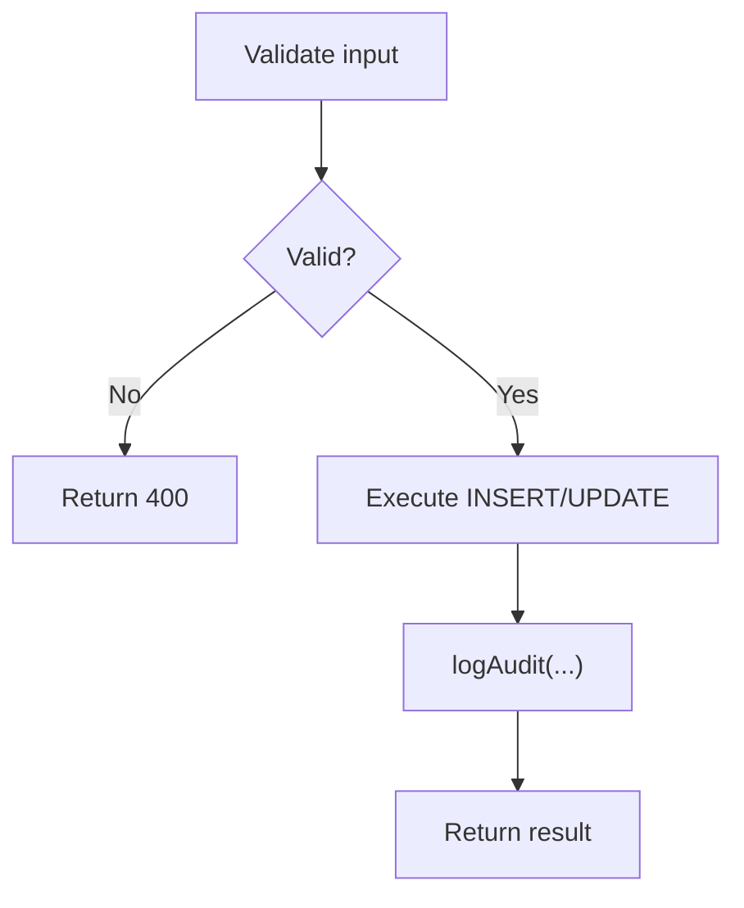
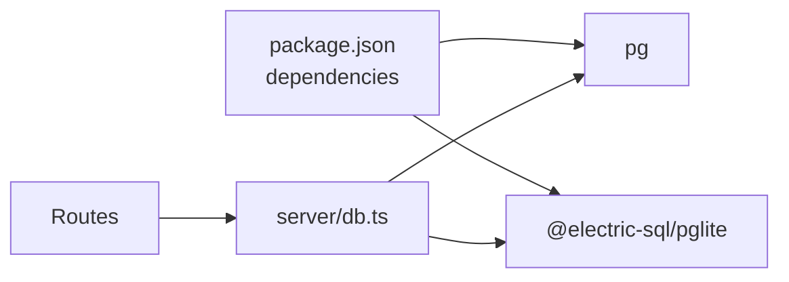

# Database Abstraction Layer

<cite>
**Referenced Files in This Document**
- [server/db.ts](file://server/db.ts)
- [database/schema.sql](file://database/schema.sql)
- [database/migrations/003_legacy_ref_text_alignment.sql](file://database/migrations/003_legacy_ref_text_alignment.sql)
- [server.ts](file://server.ts)
- [package.json](file://package.json)
- [server/routes/procurements.ts](file://server/routes/procurements.ts)
- [server/routes/auth.ts](file://server/routes/auth.ts)
- [server/routes/inspections.ts](file://server/routes/inspections.ts)
- [server/utils/audit.ts](file://server/utils/audit.ts)
</cite>

## Table of Contents
1. Introduction
2. Project Structure
3. Core Components
4. Architecture Overview
5. Detailed Component Analysis
6. Dependency Analysis
7. Performance Considerations
8. Troubleshooting Guide
9. Conclusion
10. Appendices

## Introduction
This document describes the database abstraction layer that supports dual database engines: an external PostgreSQL server and an embedded PGlite instance. It explains initialization, connection management, query execution patterns, migration strategy, error handling, and usage across routes. It also provides guidance on performance optimization, lifecycle management, troubleshooting connectivity issues, and backup/recovery procedures for both backends.

## Project Structure
The database abstraction is implemented in a single module that auto-selects between an external PostgreSQL pool or an embedded PGlite instance based on environment variables. The application bootstraps this module during startup to ensure schema readiness and migrations are applied before serving requests.

**Diagram sources**
- [server.ts:23-30](file://server.ts#L23-L30)
- [server/db.ts:10-97](file://server/db.ts#L10-L97)
- [database/schema.sql:1-283](file://database/schema.sql#L1-L283)
- [database/migrations/003_legacy_ref_text_alignment.sql:1-42](file://database/migrations/003_legacy_ref_text_alignment.sql#L1-L42)

**Section sources**
- [server.ts:23-30](file://server.ts#L23-L30)
- [server/db.ts:10-97](file://server/db.ts#L10-L97)

## Core Components
- Initialization and engine selection: Determines whether to use an external PostgreSQL pool or an embedded PGlite instance based on environment variables. Ensures required directories exist and initializes the chosen backend.
- Schema and migrations: On first run, executes the full schema file; on subsequent runs, applies versioned migrations tracked by a schema_migrations table.
- Query interface: Provides a unified query function that transparently uses either pg.Pool or PGlite, returning normalized results.
- Raw execution: Utility to run arbitrary SQL when needed.

Key responsibilities:
- Connection lifecycle: Pool creation and reuse for external PostgreSQL; persistent data directory management for PGlite.
- Migration tracking: Idempotent application of migrations using a metadata table.
- Error logging: Centralized logging of query errors with context.

**Section sources**
- [server/db.ts:10-97](file://server/db.ts#L10-L97)
- [server/db.ts:104-149](file://server/db.ts#L104-L149)
- [server/db.ts:151-180](file://server/db.ts#L151-L180)

## Architecture Overview
The system abstracts two backends behind a common interface. Routes call the shared query functions without knowing which backend is active. The server initializes the database at startup to guarantee schema readiness.

**Diagram sources**
- [server.ts:23-30](file://server.ts#L23-L30)
- [server/db.ts:10-97](file://server/db.ts#L10-L97)
- [server/db.ts:151-180](file://server/db.ts#L151-L180)

## Detailed Component Analysis

### Database Initialization and Engine Selection
- Environment-driven mode: If DATABASE_URL or PGHOST+PGDATABASE are set, an external PostgreSQL pool is created; otherwise, an embedded PGlite instance is initialized from a persistent data directory under data/pgdata.
- Directory setup: Ensures data and uploads directories exist.
- First-run detection: Checks for the users table to decide whether to run the full schema and seed data.
- Migrations: Creates a schema_migrations table if missing and applies pending .sql files in order.

**Diagram sources**
- [server/db.ts:10-97](file://server/db.ts#L10-L97)

**Section sources**
- [server/db.ts:10-97](file://server/db.ts#L10-L97)

### Migration Strategy
- Versioned migrations: All .sql files under database/migrations are executed in sorted order.
- Idempotency: Each migration’s filename is recorded in schema_migrations to prevent reapplication.
- Example migration: Demonstrates safe updates to legacy text fields aligned with new checklist stages.

**Diagram sources**
- [server/db.ts:104-149](file://server/db.ts#L104-L149)
- [database/migrations/003_legacy_ref_text_alignment.sql:12-41](file://database/migrations/003_legacy_ref_text_alignment.sql#L12-L41)

**Section sources**
- [server/db.ts:104-149](file://server/db.ts#L104-L149)
- [database/migrations/003_legacy_ref_text_alignment.sql:1-42](file://database/migrations/003_legacy_ref_text_alignment.sql#L1-L42)

### Query Execution Patterns
- Unified interface: query(text, params) returns { rows, rowCount } regardless of backend.
- Parameterized queries: Routes consistently pass parameters to avoid injection risks.
- Raw execution: executeRaw(sqlText) allows multi-statement or DDL where necessary.

Examples in routes:
- Authentication login reads user records with joins and validates credentials.
- Procurement listing builds dynamic filters and paginates results.
- Inspection detail fetches statistics via aggregation queries.

**Diagram sources**
- [server/db.ts:151-180](file://server/db.ts#L151-L180)
- [server/routes/auth.ts:18-25](file://server/routes/auth.ts#L18-L25)
- [server/routes/procurements.ts:24-108](file://server/routes/procurements.ts#L24-L108)
- [server/routes/inspections.ts:13-62](file://server/routes/inspections.ts#L13-L62)

**Section sources**
- [server/db.ts:151-180](file://server/db.ts#L151-L180)
- [server/routes/auth.ts:18-25](file://server/routes/auth.ts#L18-L25)
- [server/routes/procurements.ts:24-108](file://server/routes/procurements.ts#L24-L108)
- [server/routes/inspections.ts:13-62](file://server/routes/inspections.ts#L13-L62)

### Transaction Handling
- Current implementation: No explicit transaction wrappers are used in the database module or routes. Multi-step writes rely on individual query calls.
- Recommendation: Introduce a transaction helper that acquires a client from the pool (for external PostgreSQL) or wraps statements within a single PGlite transaction to ensure atomicity for multi-step operations such as creating a procurement and its related documents and inspection.

[No sources needed since this section provides general guidance]

### Data Validation and CRUD Examples
- Input validation: Routes validate required fields before issuing queries (e.g., title, type, method, office, fiscal year).
- Create: Insert with RETURNING to obtain the new record and generate codes.
- Read: Filtered list queries with pagination and aggregations.
- Update: Conditional updates using COALESCE to preserve existing values when not provided.
- Audit logging: Side-effecting audit entries are logged after mutations.

**Diagram sources**
- [server/routes/procurements.ts:175-259](file://server/routes/procurements.ts#L175-L259)
- [server/routes/procurements.ts:329-425](file://server/routes/procurements.ts#L329-L425)
- [server/utils/audit.ts:3-31](file://server/utils/audit.ts#L3-L31)

**Section sources**
- [server/routes/procurements.ts:175-259](file://server/routes/procurements.ts#L175-L259)
- [server/routes/procurements.ts:329-425](file://server/routes/procurements.ts#L329-L425)
- [server/utils/audit.ts:3-31](file://server/utils/audit.ts#L3-L31)

### Connection Lifecycle Management
- External PostgreSQL: Uses a connection pool configured via environment variables. Connections are acquired and released per query.
- Embedded PGlite: Initializes once from a persistent data directory; handles recovery by resetting the data directory if corruption is detected.
- Startup: The server calls initDb() before starting HTTP listeners to ensure the database is ready.

**Section sources**
- [server/db.ts:10-48](file://server/db.ts#L10-L48)
- [server.ts:23-30](file://server.ts#L23-L30)

### Error Handling Patterns
- Centralized logging: Query errors are logged with SQL and parameters for debugging.
- Route-level handling: Each route catches errors and returns consistent JSON error responses.
- Audit resilience: Audit logging failures are caught and logged without failing the main operation.

**Section sources**
- [server/db.ts:151-180](file://server/db.ts#L151-L180)
- [server/routes/procurements.ts:109-112](file://server/routes/procurements.ts#L109-L112)
- [server/routes/auth.ts:76-79](file://server/routes/auth.ts#L76-L79)
- [server/utils/audit.ts:28-31](file://server/utils/audit.ts#L28-L31)

## Dependency Analysis
The database abstraction depends on:
- pg for external PostgreSQL pooling.
- @electric-sql/pglite for embedded PostgreSQL.
- Filesystem utilities for reading schema and migrations.

Routes depend on the abstraction for all data access.

**Diagram sources**
- [package.json:14-35](file://package.json#L14-L35)
- [server/db.ts:1-4](file://server/db.ts#L1-L4)

**Section sources**
- [package.json:14-35](file://package.json#L14-L35)
- [server/db.ts:1-4](file://server/db.ts#L1-L4)

## Performance Considerations
- Indexes: The schema defines indexes on frequently filtered columns (e.g., status, foreign keys). Ensure these remain relevant as queries evolve.
- Query design: Use parameterized queries and selective joins; avoid SELECT * in hot paths; leverage LIMIT/OFFSET for pagination.
- Connection pooling: Tune pg.Pool settings (max connections, idle timeout) according to workload and host resources.
- PGlite considerations: Keep transactions small; avoid long-running queries; monitor disk I/O for the data directory.
- Batch operations: Group independent inserts/updates into a single statement where possible to reduce round-trips.

[No sources needed since this section provides general guidance]

## Troubleshooting Guide
Common issues and resolutions:
- External PostgreSQL connectivity:
  - Verify DATABASE_URL or PGHOST/PGDATABASE/PGUSER/PGPASSWORD/PGPORT environment variables.
  - Confirm network reachability and firewall rules.
  - Check authentication and permissions on the target database.
- PGlite initialization failure:
  - Corrupted data directory triggers automatic reset; verify data/pgdata path permissions and disk space.
  - Ensure sufficient memory and CPU for embedded database operations.
- Migration problems:
  - Inspect schema_migrations to confirm applied files.
  - Validate migration SQL syntax and idempotency.
- Query errors:
  - Review logs for SQL and parameters; check constraint violations and missing indexes.
- Audit logging failures:
  - Non-fatal; investigate separately if audit gaps appear.

**Section sources**
- [server/db.ts:18-48](file://server/db.ts#L18-L48)
- [server/db.ts:104-149](file://server/db.ts#L104-L149)
- [server/db.ts:151-180](file://server/db.ts#L151-L180)

## Conclusion
The database abstraction cleanly supports both external PostgreSQL and embedded PGlite through a unified interface, automated initialization, and robust migration handling. Routes benefit from consistent query patterns and centralized error logging. To further improve reliability and performance, consider adding transaction helpers, tuning pool settings, and periodically reviewing query plans and indexes.

[No sources needed since this section summarizes without analyzing specific files]

## Appendices

### Backup and Recovery Procedures

- External PostgreSQL:
  - Logical backups: Use pg_dump to export schemas and data; schedule regular dumps and retain offsite copies.
  - Physical backups: Use base backups and WAL archiving for point-in-time recovery.
  - Restore: Recreate databases and restore dumps or PITR as needed; verify integrity post-restore.

- Embedded PGlite:
  - File-based backup: Copy the entire data/pgdata directory while the process is stopped to ensure consistency.
  - Recovery: Replace the data directory with a known-good copy and restart the server.
  - Rotation: Implement periodic snapshots of data/pgdata and prune old backups.

[No sources needed since this section provides general guidance]