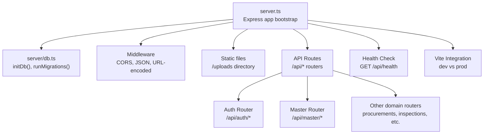
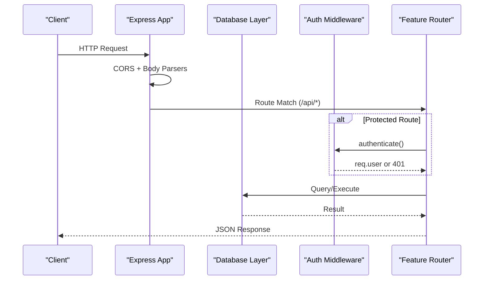
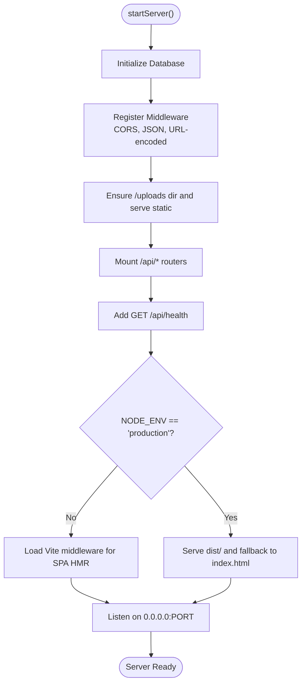
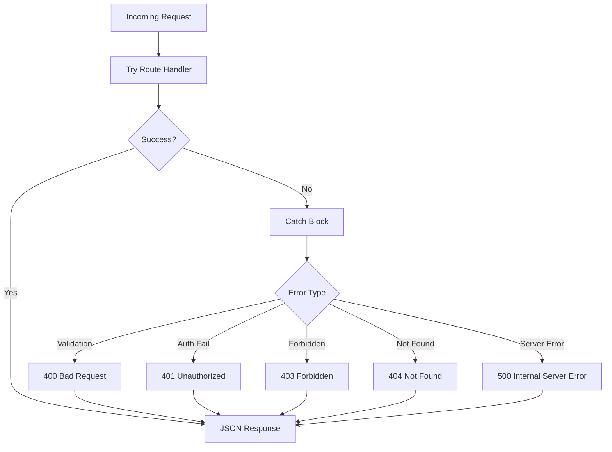
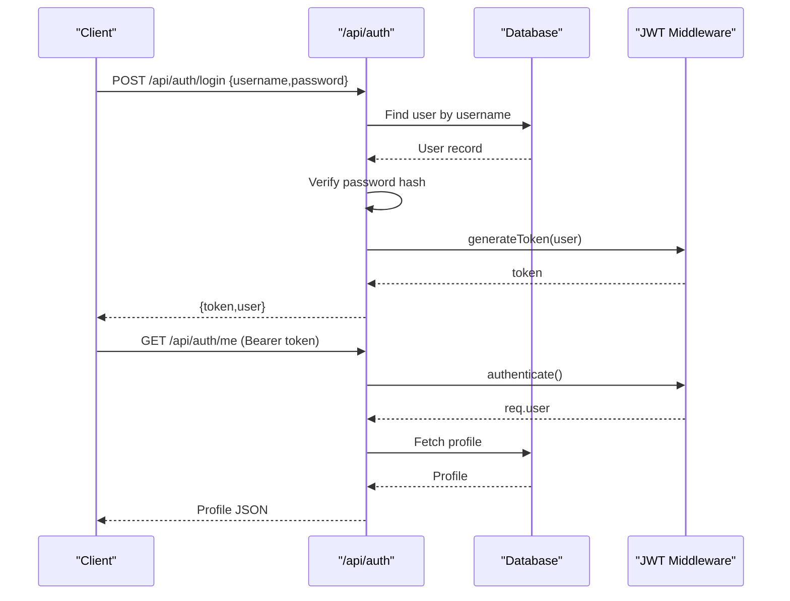
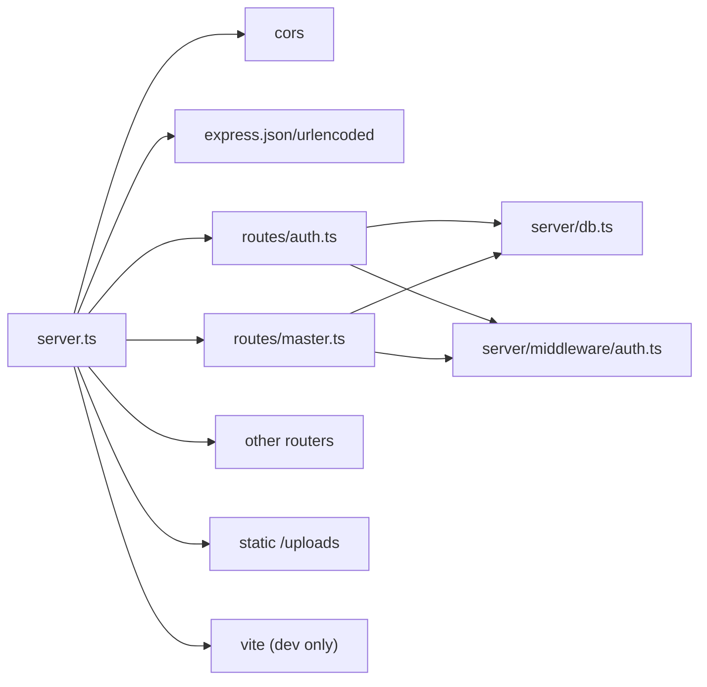

# Server Configuration

<cite>
**Referenced Files in This Document**
- [server.ts](file://server.ts)
- [vite.config.ts](file://vite.config.ts)
- [package.json](file://package.json)
- [server/db.ts](file://server/db.ts)
- [server/middleware/auth.ts](file://server/middleware/auth.ts)
- [server/routes/auth.ts](file://server/routes/auth.ts)
- [server/routes/master.ts](file://server/routes/master.ts)
- [server/utils/audit.ts](file://server/utils/audit.ts)
</cite>

## Table of Contents
1. Introduction
2. Project Structure
3. Core Components
4. Architecture Overview
5. Detailed Component Analysis
6. Dependency Analysis
7. Performance Considerations
8. Troubleshooting Guide
9. Conclusion

## Introduction
This document explains how the Express.js server is configured and initialized, including startup sequence, middleware setup (CORS, JSON parsing, URL encoding with size limits), static file serving for uploads, Vite integration for development versus production, route mounting structure and API organization, health check endpoint implementation, error handling strategies, environment-specific configurations, port settings, and deployment considerations for both development and production modes.

## Project Structure
The server entry point initializes the application, sets up middleware, mounts API routes, serves static assets, integrates Vite during development, and starts listening on a port. Database initialization and migrations are performed before the server begins accepting requests.

**Diagram sources**
- [server.ts:23-86](file://server.ts#L23-L86)
- [server/db.ts:10-97](file://server/db.ts#L10-L97)
- [server/routes/auth.ts:1-228](file://server/routes/auth.ts#L1-L228)
- [server/routes/master.ts:1-162](file://server/routes/master.ts#L1-L162)

**Section sources**
- [server.ts:23-86](file://server.ts#L23-L86)
- [server/db.ts:10-97](file://server/db.ts#L10-L97)

## Core Components
- Express application lifecycle: creation, middleware registration, route mounting, static serving, Vite integration, and listening.
- Database initialization: automatic schema execution, migration application, and optional embedded or external PostgreSQL configuration.
- Authentication middleware: JWT-based authentication and role-based authorization helpers.
- Audit logging utility: records user actions to an audit log table.

Key responsibilities:
- server.ts: orchestrates startup, middleware, routes, static assets, and environment-aware frontend serving.
- server/db.ts: manages database connection strategy, schema, migrations, and query helpers.
- server/middleware/auth.ts: token generation, request authentication, and role enforcement.
- server/utils/audit.ts: writes audit entries for important operations.

**Section sources**
- [server.ts:23-86](file://server.ts#L23-L86)
- [server/db.ts:10-97](file://server/db.ts#L10-L97)
- [server/middleware/auth.ts:20-86](file://server/middleware/auth.ts#L20-L86)
- [server/utils/audit.ts:3-31](file://server/utils/audit.ts#L3-L31)

## Architecture Overview
The server follows a layered architecture:
- Entry layer: Express app setup and lifecycle management.
- Middleware layer: CORS, body parsers, authentication, and authorization.
- Route layer: Feature-scoped routers under /api namespaces.
- Data layer: Database abstraction supporting embedded PGlite or external PostgreSQL via pg.Pool.
- Static and dev tooling: Uploads directory served statically; Vite integrated for development; production serves built assets.

**Diagram sources**
- [server.ts:32-55](file://server.ts#L32-L55)
- [server/middleware/auth.ts:36-86](file://server/middleware/auth.ts#L36-L86)
- [server/db.ts:151-169](file://server/db.ts#L151-L169)
- [server/routes/auth.ts:10-80](file://server/routes/auth.ts#L10-L80)

## Detailed Component Analysis

### Server Startup Sequence
- Creates the Express app and defines the port.
- Initializes the database before any request handling.
- Registers global middleware: CORS, JSON parser with size limit, URL-encoded parser with size limit.
- Ensures the uploads directory exists and serves it statically at /uploads.
- Mounts feature routers under /api prefixes.
- Adds a health check endpoint at GET /api/health.
- Integrates Vite in development mode or serves built assets in production.
- Starts listening on 0.0.0.0 and logs readiness.

**Diagram sources**
- [server.ts:23-86](file://server.ts#L23-L86)

**Section sources**
- [server.ts:23-86](file://server.ts#L23-L86)

### Middleware Setup
- CORS: Enabled globally to allow cross-origin requests from the frontend.
- JSON parsing: Configured with a generous payload size limit to support large payloads.
- URL-encoded parsing: Enabled with extended mode and matching size limit.

These are registered early so all routes benefit from consistent request parsing and cross-origin behavior.

**Section sources**
- [server.ts:32-35](file://server.ts#L32-L35)

### Static File Serving for Uploads
- The server resolves the uploads directory relative to the process working directory.
- It ensures the directory exists by creating it recursively if missing.
- Serves uploaded files under the /uploads path using Express static middleware.

This allows clients to retrieve previously uploaded assets directly via HTTP.

**Section sources**
- [server.ts:37-42](file://server.ts#L37-L42)

### Vite Integration (Development vs Production)
- Development: Dynamically imports Vite and uses its middleware in middlewareMode for hot module replacement and SPA handling.
- Production: Serves the prebuilt assets from the dist directory and falls back to index.html for client-side routing.

This dual-mode approach provides a smooth developer experience while optimizing runtime performance in production.

**Section sources**
- [server.ts:67-82](file://server.ts#L67-L82)
- [vite.config.ts:6-22](file://vite.config.ts#L6-L22)

### Route Mounting Structure and API Organization
All feature routers are mounted under a common /api namespace:
- /api/auth: Authentication endpoints (login, profile, user management).
- /api/master: Master data endpoints (stages, provinces, districts, municipalities, ministries, offices, fiscal years, roles).
- /api/procurements, /api/checklists, /api/inspections, /api/findings, /api/corrective-actions, /api/evidence, /api/dashboard, /api/reports, /api/audit-logs: Domain-specific features.

Each router encapsulates related endpoints and applies authentication and authorization where needed.

**Section sources**
- [server.ts:44-55](file://server.ts#L44-L55)
- [server/routes/auth.ts:1-228](file://server/routes/auth.ts#L1-L228)
- [server/routes/master.ts:1-162](file://server/routes/master.ts#L1-L162)

### Health Check Endpoint
- GET /api/health returns a JSON object indicating system status, name, version, and timestamp.
- Useful for liveness probes and monitoring dashboards.

**Section sources**
- [server.ts:57-65](file://server.ts#L57-L65)

### Error Handling Strategies
- Global startup errors: Fatal startup errors are caught and logged, then the process exits with a non-zero code.
- Route-level errors: Each route wraps logic in try/catch blocks and returns appropriate HTTP status codes with error messages.
- Database errors: Centralized query helper logs detailed context and rethrows errors for upstream handlers to respond consistently.
- Authentication failures: Unauthorized and forbidden responses are returned when tokens are invalid or roles are insufficient.

**Diagram sources**
- [server.ts:89-92](file://server.ts#L89-L92)
- [server/routes/auth.ts:10-80](file://server/routes/auth.ts#L10-L80)
- [server/db.ts:151-169](file://server/db.ts#L151-L169)

**Section sources**
- [server.ts:89-92](file://server.ts#L89-L92)
- [server/routes/auth.ts:10-80](file://server/routes/auth.ts#L10-L80)
- [server/db.ts:151-169](file://server/db.ts#L151-L169)

### Environment-Specific Configurations and Port Settings
- Port: Hardcoded to 3000 in the server entry point.
- Frontend build mode: Determined by NODE_ENV; development uses Vite middleware; production serves static dist assets.
- Database mode:
  - External PostgreSQL: Activated when DATABASE_URL or PGHOST/PGDATABASE are set. Uses pg.Pool with connection parameters from environment variables.
  - Embedded PGlite: Used when no external database is configured; stores data under a local data directory and supports migrations.
- JWT secret: Read from JWT_SECRET with a default fallback for development convenience.

Deployment considerations:
- In production, ensure NODE_ENV=production and build the frontend assets prior to starting the server.
- For external databases, configure DATABASE_URL or PGHOST/PGUSER/PGPASSWORD/PGDATABASE/PGPORT appropriately.
- Set a strong JWT_SECRET in production.
- Ensure the uploads directory is writable by the running process.

**Section sources**
- [server.ts:23-86](file://server.ts#L23-L86)
- [server/db.ts:18-48](file://server/db.ts#L18-L48)
- [server/middleware/auth.ts:4](file://server/middleware/auth.ts#L4)
- [package.json:6-12](file://package.json#L6-L12)

### Authentication and Authorization Flow
- Login endpoint validates credentials, generates a JWT, and returns it along with user details.
- Protected routes use the authenticate middleware to verify the token and attach user info to the request.
- Role-based access control is enforced via requireRole for admin-only endpoints.

**Diagram sources**
- [server/routes/auth.ts:10-80](file://server/routes/auth.ts#L10-L80)
- [server/middleware/auth.ts:20-86](file://server/middleware/auth.ts#L20-L86)

**Section sources**
- [server/routes/auth.ts:10-80](file://server/routes/auth.ts#L10-L80)
- [server/middleware/auth.ts:20-86](file://server/middleware/auth.ts#L20-L86)

### Audit Logging
- Critical mutations log user actions through a centralized utility that inserts records into an audit_logs table.
- Includes user identification, action type, entity information, old/new values, and IP address.

**Section sources**
- [server/utils/audit.ts:3-31](file://server/utils/audit.ts#L3-L31)
- [server/routes/auth.ts:49-58](file://server/routes/auth.ts#L49-L58)
- [server/routes/master.ts:124-133](file://server/routes/master.ts#L124-L133)

## Dependency Analysis
The server composes several modules:
- Express app depends on CORS and body parsers.
- Routers depend on database queries and auth middleware.
- Database module abstracts connection and migration logic.
- Vite integration is conditional based on environment.

**Diagram sources**
- [server.ts:1-18](file://server.ts#L1-L18)
- [server.ts:32-82](file://server.ts#L32-L82)
- [server/routes/auth.ts:1-5](file://server/routes/auth.ts#L1-L5)
- [server/routes/master.ts:1-4](file://server/routes/master.ts#L1-L4)
- [server/db.ts:1-4](file://server/db.ts#L1-L4)
- [server/middleware/auth.ts:1-4](file://server/middleware/auth.ts#L1-L4)

**Section sources**
- [server.ts:1-18](file://server.ts#L1-L18)
- [server.ts:32-82](file://server.ts#L32-L82)

## Performance Considerations
- Body size limits: JSON and URL-encoded parsers are configured with a 20mb limit to accommodate larger payloads such as file metadata or bulk operations.
- Static asset serving: In production, serving prebuilt assets reduces runtime overhead compared to dev-time compilation.
- Database pooling: When using external PostgreSQL, a connection pool improves concurrency and throughput.
- Conditional Vite loading: Vite is only loaded in development to avoid unnecessary overhead in production.

[No sources needed since this section provides general guidance]

## Troubleshooting Guide
Common issues and resolutions:
- Startup failure: Fatal startup errors are logged and the process exits. Check console output for stack traces and ensure dependencies and environment variables are correct.
- Database connectivity: If using external PostgreSQL, verify DATABASE_URL or PG* environment variables. For embedded PGlite, ensure the data directory is writable and not corrupted.
- Authentication errors: Ensure JWT_SECRET is correctly configured and tokens are valid. Invalid or expired tokens result in 401 responses.
- Uploads not accessible: Confirm the uploads directory exists and is readable by the server process.
- Frontend not loading in production: Ensure the build step has been executed and the dist directory contains the necessary assets.

**Section sources**
- [server.ts:89-92](file://server.ts#L89-L92)
- [server/db.ts:18-48](file://server/db.ts#L18-L48)
- [server/middleware/auth.ts:36-86](file://server/middleware/auth.ts#L36-L86)
- [server.ts:37-42](file://server.ts#L37-L42)

## Conclusion
The server is structured to be robust and environment-aware, providing clear separation between middleware, routes, and data access. It supports both embedded and external databases, integrates Vite for development, and serves static assets in production. Authentication and authorization are centralized, and audit logging helps track critical actions. With proper environment configuration and build steps, the server can be deployed reliably in both development and production environments.