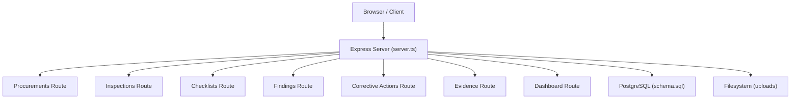
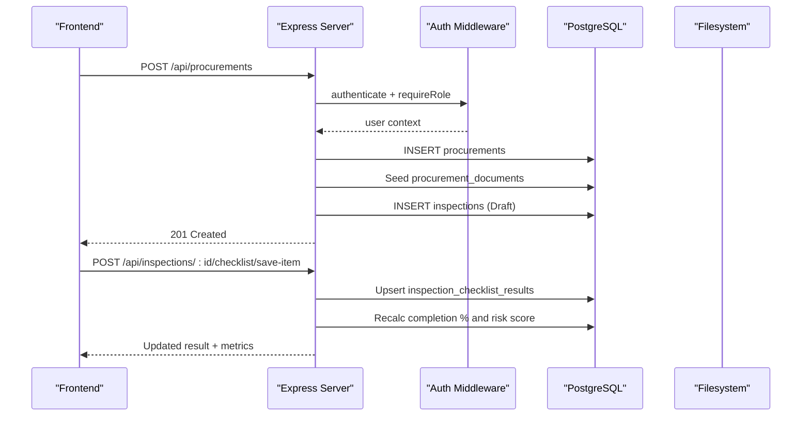
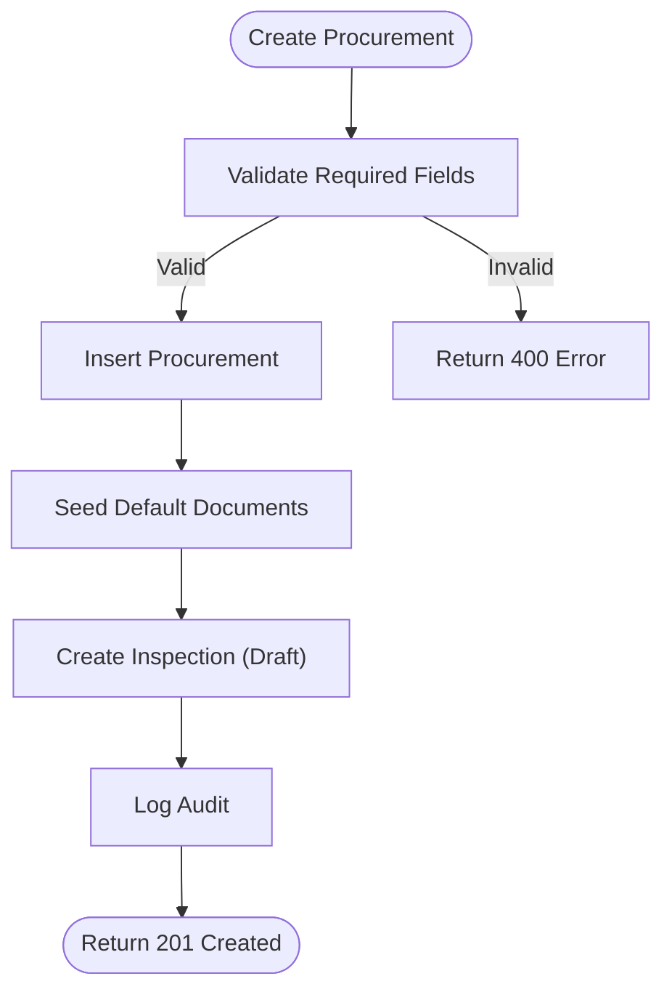
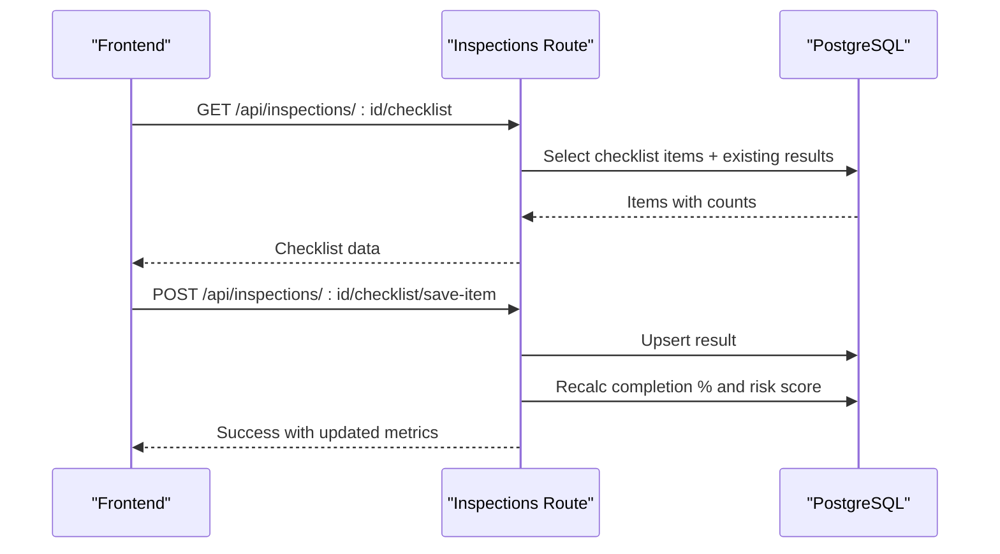
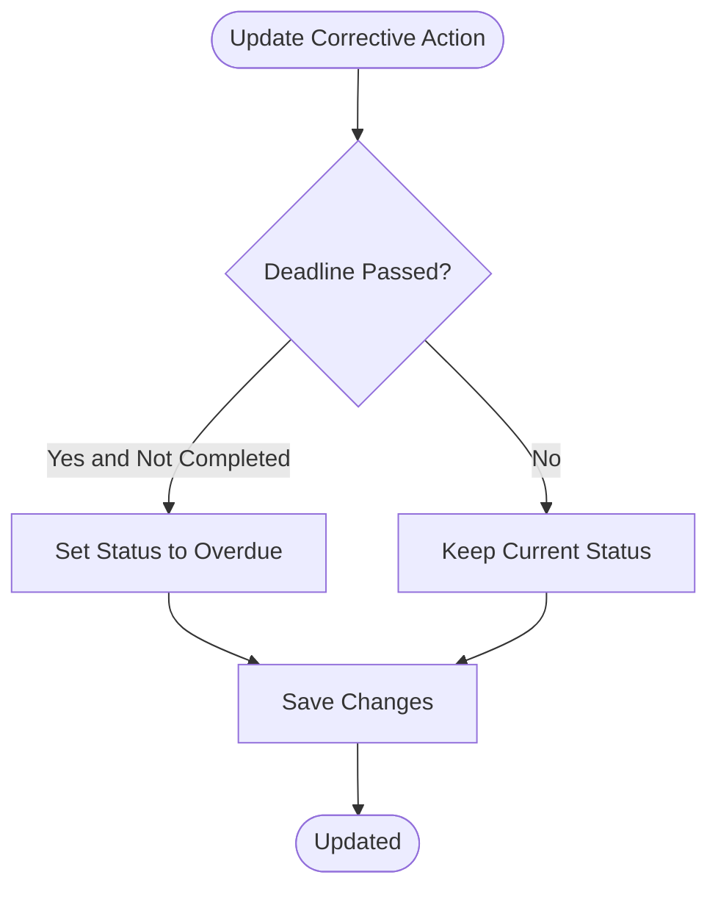
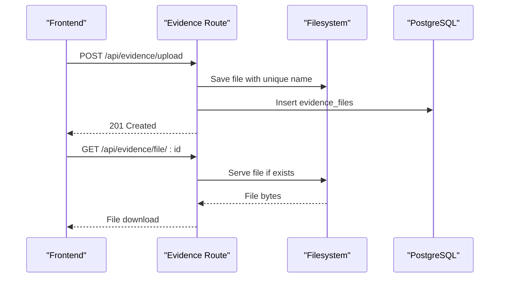
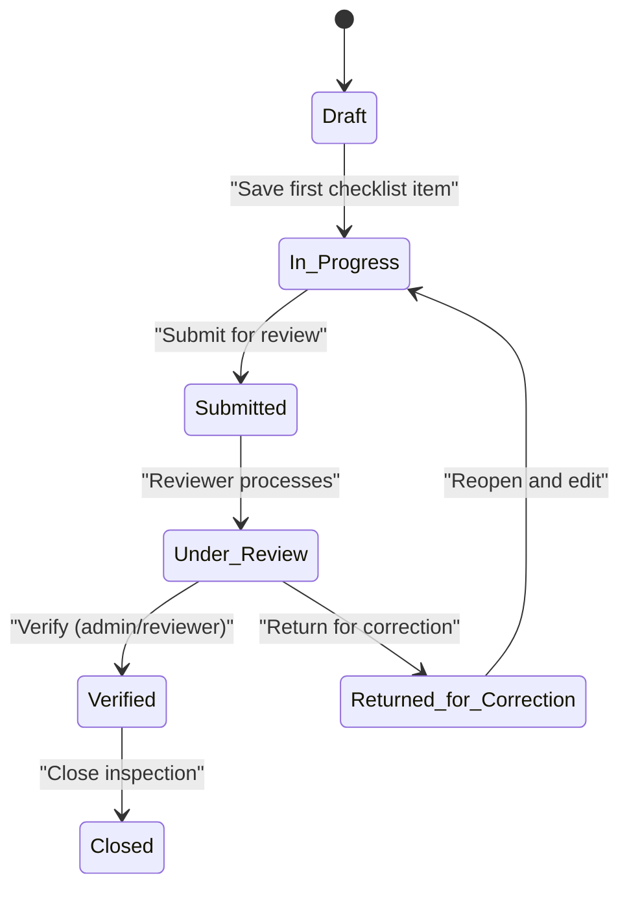
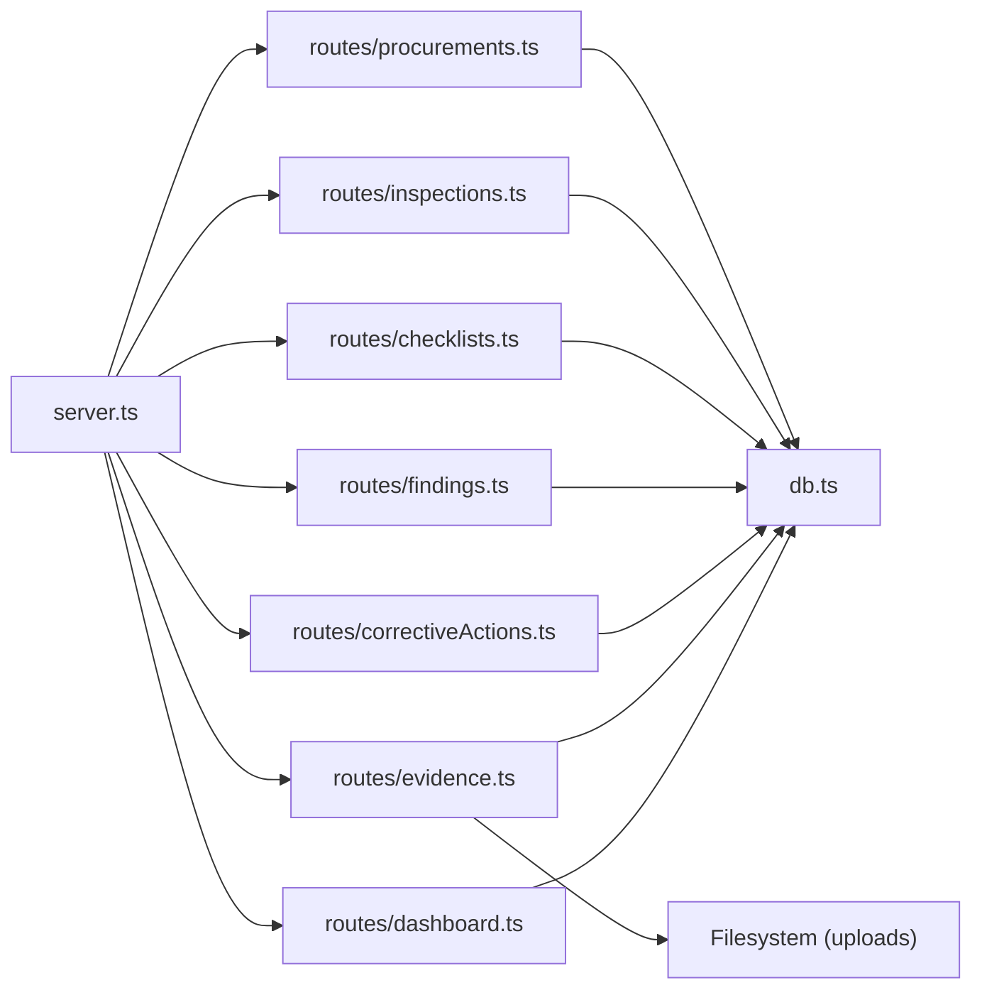

# Core Features

<cite>
**Referenced Files in This Document**
- [server.ts](file://server.ts)
- [package.json](file://package.json)
- [schema.sql](file://database/schema.sql)
- [auth.ts](file://server/middleware/auth.ts)
- [procurements.ts](file://server/routes/procurements.ts)
- [inspections.ts](file://server/routes/inspections.ts)
- [checklists.ts](file://server/routes/checklists.ts)
- [findings.ts](file://server/routes/findings.ts)
- [correctiveActions.ts](file://server/routes/correctiveActions.ts)
- [evidence.ts](file://server/routes/evidence.ts)
- [dashboard.ts](file://server/routes/dashboard.ts)
- [index.ts](file://src/types/index.ts)
- [DashboardView.tsx](file://src/components/DashboardView.tsx)
- [InspectionsView.tsx](file://src/components/InspectionsView.tsx)
</cite>

## Table of Contents
1. Introduction
2. Project Structure
3. Core Components
4. Architecture Overview
5. Detailed Component Analysis
6. Dependency Analysis
7. Performance Considerations
8. Troubleshooting Guide
9. Conclusion

## Introduction
This document explains the core features of the NVC Procurement Monitoring & Inspection System, focusing on end-to-end procurement lifecycle management, inspection workflows, finding documentation and tracking, corrective action assignment and verification, evidence management, and dashboard analytics. It also documents user roles and permissions, business rules, validation logic, and integration points between modules. The system is designed to ensure compliance assurance through structured checklists, risk scoring, audit trails, and verifiable corrective actions.

## Project Structure
The application follows a modular architecture:
- Server entrypoint initializes Express, mounts routes, serves uploads, and integrates Vite for development or static assets for production.
- Routes implement REST APIs for procurements, inspections, checklists, findings, corrective actions, evidence, dashboard, and audit logs.
- Database schema defines entities for roles, users, offices, procurements, inspections, checklist items/results, evidence, findings, corrective actions, and audit logs.
- Frontend types define contracts for UI components; views render dashboards and inspection workflows.

**Diagram sources**
- [server.ts:23-55](file://server.ts#L23-L55)
- [schema.sql:1-283](file://database/schema.sql#L1-L283)

**Section sources**
- [server.ts:1-93](file://server.ts#L1-L93)
- [package.json:1-49](file://package.json#L1-L49)

## Core Components
- Procurement Lifecycle Management: Register, update, filter procurements; auto-generate codes; seed default document completeness checklist; create initial inspection.
- Inspection Workflow: Create inspections; stage-by-stage checklist evaluation; save results with upsert; recalculate completion percentage and risk score; status transitions with role-based controls.
- Findings Documentation: Create/update/delete findings linked to inspections and procurements; optional automatic creation of corrective actions from recommended actions.
- Corrective Action Assignment and Verification: Assign responsible parties and deadlines; track progress; verify by authorized roles; auto-update finding status upon verification.
- Evidence Management: Upload, list, download, and delete evidence files; associate with inspections and checklist items; enforce allowed file types and size limits.
- Dashboard Analytics: KPIs, compliance distribution, risk distribution, stage-wise findings, province-level metrics, and critical alerts.

**Section sources**
- [procurements.ts:8-467](file://server/routes/procurements.ts#L8-L467)
- [inspections.ts:8-409](file://server/routes/inspections.ts#L8-L409)
- [checklists.ts:8-192](file://server/routes/checklists.ts#L8-L192)
- [findings.ts:8-335](file://server/routes/findings.ts#L8-L335)
- [correctiveActions.ts:8-251](file://server/routes/correctiveActions.ts#L8-L251)
- [evidence.ts:8-195](file://server/routes/evidence.ts#L8-L195)
- [dashboard.ts:6-110](file://server/routes/dashboard.ts#L6-L110)

## Architecture Overview
The system exposes REST endpoints under /api/*, secured by JWT authentication and role-based authorization. Data persists in PostgreSQL via prepared queries. File uploads are stored on disk and served statically. The frontend consumes APIs and renders interactive views for inspections and dashboards.

**Diagram sources**
- [procurements.ts:175-326](file://server/routes/procurements.ts#L175-L326)
- [inspections.ts:309-406](file://server/routes/inspections.ts#L309-L406)
- [auth.ts:36-86](file://server/middleware/auth.ts#L36-L86)

## Detailed Component Analysis

### Procurement Lifecycle Management
- Registration: Validates required fields, generates unique procurement code, seeds default document checklist entries, creates an initial inspection record, and logs audit.
- Listing and Filtering: Supports search and filters by office, ministry, province, fiscal year, type, method, and status; includes latest inspection metadata and counts.
- Update: Partial updates with safe defaults; audit logging captures old/new values.
- Document Status: Per-document status updates for completeness tracking.

Business Rules and Validation
- Mandatory fields enforced at creation.
- Default budget source applied if not provided.
- Auto-generated codes ensure uniqueness.
- Initial inspection created automatically to streamline workflow.

Integration Points
- Links to offices, ministries, provinces, districts, municipalities, fiscal years.
- Creates related records in inspections and procurement_documents.

**Diagram sources**
- [procurements.ts:175-326](file://server/routes/procurements.ts#L175-L326)

**Section sources**
- [procurements.ts:8-467](file://server/routes/procurements.ts#L8-L467)

### Inspection Workflow and Checklist Evaluation
- List and Detail: Fetch inspections with filters; detail includes stats computed from checklist results.
- Stage-by-Stage Checklist: Retrieve active checklist items with existing results; supports filtering by stage.
- Save Item Result: Upserts per-item results; recalculates completion percentage and risk score; transitions Draft to In Progress when items are checked.
- Status Transitions: Only reviewers/admins can verify/close; sets verified_by and verified_at on verification.

Business Rules and Validation
- Role-based enforcement for verification steps.
- Completion percentage excludes Not Applicable items.
- Risk score derived from high and critical risk items.

Integration Points
- Joins with checklist_items and stages; aggregates findings and evidence counts.

**Diagram sources**
- [inspections.ts:257-406](file://server/routes/inspections.ts#L257-L406)

**Section sources**
- [inspections.ts:8-409](file://server/routes/inspections.ts#L8-L409)

### Master Checklist Management
- Read-only access for listing all items or by stage; admin-only creation and updates.
- Generates unique codes; validates stage existence; preserves history by soft deactivation via is_active flag.

Business Rules and Validation
- Requires stage_number, inspection_area, and inspection_question.
- Defaults include default_risk_level and sort_order.

Integration Points
- Linked to checklist_stages; used across inspections to drive evaluation.

**Section sources**
- [checklists.ts:8-192](file://server/routes/checklists.ts#L8-L192)

### Findings Documentation and Tracking
- List with filters by risk level, status, procurement, inspection, office, and search.
- Create: Validates title/description/procurement_id; auto-generates finding code; optionally creates corrective action if recommended action provided.
- Update: Allows editing details and status; audit logging.
- Delete: Admin-only deletion.

Business Rules and Validation
- Mandatory fields enforced.
- Auto-creation of corrective actions streamlines remediation.

Integration Points
- Links to procurements, inspections, checklist_items; aggregates corrective_actions counts.

**Section sources**
- [findings.ts:8-335](file://server/routes/findings.ts#L8-L335)

### Corrective Action Assignment and Verification
- List: Filters by status, finding, inspection, office; computes overdue flag based on deadline and status.
- Create: Requires finding_id and corrective_action_text; defaults to pending status.
- Update: Updates progress notes, deadlines, completion date; auto-flags overdue if past deadline and not completed.
- Verify: Authorized roles only; sets verification_status and timestamps; updates associated finding status to Resolved when verified.

Business Rules and Validation
- Overdue detection logic ensures accountability.
- Verification triggers downstream state changes.

Integration Points
- Joins with findings and procurements; updates findings on verification.

**Diagram sources**
- [correctiveActions.ts:123-193](file://server/routes/correctiveActions.ts#L123-L193)

**Section sources**
- [correctiveActions.ts:8-251](file://server/routes/correctiveActions.ts#L8-L251)

### Evidence Management System
- List: Retrieves evidence for an inspection, optionally filtered by checklist item; includes uploader info.
- Upload: Enforces allowed extensions and size limit; stores file on disk; records metadata; logs audit.
- Download: Serves stored file by ID after verifying existence.
- Delete: Removes file from disk and database; logs audit.

Business Rules and Validation
- Allowed file types restricted to common document/media formats.
- Size limit enforced to prevent abuse.

Integration Points
- Associated with inspections and checklist items; accessible via static route.

**Diagram sources**
- [evidence.ts:70-156](file://server/routes/evidence.ts#L70-L156)

**Section sources**
- [evidence.ts:8-195](file://server/routes/evidence.ts#L8-L195)

### Dashboard Analytics
- Summary KPIs: Counts for procurements, inspections, findings, financial impact, contract volume, and more.
- Compliance Distribution: Aggregates checklist result statuses.
- Risk Distribution: Aggregates findings by risk level.
- Stage-wise Findings: Shows findings per checklist stage with item counts and financial impact.
- Province Metrics: Inspections and findings per province.
- Alerts: Recent high-risk or corrective-action-required findings.

Integration Points
- Queries across procurements, inspections, findings, checklist_items, checklist_stages, provinces.

**Section sources**
- [dashboard.ts:6-110](file://server/routes/dashboard.ts#L6-L110)

### User Roles and Permissions
- Roles: admin, inspector, reviewer, public_officer.
- Authentication: JWT-based token validation; supports header or query token.
- Authorization:
  - Procurement creation/update: admin, inspector (create); admin, inspector, reviewer (update).
  - Inspection status verification/close: admin, reviewer.
  - Finding CRUD: create/update by admin/inspector; delete by admin.
  - Corrective action verification: admin, reviewer.
  - Checklist item management: admin-only.
  - Evidence operations: authenticated users for upload/list/download/delete.

**Section sources**
- [auth.ts:20-86](file://server/middleware/auth.ts#L20-L86)
- [procurements.ts:175-467](file://server/routes/procurements.ts#L175-L467)
- [inspections.ts:148-255](file://server/routes/inspections.ts#L148-L255)
- [findings.ts:122-335](file://server/routes/findings.ts#L122-L335)
- [correctiveActions.ts:68-251](file://server/routes/correctiveActions.ts#L68-L251)
- [checklists.ts:54-192](file://server/routes/checklists.ts#L54-L192)
- [evidence.ts:70-195](file://server/routes/evidence.ts#L70-L195)

### Data Models and Types
- Frontend TypeScript interfaces define contracts for User, Procurement, Inspection, ChecklistItem, Finding, CorrectiveAction, EvidenceFile, and DashboardSummary.
- These types guide UI rendering and API consumption.

**Section sources**
- [index.ts:1-338](file://src/types/index.ts#L1-L338)

### UI Workflows and State Transitions
- Dashboard View: Loads summary KPIs, compliance/risk distributions, stage-wise findings, province metrics, and alerts; provides quick actions to navigate to procurements, inspections, master checklist, and findings.
- Inspections View: Renders inspection list and detailed 34-stage matrix; supports saving checklist items, updating status, uploading evidence, and opening findings with preloaded context.

**Diagram sources**
- [inspections.ts:199-255](file://server/routes/inspections.ts#L199-L255)
- [InspectionsView.tsx:182-194](file://src/components/InspectionsView.tsx#L182-L194)

**Section sources**
- [DashboardView.tsx:55-110](file://src/components/DashboardView.tsx#L55-L110)
- [InspectionsView.tsx:85-194](file://src/components/InspectionsView.tsx#L85-L194)

## Dependency Analysis
- Server Mounting: All routes mounted under /api/*; health endpoint available; uploads directory served statically.
- Database Schema: Centralized schema defines relationships and indexes for performance.
- Middleware: JWT authentication and role checks protect sensitive endpoints.
- Frontend Integration: Views consume typed APIs; state updates reflect server-side calculations.

**Diagram sources**
- [server.ts:44-55](file://server.ts#L44-L55)
- [schema.sql:272-283](file://database/schema.sql#L272-L283)

**Section sources**
- [server.ts:23-55](file://server.ts#L23-L55)
- [schema.sql:272-283](file://database/schema.sql#L272-L283)

## Performance Considerations
- Indexes: Optimized indexes on frequently queried columns (office_id, current_status, procurement_id, status, stage_id, inspection_id, risk_level, finding_id, user_id).
- Aggregations: Dashboard and inspection stats use grouped queries to minimize client-side processing.
- File Upload Limits: Enforced size and type restrictions to prevent resource exhaustion.
- Pagination: Procurement listing supports limit/offset for scalable retrieval.

[No sources needed since this section provides general guidance]

## Troubleshooting Guide
- Authentication Errors: Unauthorized responses indicate missing or invalid JWT tokens; re-authenticate.
- Validation Errors: 400 responses indicate missing required fields; ensure mandatory inputs are provided.
- File Upload Issues: Invalid file type or size will be rejected; confirm extension and size constraints.
- Permission Denied: 403 indicates insufficient role; verify user role against endpoint requirements.
- Audit Logs: Review audit logs to trace actions and identify anomalies.

**Section sources**
- [auth.ts:36-86](file://server/middleware/auth.ts#L36-L86)
- [procurements.ts:175-467](file://server/routes/procurements.ts#L175-L467)
- [evidence.ts:70-195](file://server/routes/evidence.ts#L70-L195)

## Conclusion
The NVC Procurement Monitoring & Inspection System provides a comprehensive, role-secured platform for managing procurements, conducting structured inspections, documenting findings, assigning and verifying corrective actions, managing evidence, and visualizing analytics. Its modular design, robust validation, and auditability support end-to-end compliance assurance and operational transparency.