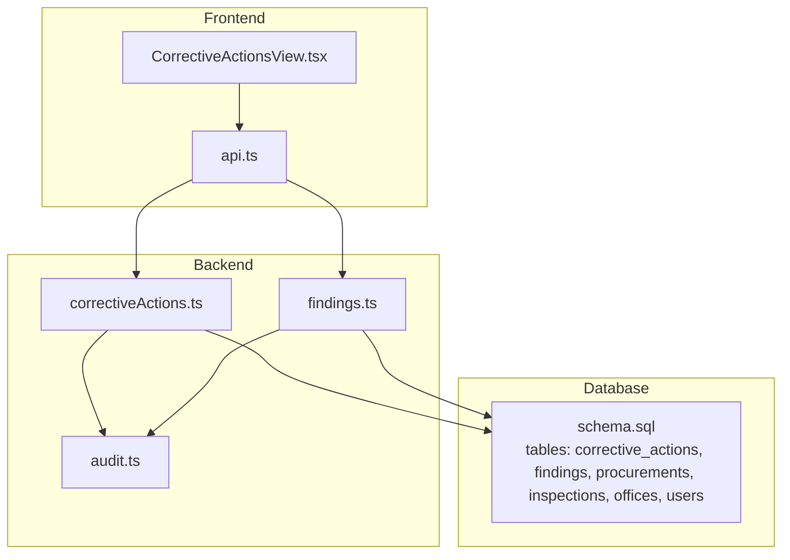
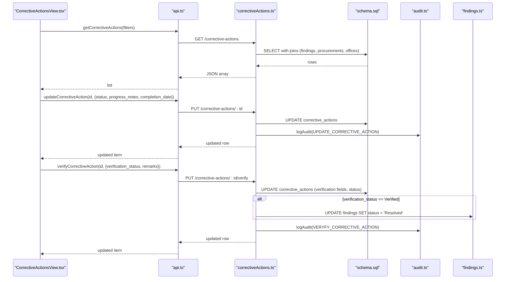
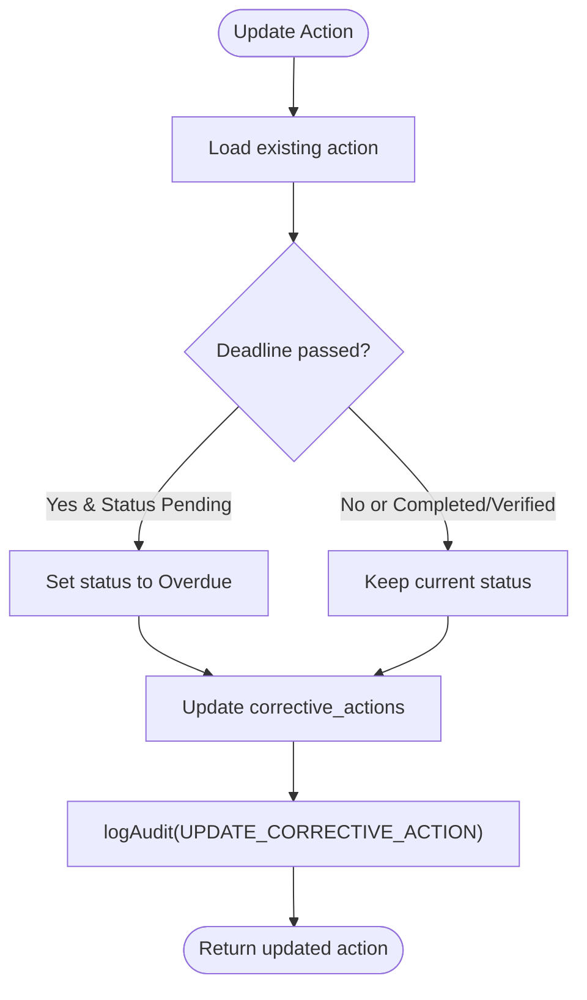
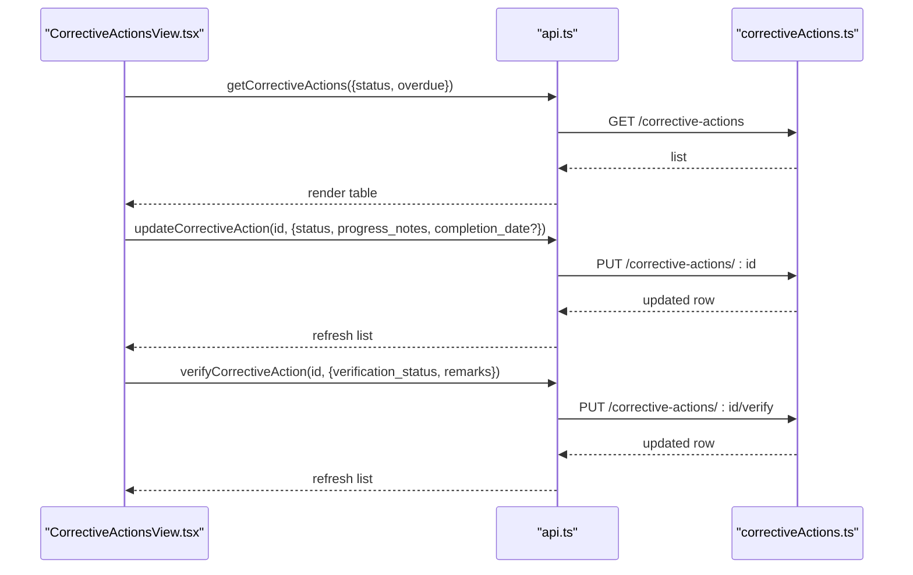
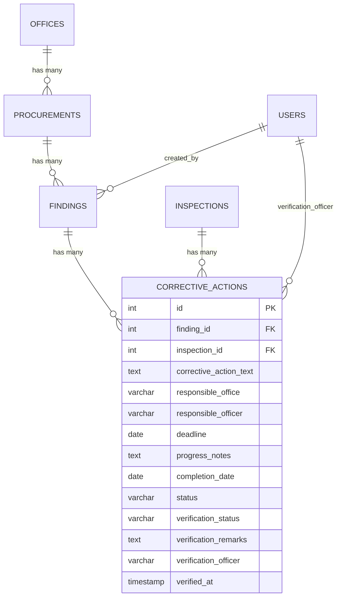
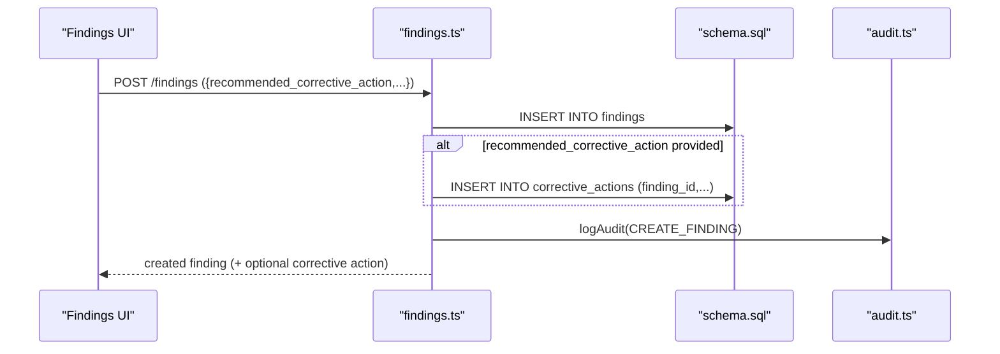
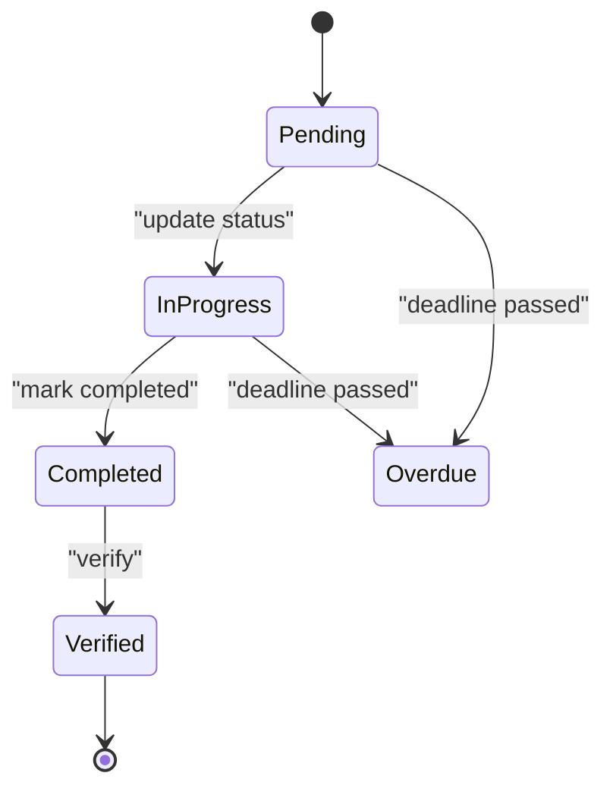
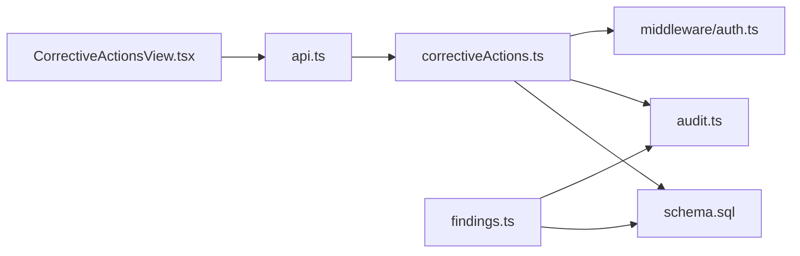

# Corrective Actions

<cite>
**Referenced Files in This Document**
- [correctiveActions.ts](file://server/routes/correctiveActions.ts)
- [CorrectiveActionsView.tsx](file://src/components/CorrectiveActionsView.tsx)
- [index.ts](file://src/types/index.ts)
- [schema.sql](file://database/schema.sql)
- [audit.ts](file://server/utils/audit.ts)
- [api.ts](file://src/services/api.ts)
- [findings.ts](file://server/routes/findings.ts)
</cite>

## Table of Contents
1. Introduction
2. Project Structure
3. Core Components
4. Architecture Overview
5. Detailed Component Analysis
6. Dependency Analysis
7. Performance Considerations
8. Troubleshooting Guide
9. Conclusion
10. Appendices

## Introduction
This document provides comprehensive documentation for the Corrective Actions module that supports assigning, tracking, and verifying corrective actions related to procurement findings. It covers action planning, responsible party assignment, deadline management, progress tracking, verification workflows, status progression, escalation mechanisms, reporting capabilities, data structures, workflow states, and audit logging for accountability.

## Project Structure
The Corrective Actions feature spans server routes, a React view, shared types, database schema, and audit utilities:
- Server route: exposes REST endpoints for listing, creating, updating, and verifying corrective actions; integrates with findings and audit logging.
- Frontend view: provides filtering, editing progress, and official verification UI.
- Types: define TypeScript interfaces for CorrectiveAction and related entities.
- Schema: defines the corrective_actions table and relationships to findings, inspections, procurements, offices, and users.
- Audit utility: records immutable audit logs for all corrective action changes.
- API service: client-side methods to call backend endpoints.
- Findings route: auto-creates corrective actions when recommended corrective action is provided during finding creation.

**Diagram sources**
- [correctiveActions.ts:1-251](file://server/routes/correctiveActions.ts#L1-L251)
- [CorrectiveActionsView.tsx:1-425](file://src/components/CorrectiveActionsView.tsx#L1-L425)
- [api.ts:335-380](file://src/services/api.ts#L335-L380)
- [findings.ts:122-221](file://server/routes/findings.ts#L122-L221)
- [audit.ts:1-32](file://server/utils/audit.ts#L1-L32)
- [schema.sql:200-244](file://database/schema.sql#L200-L244)

**Section sources**
- [correctiveActions.ts:1-251](file://server/routes/correctiveActions.ts#L1-L251)
- [CorrectiveActionsView.tsx:1-425](file://src/components/CorrectiveActionsView.tsx#L1-L425)
- [index.ts:237-260](file://src/types/index.ts#L237-L260)
- [schema.sql:200-244](file://database/schema.sql#L200-L244)
- [audit.ts:1-32](file://server/utils/audit.ts#L1-L32)
- [api.ts:335-380](file://src/services/api.ts#L335-L380)
- [findings.ts:122-221](file://server/routes/findings.ts#L122-L221)

## Core Components
- Corrective Actions API (server):
  - List actions with filters: status, finding_id, inspection_id, office_id, overdue.
  - Create action with validation and default status.
  - Update action with progress notes, completion date, deadline, and status; auto-flag overdue if past deadline and not completed.
  - Verify action (admin/reviewer only): set verification_status, remarks, officer, timestamp; update action status; on verified, mark associated finding as Resolved.
- Frontend Corrective Actions View:
  - Filter by status and overdue-only toggle.
  - Edit progress: update status and notes; auto-set completion_date when marking completed.
  - Official verification dialog for authorized users; updates verification fields and remarks.
- Data model:
  - CorrectiveAction interface includes IDs, text, responsible parties, deadlines, progress, completion date, statuses, verification fields, and computed overdue flag.
- Database:
  - corrective_actions table with foreign keys to findings and inspections; indexes for performance.
- Audit logging:
  - All create/update/verify operations log user, action, entity type, IDs, old/new values, and IP.

**Section sources**
- [correctiveActions.ts:8-66](file://server/routes/correctiveActions.ts#L8-L66)
- [correctiveActions.ts:68-121](file://server/routes/correctiveActions.ts#L68-L121)
- [correctiveActions.ts:123-193](file://server/routes/correctiveActions.ts#L123-L193)
- [correctiveActions.ts:195-248](file://server/routes/correctiveActions.ts#L195-L248)
- [CorrectiveActionsView.tsx:43-95](file://src/components/CorrectiveActionsView.tsx#L43-L95)
- [CorrectiveActionsView.tsx:114-149](file://src/components/CorrectiveActionsView.tsx#L114-L149)
- [index.ts:237-260](file://src/types/index.ts#L237-L260)
- [schema.sql:226-244](file://database/schema.sql#L226-L244)
- [audit.ts:1-32](file://server/utils/audit.ts#L1-L32)

## Architecture Overview
The Corrective Actions workflow integrates with Findings and Inspections:
- Creation:
  - Manual creation via POST /corrective-actions or automatic creation when a Finding is created with a recommended corrective action.
- Progress tracking:
  - Responsible parties update status and progress notes; system auto-detects overdue based on deadline and current status.
- Verification:
  - Authorized reviewers verify actions; upon verification, the linked Finding is marked Resolved.
- Auditability:
  - Every mutation is logged with before/after snapshots and user context.

**Diagram sources**
- [correctiveActions.ts:8-66](file://server/routes/correctiveActions.ts#L8-L66)
- [correctiveActions.ts:123-193](file://server/routes/correctiveActions.ts#L123-L193)
- [correctiveActions.ts:195-248](file://server/routes/correctiveActions.ts#L195-L248)
- [api.ts:335-380](file://src/services/api.ts#L335-L380)
- [findings.ts:122-221](file://server/routes/findings.ts#L122-L221)
- [schema.sql:200-244](file://database/schema.sql#L200-L244)
- [audit.ts:1-32](file://server/utils/audit.ts#L1-L32)

## Detailed Component Analysis

### Corrective Actions API
- List endpoint:
  - Filters: status, finding_id, inspection_id, office_id, overdue.
  - Computes is_overdue using deadline and non-completed statuses.
  - Joins findings, procurements, offices to enrich display data.
- Create endpoint:
  - Validates required fields (finding_id, corrective_action_text).
  - Inserts corrective action with default status if none provided.
  - Logs audit entry.
- Update endpoint:
  - Updates text, responsible parties, deadline, progress notes, completion date, and status.
  - Auto-marks overdue if deadline passed and status still pending/in-progress.
  - Logs audit entry.
- Verify endpoint:
  - Restricted to admin/reviewer roles.
  - Sets verification_status, remarks, officer, verified_at; updates status accordingly.
  - On Verified, sets associated finding status to Resolved.
  - Logs audit entry.

**Diagram sources**
- [correctiveActions.ts:123-193](file://server/routes/correctiveActions.ts#L123-L193)

**Section sources**
- [correctiveActions.ts:8-66](file://server/routes/correctiveActions.ts#L8-L66)
- [correctiveActions.ts:68-121](file://server/routes/correctiveActions.ts#L68-L121)
- [correctiveActions.ts:123-193](file://server/routes/correctiveActions.ts#L123-L193)
- [correctiveActions.ts:195-248](file://server/routes/correctiveActions.ts#L195-L248)

### Frontend Corrective Actions View
- Filtering:
  - Status dropdown and Overdue Only checkbox.
  - Loads actions via api.getCorrectiveActions with filters.
- Progress editing:
  - Modal to update status and progress notes.
  - Automatically sets completion_date when status becomes completed.
- Verification:
  - Modal for authorized users to verify or reject with remarks.
  - Calls api.verifyCorrectiveAction to update verification fields and status.

**Diagram sources**
- [CorrectiveActionsView.tsx:43-95](file://src/components/CorrectiveActionsView.tsx#L43-L95)
- [api.ts:335-380](file://src/services/api.ts#L335-L380)
- [correctiveActions.ts:123-193](file://server/routes/correctiveActions.ts#L123-L193)
- [correctiveActions.ts:195-248](file://server/routes/correctiveActions.ts#L195-L248)

**Section sources**
- [CorrectiveActionsView.tsx:43-95](file://src/components/CorrectiveActionsView.tsx#L43-L95)
- [CorrectiveActionsView.tsx:114-149](file://src/components/CorrectiveActionsView.tsx#L114-L149)
- [api.ts:335-380](file://src/services/api.ts#L335-L380)

### Data Model and Relationships
- CorrectiveAction interface includes:
  - Identification: id, finding_id, inspection_id, procurement_id.
  - Context: finding_code, finding_title, finding_risk_level, procurement_title, procurement_id_code, office_name.
  - Action details: corrective_action_text, responsible_office, responsible_officer, deadline.
  - Progress: progress_notes, completion_date, status.
  - Verification: verification_status, verification_remarks, verification_officer, verified_at.
  - Computed: is_overdue.
- Database tables:
  - corrective_actions references findings and inspections.
  - Indexes optimize queries by finding_id and other common filters.

**Diagram sources**
- [schema.sql:200-244](file://database/schema.sql#L200-L244)
- [index.ts:237-260](file://src/types/index.ts#L237-L260)

**Section sources**
- [index.ts:237-260](file://src/types/index.ts#L237-L260)
- [schema.sql:200-244](file://database/schema.sql#L200-L244)

### Integration with Findings Management
- Automatic creation:
  - When a Finding is created with a recommended_corrective_action, the system inserts a corresponding corrective action record with default status.
- Resolution linkage:
  - Upon verification of a corrective action as Verified, the associated finding’s status is updated to Resolved.

**Diagram sources**
- [findings.ts:122-221](file://server/routes/findings.ts#L122-L221)
- [schema.sql:200-244](file://database/schema.sql#L200-L244)
- [audit.ts:1-32](file://server/utils/audit.ts#L1-L32)

**Section sources**
- [findings.ts:122-221](file://server/routes/findings.ts#L122-L221)
- [correctiveActions.ts:195-248](file://server/routes/correctiveActions.ts#L195-L248)

### Workflow States and Status Progression
- Corrective Action statuses:
  - बाँकी (Pending)
  - प्रक्रियामा (In Progress)
  - सम्पन्न (Completed)
  - प्रमाणित (Verified)
  - समयसीमा नाघेको (Overdue) — auto-detected when deadline passed and not completed/verified.
- Verification flow:
  - Admin/Reviewer can set verification_status to Verified or Rejected; Verified also updates action status to प्रमाणित and links finding to Resolved.
- Overdue handling:
  - During updates, if deadline is in the past and status remains pending/in-progress, it is automatically flagged as Overdue.

**Diagram sources**
- [correctiveActions.ts:144-151](file://server/routes/correctiveActions.ts#L144-L151)
- [correctiveActions.ts:195-248](file://server/routes/correctiveActions.ts#L195-L248)
- [schema.sql:226-244](file://database/schema.sql#L226-L244)

**Section sources**
- [correctiveActions.ts:144-151](file://server/routes/correctiveActions.ts#L144-L151)
- [correctiveActions.ts:195-248](file://server/routes/correctiveActions.ts#L195-L248)

### Responsibility Assignment and Deadline Management
- Responsible parties:
  - responsible_office and responsible_officer are captured at creation and can be updated.
- Deadline management:
  - Deadline stored per action; overdue detection uses current date vs deadline and current status.
  - Completion date is set automatically when marking completed from the frontend.

**Section sources**
- [correctiveActions.ts:68-121](file://server/routes/correctiveActions.ts#L68-L121)
- [correctiveActions.ts:123-193](file://server/routes/correctiveActions.ts#L123-L193)
- [CorrectiveActionsView.tsx:62-77](file://src/components/CorrectiveActionsView.tsx#L62-L77)

### Reporting Capabilities
- Listing with filters enables reporting views:
  - Filter by status, finding_id, inspection_id, office_id, and overdue-only.
- Dashboard integration:
  - The dashboard summary type includes overdue_corrective_actions KPI, enabling high-level reporting.

**Section sources**
- [correctiveActions.ts:8-66](file://server/routes/correctiveActions.ts#L8-L66)
- [index.ts:294-337](file://src/types/index.ts#L294-L337)

### Audit Logging for Accountability
- All corrective action mutations log:
  - User ID and username, action type, entity type and ID, old/new values, and IP address.
- Consistent audit entries for create, update, and verify actions.

**Section sources**
- [correctiveActions.ts:105-114](file://server/routes/correctiveActions.ts#L105-L114)
- [correctiveActions.ts:177-186](file://server/routes/correctiveActions.ts#L177-L186)
- [correctiveActions.ts:233-242](file://server/routes/correctiveActions.ts#L233-L242)
- [audit.ts:1-32](file://server/utils/audit.ts#L1-L32)

## Dependency Analysis
- Frontend depends on:
  - api.ts methods for corrective actions and authentication context.
- Backend depends on:
  - Database schema for corrective_actions, findings, procurements, inspections, offices, users.
  - Audit utility for logging.
  - Authentication middleware for role-based access control.

**Diagram sources**
- [CorrectiveActionsView.tsx:1-425](file://src/components/CorrectiveActionsView.tsx#L1-L425)
- [api.ts:335-380](file://src/services/api.ts#L335-L380)
- [correctiveActions.ts:1-251](file://server/routes/correctiveActions.ts#L1-L251)
- [findings.ts:1-335](file://server/routes/findings.ts#L1-L335)
- [schema.sql:200-244](file://database/schema.sql#L200-L244)
- [audit.ts:1-32](file://server/utils/audit.ts#L1-L32)

**Section sources**
- [api.ts:335-380](file://src/services/api.ts#L335-L380)
- [correctiveActions.ts:1-251](file://server/routes/correctiveActions.ts#L1-L251)
- [findings.ts:1-335](file://server/routes/findings.ts#L1-L335)
- [schema.sql:200-244](file://database/schema.sql#L200-L244)
- [audit.ts:1-32](file://server/utils/audit.ts#L1-L32)

## Performance Considerations
- Query optimization:
  - Use indexes on corrective_actions.finding_id and other filtered columns to speed up listing and updates.
- Efficient filtering:
  - Leverage query parameters (status, finding_id, inspection_id, office_id, overdue) to minimize payload size and processing time.
- Avoid unnecessary joins:
  - Only join necessary tables for the requested view; consider pagination for large datasets.

[No sources needed since this section provides general guidance]

## Troubleshooting Guide
- Common errors:
  - Missing required fields when creating corrective actions (finding_id, corrective_action_text).
  - Not found errors when updating or verifying non-existent actions.
  - Network or auth failures when calling API endpoints.
- Debugging steps:
  - Check request payloads and response messages.
  - Verify user roles for verification endpoints (admin/reviewer).
  - Review audit logs to trace changes and identify discrepancies.

**Section sources**
- [correctiveActions.ts:81-84](file://server/routes/correctiveActions.ts#L81-L84)
- [correctiveActions.ts:127-131](file://server/routes/correctiveActions.ts#L127-L131)
- [correctiveActions.ts:201-205](file://server/routes/correctiveActions.ts#L201-L205)
- [api.ts:335-380](file://src/services/api.ts#L335-L380)

## Conclusion
The Corrective Actions module provides a robust workflow for managing corrective actions tied to procurement findings. It supports assignment, deadline tracking, progress updates, automated overdue detection, verification by authorized roles, and full audit logging. Integration with findings ensures lifecycle alignment, while flexible filtering supports reporting and oversight.

[No sources needed since this section summarizes without analyzing specific files]

## Appendices

### API Endpoints Summary
- GET /corrective-actions: List with filters (status, finding_id, inspection_id, office_id, overdue).
- POST /corrective-actions: Create corrective action (requires finding_id, corrective_action_text).
- PUT /corrective-actions/:id: Update progress, status, deadline, completion_date.
- PUT /corrective-actions/:id/verify: Verify or reject with remarks (admin/reviewer only).

**Section sources**
- [correctiveActions.ts:8-66](file://server/routes/correctiveActions.ts#L8-L66)
- [correctiveActions.ts:68-121](file://server/routes/correctiveActions.ts#L68-L121)
- [correctiveActions.ts:123-193](file://server/routes/correctiveActions.ts#L123-L193)
- [correctiveActions.ts:195-248](file://server/routes/correctiveActions.ts#L195-L248)

### Example Data Structures
- CorrectiveAction fields include identification, context, action details, progress, completion date, statuses, verification fields, and computed overdue flag.

**Section sources**
- [index.ts:237-260](file://src/types/index.ts#L237-L260)