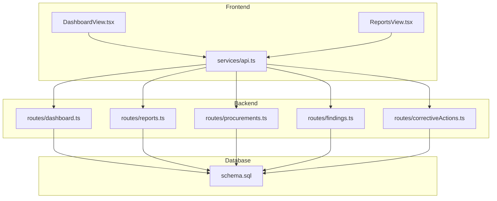
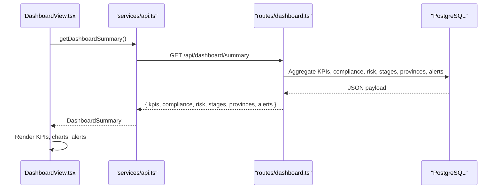
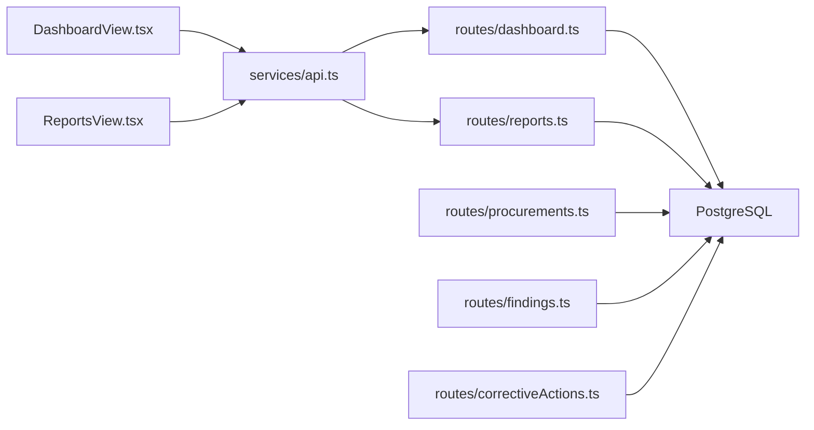

# Dashboard & Analytics

<cite>
**Referenced Files in This Document**
- [dashboard.ts](file://server/routes/dashboard.ts)
- [DashboardView.tsx](file://src/components/DashboardView.tsx)
- [reports.ts](file://server/routes/reports.ts)
- [ReportsView.tsx](file://src/components/ReportsView.tsx)
- [api.ts](file://src/services/api.ts)
- [index.ts](file://src/types/index.ts)
- [schema.sql](file://database/schema.sql)
- [procurements.ts](file://server/routes/procurements.ts)
- [findings.ts](file://server/routes/findings.ts)
- [correctiveActions.ts](file://server/routes/correctiveActions.ts)
</cite>

## Table of Contents
1. Introduction
2. Project Structure
3. Core Components
4. Architecture Overview
5. Detailed Component Analysis
6. Dependency Analysis
7. Performance Considerations
8. Troubleshooting Guide
9. Conclusion

## Introduction
This document explains the Dashboard and Analytics module that provides real-time KPIs, metrics visualization, overdue alerts, and comprehensive reporting across procurements, inspections, findings, and corrective actions. It covers how data is aggregated, how dashboards are customized, how filters and exports work, and how reports are generated. It also includes guidance on performance optimization and caching strategies for large datasets.

## Project Structure
The dashboard analytics feature spans frontend components, backend routes, and database schema:
- Frontend: Dashboard view renders KPI cards, stage-wise findings distribution, compliance breakdown, risk matrix, and urgent findings table. Reports view lists inspection dossiers and exposes CSV export links.
- Backend: A dedicated dashboard route aggregates KPIs, compliance stats, risk distribution, stages, provinces, and recent critical alerts. Report endpoints provide full inspection report packets and CSV exports for procurements and findings.
- Data: The PostgreSQL schema defines core entities (procurements, inspections, checklist items/stages, findings, corrective actions, evidence, audit logs) with indexes to support efficient queries.

**Diagram sources**
- [DashboardView.tsx:1-100](file://src/components/DashboardView.tsx#L1-L100)
- [ReportsView.tsx:1-100](file://src/components/ReportsView.tsx#L1-L100)
- [api.ts:413-425](file://src/services/api.ts#L413-L425)
- [dashboard.ts:1-110](file://server/routes/dashboard.ts#L1-L110)
- [reports.ts:1-219](file://server/routes/reports.ts#L1-L219)
- [schema.sql:83-283](file://database/schema.sql#L83-L283)

**Section sources**
- [DashboardView.tsx:1-120](file://src/components/DashboardView.tsx#L1-L120)
- [ReportsView.tsx:1-120](file://src/components/ReportsView.tsx#L1-L120)
- [api.ts:1-440](file://src/services/api.ts#L1-L440)
- [dashboard.ts:1-110](file://server/routes/dashboard.ts#L1-L110)
- [reports.ts:1-219](file://server/routes/reports.ts#L1-L219)
- [schema.sql:83-283](file://database/schema.sql#L83-L283)

## Core Components
- Real-time KPIs: Total procurements, active inspections, verified inspections, total findings, high/critical findings, open findings, overdue corrective actions, total financial impact, total contract volume, and master checklist counts.
- Metrics visualization: Stage-wise findings distribution with optional hiding of zero-finding stages; compliance status breakdown; risk level matrix; province-level aggregation.
- Overdue alerts: Banner highlighting overdue corrective actions and a table of recent critical/high-risk findings with drill-down navigation.
- Reporting: Full inspection dossier retrieval and CSV exports for procurements and findings.

Key implementation highlights:
- Aggregation queries compute KPIs, compliance, risk, stages, provinces, and alerts in a single dashboard endpoint.
- Frontend sorts stages by findings count, supports toggling empty stages, and formats currency using locale-aware formatting.
- Reports endpoint assembles inspection details, checklist results, findings, corrective actions, evidence, and statistics into a single packet.
- CSV exports stream UTF-8 BOM files suitable for Excel with Nepali characters.

**Section sources**
- [dashboard.ts:6-107](file://server/routes/dashboard.ts#L6-L107)
- [DashboardView.tsx:86-120](file://src/components/DashboardView.tsx#L86-L120)
- [DashboardView.tsx:190-213](file://src/components/DashboardView.tsx#L190-L213)
- [reports.ts:7-140](file://server/routes/reports.ts#L7-L140)
- [reports.ts:142-216](file://server/routes/reports.ts#L142-L216)
- [schema.sql:83-283](file://database/schema.sql#L83-L283)

## Architecture Overview
The dashboard analytics flow integrates UI, API, and database layers:

**Diagram sources**
- [DashboardView.tsx:55-69](file://src/components/DashboardView.tsx#L55-L69)
- [api.ts:413-417](file://src/services/api.ts#L413-L417)
- [dashboard.ts:6-107](file://server/routes/dashboard.ts#L6-L107)

## Detailed Component Analysis

### Dashboard Summary Endpoint
Responsibilities:
- Compute KPIs across procurements, inspections, findings, and corrective actions.
- Provide compliance status distribution from inspection checklist results.
- Provide risk level distribution from findings.
- Provide stage-wise findings and financial impact.
- Provide province-level inspection and finding counts.
- Provide recent critical alerts based on risk level or required corrective action.

Data model usage:
- Uses tables: procurements, inspections, findings, corrective_actions, checklist_stages, checklist_items, inspection_checklist_results, provinces, offices.

Performance notes:
- Multiple SELECT statements per metric; consider materialized views or caching for heavy loads.
- Indexes on statuses, risk_level, deadlines, and foreign keys improve query speed.

Error handling:
- Returns 500 with localized error message on failure.

**Section sources**
- [dashboard.ts:6-107](file://server/routes/dashboard.ts#L6-L107)
- [schema.sql:83-283](file://database/schema.sql#L83-L283)

### Dashboard View (Frontend)
Responsibilities:
- Load summary via API and render KPI cards, stage-wise findings heatmap, compliance breakdown, risk matrix, and urgent findings table.
- Support customization: hide empty stages to focus on areas with issues.
- Provide quick actions to navigate to procurements, inspections, master checklist, and create new findings.
- Display overdue corrective actions banner with direct navigation to filtered list.

User interactions:
- Clicking KPI cards navigates to relevant modules with pre-applied filters.
- Toggle visibility of zero-finding stages to optimize chart readability.
- LocalStorage persists guide dismissal preference.

Accessibility and UX:
- Clear labels, color-coded risk indicators, and consistent typography.
- Currency formatted using locale-aware formatter.

**Section sources**
- [DashboardView.tsx:28-120](file://src/components/DashboardView.tsx#L28-L120)
- [DashboardView.tsx:190-213](file://src/components/DashboardView.tsx#L190-L213)
- [DashboardView.tsx:307-471](file://src/components/DashboardView.tsx#L307-L471)
- [DashboardView.tsx:473-550](file://src/components/DashboardView.tsx#L473-L550)

### Reports Endpoints
Capabilities:
- Inspection Dossier: Retrieves inspection metadata, checklist results, findings, corrective actions, evidence, and computed statistics for a given inspection ID.
- CSV Exports: Streams CSV files for procurements and findings with UTF-8 BOM for proper Excel rendering.

Security:
- Inspection dossier requires authentication; CSV exports use authenticated request type.

Error handling:
- Returns 404 when inspection not found; returns 500 with localized errors on failures.

**Section sources**
- [reports.ts:7-140](file://server/routes/reports.ts#L7-L140)
- [reports.ts:142-216](file://server/routes/reports.ts#L142-L216)

### Reports View (Frontend)
Capabilities:
- Lists available inspection dossiers with progress and status.
- Provides direct download links for CSV exports of procurements and findings.
- Opens inspection dossiers for printing via modal integration.

**Section sources**
- [ReportsView.tsx:19-189](file://src/components/ReportsView.tsx#L19-L189)

### Data Types and API Client
Types:
- DashboardSummary defines KPIs, compliance, risk, stages, provinces, and alerts structures consumed by the dashboard.

API client:
- Centralized methods for fetching dashboard summary and inspection reports, including auth headers.

**Section sources**
- [index.ts:294-337](file://src/types/index.ts#L294-L337)
- [api.ts:413-425](file://src/services/api.ts#L413-L425)

### Supporting Modules (Procurements, Findings, Corrective Actions)
- Procurements: Supports filtering by office, ministry, province, fiscal year, type, method, status; includes latest inspection info and counts for findings and high-risk findings.
- Findings: Supports filtering by risk level, status, procurement, inspection, office, and search text; includes corrective action counts and pending actions.
- Corrective Actions: Supports filtering by status, finding, inspection, office, and overdue flag; auto-detects overdue status and updates finding status upon verification.

These modules feed the dashboard’s KPIs and alerts through shared database tables and indexes.

**Section sources**
- [procurements.ts:8-113](file://server/routes/procurements.ts#L8-L113)
- [findings.ts:8-76](file://server/routes/findings.ts#L8-L76)
- [correctiveActions.ts:8-66](file://server/routes/correctiveActions.ts#L8-L66)

## Dependency Analysis
High-level dependencies and relationships:

**Diagram sources**
- [DashboardView.tsx:55-69](file://src/components/DashboardView.tsx#L55-L69)
- [ReportsView.tsx:23-37](file://src/components/ReportsView.tsx#L23-L37)
- [api.ts:413-425](file://src/services/api.ts#L413-L425)
- [dashboard.ts:1-110](file://server/routes/dashboard.ts#L1-L110)
- [reports.ts:1-219](file://server/routes/reports.ts#L1-L219)
- [procurements.ts:1-467](file://server/routes/procurements.ts#L1-L467)
- [findings.ts:1-335](file://server/routes/findings.ts#L1-L335)
- [correctiveActions.ts:1-251](file://server/routes/correctiveActions.ts#L1-L251)

**Section sources**
- [dashboard.ts:1-110](file://server/routes/dashboard.ts#L1-L110)
- [reports.ts:1-219](file://server/routes/reports.ts#L1-L219)
- [procurements.ts:1-467](file://server/routes/procurements.ts#L1-L467)
- [findings.ts:1-335](file://server/routes/findings.ts#L1-L335)
- [correctiveActions.ts:1-251](file://server/routes/correctiveActions.ts#L1-L251)

## Performance Considerations
- Query design:
  - Dashboard uses multiple aggregate queries; consider consolidating into fewer queries or using materialized views for frequently accessed KPIs.
  - Leverage existing indexes on statuses, risk levels, deadlines, and foreign keys to speed up filtering and joins.
- Pagination and limits:
  - Use LIMIT/OFFSET where applicable (e.g., procurements listing) to reduce payload size.
- Caching strategies:
  - Implement server-side caching (in-memory cache like Redis or application-level cache) for dashboard summary to reduce repeated heavy aggregations.
  - Cache CSV export results briefly if generating large datasets repeatedly.
- Database tuning:
  - Ensure effective_cache_size and planner settings are tuned for workload characteristics.
  - Monitor slow queries and add composite indexes for frequent filter combinations (e.g., office_id + current_status).
- Frontend optimizations:
  - Debounce filter changes and avoid unnecessary re-renders.
  - Use lazy loading for heavy sections (e.g., stage-wise heatmap) if needed.

[No sources needed since this section provides general guidance]

## Troubleshooting Guide
Common issues and resolutions:
- Dashboard load failures:
  - Check network requests to /api/dashboard/summary and inspect server logs for SQL errors.
  - Verify database connectivity and permissions.
- Missing data in KPIs:
  - Validate that related records exist in procurements, inspections, findings, and corrective_actions.
  - Confirm status values match expected strings used in queries.
- CSV export issues:
  - Ensure UTF-8 BOM is included for Excel compatibility.
  - Validate field escaping for commas and quotes in exported fields.
- Authentication errors:
  - Confirm token presence and validity in Authorization header for protected endpoints.
- Overdue alerts not showing:
  - Verify deadline calculations and status values for corrective actions.

**Section sources**
- [dashboard.ts:103-107](file://server/routes/dashboard.ts#L103-L107)
- [reports.ts:136-139](file://server/routes/reports.ts#L136-L139)
- [reports.ts:175-177](file://server/routes/reports.ts#L175-L177)
- [reports.ts:213-215](file://server/routes/reports.ts#L213-L215)

## Conclusion
The Dashboard and Analytics module delivers a comprehensive, real-time view of public procurement monitoring with actionable insights. It aggregates key metrics across procurements, inspections, findings, and corrective actions, visualizes compliance and risk, highlights overdue items, and supports robust reporting and export capabilities. With careful attention to query performance, indexing, and caching, the system can scale effectively to handle large datasets while maintaining responsiveness for users.

[No sources needed since this section summarizes without analyzing specific files]