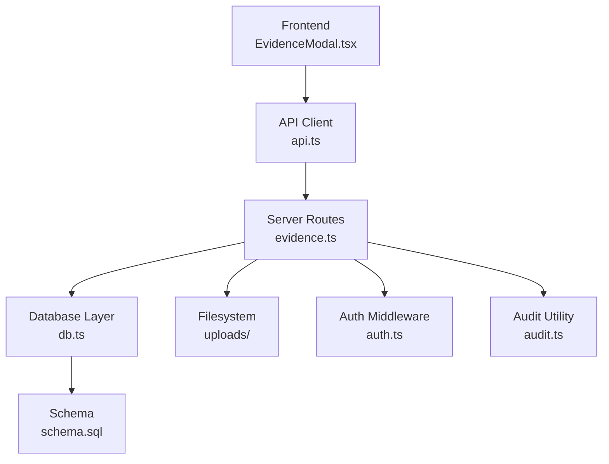
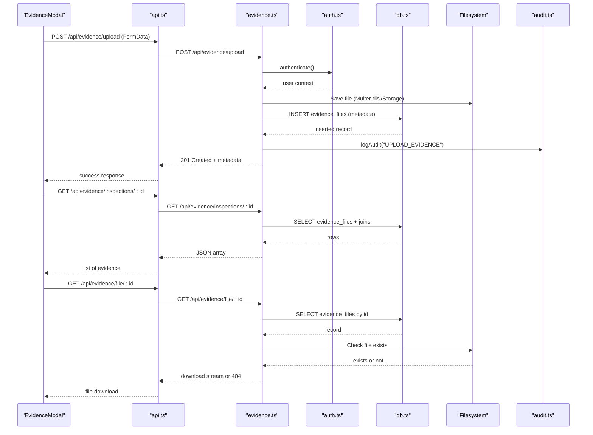
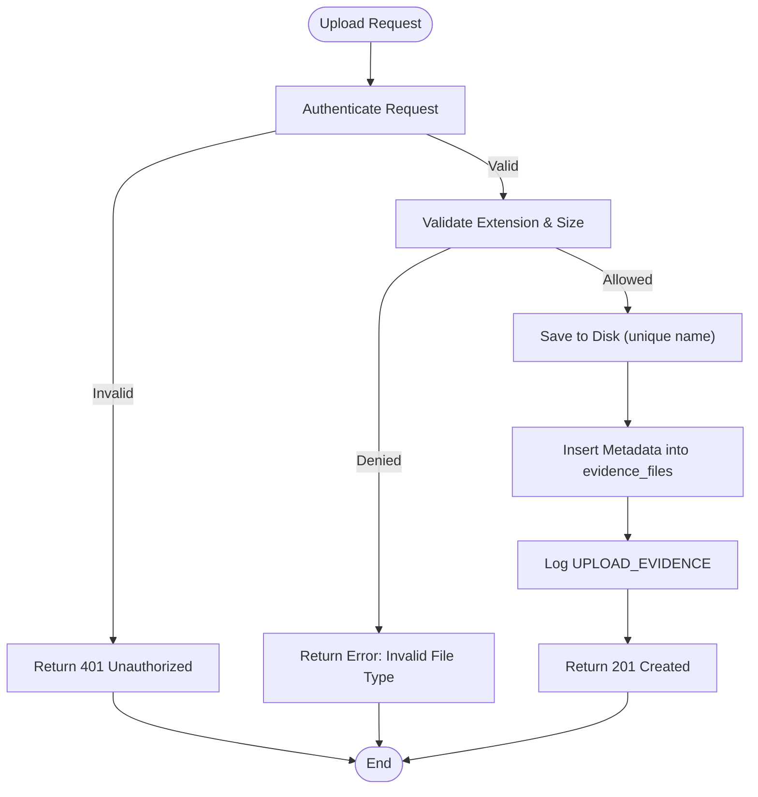
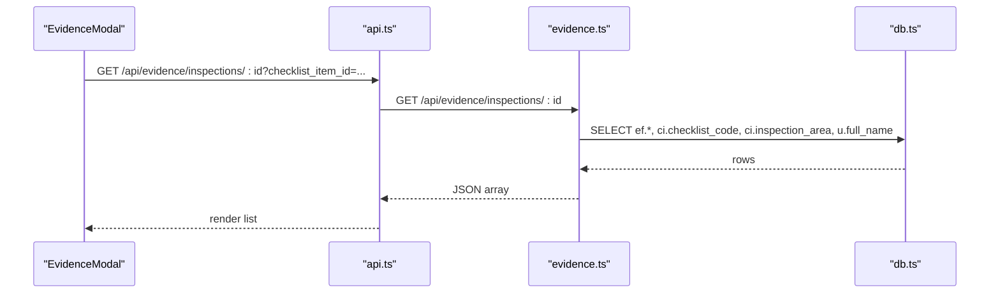
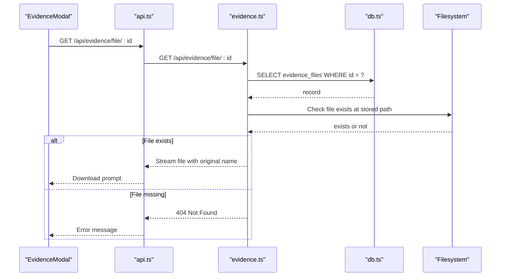
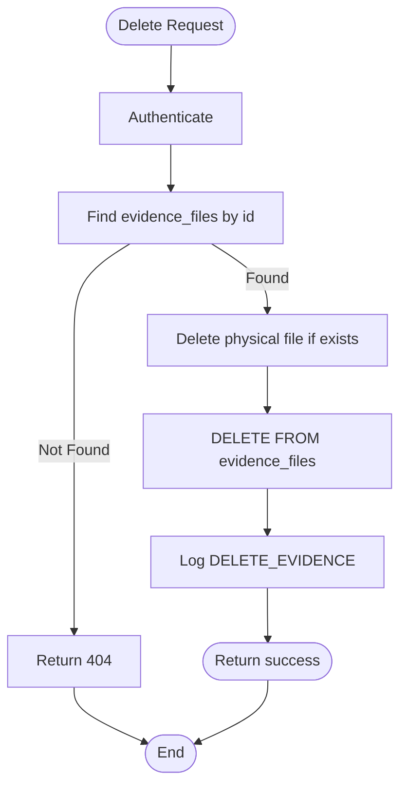
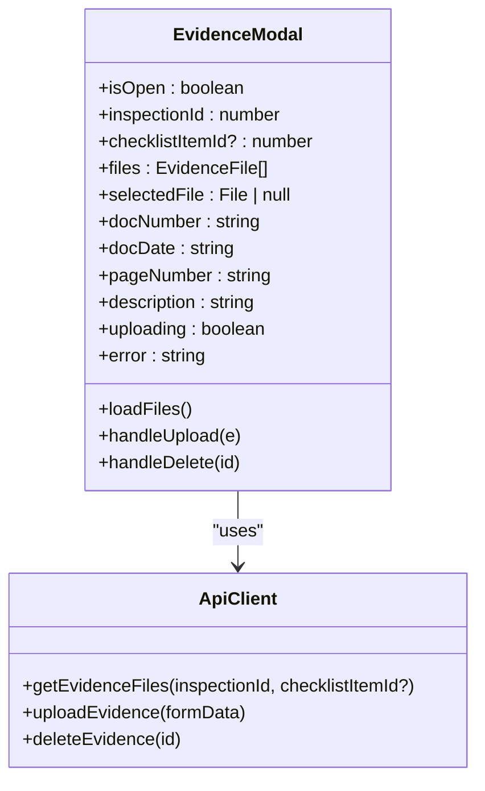
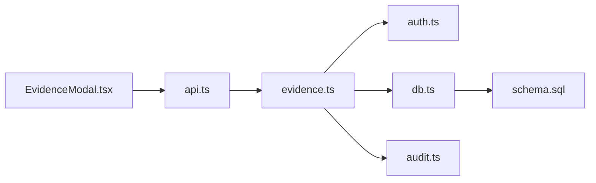

# Evidence Management

<cite>
**Referenced Files in This Document**
- [server/routes/evidence.ts](file://server/routes/evidence.ts)
- [src/components/modals/EvidenceModal.tsx](file://src/components/modals/EvidenceModal.tsx)
- [database/schema.sql](file://database/schema.sql)
- [server/db.ts](file://server/db.ts)
- [src/services/api.ts](file://src/services/api.ts)
- [src/types/index.ts](file://src/types/index.ts)
- [server/middleware/auth.ts](file://server/middleware/auth.ts)
- [server/utils/audit.ts](file://server/utils/audit.ts)
</cite>

## Table of Contents
1. Introduction
2. Project Structure
3. Core Components
4. Architecture Overview
5. Detailed Component Analysis
6. Dependency Analysis
7. Performance Considerations
8. Troubleshooting Guide
9. Conclusion

## Introduction
This document explains the Evidence Management system for supporting documents and evidence files within the procurement monitoring and inspection workflow. It covers file upload, storage, organization, metadata management, access controls, associations with inspections, findings, and procurements, retrieval mechanisms, security measures, and performance considerations. The system uses a Node.js/Express backend with PostgreSQL (or embedded PGlite), Multer for file uploads to disk, and a React frontend modal for uploading and managing evidence.

## Project Structure
Evidence-related functionality spans server routes, database schema, middleware, utilities, and the frontend modal:
- Server route handles listing, uploading, downloading, and deleting evidence files.
- Database schema defines the evidence_files table and related entities.
- Middleware enforces authentication for protected endpoints.
- Audit utility logs evidence actions.
- Frontend modal provides the user interface for uploading, listing, downloading, and deleting evidence.

**Diagram sources**
- [server/routes/evidence.ts:1-195](file://server/routes/evidence.ts#L1-L195)
- [src/components/modals/EvidenceModal.tsx:1-279](file://src/components/modals/EvidenceModal.tsx#L1-L279)
- [src/services/api.ts:382-411](file://src/services/api.ts#L382-L411)
- [server/db.ts:10-97](file://server/db.ts#L10-L97)
- [server/middleware/auth.ts:36-58](file://server/middleware/auth.ts#L36-L58)
- [server/utils/audit.ts:1-32](file://server/utils/audit.ts#L1-L32)
- [database/schema.sql:182-198](file://database/schema.sql#L182-L198)

**Section sources**
- [server/routes/evidence.ts:1-195](file://server/routes/evidence.ts#L1-L195)
- [src/components/modals/EvidenceModal.tsx:1-279](file://src/components/modals/EvidenceModal.tsx#L1-L279)
- [database/schema.sql:182-198](file://database/schema.sql#L182-L198)
- [server/db.ts:10-97](file://server/db.ts#L10-L97)
- [server/middleware/auth.ts:36-58](file://server/middleware/auth.ts#L36-L58)
- [server/utils/audit.ts:1-32](file://server/utils/audit.ts#L1-L32)
- [src/services/api.ts:382-411](file://src/services/api.ts#L382-L411)

## Core Components
- File Upload and Storage:
  - Uses Multer with disk storage to save files under a dedicated uploads directory.
  - Generates unique stored filenames prefixed with a timestamp and random component to avoid collisions.
  - Enforces allowed file extensions and a maximum file size limit.
- Metadata Management:
  - Stores original filename, stored filename, file path, size, MIME type, document number/date/page, description, and uploader identity.
  - Associates each file with an inspection and optionally a checklist item.
- Access Controls:
  - Protected endpoints require authentication via JWT bearer token.
  - Download endpoint validates existence of both record and physical file before serving.
- Retrieval Mechanisms:
  - List endpoint supports filtering by inspection and optional checklist item.
  - Download endpoint serves the file using its stored name and original name.
  - Delete endpoint removes both database record and physical file, then audits the action.
- Integration Points:
  - Linked to inspections and checklist items; referenced in reports and findings workflows.
  - Audit logging records upload and delete actions with context.

**Section sources**
- [server/routes/evidence.ts:16-41](file://server/routes/evidence.ts#L16-L41)
- [server/routes/evidence.ts:70-134](file://server/routes/evidence.ts#L70-L134)
- [server/routes/evidence.ts:136-156](file://server/routes/evidence.ts#L136-L156)
- [server/routes/evidence.ts:158-192](file://server/routes/evidence.ts#L158-L192)
- [database/schema.sql:182-198](file://database/schema.sql#L182-L198)
- [server/middleware/auth.ts:36-58](file://server/middleware/auth.ts#L36-L58)
- [server/utils/audit.ts:1-32](file://server/utils/audit.ts#L1-L32)

## Architecture Overview
The evidence flow involves authenticated requests from the frontend to the backend, which validates inputs, persists metadata to the database, stores files on disk, and logs actions. Retrieval is controlled and audited.

**Diagram sources**
- [src/components/modals/EvidenceModal.tsx:49-81](file://src/components/modals/EvidenceModal.tsx#L49-L81)
- [src/services/api.ts:382-411](file://src/services/api.ts#L382-L411)
- [server/routes/evidence.ts:43-68](file://server/routes/evidence.ts#L43-L68)
- [server/routes/evidence.ts:70-134](file://server/routes/evidence.ts#L70-L134)
- [server/routes/evidence.ts:136-156](file://server/routes/evidence.ts#L136-L156)
- [server/middleware/auth.ts:36-58](file://server/middleware/auth.ts#L36-L58)
- [server/utils/audit.ts:1-32](file://server/utils/audit.ts#L1-L32)

## Detailed Component Analysis

### Evidence File Model and Relationships
The evidence model captures file metadata and relationships to inspections and checklist items. It also tracks who uploaded the file and when.

```mermaid
erDiagram
INSPECTIONS {
int id PK
varchar inspection_code
int procurement_id FK
date inspection_date
varchar status
}
CHECKLIST_ITEMS {
int id PK
varchar checklist_code
int stage_id FK
varchar inspection_area
}
EVIDENCE_FILES {
int id PK
int inspection_id FK
int checklist_item_id FK
varchar file_name
varchar stored_file_name
varchar file_path
bigint file_size
varchar file_type
varchar document_number
date document_date
varchar page_number
text description
int uploaded_by FK
timestamp created_at
}
USERS {
int id PK
varchar username
varchar full_name
}
INSPECTIONS ||--o{ EVIDENCE_FILES : "has many"
CHECKLIST_ITEMS ||--o{ EVIDENCE_FILES : "optional link"
USERS ||--o{ EVIDENCE_FILES : "uploaded_by"
```

**Diagram sources**
- [database/schema.sql:145-162](file://database/schema.sql#L145-L162)
- [database/schema.sql:126-143](file://database/schema.sql#L126-L143)
- [database/schema.sql:182-198](file://database/schema.sql#L182-L198)
- [database/schema.sql:67-81](file://database/schema.sql#L67-L81)

**Section sources**
- [database/schema.sql:182-198](file://database/schema.sql#L182-L198)
- [database/schema.sql:145-162](file://database/schema.sql#L145-L162)
- [database/schema.sql:126-143](file://database/schema.sql#L126-L143)
- [database/schema.sql:67-81](file://database/schema.sql#L67-L81)

### Upload Workflow
- Authentication is required before upload.
- Multer validates file extension against an allowlist and enforces a size limit.
- Files are saved to disk with unique names; metadata is persisted to the database.
- An audit log entry is created for traceability.

**Diagram sources**
- [server/routes/evidence.ts:70-134](file://server/routes/evidence.ts#L70-L134)
- [server/middleware/auth.ts:36-58](file://server/middleware/auth.ts#L36-L58)
- [server/utils/audit.ts:1-32](file://server/utils/audit.ts#L1-L32)

**Section sources**
- [server/routes/evidence.ts:16-41](file://server/routes/evidence.ts#L16-L41)
- [server/routes/evidence.ts:70-134](file://server/routes/evidence.ts#L70-L134)
- [server/middleware/auth.ts:36-58](file://server/middleware/auth.ts#L36-L58)
- [server/utils/audit.ts:1-32](file://server/utils/audit.ts#L1-L32)

### Listing and Filtering Evidence
- Lists all evidence files for a given inspection.
- Optionally filters by checklist_item_id to show only evidence tied to a specific checklist item.
- Joins with checklist_items and users to enrich results with codes, areas, and uploader names.

**Diagram sources**
- [src/components/modals/EvidenceModal.tsx:31-47](file://src/components/modals/EvidenceModal.tsx#L31-L47)
- [src/services/api.ts:382-388](file://src/services/api.ts#L382-L388)
- [server/routes/evidence.ts:43-68](file://server/routes/evidence.ts#L43-L68)

**Section sources**
- [server/routes/evidence.ts:43-68](file://server/routes/evidence.ts#L43-L68)
- [src/services/api.ts:382-388](file://src/services/api.ts#L382-L388)
- [src/components/modals/EvidenceModal.tsx:31-47](file://src/components/modals/EvidenceModal.tsx#L31-L47)

### File Retrieval and Download
- Retrieves metadata by ID and verifies the physical file exists before streaming it back.
- Returns appropriate errors if the record or file is missing.

**Diagram sources**
- [server/routes/evidence.ts:136-156](file://server/routes/evidence.ts#L136-L156)

**Section sources**
- [server/routes/evidence.ts:136-156](file://server/routes/evidence.ts#L136-L156)

### Deletion Workflow
- Requires authentication.
- Verifies record existence, deletes the physical file if present, removes the database record, and logs the deletion.

**Diagram sources**
- [server/routes/evidence.ts:158-192](file://server/routes/evidence.ts#L158-L192)
- [server/utils/audit.ts:1-32](file://server/utils/audit.ts#L1-L32)

**Section sources**
- [server/routes/evidence.ts:158-192](file://server/routes/evidence.ts#L158-L192)
- [server/utils/audit.ts:1-32](file://server/utils/audit.ts#L1-L32)

### Frontend Evidence Modal
- Provides a form to select a file and enter metadata (document number/date, page number, description).
- Submits FormData to the upload endpoint and refreshes the list on success.
- Displays existing evidence with download and delete actions.

**Diagram sources**
- [src/components/modals/EvidenceModal.tsx:1-279](file://src/components/modals/EvidenceModal.tsx#L1-L279)
- [src/services/api.ts:382-411](file://src/services/api.ts#L382-L411)

**Section sources**
- [src/components/modals/EvidenceModal.tsx:1-279](file://src/components/modals/EvidenceModal.tsx#L1-L279)
- [src/services/api.ts:382-411](file://src/services/api.ts#L382-L411)

## Dependency Analysis
- Backend dependencies:
  - Express Router for routing.
  - Multer for file handling and validation.
  - PostgreSQL client (pg or PGlite) via db.ts for queries.
  - JWT-based authentication middleware.
  - Audit utility for logging.
- Frontend dependencies:
  - React components for UI.
  - Fetch-based API client for HTTP calls.
- Data dependencies:
  - evidence_files linked to inspections and optionally checklist_items.
  - Users associated via uploaded_by.

**Diagram sources**
- [src/components/modals/EvidenceModal.tsx:1-279](file://src/components/modals/EvidenceModal.tsx#L1-L279)
- [src/services/api.ts:382-411](file://src/services/api.ts#L382-L411)
- [server/routes/evidence.ts:1-195](file://server/routes/evidence.ts#L1-L195)
- [server/middleware/auth.ts:36-58](file://server/middleware/auth.ts#L36-L58)
- [server/db.ts:10-97](file://server/db.ts#L10-L97)
- [server/utils/audit.ts:1-32](file://server/utils/audit.ts#L1-L32)
- [database/schema.sql:182-198](file://database/schema.sql#L182-L198)

**Section sources**
- [server/routes/evidence.ts:1-195](file://server/routes/evidence.ts#L1-L195)
- [src/services/api.ts:382-411](file://src/services/api.ts#L382-L411)
- [server/middleware/auth.ts:36-58](file://server/middleware/auth.ts#L36-L58)
- [server/db.ts:10-97](file://server/db.ts#L10-L97)
- [server/utils/audit.ts:1-32](file://server/utils/audit.ts#L1-L32)
- [database/schema.sql:182-198](file://database/schema.sql#L182-L198)

## Performance Considerations
- File Size Limit:
  - Maximum file size is enforced at the server level to prevent large uploads.
- Allowed Extensions:
  - Only specific file types are accepted, reducing risk and processing overhead.
- Storage Strategy:
  - Files are stored on disk with unique names to avoid collisions and simplify retrieval.
- Query Optimization:
  - Evidence listing supports filtering by inspection and checklist item to reduce payload size.
- Database Engine:
  - Supports external PostgreSQL or embedded PGlite; choose based on deployment needs.
- Concurrency:
  - For high-volume environments, consider moving to object storage (e.g., S3-compatible) and streaming uploads to improve scalability.

[No sources needed since this section provides general guidance]

## Troubleshooting Guide
- Authentication Errors:
  - Ensure a valid JWT bearer token is included in requests to protected endpoints.
- Invalid File Type:
  - Only predefined extensions are allowed; verify the file extension matches the allowlist.
- File Too Large:
  - Exceeds the configured size limit; compress or split content if necessary.
- Missing File on Disk:
  - If a record exists but the file is missing, the download endpoint returns a 404; restore from backup or re-upload.
- Database Connection Issues:
  - Verify environment variables for external PostgreSQL or ensure embedded PGlite data directory is intact.
- Audit Logs:
  - Check audit logs for evidence upload/delete actions to trace issues and confirm successful operations.

**Section sources**
- [server/middleware/auth.ts:36-58](file://server/middleware/auth.ts#L36-L58)
- [server/routes/evidence.ts:28-41](file://server/routes/evidence.ts#L28-L41)
- [server/routes/evidence.ts:136-156](file://server/routes/evidence.ts#L136-L156)
- [server/db.ts:10-97](file://server/db.ts#L10-L97)
- [server/utils/audit.ts:1-32](file://server/utils/audit.ts#L1-L32)

## Conclusion
The Evidence Management system provides secure, auditable upload, storage, and retrieval of supporting documents linked to inspections and checklist items. It enforces file type restrictions and size limits, manages rich metadata, and integrates with authentication and audit logging. While current implementation uses local disk storage, it can be extended to cloud storage for better scalability. The system’s design supports clear association with inspections, findings, and procurements through relational links and reporting integrations.

[No sources needed since this section summarizes without analyzing specific files]