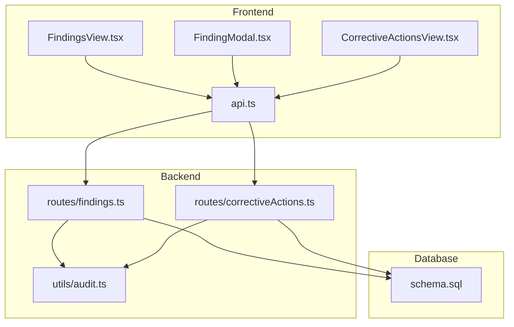
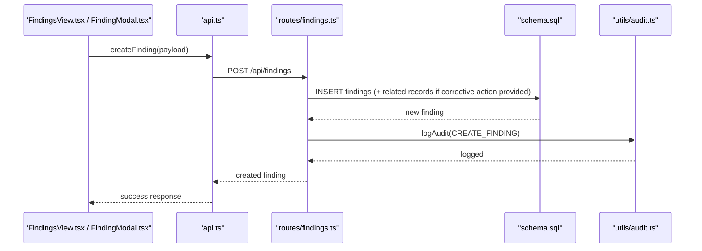
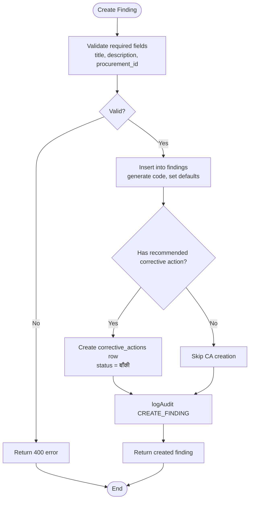
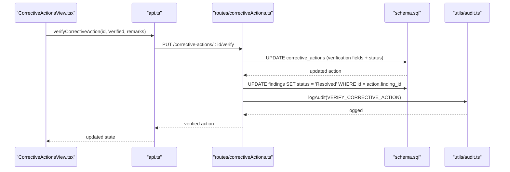
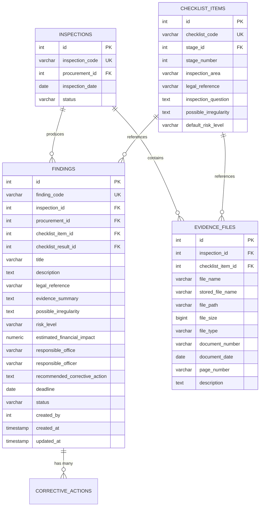
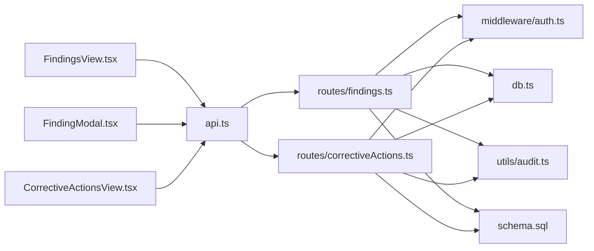

# Finding Management

<cite>
**Referenced Files in This Document**
- [findings.ts](file://server/routes/findings.ts)
- [correctiveActions.ts](file://server/routes/correctiveActions.ts)
- [audit.ts](file://server/utils/audit.ts)
- [schema.sql](file://database/schema.sql)
- [FindingsView.tsx](file://src/components/FindingsView.tsx)
- [FindingModal.tsx](file://src/components/modals/FindingModal.tsx)
- [CorrectiveActionsView.tsx](file://src/components/CorrectiveActionsView.tsx)
- [api.ts](file://src/services/api.ts)
- [index.ts](file://src/types/index.ts)
</cite>

## Table of Contents
1. [Introduction](#introduction)
2. [Project Structure](#project-structure)
3. [Core Components](#core-components)
4. [Architecture Overview](#architecture-overview)
5. [Detailed Component Analysis](#detailed-component-analysis)
6. [Dependency Analysis](#dependency-analysis)
7. [Performance Considerations](#performance-considerations)
8. [Troubleshooting Guide](#troubleshooting-guide)
9. [Conclusion](#conclusion)
10. [Appendices](#appendices)

## Introduction
This document explains the Finding Management system that identifies, documents, and tracks procurement irregularities and compliance issues during inspections. It covers:
- Classification by risk levels (उच्च, अत्यन्त उच्च), severity assessment, evidence linking, and deadline management
- Relationships between findings and inspections, corrective action assignment workflows, and status tracking from identification through resolution
- Categorization, priority setting, escalation procedures, and reporting capabilities
- Data models, validation rules, and audit trail logging

The system supports a full lifecycle: inspection-driven discovery, finding creation with risk and financial impact, corrective action assignment and verification, and closure with auditability.

## Project Structure
The Finding Management feature spans backend routes, database schema, frontend views, and API services:
- Backend routes expose REST endpoints for listing, creating, updating, and deleting findings and corrective actions
- Database schema defines entities for procurements, inspections, checklist items/results, findings, corrective actions, evidence, and audit logs
- Frontend components provide filtering, creation forms, and corrective action tracking UIs
- API service centralizes client calls to backend endpoints

**Diagram sources**
- [FindingsView.tsx:1-306](file://src/components/FindingsView.tsx#L1-L306)
- [FindingModal.tsx:1-349](file://src/components/modals/FindingModal.tsx#L1-L349)
- [CorrectiveActionsView.tsx:1-425](file://src/components/CorrectiveActionsView.tsx#L1-L425)
- [api.ts:284-380](file://src/services/api.ts#L284-L380)
- [findings.ts:1-335](file://server/routes/findings.ts#L1-L335)
- [correctiveActions.ts:1-251](file://server/routes/correctiveActions.ts#L1-L251)
- [audit.ts:1-32](file://server/utils/audit.ts#L1-L32)
- [schema.sql:1-283](file://database/schema.sql#L1-L283)

**Section sources**
- [findings.ts:1-335](file://server/routes/findings.ts#L1-L335)
- [correctiveActions.ts:1-251](file://server/routes/correctiveActions.ts#L1-L251)
- [schema.sql:1-283](file://database/schema.sql#L1-L283)
- [FindingsView.tsx:1-306](file://src/components/FindingsView.tsx#L1-L306)
- [FindingModal.tsx:1-349](file://src/components/modals/FindingModal.tsx#L1-L349)
- [CorrectiveActionsView.tsx:1-425](file://src/components/CorrectiveActionsView.tsx#L1-L425)
- [api.ts:1-440](file://src/services/api.ts#L1-L440)
- [index.ts:1-338](file://src/types/index.ts#L1-L338)

## Core Components
- Findings CRUD and filtering: list, get, create, update, delete with role-based access and audit logging
- Corrective Actions lifecycle: create, update progress/status, verify (with auto-finding status updates)
- Audit logging utility for all critical operations
- Frontend views for managing findings and corrective actions with filters and deadlines
- Types defining data contracts for frontend-backend communication

Key responsibilities:
- Risk classification and severity: default high risk; support for critical/high/medium/low
- Evidence linkage: optional links to checklist items/results and evidence files
- Deadline management: due date enforcement and overdue detection
- Status tracking: Open → Under Review → Corrective Action Required → Resolved → Closed
- Escalation: overdue marking and verification workflow for closure

**Section sources**
- [findings.ts:8-335](file://server/routes/findings.ts#L8-L335)
- [correctiveActions.ts:8-251](file://server/routes/correctiveActions.ts#L8-L251)
- [audit.ts:1-32](file://server/utils/audit.ts#L1-L32)
- [index.ts:205-260](file://src/types/index.ts#L205-L260)

## Architecture Overview
The system follows a layered architecture:
- Presentation layer: React components render tables, modals, and filters
- Service layer: api.ts encapsulates HTTP calls with auth headers
- Route layer: Express routers handle authorization, validation, DB queries, and audit logging
- Data layer: PostgreSQL schema enforces relationships and indexes

**Diagram sources**
- [FindingModal.tsx:103-138](file://src/components/modals/FindingModal.tsx#L103-L138)
- [api.ts:305-314](file://src/services/api.ts#L305-L314)
- [findings.ts:122-221](file://server/routes/findings.ts#L122-L221)
- [schema.sql:200-224](file://database/schema.sql#L200-L224)
- [audit.ts:3-32](file://server/utils/audit.ts#L3-L32)

## Detailed Component Analysis

### Findings Lifecycle and Workflow
- Creation:
  - Requires title, description, procurement_id
  - Optional fields include inspection_id, checklist_item_id, legal_reference, evidence_summary, possible_irregularity, risk_level, estimated_financial_impact, responsible_office/officer, recommended_corrective_action, deadline, inspector_remarks
  - Auto-generates unique finding_code and defaults risk_level to High (उच्च) and status to Open
  - If recommended_corrective_action is provided, automatically creates a corrective action record with status Pending (बाँकी)
  - Logs audit entry for creation
- Listing and Filtering:
  - Supports filtering by risk_level, status, procurement_id, inspection_id, office_id, and search across title/code/description/procurement
  - Joins to procurements, offices, checklist_items, users to enrich display
- Update:
  - Allows partial updates with COALESCE semantics; updates timestamp
  - Logs audit entry with old/new values
- Delete:
  - Admin-only deletion with audit logging

**Diagram sources**
- [findings.ts:122-221](file://server/routes/findings.ts#L122-L221)
- [schema.sql:200-244](file://database/schema.sql#L200-L244)

**Section sources**
- [findings.ts:8-335](file://server/routes/findings.ts#L8-L335)
- [schema.sql:200-244](file://database/schema.sql#L200-L244)

### Corrective Actions Assignment and Verification
- Creation:
  - Requires finding_id and corrective_action_text
  - Optional inspection_id, responsible_office/officer, deadline, status
  - Defaults status to Pending (बाँकी)
  - Logs audit entry
- Update Progress:
  - Updates text, responsible parties, deadline, progress_notes, completion_date, status
  - Auto-marks as Overdue (समयसीमा नाघेको) when past deadline and not completed/verified
  - Logs audit entry
- Verification:
  - Authorized roles can verify or reject
  - On verification, sets verification_status, remarks, officer, timestamp, and updates status accordingly
  - If verified, automatically updates associated finding status to Resolved
  - Logs audit entry

**Diagram sources**
- [CorrectiveActionsView.tsx:79-95](file://src/components/CorrectiveActionsView.tsx#L79-L95)
- [api.ts:371-380](file://src/services/api.ts#L371-L380)
- [correctiveActions.ts:195-248](file://server/routes/correctiveActions.ts#L195-L248)
- [schema.sql:226-244](file://database/schema.sql#L226-L244)
- [audit.ts:3-32](file://server/utils/audit.ts#L3-L32)

**Section sources**
- [correctiveActions.ts:8-251](file://server/routes/correctiveActions.ts#L8-L251)
- [schema.sql:226-244](file://database/schema.sql#L226-L244)

### Evidence Linking and Checklist Integration
- Findings can be linked to:
  - Inspection via inspection_id
  - Procurement via procurement_id
  - Master checklist item via checklist_item_id
  - Inspection checklist result via checklist_result_id
- Evidence files are stored separately and can be associated with inspections and checklist items
- The UI allows selecting checklist items which pre-fill legal references, possible irregularities, titles, and default risk levels

**Diagram sources**
- [schema.sql:145-244](file://database/schema.sql#L145-L244)
- [schema.sql:182-198](file://database/schema.sql#L182-L198)

**Section sources**
- [schema.sql:145-244](file://database/schema.sql#L145-L244)
- [schema.sql:182-198](file://database/schema.sql#L182-L198)

### Status Tracking and Escalation Procedures
- Finding statuses:
  - Open: newly created or awaiting review
  - Under Review: being evaluated
  - Corrective Action Required: needs remediation
  - Resolved: corrective action verified
  - Closed: formally closed
- Corrective action statuses:
  - बाँकी (Pending)
  - प्रक्रियामा (In Progress)
  - सम्पन्न (Completed)
  - प्रमाणित (Verified)
  - समयसीमा नाघेको (Overdue)
- Escalation:
  - Overdue detection based on deadline vs current date
  - Verification workflow requires authorized roles
  - Automatic finding status update to Resolved upon verification

**Section sources**
- [findings.ts:122-221](file://server/routes/findings.ts#L122-L221)
- [correctiveActions.ts:123-248](file://server/routes/correctiveActions.ts#L123-L248)
- [schema.sql:200-244](file://database/schema.sql#L200-L244)

### Reporting Capabilities
- Findings list supports filtering by risk level, status, procurement, inspection, office, and free-text search
- Corrective actions list supports filtering by status, finding, inspection, office, and overdue flag
- Dashboard and reports endpoints exist in the API service for summary and inspection-specific reports

**Section sources**
- [findings.ts:8-76](file://server/routes/findings.ts#L8-L76)
- [correctiveActions.ts:8-66](file://server/routes/correctiveActions.ts#L8-L66)
- [api.ts:413-425](file://src/services/api.ts#L413-L425)

## Dependency Analysis
- Frontend dependencies:
  - FindingsView depends on api.ts for fetching and filtering findings
  - FindingModal depends on api.ts for creating findings and loading master data
  - CorrectiveActionsView depends on api.ts for listing, updating, and verifying corrective actions
- Backend dependencies:
  - Routes depend on db.ts for queries and middleware/auth.ts for authentication and role checks
  - Audit logging utility used across routes for immutable change tracking
- Database dependencies:
  - Foreign keys enforce relationships among procurements, inspections, checklist items/results, findings, corrective actions, and evidence
  - Indexes optimize common queries on offices, statuses, and associations

**Diagram sources**
- [FindingsView.tsx:1-306](file://src/components/FindingsView.tsx#L1-L306)
- [FindingModal.tsx:1-349](file://src/components/modals/FindingModal.tsx#L1-L349)
- [CorrectiveActionsView.tsx:1-425](file://src/components/CorrectiveActionsView.tsx#L1-L425)
- [api.ts:1-440](file://src/services/api.ts#L1-L440)
- [findings.ts:1-335](file://server/routes/findings.ts#L1-L335)
- [correctiveActions.ts:1-251](file://server/routes/correctiveActions.ts#L1-L251)
- [audit.ts:1-32](file://server/utils/audit.ts#L1-L32)
- [schema.sql:1-283](file://database/schema.sql#L1-L283)

**Section sources**
- [api.ts:1-440](file://src/services/api.ts#L1-L440)
- [findings.ts:1-335](file://server/routes/findings.ts#L1-L335)
- [correctiveActions.ts:1-251](file://server/routes/correctiveActions.ts#L1-L251)
- [schema.sql:1-283](file://database/schema.sql#L1-L283)

## Performance Considerations
- Query optimization:
  - Use indexed columns for frequent filters (office_id, status, inspection_id, risk_level)
  - Avoid SELECT * in production; project only needed fields
  - Paginate large lists if necessary
- N+1 query risks:
  - Enriched joins in listing endpoints should be reviewed for performance at scale
- Audit logging overhead:
  - Ensure audit inserts are asynchronous or batched where feasible
- Frontend rendering:
  - Virtualize long lists to improve UI responsiveness
  - Debounce search inputs to reduce network load

[No sources needed since this section provides general guidance]

## Troubleshooting Guide
Common issues and resolutions:
- Validation errors on finding creation:
  - Ensure title, description, and procurement_id are provided
  - Check server responses for localized error messages
- Missing corrective action creation:
  - Verify recommended_corrective_action is non-empty to trigger automatic CA creation
- Overdue detection not reflecting:
  - Confirm deadline is set and status is not Completed/Verified
- Verification failures:
  - Ensure user has appropriate role (admin/reviewer)
  - Check that finding_id exists and is linked correctly
- Audit logs not appearing:
  - Verify audit utility is invoked and database insert succeeds

**Section sources**
- [findings.ts:122-221](file://server/routes/findings.ts#L122-L221)
- [correctiveActions.ts:123-248](file://server/routes/correctiveActions.ts#L123-L248)
- [audit.ts:3-32](file://server/utils/audit.ts#L3-L32)

## Conclusion
The Finding Management system provides a robust, auditable workflow for identifying and resolving procurement irregularities. It integrates inspections, checklists, evidence, and corrective actions with clear risk classification, deadline management, and verification controls. The layered architecture ensures maintainability, while indexing and filtering support operational efficiency.

[No sources needed since this section summarizes without analyzing specific files]

## Appendices

### Data Models Summary
- Findings: core entity capturing irregularity details, risk, financial impact, deadlines, and status
- Corrective Actions: remediation tasks linked to findings with progress and verification
- Inspections and Checklist Items: contextual linkage for findings and evidence
- Evidence Files: attachments supporting observations and findings
- Audit Logs: immutable records of changes with user context and timestamps

**Section sources**
- [schema.sql:145-244](file://database/schema.sql#L145-L244)
- [schema.sql:182-198](file://database/schema.sql#L182-L198)
- [schema.sql:258-270](file://database/schema.sql#L258-L270)
- [index.ts:205-260](file://src/types/index.ts#L205-L260)

### Validation Rules Summary
- Required fields for finding creation: title, description, procurement_id
- Default risk_level: High (उच्च)
- Default status: Open
- Corrective action creation: requires finding_id and corrective_action_text
- Overdue logic: compares deadline to current date when not completed/verified

**Section sources**
- [findings.ts:122-221](file://server/routes/findings.ts#L122-L221)
- [correctiveActions.ts:68-121](file://server/routes/correctiveActions.ts#L68-L121)
- [correctiveActions.ts:123-193](file://server/routes/correctiveActions.ts#L123-L193)

### Audit Trail Logging Summary
- All create/update/delete operations log actions with user context, entity type, IDs, and old/new values
- IP address captured for traceability
- Centralized utility ensures consistent formatting and error handling

**Section sources**
- [audit.ts:3-32](file://server/utils/audit.ts#L3-L32)
- [findings.ts:205-214](file://server/routes/findings.ts#L205-L214)
- [correctiveActions.ts:105-114](file://server/routes/correctiveActions.ts#L105-L114)
- [correctiveActions.ts:177-186](file://server/routes/correctiveActions.ts#L177-L186)
- [correctiveActions.ts:233-242](file://server/routes/correctiveActions.ts#L233-L242)