# Inspection Workflow

<cite>
**Referenced Files in This Document**
- [inspections.ts](file://server/routes/inspections.ts)
- [checklists.ts](file://server/routes/checklists.ts)
- [procurements.ts](file://server/routes/procurements.ts)
- [findings.ts](file://server/routes/findings.ts)
- [correctiveActions.ts](file://server/routes/correctiveActions.ts)
- [auth.ts](file://server/middleware/auth.ts)
- [schema.sql](file://database/schema.sql)
- [InspectionsView.tsx](file://src/components/InspectionsView.tsx)
- [MasterChecklistView.tsx](file://src/components/MasterChecklistView.tsx)
- [index.ts](file://src/types/index.ts)
</cite>

## Table of Contents
1. Introduction
2. Project Structure
3. Core Components
4. Architecture Overview
5. Detailed Component Analysis
6. Dependency Analysis
7. Performance Considerations
8. Troubleshooting Guide
9. Conclusion
10. Appendices

## Introduction
This document explains the Inspection Workflow system that supports end-to-end monitoring and inspection of public procurements. It covers initiation through completion, including scheduling, checklist-based evaluation across multiple stages, risk assessment scoring, completion percentage tracking, and integration with findings and corrective actions. It also documents relationships between inspections and procurements, team assignment, lead inspector responsibilities, status progression, legal references, compliance verification, and user role permissions at each stage.

## Project Structure
The system is a full-stack application:
- Backend API (Express routes) for inspections, checklists, procurements, findings, corrective actions, and authentication.
- Database schema defines entities such as procurements, inspections, checklist stages/items/results, evidence, findings, corrective actions, and audit logs.
- Frontend components provide interactive UIs for inspection execution, master checklist management, and workflow navigation.

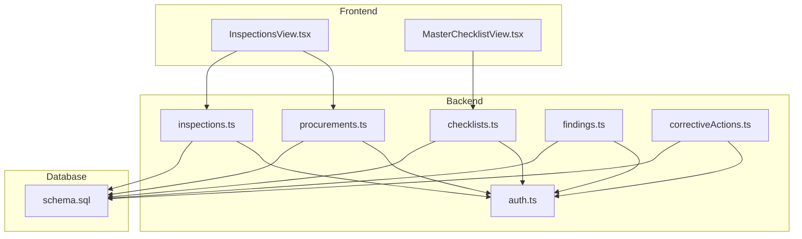

**Diagram sources**
- [inspections.ts:1-409](file://server/routes/inspections.ts#L1-L409)
- [checklists.ts:1-192](file://server/routes/checklists.ts#L1-L192)
- [procurements.ts:1-467](file://server/routes/procurements.ts#L1-L467)
- [findings.ts:1-335](file://server/routes/findings.ts#L1-L335)
- [correctiveActions.ts:1-251](file://server/routes/correctiveActions.ts#L1-L251)
- [auth.ts:1-87](file://server/middleware/auth.ts#L1-L87)
- [schema.sql:1-283](file://database/schema.sql#L1-L283)

**Section sources**
- [inspections.ts:1-409](file://server/routes/inspections.ts#L1-L409)
- [checklists.ts:1-192](file://server/routes/checklists.ts#L1-L192)
- [procurements.ts:1-467](file://server/routes/procurements.ts#L1-L467)
- [findings.ts:1-335](file://server/routes/findings.ts#L1-L335)
- [correctiveActions.ts:1-251](file://server/routes/correctiveActions.ts#L1-L251)
- [auth.ts:1-87](file://server/middleware/auth.ts#L1-L87)
- [schema.sql:1-283](file://database/schema.sql#L1-L283)
- [InspectionsView.tsx:1-924](file://src/components/InspectionsView.tsx#L1-L924)
- [MasterChecklistView.tsx:1-453](file://src/components/MasterChecklistView.tsx#L1-L453)
- [index.ts:1-338](file://src/types/index.ts#L1-L338)

## Core Components
- Procurement lifecycle and seeding: Creating a procurement automatically seeds default document checklist items and creates an initial inspection record linked to the procurement.
- Inspection lifecycle: Inspections are created, evaluated via a multi-stage checklist, progress tracked by completion percentage and risk score, and progressed through statuses with role-based controls.
- Checklist management: Master checklist items define inspection questions, legal references, required documents, and default risk levels; they are grouped into ordered stages.
- Findings and corrective actions: Non-compliant or risky items can generate findings; recommended corrective actions can be auto-created and later verified.
- Authentication and authorization: JWT-based authentication and role-based access control enforce who can create, update, verify, and close workflows.

**Section sources**
- [procurements.ts:174-326](file://server/routes/procurements.ts#L174-L326)
- [inspections.ts:148-255](file://server/routes/inspections.ts#L148-L255)
- [checklists.ts:8-192](file://server/routes/checklists.ts#L1-L192)
- [findings.ts:122-221](file://server/routes/findings.ts#L122-L221)
- [correctiveActions.ts:68-248](file://server/routes/correctiveActions.ts#L68-L248)
- [auth.ts:20-87](file://server/middleware/auth.ts#L20-L87)

## Architecture Overview
The workflow spans frontend interactions and backend services backed by a relational database. Key flows include:
- Procurement creation triggers inspection creation and document checklist seeding.
- Inspectors evaluate checklist items per stage; saving results updates completion percentage and risk score.
- Reviewers verify inspections; verified status requires specific roles.
- Findings and corrective actions integrate with inspections and procurements for remediation and closure.

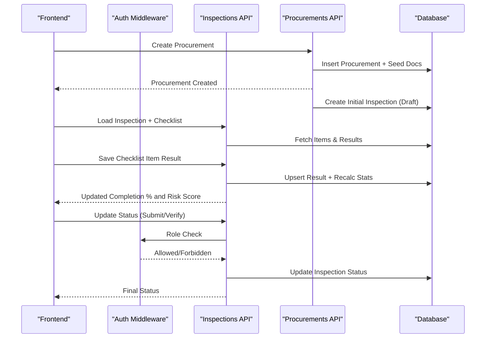

**Diagram sources**
- [procurements.ts:174-326](file://server/routes/procurements.ts#L174-L326)
- [inspections.ts:257-406](file://server/routes/inspections.ts#L257-L406)
- [auth.ts:36-87](file://server/middleware/auth.ts#L36-L87)

## Detailed Component Analysis

### Procurement-to-Inspection Initiation
- When a procurement is created, the system seeds a standard set of document completeness entries and automatically creates an initial inspection record linked to the procurement. The inspection starts in Draft status with the current user as creator and optional lead inspector/team fields.
- Users can later create additional inspections per procurement if needed.

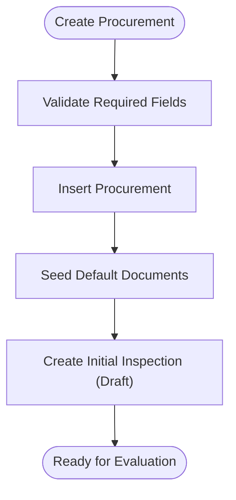

**Diagram sources**
- [procurements.ts:174-326](file://server/routes/procurements.ts#L174-L326)

**Section sources**
- [procurements.ts:174-326](file://server/routes/procurements.ts#L174-L326)

### Multi-Stage Checklist-Based Evaluation
- The master checklist defines inspection areas, legal references, required documents, and default risk levels, organized into ordered stages.
- For each inspection, the system loads applicable checklist items and existing results. Inspectors can filter by stage and status (pending/done/issues).
- Saving a checklist item result performs an upsert and recalculates:
  - Applicable count excludes “Not Applicable”.
  - Completion percentage = checked (excluding NA) / applicable * 100.
  - Risk score aggregates high and critical risks.
  - Status transitions from Draft to In Progress when any item is checked.

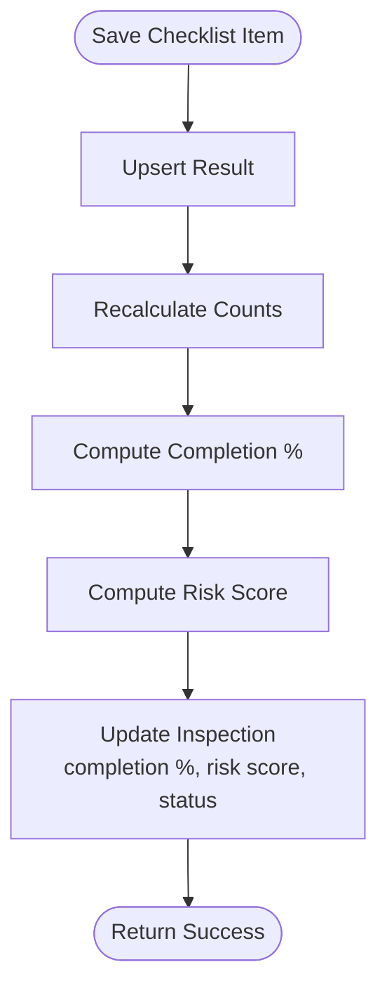

**Diagram sources**
- [inspections.ts:309-406](file://server/routes/inspections.ts#L309-L406)

**Section sources**
- [checklists.ts:8-192](file://server/routes/checklists.ts#L1-L192)
- [inspections.ts:257-406](file://server/routes/inspections.ts#L257-L406)
- [InspectionsView.tsx:129-180](file://src/components/InspectionsView.tsx#L129-L180)

### Risk Assessment Scoring and Compliance Tracking
- Each checklist item has a default risk level; inspectors can adjust assessed risk per item.
- Risk score is computed from counts of high and critical risk items.
- Compliance statistics include total items, compliant, partially compliant, non-compliant, not applicable, missing evidence, and financial impact totals.

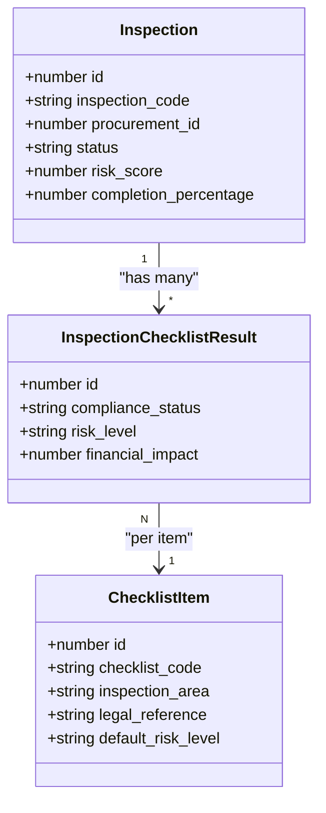

**Diagram sources**
- [schema.sql:145-180](file://database/schema.sql#L145-L180)
- [index.ts:139-203](file://src/types/index.ts#L139-L203)

**Section sources**
- [inspections.ts:119-141](file://server/routes/inspections.ts#L119-L141)
- [inspections.ts:361-394](file://server/routes/inspections.ts#L361-L394)
- [schema.sql:164-180](file://database/schema.sql#L164-L180)

### Status Progression and Role Permissions
- Inspection statuses include Draft, In Progress, Submitted, Under Review, Returned for Correction, Verified, Closed.
- Only users with reviewer or admin roles can verify or close an inspection.
- Frontend exposes Submit and Verify actions based on current user permissions and inspection status.

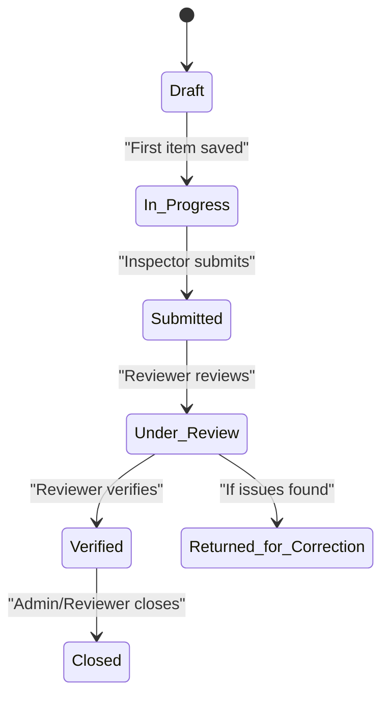

**Diagram sources**
- [inspections.ts:199-255](file://server/routes/inspections.ts#L199-L255)
- [auth.ts:74-87](file://server/middleware/auth.ts#L74-L87)
- [InspectionsView.tsx:314-343](file://src/components/InspectionsView.tsx#L314-L343)

**Section sources**
- [inspections.ts:199-255](file://server/routes/inspections.ts#L199-L255)
- [auth.ts:74-87](file://server/middleware/auth.ts#L74-L87)
- [InspectionsView.tsx:314-343](file://src/components/InspectionsView.tsx#L314-L343)

### Lead Inspector Responsibilities and Team Assignment
- The lead inspector is recorded during inspection creation and can be updated.
- Inspection team information is captured and displayed in the UI for transparency.
- Audit logs capture who created or updated inspections.

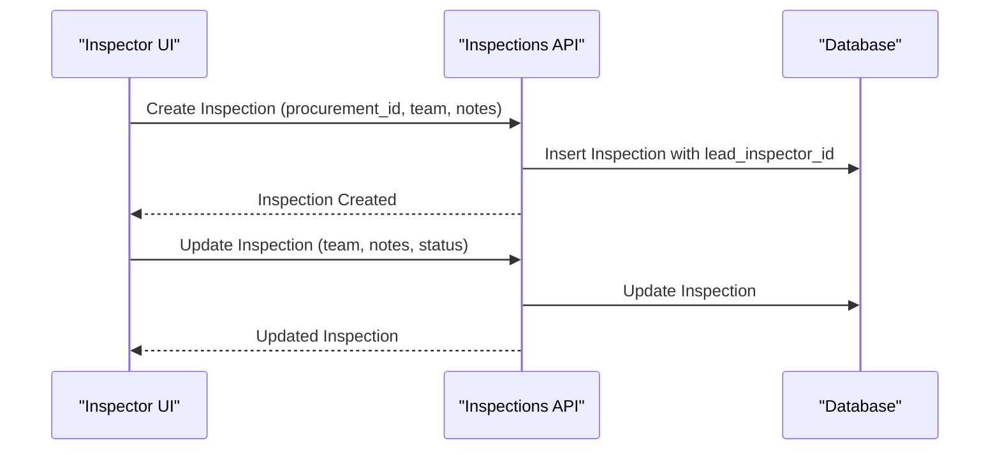

**Diagram sources**
- [inspections.ts:148-197](file://server/routes/inspections.ts#L148-L197)
- [inspections.ts:199-255](file://server/routes/inspections.ts#L199-L255)

**Section sources**
- [inspections.ts:148-197](file://server/routes/inspections.ts#L148-L197)
- [inspections.ts:199-255](file://server/routes/inspections.ts#L199-L255)

### Legal References and Compliance Verification
- Each checklist item includes a legal reference field used to anchor compliance checks to statutory requirements.
- During evaluation, inspectors record compliance status and observations tied to legal references.
- Verification marks the inspection as reviewed and validated by authorized roles.

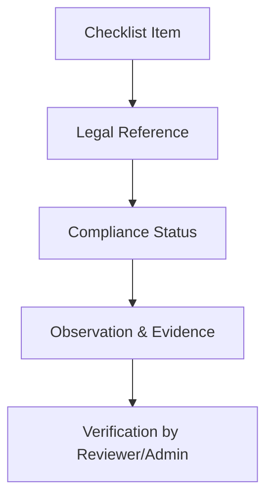

**Diagram sources**
- [checklists.ts:54-123](file://server/routes/checklists.ts#L54-L123)
- [inspections.ts:257-307](file://server/routes/inspections.ts#L257-L307)
- [inspections.ts:199-255](file://server/routes/inspections.ts#L199-L255)

**Section sources**
- [checklists.ts:54-123](file://server/routes/checklists.ts#L54-L123)
- [inspections.ts:257-307](file://server/routes/inspections.ts#L257-L307)

### Integration Points with Findings and Corrective Actions
- From the inspection UI, non-compliant items can open a finding pre-filled with context (legal reference, possible irregularity, risk level, financial impact).
- If a recommended corrective action is provided when creating a finding, the system auto-creates a corrective action record.
- Corrective actions can be updated, marked overdue, and verified; upon verification, the associated finding status updates to Resolved.

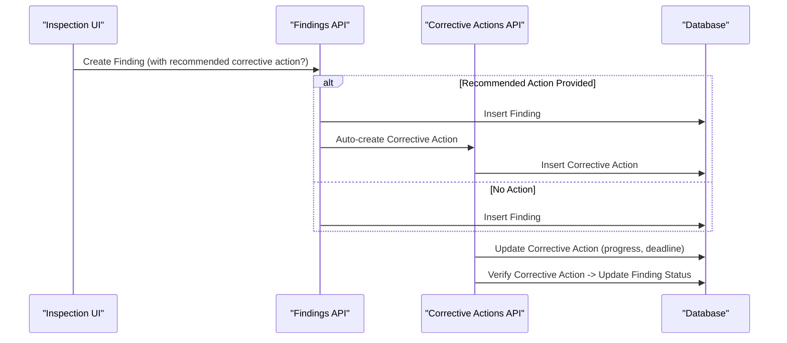

**Diagram sources**
- [findings.ts:122-221](file://server/routes/findings.ts#L122-L221)
- [correctiveActions.ts:68-248](file://server/routes/correctiveActions.ts#L68-L248)
- [InspectionsView.tsx:705-725](file://src/components/InspectionsView.tsx#L705-L725)

**Section sources**
- [findings.ts:122-221](file://server/routes/findings.ts#L122-L221)
- [correctiveActions.ts:68-248](file://server/routes/correctiveActions.ts#L68-L248)
- [InspectionsView.tsx:705-725](file://src/components/InspectionsView.tsx#L705-L725)

### User Role Permissions Across Stages
- Creation and editing of inspections require authenticated users with appropriate roles.
- Verification and closing require reviewer or admin roles.
- Master checklist management (create/update) is restricted to admins.
- Findings and corrective actions have role-gated endpoints for creation, updates, and verification.

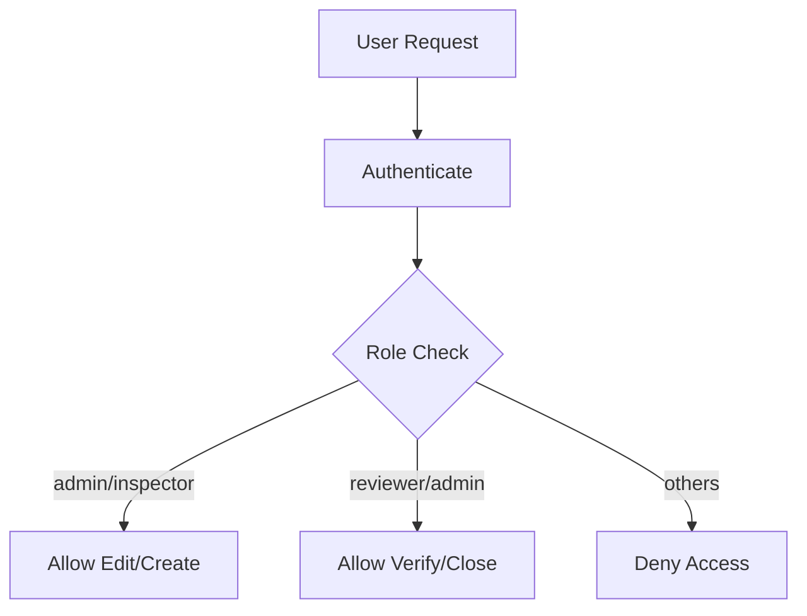

**Diagram sources**
- [auth.ts:36-87](file://server/middleware/auth.ts#L36-L87)
- [inspections.ts:148-255](file://server/routes/inspections.ts#L148-L255)
- [checklists.ts:54-192](file://server/routes/checklists.ts#L54-L192)
- [findings.ts:122-335](file://server/routes/findings.ts#L122-L335)
- [correctiveActions.ts:68-248](file://server/routes/correctiveActions.ts#L68-L248)

**Section sources**
- [auth.ts:36-87](file://server/middleware/auth.ts#L36-L87)
- [inspections.ts:148-255](file://server/routes/inspections.ts#L148-L255)
- [checklists.ts:54-192](file://server/routes/checklists.ts#L54-L192)
- [findings.ts:122-335](file://server/routes/findings.ts#L122-L335)
- [correctiveActions.ts:68-248](file://server/routes/correctiveActions.ts#L68-L248)

## Dependency Analysis
Key dependencies and relationships:
- Inspections depend on procurements via foreign keys and display related metadata.
- Checklist items belong to stages; inspection results link items to inspections.
- Findings link to procurements and optionally to inspections and checklist items/results.
- Corrective actions link to findings and optionally to inspections.
- All write operations are audited via audit logs.

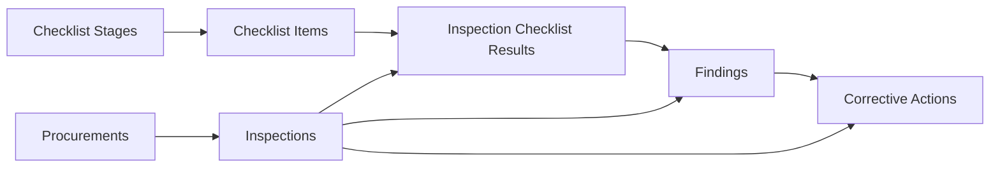

**Diagram sources**
- [schema.sql:83-283](file://database/schema.sql#L83-L283)

**Section sources**
- [schema.sql:83-283](file://database/schema.sql#L83-L283)

## Performance Considerations
- Queries use indexed columns for frequent filters (e.g., office_id, current_status, inspection_id, risk_level).
- Checklist retrieval joins stages and items efficiently and filters active items.
- Completion and risk recalculation runs per save operation; consider batching saves for large batches to reduce repeated recalculations.
- Pagination and limits are applied in procurement listing to avoid heavy payloads.

[No sources needed since this section provides general guidance]

## Troubleshooting Guide
Common issues and resolutions:
- Authentication failures: Ensure valid JWT token is present; tokens expire after 24 hours.
- Permission denied: Verify user role matches endpoint requirements (e.g., only reviewers/admins can verify/close).
- Checklist save errors: Confirm required fields (compliance_status) are provided; server returns validation messages.
- Not found errors: Ensure IDs exist before updating; endpoints return 404 when records are missing.
- Overdue corrective actions: System flags overdue actions when deadlines pass without completion; review deadlines and update status accordingly.

**Section sources**
- [auth.ts:36-87](file://server/middleware/auth.ts#L36-L87)
- [inspections.ts:199-255](file://server/routes/inspections.ts#L199-L255)
- [findings.ts:122-221](file://server/routes/findings.ts#L122-L221)
- [correctiveActions.ts:123-193](file://server/routes/correctiveActions.ts#L123-L193)

## Conclusion
The Inspection Workflow integrates procurement data, staged checklist evaluations, risk scoring, and compliance verification within a secure, role-aware system. It enables systematic oversight of public procurements, traceable through audit logs and integrated findings and corrective actions. The design supports scalable evaluation across many stages while maintaining clear status progression and accountability.

[No sources needed since this section summarizes without analyzing specific files]

## Appendices

### Data Models Overview
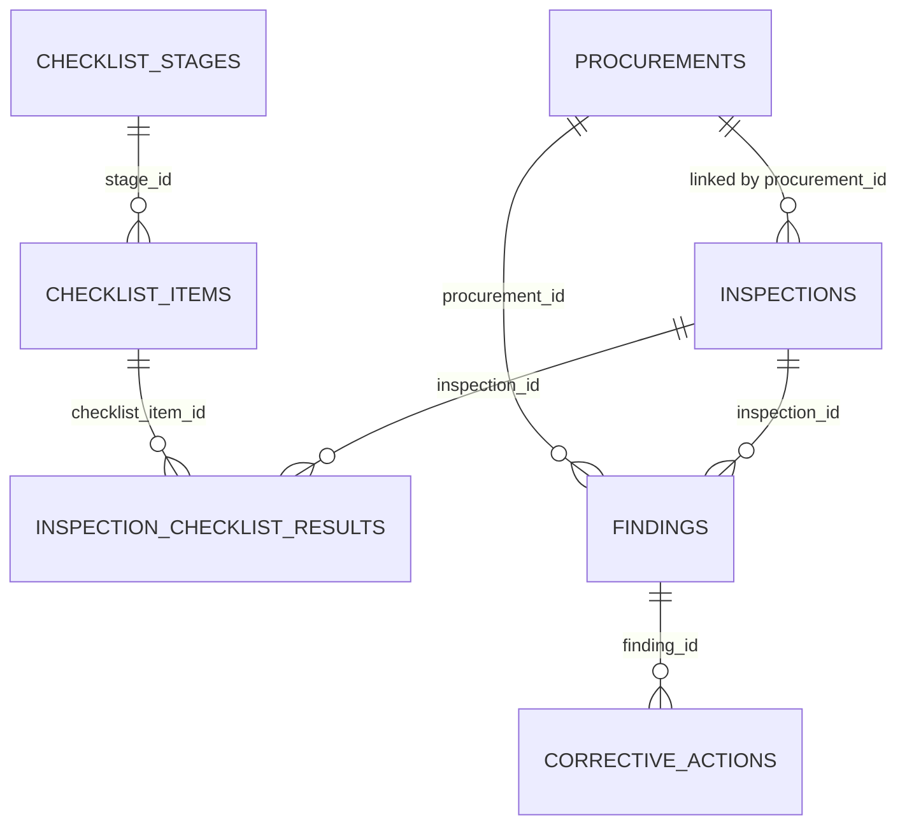

**Diagram sources**
- [schema.sql:83-283](file://database/schema.sql#L83-L283)