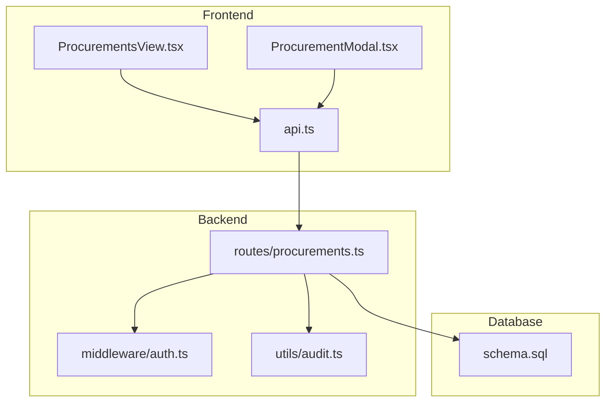
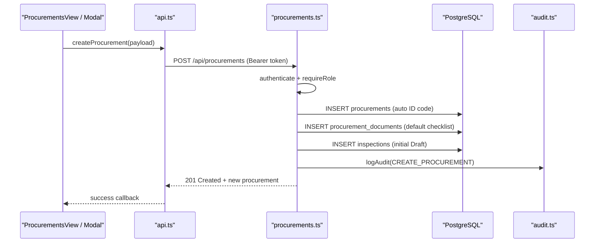
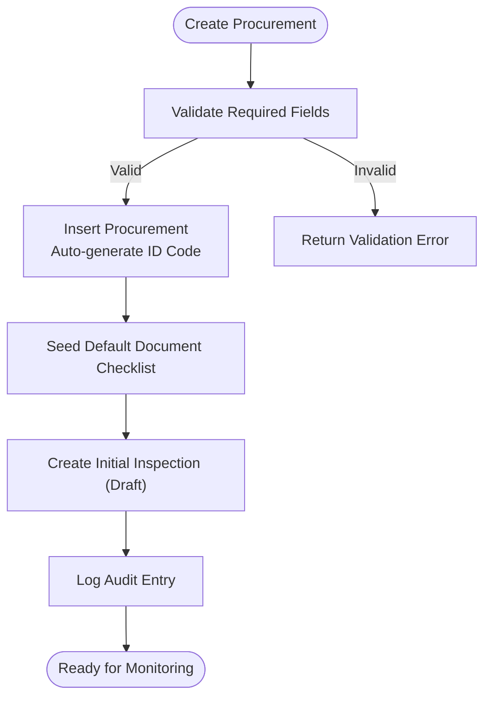
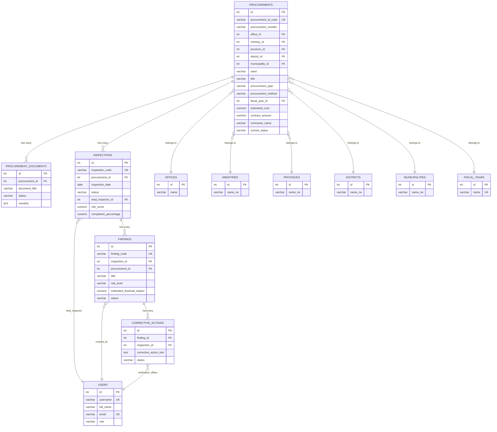
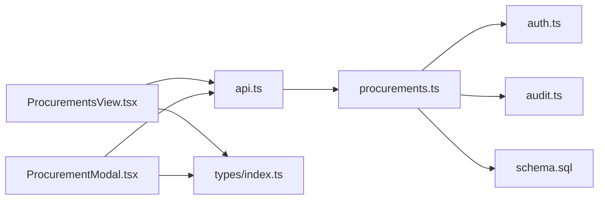

# Procurement Management

<cite>
**Referenced Files in This Document**
- [procurements.ts](file://server/routes/procurements.ts)
- [ProcurementsView.tsx](file://src/components/ProcurementsView.tsx)
- [ProcurementModal.tsx](file://src/components/modals/ProcurementModal.tsx)
- [api.ts](file://src/services/api.ts)
- [schema.sql](file://database/schema.sql)
- [auth.ts](file://server/middleware/auth.ts)
- [audit.ts](file://server/utils/audit.ts)
- [index.ts](file://src/types/index.ts)
</cite>

## Table of Contents
1. Introduction
2. Project Structure
3. Core Components
4. Architecture Overview
5. Detailed Component Analysis
6. Dependency Analysis
7. Performance Considerations
8. Troubleshooting Guide
9. Conclusion

## Introduction
This document explains the Procurement Management module of the NVC system end-to-end: from registration to completion, including procurement record creation, status management, document completeness tracking, and workflow automation. It covers auto-generation of unique procurement ID codes, default document checklist seeding, automatic inspection record creation, all CRUD operations, filtering and search capabilities, integration with other modules (inspections, findings, corrective actions), business rules for procurement types and methods, data structures, validation rules, and error handling patterns.

## Project Structure
The Procurement Management module spans server routes, frontend views and modals, API client services, database schema, authentication middleware, audit logging, and shared TypeScript types.

**Diagram sources**
- [procurements.ts:1-467](file://server/routes/procurements.ts#L1-L467)
- [ProcurementsView.tsx:1-534](file://src/components/ProcurementsView.tsx#L1-L534)
- [ProcurementModal.tsx:1-375](file://src/components/modals/ProcurementModal.tsx#L1-L375)
- [api.ts:1-440](file://src/services/api.ts#L1-L440)
- [schema.sql:1-283](file://database/schema.sql#L1-L283)
- [auth.ts:1-87](file://server/middleware/auth.ts#L1-L87)
- [audit.ts:1-32](file://server/utils/audit.ts#L1-L32)

**Section sources**
- [procurements.ts:1-467](file://server/routes/procurements.ts#L1-L467)
- [ProcurementsView.tsx:1-534](file://src/components/ProcurementsView.tsx#L1-L534)
- [ProcurementModal.tsx:1-375](file://src/components/modals/ProcurementModal.tsx#L1-L375)
- [api.ts:1-440](file://src/services/api.ts#L1-L440)
- [schema.sql:1-283](file://database/schema.sql#L1-L283)
- [auth.ts:1-87](file://server/middleware/auth.ts#L1-L87)
- [audit.ts:1-32](file://server/utils/audit.ts#L1-L32)

## Core Components
- Procurement list view with search and filters (office, type, method, status).
- Procurement creation modal with master data dropdowns and validation.
- Server-side CRUD endpoints with role-based access control.
- Auto-generated unique IDs and default document checklist seeding.
- Automatic initial inspection record creation on procurement creation.
- Integration points to inspections, findings, corrective actions, evidence, reports, and audit logs.

**Section sources**
- [ProcurementsView.tsx:37-117](file://src/components/ProcurementsView.tsx#L37-L117)
- [ProcurementModal.tsx:24-127](file://src/components/modals/ProcurementModal.tsx#L24-L127)
- [procurements.ts:8-113](file://server/routes/procurements.ts#L8-L113)
- [procurements.ts:174-326](file://server/routes/procurements.ts#L174-L326)
- [procurements.ts:328-466](file://server/routes/procurements.ts#L328-L466)
- [schema.sql:83-114](file://database/schema.sql#L83-L114)
- [schema.sql:145-162](file://database/schema.sql#L145-L162)
- [schema.sql:246-256](file://database/schema.sql#L246-L256)

## Architecture Overview
The module follows a standard layered architecture:
- Frontend components call typed API methods that attach JWT tokens.
- Express routes enforce authentication and authorization, then perform database operations.
- Database schema defines entities and relationships; indexes optimize queries.
- Audit logging records create/update actions for compliance.

**Diagram sources**
- [api.ts:151-160](file://src/services/api.ts#L151-L160)
- [procurements.ts:174-326](file://server/routes/procurements.ts#L174-L326)
- [auth.ts:36-86](file://server/middleware/auth.ts#L36-L86)
- [audit.ts:3-32](file://server/utils/audit.ts#L3-L32)
- [schema.sql:83-114](file://database/schema.sql#L83-L114)
- [schema.sql:145-162](file://database/schema.sql#L145-L162)
- [schema.sql:246-256](file://database/schema.sql#L246-L256)

## Detailed Component Analysis

### Procurement Lifecycle and Workflow Automation
- Registration: Create a procurement record with required fields; backend validates and inserts.
- Auto-ID generation: Unique procurement_id_code generated per fiscal year sequence.
- Default document checklist: 19 statutory documents seeded with “not available” status.
- Initial inspection: An inspection record is created automatically in Draft state linked to the procurement.
- Status management: current_status reflects lifecycle stages; updates are audited.
- Completion: Inspections, findings, corrective actions, and evidence complete the monitoring loop.

**Diagram sources**
- [procurements.ts:174-326](file://server/routes/procurements.ts#L174-L326)
- [schema.sql:83-114](file://database/schema.sql#L83-L114)
- [schema.sql:145-162](file://database/schema.sql#L145-L162)
- [schema.sql:246-256](file://database/schema.sql#L246-L256)

**Section sources**
- [procurements.ts:174-326](file://server/routes/procurements.ts#L174-L326)
- [schema.sql:83-114](file://database/schema.sql#L83-L114)
- [schema.sql:145-162](file://database/schema.sql#L145-L162)
- [schema.sql:246-256](file://database/schema.sql#L246-L256)

### Data Models and Relationships
Key entities involved in procurement management:
- procurements: core record with identifiers, financials, dates, and status.
- procurement_documents: per-procurement document checklist with status and remarks.
- inspections: linked to procurements; track progress and risk.
- findings and corrective_actions: derived from inspections and checklist results.
- users, offices, ministries, provinces, districts, municipalities, fiscal_years: master data referenced by procurements.

**Diagram sources**
- [schema.sql:83-114](file://database/schema.sql#L83-L114)
- [schema.sql:145-162](file://database/schema.sql#L145-L162)
- [schema.sql:200-244](file://database/schema.sql#L200-L244)
- [schema.sql:246-256](file://database/schema.sql#L246-L256)
- [schema.sql:67-81](file://database/schema.sql#L67-L81)
- [schema.sql:47-65](file://database/schema.sql#L47-L65)

**Section sources**
- [schema.sql:83-114](file://database/schema.sql#L83-L114)
- [schema.sql:145-162](file://database/schema.sql#L145-L162)
- [schema.sql:200-244](file://database/schema.sql#L200-L244)
- [schema.sql:246-256](file://database/schema.sql#L246-L256)
- [schema.sql:67-81](file://database/schema.sql#L67-L81)
- [schema.sql:47-65](file://database/schema.sql#L47-L65)

### CRUD Operations and Access Control
- List procurements: GET /api/procurements with filters (search, office_id, ministry_id, province_id, fiscal_year_id, procurement_type, procurement_method, current_status, limit, offset).
- Get single procurement: GET /api/procurements/:id returns details plus inspections and documents.
- Create procurement: POST /api/procurements requires authentication and roles admin or inspector; performs validation, auto-ID generation, document checklist seeding, and initial inspection creation.
- Update procurement: PUT /api/procurements/:id requires authentication and roles admin, inspector, or reviewer; updates fields and audits changes.
- Update document status: PUT /api/procurements/:id/documents/:docId updates document status and remarks.

Access control:
- Authentication via JWT bearer token.
- Role checks enforced using middleware.

**Section sources**
- [procurements.ts:8-113](file://server/routes/procurements.ts#L8-L113)
- [procurements.ts:115-172](file://server/routes/procurements.ts#L115-L172)
- [procurements.ts:174-326](file://server/routes/procurements.ts#L174-L326)
- [procurements.ts:328-466](file://server/routes/procurements.ts#L328-L466)
- [auth.ts:36-86](file://server/middleware/auth.ts#L36-L86)

### Filtering, Search, and Pagination
- Search supports partial matching across title, procurement_id_code, procurement_number, contractor_name, and office name.
- Filters include office, ministry, province, fiscal year, procurement type, method, and current status.
- Pagination uses limit and offset parameters.

**Section sources**
- [procurements.ts:8-113](file://server/routes/procurements.ts#L8-L113)
- [api.ts:131-142](file://src/services/api.ts#L131-L142)
- [ProcurementsView.tsx:70-86](file://src/components/ProcurementsView.tsx#L70-L86)

### Business Rules
- Procurement types: Works, Goods, Consultancy Services, Other Services.
- Procurement methods: Open Competitive Bidding, Sealed Quotation, Direct Procurement, Consumer Committee, Consultancy Selection, Special Circumstances.
- Status values: योजना, बोलपत्र आह्वान, मूल्याङ्कन, सम्झौता, संचालनमा, सम्पन्न, रद्द, विवादित.
- Default budget source when not provided.
- Default status on creation: संचालनमा.
- Document statuses: उपलब्ध, उपलब्ध छैन, आंशिक, लागू हुँदैन.
- Inspection statuses: Draft, In Progress, Submitted, Under Review, Returned for Correction, Verified, Closed.

**Section sources**
- [index.ts:69-111](file://src/types/index.ts#L69-L111)
- [schema.sql:83-114](file://database/schema.sql#L83-L114)
- [schema.sql:145-162](file://database/schema.sql#L145-L162)
- [schema.sql:246-256](file://database/schema.sql#L246-L256)

### Validation Rules and Error Handling
- Required fields for creation: title, procurement_type, procurement_method, office_id, fiscal_year_id.
- Frontend additional validations: title, office, estimated cost, contract amount.
- Backend returns 400 for missing required fields; 404 if procurement not found; 500 for server errors.
- Audit logs capture create/update actions with old/new values and IP address.

**Section sources**
- [procurements.ts:174-210](file://server/routes/procurements.ts#L174-L210)
- [procurements.ts:328-336](file://server/routes/procurements.ts#L328-L336)
- [procurements.ts:427-436](file://server/routes/procurements.ts#L427-L436)
- [ProcurementModal.tsx:86-127](file://src/components/modals/ProcurementModal.tsx#L86-L127)
- [audit.ts:3-32](file://server/utils/audit.ts#L3-L32)

### Integration with Other Modules
- Inspections: Automatically created on procurement creation; later managed through inspections endpoints.
- Findings and Corrective Actions: Linked to inspections and procurements; support remediation workflows.
- Evidence: Associated with inspections and checklist items.
- Reports: Inspection report retrieval endpoint exists.
- Audit Logs: All create/update actions logged for traceability.

**Section sources**
- [procurements.ts:293-308](file://server/routes/procurements.ts#L293-L308)
- [api.ts:212-282](file://src/services/api.ts#L212-L282)
- [api.ts:284-380](file://src/services/api.ts#L284-L380)
- [api.ts:382-425](file://src/services/api.ts#L382-L425)
- [schema.sql:145-162](file://database/schema.sql#L145-L162)
- [schema.sql:200-244](file://database/schema.sql#L200-L244)

### User Interface Workflows
- Procurement list: Displays key fields, latest inspection status, completion percentage, and actions to view details or start inspection.
- Detail modal: Shows procurement metadata and a 19-point statutory document checklist where each item can be toggled between available/unavailable.
- Creation modal: Loads master data (offices, provinces, districts, ministries, fiscal years) and submits a new procurement.

**Section sources**
- [ProcurementsView.tsx:126-534](file://src/components/ProcurementsView.tsx#L126-L534)
- [ProcurementModal.tsx:131-375](file://src/components/modals/ProcurementModal.tsx#L131-L375)

## Dependency Analysis
- Frontend depends on api.ts for HTTP calls and types for contracts.
- Backend routes depend on auth middleware for security and audit utility for logging.
- Database schema defines relationships and constraints; indexes improve query performance.
- Types ensure consistency between frontend and backend payloads.

**Diagram sources**
- [ProcurementsView.tsx:1-534](file://src/components/ProcurementsView.tsx#L1-L534)
- [ProcurementModal.tsx:1-375](file://src/components/modals/ProcurementModal.tsx#L1-L375)
- [api.ts:1-440](file://src/services/api.ts#L1-L440)
- [procurements.ts:1-467](file://server/routes/procurements.ts#L1-L467)
- [auth.ts:1-87](file://server/middleware/auth.ts#L1-L87)
- [audit.ts:1-32](file://server/utils/audit.ts#L1-L32)
- [schema.sql:1-283](file://database/schema.sql#L1-L283)
- [index.ts:1-338](file://src/types/index.ts#L1-L338)

**Section sources**
- [api.ts:1-440](file://src/services/api.ts#L1-L440)
- [procurements.ts:1-467](file://server/routes/procurements.ts#L1-L467)
- [schema.sql:1-283](file://database/schema.sql#L1-L283)
- [index.ts:1-338](file://src/types/index.ts#L1-L338)

## Performance Considerations
- Query optimization: The list endpoint joins multiple tables and uses LATERAL to fetch the latest inspection per procurement; consider indexing on frequently filtered columns (office_id, current_status, procurement_type, procurement_method).
- Pagination: Use limit and offset to avoid large result sets.
- Indexes: Schema includes useful indexes for procurements and inspections; ensure they exist in production.
- Caching: Consider caching master data (offices, ministries, fiscal years) on the frontend to reduce repeated requests.

[No sources needed since this section provides general guidance]

## Troubleshooting Guide
Common issues and resolutions:
- Unauthorized access: Ensure valid JWT token is attached; check expiration and secret configuration.
- Missing required fields: Provide title, procurement_type, procurement_method, office_id, fiscal_year_id during creation.
- Procurement not found: Verify ID exists before update/delete operations.
- Document status update failures: Confirm docId and status values match allowed states.
- Audit log errors: Check database connectivity and permissions for audit_logs table.

**Section sources**
- [auth.ts:36-86](file://server/middleware/auth.ts#L36-L86)
- [procurements.ts:174-210](file://server/routes/procurements.ts#L174-L210)
- [procurements.ts:328-336](file://server/routes/procurements.ts#L328-L336)
- [procurements.ts:445-466](file://server/routes/procurements.ts#L445-L466)
- [audit.ts:3-32](file://server/utils/audit.ts#L3-L32)

## Conclusion
The Procurement Management module provides a robust, auditable, and integrated workflow for public procurement monitoring. It enforces clear business rules, automates key tasks like ID generation and checklist seeding, and integrates seamlessly with inspections, findings, corrective actions, and reporting. Proper use of filters, pagination, and role-based access ensures scalability and security.

[No sources needed since this section summarizes without analyzing specific files]