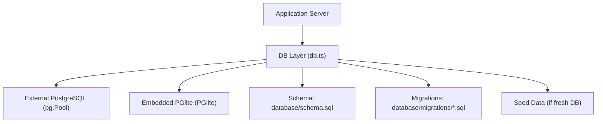
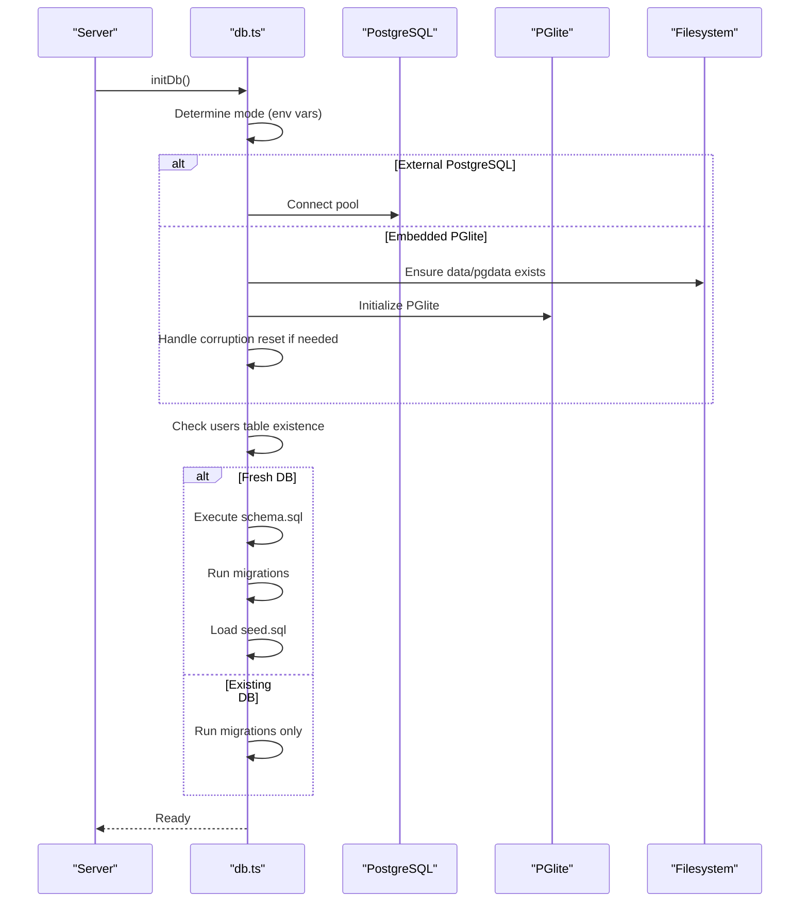
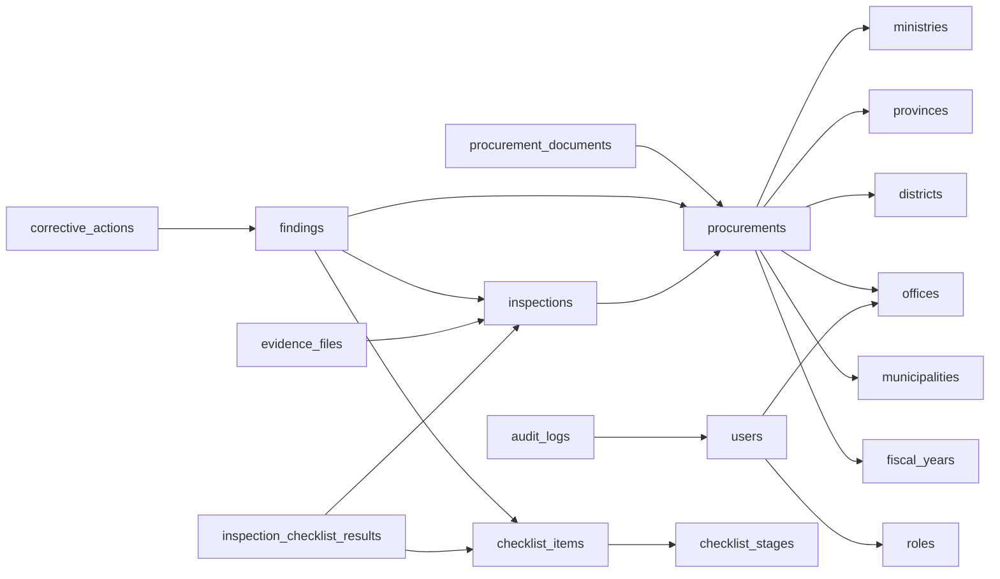

# Database Schema

<cite>
**Referenced Files in This Document**
- [schema.sql](file://database/schema.sql)
- [db.ts](file://server/db.ts)
- [002_full_checklist_34_stages.sql](file://database/migrations/002_full_checklist_34_stages.sql)
- [003_legacy_ref_text_alignment.sql](file://database/migrations/003_legacy_ref_text_alignment.sql)
- [auth.ts](file://server/routes/auth.ts)
- [procurements.ts](file://server/routes/procurements.ts)
- [inspections.ts](file://server/routes/inspections.ts)
- [audit.ts](file://server/utils/audit.ts)
</cite>

## Table of Contents
1. Introduction
2. Project Structure
3. Core Components
4. Architecture Overview
5. Detailed Component Analysis
6. Dependency Analysis
7. Performance Considerations
8. Troubleshooting Guide
9. Conclusion
10. Appendices

## Introduction
This document provides comprehensive database schema documentation for the NVC Procurement Monitoring & Inspection System. It details all core tables, relationships, keys, indexes, constraints, data types, and business rules enforced at the database level. It also explains the dual-database architecture (external PostgreSQL vs embedded PGlite), migration strategy, backup considerations, performance optimization techniques, and security/access control mechanisms relevant to data handling.

## Project Structure
The database layer is defined by a single schema file and augmented by migrations. The application initializes the database on startup, applies schema and migrations, and optionally seeds demo data.

**Diagram sources**
- [db.ts:10-97](file://server/db.ts#L10-L97)
- [db.ts:104-149](file://server/db.ts#L104-L149)
- [schema.sql:1-283](file://database/schema.sql#L1-L283)

**Section sources**
- [db.ts:10-97](file://server/db.ts#L10-L97)
- [db.ts:104-149](file://server/db.ts#L104-L149)
- [schema.sql:1-283](file://database/schema.sql#L1-L283)

## Core Components
The system models procurement lifecycle and inspection workflows with the following primary entities:

- roles: Role definitions referenced by users.
- provinces, districts, municipalities: Geographic hierarchy.
- ministries, offices: Organizational units.
- fiscal_years: Fiscal year master data.
- users: System users with role and office associations.
- procurements: Public procurement records linked to offices, ministries, geography, and fiscal years.
- checklist_stages, checklist_items: Master inspection checklist structure.
- inspections: Inspections tied to procurements with status tracking and verification.
- inspection_checklist_results: Per-inspection results per checklist item.
- evidence_files: Evidence attachments linked to inspections and checklist items.
- findings: Findings derived from inspections/checklist results.
- corrective_actions: Actions linked to findings and inspections.
- procurement_documents: File completeness checklist per procurement.
- audit_logs: Immutable audit trail for user actions.

Key relationships and constraints are enforced via foreign keys and unique constraints. Business rules such as one result per inspection per checklist item are enforced via unique constraints. Status fields use domain-specific values to guide workflow.

**Section sources**
- [schema.sql:8-283](file://database/schema.sql#L8-L283)

## Architecture Overview
The database supports two deployment modes:

- External PostgreSQL: Uses pg.Pool configured via environment variables (DATABASE_URL or PGHOST/PGUSER/PGPASSWORD/PGDATABASE/PGPORT).
- Embedded PGlite: Persistent file-based PostgreSQL stored under data/pgdata; auto-recovery if corrupted.

On startup, the system:
- Detects mode based on environment.
- Ensures directories exist.
- Creates schema if no users table exists.
- Runs migrations idempotently using schema_migrations.
- Seeds demo data on first run.

**Diagram sources**
- [db.ts:10-97](file://server/db.ts#L10-L97)
- [db.ts:104-149](file://server/db.ts#L104-L149)
- [schema.sql:1-283](file://database/schema.sql#L1-L283)

**Section sources**
- [db.ts:10-97](file://server/db.ts#L10-L97)
- [db.ts:104-149](file://server/db.ts#L104-L149)

## Detailed Component Analysis

### Users and Roles
- users: Stores authentication and profile data. Passwords are hashed before storage. Role references roles.name. Office association via offices.id.
- roles: Defines role names and display names used by users.

Business rules:
- Unique username and email.
- Active/inactive flag controls login eligibility.
- Role must exist in roles table.

Access control:
- Login queries enforce is_active = TRUE.
- Admin-only routes require role checks in middleware.

**Section sources**
- [schema.sql:8-14](file://database/schema.sql#L8-L14)
- [schema.sql:67-81](file://database/schema.sql#L67-L81)
- [auth.ts:18-37](file://server/routes/auth.ts#L18-L37)
- [auth.ts:107-121](file://server/routes/auth.ts#L107-L121)

### Geographic and Organizational Hierarchy
- provinces, districts, municipalities: Hierarchical geographic entities with bilingual names.
- ministries, offices: Organizational entities with optional links to geography.

Constraints:
- Cascading restrictions ensure referential integrity (e.g., district references province, municipality references district).
- Offices can be detached from ministry/province/district gracefully via SET NULL where appropriate.

**Section sources**
- [schema.sql:16-58](file://database/schema.sql#L16-L58)

### Fiscal Years
- fiscal_years: Tracks fiscal periods with current flag.

Usage:
- procurements link to fiscal years for reporting and filtering.

**Section sources**
- [schema.sql:60-65](file://database/schema.sql#L60-L65)

### Procurements
- procurements: Central entity capturing procurement metadata, contract details, and inspection scheduling.
- Links to offices, ministries, provinces, districts, municipalities, fiscal_years, and creator user.

Business rules:
- Unique procurement_id_code ensures traceability.
- Numeric fields for costs use NUMERIC(15,2).
- Status field uses localized values indicating lifecycle stage.

Indexes:
- Optimized lookup by office_id and current_status.

**Section sources**
- [schema.sql:83-114](file://database/schema.sql#L83-L114)
- [schema.sql:272-275](file://database/schema.sql#L272-L275)
- [procurements.ts:24-108](file://server/routes/procurements.ts#L24-L108)

### Checklist Stages and Items
- checklist_stages: Ordered stages of inspection process.
- checklist_items: Master checklist questions mapped to stages with legal references, risk defaults, and applicability filters.

Constraints:
- Unique checklist_code.
- Stage linkage enforces ordering and grouping.

Migrations:
- Migrations update legacy text and align historical data to new stage/item structures.

**Section sources**
- [schema.sql:116-143](file://database/schema.sql#L116-L143)
- [003_legacy_ref_text_alignment.sql:12-41](file://database/migrations/003_legacy_ref_text_alignment.sql#L12-L41)

### Inspections
- inspections: Tied to procurements, track inspection dates, status, team, summary notes, risk score, completion percentage, and verification metadata.

Workflow rules:
- Status transitions include Draft, In Progress, Submitted, Under Review, Returned for Correction, Verified, Closed.
- Only authorized roles can set Verified/Closed.

Indexes:
- Optimized by procurement_id and status.

**Section sources**
- [schema.sql:145-162](file://database/schema.sql#L145-L162)
- [schema.sql:275-276](file://database/schema.sql#L275-L276)
- [inspections.ts:200-255](file://server/routes/inspections.ts#L200-L255)

### Inspection Checklist Results
- inspection_checklist_results: Records compliance status, risk level, evidence reference, observation, financial impact, and inspector comments per checklist item per inspection.

Constraints:
- Unique constraint on (inspection_id, checklist_item_id) prevents duplicate results.

Indexes:
- Optimized by inspection_id.

**Section sources**
- [schema.sql:164-180](file://database/schema.sql#L164-L180)
- [schema.sql:278](file://database/schema.sql#L278)
- [inspections.ts:309-406](file://server/routes/inspections.ts#L309-L406)

### Evidence Files
- evidence_files: Stores metadata about uploaded files associated with inspections and optionally checklist items.

Fields:
- File name, stored name, path, size, type, document number/date, page, description, uploader.

Relationships:
- Linked to inspections (cascade delete) and optionally to checklist items.

**Section sources**
- [schema.sql:182-198](file://database/schema.sql#L182-L198)

### Findings
- findings: Captures issues identified during inspections with title, description, legal references, evidence summary, risk level, financial impact, responsible parties, recommended actions, deadlines, status, and remarks.

Relationships:
- Linked to inspections, procurements, checklist items, and optionally checklist results.

Indexes:
- Optimized by inspection_id and risk_level.

**Section sources**
- [schema.sql:200-224](file://database/schema.sql#L200-L224)
- [schema.sql:279-280](file://database/schema.sql#L279-L280)

### Corrective Actions
- corrective_actions: Documents corrective measures linked to findings and inspections, including progress notes, deadlines, completion date, status, verification status, remarks, and verifier details.

Relationships:
- Cascade deletes from findings and inspections.

Indexes:
- Optimized by finding_id.

**Section sources**
- [schema.sql:226-244](file://database/schema.sql#L226-L244)
- [schema.sql:281](file://database/schema.sql#L281)

### Procurement Documents Checklist
- procurement_documents: Tracks availability and status of required documents per procurement.

Fields:
- Document title, type, status, file path, remarks, updated timestamp.

Relationships:
- Linked to procurements with cascade delete.

**Section sources**
- [schema.sql:246-256](file://database/schema.sql#L246-L256)

### Audit Logs
- audit_logs: Immutable log of user actions with JSONB old/new values and IP address.

Usage:
- All critical operations (login, user CRUD, procurement/inspection updates) call audit logging utility.

Indexes:
- Optimized by user_id.

**Section sources**
- [schema.sql:258-270](file://database/schema.sql#L258-L270)
- [schema.sql:282](file://database/schema.sql#L282)
- [audit.ts:1-32](file://server/utils/audit.ts#L1-L32)
- [auth.ts:49-58](file://server/routes/auth.ts#L49-L58)
- [procurements.ts:310-319](file://server/routes/procurements.ts#L310-L319)
- [inspections.ts:181-190](file://server/routes/inspections.ts#L181-L190)

### Entity Relationship Diagram

```mermaid
erDiagram
ROLES {
int id PK
varchar name UK
varchar display_name
text description
timestamptz created_at
}
PROVINCES {
int id PK
varchar name_en
varchar name_ne
}
DISTRICTS {
int id PK
int province_id FK
varchar name_en
varchar name_ne
}
MUNICIPALITIES {
int id PK
int district_id FK
varchar name_en
varchar name_ne
varchar type
}
MINISTRIES {
int id PK
varchar name_en
varchar name_ne
}
OFFICES {
int id PK
int ministry_id FK
int province_id FK
int district_id FK
varchar name
varchar code UK
varchar address
boolean is_active
timestamptz created_at
}
FISCAL_YEARS {
int id PK
varchar name UK
boolean is_current
}
USERS {
int id PK
varchar username UK
varchar password_hash
varchar full_name
varchar email UK
varchar role FK
int office_id FK
varchar phone
varchar designation
boolean is_active
timestamptz created_at
timestamptz updated_at
}
PROCUREMENTS {
int id PK
varchar procurement_id_code UK
varchar procurement_number
int office_id FK
int ministry_id FK
int province_id FK
int district_id FK
int municipality_id FK
varchar ward
varchar title
varchar procurement_type
varchar procurement_method
int fiscal_year_id FK
varchar budget_source
numeric estimated_cost
numeric contract_amount
varchar contract_number
date contract_date
varchar contractor_name
date contract_start_date
date contract_completion_date
varchar current_status
date inspection_date
text inspection_team
varchar lead_inspector
text remarks
int created_by FK
timestamptz created_at
timestamptz updated_at
}
CHECKLIST_STAGES {
int id PK
int stage_number UK
varchar title_ne
varchar title_en
text description
int sort_order
}
CHECKLIST_ITEMS {
int id PK
varchar checklist_code UK
int stage_id FK
int stage_number
varchar inspection_area
varchar legal_reference
text required_documents
text inspection_question
text possible_irregularity
varchar default_risk_level
text applicable_procurement_methods
int sort_order
boolean is_active
timestamptz created_at
timestamptz updated_at
}
INSPECTIONS {
int id PK
varchar inspection_code UK
int procurement_id FK
date inspection_date
varchar status
int lead_inspector_id FK
text inspection_team
text summary_notes
numeric risk_score
numeric completion_percentage
int verified_by FK
timestamptz verified_at
int created_by FK
timestamptz created_at
timestamptz updated_at
}
INSPECTION_CHECKLIST_RESULTS {
int id PK
int inspection_id FK
int checklist_item_id FK
varchar compliance_status
varchar risk_level
text evidence_reference
text observation
numeric financial_impact
text inspector_comment
int completed_by FK
timestamptz completed_at
timestamptz created_at
timestamptz updated_at
}
EVIDENCE_FILES {
int id PK
int inspection_id FK
int checklist_item_id FK
varchar file_name
varchar stored_file_name
varchar file_path
bigint file_size
varchar file_type
varchar document_number
date document_date
varchar page_number
text description
int uploaded_by FK
timestamptz created_at
}
FINDINGS {
int id PK
varchar finding_code UK
int inspection_id FK
int procurement_id FK
int checklist_item_id FK
int checklist_result_id FK
varchar title
text description
varchar legal_reference
text evidence_summary
text possible_irregularity
varchar risk_level
numeric estimated_financial_impact
varchar responsible_office
varchar responsible_officer
text recommended_corrective_action
date deadline
varchar status
text inspector_remarks
int created_by FK
timestamptz created_at
timestamptz updated_at
}
CORRECTIVE_ACTIONS {
int id PK
int finding_id FK
int inspection_id FK
text corrective_action_text
varchar responsible_office
varchar responsible_officer
date deadline
text progress_notes
date completion_date
varchar status
varchar verification_status
text verification_remarks
varchar verification_officer
timestamptz verified_at
timestamptz created_at
timestamptz updated_at
}
PROCUREMENT_DOCUMENTS {
int id PK
int procurement_id FK
varchar document_title
varchar document_type
varchar status
varchar file_path
text remarks
timestamptz updated_at
}
AUDIT_LOGS {
int id PK
int user_id FK
varchar username
varchar action
varchar entity_type
varchar entity_id
jsonb old_values
jsonb new_values
varchar ip_address
timestamptz created_at
}
USERS ||--o{ PROCUREMENTS : "created_by"
OFFICES ||--o{ PROCUREMENTS : "office_id"
MINISTRIES ||--o{ PROCUREMENTS : "ministry_id"
PROVINCES ||--o{ PROCUREMENTS : "province_id"
DISTRICTS ||--o{ PROCUREMENTS : "district_id"
MUNICIPALITIES ||--o{ PROCUREMENTS : "municipality_id"
FISCAL_YEARS ||--o{ PROCUREMENTS : "fiscal_year_id"
ROLES ||--o{ USERS : "role"
OFFICES ||--o{ USERS : "office_id"
PROCUREMENTS ||--o{ INSPECTIONS : "procurement_id"
CHECKLIST_STAGES ||--o{ CHECKLIST_ITEMS : "stage_id"
INSPECTIONS ||--o{ INSPECTION_CHECKLIST_RESULTS : "inspection_id"
CHECKLIST_ITEMS ||--o{ INSPECTION_CHECKLIST_RESULTS : "checklist_item_id"
INSPECTIONS ||--o{ EVIDENCE_FILES : "inspection_id"
CHECKLIST_ITEMS ||--o{ EVIDENCE_FILES : "checklist_item_id"
INSPECTIONS ||--o{ FINDINGS : "inspection_id"
PROCUREMENTS ||--o{ FINDINGS : "procurement_id"
CHECKLIST_ITEMS ||--o{ FINDINGS : "checklist_item_id"
INSPECTION_CHECKLIST_RESULTS ||--o{ FINDINGS : "checklist_result_id"
FINDINGS ||--o{ CORRECTIVE_ACTIONS : "finding_id"
INSPECTIONS ||--o{ CORRECTIVE_ACTIONS : "inspection_id"
PROCUREMENTS ||--o{ PROCUREMENT_DOCUMENTS : "procurement_id"
USERS ||--o{ AUDIT_LOGS : "user_id"
```

**Diagram sources**
- [schema.sql:8-283](file://database/schema.sql#L8-L283)

## Dependency Analysis
- Referential integrity:
  - Many-to-one relationships between procurements, inspections, findings, corrective_actions, and master entities (offices, ministries, geography, fiscal years).
  - Unique constraints prevent duplicates (e.g., procurement_id_code, inspection_code, finding_code, checklist_code, usernames, emails).
  - Unique composite constraint on inspection_checklist_results ensures one result per inspection per checklist item.
- Indexes:
  - High-frequency query paths are indexed (e.g., procurements.office_id, procurements.current_status, inspections.procurement_id, inspections.status, checklist_items.stage_id, inspection_checklist_results.inspection_id, findings.inspection_id, findings.risk_level, corrective_actions.finding_id, audit_logs.user_id).

**Diagram sources**
- [schema.sql:8-283](file://database/schema.sql#L8-L283)

**Section sources**
- [schema.sql:272-283](file://database/schema.sql#L272-L283)

## Performance Considerations
- Index usage:
  - Queries filter heavily on office_id, current_status, procurement_id, status, stage_id, inspection_id, risk_level, and user_id; existing indexes support these patterns.
- Query design:
  - Use parameterized queries to avoid injection and enable plan caching.
  - Prefer joins over subqueries where possible; lateral joins are used judiciously for latest inspection per procurement.
- Storage:
  - JSONB fields in audit_logs provide flexible change tracking but should be queried selectively to avoid overhead.
- PGlite specifics:
  - Embedded PGlite stores data under data/pgdata; ensure adequate disk space and periodic backups.
  - On corruption, the system resets the embedded database automatically; this is not suitable for production without external persistence strategies.

[No sources needed since this section provides general guidance]

## Troubleshooting Guide
- Initialization failures:
  - If PGlite data is invalid or corrupted, the system resets the embedded database directory and reinitializes. Verify filesystem permissions and available disk space.
- Migration errors:
  - Migrations are tracked in schema_migrations; repeated runs skip already applied migrations. Check logs for specific SQL errors and rollback if necessary.
- Authentication issues:
  - Ensure users.is_active = TRUE for login. Validate that roles exist and passwords are properly hashed.
- Audit logging:
  - Audit inserts are wrapped in try/catch; failures do not block main flows but may indicate database connectivity issues.

**Section sources**
- [db.ts:38-47](file://server/db.ts#L38-L47)
- [db.ts:104-149](file://server/db.ts#L104-L149)
- [auth.ts:18-37](file://server/routes/auth.ts#L18-L37)
- [audit.ts:13-30](file://server/utils/audit.ts#L13-L30)

## Conclusion
The NVC Procurement Monitoring & Inspection System employs a robust PostgreSQL schema with clear entity relationships, strong constraints, and targeted indexes to support complex procurement and inspection workflows. The dual-database architecture enables local development with PGlite and production deployments with external PostgreSQL. Migrations ensure schema evolution while preserving data integrity. Security is enforced through role-based access and hashed credentials, complemented by comprehensive audit logging.

[No sources needed since this section summarizes without analyzing specific files]

## Appendices

### Dual Database Support and Environment Configuration
- External PostgreSQL:
  - Configure DATABASE_URL or PGHOST/PGUSER/PGPASSWORD/PGDATABASE/PGPORT.
  - Connection pooling via pg.Pool.
- Embedded PGlite:
  - Persistent storage under data/pgdata.
  - Automatic recovery/reset on corruption.

**Section sources**
- [db.ts:18-48](file://server/db.ts#L18-L48)

### Migration Strategy
- Idempotent migrations tracked in schema_migrations.
- Sequential execution based on filename sorting.
- Legacy text alignment migration updates historical references to match new checklist structure.

**Section sources**
- [db.ts:104-149](file://server/db.ts#L104-L149)
- [003_legacy_ref_text_alignment.sql:12-41](file://database/migrations/003_legacy_ref_text_alignment.sql#L12-L41)

### Backup Procedures
- External PostgreSQL:
  - Use native tools (e.g., pg_dump) to schedule regular backups.
  - Back up WAL archives for point-in-time recovery.
- Embedded PGlite:
  - Back up the entire data/pgdata directory regularly.
  - Ensure consistent snapshots to avoid partial writes.

[No sources needed since this section provides general guidance]

### Data Security and Access Control
- Authentication:
  - Passwords hashed before storage; login validates active users.
- Authorization:
  - Middleware enforces role-based access for sensitive endpoints.
- Auditability:
  - All critical actions logged with JSONB diffs and IP addresses.

**Section sources**
- [auth.ts:18-37](file://server/routes/auth.ts#L18-L37)
- [auth.ts:107-121](file://server/routes/auth.ts#L107-L121)
- [audit.ts:1-32](file://server/utils/audit.ts#L1-L32)