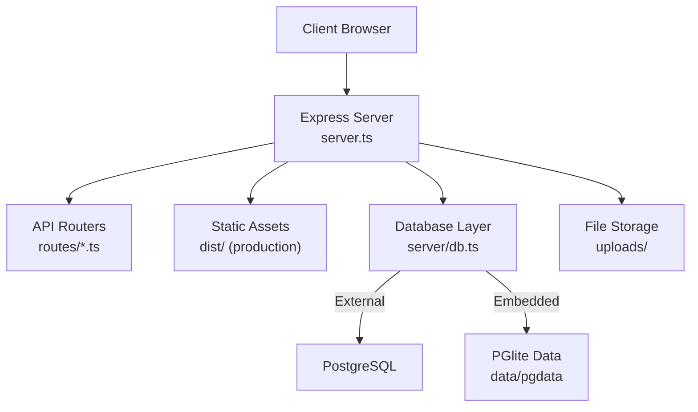
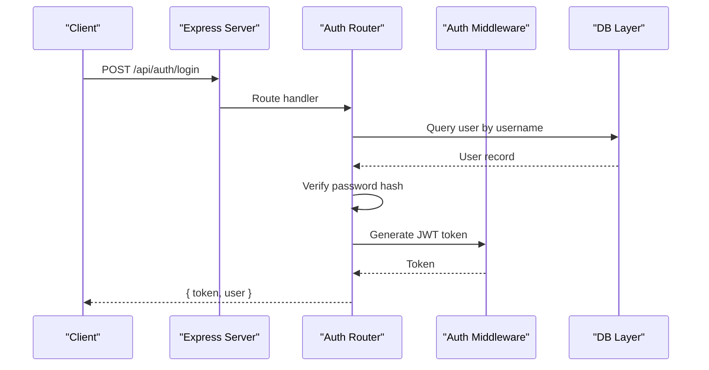
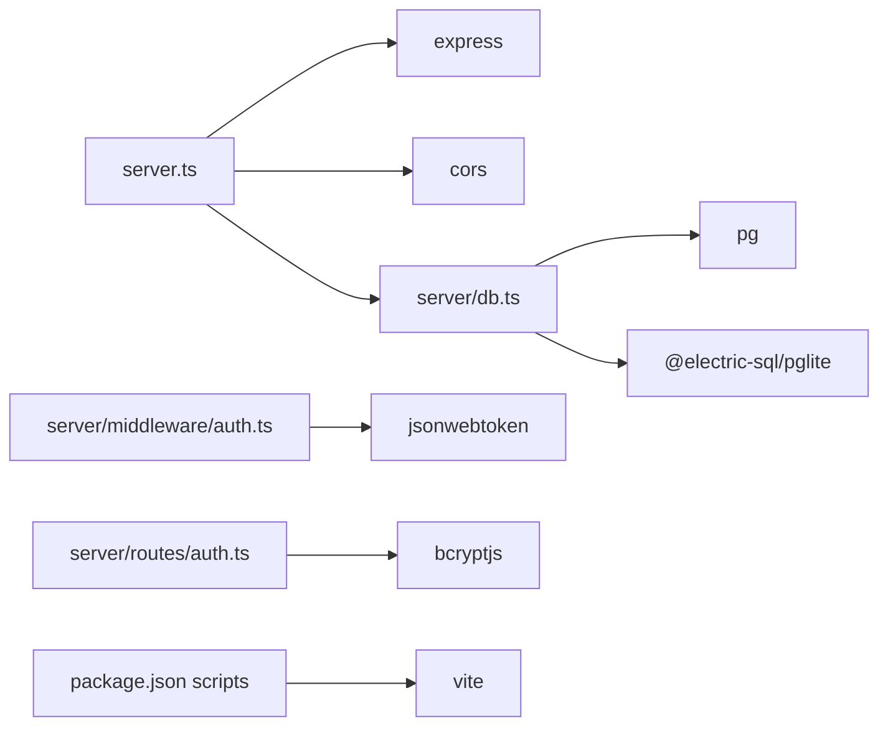

# Deployment Guide

<cite>
**Referenced Files in This Document**
- [server.ts](file://server.ts)
- [vite.config.ts](file://vite.config.ts)
- [package.json](file://package.json)
- [server/db.ts](file://server/db.ts)
- [database/schema.sql](file://database/schema.sql)
- [server/middleware/auth.ts](file://server/middleware/auth.ts)
- [server/routes/auth.ts](file://server/routes/auth.ts)
- [.gitignore](file:.gitignore)
</cite>

## Table of Contents
1. [Introduction](#introduction)
2. [Project Structure](#project-structure)
3. [Core Components](#core-components)
4. [Architecture Overview](#architecture-overview)
5. [Detailed Component Analysis](#detailed-component-analysis)
6. [Dependency Analysis](#dependency-analysis)
7. [Performance Considerations](#performance-considerations)
8. [Troubleshooting Guide](#troubleshooting-guide)
9. [Conclusion](#conclusion)
10. [Appendices](#appendices)

## Introduction
This guide provides production deployment instructions for the NVC Procurement Monitoring & Inspection System. It covers containerization with Docker, cloud platform deployment options, and traditional server hosting. It also documents environment configuration (database connections, file uploads, security), build optimization, monitoring/logging, backup and recovery, disaster recovery planning, security hardening, SSL configuration, access control, troubleshooting, and performance tuning for high-traffic scenarios.

## Project Structure
The application is a Node.js/Express backend serving a React frontend built with Vite. The server initializes a database (external PostgreSQL or embedded PGlite), mounts API routes, serves static assets in production, and exposes a health endpoint.

**Diagram sources**
- [server.ts:23-86](file://server.ts#L23-L86)
- [server/db.ts:10-48](file://server/db.ts#L10-L48)

**Section sources**
- [server.ts:23-86](file://server.ts#L23-L86)
- [package.json:6-12](file://package.json#L6-L12)
- [vite.config.ts:6-22](file://vite.config.ts#L6-L22)

## Core Components
- Express server entrypoint: initializes middleware, database, routes, static assets, and health check.
- Database layer: supports external PostgreSQL via connection string or environment variables; falls back to embedded persistent PGlite with schema migrations and seed data.
- Authentication middleware: JWT-based authentication and role-based authorization.
- File uploads: local directory served statically under /uploads.
- Build tooling: Vite builds the frontend; production mode serves compiled assets from dist/.

Key runtime behaviors:
- Environment-driven database selection using DATABASE_URL or PGHOST/PGDATABASE.
- Automatic creation of required directories (data/, uploads/).
- Health endpoint at /api/health.
- Production vs development asset handling based on NODE_ENV.

**Section sources**
- [server.ts:23-86](file://server.ts#L23-L86)
- [server/db.ts:10-48](file://server/db.ts#L10-L48)
- [server/middleware/auth.ts:20-86](file://server/middleware/auth.ts#L20-L86)
- [server/routes/auth.ts:10-80](file://server/routes/auth.ts#L10-L80)

## Architecture Overview
The system follows a layered architecture:
- Frontend: React app built by Vite, served as static files in production.
- Backend: Express server with modular routers for domain features.
- Persistence: PostgreSQL (recommended for production) or embedded PGlite for development/local runs.
- Storage: Local filesystem for uploaded evidence and documents.

**Diagram sources**
- [server/routes/auth.ts:10-80](file://server/routes/auth.ts#L10-L80)
- [server/middleware/auth.ts:20-34](file://server/middleware/auth.ts#L20-L34)
- [server/db.ts:151-169](file://server/db.ts#L151-L169)

## Detailed Component Analysis

### Database Configuration and Migration Strategy
- External PostgreSQL:
  - Use DATABASE_URL or set PGHOST, PGUSER, PGPASSWORD, PGDATABASE, PGPORT.
  - Connection pool is created when any of these are present.
- Embedded PGlite:
  - Used when no external DB env vars are set.
  - Persists data under data/pgdata.
  - Automatically creates and resets corrupted data directories.
- Schema and migrations:
  - On first run, executes database/schema.sql to create tables and indexes.
  - Applies incremental SQL migrations from database/migrations/*.sql idempotently using a schema_migrations table.
  - Seeds demo data if no users exist.

Operational notes:
- Ensure schema.sql and migrations are applied before accepting traffic.
- For high availability, use an external managed PostgreSQL service.

**Section sources**
- [server/db.ts:10-48](file://server/db.ts#L10-L48)
- [server/db.ts:50-97](file://server/db.ts#L50-L97)
- [server/db.ts:104-149](file://server/db.ts#L104-L149)
- [database/schema.sql:1-283](file://database/schema.sql#L1-L283)

### Authentication and Access Control
- JWT-based tokens with configurable secret via JWT_SECRET.
- Bearer token validation in middleware; optional query token fallback exists but should be disabled in production.
- Role-based authorization via requireRole middleware.
- Password hashing with bcryptjs during login and user management.

Production recommendations:
- Set a strong JWT_SECRET via environment variables.
- Remove or disable query-token fallback to prevent accidental bypass.
- Enforce HTTPS and secure cookie policies if switching to cookie-based auth later.

**Section sources**
- [server/middleware/auth.ts:4-86](file://server/middleware/auth.ts#L4-L86)
- [server/routes/auth.ts:10-80](file://server/routes/auth.ts#L10-L80)

### File Uploads and Storage
- Uploads are stored in a local uploads/ directory and served statically at /uploads.
- In production, mount a persistent volume to retain files across deployments.
- For scalability, consider offloading to object storage (e.g., S3-compatible) and updating upload handlers accordingly.

**Section sources**
- [server.ts:37-42](file://server.ts#L37-L42)

### Build Process and Asset Bundling
- Development:
  - vite dev with HMR enabled unless DISABLE_HMR=true.
- Production:
  - npm run build generates optimized assets in dist/.
  - Server serves dist/ statically and rewrites unknown routes to index.html for SPA routing.
- Tailwind CSS plugin configured via Vite.

Optimization tips:
- Enable compression at the reverse proxy level (gzip/brotli).
- Cache immutable assets with long-lived cache headers.
- Minimize payload size by tree-shaking and code splitting (Vite default behavior).

**Section sources**
- [package.json:6-12](file://package.json#L6-L12)
- [vite.config.ts:6-22](file://vite.config.ts#L6-L22)
- [server.ts:67-82](file://server.ts#L67-L82)

### API Surface and Health Check
- Health endpoint: GET /api/health returns status, system name, version, timestamp.
- API routes mounted under /api/* for auth, master data, procurements, checklists, inspections, findings, corrective actions, evidence, dashboard, reports, audit logs.

Use this endpoint for liveness probes and load balancer health checks.

**Section sources**
- [server.ts:44-65](file://server.ts#L44-L65)

## Dependency Analysis
Runtime dependencies relevant to deployment:
- Express server and middleware (cors, json parsing).
- PostgreSQL client (pg) for external DB.
- Embedded PGlite for local/embedded DB.
- JWT and bcrypt for authentication and password hashing.
- Vite for building the frontend.

**Diagram sources**
- [server.ts:1-18](file://server.ts#L1-L18)
- [server/db.ts:1-4](file://server/db.ts#L1-L4)
- [server/middleware/auth.ts:1-4](file://server/middleware/auth.ts#L1-L4)
- [server/routes/auth.ts:1-5](file://server/routes/auth.ts#L1-L5)
- [package.json:14-35](file://package.json#L14-L35)

**Section sources**
- [package.json:14-35](file://package.json#L14-L35)
- [server.ts:1-18](file://server.ts#L1-L18)
- [server/db.ts:1-4](file://server/db.ts#L1-L4)

## Performance Considerations
- Reverse Proxy:
  - Terminate TLS at the edge (nginx/Caddy/cloud LB).
  - Enable gzip/brotli compression and HTTP/2.
  - Configure upstream keepalive to the Node process.
- Node.js:
  - Run behind a process manager (systemd/pm2) with clustering if needed.
  - Tune event loop and memory limits according to workload.
- Database:
  - Use a managed PostgreSQL instance with appropriate sizing and connection pooling.
  - Leverage existing indexes defined in schema.sql for common queries.
- Static Assets:
  - Serve from CDN or cache-enabled reverse proxy.
  - Use long cache times for hashed assets.
- Request Limits:
  - Adjust JSON and URL-encoded body limits as needed for large payloads.

[No sources needed since this section provides general guidance]

## Troubleshooting Guide
Common issues and resolutions:
- Cannot connect to database:
  - Verify DATABASE_URL or PGHOST/PGUSER/PGPASSWORD/PGDATABASE/PGPORT are set correctly.
  - Ensure network ACLs allow outbound connections to the database host.
  - Check that schema.sql has been executed and migrations applied.
- Embedded PGlite data corruption:
  - The system auto-resets data/pgdata if invalid; ensure persistent storage is mounted to avoid data loss.
- Missing uploads directory:
  - The server creates uploads/ automatically; verify write permissions.
- Authentication failures:
  - Confirm JWT_SECRET is consistent across deployments.
  - Disable query-token fallback in production to avoid unintended bypass.
- Build errors:
  - Ensure dependencies installed and NODE_ENV=production for production builds.
  - Validate Vite config and Tailwind setup.

Health and diagnostics:
- Use GET /api/health to verify service readiness.
- Inspect server logs for startup messages and errors.

**Section sources**
- [server/db.ts:18-48](file://server/db.ts#L18-L48)
- [server.ts:37-42](file://server.ts#L37-L42)
- [server/middleware/auth.ts:40-57](file://server/middleware/auth.ts#L40-L57)
- [server.ts:57-65](file://server.ts#L57-L65)

## Conclusion
For production, deploy the Express server behind a reverse proxy with TLS termination, configure an external PostgreSQL instance, persist uploads and database data volumes, and enforce strict security settings including a strong JWT secret and disabling insecure token fallback. Optimize performance with caching, compression, and proper resource sizing. Implement monitoring, logging, backups, and disaster recovery procedures to ensure reliability and compliance.

[No sources needed since this section summarizes without analyzing specific files]

## Appendices

### A. Environment Variables Reference
- DATABASE_URL: Full connection string for external PostgreSQL.
- PGHOST, PGUSER, PGPASSWORD, PGDATABASE, PGPORT: Alternative to DATABASE_URL.
- JWT_SECRET: Strong secret for signing JWTs.
- NODE_ENV: Set to production for optimized builds and static asset serving.
- DISABLE_HMR: Optional flag to disable HMR during development.

Set these in your deployment environment (container env, platform secrets, or .env file excluded from version control).

**Section sources**
- [server/db.ts:18-32](file://server/db.ts#L18-L32)
- [server/middleware/auth.ts:4](file://server/middleware/auth.ts#L4)
- [server.ts:67-82](file://server.ts#L67-L82)
- [vite.config.ts:14-20](file://vite.config.ts#L14-L20)
- [.gitignore:6-8](file:.gitignore#L6-L8)

### B. Containerization with Docker
Recommended steps:
- Multi-stage build:
  - Stage 1: Install dependencies and build frontend (npm ci && npm run build).
  - Stage 2: Copy only production artifacts (dist/, server/, package.json) and install production dependencies.
- Expose port 3000 and set NODE_ENV=production.
- Mount persistent volumes for:
  - uploads/
  - data/pgdata (if using embedded PGlite)
- Provide environment variables for database and JWT secret.
- Add a healthcheck using /api/health.

[No sources needed since this section provides general guidance]

### C. Cloud Platform Deployment Options
- Platform-as-a-Service (PaaS):
  - Deploy the container image or source with buildpacks.
  - Configure environment variables and attach persistent storage for uploads and database data.
  - Use managed PostgreSQL and enable automated backups.
- Kubernetes:
  - Define Deployment, Service, ConfigMap/Secret, PersistentVolumeClaim for uploads and data/pgdata.
  - Use Ingress for TLS termination and path-based routing.
  - Configure liveness/readiness probes against /api/health.
- Serverless/Edge:
  - Not recommended due to stateful DB and file storage requirements.

[No sources needed since this section provides general guidance]

### D. Traditional Server Hosting
- Use systemd to manage the Node process.
- Place the application under /opt/nvc-procurement or similar.
- Configure a reverse proxy (nginx/Caddy) to:
  - Terminate TLS.
  - Forward requests to localhost:3000.
  - Serve static assets and handle caching.
- Schedule log rotation and monitor disk usage for uploads/ and data/pgdata.

[No sources needed since this section provides general guidance]

### E. Security Hardening and SSL Configuration
- TLS:
  - Terminate SSL at the reverse proxy or cloud load balancer.
  - Use modern cipher suites and enforce HTTPS-only.
- Secrets:
  - Store JWT_SECRET and database credentials in secure secret stores.
  - Avoid committing secrets to version control (.gitignore excludes .env*).
- Access Control:
  - Enforce JWT verification and remove query-token fallback in production.
  - Apply least privilege roles and restrict admin endpoints.
- Input Validation:
  - Keep request body size limits reasonable for your use case.
- Headers:
  - Set security headers (HSTS, CSP, X-Frame-Options) at the reverse proxy.

**Section sources**
- [.gitignore:6-8](file:.gitignore#L6-L8)
- [server/middleware/auth.ts:40-57](file://server/middleware/auth.ts#L40-L57)

### F. Monitoring and Logging
- Application Logs:
  - Capture stdout/stderr from the Node process.
  - Centralize logs with a logging pipeline (e.g., ELK, Loki).
- Metrics:
  - Expose metrics via a lightweight library if needed.
  - Monitor uptime via /api/health.
- Audit Logs:
  - The system records audit entries in the database for key actions.

[No sources needed since this section provides general guidance]

### G. Backup and Recovery Procedures
- Database:
  - Use native PostgreSQL tools (pg_dump/pg_restore) or managed service snapshots.
  - Schedule regular backups and test restores.
- File Storage:
  - Back up uploads/ directory regularly.
  - If using object storage, enable versioning and lifecycle policies.
- Disaster Recovery:
  - Maintain runbooks for restoring DB and files.
  - Define RTO/RPO targets and validate periodically.

[No sources needed since this section provides general guidance]

### H. Build Optimization Checklist
- Use npm ci for deterministic installs in CI/CD.
- Set NODE_ENV=production during build.
- Enable compression at the reverse proxy.
- Cache node_modules and dist/ in CI caches.
- Minimize bundle size by removing unused dependencies.

**Section sources**
- [package.json:6-12](file://package.json#L6-L12)
- [vite.config.ts:6-22](file://vite.config.ts#L6-L22)

### I. High-Traffic Tuning
- Reverse Proxy:
  - Increase worker processes and tune timeouts.
  - Enable connection pooling to upstream.
- Node.js:
  - Run multiple instances behind a load balancer.
  - Adjust heap size and GC flags as needed.
- Database:
  - Scale read replicas for heavy reporting workloads.
  - Tune connection pool sizes and query plans.

[No sources needed since this section provides general guidance]