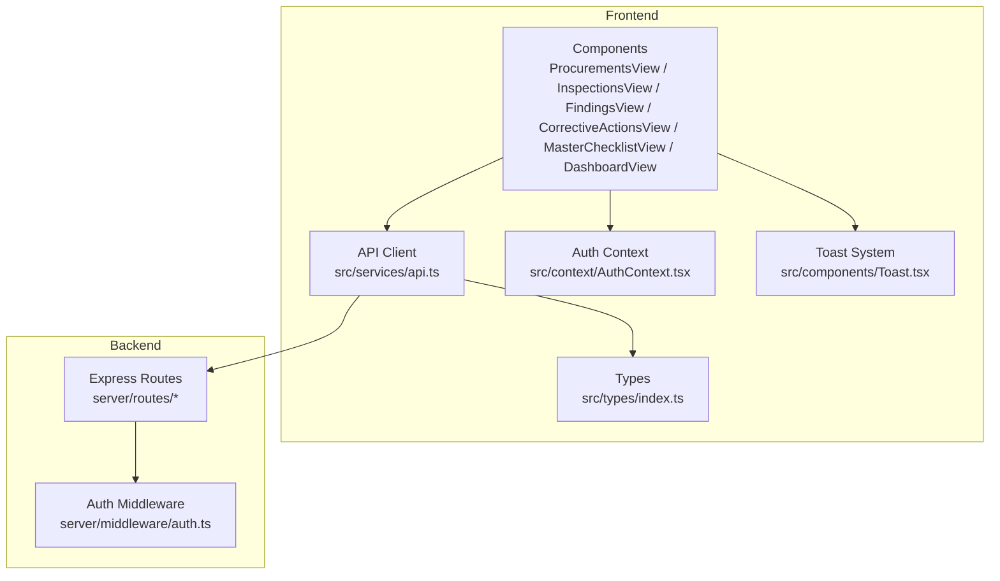
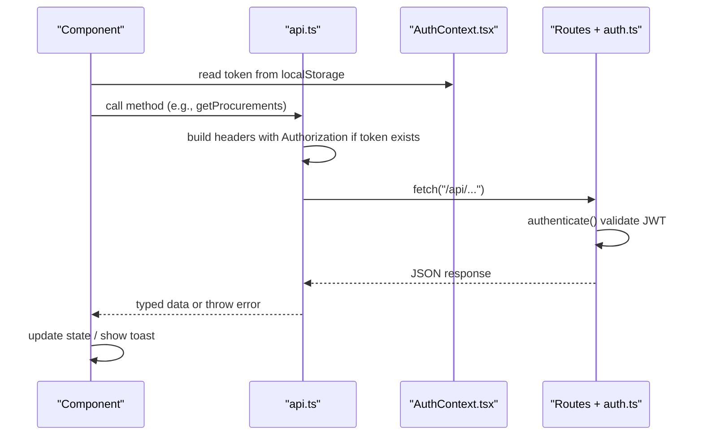
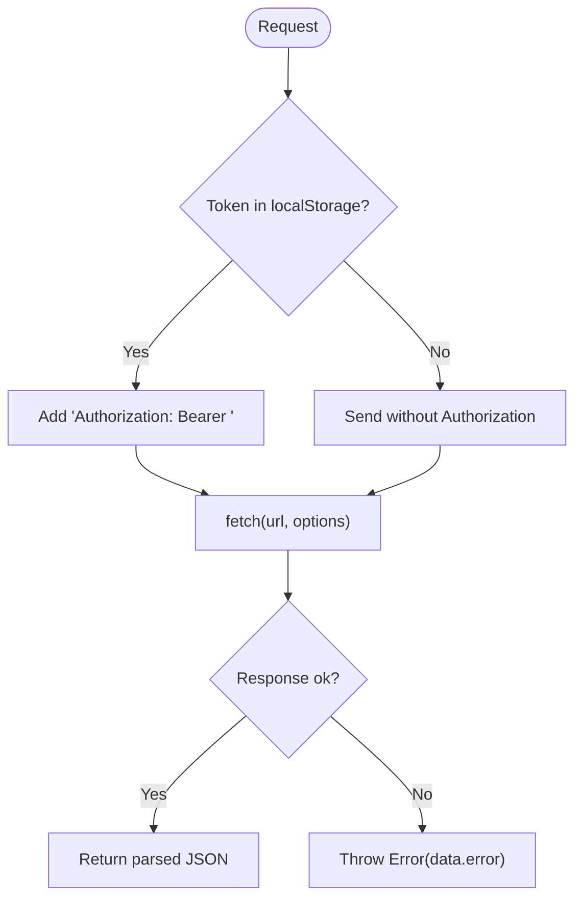
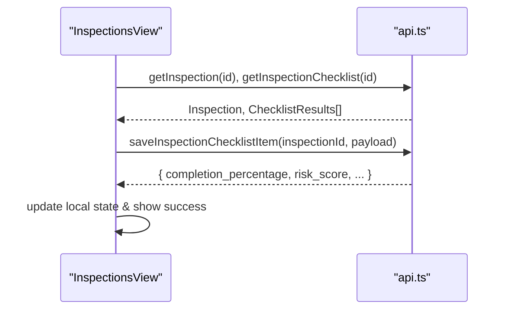
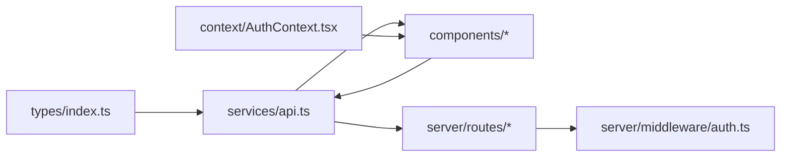

# API Service Layer

<cite>
**Referenced Files in This Document**
- [api.ts](file://src/services/api.ts)
- [index.ts](file://src/types/index.ts)
- [AuthContext.tsx](file://src/context/AuthContext.tsx)
- [auth.ts](file://server/middleware/auth.ts)
- [ProcurementsView.tsx](file://src/components/ProcurementsView.tsx)
- [InspectionsView.tsx](file://src/components/InspectionsView.tsx)
- [FindingsView.tsx](file://src/components/FindingsView.tsx)
- [CorrectiveActionsView.tsx](file://src/components/CorrectiveActionsView.tsx)
- [MasterChecklistView.tsx](file://src/components/MasterChecklistView.tsx)
- [DashboardView.tsx](file://src/components/DashboardView.tsx)
- [Toast.tsx](file://src/components/Toast.tsx)
</cite>

## Table of Contents
1. Introduction
2. Project Structure
3. Core Components
4. Architecture Overview
5. Detailed Component Analysis
6. Dependency Analysis
7. Performance Considerations
8. Troubleshooting Guide
9. Conclusion

## Introduction
This document explains the frontend API service layer for the NVC procurement application. It focuses on the centralized HTTP client, request/response handling, authentication token injection, TypeScript interfaces that ensure type safety, and how feature components interact with the API to perform CRUD operations across procurements, inspections, findings, corrective actions, evidence, master data, dashboard summaries, reports, and audit logs. It also covers error handling patterns, loading states, user feedback via toast notifications, and current performance characteristics.

## Project Structure
The API service layer is implemented as a single module that exports an api object containing typed methods for each backend resource. Components import this module to make network calls. Types are defined centrally and imported by both the service and UI components. Authentication state is managed in a React context and stored in localStorage; the service automatically attaches Bearer tokens when present.

**Diagram sources**
- [api.ts:1-440](file://src/services/api.ts#L1-L440)
- [index.ts:1-338](file://src/types/index.ts#L1-L338)
- [AuthContext.tsx:1-139](file://src/context/AuthContext.tsx#L1-L139)
- [auth.ts:1-87](file://server/middleware/auth.ts#L1-L87)

**Section sources**
- [api.ts:1-440](file://src/services/api.ts#L1-L440)
- [index.ts:1-338](file://src/types/index.ts#L1-L338)
- [AuthContext.tsx:1-139](file://src/context/AuthContext.tsx#L1-L139)
- [auth.ts:1-87](file://server/middleware/auth.ts#L1-L87)

## Core Components
- Centralized API client: Provides typed methods for all backend endpoints, including auth, master data, procurements, checklists, inspections, findings, corrective actions, evidence, dashboard summary, reports, and audit logs.
- Type system: Strongly-typed models for User, Procurement, Inspection, Finding, CorrectiveAction, EvidenceFile, AuditLog, DashboardSummary, and related entities.
- Authentication integration: Reads token from localStorage and injects Authorization header into requests requiring authentication.
- Error handling: Throws errors with server-provided messages on non-OK responses; components catch and display user-friendly feedback.
- Request building: Uses URLSearchParams for query parameters and JSON bodies for mutations.

Key responsibilities:
- Auth: login, getCurrentUser, getUsers, createUser
- Master data: stages, provinces, districts, municipalities, ministries, offices, fiscal years
- Procurements: list, get, create, update, document status updates
- Checklists (master): list, create, update
- Inspections: list, get, create, update, checklist results, save item
- Findings: list, get, create, update, delete
- Corrective actions: list, create, update, verify
- Evidence: list, upload, delete
- Dashboard: summary
- Reports: inspection report
- Audit logs: list with filters

**Section sources**
- [api.ts:21-439](file://src/services/api.ts#L21-L439)
- [index.ts:1-338](file://src/types/index.ts#L1-L338)

## Architecture Overview
The API client abstracts fetch calls behind domain-specific methods. Requests to protected endpoints include a Bearer token derived from localStorage. The backend validates tokens using JWT middleware and enforces roles where required. Components manage loading states and show toast notifications for success/error feedback.

**Diagram sources**
- [api.ts:23-32](file://src/services/api.ts#L23-L32)
- [api.ts:34-439](file://src/services/api.ts#L34-L439)
- [AuthContext.tsx:30-65](file://src/context/AuthContext.tsx#L30-L65)
- [auth.ts:36-58](file://server/middleware/auth.ts#L36-L58)

## Detailed Component Analysis

### Authentication and Token Injection
- Token storage: Stored in localStorage under a specific key after successful login.
- Header injection: A helper builds headers with Content-Type and optional Authorization Bearer token.
- Protected endpoints: Methods that mutate data or access sensitive info attach headers via the helper.
- Backend validation: Server middleware verifies JWT and sets user context; unauthorized or invalid tokens return 401 with localized error messages.

**Diagram sources**
- [api.ts:23-32](file://src/services/api.ts#L23-L32)
- [api.ts:36-439](file://src/services/api.ts#L36-L439)
- [auth.ts:36-58](file://server/middleware/auth.ts#L36-L58)

**Section sources**
- [api.ts:23-32](file://src/services/api.ts#L23-L32)
- [AuthContext.tsx:30-65](file://src/context/AuthContext.tsx#L30-L65)
- [auth.ts:36-58](file://server/middleware/auth.ts#L36-L58)

### Procurement Operations
- List with filters: Builds query string from filter object and returns array of Procurement.
- Detail retrieval: Returns a single Procurement or throws on error.
- Create/Update: Sends JSON payload and returns created/updated entity.
- Document status: Updates per-document status within a procurement.

Typical usage pattern in components:
- Load initial data with Promise.all for parallel fetching.
- Apply filters by passing a record to the list method.
- Update local state immediately for optimistic UX when possible.

**Section sources**
- [api.ts:131-180](file://src/services/api.ts#L131-L180)
- [ProcurementsView.tsx:48-98](file://src/components/ProcurementsView.tsx#L48-L98)

### Inspection Management
- List with filters: Supports filtering by various fields.
- Detail and checklist: Retrieves inspection and its checklist results; supports stage-based queries.
- Save checklist item: Saves compliance status, risk level, evidence reference, observation, financial impact, and inspector comment; returns updated metrics like completion percentage and risk score.
- Status transitions: Allows moving between workflow statuses (e.g., Draft -> Submitted -> Verified).

**Diagram sources**
- [api.ts:213-282](file://src/services/api.ts#L213-L282)
- [InspectionsView.tsx:85-180](file://src/components/InspectionsView.tsx#L85-L180)

**Section sources**
- [api.ts:213-282](file://src/services/api.ts#L213-L282)
- [InspectionsView.tsx:85-180](file://src/components/InspectionsView.tsx#L85-L180)

### Findings Tracking
- List with filters: Supports risk level, status, and search text.
- CRUD: Create, update, delete findings.
- Integration: Often linked to inspections and corrective actions.

Components demonstrate:
- Filtering and searching with debounced-like behavior via Enter key or explicit filter button.
- Local state updates after successful mutations.

**Section sources**
- [api.ts:285-333](file://src/services/api.ts#L285-L333)
- [FindingsView.tsx:46-98](file://src/components/FindingsView.tsx#L46-L98)

### Corrective Actions
- List with filters: Supports status and overdue-only views.
- Update progress: Changes status and adds progress notes; optionally sets completion date.
- Verification: Allows reviewers to verify or reject corrective actions with remarks.

**Section sources**
- [api.ts:336-380](file://src/services/api.ts#L336-L380)
- [CorrectiveActionsView.tsx:43-95](file://src/components/CorrectiveActionsView.tsx#L43-L95)

### Evidence Handling
- List by inspection and optional checklist item.
- Upload: Sends FormData with Authorization header; returns uploaded file metadata.
- Delete: Removes evidence by id.

Note: Upload uses FormData and must not set Content-Type manually so the browser sets multipart boundaries.

**Section sources**
- [api.ts:383-411](file://src/services/api.ts#L383-L411)

### Master Data and Checklists
- Stages, provinces, districts, municipalities, ministries, offices, fiscal years: Read-only endpoints with optional query parameters.
- Master checklist items: Retrieve by stage number; create/update for admin purposes.

**Section sources**
- [api.ts:77-128](file://src/services/api.ts#L77-L128)
- [api.ts:183-210](file://src/services/api.ts#L183-L210)
- [MasterChecklistView.tsx:41-60](file://src/components/MasterChecklistView.tsx#L41-L60)

### Dashboard Summary and Reports
- Dashboard summary: Aggregated KPIs, compliance breakdown, risk distribution, stages, provinces, alerts.
- Inspection report: Retrieves printable/reportable content for a given inspection.

**Section sources**
- [api.ts:414-425](file://src/services/api.ts#L414-L425)
- [DashboardView.tsx:55-69](file://src/components/DashboardView.tsx#L55-L69)

### Audit Logs
- List with filters: Action and entity_type parameters supported.

**Section sources**
- [api.ts:428-438](file://src/services/api.ts#L428-L438)

## Dependency Analysis
- api.ts depends on types/index.ts for all model definitions.
- Components depend on api.ts for data operations and on AuthContext.tsx for role-based permissions and token lifecycle.
- Backend routes rely on server/middleware/auth.ts for JWT verification and role enforcement.

**Diagram sources**
- [index.ts:1-338](file://src/types/index.ts#L1-L338)
- [api.ts:1-440](file://src/services/api.ts#L1-L440)
- [AuthContext.tsx:1-139](file://src/context/AuthContext.tsx#L1-L139)
- [auth.ts:1-87](file://server/middleware/auth.ts#L1-L87)

**Section sources**
- [index.ts:1-338](file://src/types/index.ts#L1-L338)
- [api.ts:1-440](file://src/services/api.ts#L1-L440)
- [AuthContext.tsx:1-139](file://src/context/AuthContext.tsx#L1-L139)
- [auth.ts:1-87](file://server/middleware/auth.ts#L1-L87)

## Performance Considerations
- Parallel requests: Components use Promise.all to fetch multiple resources concurrently (e.g., procurements, offices, fiscal years; inspections and stages).
- Query parameterization: Filtered lists construct URLSearchParams efficiently to minimize payloads.
- Optimistic updates: Some components update local state before awaiting server confirmation to improve perceived responsiveness, then revert on failure.
- Conditional headers: Authorization header is only added when a token exists, avoiding unnecessary overhead.
- File uploads: Use FormData to stream files without manual Content-Type overrides.

Current limitations:
- No built-in retry mechanism in the API client.
- No client-side caching layer; data is re-fetched on component mount or filter changes.
- No request deduplication or background refresh strategies.

Recommendations:
- Add exponential backoff retries for transient failures on critical mutations.
- Introduce lightweight caching (in-memory or IndexedDB) for static master data (stages, provinces, etc.).
- Implement request deduplication to avoid duplicate concurrent calls for the same resource.
- Consider pagination for large lists (procurements, findings, inspections) to reduce payload sizes.

[No sources needed since this section provides general guidance]

## Troubleshooting Guide
Common issues and patterns:
- Unauthorized access: If the token is missing or expired, the backend returns 401 with a localized error message. Components should handle these by prompting re-login or clearing session.
- Network errors: Catch blocks log errors and may show toast notifications. Ensure consistent error messaging and user feedback.
- Validation errors: Non-OK responses include an error field; the API client throws with that message. Components can surface it to users.
- File upload issues: Ensure FormData is used and Authorization header is set correctly for uploads.

Error handling patterns in components:
- Loading states: Set loading flags during async operations and clear them in finally blocks.
- Toast notifications: Use the shared Toast system for success/error/info/warning messages.
- State rollback: On failed mutations, revert local state to previous values to maintain consistency.

**Section sources**
- [api.ts:36-439](file://src/services/api.ts#L36-L439)
- [AuthContext.tsx:30-65](file://src/context/AuthContext.tsx#L30-L65)
- [auth.ts:36-58](file://server/middleware/auth.ts#L36-L58)
- [Toast.tsx:35-51](file://src/components/Toast.tsx#L35-L51)
- [InspectionsView.tsx:129-180](file://src/components/InspectionsView.tsx#L129-L180)

## Conclusion
The API service layer provides a clean, typed abstraction over backend endpoints, centralizing authentication, error handling, and request construction. Components interact with it through well-defined methods, enabling consistent data flows and user experiences. While effective today, adding retry logic, caching, and pagination would further improve resilience and scalability. The strong type definitions ensure alignment between frontend and backend contracts, reducing runtime errors and improving developer productivity.

[No sources needed since this section summarizes without analyzing specific files]