# Application Architecture

<cite>
**Referenced Files in This Document**
- [main.tsx](file://src/main.tsx)
- [App.tsx](file://src/App.tsx)
- [AuthContext.tsx](file://src/context/AuthContext.tsx)
- [Toast.tsx](file://src/components/Toast.tsx)
- [Header.tsx](file://src/components/Header.tsx)
- [Sidebar.tsx](file://src/components/Sidebar.tsx)
- [DashboardView.tsx](file://src/components/DashboardView.tsx)
- [api.ts](file://src/services/api.ts)
- [index.css](file://src/index.css)
- [vite.config.ts](file://vite.config.ts)
- [package.json](file://package.json)
</cite>

## Table of Contents
1. [Introduction](#introduction)
2. [Project Structure](#project-structure)
3. [Core Components](#core-components)
4. [Architecture Overview](#architecture-overview)
5. [Detailed Component Analysis](#detailed-component-analysis)
6. [Dependency Analysis](#dependency-analysis)
7. [Performance Considerations](#performance-considerations)
8. [Troubleshooting Guide](#troubleshooting-guide)
9. [Conclusion](#conclusion)

## Introduction
This document explains the React application architecture for the NVC Procurement Monitoring & Inspection System. It focuses on the component hierarchy rooted at App.tsx, the layout built with Header and Sidebar, routing via conditional rendering based on currentTab, global state management through AuthContext and ToastProvider, responsive design using Tailwind CSS, initialization flow, context provider setup, composition patterns, and performance considerations such as lazy loading strategies and state optimization techniques used across the app.

## Project Structure
The application is a Vite + React project with TypeScript. The entry point renders the root App inside StrictMode and applies global styles. Context providers wrap the application to provide authentication and toast notifications globally. The main layout composes a Header and Sidebar around a content area that conditionally renders feature views based on the active tab.

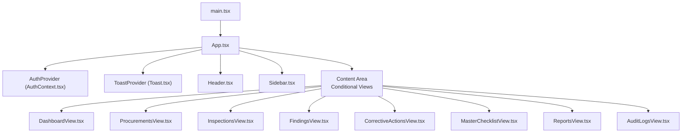

**Diagram sources**
- [main.tsx:6-9](file://src/main.tsx#L6-L9)
- [App.tsx:234-241](file://src/App.tsx#L234-L241)
- [AuthContext.tsx:30-129](file://src/context/AuthContext.tsx#L30-L129)
- [Toast.tsx:35-87](file://src/components/Toast.tsx#L35-L87)
- [Header.tsx:10-108](file://src/components/Header.tsx#L10-L108)
- [Sidebar.tsx:24-151](file://src/components/Sidebar.tsx#L24-L151)
- [DashboardView.tsx:28-84](file://src/components/DashboardView.tsx#L28-L84)

**Section sources**
- [main.tsx:1-11](file://src/main.tsx#L1-L11)
- [App.tsx:1-243](file://src/App.tsx#L1-L243)
- [package.json:1-49](file://package.json#L1-L49)
- [vite.config.ts:1-23](file://vite.config.ts#L1-L23)

## Core Components
- Root wrapper: App.tsx provides the top-level layout, manages navigation state, orchestrates modals, and wraps the app with global providers.
- Layout:
  - Header.tsx displays branding, role switcher, and user profile info.
  - Sidebar.tsx defines navigation items and highlights the active tab; it shows badge counts for key metrics.
- Content views: DashboardView and other feature views are rendered conditionally based on currentTab.
- Global state:
  - AuthContext.tsx manages authentication state, token persistence, and role-based capabilities.
  - Toast.tsx provides a global notification system via a provider and hook.

Key responsibilities:
- App.tsx coordinates UI state (currentTab, navParams, modal states), fetches badge counts, and composes the layout and modals.
- AuthContext handles login/logout, auto-login for demo mode, and exposes role flags for permissions.
- ToastProvider centralizes toast lifecycle and rendering.

**Section sources**
- [App.tsx:21-232](file://src/App.tsx#L21-L232)
- [Header.tsx:10-108](file://src/components/Header.tsx#L10-L108)
- [Sidebar.tsx:24-151](file://src/components/Sidebar.tsx#L24-L151)
- [AuthContext.tsx:30-129](file://src/context/AuthContext.tsx#L30-L129)
- [Toast.tsx:35-87](file://src/components/Toast.tsx#L35-L87)

## Architecture Overview
The application follows a provider-driven architecture:
- Entry point mounts React and renders App within StrictMode.
- App wraps MainApp with AuthProvider and ToastProvider to make auth and toast services available throughout the tree.
- MainApp controls navigation via currentTab and renders a consistent layout with Header and Sidebar.
- Conditional rendering selects the appropriate view component for each tab.
- API interactions are centralized in api.ts, which attaches tokens from localStorage for authenticated requests.

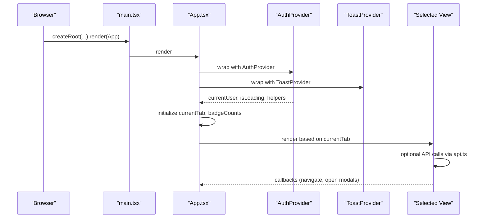

**Diagram sources**
- [main.tsx:6-9](file://src/main.tsx#L6-L9)
- [App.tsx:234-241](file://src/App.tsx#L234-L241)
- [AuthContext.tsx:30-129](file://src/context/AuthContext.tsx#L30-L129)
- [Toast.tsx:35-87](file://src/components/Toast.tsx#L35-L87)
- [DashboardView.tsx:55-69](file://src/components/DashboardView.tsx#L55-L69)

## Detailed Component Analysis

### Root and Layout Composition (App.tsx)
- Manages navigation state (currentTab) and passes it to Header and Sidebar.
- Uses conditional rendering to show one of multiple view components based on currentTab.
- Maintains modal states for creating procurements, findings, evidence uploads, and report printing.
- Loads badge counts from the dashboard summary endpoint and updates sidebar badges.
- Wraps the entire UI with AuthProvider and ToastProvider to enable global auth and notifications.

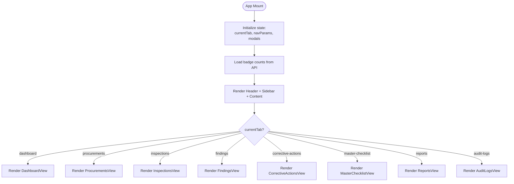

**Diagram sources**
- [App.tsx:21-232](file://src/App.tsx#L21-L232)

**Section sources**
- [App.tsx:21-232](file://src/App.tsx#L21-L232)

### Authentication Context (AuthContext.tsx)
- Persists token in localStorage and initializes user session on boot.
- Auto-logs in as a default inspector if no valid token exists, ensuring a smooth demo experience.
- Exposes login, logout, and role switching functions along with derived flags for permissions (e.g., canEditInspection, canVerify).
- Provides a safe useAuth hook that enforces usage within AuthProvider.

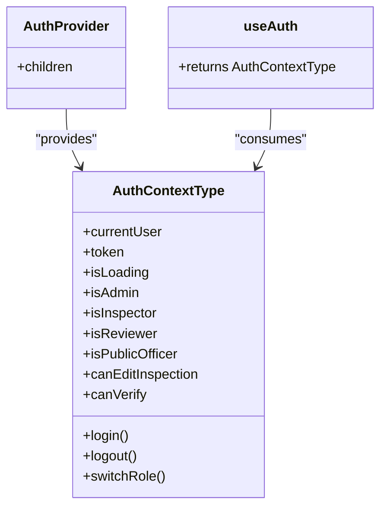

**Diagram sources**
- [AuthContext.tsx:5-18](file://src/context/AuthContext.tsx#L5-L18)
- [AuthContext.tsx:30-129](file://src/context/AuthContext.tsx#L30-L129)
- [AuthContext.tsx:132-138](file://src/context/AuthContext.tsx#L132-L138)

**Section sources**
- [AuthContext.tsx:30-129](file://src/context/AuthContext.tsx#L30-L129)
- [AuthContext.tsx:132-138](file://src/context/AuthContext.tsx#L132-L138)

### Toast Provider (Toast.tsx)
- Centralizes toast state and lifecycle.
- Limits concurrent toasts to a maximum count and auto-dismisses after a timeout.
- Renders accessible toast notifications with icons and close actions.
- Provides a useToast hook for any component to trigger notifications.

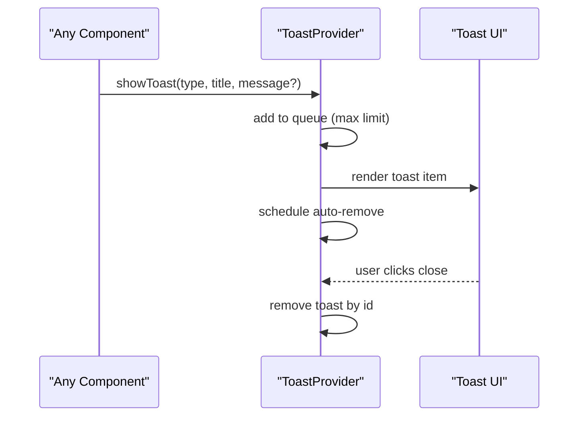

**Diagram sources**
- [Toast.tsx:35-87](file://src/components/Toast.tsx#L35-L87)

**Section sources**
- [Toast.tsx:35-87](file://src/components/Toast.tsx#L35-L87)

### Header and Sidebar
- Header displays branding, role switcher buttons, and current user info. Role switching triggers AuthContext’s switchRole to change the active user/session.
- Sidebar defines navigation items with labels, sublabels, icons, and optional badges. Clicking an item calls onSelectTab to update currentTab in App.

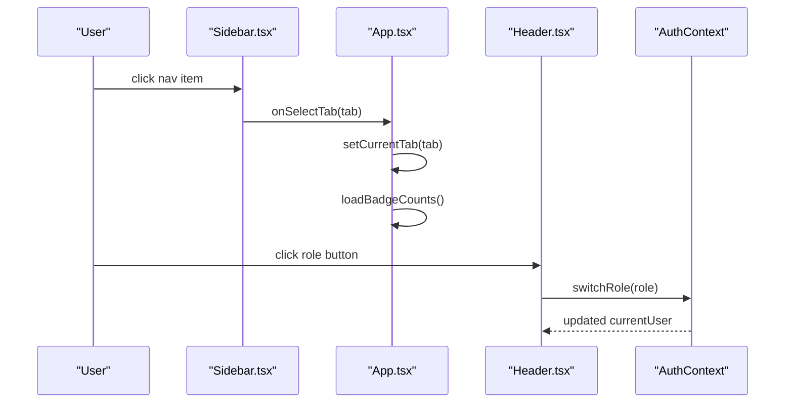

**Diagram sources**
- [Sidebar.tsx:24-151](file://src/components/Sidebar.tsx#L24-L151)
- [Header.tsx:10-108](file://src/components/Header.tsx#L10-L108)
- [App.tsx:75-83](file://src/App.tsx#L75-L83)
- [AuthContext.tsx:85-100](file://src/context/AuthContext.tsx#L85-L100)

**Section sources**
- [Header.tsx:10-108](file://src/components/Header.tsx#L10-L108)
- [Sidebar.tsx:24-151](file://src/components/Sidebar.tsx#L24-L151)
- [App.tsx:75-83](file://src/App.tsx#L75-L83)

### Routing Mechanism (Conditional Rendering)
- Navigation is implemented via state-based routing: currentTab determines which view component to render.
- Each view receives props for navigation callbacks and modal triggers, enabling deep linking-like behavior without a router library.
- Badge counts are refreshed when currentTab changes to keep sidebar indicators up-to-date.

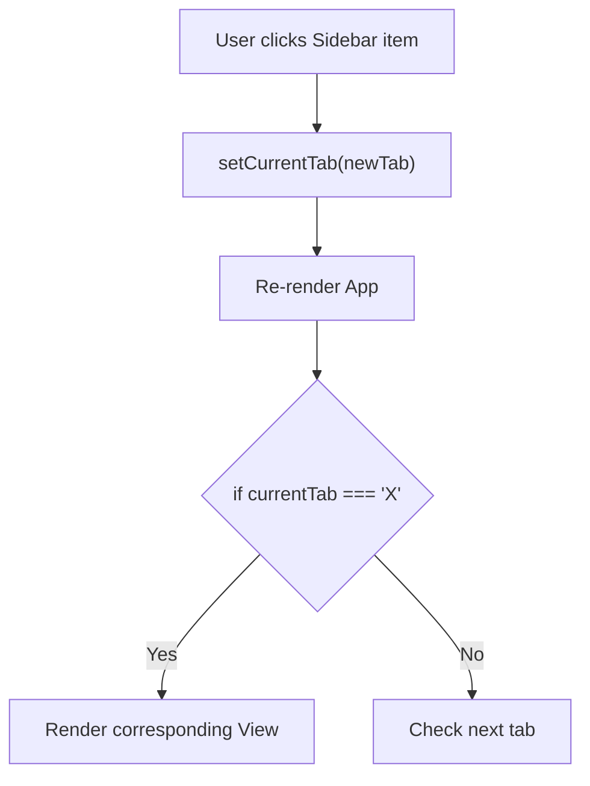

**Diagram sources**
- [App.tsx:136-189](file://src/App.tsx#L136-L189)

**Section sources**
- [App.tsx:136-189](file://src/App.tsx#L136-L189)

### Responsive Design with Tailwind CSS
- The layout uses mobile-first responsive classes to adapt across screen sizes:
  - Flexible column layout for header/sidebar/content.
  - Padding adjustments for small and large screens.
  - Hidden elements on specific breakpoints (e.g., version text hidden on small screens).
- Global styles are applied via index.css, and Tailwind is integrated through Vite plugin configuration.

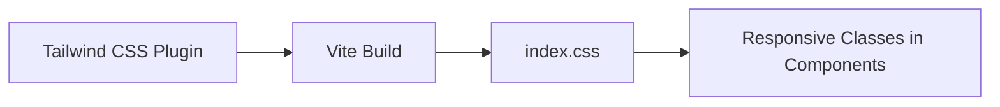

**Diagram sources**
- [vite.config.ts:1-23](file://vite.config.ts#L1-L23)
- [index.css](file://src/index.css)
- [App.tsx:118-190](file://src/App.tsx#L118-L190)
- [Header.tsx:13-108](file://src/components/Header.tsx#L13-L108)
- [Sidebar.tsx:86-151](file://src/components/Sidebar.tsx#L86-L151)

**Section sources**
- [vite.config.ts:1-23](file://vite.config.ts#L1-L23)
- [App.tsx:118-190](file://src/App.tsx#L118-L190)
- [Header.tsx:13-108](file://src/components/Header.tsx#L13-L108)
- [Sidebar.tsx:86-151](file://src/components/Sidebar.tsx#L86-L151)

### Application Initialization and Context Providers Setup
- main.tsx creates the React root and renders App within StrictMode.
- App.tsx wraps MainApp with AuthProvider and ToastProvider to ensure global availability of auth and toast functionality.
- On mount, AuthContext initializes user session, auto-logging in if needed, and sets isLoading accordingly.

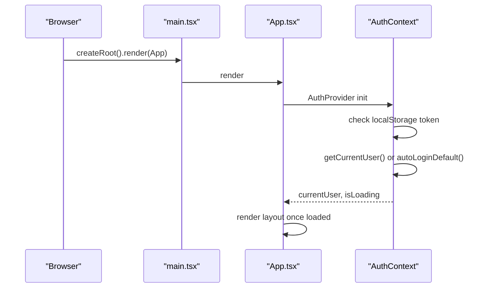

**Diagram sources**
- [main.tsx:6-9](file://src/main.tsx#L6-L9)
- [App.tsx:234-241](file://src/App.tsx#L234-L241)
- [AuthContext.tsx:30-65](file://src/context/AuthContext.tsx#L30-L65)

**Section sources**
- [main.tsx:1-11](file://src/main.tsx#L1-L11)
- [App.tsx:234-241](file://src/App.tsx#L234-L241)
- [AuthContext.tsx:30-65](file://src/context/AuthContext.tsx#L30-L65)

### Data Flow and API Integration
- api.ts centralizes HTTP calls, attaching Authorization headers from localStorage token.
- Views and App fetch data (e.g., dashboard summary) and update local state accordingly.
- Error handling throws descriptive errors that components can catch and handle gracefully.

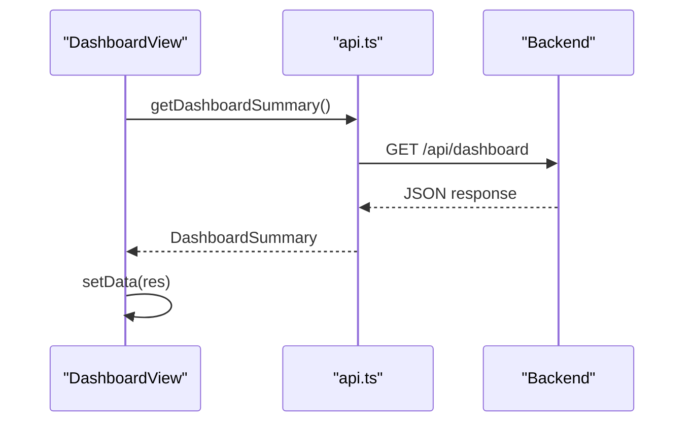

**Diagram sources**
- [DashboardView.tsx:55-69](file://src/components/DashboardView.tsx#L55-L69)
- [api.ts:34-54](file://src/services/api.ts#L34-L54)

**Section sources**
- [api.ts:21-54](file://src/services/api.ts#L21-L54)
- [DashboardView.tsx:55-69](file://src/components/DashboardView.tsx#L55-L69)

## Dependency Analysis
- External dependencies include React, React DOM, Vite, Tailwind CSS, Lucide icons, and server-side packages (Express, JWT, etc.).
- Internal dependencies:
  - App depends on AuthContext, ToastProvider, Header, Sidebar, and various view components.
  - Views depend on api.ts for data fetching.
  - AuthContext depends on api.ts for authentication endpoints.
  - Header and Sidebar consume AuthContext for user state and role switching.

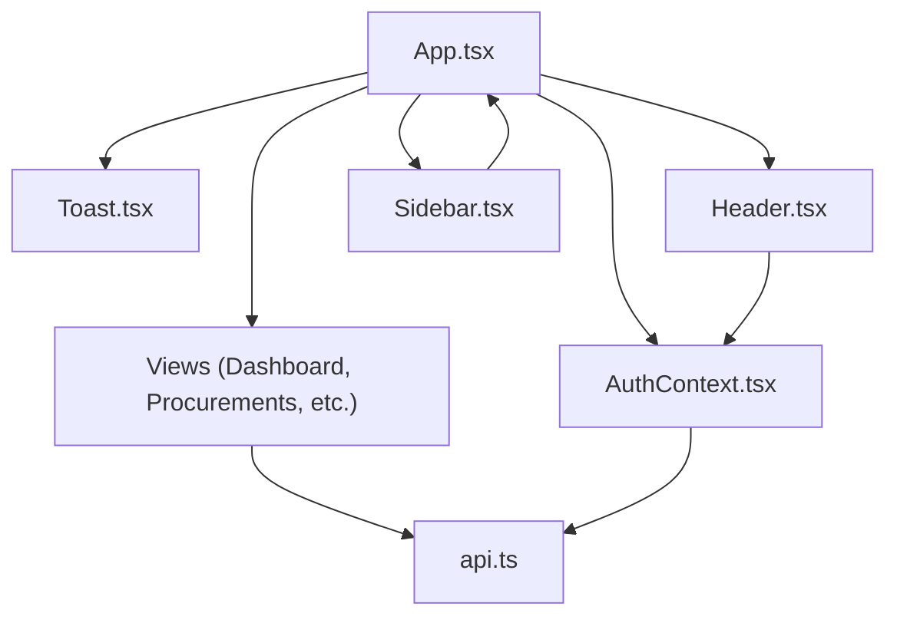

**Diagram sources**
- [App.tsx:1-20](file://src/App.tsx#L1-L20)
- [AuthContext.tsx:1-4](file://src/context/AuthContext.tsx#L1-L4)
- [Toast.tsx:1-4](file://src/components/Toast.tsx#L1-L4)
- [Header.tsx:1-3](file://src/components/Header.tsx#L1-L3)
- [Sidebar.tsx:1-12](file://src/components/Sidebar.tsx#L1-L12)
- [api.ts:1-19](file://src/services/api.ts#L1-L19)

**Section sources**
- [package.json:14-35](file://package.json#L14-L35)
- [App.tsx:1-20](file://src/App.tsx#L1-L20)
- [api.ts:1-19](file://src/services/api.ts#L1-L19)

## Performance Considerations
- Conditional rendering: Only one view is rendered at a time based on currentTab, reducing unnecessary component trees.
- Localized state: Modals and navigation parameters are managed locally in App to avoid global state bloat.
- Badge counts refresh: Badge counts are fetched when currentTab changes, minimizing redundant API calls.
- Toast limits: ToastProvider caps concurrent toasts and auto-dismisses them, preventing UI clutter and memory growth.
- Lazy loading strategies: While not explicitly implemented in the analyzed files, the structure supports code splitting per view (e.g., dynamic imports) to reduce initial bundle size.
- State optimization: Use of memoization (e.g., useCallback in ToastProvider) reduces re-renders for stable handlers.

[No sources needed since this section provides general guidance]

## Troubleshooting Guide
- Authentication issues:
  - If token is invalid or expired, AuthContext auto-logs in as a default inspector; verify network connectivity and backend availability.
  - Ensure localStorage contains a valid token for subsequent requests.
- API errors:
  - api.ts throws descriptive errors; catch and display user-friendly messages via ToastProvider.
- Navigation glitches:
  - Ensure currentTab matches expected values; verify Sidebar onSelectTab calls and App handler logic.
- Toast behavior:
  - If toasts do not appear, confirm ToastProvider wraps the component tree and useToast is invoked correctly.

**Section sources**
- [AuthContext.tsx:36-65](file://src/context/AuthContext.tsx#L36-L65)
- [api.ts:34-54](file://src/services/api.ts#L34-L54)
- [Toast.tsx:35-87](file://src/components/Toast.tsx#L35-L87)

## Conclusion
The NVC Procurement Monitoring & Inspection System employs a clean, provider-driven React architecture with clear separation of concerns. App.tsx orchestrates layout and navigation, while AuthContext and ToastProvider deliver global state and notifications. Conditional rendering implements simple yet effective routing. Tailwind CSS ensures responsive design across devices. The codebase is structured to support future enhancements like lazy loading and further state optimizations.