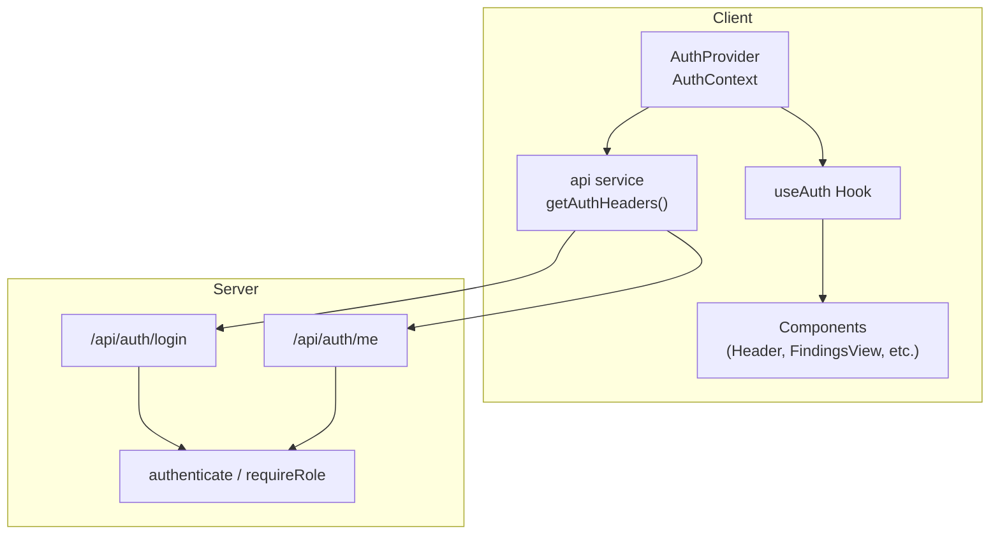
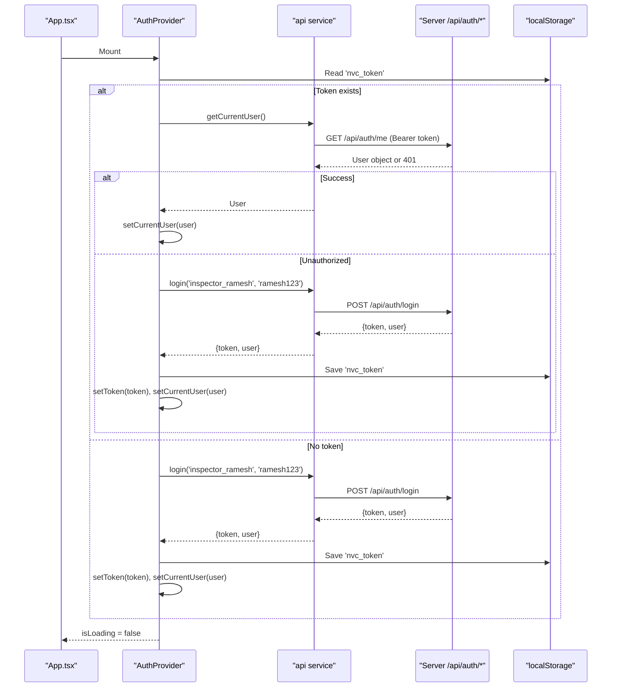
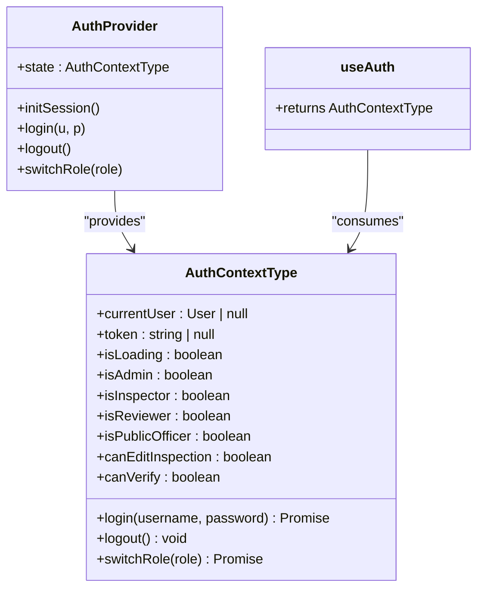
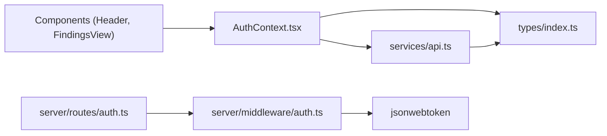
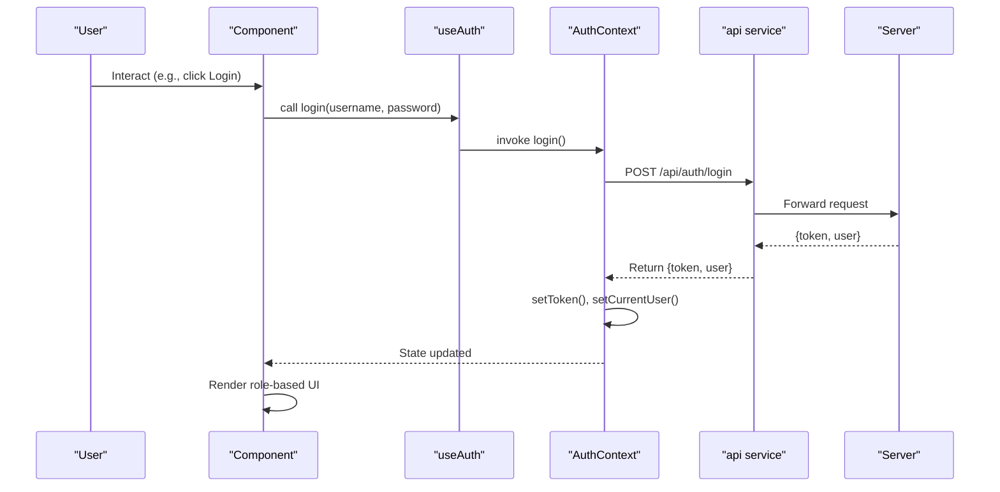

# Authentication Context

<cite>
**Referenced Files in This Document**
- [AuthContext.tsx](file://src/context/AuthContext.tsx)
- [api.ts](file://src/services/api.ts)
- [auth.ts (server routes)](file://server/routes/auth.ts)
- [auth.ts (server middleware)](file://server/middleware/auth.ts)
- [index.ts (types)](file://src/types/index.ts)
- [App.tsx](file://src/App.tsx)
- [Header.tsx](file://src/components/Header.tsx)
- [FindingsView.tsx](file://src/components/FindingsView.tsx)
</cite>

## Table of Contents
1. Introduction
2. Project Structure
3. Core Components
4. Architecture Overview
5. Detailed Component Analysis
6. Dependency Analysis
7. Performance Considerations
8. Troubleshooting Guide
9. Conclusion
10. Appendices

## Introduction
This document explains the authentication context implementation in the NVC system. It covers the AuthContext provider that manages global authentication state, the login/logout flows, JWT token handling and persistence, session initialization on app boot, role-based UI rendering, integration with the API service layer, error handling, and security considerations. It also shows how child components consume authentication state via the useAuth hook.

## Project Structure
The authentication feature spans client-side React context, a shared API service, and server-side routes and middleware:
- Client:
  - AuthContext provider and useAuth hook for global state
  - api service for HTTP calls with Bearer token headers
  - Components consuming auth state to render role-aware UI
- Server:
  - Express routes for login and current user profile
  - Middleware for JWT verification and role checks

**Diagram sources**
- [AuthContext.tsx:30-130](file://src/context/AuthContext.tsx#L30-L130)
- [api.ts:23-54](file://src/services/api.ts#L23-L54)
- [auth.ts (server routes):10-104](file://server/routes/auth.ts#L10-L104)
- [auth.ts (server middleware):20-86](file://server/middleware/auth.ts#L20-L86)

**Section sources**
- [AuthContext.tsx:1-139](file://src/context/AuthContext.tsx#L1-L139)
- [api.ts:1-54](file://src/services/api.ts#L1-L54)
- [auth.ts (server routes):1-104](file://server/routes/auth.ts#L1-L104)
- [auth.ts (server middleware):1-86](file://server/middleware/auth.ts#L1-L86)

## Core Components
- AuthContext provider:
  - Manages currentUser, token, isLoading
  - Provides login, logout, switchRole helpers
  - Derives role flags (isAdmin, isInspector, isReviewer, isPublicOfficer) and permission booleans (canEditInspection, canVerify)
  - Initializes session on mount by loading current user from server or auto-login as default inspector
- useAuth hook:
  - Exposes the context value to any descendant component
- API service:
  - getAuthHeaders injects Authorization header using stored token
  - login and getCurrentUser endpoints used by AuthContext
- Server routes and middleware:
  - POST /api/auth/login authenticates credentials and returns JWT + user
  - GET /api/auth/me requires valid JWT and returns current user
  - Middleware verifies JWT and enforces roles when needed

**Section sources**
- [AuthContext.tsx:5-18](file://src/context/AuthContext.tsx#L5-L18)
- [AuthContext.tsx:30-130](file://src/context/AuthContext.tsx#L30-L130)
- [api.ts:23-54](file://src/services/api.ts#L23-L54)
- [auth.ts (server routes):10-104](file://server/routes/auth.ts#L10-L104)
- [auth.ts (server middleware):20-86](file://server/middleware/auth.ts#L20-L86)

## Architecture Overview
End-to-end flow from app boot to authenticated state:

**Diagram sources**
- [AuthContext.tsx:30-65](file://src/context/AuthContext.tsx#L30-L65)
- [api.ts:36-54](file://src/services/api.ts#L36-L54)
- [auth.ts (server routes):10-104](file://server/routes/auth.ts#L10-L104)
- [auth.ts (server middleware):36-58](file://server/middleware/auth.ts#L36-L58)

## Detailed Component Analysis

### AuthContext Provider
Responsibilities:
- Initialize session on mount:
  - If a token exists, call getCurrentUser; if invalid/expired, auto-login as default inspector
  - If no token, auto-login as default inspector
- Persist token to localStorage and keep currentUser in state
- Provide login, logout, switchRole functions
- Compute role flags and permission booleans for UI gating

Key behaviors:
- Auto-login fallback ensures a seamless demo experience when tokens are missing or invalid
- Role switching uses predefined demo credentials to re-authenticate as another role
- Loading state prevents rendering until session is ready

Error handling:
- Logs warnings/errors on auto-login failures
- Throws an error if useAuth is used outside AuthProvider

Security notes:
- Tokens are stored in localStorage; consider secure storage strategies for production
- No automatic token refresh is implemented; expired tokens trigger re-authentication via auto-login

**Section sources**
- [AuthContext.tsx:30-130](file://src/context/AuthContext.tsx#L30-L130)

#### Class-like structure of AuthContext

**Diagram sources**
- [AuthContext.tsx:5-18](file://src/context/AuthContext.tsx#L5-L18)
- [AuthContext.tsx:30-130](file://src/context/AuthContext.tsx#L30-L130)

### API Service Integration
- getAuthHeaders reads token from localStorage and sets Authorization header
- login sends credentials to /api/auth/login and returns token + user
- getCurrentUser fetches profile using Bearer token
- Other endpoints reuse getAuthHeaders for protected requests

Error handling:
- Non-ok responses throw errors with localized messages
- Callers should handle these errors appropriately

**Section sources**
- [api.ts:23-54](file://src/services/api.ts#L23-L54)

### Server Authentication Endpoints and Middleware
- POST /api/auth/login:
  - Validates username/password
  - Generates JWT with 24-hour expiry
  - Returns token and user details
  - Logs audit event
- GET /api/auth/me:
  - Requires authenticate middleware
  - Returns current user profile
- Middleware:
  - authenticate: validates Bearer token, sets req.user
  - requireRole: restricts access to specific roles
  - optionalAuth: attaches user if present without blocking

Security:
- Passwords hashed with bcrypt
- JWT signed with secret key configured via environment variable
- Role enforcement at route level

**Section sources**
- [auth.ts (server routes):10-104](file://server/routes/auth.ts#L10-L104)
- [auth.ts (server middleware):20-86](file://server/middleware/auth.ts#L20-L86)

### Data Models
- User type defines role enum and optional display fields used across UI and server responses

**Section sources**
- [index.ts (types):1-12](file://src/types/index.ts#L1-L12)

### Usage in Components
- App wraps the application with AuthProvider and consumes isLoading to show a loading screen
- Header displays current user info and provides quick role switching via switchRole
- FindingsView gates creation/editing based on canEditInspection and isAdmin

Examples:
- Role-based UI rendering:
  - Header shows role-specific buttons and user badge
  - FindingsView conditionally renders “Create Finding” button based on permissions

**Section sources**
- [App.tsx:21-23](file://src/App.tsx#L21-L23)
- [App.tsx:105-116](file://src/App.tsx#L105-L116)
- [Header.tsx:10-109](file://src/components/Header.tsx#L10-L109)
- [FindingsView.tsx:34-35](file://src/components/FindingsView.tsx#L34-L35)
- [FindingsView.tsx:114-122](file://src/components/FindingsView.tsx#L114-L122)

## Dependency Analysis
Client-side dependencies:
- AuthContext depends on types.User and api service
- api service depends on types and localStorage
- Components depend on useAuth for state and actions

Server-side dependencies:
- Routes depend on db query helper, bcrypt, jwt, and middleware
- Middleware depends on jsonwebtoken and environment variables

Coupling:
- Tight coupling between AuthContext and api service for auth flows
- Loose coupling between components and AuthContext via useAuth

Potential circular dependencies:
- None observed; imports are one-directional

External integrations:
- JSON Web Token library for signing/verification
- Database via query helper (not shown here)

**Diagram sources**
- [AuthContext.tsx:1-4](file://src/context/AuthContext.tsx#L1-L4)
- [api.ts:1-19](file://src/services/api.ts#L1-L19)
- [auth.ts (server routes):1-5](file://server/routes/auth.ts#L1-L5)
- [auth.ts (server middleware):1-4](file://server/middleware/auth.ts#L1-L4)

**Section sources**
- [AuthContext.tsx:1-4](file://src/context/AuthContext.tsx#L1-L4)
- [api.ts:1-19](file://src/services/api.ts#L1-L19)
- [auth.ts (server routes):1-5](file://server/routes/auth.ts#L1-L5)
- [auth.ts (server middleware):1-4](file://server/middleware/auth.ts#L1-L4)

## Performance Considerations
- Minimal state updates: AuthContext only updates on login/logout/role switch and initial load
- Single source of truth: Token persisted in localStorage reduces redundant network calls
- Avoid unnecessary re-renders: Use memoization in components where appropriate when consuming large contexts
- Network efficiency: getCurrentUser called once on boot; subsequent requests rely on cached token

[No sources needed since this section provides general guidance]

## Troubleshooting Guide
Common issues and resolutions:
- Invalid/expired token:
  - Behavior: getCurrentUser fails, triggers auto-login as default inspector
  - Resolution: Ensure server JWT secret matches client expectations; verify token persistence
- Login failure:
  - Behavior: API throws error with localized message
  - Resolution: Check credentials; ensure user is active in database
- Unauthorized access:
  - Behavior: Server returns 401 with error message
  - Resolution: Re-authenticate; ensure Authorization header includes Bearer token
- Role not permitted:
  - Behavior: Server returns 403 when accessing restricted routes
  - Resolution: Switch role via switchRole or adjust user role in backend

Debugging tips:
- Inspect localStorage for 'nvc_token' presence and validity
- Check browser network tab for failed requests and response payloads
- Review console logs for auto-login warnings and errors

**Section sources**
- [AuthContext.tsx:36-65](file://src/context/AuthContext.tsx#L36-L65)
- [api.ts:36-54](file://src/services/api.ts#L36-L54)
- [auth.ts (server middleware):36-58](file://server/middleware/auth.ts#L36-L58)

## Conclusion
The NVC authentication system centers around a React context provider that manages user sessions, persists JWT tokens, and exposes role-aware state to all components. The server enforces authentication and authorization via middleware and routes. While robust for development and demos, production deployments should enhance security by implementing secure token storage and automatic token refresh mechanisms.

[No sources needed since this section summarizes without analyzing specific files]

## Appendices

### Authentication Flow Sequence

**Diagram sources**
- [AuthContext.tsx:67-77](file://src/context/AuthContext.tsx#L67-L77)
- [api.ts:36-45](file://src/services/api.ts#L36-L45)
- [auth.ts (server routes):10-80](file://server/routes/auth.ts#L10-L80)

### Role-Based UI Rendering Examples
- Header:
  - Displays current user name, role, and quick role switcher
  - Uses currentUser and switchRole from useAuth
- FindingsView:
  - Conditionally shows “Create Finding” button based on canEditInspection and isAdmin

**Section sources**
- [Header.tsx:10-109](file://src/components/Header.tsx#L10-L109)
- [FindingsView.tsx:34-35](file://src/components/FindingsView.tsx#L34-L35)
- [FindingsView.tsx:114-122](file://src/components/FindingsView.tsx#L114-L122)

### Security Considerations
- Token storage:
  - Current implementation uses localStorage; consider httpOnly cookies for enhanced security in production
- Token lifetime:
  - JWT expires in 24 hours; implement silent refresh or re-auth prompts before expiration
- Role enforcement:
  - Always validate roles server-side; do not rely solely on client-side flags
- Input validation:
  - Validate and sanitize inputs on both client and server
- Audit logging:
  - Login events are logged; extend logging for sensitive operations

[No sources needed since this section provides general guidance]