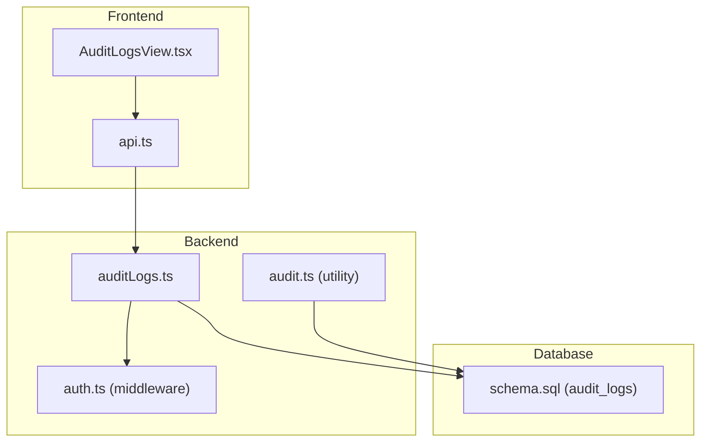
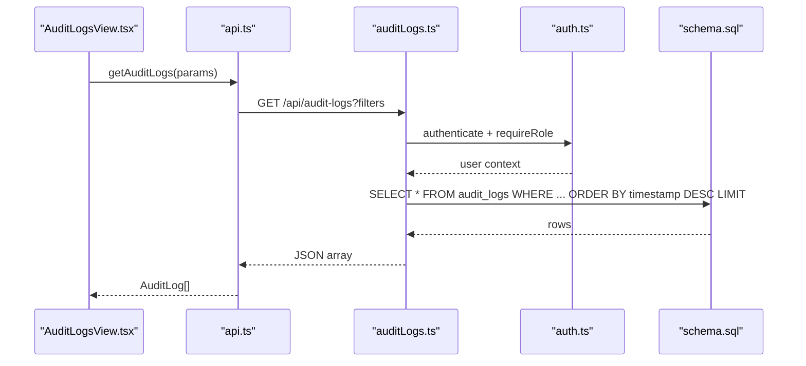
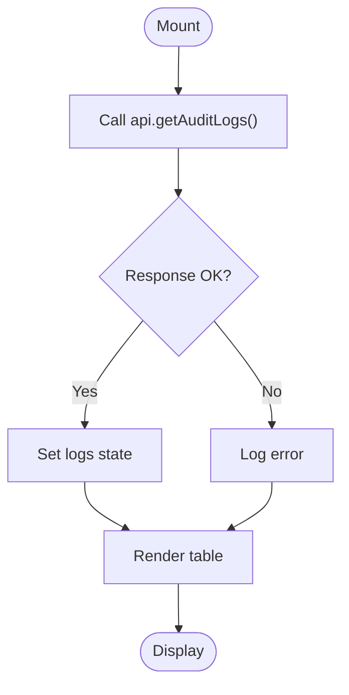
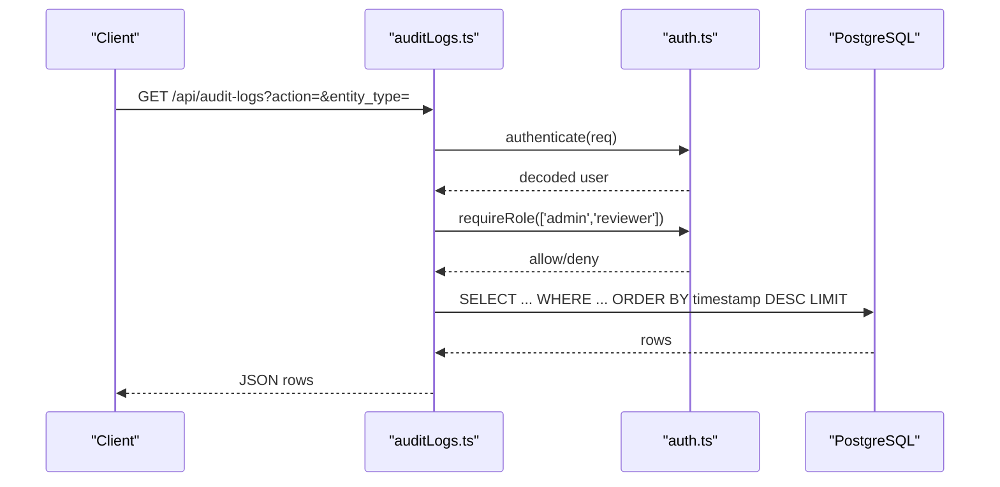
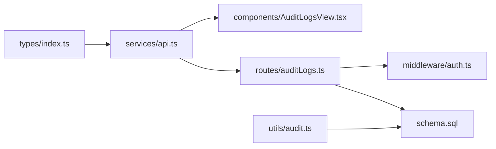

# Audit Logs View

<cite>
**Referenced Files in This Document**
- [AuditLogsView.tsx](file://src/components/AuditLogsView.tsx)
- [api.ts](file://src/services/api.ts)
- [index.ts](file://src/types/index.ts)
- [auditLogs.ts](file://server/routes/auditLogs.ts)
- [auth.ts](file://server/middleware/auth.ts)
- [audit.ts](file://server/utils/audit.ts)
- [schema.sql](file://database/schema.sql)
</cite>

## Table of Contents
1. Introduction
2. Project Structure
3. Core Components
4. Architecture Overview
5. Detailed Component Analysis
6. Dependency Analysis
7. Performance Considerations
8. Troubleshooting Guide
9. Conclusion
10. Appendices

## Introduction
This document provides comprehensive documentation for the AuditLogsView component and its supporting backend, focusing on audit trail monitoring and compliance tracking. It explains the log entry structure (user actions, timestamps, IP addresses, and transaction details), filtering and search capabilities, security implications, retention and archival strategies, export functionality considerations, performance characteristics for large datasets, integration with authentication, and notification pathways for critical events.

## Project Structure
The audit logging feature spans frontend components, API services, server routes, middleware, utilities, and database schema:
- Frontend: React component renders audit logs and calls the API service.
- Services: Centralized API client encapsulates endpoints and headers.
- Server: Express route exposes a secured endpoint to retrieve audit logs; utility function writes audit entries; middleware enforces authentication and role-based access.
- Database: PostgreSQL schema defines the audit_logs table and indexes.

**Diagram sources**
- [AuditLogsView.tsx:1-92](file://src/components/AuditLogsView.tsx#L1-L92)
- [api.ts:427-438](file://src/services/api.ts#L427-L438)
- [auditLogs.ts:1-35](file://server/routes/auditLogs.ts#L1-L35)
- [auth.ts:36-86](file://server/middleware/auth.ts#L36-L86)
- [audit.ts:1-32](file://server/utils/audit.ts#L1-L32)
- [schema.sql:258-283](file://database/schema.sql#L258-L283)

**Section sources**
- [AuditLogsView.tsx:1-92](file://src/components/AuditLogsView.tsx#L1-L92)
- [api.ts:427-438](file://src/services/api.ts#L427-L438)
- [auditLogs.ts:1-35](file://server/routes/auditLogs.ts#L1-L35)
- [auth.ts:36-86](file://server/middleware/auth.ts#L36-L86)
- [audit.ts:1-32](file://server/utils/audit.ts#L1-L32)
- [schema.sql:258-283](file://database/schema.sql#L258-L283)

## Core Components
- AuditLogsView (frontend): Displays a paginated-style table of audit logs with columns for timestamp, user, action, entity type, entity ID, and IP address. It loads data via the API service and handles loading states.
- API Service: Provides getAuditLogs with optional filters for action and entity_type, attaching authentication headers.
- Audit Logs Route: Secures GET /api/audit-logs with authentication and role checks (admin or reviewer). Supports query parameters action, entity_type, and limit. Returns ordered results by timestamp descending.
- Audit Utility: Writes audit entries to the audit_logs table with user context, action, entity details, old/new values, and IP address.
- Authentication Middleware: Validates JWT tokens and enforces roles for protected routes.
- Database Schema: Defines audit_logs table fields and an index on user_id for efficient querying.

Key responsibilities:
- Secure retrieval of audit logs for authorized users.
- Consistent capture of user-initiated actions across the system.
- Structured storage of audit metadata for compliance reporting.

**Section sources**
- [AuditLogsView.tsx:1-92](file://src/components/AuditLogsView.tsx#L1-L92)
- [api.ts:427-438](file://src/services/api.ts#L427-L438)
- [auditLogs.ts:1-35](file://server/routes/auditLogs.ts#L1-L35)
- [audit.ts:1-32](file://server/utils/audit.ts#L1-L32)
- [auth.ts:36-86](file://server/middleware/auth.ts#L36-L86)
- [schema.sql:258-283](file://database/schema.sql#L258-L283)

## Architecture Overview
End-to-end flow for viewing audit logs:
- The AuditLogsView component requests audit logs from the API service.
- The API service attaches authentication headers and calls the server’s audit-logs endpoint.
- The server route authenticates the request, validates roles, applies filters, queries the database, and returns results.
- Audit entries are created elsewhere via the audit utility when sensitive operations occur.

**Diagram sources**
- [AuditLogsView.tsx:10-24](file://src/components/AuditLogsView.tsx#L10-L24)
- [api.ts:427-438](file://src/services/api.ts#L427-L438)
- [auditLogs.ts:7-32](file://server/routes/auditLogs.ts#L7-L32)
- [auth.ts:36-86](file://server/middleware/auth.ts#L36-L86)
- [schema.sql:258-283](file://database/schema.sql#L258-L283)

## Detailed Component Analysis

### AuditLogsView Component
- Purpose: Render a readable audit trail table for administrators and reviewers.
- Data model: Uses the AuditLog interface for typing and rendering.
- Behavior: Loads logs on mount; shows loading state; displays empty state if no logs; formats timestamps locally.
- Filtering/Search: Currently displays all logs returned by the API; no client-side filters implemented in this component.

**Diagram sources**
- [AuditLogsView.tsx:10-24](file://src/components/AuditLogsView.tsx#L10-L24)
- [api.ts:427-438](file://src/services/api.ts#L427-L438)

**Section sources**
- [AuditLogsView.tsx:1-92](file://src/components/AuditLogsView.tsx#L1-L92)
- [index.ts:281-292](file://src/types/index.ts#L281-L292)

### API Service Integration
- Endpoint: GET /api/audit-logs
- Query parameters: action, entity_type (optional); default limit is applied server-side.
- Authentication: Automatically includes Authorization header using stored token.

**Section sources**
- [api.ts:427-438](file://src/services/api.ts#L427-L438)

### Server Route: GET /api/audit-logs
- Security: Requires authentication and roles admin or reviewer.
- Filtering: Supports action and entity_type filters; orders by timestamp descending; limits results.
- Response: Array of audit log objects.

**Diagram sources**
- [auditLogs.ts:7-32](file://server/routes/auditLogs.ts#L7-L32)
- [auth.ts:36-86](file://server/middleware/auth.ts#L36-L86)
- [schema.sql:258-283](file://database/schema.sql#L258-L283)

**Section sources**
- [auditLogs.ts:1-35](file://server/routes/auditLogs.ts#L1-L35)
- [auth.ts:36-86](file://server/middleware/auth.ts#L36-L86)

### Audit Logging Utility
- Purpose: Persist audit entries for key operations across the application.
- Fields captured: user_id, username, action, entity_type, entity_id, old_values, new_values, ip_address, created_at.
- Usage: Called by various routes to record significant changes and events.

**Section sources**
- [audit.ts:1-32](file://server/utils/audit.ts#L1-L32)
- [schema.sql:258-283](file://database/schema.sql#L258-L283)

### Authentication and Role-Based Access
- JWT-based authentication ensures only authenticated users can access audit logs.
- Role enforcement restricts audit log access to admin and reviewer roles.

**Section sources**
- [auth.ts:36-86](file://server/middleware/auth.ts#L36-L86)

### Database Schema and Indexes
- audit_logs table stores structured audit records with JSONB for flexible change snapshots.
- Index on user_id supports efficient per-user lookups.

**Section sources**
- [schema.sql:258-283](file://database/schema.sql#L258-L283)

## Dependency Analysis
- Frontend depends on types and API service for consistent contracts and network calls.
- Backend route depends on middleware for security and on the database layer for persistence.
- Audit utility depends on the database layer to persist entries.
- All components rely on the shared schema for data consistency.

**Diagram sources**
- [index.ts:281-292](file://src/types/index.ts#L281-L292)
- [api.ts:427-438](file://src/services/api.ts#L427-L438)
- [auditLogs.ts:1-35](file://server/routes/auditLogs.ts#L1-L35)
- [auth.ts:36-86](file://server/middleware/auth.ts#L36-L86)
- [audit.ts:1-32](file://server/utils/audit.ts#L1-L32)
- [schema.sql:258-283](file://database/schema.sql#L258-L283)

**Section sources**
- [api.ts:427-438](file://src/services/api.ts#L427-L438)
- [auditLogs.ts:1-35](file://server/routes/auditLogs.ts#L1-L35)
- [auth.ts:36-86](file://server/middleware/auth.ts#L36-L86)
- [audit.ts:1-32](file://server/utils/audit.ts#L1-L32)
- [schema.sql:258-283](file://database/schema.sql#L258-L283)

## Performance Considerations
- Pagination and Limits: The route supports a limit parameter to cap result sets. For large datasets, implement pagination on both server and client sides to avoid loading entire tables.
- Indexing Strategy:
  - Existing index on user_id enables fast per-user queries.
  - Recommended additional indexes:
    - timestamp for range queries and sorting.
    - action for frequent filtering by action type.
    - entity_type for resource-specific filtering.
    - Composite index on (timestamp DESC, action) to optimize common filtered list views.
- Query Optimization:
  - Use selective filters (action, entity_type) to reduce scan scope.
  - Avoid SELECT * in production; project only needed columns to reduce payload size.
- Caching:
  - Consider short-lived caching for read-only audit lists where appropriate, ensuring cache invalidation on write operations.
- Storage Growth:
  - Implement periodic archival or partitioning by time ranges to maintain query performance and manage storage costs.

[No sources needed since this section provides general guidance]

## Troubleshooting Guide
- Unauthorized Access:
  - Ensure a valid JWT is present in the Authorization header.
  - Verify the user has admin or reviewer role to access audit logs.
- Empty Results:
  - Check filter parameters (action, entity_type) for typos or unsupported values.
  - Confirm that audit entries exist for the specified criteria.
- Performance Issues:
  - Reduce limit or add more specific filters.
  - Add recommended indexes to speed up queries.
- Write Failures:
  - Inspect audit utility logs for errors when writing audit entries.
  - Validate database connectivity and permissions.

**Section sources**
- [auditLogs.ts:7-32](file://server/routes/auditLogs.ts#L7-L32)
- [auth.ts:36-86](file://server/middleware/auth.ts#L36-L86)
- [audit.ts:1-32](file://server/utils/audit.ts#L1-L32)

## Conclusion
The AuditLogsView integrates a secure, role-gated API to display audit trails, backed by a robust schema and utility for capturing user actions. While current filtering is limited to action and entity_type, the design allows extension for advanced search and export features. With proper indexing, pagination, and archival strategies, the system can scale to handle large audit datasets while maintaining compliance and performance.

[No sources needed since this section summarizes without analyzing specific files]

## Appendices

### Log Entry Structure
- Fields: id, user_id, username, action, entity_type, entity_id, old_values, new_values, ip_address, timestamp.
- Notes:
  - old_values and new_values are JSONB, enabling flexible change snapshots.
  - ip_address captures the requester’s IP for traceability.
  - timestamp is timezone-aware for accurate auditing.

**Section sources**
- [schema.sql:258-283](file://database/schema.sql#L258-L283)
- [index.ts:281-292](file://src/types/index.ts#L281-L292)

### Filtering and Search Capabilities
- Current support: action, entity_type, and limit via query parameters.
- Recommendations:
  - Add date range filters (created_at between ...) for temporal queries.
  - Add user_id filter for per-user activity views.
  - Implement full-text search on action or entity descriptions if needed.

**Section sources**
- [auditLogs.ts:7-32](file://server/routes/auditLogs.ts#L7-L32)
- [api.ts:427-438](file://src/services/api.ts#L427-L438)

### Security Implications
- Sensitive Data Protection:
  - Avoid logging sensitive payloads (passwords, PII) in old_values/new_values; sanitize before recording.
  - Restrict audit log access to authorized roles only.
- Access Controls:
  - Enforce role-based access at the route level to prevent unauthorized viewing.
- Integrity:
  - Ensure audit logs are immutable; do not allow updates or deletions through standard APIs.

**Section sources**
- [auth.ts:36-86](file://server/middleware/auth.ts#L36-L86)
- [auditLogs.ts:7-32](file://server/routes/auditLogs.ts#L7-L32)

### Retention Policies and Archival Strategies
- Retention:
  - Define policy based on regulatory requirements (e.g., retain logs for X years).
- Archival:
  - Partition audit_logs by time (monthly/yearly) to simplify purging and improve query performance.
  - Archive older partitions to cold storage and drop them from the active dataset.
- Compliance:
  - Ensure archival processes preserve integrity and accessibility for audits.

[No sources needed since this section provides general guidance]

### Export Functionality
- Current state: No dedicated export endpoint exists in the codebase.
- Recommendations:
  - Add endpoints to export filtered audit logs in CSV, Excel, or PDF formats.
  - Include headers for all relevant fields and ensure data sanitization.
  - Apply rate limiting and access controls to export endpoints.

[No sources needed since this section provides general guidance]

### Integration with Authentication System
- User Activity Tracking:
  - Audit entries include user_id and username, linking actions to authenticated users.
  - Login events are recorded to track user sessions and origins.
- Token Handling:
  - API service attaches Authorization headers automatically for authenticated requests.

**Section sources**
- [auth.ts:20-58](file://server/middleware/auth.ts#L20-L58)
- [api.ts:23-32](file://src/services/api.ts#L23-L32)
- [auth.ts:49-58](file://server/routes/auth.ts#L49-L58)

### Notification System for Critical Security Events
- Current state: No explicit notification mechanism is implemented in the provided files.
- Recommendations:
  - Integrate email or webhook notifications for critical events (e.g., privilege escalation, bulk data exports).
  - Use event-driven architecture to decouple logging from notifications.

[No sources needed since this section provides general guidance]