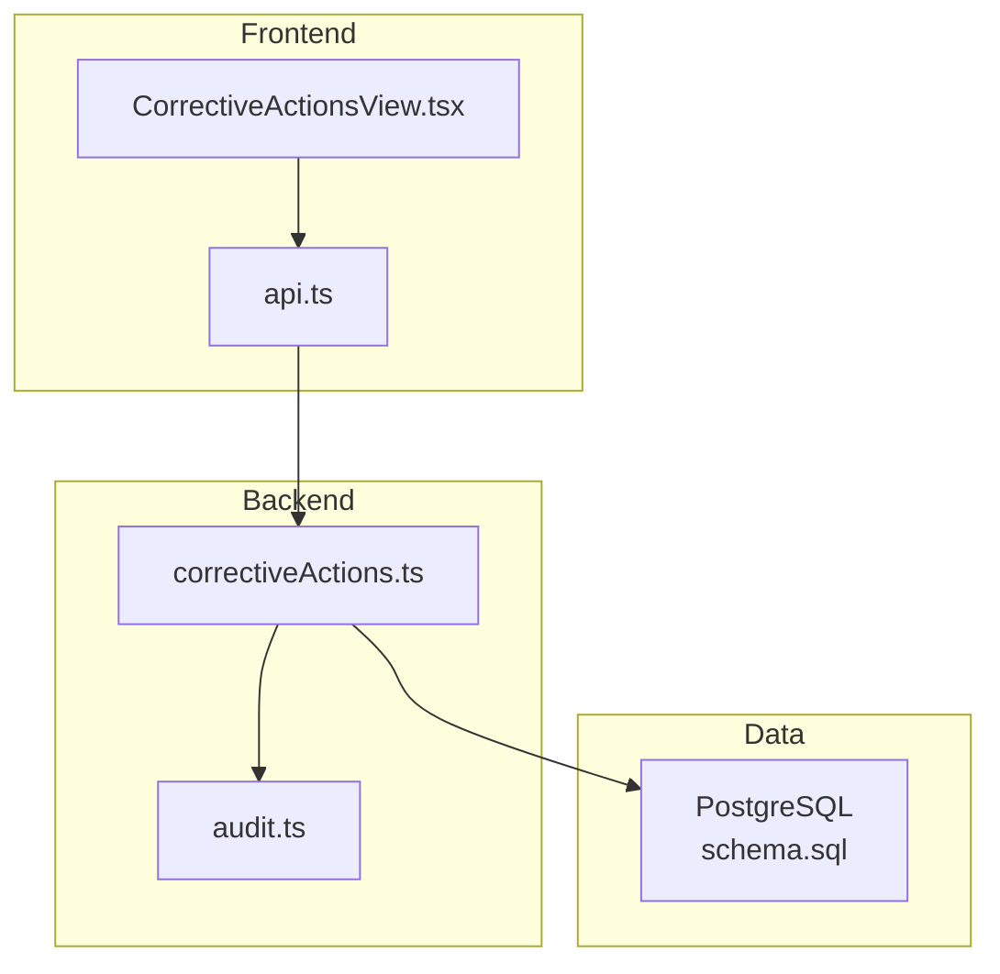
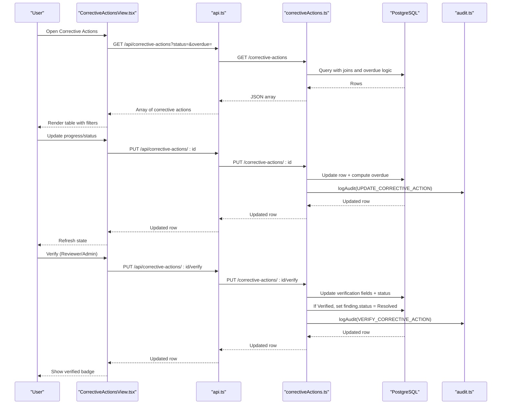
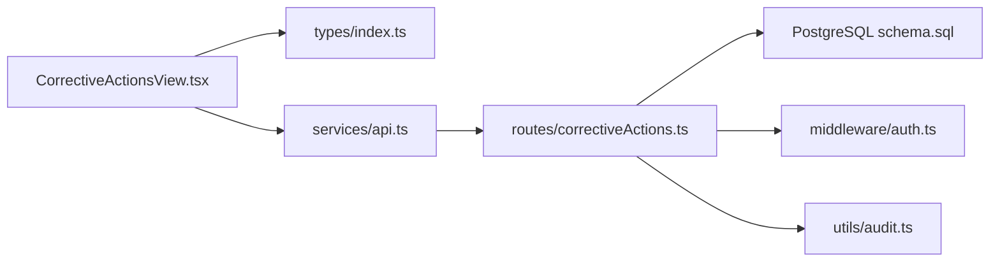
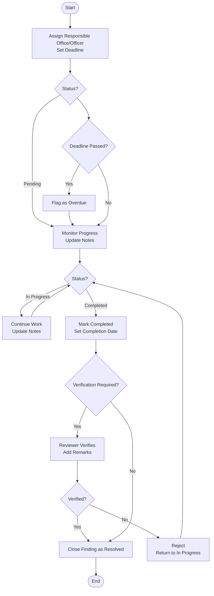

# Corrective Actions View

<cite>
**Referenced Files in This Document**
- [CorrectiveActionsView.tsx](file://src/components/CorrectiveActionsView.tsx)
- [correctiveActions.ts](file://server/routes/correctiveActions.ts)
- [api.ts](file://src/services/api.ts)
- [index.ts](file://src/types/index.ts)
- [schema.sql](file://database/schema.sql)
- [audit.ts](file://server/utils/audit.ts)
- [DashboardView.tsx](file://src/components/DashboardView.tsx)
</cite>

## Table of Contents
1. [Introduction](#introduction)
2. [Project Structure](#project-structure)
3. [Core Components](#core-components)
4. [Architecture Overview](#architecture-overview)
5. [Detailed Component Analysis](#detailed-component-analysis)
6. [Dependency Analysis](#dependency-analysis)
7. [Performance Considerations](#performance-considerations)
8. [Troubleshooting Guide](#troubleshooting-guide)
9. [Conclusion](#conclusion)
10. [Appendices](#appendices)

## Introduction
This document provides comprehensive documentation for the CorrectiveActionsView component and its backend integration. It explains how corrective actions are assigned to responsible parties, tracked through their lifecycle, verified, and closed. It also covers deadline management, overdue detection, audit logging, and integration with findings. Where applicable, it highlights current capabilities and identifies areas that can be extended (for example, automated reminders and escalation).

## Project Structure
The Corrective Actions feature spans frontend components, API services, server routes, database schema, and audit utilities:
- Frontend: CorrectiveActionsView.tsx renders the tracker UI, manages filters, progress updates, and verification workflows.
- Services: api.ts exposes typed methods to call backend endpoints for listing, updating, and verifying corrective actions.
- Backend: correctiveActions.ts implements REST endpoints for CRUD operations, filtering, overdue logic, and verification.
- Data: schema.sql defines tables including corrective_actions, findings, procurements, offices, and audit_logs.
- Audit: audit.ts records changes to corrective actions and related entities.
- Dashboard: DashboardView.tsx surfaces overdue counts and quick navigation to the Corrective Actions view.

**Diagram sources**
- [CorrectiveActionsView.tsx:1-425](file://src/components/CorrectiveActionsView.tsx#L1-L425)
- [api.ts:335-380](file://src/services/api.ts#L335-L380)
- [correctiveActions.ts:1-251](file://server/routes/correctiveActions.ts#L1-L251)
- [schema.sql:226-244](file://database/schema.sql#L226-L244)
- [audit.ts:1-32](file://server/utils/audit.ts#L1-L32)

**Section sources**
- [CorrectiveActionsView.tsx:1-425](file://src/components/CorrectiveActionsView.tsx#L1-L425)
- [api.ts:335-380](file://src/services/api.ts#L335-L380)
- [correctiveActions.ts:1-251](file://server/routes/correctiveActions.ts#L1-L251)
- [schema.sql:226-244](file://database/schema.sql#L226-L244)
- [audit.ts:1-32](file://server/utils/audit.ts#L1-L32)

## Core Components
- CorrectiveActionsView (frontend): Displays a filterable table of corrective actions, supports status filtering, overdue-only view, progress updates, and official verification by authorized users.
- Server route (backend): Provides endpoints to list, create, update, and verify corrective actions; computes overdue flags; integrates with findings to mark them resolved upon verification.
- Types: Defines the CorrectiveAction model and related fields used across the application.
- API service: Encapsulates HTTP calls to the backend for corrective action operations.
- Audit utility: Logs all significant changes to corrective actions and related entities.

Key responsibilities:
- Assignment workflow: Assign corrective actions to responsible offices/officers with deadlines via creation/update flows.
- Status tracking: Track progression from pending to in-progress, completed, verified, or overdue.
- Verification: Allow reviewers/admins to verify or reject corrective actions with remarks and timestamps.
- Overdue management: Automatically flag overdue items when deadlines pass without completion or verification.
- Integration with findings: Link corrective actions to findings and update finding status to Resolved upon verification.

**Section sources**
- [CorrectiveActionsView.tsx:23-95](file://src/components/CorrectiveActionsView.tsx#L23-L95)
- [correctiveActions.ts:8-66](file://server/routes/correctiveActions.ts#L8-L66)
- [correctiveActions.ts:68-121](file://server/routes/correctiveActions.ts#L68-L121)
- [correctiveActions.ts:123-193](file://server/routes/correctiveActions.ts#L123-L193)
- [correctiveActions.ts:195-248](file://server/routes/correctiveActions.ts#L195-L248)
- [index.ts:237-260](file://src/types/index.ts#L237-L260)
- [api.ts:335-380](file://src/services/api.ts#L335-L380)
- [audit.ts:1-32](file://server/utils/audit.ts#L1-L32)

## Architecture Overview
The Corrective Actions flow involves user interactions on the frontend, API calls to the backend, database operations, and audit logging.

**Diagram sources**
- [CorrectiveActionsView.tsx:47-95](file://src/components/CorrectiveActionsView.tsx#L47-L95)
- [api.ts:335-380](file://src/services/api.ts#L335-L380)
- [correctiveActions.ts:8-66](file://server/routes/correctiveActions.ts#L8-L66)
- [correctiveActions.ts:123-193](file://server/routes/correctiveActions.ts#L123-L193)
- [correctiveActions.ts:195-248](file://server/routes/correctiveActions.ts#L195-L248)
- [schema.sql:226-244](file://database/schema.sql#L226-L244)
- [audit.ts:1-32](file://server/utils/audit.ts#L1-L32)

## Detailed Component Analysis

### CorrectiveActionsView (Frontend)
- Filters: Supports filtering by status and an “Overdue Only” toggle. The view re-fetches data when filters change.
- Progress update modal: Allows responsible parties to update progress notes and status. When marking as completed, sets completion date automatically.
- Verification modal: Restricted to users with verification permissions. Captures verification remarks and submits verification decision.
- UI indicators: Shows overdue badges, verification status, responsible office/officer, deadlines, and links back to procurement context.

Lifecycle handling:
- Load: Fetches corrective actions with optional filters.
- Update: Sends progress/status updates; client updates local state optimistically.
- Verify: Submits verification decision; updates local state and hides modals.

Error handling:
- Network errors are caught and logged; user is not blocked but may see stale data until refresh.

Permissions:
- Uses authentication context to conditionally show verification controls based on role.

**Section sources**
- [CorrectiveActionsView.tsx:23-95](file://src/components/CorrectiveActionsView.tsx#L23-L95)
- [CorrectiveActionsView.tsx:114-149](file://src/components/CorrectiveActionsView.tsx#L114-L149)
- [CorrectiveActionsView.tsx:177-278](file://src/components/CorrectiveActionsView.tsx#L177-L278)
- [CorrectiveActionsView.tsx:285-357](file://src/components/CorrectiveActionsView.tsx#L285-L357)
- [CorrectiveActionsView.tsx:359-421](file://src/components/CorrectiveActionsView.tsx#L359-L421)

### Server Routes (Backend)
- List endpoint: Joins corrective_actions with findings, procurements, and offices; computes is_overdue based on deadline and status; supports filtering by status, finding_id, inspection_id, office_id, and overdue flag.
- Create endpoint: Validates required fields and inserts a new corrective action; logs audit entry.
- Update endpoint: Updates fields including progress_notes, completion_date, status; auto-flags overdue if past deadline and not completed/verified; logs audit entry.
- Verify endpoint: Updates verification_status, verification_remarks, verification_officer, verified_at, and status; if verified, updates linked finding status to Resolved; logs audit entry.

Deadline and overdue logic:
- Overdue is computed both in list queries and during updates when deadlines have passed and status is not completed or verified.

Integration with findings:
- On verification success, the associated finding is marked Resolved, ensuring linkage between issues and remediation outcomes.

**Section sources**
- [correctiveActions.ts:8-66](file://server/routes/correctiveActions.ts#L8-L66)
- [correctiveActions.ts:68-121](file://server/routes/correctiveActions.ts#L68-L121)
- [correctiveActions.ts:123-193](file://server/routes/correctiveActions.ts#L123-L193)
- [correctiveActions.ts:195-248](file://server/routes/correctiveActions.ts#L195-L248)

### Data Model and Schema
- corrective_actions: Stores assignment details (responsible_office, responsible_officer), deadlines, progress notes, completion dates, statuses, and verification metadata.
- findings: Linked via finding_id; updated to Resolved upon verification.
- procurements and offices: Joined for display and filtering.
- audit_logs: Records all corrective action changes with old/new values and IP addresses.

Indexes:
- Optimized queries on corrective_actions.finding_id and other high-frequency filters.

**Section sources**
- [schema.sql:200-244](file://database/schema.sql#L200-L244)
- [schema.sql:258-270](file://database/schema.sql#L258-L270)
- [schema.sql:272-283](file://database/schema.sql#L272-L283)

### API Service Layer
- getCorrectiveActions: Builds query parameters for status and overdue filters.
- updateCorrectiveAction: Sends partial updates for progress and status.
- verifyCorrectiveAction: Sends verification decision and remarks.

Authentication:
- Adds Authorization header using stored token for protected endpoints.

**Section sources**
- [api.ts:335-380](file://src/services/api.ts#L335-L380)

### Audit Trail
- All create, update, and verify operations log detailed changes to audit_logs, capturing user identity, entity type, entity ID, old/new values, and IP address.

**Section sources**
- [audit.ts:1-32](file://server/utils/audit.ts#L1-L32)
- [correctiveActions.ts:105-114](file://server/routes/correctiveActions.ts#L105-L114)
- [correctiveActions.ts:177-186](file://server/routes/correctiveActions.ts#L177-L186)
- [correctiveActions.ts:233-242](file://server/routes/correctiveActions.ts#L233-L242)

### Dashboard Integration
- Dashboard displays the count of overdue corrective actions and provides a direct link to open the Corrective Actions view filtered by overdue.

**Section sources**
- [DashboardView.tsx:190-213](file://src/components/DashboardView.tsx#L190-L213)

## Dependency Analysis
- CorrectiveActionsView depends on:
  - types/index.ts for CorrectiveAction interface
  - services/api.ts for network calls
  - context/AuthContext.tsx for role-based visibility
- Server routes depend on:
  - db.ts for database access
  - middleware/auth.ts for authentication and authorization
  - utils/audit.ts for audit logging
- Database dependencies:
  - corrective_actions references findings and inspections
  - findings reference procurements and checklist items
  - audit_logs referenced by all write operations

**Diagram sources**
- [CorrectiveActionsView.tsx:1-5](file://src/components/CorrectiveActionsView.tsx#L1-L5)
- [api.ts:335-380](file://src/services/api.ts#L335-L380)
- [correctiveActions.ts:1-5](file://server/routes/correctiveActions.ts#L1-L5)
- [schema.sql:226-244](file://database/schema.sql#L226-L244)

**Section sources**
- [CorrectiveActionsView.tsx:1-5](file://src/components/CorrectiveActionsView.tsx#L1-L5)
- [api.ts:335-380](file://src/services/api.ts#L335-L380)
- [correctiveActions.ts:1-5](file://server/routes/correctiveActions.ts#L1-L5)
- [schema.sql:226-244](file://database/schema.sql#L226-L244)

## Performance Considerations
- Efficient querying: The list endpoint uses JOINs and computed is_overdue to minimize client-side processing.
- Filtering: Server-side filtering by status, finding_id, inspection_id, office_id, and overdue reduces payload size.
- Indexes: Proper indexes on frequently filtered columns improve performance.
- Client state: Local optimistic updates avoid unnecessary re-renders and provide responsive UX.

[No sources needed since this section provides general guidance]

## Troubleshooting Guide
Common issues and resolutions:
- Unable to load corrective actions:
  - Check network connectivity and authentication token validity.
  - Validate query parameters (status, overdue) sent to the backend.
- Update progress fails:
  - Ensure the user has appropriate permissions.
  - Confirm that the corrective action exists and the payload includes valid fields.
- Verification fails:
  - Verify that the user has reviewer/admin roles.
  - Check that verification_status and remarks are provided.
- Overdue not reflecting:
  - Confirm that deadlines are set and status is not Completed or Verified.
  - Re-fetch the list after updates to ensure latest is_overdue computation.

**Section sources**
- [correctiveActions.ts:8-66](file://server/routes/correctiveActions.ts#L8-L66)
- [correctiveActions.ts:123-193](file://server/routes/correctiveActions.ts#L123-L193)
- [correctiveActions.ts:195-248](file://server/routes/correctiveActions.ts#L195-L248)
- [CorrectiveActionsView.tsx:47-95](file://src/components/CorrectiveActionsView.tsx#L47-L95)

## Conclusion
The CorrectiveActionsView provides a robust workflow for managing corrective actions from assignment through verification and closure. It integrates tightly with findings to ensure traceability, enforces deadline-based overdue detection, and maintains a complete audit trail. While automated reminders and escalation are not implemented in the current codebase, the foundation is in place to extend these features by adding scheduled tasks and notification mechanisms.

[No sources needed since this section summarizes without analyzing specific files]

## Appendices

### Status Lifecycle and Rules
- Status values: Pending, In Progress, Completed, Verified, Overdue.
- Overdue rule: If deadline is in the past and status is not Completed or Verified, the item is flagged as Overdue.
- Verification: Only authorized roles can verify; verification updates verification fields and marks the linked finding as Resolved.

**Diagram sources**
- [correctiveActions.ts:144-151](file://server/routes/correctiveActions.ts#L144-L151)
- [correctiveActions.ts:195-248](file://server/routes/correctiveActions.ts#L195-L248)
- [schema.sql:226-244](file://database/schema.sql#L226-L244)

### Reporting Capabilities
- Current implementation:
  - Dashboard shows overdue corrective action counts and provides quick navigation to the Corrective Actions view.
  - Audit logs capture all changes for compliance monitoring.
- Extensibility:
  - Compliance rates and average resolution times can be derived from corrective_actions and findings tables using SQL aggregations.
  - Trend analysis can be built by querying time-series data from created_at, completion_date, and verified_at fields.

[No sources needed since this section provides general guidance]

### Notification System
- Current implementation:
  - No automated email or in-app notifications are present in the codebase.
  - Dashboard highlights overdue counts to draw attention.
- Recommended extension:
  - Implement scheduled jobs to check upcoming deadlines and overdue items.
  - Send notifications to responsible officers and supervisors.
  - Log notification events in audit_logs for traceability.

[No sources needed since this section provides general guidance]