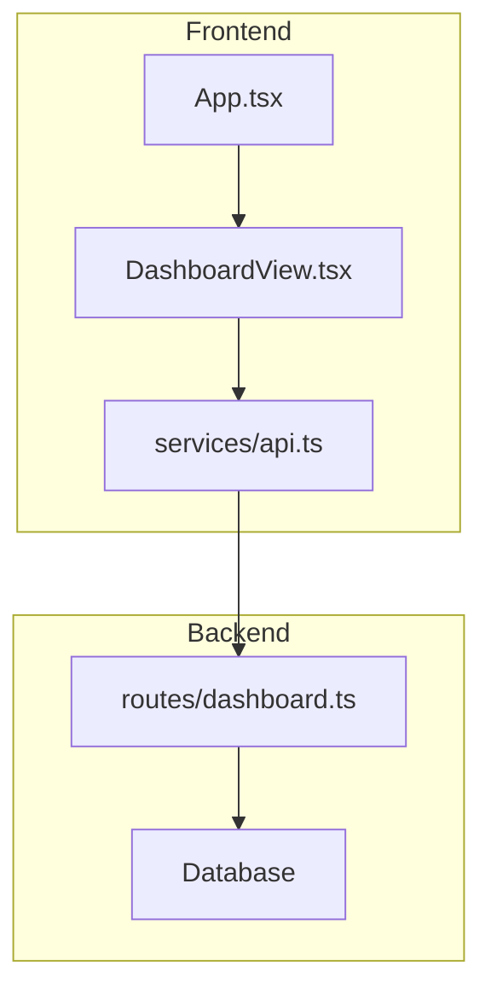
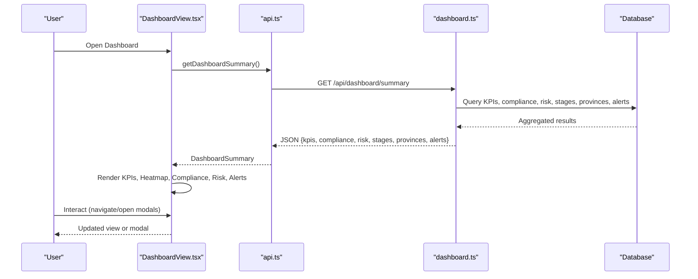
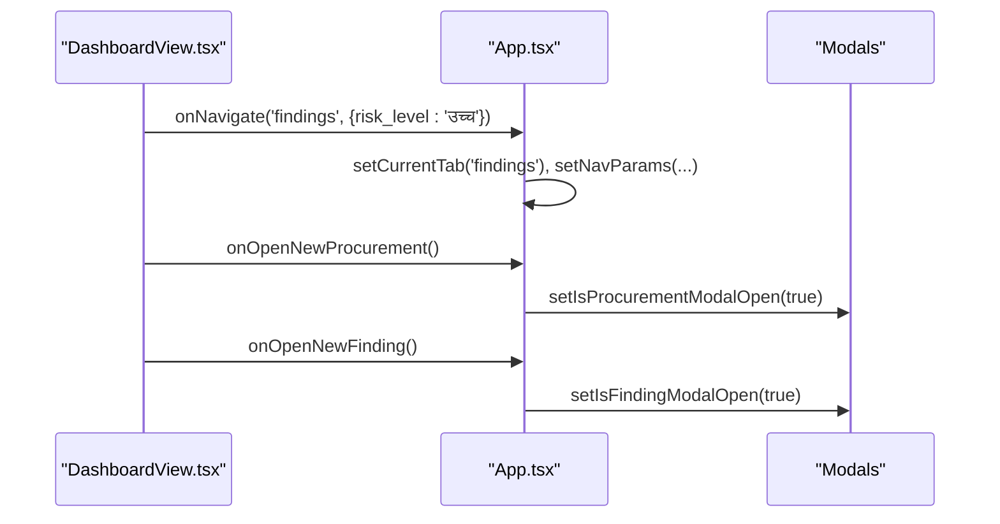
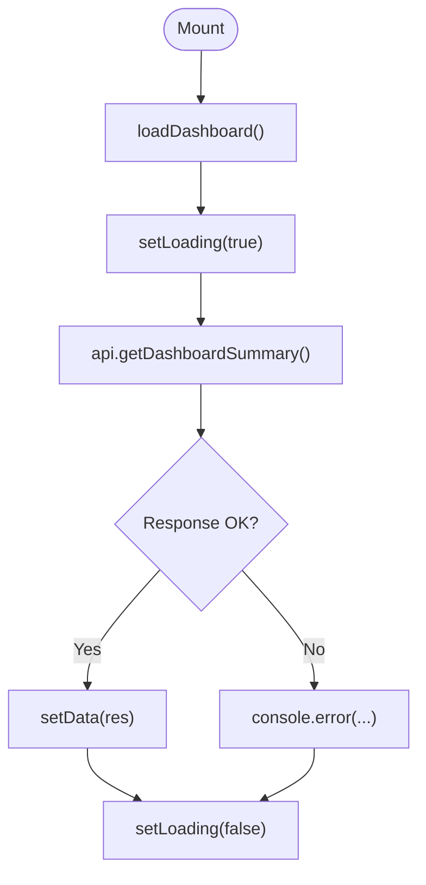
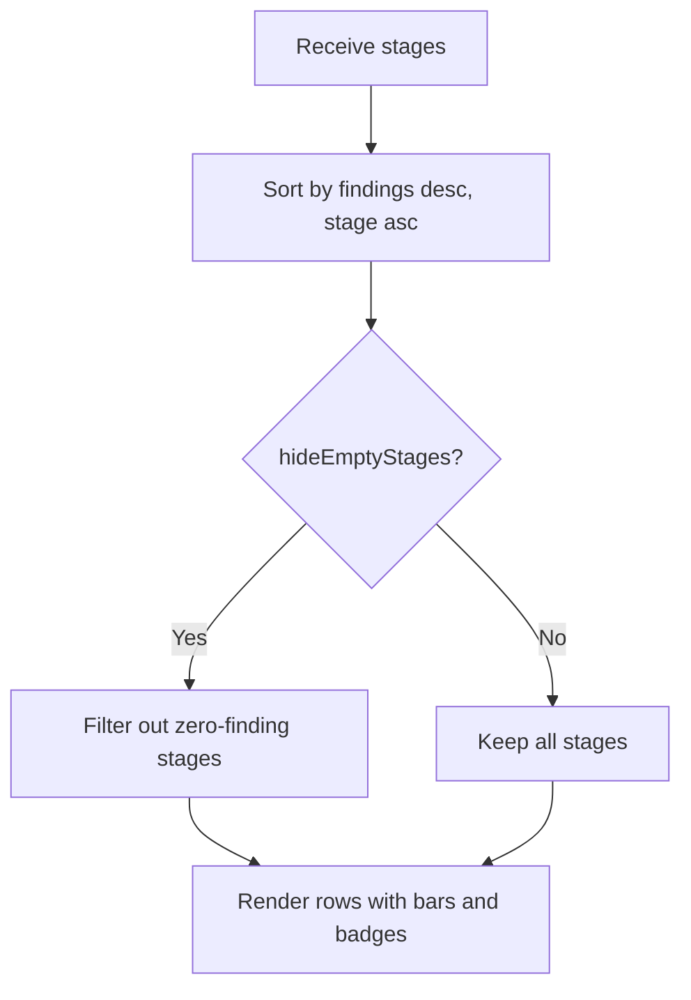
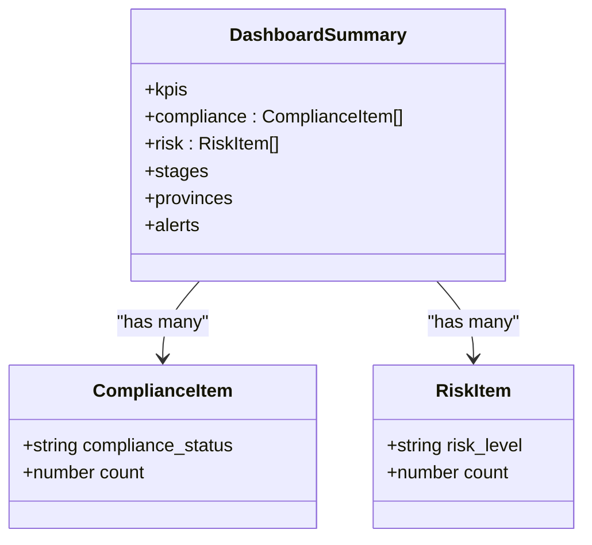
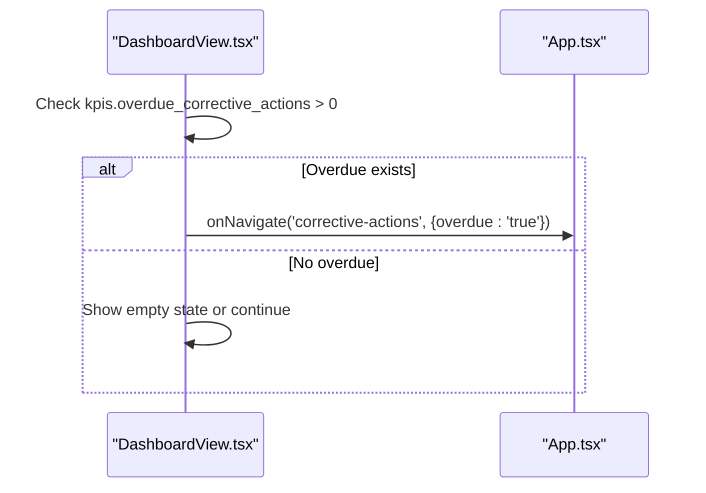
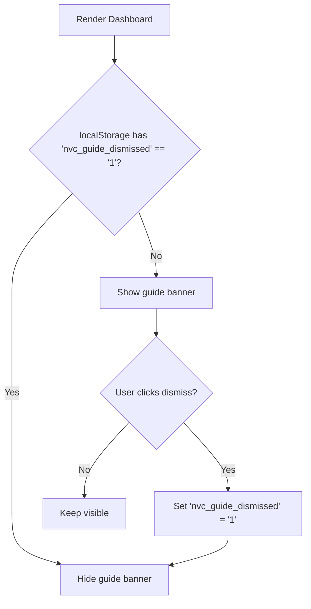
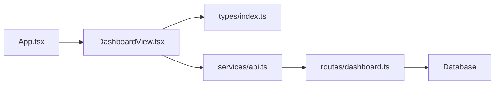

# Dashboard View

<cite>
**Referenced Files in This Document**
- [DashboardView.tsx](file://src/components/DashboardView.tsx)
- [api.ts](file://src/services/api.ts)
- [dashboard.ts](file://server/routes/dashboard.ts)
- [index.ts](file://src/types/index.ts)
- [App.tsx](file://src/App.tsx)
</cite>

## Table of Contents
1. Introduction
2. Project Structure
3. Core Components
4. Architecture Overview
5. Detailed Component Analysis
6. Dependency Analysis
7. Performance Considerations
8. Troubleshooting Guide
9. Conclusion

## Introduction
The DashboardView component is the main analytics and monitoring hub for the procurement inspection system. It consolidates key performance indicators (KPIs), compliance metrics, risk assessments, and a stage-by-stage distribution of procurement irregularities into a single responsive dashboard. It also provides quick actions to create new procurements or findings, highlights overdue corrective actions, and offers an onboarding guide banner with persistent dismissal via localStorage. The UI is fully localized in Nepali and formats currency using NPR localization.

## Project Structure
The DashboardView integrates with:
- A client-side API service that calls the backend endpoint for dashboard summary data.
- A server route that aggregates KPIs, compliance breakdown, risk distribution, stages, provinces, and alerts from the database.
- Shared TypeScript types that define the shape of the dashboard summary payload.
- The application shell that wires navigation and modal triggers into the DashboardView props.

**Diagram sources**
- [App.tsx:136-145](file://src/App.tsx#L136-L145)
- [DashboardView.tsx:55-69](file://src/components/DashboardView.tsx#L55-L69)
- [api.ts:413-417](file://src/services/api.ts#L413-L417)
- [dashboard.ts:7-107](file://server/routes/dashboard.ts#L7-L107)

**Section sources**
- [App.tsx:136-145](file://src/App.tsx#L136-L145)
- [DashboardView.tsx:55-69](file://src/components/DashboardView.tsx#L55-L69)
- [api.ts:413-417](file://src/services/api.ts#L413-L417)
- [dashboard.ts:7-107](file://server/routes/dashboard.ts#L7-L107)

## Core Components
- Props interface:
  - onNavigate(tab, filter?): navigates to other views and can pass filters such as risk_level or search queries.
  - onOpenNewProcurement(): opens the procurement creation modal.
  - onOpenNewFinding(): opens the finding creation modal.
- Data fetching:
  - Uses api.getDashboardSummary() to load aggregated dashboard data on mount.
- State management:
  - loading state for initial fetch.
  - hideEmptyStages preference to toggle visibility of stages with zero findings.
  - showGuide flag persisted in localStorage to control usage guide banner visibility.
- Visualizations:
  - KPI cards: total procurements, active inspections, high/critical findings, potential financial impact.
  - Stage heatmap: sorted by findings count, with optional hiding of empty stages and financial impact badges.
  - Compliance status breakdown: categorized counts with color-coded chips.
  - Risk matrix: counts per risk level with emphasis on high/critical.
  - Alerts table: recent critical findings with direct navigation to details.
- Localization and accessibility:
  - All labels and messages are in Nepali.
  - Currency formatted with Intl.NumberFormat using 'ne-NP' locale for NPR.
  - Buttons include aria-label attributes for screen readers.

**Section sources**
- [DashboardView.tsx:22-36](file://src/components/DashboardView.tsx#L22-L36)
- [DashboardView.tsx:55-69](file://src/components/DashboardView.tsx#L55-L69)
- [DashboardView.tsx:71-76](file://src/components/DashboardView.tsx#L71-L76)
- [DashboardView.tsx:139-188](file://src/components/DashboardView.tsx#L139-L188)
- [DashboardView.tsx:215-305](file://src/components/DashboardView.tsx#L215-L305)
- [DashboardView.tsx:307-471](file://src/components/DashboardView.tsx#L307-L471)
- [DashboardView.tsx:473-550](file://src/components/DashboardView.tsx#L473-L550)

## Architecture Overview
The dashboard follows a unidirectional data flow:
- On mount, DashboardView calls api.getDashboardSummary().
- The API service sends a GET request to /api/dashboard/summary with authentication headers.
- The server route aggregates multiple SQL queries to compute KPIs, compliance stats, risk distribution, stages, provinces, and alerts.
- The response is typed as DashboardSummary and rendered into KPI cards, stage heatmap, compliance breakdown, risk matrix, and alerts table.
- User interactions trigger onNavigate or modal open callbacks managed by the parent App.

**Diagram sources**
- [DashboardView.tsx:55-69](file://src/components/DashboardView.tsx#L55-L69)
- [api.ts:413-417](file://src/services/api.ts#L413-L417)
- [dashboard.ts:7-107](file://server/routes/dashboard.ts#L7-L107)

## Detailed Component Analysis

### Props and Parent Integration
- onNavigate: Used to switch tabs and optionally pass filters like risk_level or search. In App, this updates currentTab and navParams.
- onOpenNewProcurement: Opens ProcurementModal via App state.
- onOpenNewFinding: Clears any preload and opens FindingModal.

**Diagram sources**
- [DashboardView.tsx:121-136](file://src/components/DashboardView.tsx#L121-L136)
- [App.tsx:75-78](file://src/App.tsx#L75-L78)
- [App.tsx:136-145](file://src/App.tsx#L136-L145)

**Section sources**
- [DashboardView.tsx:22-36](file://src/components/DashboardView.tsx#L22-L36)
- [App.tsx:75-78](file://src/App.tsx#L75-L78)
- [App.tsx:136-145](file://src/App.tsx#L136-L145)

### Data Fetching and Loading States
- useEffect triggers loadDashboard on mount.
- setLoading(true) before fetch; sets data on success; setLoading(false) in finally block.
- Errors are logged to console; no user-facing error toast is shown in this component.

**Diagram sources**
- [DashboardView.tsx:55-69](file://src/components/DashboardView.tsx#L55-L69)
- [api.ts:413-417](file://src/services/api.ts#L413-L417)

**Section sources**
- [DashboardView.tsx:55-69](file://src/components/DashboardView.tsx#L55-L69)

### Stage Heatmap and Findings Distribution
- Stages are sorted by findings_count descending, then by stage_number ascending.
- hideEmptyStages toggles filtering out stages with zero findings.
- Each stage row shows title, items count, findings badge, and optional financial impact badge.
- Progress bar width reflects relative findings compared to maxFindings.

**Diagram sources**
- [DashboardView.tsx:88-97](file://src/components/DashboardView.tsx#L88-L97)
- [DashboardView.tsx:344-397](file://src/components/DashboardView.tsx#L344-L397)

**Section sources**
- [DashboardView.tsx:88-97](file://src/components/DashboardView.tsx#L88-L97)
- [DashboardView.tsx:344-397](file://src/components/DashboardView.tsx#L344-L397)

### Compliance Status Breakdown and Risk Matrix
- Compliance statuses are grouped and displayed with color-coded backgrounds based on status values.
- Risk matrix displays counts per risk level, highlighting high/critical levels.

**Diagram sources**
- [index.ts:294-337](file://src/types/index.ts#L294-L337)
- [dashboard.ts:25-41](file://server/routes/dashboard.ts#L25-L41)

**Section sources**
- [DashboardView.tsx:400-471](file://src/components/DashboardView.tsx#L400-L471)
- [index.ts:294-337](file://src/types/index.ts#L294-L337)
- [dashboard.ts:25-41](file://server/routes/dashboard.ts#L25-L41)

### Alerts Table and Overdue Corrective Actions Banner
- If there are overdue corrective actions, a prominent alert banner appears with a call-to-action to navigate to corrective actions filtered by overdue.
- The alerts table lists recent critical findings with links to view details.

**Diagram sources**
- [DashboardView.tsx:190-213](file://src/components/DashboardView.tsx#L190-L213)

**Section sources**
- [DashboardView.tsx:190-213](file://src/components/DashboardView.tsx#L190-L213)
- [DashboardView.tsx:473-550](file://src/components/DashboardView.tsx#L473-L550)

### Usage Guide Banner with localStorage Persistence
- A collapsible guide banner provides step-by-step instructions and quick actions to navigate to procurements, inspections, and master checklist.
- Dismissal persists via localStorage key nvc_guide_dismissed; reappears if not dismissed previously.

**Diagram sources**
- [DashboardView.tsx:37-53](file://src/components/DashboardView.tsx#L37-L53)
- [DashboardView.tsx:139-188](file://src/components/DashboardView.tsx#L139-L188)

**Section sources**
- [DashboardView.tsx:37-53](file://src/components/DashboardView.tsx#L37-L53)
- [DashboardView.tsx:139-188](file://src/components/DashboardView.tsx#L139-L188)

### Nepali Language Implementation and NPR Currency Formatting
- All UI text is in Nepali, including headings, labels, and messages.
- Currency formatting uses Intl.NumberFormat with 'ne-NP' locale to display NPR amounts consistently across KPIs and tables.

**Section sources**
- [DashboardView.tsx:71-76](file://src/components/DashboardView.tsx#L71-L76)
- [DashboardView.tsx:215-305](file://src/components/DashboardView.tsx#L215-L305)
- [DashboardView.tsx:473-550](file://src/components/DashboardView.tsx#L473-L550)

### Accessibility Features
- Interactive elements use semantic HTML and appropriate roles.
- Buttons include aria-label attributes for screen reader support.
- Color coding is paired with text labels to ensure clarity beyond color alone.

**Section sources**
- [DashboardView.tsx:139-188](file://src/components/DashboardView.tsx#L139-L188)

## Dependency Analysis
- DashboardView depends on:
  - Types: DashboardSummary and related structures for type safety.
  - API service: getDashboardSummary() encapsulates network calls and auth headers.
  - Server route: aggregates data from multiple tables to produce the summary.
- App manages global navigation state and modal states, wiring them to DashboardView props.

**Diagram sources**
- [DashboardView.tsx:1-3](file://src/components/DashboardView.tsx#L1-L3)
- [api.ts:413-417](file://src/services/api.ts#L413-L417)
- [dashboard.ts:7-107](file://server/routes/dashboard.ts#L7-L107)
- [App.tsx:136-145](file://src/App.tsx#L136-L145)

**Section sources**
- [index.ts:294-337](file://src/types/index.ts#L294-L337)
- [api.ts:413-417](file://src/services/api.ts#L413-L417)
- [dashboard.ts:7-107](file://server/routes/dashboard.ts#L7-L107)
- [App.tsx:136-145](file://src/App.tsx#L136-L145)

## Performance Considerations
- Sorting and filtering stages occur client-side; for large datasets, consider pagination or virtualization.
- hideEmptyStages reduces visual clutter but does not reduce data size; keep it enabled when many stages exist.
- Avoid unnecessary re-renders by memoizing derived values if needed (e.g., sortedStages).
- Network requests are minimal (single summary call); caching at the API layer could further improve responsiveness.

[No sources needed since this section provides general guidance]

## Troubleshooting Guide
- If the dashboard fails to load:
  - Check network errors in the browser console; the component logs failures when fetching the summary.
  - Verify authentication token presence; the API service attaches Authorization headers when available.
- If the guide banner does not persist dismissal:
  - Ensure localStorage is available and not blocked by privacy settings.
  - Clear storage manually to reset the guide visibility.
- If alerts or overdue banners do not appear:
  - Confirm backend returns overdue_corrective_actions > 0 and alerts list contains relevant entries.
- If currency formatting looks incorrect:
  - Ensure the locale is supported in the environment; fallback behavior should still render numbers even if locale differs.

**Section sources**
- [DashboardView.tsx:55-69](file://src/components/DashboardView.tsx#L55-L69)
- [api.ts:23-32](file://src/services/api.ts#L23-L32)
- [dashboard.ts:103-106](file://server/routes/dashboard.ts#L103-L106)

## Conclusion
The DashboardView component delivers a comprehensive, localized, and accessible analytics hub for procurement inspections. It consolidates KPIs, compliance metrics, risk assessments, and stage-wise irregularity distributions into a responsive layout, supports user preferences through localStorage, and integrates seamlessly with the application’s navigation and modal systems. Its clear separation of concerns—UI rendering, local state, and API integration—facilitates maintainability and future enhancements.