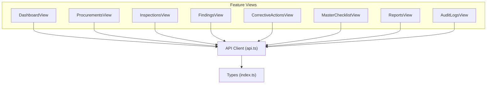
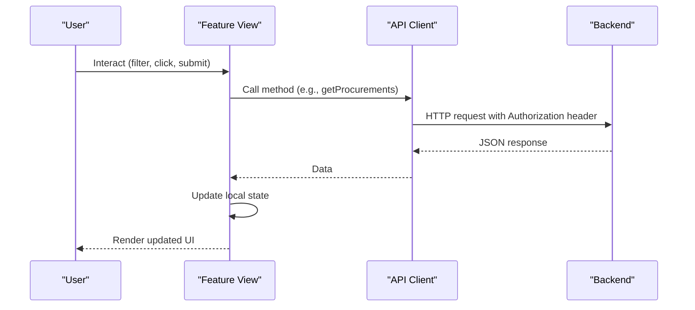
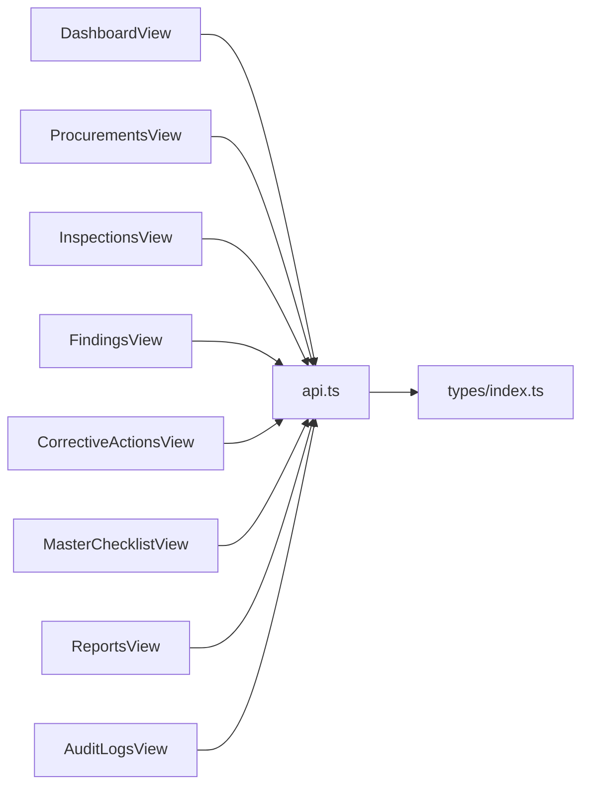

# Feature Views

<cite>
**Referenced Files in This Document**
- [DashboardView.tsx](file://src/components/DashboardView.tsx)
- [ProcurementsView.tsx](file://src/components/ProcurementsView.tsx)
- [InspectionsView.tsx](file://src/components/InspectionsView.tsx)
- [FindingsView.tsx](file://src/components/FindingsView.tsx)
- [CorrectiveActionsView.tsx](file://src/components/CorrectiveActionsView.tsx)
- [MasterChecklistView.tsx](file://src/components/MasterChecklistView.tsx)
- [ReportsView.tsx](file://src/components/ReportsView.tsx)
- [AuditLogsView.tsx](file://src/components/AuditLogsView.tsx)
- [api.ts](file://src/services/api.ts)
- [index.ts](file://src/types/index.ts)
</cite>

## Table of Contents
1. Introduction
2. Project Structure
3. Core Components
4. Architecture Overview
5. Detailed Component Analysis
6. Dependency Analysis
7. Performance Considerations
8. Troubleshooting Guide
9. Conclusion

## Introduction
This document provides comprehensive documentation for all feature view components in the NVC system, focusing on purpose, key features, data requirements, user interactions, props interfaces, event handling patterns, state management, data fetching strategies, filtering and search capabilities, UI/UX patterns, form handling approaches, modal integration, responsive design, and accessibility considerations. The views covered are: DashboardView, ProcurementsView, InspectionsView, FindingsView, CorrectiveActionsView, MasterChecklistView, ReportsView, and AuditLogsView.

## Project Structure
The feature views reside under src/components and consume a centralized API client (src/services/api.ts). Data models are defined in src/types/index.ts. Each view is a React functional component with local state for loading, filters, and selected entities. Cross-cutting concerns like authentication context and toast notifications are used where applicable.

**Diagram sources**
- [DashboardView.tsx:1-30](file://src/components/DashboardView.tsx#L1-L30)
- [ProcurementsView.tsx:1-30](file://src/components/ProcurementsView.tsx#L1-L30)
- [InspectionsView.tsx:1-50](file://src/components/InspectionsView.tsx#L1-L50)
- [FindingsView.tsx:1-30](file://src/components/FindingsView.tsx#L1-L30)
- [CorrectiveActionsView.tsx:1-30](file://src/components/CorrectiveActionsView.tsx#L1-L30)
- [MasterChecklistView.tsx:1-30](file://src/components/MasterChecklistView.tsx#L1-L30)
- [ReportsView.tsx:1-20](file://src/components/ReportsView.tsx#L1-L20)
- [AuditLogsView.tsx:1-10](file://src/components/AuditLogsView.tsx#L1-L10)
- [api.ts:1-25](file://src/services/api.ts#L1-L25)
- [index.ts:1-20](file://src/types/index.ts#L1-L20)

**Section sources**
- [DashboardView.tsx:1-30](file://src/components/DashboardView.tsx#L1-L30)
- [ProcurementsView.tsx:1-30](file://src/components/ProcurementsView.tsx#L1-L30)
- [InspectionsView.tsx:1-50](file://src/components/InspectionsView.tsx#L1-L50)
- [FindingsView.tsx:1-30](file://src/components/FindingsView.tsx#L1-L30)
- [CorrectiveActionsView.tsx:1-30](file://src/components/CorrectiveActionsView.tsx#L1-L30)
- [MasterChecklistView.tsx:1-30](file://src/components/MasterChecklistView.tsx#L1-L30)
- [ReportsView.tsx:1-20](file://src/components/ReportsView.tsx#L1-L20)
- [AuditLogsView.tsx:1-10](file://src/components/AuditLogsView.tsx#L1-L10)
- [api.ts:1-25](file://src/services/api.ts#L1-L25)
- [index.ts:1-20](file://src/types/index.ts#L1-L20)

## Core Components
Each view implements:
- Local state for loading, filters, and active entity selection
- Data fetching via api methods with error handling and loading indicators
- Filtering/search UI with reset capability
- Consistent responsive layout using utility classes
- Modal or inline detail panels for focused tasks
- Event-driven navigation and actions through props callbacks

Key shared patterns:
- Fetch-on-mount with useEffect and async functions
- Centralized API calls with getAuthHeaders for authenticated requests
- Type-safe data via TypeScript interfaces from index.ts
- Toast notifications for success/error feedback where available

**Section sources**
- [api.ts:21-32](file://src/services/api.ts#L21-L32)
- [index.ts:69-111](file://src/types/index.ts#L69-L111)
- [index.ts:113-161](file://src/types/index.ts#L113-L161)
- [index.ts:163-203](file://src/types/index.ts#L163-L203)
- [index.ts:205-260](file://src/types/index.ts#L205-L260)
- [index.ts:281-338](file://src/types/index.ts#L281-L338)

## Architecture Overview
The feature views follow a unidirectional data flow:
- User interactions trigger local state updates and/or API calls
- API client handles HTTP requests with auth headers
- Responses update local state and re-render UI
- Navigation and modals are coordinated via props callbacks or internal state

**Diagram sources**
- [api.ts:21-32](file://src/services/api.ts#L21-L32)
- [api.ts:131-142](file://src/services/api.ts#L131-L142)
- [api.ts:213-224](file://src/services/api.ts#L213-L224)
- [api.ts:285-296](file://src/services/api.ts#L285-L296)
- [api.ts:336-347](file://src/services/api.ts#L336-L347)

## Detailed Component Analysis

### DashboardView
Purpose:
- Provide an executive overview of procurement audits, risk, compliance, and urgent alerts
- Offer quick actions to navigate to procurements, inspections, master checklist, findings, and corrective actions

Key features:
- KPI cards with counts and financial impact
- Stage-wise findings distribution with sorting and optional hiding of zero-finding stages
- Compliance status breakdown and risk matrix
- Urgent findings table with direct navigation to details

Data requirements:
- Dashboard summary including KPIs, compliance, risk, stages, provinces, and alerts

User interactions:
- Navigate to other views with filters pre-applied
- Open new procurement/finding flows via callbacks
- Toggle visibility of empty stages

Props interface:
- onNavigate(tab, filter?)
- onOpenNewProcurement()
- onOpenNewFinding()

Event handling and state:
- Loads dashboard summary on mount; shows spinner while loading
- Local state for hideEmptyStages and guide banner visibility persisted in localStorage

Data fetching strategy:
- Single call to dashboard summary endpoint

Filtering and search:
- Client-side toggle for stage visibility; server-side filters applied via navigation parameters

UI/UX patterns:
- Responsive grid layout
- Color-coded badges for risk and compliance
- Accessible buttons with aria-labels

Form handling:
- None directly; uses navigation and callbacks

Modal integration:
- Uses parent-managed modals via callbacks

Responsive design:
- Tailwind-based responsive grids and spacing

Accessibility:
- Buttons include aria-labels; color contrast follows semantic meaning

**Section sources**
- [DashboardView.tsx:22-32](file://src/components/DashboardView.tsx#L22-L32)
- [DashboardView.tsx:55-69](file://src/components/DashboardView.tsx#L55-L69)
- [DashboardView.tsx:86-98](file://src/components/DashboardView.tsx#L86-L98)
- [DashboardView.tsx:140-187](file://src/components/DashboardView.tsx#L140-L187)
- [DashboardView.tsx:215-305](file://src/components/DashboardView.tsx#L215-L305)
- [DashboardView.tsx:307-471](file://src/components/DashboardView.tsx#L307-L471)
- [DashboardView.tsx:473-551](file://src/components/DashboardView.tsx#L473-L551)
- [api.ts:414-417](file://src/services/api.ts#L414-L417)
- [index.ts:294-338](file://src/types/index.ts#L294-L338)

### ProcurementsView
Purpose:
- List and manage public procurement projects with detailed view and inspection initiation

Key features:
- Search by title, contract number, contractor, or code
- Filters by office, type, method, and status
- Detail modal showing basic info and statutory document checklist with status toggling
- Start inspection action

Data requirements:
- Procurements list, offices, fiscal years, and individual procurement details

User interactions:
- Apply/reset filters
- Open detail modal
- Toggle document availability
- Start inspection

Props interface:
- onOpenNewModal()
- onStartInspection(procurementId)

Event handling and state:
- Loads initial data (procurements, offices, fiscal years) on mount
- Filter function applies server-side filters
- Detail modal loads single procurement and updates document statuses locally then persists

Data fetching strategy:
- Parallel fetches for lists; single fetch for detail; PUT for document status updates

Filtering and search:
- Text search and dropdown filters; reset clears all and reloads

UI/UX patterns:
- Table with sortable columns conceptually via filters
- Modal overlay for detail with scrollable content

Form handling:
- Inline toggles for document status; no complex forms

Modal integration:
- Internal modal for procurement details

Responsive design:
- Responsive table and modal layout

Accessibility:
- Focus rings on inputs/selects; clear labels

**Section sources**
- [ProcurementsView.tsx:22-30](file://src/components/ProcurementsView.tsx#L22-L30)
- [ProcurementsView.tsx:48-68](file://src/components/ProcurementsView.tsx#L48-L68)
- [ProcurementsView.tsx:70-86](file://src/components/ProcurementsView.tsx#L70-L86)
- [ProcurementsView.tsx:88-117](file://src/components/ProcurementsView.tsx#L88-L117)
- [ProcurementsView.tsx:126-241](file://src/components/ProcurementsView.tsx#L126-L241)
- [ProcurementsView.tsx:243-377](file://src/components/ProcurementsView.tsx#L243-L377)
- [ProcurementsView.tsx:379-531](file://src/components/ProcurementsView.tsx#L379-L531)
- [api.ts:131-180](file://src/services/api.ts#L131-L180)
- [index.ts:69-111](file://src/types/index.ts#L69-L111)

### InspectionsView
Purpose:
- Conduct 34-stage inspection evaluation against statutory checklist items, record results, and manage workflow

Key features:
- Inspection list with search and status filter
- Stage-by-stage evaluation matrix with progress tracking
- Per-item fields: compliance status, risk level, financial impact, evidence reference, observation
- Evidence upload integration and finding creation shortcut
- Workflow actions: submit for review, verify (role-gated), print report

Data requirements:
- Inspections list, stages, per-inspection checklist results, and inspection metadata

User interactions:
- Select inspection, navigate stages, filter items within stage
- Save item changes inline; jump to first pending item
- Upload evidence; create finding from non-compliant items
- Update inspection status and open reports

Props interface:
- initialProcurementId?
- onOpenFindingWithPreload(preload)
- onOpenEvidenceUpload(inspectionId, checklistItemId?)
- onOpenReportPrint(inspectionId)

Event handling and state:
- Loads inspections and stages on mount; opens detail if initialProcurementId provided
- Local optimistic updates for checklist items; rollback on failure
- Stage filter chips (all/pending/done/issue) and list-level search/status filters

Data fetching strategy:
- Parallel fetch for inspections and stages
- Fetch inspection detail and checklist results when opening inspection
- Save item via dedicated endpoint; update completion percentage and risk score

Filtering and search:
- List-level search across codes/titles/offices
- Stage-level filter chips for compliance status categories

UI/UX patterns:
- Horizontal stage tabs with issue counts
- Auto-scroll to active stage button
- Inline save feedback with transient success indicator

Form handling:
- Inline selects and textareas; onBlur triggers save for numeric/text fields

Modal integration:
- Delegates evidence upload and finding creation to parent via callbacks

Responsive design:
- Collapsible stage navigation; responsive grids

Accessibility:
- Keyboard-friendly controls; descriptive labels

**Section sources**
- [InspectionsView.tsx:30-54](file://src/components/InspectionsView.tsx#L30-L54)
- [InspectionsView.tsx:74-127](file://src/components/InspectionsView.tsx#L74-L127)
- [InspectionsView.tsx:129-194](file://src/components/InspectionsView.tsx#L129-L194)
- [InspectionsView.tsx:196-264](file://src/components/InspectionsView.tsx#L196-L264)
- [InspectionsView.tsx:273-451](file://src/components/InspectionsView.tsx#L273-L451)
- [InspectionsView.tsx:453-777](file://src/components/InspectionsView.tsx#L453-L777)
- [InspectionsView.tsx:779-800](file://src/components/InspectionsView.tsx#L779-L800)
- [api.ts:213-282](file://src/services/api.ts#L213-L282)
- [index.ts:113-161](file://src/types/index.ts#L113-L161)
- [index.ts:163-203](file://src/types/index.ts#L163-L203)

### FindingsView
Purpose:
- Catalog and manage findings identified during inspections, including risk levels, legal references, and financial impacts

Key features:
- Search by title/code/project/legal clause
- Filters by risk level and status
- Delete findings (admin-only)
- Open corrective action modal per finding

Data requirements:
- Findings list with associated metadata

User interactions:
- Apply/reset filters
- Open corrective action modal
- Delete finding (if admin)

Props interface:
- initialRiskFilter?
- initialSearch?
- onOpenNewFinding()
- onOpenActionModal(findingId, findingTitle)

Event handling and state:
- Loads findings on mount; applies filters via API
- Local delete updates list and closes detail if needed

Data fetching strategy:
- GET findings with query params for filters

Filtering and search:
- Server-side filtering by risk and status; client-side search term passed to API

UI/UX patterns:
- Table with risk badges and status pills
- Action buttons aligned right

Form handling:
- None directly; delegates to parent modal

Modal integration:
- Parent-managed modal for corrective actions

Responsive design:
- Responsive table and filter bar

Accessibility:
- Clear headings; keyboard navigable table

**Section sources**
- [FindingsView.tsx:21-33](file://src/components/FindingsView.tsx#L21-L33)
- [FindingsView.tsx:46-80](file://src/components/FindingsView.tsx#L46-L80)
- [FindingsView.tsx:89-98](file://src/components/FindingsView.tsx#L89-L98)
- [FindingsView.tsx:100-194](file://src/components/FindingsView.tsx#L100-L194)
- [FindingsView.tsx:196-303](file://src/components/FindingsView.tsx#L196-L303)
- [api.ts:285-333](file://src/services/api.ts#L285-L333)
- [index.ts:205-235](file://src/types/index.ts#L205-L235)

### CorrectiveActionsView
Purpose:
- Track corrective actions assigned to address findings, monitor deadlines, and verify completion

Key features:
- Filter by status and overdue-only toggle
- Edit progress notes and status with completion date auto-set
- Verification dialog for authorized users to approve/reject

Data requirements:
- Corrective actions list with related finding and procurement metadata

User interactions:
- Open progress edit modal; save progress
- Open verification dialog; verify or reject with remarks

Props interface:
- initialOverdue?

Event handling and state:
- Loads actions based on filters; updates local list on successful mutations
- Tracks editing and verifying states for modals

Data fetching strategy:
- GET corrective actions with status and overdue flags
- PUT to update progress and verify

Filtering and search:
- Status dropdown and overdue checkbox; re-fetch on change

UI/UX patterns:
- Overdue badge and status pills
- Modal dialogs for progress and verification

Form handling:
- Modal forms for progress notes and status selection
- Verification remarks textarea

Modal integration:
- Internal modals for progress and verification

Responsive design:
- Compact modal layouts; responsive tables

Accessibility:
- Descriptive labels; focus management within modals

**Section sources**
- [CorrectiveActionsView.tsx:19-41](file://src/components/CorrectiveActionsView.tsx#L19-L41)
- [CorrectiveActionsView.tsx:43-60](file://src/components/CorrectiveActionsView.tsx#L43-L60)
- [CorrectiveActionsView.tsx:62-95](file://src/components/CorrectiveActionsView.tsx#L62-L95)
- [CorrectiveActionsView.tsx:99-149](file://src/components/CorrectiveActionsView.tsx#L99-L149)
- [CorrectiveActionsView.tsx:151-283](file://src/components/CorrectiveActionsView.tsx#L151-L283)
- [CorrectiveActionsView.tsx:285-421](file://src/components/CorrectiveActionsView.tsx#L285-L421)
- [api.ts:336-380](file://src/services/api.ts#L336-L380)
- [index.ts:237-260](file://src/types/index.ts#L237-L260)

### MasterChecklistView
Purpose:
- Display the statutory master checklist organized by 34 stages, with search, filtering, grouping, export, and print support

Key features:
- Grouped by stage with collapsible sections
- Search across codes, areas, questions, legal references, required documents
- Filter by stage and default risk level
- CSV export with UTF-8 BOM for Excel compatibility
- Print-friendly layout with print-only header

Data requirements:
- Checklist items and stages

User interactions:
- Expand/collapse stages; apply/clear filters; export CSV; print

Props interface:
- None (self-contained)

Event handling and state:
- Loads items and stages on mount
- Computes grouped items with useMemo; tracks collapsed stages

Data fetching strategy:
- Parallel fetch for items and stages

Filtering and search:
- Client-side filtering and grouping; supports multi-criteria

UI/UX patterns:
- Stage headers with item counts
- Risk badges with predefined colors
- Export/print actions

Form handling:
- None (read-only view)

Modal integration:
- None

Responsive design:
- Responsive grid and collapsible sections

Accessibility:
- Semantic headings; keyboard-accessible controls

**Section sources**
- [MasterChecklistView.tsx:20-40](file://src/components/MasterChecklistView.tsx#L20-L40)
- [MasterChecklistView.tsx:41-74](file://src/components/MasterChecklistView.tsx#L41-L74)
- [MasterChecklistView.tsx:76-127](file://src/components/MasterChecklistView.tsx#L76-L127)
- [MasterChecklistView.tsx:129-181](file://src/components/MasterChecklistView.tsx#L129-L181)
- [MasterChecklistView.tsx:183-313](file://src/components/MasterChecklistView.tsx#L183-L313)
- [MasterChecklistView.tsx:315-449](file://src/components/MasterChecklistView.tsx#L315-L449)
- [api.ts:77-128](file://src/services/api.ts#L77-L128)
- [index.ts:113-137](file://src/types/index.ts#L113-L137)

### ReportsView
Purpose:
- Provide access to official inspection dossiers and bulk data exports

Key features:
- Download CSV exports for procurements and findings
- List of inspection dossiers with progress and status
- Open/print report for a specific inspection

Data requirements:
- Inspections list

User interactions:
- Click download links for CSVs
- Open/print report for an inspection

Props interface:
- onOpenReportPrint(inspectionId)

Event handling and state:
- Loads inspections on mount

Data fetching strategy:
- GET inspections

Filtering and search:
- None (list view only)

UI/UX patterns:
- Cards for exports; table for dossiers

Form handling:
- None

Modal integration:
- Delegates report printing to parent via callback

Responsive design:
- Card grid and table

Accessibility:
- Clear headings; actionable links/buttons

**Section sources**
- [ReportsView.tsx:15-19](file://src/components/ReportsView.tsx#L15-L19)
- [ReportsView.tsx:23-37](file://src/components/ReportsView.tsx#L23-L37)
- [ReportsView.tsx:39-93](file://src/components/ReportsView.tsx#L39-L93)
- [ReportsView.tsx:95-185](file://src/components/ReportsView.tsx#L95-L185)
- [api.ts:213-224](file://src/services/api.ts#L213-L224)
- [index.ts:163-203](file://src/types/index.ts#L163-L203)

### AuditLogsView
Purpose:
- Display system audit trail for transparency and accountability

Key features:
- Table of logs with timestamp, user, action, entity, ID, IP address

Data requirements:
- Audit logs

User interactions:
- None beyond viewing

Props interface:
- None (self-contained)

Event handling and state:
- Loads logs on mount

Data fetching strategy:
- GET audit logs

Filtering and search:
- None (view-only)

UI/UX patterns:
- Simple table with monospace formatting for IDs/IPs

Form handling:
- None

Modal integration:
- None

Responsive design:
- Scrollable table on small screens

Accessibility:
- Descriptive headings; readable font choices

**Section sources**
- [AuditLogsView.tsx:6-24](file://src/components/AuditLogsView.tsx#L6-L24)
- [AuditLogsView.tsx:26-90](file://src/components/AuditLogsView.tsx#L26-L90)
- [api.ts:428-438](file://src/services/api.ts#L428-L438)
- [index.ts:281-292](file://src/types/index.ts#L281-L292)

## Dependency Analysis
Views depend on:
- Types for data modeling
- API client for data operations
- Optional context (auth) and toast utilities for UX

**Diagram sources**
- [DashboardView.tsx:1-4](file://src/components/DashboardView.tsx#L1-L4)
- [ProcurementsView.tsx:1-5](file://src/components/ProcurementsView.tsx#L1-L5)
- [InspectionsView.tsx:1-6](file://src/components/InspectionsView.tsx#L1-L6)
- [FindingsView.tsx:1-5](file://src/components/FindingsView.tsx#L1-L5)
- [CorrectiveActionsView.tsx:1-5](file://src/components/CorrectiveActionsView.tsx#L1-L5)
- [MasterChecklistView.tsx:1-5](file://src/components/MasterChecklistView.tsx#L1-L5)
- [ReportsView.tsx:1-4](file://src/components/ReportsView.tsx#L1-L4)
- [AuditLogsView.tsx:1-4](file://src/components/AuditLogsView.tsx#L1-L4)
- [api.ts:1-19](file://src/services/api.ts#L1-L19)
- [index.ts:1-20](file://src/types/index.ts#L1-L20)

**Section sources**
- [api.ts:1-19](file://src/services/api.ts#L1-L19)
- [index.ts:1-20](file://src/types/index.ts#L1-L20)

## Performance Considerations
- Use parallel fetches where possible (e.g., procurements + offices + fiscal years; inspections + stages)
- Client-side filtering reduces unnecessary network calls for read-only views (MasterChecklistView)
- Optimistic UI updates in InspectionsView improve perceived performance; rollback on error maintains consistency
- Avoid heavy computations in render paths; use memoization (e.g., groupedItems in MasterChecklistView)
- Pagination is not implemented; consider adding for large datasets in future iterations

[No sources needed since this section provides general guidance]

## Troubleshooting Guide
Common issues and resolutions:
- Network errors: Views log errors to console and show loading states; ensure token is present for authenticated endpoints
- Empty states: All views handle empty lists gracefully with informative messages
- Validation: Inline fields rely on onBlur/onChange; ensure proper parsing for numeric inputs
- Auth failures: API client throws errors; wrap calls in try/catch and provide user feedback via toasts or alerts

**Section sources**
- [InspectionsView.tsx:102-127](file://src/components/InspectionsView.tsx#L102-L127)
- [InspectionsView.tsx:166-179](file://src/components/InspectionsView.tsx#L166-L179)
- [api.ts:21-32](file://src/services/api.ts#L21-L32)
- [api.ts:131-142](file://src/services/api.ts#L131-L142)
- [api.ts:213-224](file://src/services/api.ts#L213-L224)
- [api.ts:285-296](file://src/services/api.ts#L285-L296)
- [api.ts:336-347](file://src/services/api.ts#L336-L347)

## Conclusion
The NVC feature views implement consistent patterns for data fetching, filtering, and user interaction, leveraging a centralized API client and strong typing. They provide robust workflows for procurement oversight, inspection execution, finding management, corrective action tracking, and reporting. Responsive design and accessible UI elements enhance usability across devices. Future enhancements may include pagination, advanced analytics, and richer modal experiences.

[No sources needed since this section summarizes without analyzing specific files]