# Findings View

<cite>
**Referenced Files in This Document**
- [FindingsView.tsx](file://src/components/FindingsView.tsx)
- [FindingModal.tsx](file://src/components/modals/FindingModal.tsx)
- [EvidenceModal.tsx](file://src/components/modals/EvidenceModal.tsx)
- [findings.ts](file://server/routes/findings.ts)
- [reports.ts](file://server/routes/reports.ts)
- [audit.ts](file://server/utils/audit.ts)
- [api.ts](file://src/services/api.ts)
- [index.ts](file://src/types/index.ts)
- [schema.sql](file://database/schema.sql)
</cite>

## Table of Contents
1. [Introduction](#introduction)
2. [Project Structure](#project-structure)
3. [Core Components](#core-components)
4. [Architecture Overview](#architecture-overview)
5. [Detailed Component Analysis](#detailed-component-analysis)
6. [Dependency Analysis](#dependency-analysis)
7. [Performance Considerations](#performance-considerations)
8. [Troubleshooting Guide](#troubleshooting-guide)
9. [Conclusion](#conclusion)
10. [Appendices](#appendices)

## Introduction
This document provides comprehensive documentation for the FindingsView component and its ecosystem within the procurement inspection system. It explains how findings are created, categorized, filtered, and managed; how they integrate with FindingModal for data entry and validation; how evidence is attached; how risk levels and financial impacts are handled; and how approvals, versioning, audit trails, and reporting support analysis and trend identification.

## Project Structure
The findings feature spans UI components, API routes, types, and database schema:
- Frontend: FindingsView (list and filters), FindingModal (create/update form), EvidenceModal (evidence attachments), API client (service layer).
- Backend: Express routes for CRUD on findings, reports endpoints for export and inspection report aggregation, audit logging utility.
- Data: PostgreSQL schema defines findings, procurements, inspections, corrective actions, evidence files, and audit logs.

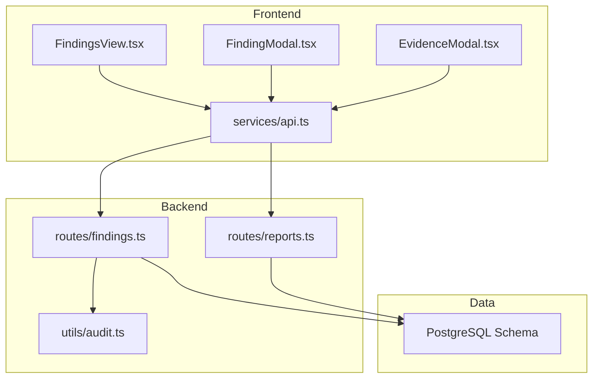

**Diagram sources**
- [FindingsView.tsx:1-306](file://src/components/FindingsView.tsx#L1-L306)
- [FindingModal.tsx:1-349](file://src/components/modals/FindingModal.tsx#L1-L349)
- [EvidenceModal.tsx:1-278](file://src/components/modals/EvidenceModal.tsx#L1-L278)
- [api.ts:284-333](file://src/services/api.ts#L284-L333)
- [findings.ts:1-335](file://server/routes/findings.ts#L1-L335)
- [reports.ts:1-219](file://server/routes/reports.ts#L1-L219)
- [audit.ts:1-32](file://server/utils/audit.ts#L1-L32)
- [schema.sql:200-283](file://database/schema.sql#L200-L283)

**Section sources**
- [FindingsView.tsx:1-306](file://src/components/FindingsView.tsx#L1-L306)
- [api.ts:284-333](file://src/services/api.ts#L284-L333)
- [findings.ts:1-335](file://server/routes/findings.ts#L1-L335)
- [schema.sql:200-283](file://database/schema.sql#L200-L283)

## Core Components
- FindingsView: Displays a searchable, filterable table of findings with columns for code, title/description, procurement/office, legal reference, risk level, estimated financial impact, status, and actions. Supports filtering by risk level, status, and text search; deletion by admin; and opening corrective action workflows.
- FindingModal: A comprehensive form to create or prefill findings with fields for procurement association, checklist item linkage, title, description, legal reference, possible irregularity, risk level, financial impact, responsible parties, recommended corrective action, deadline, and status. Includes validation and auto-defaults from checklist items.
- EvidenceModal: Enables attaching evidence files to an inspection and optionally linking to a checklist item; supports upload, listing, download, and delete operations.
- API Client: Provides typed methods to list, get, create, update, and delete findings; also handles evidence uploads and report retrieval.
- Backend Routes: Implement secure endpoints for listing findings with filters, retrieving details, creating/updating/deleting findings, and exporting reports.
- Audit Utility: Logs all create/update/delete actions with old/new values and IP address.

**Section sources**
- [FindingsView.tsx:28-306](file://src/components/FindingsView.tsx#L28-L306)
- [FindingModal.tsx:23-349](file://src/components/modals/FindingModal.tsx#L23-L349)
- [EvidenceModal.tsx:13-278](file://src/components/modals/EvidenceModal.tsx#L13-L278)
- [api.ts:284-333](file://src/services/api.ts#L284-L333)
- [findings.ts:8-335](file://server/routes/findings.ts#L8-L335)
- [audit.ts:3-32](file://server/utils/audit.ts#L3-L32)

## Architecture Overview
The Findings workflow integrates frontend state management, backend authorization and business logic, and persistent storage with auditability.

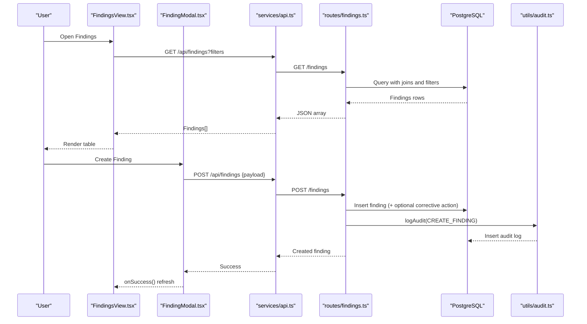

**Diagram sources**
- [FindingsView.tsx:46-80](file://src/components/FindingsView.tsx#L46-L80)
- [FindingModal.tsx:103-138](file://src/components/modals/FindingModal.tsx#L103-L138)
- [api.ts:284-333](file://src/services/api.ts#L284-L333)
- [findings.ts:8-221](file://server/routes/findings.ts#L8-L221)
- [audit.ts:3-32](file://server/utils/audit.ts#L3-L32)

## Detailed Component Analysis

### FindingsView: List, Filters, Actions
- Filtering: Supports risk_level, status, and free-text search across title, code, description, and procurement title. Filters are applied via query parameters to the backend.
- Display: Shows key attributes including finding_code, title/description, procurement_title/office_name, legal_reference, risk_level, estimated_financial_impact (formatted in NPR), status, and action buttons.
- Actions: Opens corrective action modal per finding; allows deletion for admins with confirmation.
- State: Maintains loading state, active finding selection, and filter states.

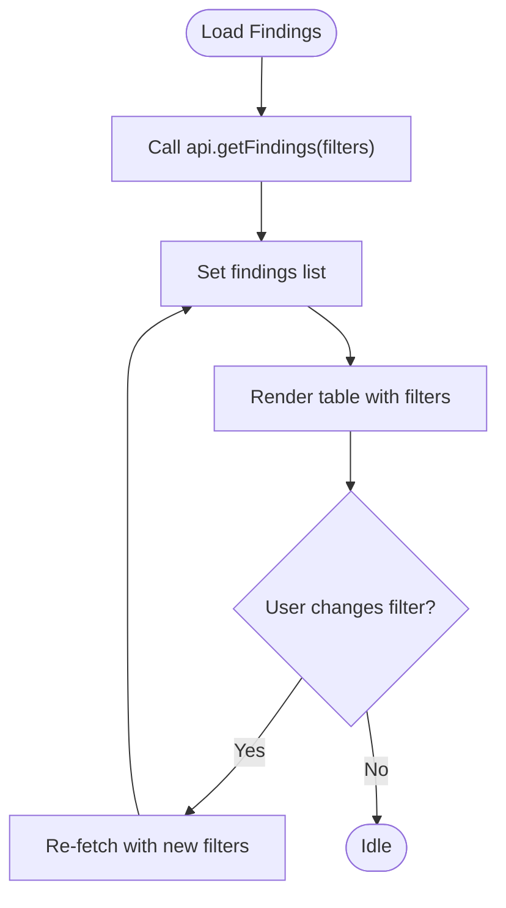

**Diagram sources**
- [FindingsView.tsx:46-80](file://src/components/FindingsView.tsx#L46-L80)
- [FindingsView.tsx:125-194](file://src/components/FindingsView.tsx#L125-L194)

**Section sources**
- [FindingsView.tsx:28-306](file://src/components/FindingsView.tsx#L28-L306)

### FindingModal: Creation Workflow, Validation, Defaults
- Preload: Accepts preloadData to prefill fields such as inspection_id, procurement_id, checklist_item_id, title, description, legal_reference, possible_irregularity, risk_level, and estimated_financial_impact. Sets default deadline to 15 days ahead when preloaded.
- Dropdowns: Loads procurements and master checklists; auto-fills responsible office based on selected procurement; auto-fills legal_reference, possible_irregularity, title, and risk_level based on selected checklist item.
- Validation: Requires procurement, title, and description; shows error messages if missing.
- Submission: Sends payload to create a finding; sets status to “Corrective Action Required” if recommended corrective action is provided; otherwise defaults to “Open”.
- Integration: Uses api.createFinding and triggers onSuccess callback to refresh parent view.

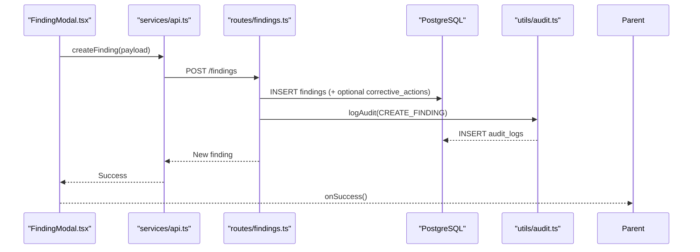

**Diagram sources**
- [FindingModal.tsx:49-138](file://src/components/modals/FindingModal.tsx#L49-L138)
- [findings.ts:122-221](file://server/routes/findings.ts#L122-L221)
- [audit.ts:3-32](file://server/utils/audit.ts#L3-L32)

**Section sources**
- [FindingModal.tsx:23-349](file://src/components/modals/FindingModal.tsx#L23-L349)
- [findings.ts:122-221](file://server/routes/findings.ts#L122-L221)

### Evidence Attachment: EvidenceModal and Upload Flow
- Upload: Users select a file and provide metadata (document number/date, page number, description). The modal builds FormData and calls api.uploadEvidence.
- Listing: Loads evidence files for an inspection and optionally filtered by checklist item; displays file info with download and delete options.
- Backend: Evidence route persists files and logs audit events.

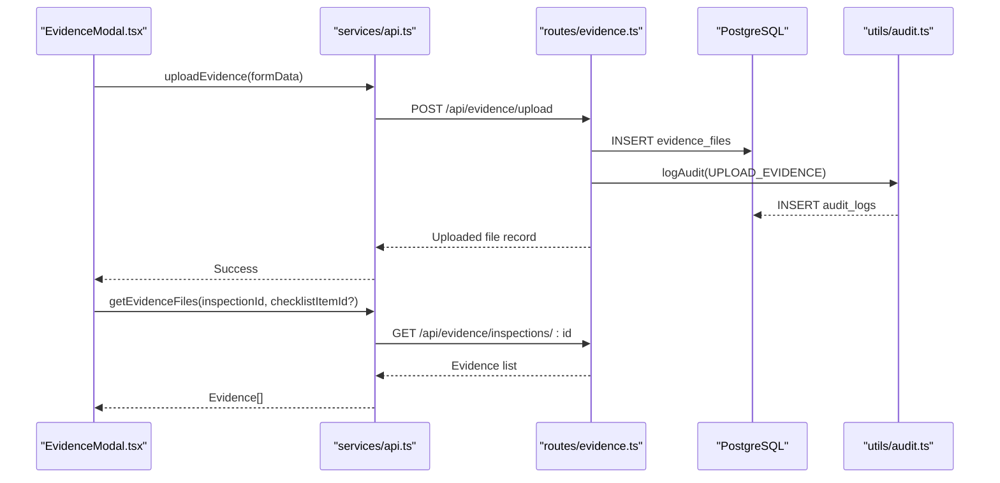

**Diagram sources**
- [EvidenceModal.tsx:31-91](file://src/components/modals/EvidenceModal.tsx#L31-L91)
- [api.ts:382-411](file://src/services/api.ts#L382-L411)
- [schema.sql:182-198](file://database/schema.sql#L182-L198)

**Section sources**
- [EvidenceModal.tsx:1-278](file://src/components/modals/EvidenceModal.tsx#L1-L278)
- [api.ts:382-411](file://src/services/api.ts#L382-L411)

### Categorization System, Risk Levels, Priority Ranking
- Categories: Findings can be linked to a checklist item that carries metadata like inspection_area, legal_reference, possible_irregularity, and default_risk_level. Selecting a checklist item auto-populates these fields to standardize categorization.
- Risk Levels: Enumerated as Low, Medium, High, Critical (Nepali equivalents used in UI). Default risk level may come from checklist item; users can adjust.
- Priority: Derived from risk_level and status; high/critical risks are visually highlighted. Status progression includes Open, Corrective Action Required, Under Review, Resolved, Closed.

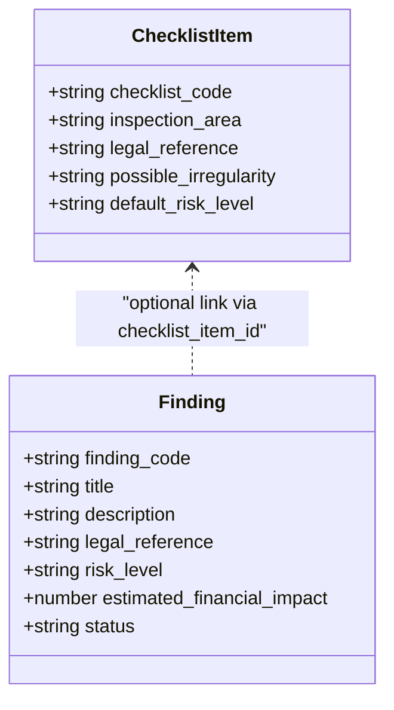

**Diagram sources**
- [index.ts:123-137](file://src/types/index.ts#L123-L137)
- [index.ts:205-235](file://src/types/index.ts#L205-L235)

**Section sources**
- [FindingModal.tsx:86-101](file://src/components/modals/FindingModal.tsx#L86-L101)
- [index.ts:123-137](file://src/types/index.ts#L123-L137)
- [index.ts:205-235](file://src/types/index.ts#L205-L235)

### Search and Filtering Capabilities
- Risk Level Filter: Dropdown to filter by risk_level.
- Status Filter: Dropdown to filter by status.
- Text Search: Free-text search across title, finding_code, description, and procurement title.
- Procurement Association: Backend supports filtering by procurement_id and inspection_id; UI exposes risk/status/search; additional filters can be added via API client.

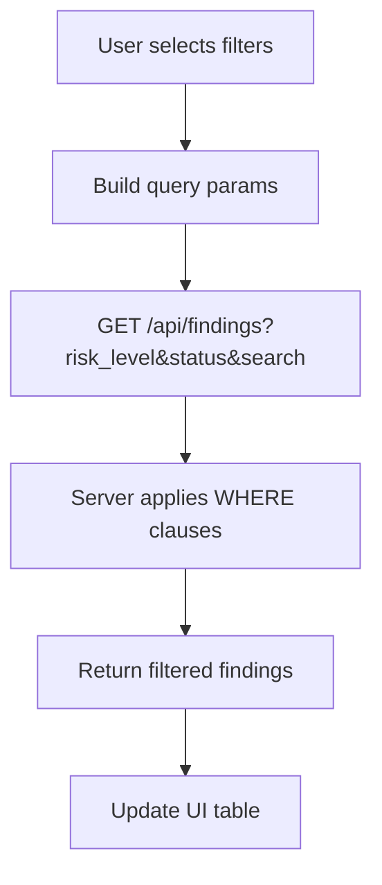

**Diagram sources**
- [FindingsView.tsx:46-80](file://src/components/FindingsView.tsx#L46-L80)
- [findings.ts:8-76](file://server/routes/findings.ts#L8-L76)

**Section sources**
- [FindingsView.tsx:125-194](file://src/components/FindingsView.tsx#L125-L194)
- [findings.ts:8-76](file://server/routes/findings.ts#L8-L76)

### Relationship Mapping: Findings, Procurements, Inspections, Corrective Actions
- Findings link to:
  - Procurements (procurement_id): Provides context of project, contractor, office, and fiscal year.
  - Inspections (inspection_id): Optional linkage to specific inspection instances.
  - Checklist Items (checklist_item_id): Optional linkage to master checklist for categorization and legal references.
  - Checklist Results (checklist_result_id): Optional linkage to inspection checklist result.
- Corrective Actions:
  - Automatically created when recommended_corrective_action is provided during finding creation.
  - Linked to findings and optionally to inspections; track progress, deadlines, verification.

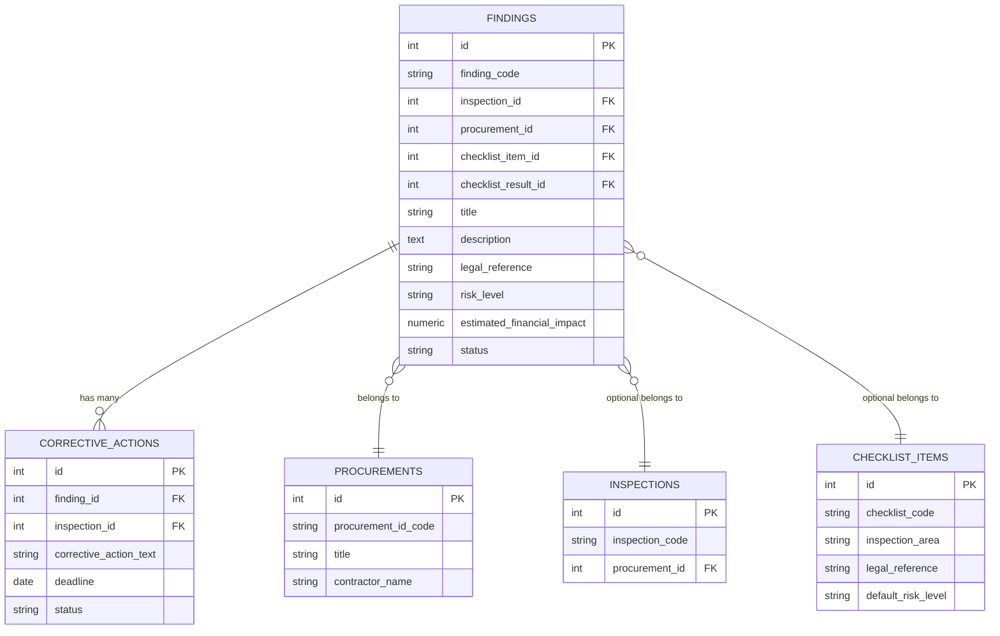

**Diagram sources**
- [schema.sql:145-244](file://database/schema.sql#L145-L244)

**Section sources**
- [findings.ts:122-221](file://server/routes/findings.ts#L122-L221)
- [schema.sql:145-244](file://database/schema.sql#L145-L244)

### Approval Workflow, Version Control, Audit Trail
- Approval Workflow:
  - Status transitions reflect review stages: Open → Corrective Action Required → Under Review → Resolved → Closed.
  - Updating status is supported via PUT /findings/:id; requires appropriate roles.
- Version Control:
  - Each update records updated_at timestamp; backend retains old values in audit logs for change tracking.
- Audit Trail:
  - All create/update/delete actions on findings are logged with user identity, entity type, entity ID, old/new values, and IP address.

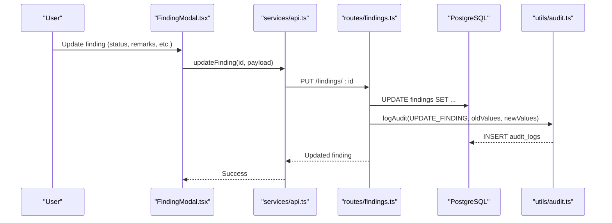

**Diagram sources**
- [FindingModal.tsx:103-138](file://src/components/modals/FindingModal.tsx#L103-L138)
- [findings.ts:223-302](file://server/routes/findings.ts#L223-L302)
- [audit.ts:3-32](file://server/utils/audit.ts#L3-L32)

**Section sources**
- [findings.ts:223-302](file://server/routes/findings.ts#L223-L302)
- [audit.ts:3-32](file://server/utils/audit.ts#L3-L32)

### Reporting Features: Analysis and Trend Identification
- Inspection Report: Aggregates inspection details, checklist results, findings, corrective actions, evidence, and statistics for a given inspection.
- CSV Exports:
  - Procurements export for bulk analysis.
  - Findings export including code, procurement association, office, title, risk level, financial impact, legal reference, deadline, and status.

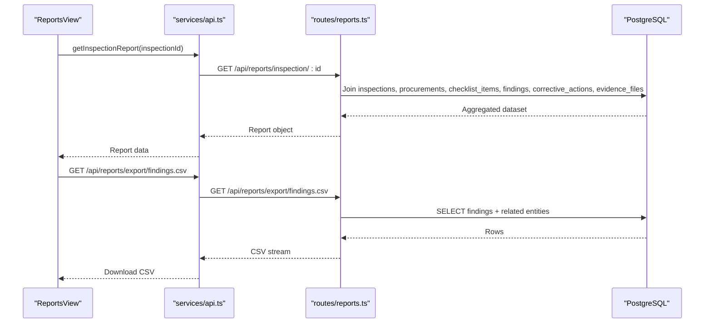

**Diagram sources**
- [reports.ts:7-140](file://server/routes/reports.ts#L7-L140)
- [reports.ts:180-216](file://server/routes/reports.ts#L180-L216)
- [api.ts:419-425](file://src/services/api.ts#L419-L425)

**Section sources**
- [reports.ts:7-219](file://server/routes/reports.ts#L7-L219)

## Dependency Analysis
- UI Dependencies:
  - FindingsView depends on services/api.ts for data fetching and uses types from index.ts for typing.
  - FindingModal depends on services/api.ts and types for dropdowns and submission payloads.
  - EvidenceModal depends on services/api.ts for evidence operations.
- Backend Dependencies:
  - findings.ts depends on db.ts for queries, auth middleware for security, and audit.ts for logging.
  - reports.ts depends on db.ts for complex joins and aggregations.
- Data Dependencies:
  - Schema defines relationships between findings, procurements, inspections, checklist items/results, corrective actions, evidence files, and audit logs.

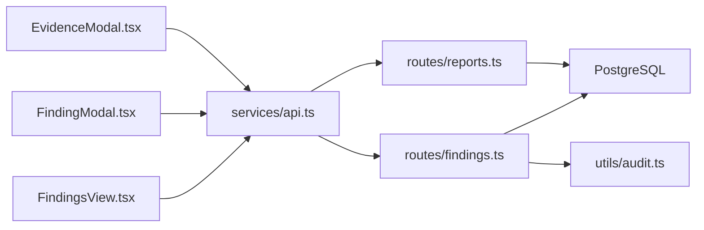

**Diagram sources**
- [FindingsView.tsx:1-306](file://src/components/FindingsView.tsx#L1-L306)
- [FindingModal.tsx:1-349](file://src/components/modals/FindingModal.tsx#L1-L349)
- [EvidenceModal.tsx:1-278](file://src/components/modals/EvidenceModal.tsx#L1-L278)
- [api.ts:284-333](file://src/services/api.ts#L284-L333)
- [findings.ts:1-335](file://server/routes/findings.ts#L1-L335)
- [reports.ts:1-219](file://server/routes/reports.ts#L1-L219)
- [audit.ts:1-32](file://server/utils/audit.ts#L1-L32)

**Section sources**
- [api.ts:284-333](file://src/services/api.ts#L284-L333)
- [findings.ts:1-335](file://server/routes/findings.ts#L1-L335)
- [reports.ts:1-219](file://server/routes/reports.ts#L1-L219)

## Performance Considerations
- Indexes: Database indexes exist on frequently queried columns such as findings.risk_level, findings.inspection_id, corrective_actions.finding_id, and audit_logs.user_id to optimize filtering and joins.
- Query Efficiency: Findings list endpoint constructs dynamic WHERE clauses using parameterized queries to avoid SQL injection and improve performance.
- Pagination: Not implemented in current endpoints; consider adding pagination for large datasets to reduce payload size and rendering time.
- Caching: Consider client-side caching for master data (procurements, checklists) to reduce repeated requests.

[No sources needed since this section provides general guidance]

## Troubleshooting Guide
- Loading Errors:
  - If findings fail to load, check network responses and ensure authentication token is present. Verify server logs for errors in fetch findings handler.
- Validation Errors:
  - FindingModal enforces required fields; ensure procurement, title, and description are provided before submission.
- Deletion Permissions:
  - Only admins can delete findings; verify role permissions if deletion fails.
- Evidence Upload Issues:
  - Ensure file size and type are acceptable; confirm inspection_id is provided; check server logs for upload errors.
- Audit Log Gaps:
  - If audit entries are missing, verify audit utility is invoked and database write permissions are correct.

**Section sources**
- [findings.ts:72-76](file://server/routes/findings.ts#L72-L76)
- [findings.ts:145-148](file://server/routes/findings.ts#L145-L148)
- [findings.ts:305-331](file://server/routes/findings.ts#L305-L331)
- [EvidenceModal.tsx:49-91](file://src/components/modals/EvidenceModal.tsx#L49-L91)
- [audit.ts:13-30](file://server/utils/audit.ts#L13-L30)

## Conclusion
The FindingsView component provides a robust interface for identifying, documenting, and managing issues throughout the procurement inspection process. It integrates seamlessly with FindingModal for structured data entry, supports comprehensive filtering and search, links findings to procurements, inspections, and corrective actions, and maintains a complete audit trail. Reporting features enable analysis and trend identification through aggregated inspection reports and CSV exports.

[No sources needed since this section summarizes without analyzing specific files]

## Appendices

### Key Data Models and Fields
- Finding: Contains unique code, associations, descriptive fields, legal references, risk level, financial impact, responsible parties, deadlines, status, and timestamps.
- Checklist Item: Provides standardized categories, legal references, possible irregularities, and default risk levels to streamline finding creation.
- Corrective Action: Tracks remediation steps, responsibilities, deadlines, progress notes, completion dates, and verification statuses.
- Evidence File: Stores uploaded documents with metadata and links to inspections/checklist items.

**Section sources**
- [index.ts:205-280](file://src/types/index.ts#L205-L280)
- [schema.sql:126-244](file://database/schema.sql#L126-L244)