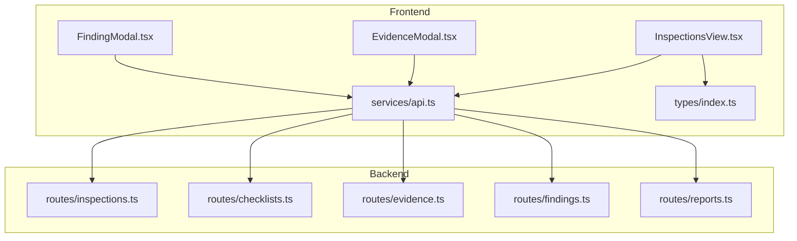
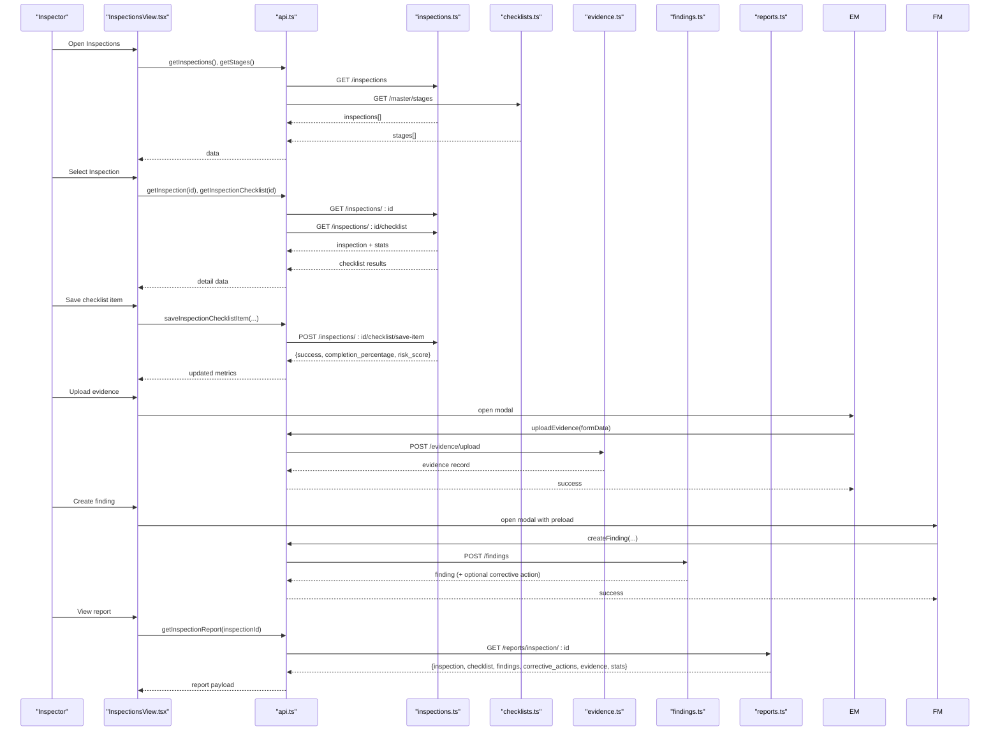
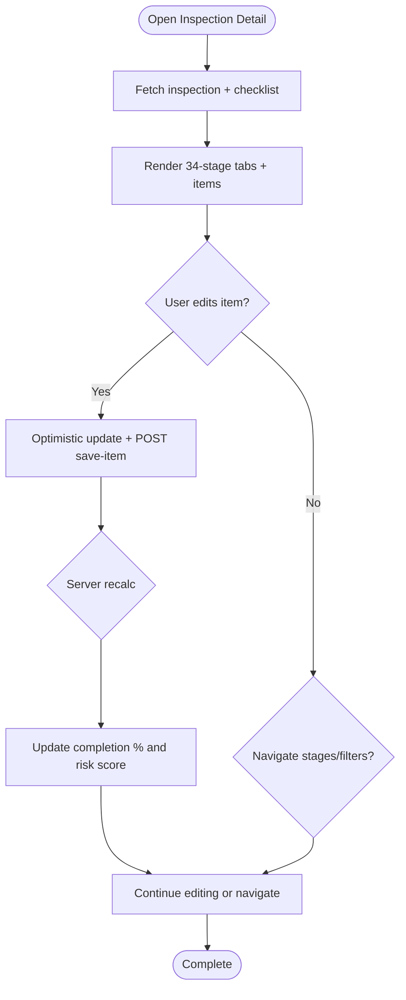
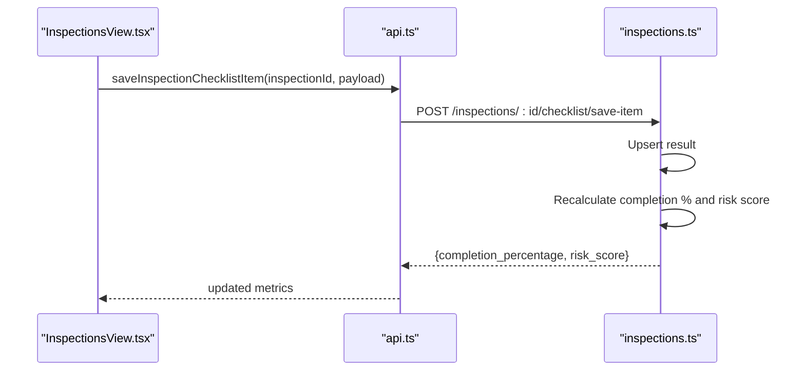
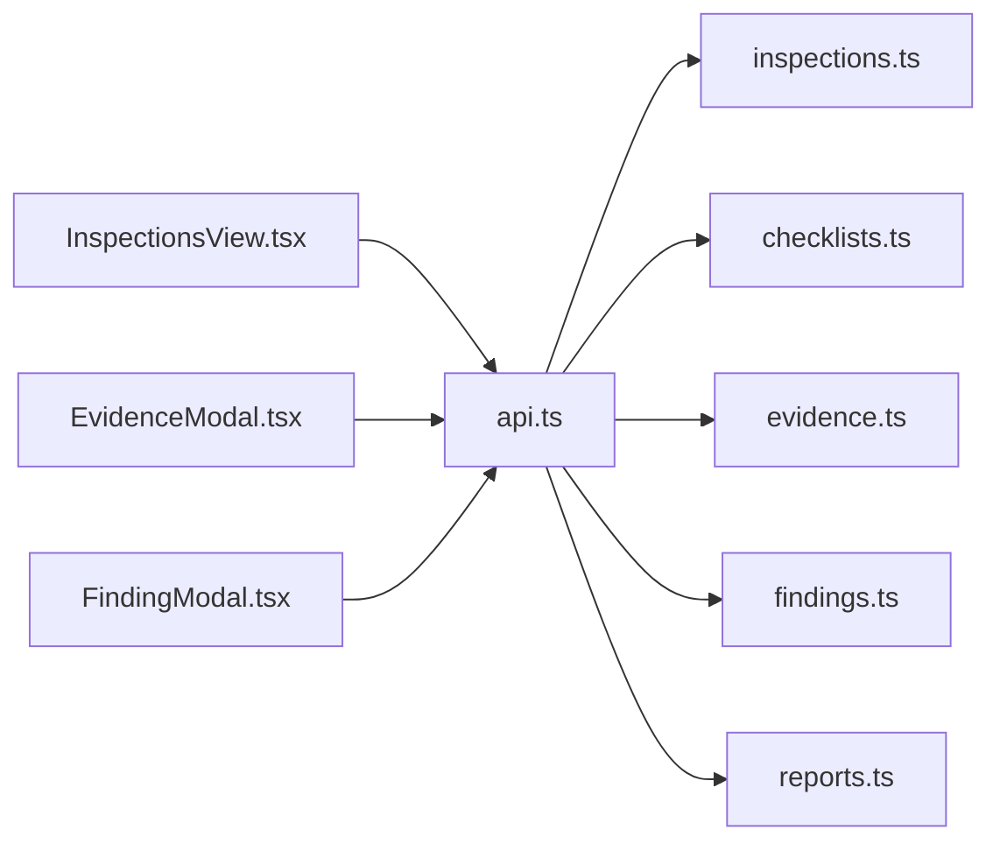
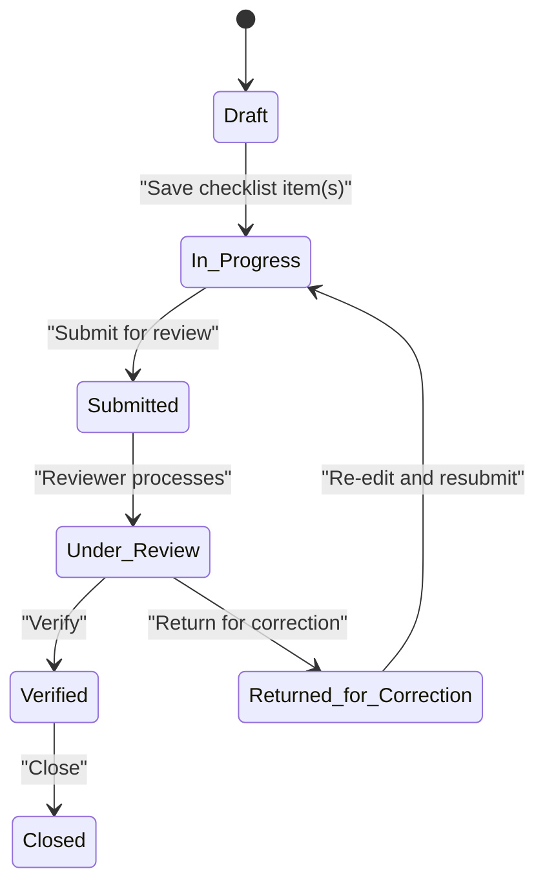

# Inspections View

<cite>
**Referenced Files in This Document**
- [InspectionsView.tsx](file://src/components/InspectionsView.tsx)
- [api.ts](file://src/services/api.ts)
- [index.ts](file://src/types/index.ts)
- [inspections.ts](file://server/routes/inspections.ts)
- [checklists.ts](file://server/routes/checklists.ts)
- [evidence.ts](file://server/routes/evidence.ts)
- [findings.ts](file://server/routes/findings.ts)
- [reports.ts](file://server/routes/reports.ts)
- [EvidenceModal.tsx](file://src/components/modals/EvidenceModal.tsx)
- [FindingModal.tsx](file://src/components/modals/FindingModal.tsx)
</cite>

## Table of Contents
1. [Introduction](#introduction)
2. [Project Structure](#project-structure)
3. [Core Components](#core-components)
4. [Architecture Overview](#architecture-overview)
5. [Detailed Component Analysis](#detailed-component-analysis)
6. [Dependency Analysis](#dependency-analysis)
7. [Performance Considerations](#performance-considerations)
8. [Troubleshooting Guide](#troubleshooting-guide)
9. [Conclusion](#conclusion)
10. [Appendices](#appendices)

## Introduction
This document provides comprehensive documentation for the InspectionsView component and its surrounding inspection workflow. It explains how inspections are initiated, evaluated through a 34-stage checklist matrix, managed across statuses, and completed with evidence, findings, and reporting. It also details integration points with checklists, evidence collection, real-time progress tracking, API interactions, form handling, validation rules, error recovery, and export/reporting capabilities.

## Project Structure
The inspection feature spans frontend components, services, types, and backend routes:
- Frontend:
  - InspectionsView orchestrates the inspection lifecycle UI and state.
  - EvidenceModal and FindingModal support evidence upload and finding creation.
  - api.ts centralizes HTTP calls to backend endpoints.
  - index.ts defines shared TypeScript interfaces for data models.
- Backend:
  - inspections.ts implements CRUD for inspections and checklist result saving with auto-recalculation.
  - checklists.ts serves master checklist items and stages.
  - evidence.ts handles file uploads, listing, download, and deletion.
  - findings.ts manages findings and optional corrective actions.
  - reports.ts aggregates full inspection report packets and CSV exports.

**Diagram sources**
- [InspectionsView.tsx:1-924](file://src/components/InspectionsView.tsx#L1-L924)
- [api.ts:1-440](file://src/services/api.ts#L1-L440)
- [index.ts:1-338](file://src/types/index.ts#L1-L338)
- [inspections.ts:1-409](file://server/routes/inspections.ts#L1-L409)
- [checklists.ts:1-192](file://server/routes/checklists.ts#L1-L192)
- [evidence.ts:1-195](file://server/routes/evidence.ts#L1-L195)
- [findings.ts:1-335](file://server/routes/findings.ts#L1-L335)
- [reports.ts:1-219](file://server/routes/reports.ts#L1-L219)

**Section sources**
- [InspectionsView.tsx:1-924](file://src/components/InspectionsView.tsx#L1-L924)
- [api.ts:1-440](file://src/services/api.ts#L1-L440)
- [index.ts:1-338](file://src/types/index.ts#L1-L338)
- [inspections.ts:1-409](file://server/routes/inspections.ts#L1-L409)
- [checklists.ts:1-192](file://server/routes/checklists.ts#L1-L192)
- [evidence.ts:1-195](file://server/routes/evidence.ts#L1-L195)
- [findings.ts:1-335](file://server/routes/findings.ts#L1-L335)
- [reports.ts:1-219](file://server/routes/reports.ts#L1-L219)

## Core Components
- InspectionsView: Manages list view, detail view (34-stage evaluation), stage navigation, filters, status updates, and integrates with Evidence and Finding modals.
- api.ts: Provides typed methods for inspections, checklists, evidence, findings, reports, and audit logs.
- Types: Strongly-typed models for Inspection, ChecklistStage, InspectionChecklistResult, Finding, EvidenceFile, etc.
- Backend routes: Implement business logic, validations, role-based access, audit logging, and data aggregation.

Key responsibilities:
- Lifecycle management: Draft → In Progress → Submitted → Under Review → Verified/Closed.
- Checklist-driven evaluation per stage with compliance status and risk scoring.
- Evidence attachment and linkage to specific checklist items.
- Findings registration with optional corrective action creation.
- Reporting and export via aggregated endpoints.

**Section sources**
- [InspectionsView.tsx:1-924](file://src/components/InspectionsView.tsx#L1-L924)
- [api.ts:1-440](file://src/services/api.ts#L1-L440)
- [index.ts:1-338](file://src/types/index.ts#L1-L338)

## Architecture Overview
The InspectionsView coordinates user interactions and delegates data operations to api.ts, which communicates with backend routes. The backend enforces authentication, authorization, validation, and persistence, while also computing derived metrics like completion percentage and risk score.

**Diagram sources**
- [InspectionsView.tsx:85-127](file://src/components/InspectionsView.tsx#L85-L127)
- [api.ts:213-282](file://src/services/api.ts#L213-L282)
- [inspections.ts:9-409](file://server/routes/inspections.ts#L9-L409)
- [checklists.ts:9-52](file://server/routes/checklists.ts#L9-L52)
- [evidence.ts:71-134](file://server/routes/evidence.ts#L71-L134)
- [findings.ts:123-221](file://server/routes/findings.ts#L123-L221)
- [reports.ts:8-139](file://server/routes/reports.ts#L8-L139)

## Detailed Component Analysis

### InspectionsView Component
- Responsibilities:
  - Load and display inspections list with search and status filters.
  - Open inspection detail with 34-stage horizontal navigation and per-stage filtering.
  - Manage checklist item edits inline with immediate local state updates and optimistic UX.
  - Update inspection status based on roles and workflow rules.
  - Integrate Evidence and Finding modals for evidence upload and finding creation.
  - Trigger report printing via callback.
- Key flows:
  - Data loading: fetches inspections and stages; optionally opens an inspection by procurement id.
  - Stage navigation: auto-scrolls active stage button; jump to first pending item; filters by pending/done/issues.
  - Checklist item save: merges local state, posts to server, updates completion percentage and risk score, transitions status from Draft to In Progress when applicable.
  - Status update: enforces role-based permissions on server side; updates UI and refreshes list.
- Error handling:
  - Toast notifications for errors during load/save/update.
  - Reverts local state on save failure to maintain consistency.
- Performance considerations:
  - Optimistic UI updates for checklist items reduce perceived latency.
  - Parallel fetching of inspection detail and checklist reduces load time.

**Diagram sources**
- [InspectionsView.tsx:110-180](file://src/components/InspectionsView.tsx#L110-L180)
- [InspectionsView.tsx:196-254](file://src/components/InspectionsView.tsx#L196-L254)
- [InspectionsView.tsx:273-777](file://src/components/InspectionsView.tsx#L273-L777)

**Section sources**
- [InspectionsView.tsx:1-924](file://src/components/InspectionsView.tsx#L1-L924)

### API Layer (api.ts)
- Centralized client methods for:
  - Inspections: list, get, create, update, checklist retrieval, save-item.
  - Checklists: master items and stage-specific queries.
  - Evidence: list, upload, delete.
  - Findings: list, get, create, update, delete.
  - Reports: inspection report packet and CSV exports.
  - Audit logs: query logs filtered by action/entity type.
- Authentication:
  - Attaches Bearer token from localStorage for protected endpoints.
- Error handling:
  - Throws descriptive errors on non-ok responses, surfaced to UI via try/catch blocks.

**Section sources**
- [api.ts:1-440](file://src/services/api.ts#L1-L440)

### Backend Routes

#### Inspections Route (inspections.ts)
- Endpoints:
  - GET /inspections: lists inspections with joins to procurements, offices, users; supports filters by status, procurement_id, office_id, search.
  - GET /inspections/:id: returns inspection details plus computed statistics.
  - POST /inspections: creates inspection with generated code, sets initial status to Draft, logs audit.
  - PUT /inspections/:id: updates metadata/status with role checks for Verified/Closed; logs audit.
  - GET /inspections/:id/checklist: returns checklist items with existing results and counts for evidence/findings.
  - POST /inspections/:id/checklist/save-item: upserts result, recalculates completion percentage and risk score, updates status if needed, logs audit.
- Validation and security:
  - Role-based restrictions for verification/close actions.
  - Input validation for required fields.
- Derived metrics:
  - Completion percentage excludes Not Applicable items.
  - Risk score computed from high and critical risk items.

**Diagram sources**
- [api.ts:262-282](file://src/services/api.ts#L262-L282)
- [inspections.ts:309-406](file://server/routes/inspections.ts#L309-L406)

**Section sources**
- [inspections.ts:1-409](file://server/routes/inspections.ts#L1-L409)

#### Checklists Route (checklists.ts)
- Endpoints:
  - GET /checklists: master checklist items with optional stage_number and is_active filters.
  - GET /checklists/stages/:stage: items for a specific stage.
  - POST /checklists: admin-only creation with validation and audit logging.
  - PUT /checklists/:id: admin-only update preserving history.
- Purpose:
  - Supplies standardized evaluation criteria used by inspections.

**Section sources**
- [checklists.ts:1-192](file://server/routes/checklists.ts#L1-L192)

#### Evidence Route (evidence.ts)
- Endpoints:
  - GET /evidence/inspections/:id: list evidence files for an inspection, optionally filtered by checklist_item_id.
  - POST /evidence/upload: accepts multipart/form-data with file and metadata; validates allowed extensions and size; stores file and records metadata; logs audit.
  - GET /evidence/file/:id: downloads stored file.
  - DELETE /evidence/:id: deletes file from disk and database; logs audit.
- Integration:
  - Linked to inspection and optionally to a specific checklist item.

**Section sources**
- [evidence.ts:1-195](file://server/routes/evidence.ts#L1-L195)

#### Findings Route (findings.ts)
- Endpoints:
  - GET /findings: list with filters (risk_level, status, procurement_id, inspection_id, office_id, search).
  - GET /findings/:id: single finding with associated corrective actions.
  - POST /findings: create finding with optional recommended corrective action; generates finding code; logs audit.
  - PUT /findings/:id: update with audit logging.
  - DELETE /findings/:id: admin-only deletion with audit logging.
- Workflow:
  - If recommended corrective action provided, automatically creates a corrective action record.

**Section sources**
- [findings.ts:1-335](file://server/routes/findings.ts#L1-L335)

#### Reports Route (reports.ts)
- Endpoints:
  - GET /reports/inspection/:id: aggregates inspection, checklist results, findings, corrective actions, evidence, and statistics into a report packet.
  - GET /reports/export/procurements.csv: CSV export of procurements.
  - GET /reports/export/findings.csv: CSV export of findings.
- Usage:
  - Supports printing/exporting inspection dossiers and bulk data exports.

**Section sources**
- [reports.ts:1-219](file://server/routes/reports.ts#L1-L219)

### Modals

#### EvidenceModal
- Functionality:
  - Lists evidence files for an inspection and optional checklist item.
  - Uploads new evidence with metadata (document number/date, page number, description).
  - Deletes evidence with confirmation.
- Integration:
  - Called from InspectionsView to attach evidence to a checklist item.

**Section sources**
- [EvidenceModal.tsx:1-279](file://src/components/modals/EvidenceModal.tsx#L1-L279)

#### FindingModal
- Functionality:
  - Creates findings with preloaded context from InspectionsView.
  - Validates required fields and submits to backend.
  - Optionally creates corrective actions via backend logic.
- Integration:
  - Receives preloadData including inspection_id, procurement_id, checklist_item_id, title, description, legal_reference, possible_irregularity, risk_level, estimated_financial_impact.

**Section sources**
- [FindingModal.tsx:1-349](file://src/components/modals/FindingModal.tsx#L1-L349)

## Dependency Analysis
- Coupling:
  - InspectionsView depends on api.ts for all backend interactions and on types for model definitions.
  - api.ts depends on backend routes for data operations.
  - Backend routes depend on database queries and middleware for auth/audit.
- Cohesion:
  - Each route encapsulates a domain area (inspections, checklists, evidence, findings, reports).
  - Modal components encapsulate focused workflows (evidence upload, finding creation).
- External dependencies:
  - Multer for file uploads.
  - Express Router for HTTP endpoints.
  - Database via query helper.

**Diagram sources**
- [InspectionsView.tsx:1-924](file://src/components/InspectionsView.tsx#L1-L924)
- [api.ts:1-440](file://src/services/api.ts#L1-L440)
- [inspections.ts:1-409](file://server/routes/inspections.ts#L1-L409)
- [checklists.ts:1-192](file://server/routes/checklists.ts#L1-L192)
- [evidence.ts:1-195](file://server/routes/evidence.ts#L1-L195)
- [findings.ts:1-335](file://server/routes/findings.ts#L1-L335)
- [reports.ts:1-219](file://server/routes/reports.ts#L1-L219)

**Section sources**
- [InspectionsView.tsx:1-924](file://src/components/InspectionsView.tsx#L1-L924)
- [api.ts:1-440](file://src/services/api.ts#L1-L440)
- [inspections.ts:1-409](file://server/routes/inspections.ts#L1-L409)
- [checklists.ts:1-192](file://server/routes/checklists.ts#L1-L192)
- [evidence.ts:1-195](file://server/routes/evidence.ts#L1-L195)
- [findings.ts:1-335](file://server/routes/findings.ts#L1-L335)
- [reports.ts:1-219](file://server/routes/reports.ts#L1-L219)

## Performance Considerations
- Optimistic UI updates:
  - Checklist item saves immediately reflect locally before server response to improve responsiveness.
- Parallel requests:
  - Loading inspection detail and checklist concurrently reduces perceived latency.
- Efficient filtering:
  - Client-side filtering for stages and statuses avoids extra network calls.
- Server-side calculations:
  - Completion percentage and risk score computed once per save-item to avoid redundant recalculations.
- File uploads:
  - Size limits and allowed extensions prevent large or unsupported files from impacting performance.

[No sources needed since this section provides general guidance]

## Troubleshooting Guide
Common issues and resolutions:
- Failed to load inspections:
  - Check network connectivity and authentication token; verify backend availability.
- Failed to load inspection detail:
  - Ensure inspection exists and user has permission; check server logs for SQL errors.
- Save checklist result failed:
  - Validate required fields (checklist_item_id, compliance_status); revert local state on error; inspect server error message.
- Evidence upload failed:
  - Confirm file extension and size within limits; ensure inspection_id is provided; check server error for file filter rejection.
- Finding creation failed:
  - Validate required fields (title, description, procurement_id); check server validation messages.
- Report load failed:
  - Verify inspection ID; check aggregated queries for missing relationships.

Error handling patterns:
- Frontend:
  - Try/catch around API calls; show toast notifications with user-friendly messages.
  - Revert local state on failures to maintain consistency.
- Backend:
  - Return structured error objects with messages; log stack traces for debugging.

**Section sources**
- [InspectionsView.tsx:102-127](file://src/components/InspectionsView.tsx#L102-L127)
- [InspectionsView.tsx:170-180](file://src/components/InspectionsView.tsx#L170-L180)
- [api.ts:226-282](file://src/services/api.ts#L226-L282)
- [evidence.ts:71-134](file://server/routes/evidence.ts#L71-L134)
- [findings.ts:123-221](file://server/routes/findings.ts#L123-L221)
- [reports.ts:8-139](file://server/routes/reports.ts#L8-L139)

## Conclusion
The InspectionsView component provides a robust, stage-driven inspection workflow with integrated checklist evaluation, evidence collection, findings documentation, and reporting. It leverages optimistic UI updates, parallel data fetching, and server-side validations to deliver a responsive and reliable experience. Role-based controls and audit logging ensure governance and traceability throughout the inspection lifecycle.

[No sources needed since this section summarizes without analyzing specific files]

## Appendices

### Inspection Lifecycle Summary
- Initiation: Create inspection linked to a procurement; initial status set to Draft.
- Evaluation: Complete checklist items per stage; system computes completion percentage and risk score.
- Submission: Transition to Submitted for review; verified by authorized roles.
- Completion: Finalize as Verified or Closed; generate report dossier and export as needed.

**Diagram sources**
- [inspections.ts:149-197](file://server/routes/inspections.ts#L149-L197)
- [inspections.ts:199-255](file://server/routes/inspections.ts#L199-L255)

### API Interactions Reference
- Inspections:
  - List: GET /inspections
  - Get: GET /inspections/:id
  - Create: POST /inspections
  - Update: PUT /inspections/:id
  - Checklist: GET /inspections/:id/checklist
  - Save Item: POST /inspections/:id/checklist/save-item
- Checklists:
  - Master: GET /checklists
  - By Stage: GET /checklists/stages/:stage
  - Create/Update: Admin-only endpoints
- Evidence:
  - List: GET /evidence/inspections/:id
  - Upload: POST /evidence/upload
  - Download: GET /evidence/file/:id
  - Delete: DELETE /evidence/:id
- Findings:
  - List/Get/Create/Update/Delete: Standard CRUD with filters
- Reports:
  - Inspection Report: GET /reports/inspection/:id
  - CSV Exports: GET /reports/export/procurements.csv, GET /reports/export/findings.csv

**Section sources**
- [api.ts:213-438](file://src/services/api.ts#L213-L438)
- [inspections.ts:9-409](file://server/routes/inspections.ts#L9-L409)
- [checklists.ts:9-192](file://server/routes/checklists.ts#L9-L192)
- [evidence.ts:44-195](file://server/routes/evidence.ts#L44-L195)
- [findings.ts:9-335](file://server/routes/findings.ts#L9-L335)
- [reports.ts:8-219](file://server/routes/reports.ts#L8-L219)