# Master Checklist View

<cite>
**Referenced Files in This Document**
- [MasterChecklistView.tsx](file://src/components/MasterChecklistView.tsx)
- [api.ts](file://src/services/api.ts)
- [index.ts](file://src/types/index.ts)
- [checklists.ts](file://server/routes/checklists.ts)
- [master.ts](file://server/routes/master.ts)
- [schema.sql](file://database/schema.sql)
</cite>

## Table of Contents
1. [Introduction](#introduction)
2. [Project Structure](#project-structure)
3. [Core Components](#core-components)
4. [Architecture Overview](#architecture-overview)
5. [Detailed Component Analysis](#detailed-component-analysis)
6. [Dependency Analysis](#dependency-analysis)
7. [Performance Considerations](#performance-considerations)
8. [Troubleshooting Guide](#troubleshooting-guide)
9. [Conclusion](#conclusion)
10. [Appendices](#appendices)

## Introduction
This document provides detailed documentation for the MasterChecklistView component, which manages standardized inspection checklists organized by procurement stages, legal references, and compliance requirements. It explains how checklist items are structured, filtered, exported, and integrated with inspections to ensure consistent application of standards across all inspections. It also covers risk level assignment, scoring mechanisms, compliance status definitions, and change tracking via audit logs. Where applicable, it addresses versioning considerations and outlines capabilities for export and training material generation.

## Project Structure
The MasterChecklistView is a React component that consumes backend APIs to display and manage master checklist data. The relevant parts of the codebase include:
- Frontend component for UI and client-side filtering/export
- API service layer for HTTP calls
- Backend routes for reading/updating checklist items and stages
- Database schema defining checklist stages, items, and related entities

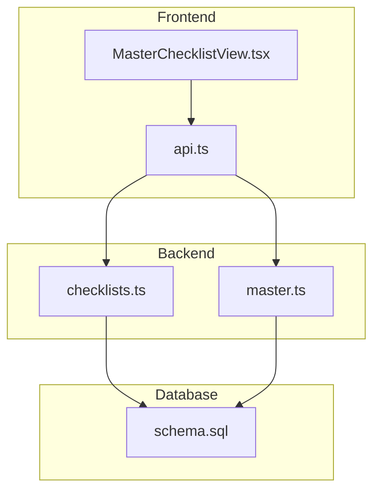

**Diagram sources**
- [MasterChecklistView.tsx:1-453](file://src/components/MasterChecklistView.tsx#L1-L453)
- [api.ts:76-210](file://src/services/api.ts#L76-L210)
- [checklists.ts:8-192](file://server/routes/checklists.ts#L8-L192)
- [master.ts:8-22](file://server/routes/master.ts#L8-L22)
- [schema.sql:116-143](file://database/schema.sql#L116-L143)

**Section sources**
- [MasterChecklistView.tsx:1-453](file://src/components/MasterChecklistView.tsx#L1-L453)
- [api.ts:76-210](file://src/services/api.ts#L76-L210)
- [checklists.ts:8-192](file://server/routes/checklists.ts#L8-L192)
- [master.ts:8-22](file://server/routes/master.ts#L8-L22)
- [schema.sql:116-143](file://database/schema.sql#L116-L143)

## Core Components
- MasterChecklistView (React component): Loads checklist items and stages, groups items by stage, supports search/filter by stage and risk level, and provides print/CSV export.
- API service: Provides methods to fetch master checklists and stages, and to create/update checklist items.
- Backend routes: Expose endpoints to read stages and checklist items, and to add or update checklist items with audit logging.
- Database schema: Defines tables for checklist stages, checklist items, and related entities used by inspections.

Key responsibilities:
- Display checklist items grouped by procurement stages
- Filter by stage and default risk level
- Search across codes, areas, questions, legal references, and required documents
- Export current filtered set to CSV
- Print-friendly view
- Admin-only creation and updates with audit trail

**Section sources**
- [MasterChecklistView.tsx:30-181](file://src/components/MasterChecklistView.tsx#L30-L181)
- [api.ts:76-210](file://src/services/api.ts#L76-L210)
- [checklists.ts:8-192](file://server/routes/checklists.ts#L8-L192)
- [master.ts:8-22](file://server/routes/master.ts#L8-L22)
- [schema.sql:116-143](file://database/schema.sql#L116-L143)

## Architecture Overview
The MasterChecklistView orchestrates data fetching and rendering as follows:
- On mount, it fetches both checklist items and stages concurrently
- Client-side filters group and sort items by stage and apply search/risk filters
- Export and print actions operate on the filtered dataset
- Admin operations (create/update) go through protected endpoints and log changes

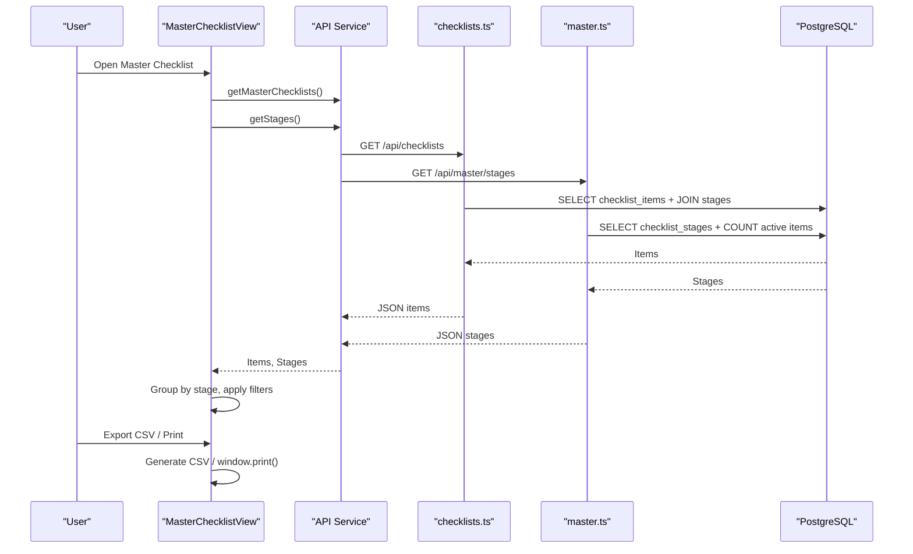

**Diagram sources**
- [MasterChecklistView.tsx:41-74](file://src/components/MasterChecklistView.tsx#L41-L74)
- [api.ts:76-80](file://src/services/api.ts#L76-L80)
- [api.ts:182-188](file://src/services/api.ts#L182-L188)
- [checklists.ts:8-34](file://server/routes/checklists.ts#L8-L34)
- [master.ts:8-22](file://server/routes/master.ts#L8-L22)
- [schema.sql:116-143](file://database/schema.sql#L116-L143)

## Detailed Component Analysis

### MasterChecklistView: Data Loading and Filtering
- Loads checklist items and stages in parallel using the API service
- Applies client-side filters:
  - Stage filter by stage_number
  - Risk filter by default_risk_level
  - Text search across checklist_code, inspection_area, inspection_question, legal_reference, required_documents
- Groups items by stage and sorts by sort_order within each stage
- Supports expand/collapse per stage and global expand/collapse

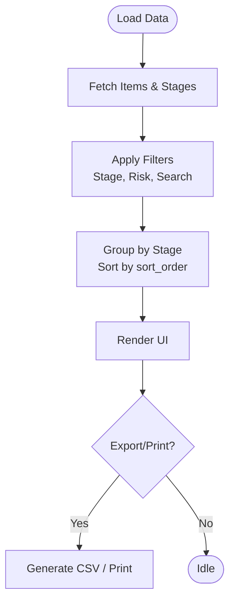

**Diagram sources**
- [MasterChecklistView.tsx:41-74](file://src/components/MasterChecklistView.tsx#L41-L74)
- [MasterChecklistView.tsx:78-127](file://src/components/MasterChecklistView.tsx#L78-L127)
- [MasterChecklistView.tsx:129-181](file://src/components/MasterChecklistView.tsx#L129-L181)

**Section sources**
- [MasterChecklistView.tsx:41-127](file://src/components/MasterChecklistView.tsx#L41-L127)

### CRUD Operations for Checklist Items
- Create: Admin-only endpoint creates a new checklist item, assigns a sequential code, sets defaults, and logs the action.
- Update: Admin-only endpoint updates fields including is_active for deactivation; preserves history via audit logs.
- Read: Public endpoints return all items or items filtered by stage and active status.

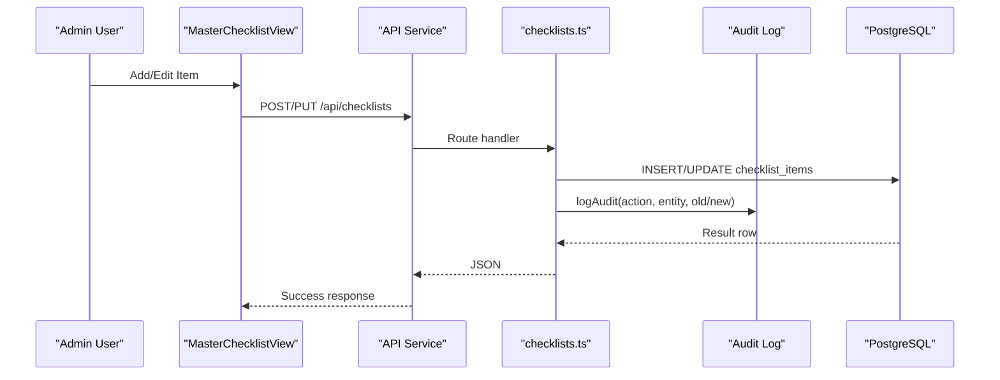

**Diagram sources**
- [checklists.ts:54-123](file://server/routes/checklists.ts#L54-L123)
- [checklists.ts:125-189](file://server/routes/checklists.ts#L125-L189)
- [api.ts:190-210](file://src/services/api.ts#L190-L210)

**Section sources**
- [checklists.ts:8-192](file://server/routes/checklists.ts#L8-L192)
- [api.ts:182-210](file://src/services/api.ts#L182-L210)

### Risk Level Assignment System
- Default risk levels are defined per checklist item and displayed with color-coded badges
- Available levels: Low, Medium, High, Very High (in local language)
- Risk levels influence inspection scoring and reporting downstream

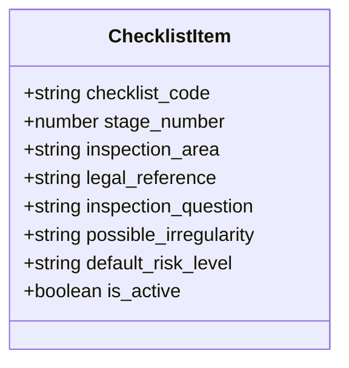

**Diagram sources**
- [index.ts:123-137](file://src/types/index.ts#L123-L137)
- [schema.sql:126-143](file://database/schema.sql#L126-L143)

**Section sources**
- [MasterChecklistView.tsx:20-28](file://src/components/MasterChecklistView.tsx#L20-L28)
- [index.ts:123-137](file://src/types/index.ts#L123-L137)
- [schema.sql:126-143](file://database/schema.sql#L126-L143)

### Scoring Mechanisms and Compliance Status Definitions
- Inspection results store compliance_status and risk_level per checklist item
- Compliance statuses include compliant, partially compliant, non-compliant, not applicable, insufficient evidence, and pending check
- Risk levels mirror those in master checklist and can be overridden per inspection result
- Aggregated statistics track counts of compliant/partial/non-compliant items and high-risk findings

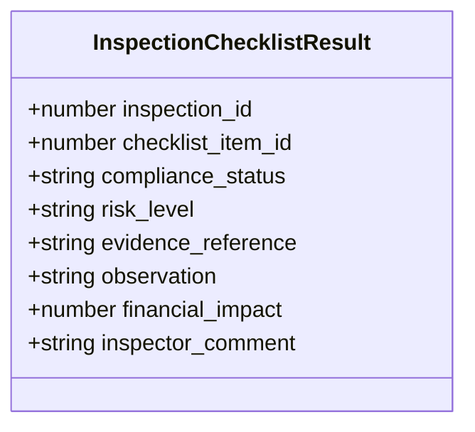

**Diagram sources**
- [index.ts:139-161](file://src/types/index.ts#L139-L161)
- [schema.sql:164-180](file://database/schema.sql#L164-L180)

**Section sources**
- [index.ts:139-161](file://src/types/index.ts#L139-L161)
- [schema.sql:164-180](file://database/schema.sql#L164-L180)

### Integration with the Inspection System
- Master checklist items serve as the standard basis for inspections
- Inspections reference checklist items and record compliance outcomes
- The API exposes endpoints to retrieve and save inspection checklist results, ensuring consistent application of standards

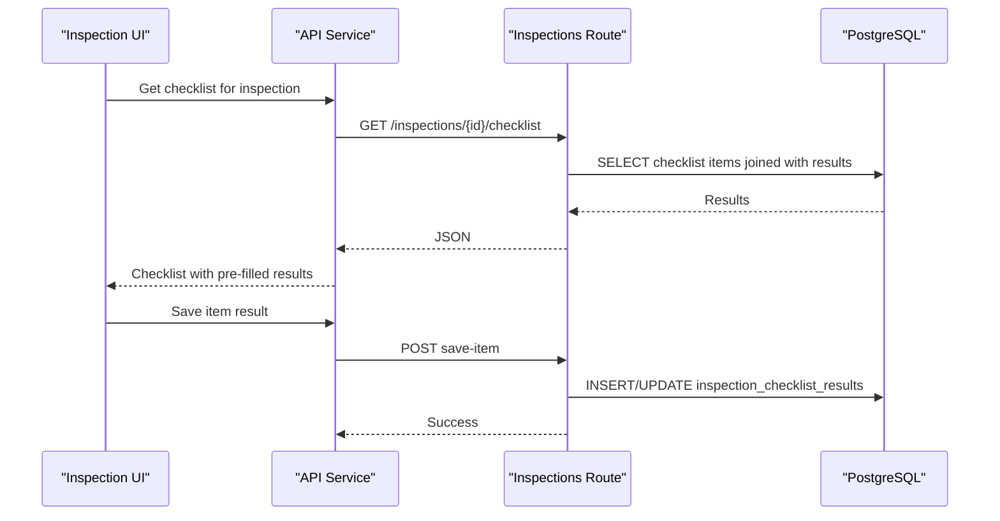

**Diagram sources**
- [api.ts:255-282](file://src/services/api.ts#L255-L282)
- [schema.sql:164-180](file://database/schema.sql#L164-L180)

**Section sources**
- [api.ts:255-282](file://src/services/api.ts#L255-L282)
- [schema.sql:164-180](file://database/schema.sql#L164-L180)

### Versioning, Change History Tracking, and Rollback
- No explicit version table exists for checklist items; changes are tracked via audit logs
- Audit logs capture user, action, entity type, entity id, old/new values, and timestamp
- Deactivation is supported via is_active flag rather than deletion, preserving historical continuity
- Rollback capability is conceptualized via audit logs; restoring previous state would require applying old values from logs

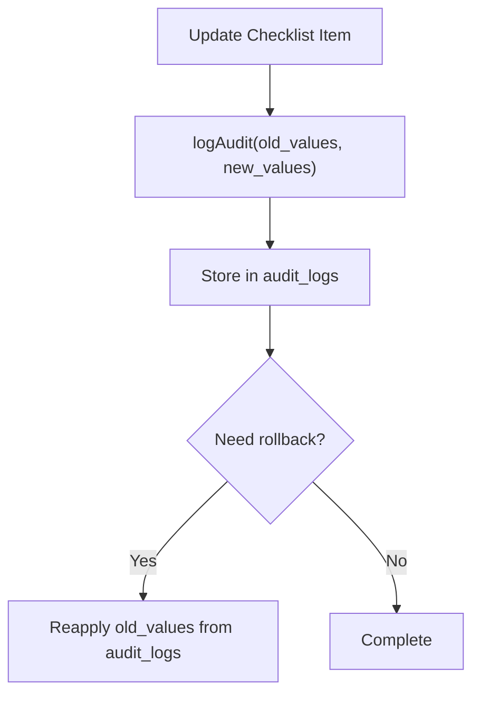

**Diagram sources**
- [checklists.ts:107-116](file://server/routes/checklists.ts#L107-L116)
- [checklists.ts:173-182](file://server/routes/checklists.ts#L173-L182)
- [schema.sql:258-270](file://database/schema.sql#L258-L270)

**Section sources**
- [checklists.ts:107-116](file://server/routes/checklists.ts#L107-L116)
- [checklists.ts:173-182](file://server/routes/checklists.ts#L173-L182)
- [schema.sql:258-270](file://database/schema.sql#L258-L270)

### Categorization by Procurement Phase, Legal Basis, and Risk Assessment
- Procurement phase categorization is achieved via stage_number and stage titles
- Legal basis is captured in legal_reference per item
- Risk assessment criteria are stored as default_risk_level and can be adjusted per inspection result

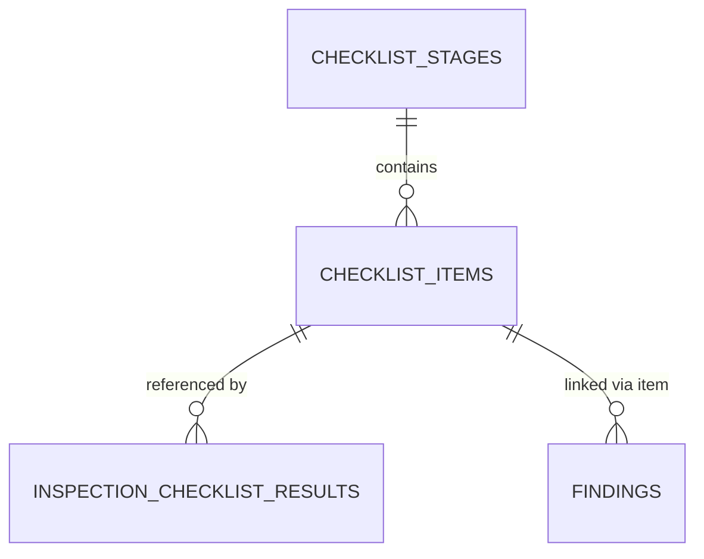

**Diagram sources**
- [schema.sql:116-143](file://database/schema.sql#L116-L143)
- [schema.sql:164-180](file://database/schema.sql#L164-L180)
- [schema.sql:200-224](file://database/schema.sql#L200-L224)

**Section sources**
- [schema.sql:116-143](file://database/schema.sql#L116-L143)
- [schema.sql:164-180](file://database/schema.sql#L164-L180)
- [schema.sql:200-224](file://database/schema.sql#L200-L224)

### Export Functionality and Training Materials Generation
- CSV export: Generates a UTF-8 CSV file with BOM for Excel compatibility, exporting only the currently filtered items
- Print: Opens browser print dialog with a print-optimized header and expanded stages
- Training materials: Not implemented in the current codebase; could be generated by exporting CSV and formatting into training documents externally

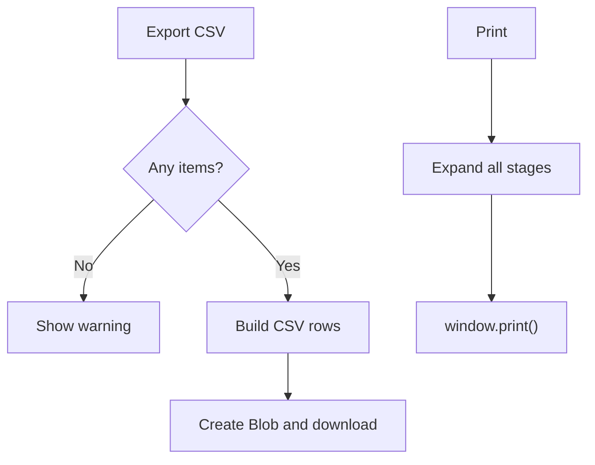

**Diagram sources**
- [MasterChecklistView.tsx:129-181](file://src/components/MasterChecklistView.tsx#L129-L181)

**Section sources**
- [MasterChecklistView.tsx:129-181](file://src/components/MasterChecklistView.tsx#L129-L181)

## Dependency Analysis
- MasterChecklistView depends on:
  - api.ts for data retrieval and mutations
  - types/index.ts for TypeScript interfaces
- api.ts depends on:
  - server routes for checklists and master data
- server routes depend on:
  - database schema for data access and constraints
- Audit logging integrates with the audit_logs table for change tracking

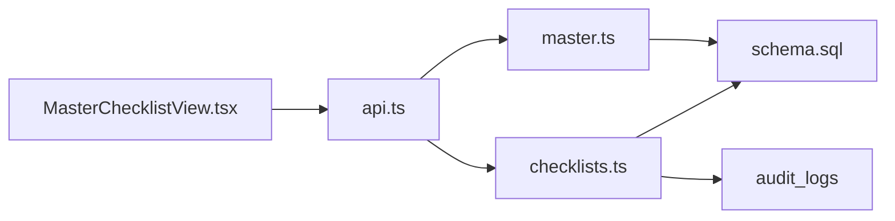

**Diagram sources**
- [MasterChecklistView.tsx:1-453](file://src/components/MasterChecklistView.tsx#L1-L453)
- [api.ts:76-210](file://src/services/api.ts#L76-L210)
- [checklists.ts:8-192](file://server/routes/checklists.ts#L8-L192)
- [master.ts:8-22](file://server/routes/master.ts#L8-L22)
- [schema.sql:258-270](file://database/schema.sql#L258-L270)

**Section sources**
- [MasterChecklistView.tsx:1-453](file://src/components/MasterChecklistView.tsx#L1-L453)
- [api.ts:76-210](file://src/services/api.ts#L76-L210)
- [checklists.ts:8-192](file://server/routes/checklists.ts#L8-L192)
- [master.ts:8-22](file://server/routes/master.ts#L8-L22)
- [schema.sql:258-270](file://database/schema.sql#L258-L270)

## Performance Considerations
- Concurrent loading of items and stages reduces initial load time
- Client-side grouping and sorting avoid additional server requests for filtering
- CSV export operates on already-filtered datasets to minimize processing overhead
- Database indexes on stage_id and inspection_id improve query performance for checklist and result lookups

[No sources needed since this section provides general guidance]

## Troubleshooting Guide
- Loading failures: Errors during data fetch show toast notifications and log errors; verify network connectivity and API availability
- Empty results: If no items match filters, clear filters or adjust search terms
- Creation/Update errors: Check admin permissions and required fields; review error messages returned by the API
- Audit visibility: Use audit logs to trace changes and reconstruct prior states if needed

**Section sources**
- [MasterChecklistView.tsx:41-60](file://src/components/MasterChecklistView.tsx#L41-L60)
- [checklists.ts:54-123](file://server/routes/checklists.ts#L54-L123)
- [checklists.ts:125-189](file://server/routes/checklists.ts#L125-L189)

## Conclusion
The MasterChecklistView provides a robust interface for managing standardized inspection checklists aligned with procurement stages, legal references, and risk criteria. It supports efficient filtering, export, and printing, while integrating seamlessly with the inspection system to enforce consistent standards. Change management relies on audit logs and soft deactivation, enabling traceability and controlled evolution of checklist standards. Future enhancements may include formal versioning and automated training material generation based on exported standards.

[No sources needed since this section summarizes without analyzing specific files]

## Appendices
- Risk levels and compliance statuses are consistently modeled across master and inspection layers
- CSV export format includes key fields for training and auditing purposes
- Audit logs provide a foundation for rollback strategies by preserving old and new values

[No sources needed since this section provides general guidance]