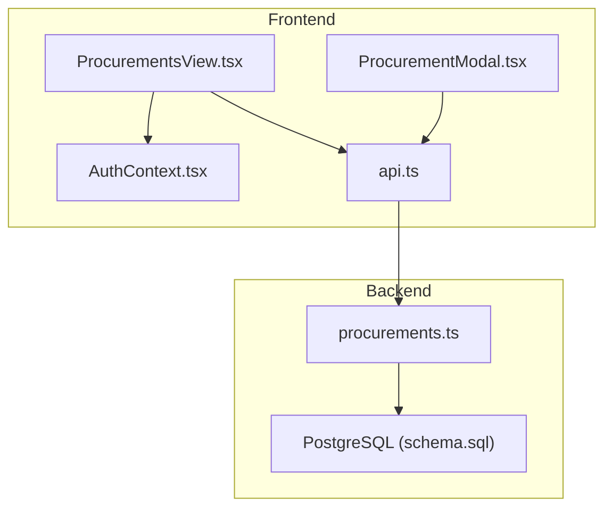
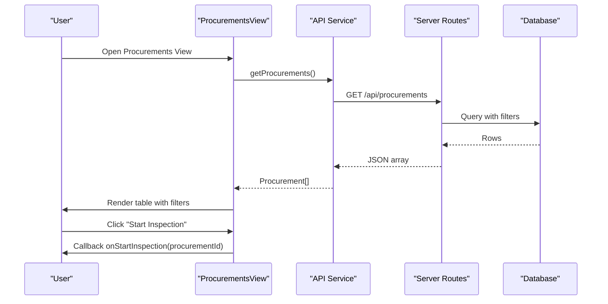
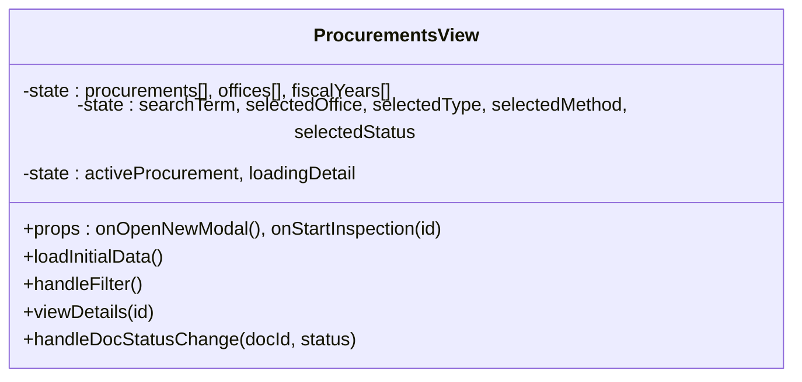
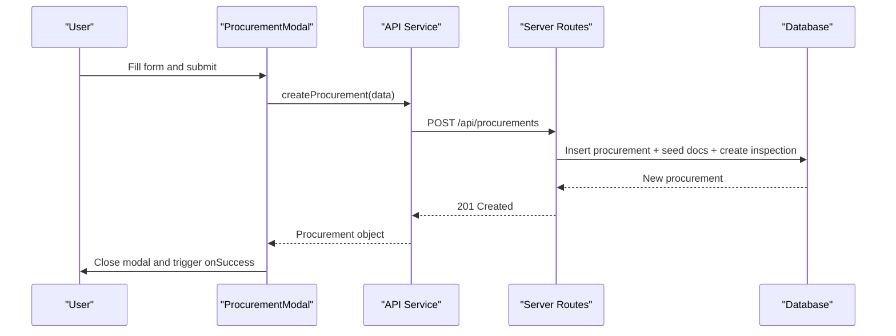
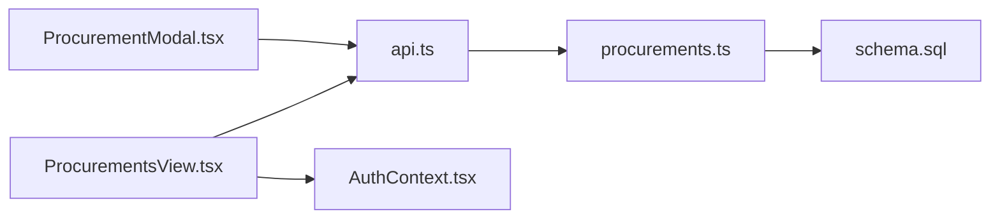

# Procurements View

<cite>
**Referenced Files in This Document**
- [ProcurementsView.tsx](file://src/components/ProcurementsView.tsx)
- [ProcurementModal.tsx](file://src/components/modals/ProcurementModal.tsx)
- [procurements.ts](file://server/routes/procurements.ts)
- [api.ts](file://src/services/api.ts)
- [index.ts](file://src/types/index.ts)
- [AuthContext.tsx](file://src/context/AuthContext.tsx)
- [schema.sql](file://database/schema.sql)
</cite>

## Table of Contents
1. Introduction
2. Project Structure
3. Core Components
4. Architecture Overview
5. Detailed Component Analysis
6. Dependency Analysis
7. Performance Considerations
8. Troubleshooting Guide
9. Conclusion
10. Appendices

## Introduction
This document provides comprehensive documentation for the ProcurementsView component and its ecosystem that manages the complete procurement lifecycle. It covers CRUD operations, integration with ProcurementModal for form handling and validation, filtering and search capabilities, table display features, status workflow management, document completeness tracking, inspection scheduling integration, API calls, error handling patterns, user feedback mechanisms, responsive design considerations, and accessibility features.

## Project Structure
The procurement feature spans UI components, a modal for data entry, an API service layer, server routes, type definitions, authentication context, and database schema. The key files are:
- Frontend view: ProcurementsView.tsx
- Modal for creation/editing: ProcurementModal.tsx
- API client: api.ts
- Server routes: procurements.ts
- Types: index.ts
- Auth context: AuthContext.tsx
- Database schema: schema.sql

**Diagram sources**
- [ProcurementsView.tsx:1-534](file://src/components/ProcurementsView.tsx#L1-L534)
- [ProcurementModal.tsx:1-375](file://src/components/modals/ProcurementModal.tsx#L1-L375)
- [api.ts:1-440](file://src/services/api.ts#L1-L440)
- [procurements.ts:1-467](file://server/routes/procurements.ts#L1-L467)
- [schema.sql:83-256](file://database/schema.sql#L83-L256)

**Section sources**
- [ProcurementsView.tsx:1-534](file://src/components/ProcurementsView.tsx#L1-L534)
- [ProcurementModal.tsx:1-375](file://src/components/modals/ProcurementModal.tsx#L1-L375)
- [api.ts:1-440](file://src/services/api.ts#L1-L440)
- [procurements.ts:1-467](file://server/routes/procurements.ts#L1-L467)
- [schema.sql:83-256](file://database/schema.sql#L83-L256)

## Core Components
- ProcurementsView: Displays the procurement list, supports search and filters, opens detail modal, triggers inspections, and updates document statuses.
- ProcurementModal: Handles creation of new procurement records with master dropdowns and validation.
- API Service: Encapsulates HTTP calls to backend endpoints for procurements, master data, and related entities.
- Server Routes: Implements REST endpoints for listing, retrieving, creating, updating procurements, and updating document statuses.
- Types: Strongly typed interfaces for all domain models used across frontend and backend contracts.
- Auth Context: Provides role-based permissions controlling visibility and actions like starting inspections or editing.

**Section sources**
- [ProcurementsView.tsx:22-126](file://src/components/ProcurementsView.tsx#L22-L126)
- [ProcurementModal.tsx:6-127](file://src/components/modals/ProcurementModal.tsx#L6-L127)
- [api.ts:131-180](file://src/services/api.ts#L131-L180)
- [procurements.ts:8-113](file://server/routes/procurements.ts#L8-L113)
- [index.ts:69-111](file://src/types/index.ts#L69-L111)
- [AuthContext.tsx:102-108](file://src/context/AuthContext.tsx#L102-L108)

## Architecture Overview
The ProcurementsView orchestrates the procurement lifecycle by:
- Loading initial data (procurements, offices, fiscal years).
- Applying filters via API query parameters.
- Opening a detailed modal to inspect procurement specifics and manage document completeness.
- Triggering inspection workflows through callbacks to parent components.
- Updating document statuses inline.

**Diagram sources**
- [ProcurementsView.tsx:48-86](file://src/components/ProcurementsView.tsx#L48-L86)
- [api.ts:131-142](file://src/services/api.ts#L131-L142)
- [procurements.ts:8-113](file://server/routes/procurements.ts#L8-L113)

**Section sources**
- [ProcurementsView.tsx:48-86](file://src/components/ProcurementsView.tsx#L48-L86)
- [procurements.ts:8-113](file://server/routes/procurements.ts#L8-L113)

## Detailed Component Analysis

### ProcurementsView
Responsibilities:
- Load and display procurement records with search and filter controls.
- Show detailed procurement info in a modal including statutory file checklist.
- Update document availability status per item.
- Provide action buttons to start inspections.

Key behaviors:
- Initial load fetches procurements, offices, and fiscal years concurrently.
- Filtering supports search text, office, procurement type, method, and current status.
- Detail modal loads full procurement details including documents and latest inspection metadata.
- Document status toggles call update endpoint and refresh local state.

Filtering and search:
- Search matches title, code, number, contractor, and office name on the server side.
- Filters include office_id, procurement_type, procurement_method, current_status; optional ministry_id, province_id, fiscal_year_id supported by server route.

Table display:
- Columns show code/number, title, public entity/location, type/method, costs, contractor, inspection status, and actions.
- No built-in pagination in the view; server route supports limit/offset but not currently exposed in UI.

Status workflow and inspection integration:
- Each row shows latest inspection status and completion percentage if present.
- “Start Inspection” button invokes parent callback to navigate to inspection flow.

Document completeness:
- 19-point statutory checklist seeded automatically upon procurement creation.
- Users can toggle each document’s availability; changes persist via update endpoint.

Error handling and user feedback:
- Errors are logged to console; no explicit toast notifications in this component.
- Loading states indicate when data is being fetched.

Responsive and accessibility:
- Uses responsive grid layouts and mobile-friendly inputs/selects.
- Keyboard support for Enter key to apply filters.
- Color-coded badges for inspection status and progress indicators.

**Section sources**
- [ProcurementsView.tsx:48-86](file://src/components/ProcurementsView.tsx#L48-L86)
- [ProcurementsView.tsx:151-241](file://src/components/ProcurementsView.tsx#L151-L241)
- [ProcurementsView.tsx:243-377](file://src/components/ProcurementsView.tsx#L243-L377)
- [ProcurementsView.tsx:379-530](file://src/components/ProcurementsView.tsx#L379-L530)
- [procurements.ts:8-113](file://server/routes/procurements.ts#L8-L113)

#### ProcurementsView Class Diagram

**Diagram sources**
- [ProcurementsView.tsx:22-126](file://src/components/ProcurementsView.tsx#L22-L126)

### ProcurementModal
Responsibilities:
- Create new procurement records with validated input.
- Load master dropdowns (offices, provinces, districts, ministries, fiscal years).
- Handle cascading location selection (province -> district).
- Submit data via API and handle success/error flows.

Form validation:
- Requires title, office, estimated cost, and contract amount.
- Auto-generates procurement number if not provided.

Submission flow:
- Calls createProcurement API with structured payload.
- On success, closes modal and triggers onSuccess callback.

Error handling:
- Displays error message within modal on failure.

**Section sources**
- [ProcurementModal.tsx:49-127](file://src/components/modals/ProcurementModal.tsx#L49-L127)
- [ProcurementModal.tsx:131-375](file://src/components/modals/ProcurementModal.tsx#L131-L375)

#### ProcurementModal Sequence Diagram

**Diagram sources**
- [ProcurementModal.tsx:86-127](file://src/components/modals/ProcurementModal.tsx#L86-L127)
- [api.ts:151-160](file://src/services/api.ts#L151-L160)
- [procurements.ts:174-326](file://server/routes/procurements.ts#L174-L326)

### API Service Layer
Encapsulates procurement-related endpoints:
- getProcurements(filters): Supports search, office, type, method, status, and other optional filters.
- getProcurement(id): Retrieves full details including inspections and documents.
- createProcurement(data): Creates a new procurement record.
- updateProcurement(id, data): Updates existing procurement fields.
- updateProcurementDoc(procId, docId, status, remarks?): Updates document status.

Authentication:
- Adds Authorization header using token stored in localStorage.

Error handling:
- Throws errors with localized messages based on response status and error payloads.

**Section sources**
- [api.ts:23-32](file://src/services/api.ts#L23-L32)
- [api.ts:131-180](file://src/services/api.ts#L131-L180)

### Server Routes
Endpoints:
- GET /api/procurements: Lists procurements with comprehensive filters and joins to related tables; includes latest inspection info and counts.
- GET /api/procurements/:id: Returns single procurement with inspections and documents.
- POST /api/procurements: Creates procurement, seeds default document checklist, creates initial inspection, logs audit.
- PUT /api/procurements/:id: Updates procurement fields with audit logging.
- PUT /api/procurements/:id/documents/:docId: Updates document status.

Validation and security:
- Authentication and role checks enforced where applicable.
- Required fields validated before insertion.

Audit trail:
- Logs CREATE and UPDATE actions with old/new values and IP address.

**Section sources**
- [procurements.ts:8-113](file://server/routes/procurements.ts#L8-L113)
- [procurements.ts:115-172](file://server/routes/procurements.ts#L115-L172)
- [procurements.ts:174-326](file://server/routes/procurements.ts#L174-L326)
- [procurements.ts:328-443](file://server/routes/procurements.ts#L328-L443)
- [procurements.ts:445-464](file://server/routes/procurements.ts#L445-L464)

### Data Models
Core types relevant to procurement management:
- Procurement: Full model including codes, financials, status, inspection metadata, and documents.
- ProcurementDocument: Checklist item with status options.
- Inspection: Tracks inspection lifecycle and metrics.
- Office, Ministry, Province, District, Municipality, FiscalYear: Master data models.

**Section sources**
- [index.ts:69-111](file://src/types/index.ts#L69-L111)
- [index.ts:163-203](file://src/types/index.ts#L163-L203)
- [index.ts:14-59](file://src/types/index.ts#L14-L59)

### Status Workflow Management
Procurement statuses defined in types:
- योजना (Planning), बोलपत्र आह्वान (Bidding), मूल्याङ्कन (Evaluation), सम्झौता (Contract), संचालनमा (In Operation), सम्पन्न (Completed), रद्द (Cancelled), विवादित (Disputed).

Inspection statuses:
- Draft, In Progress, Submitted, Under Review, Returned for Correction, Verified, Closed.

Workflow highlights:
- Creation auto-seeds a default inspection with status Draft.
- Latest inspection info is joined into procurement list for quick status visibility.
- Completion percentage and risk score are tracked at inspection level.

**Section sources**
- [index.ts:97-110](file://src/types/index.ts#L97-L110)
- [index.ts:178-184](file://src/types/index.ts#L178-L184)
- [procurements.ts:293-308](file://server/routes/procurements.ts#L293-L308)

### Document Completeness Tracking
- Default 19-point statutory checklist seeded on procurement creation.
- Each document has status: उपलब्ध (Available), उपलब्ध छैन (Not Available), अपूर्ण (Incomplete), लागू हुँदैन (Not Applicable).
- Inline toggle updates status via PUT endpoint and reflects immediately in UI.

**Section sources**
- [procurements.ts:262-291](file://server/routes/procurements.ts#L262-L291)
- [procurements.ts:445-464](file://server/routes/procurements.ts#L445-L464)
- [ProcurementsView.tsx:456-505](file://src/components/ProcurementsView.tsx#L456-L505)

### Integration with Inspection Scheduling
- Starting inspection from ProcurementsView triggers parent callback to open inspection flow.
- Backend creates initial inspection record upon procurement creation.
- Latest inspection status and completion percentage displayed in table rows.

**Section sources**
- [ProcurementsView.tsx:356-370](file://src/components/ProcurementsView.tsx#L356-L370)
- [procurements.ts:293-308](file://server/routes/procurements.ts#L293-L308)

### API Calls Summary
- List procurements with filters: GET /api/procurements
- Get procurement details: GET /api/procurements/:id
- Create procurement: POST /api/procurements
- Update procurement: PUT /api/procurements/:id
- Update document status: PUT /api/procurements/:id/documents/:docId

**Section sources**
- [api.ts:131-180](file://src/services/api.ts#L131-L180)
- [procurements.ts:8-113](file://server/routes/procurements.ts#L8-L113)
- [procurements.ts:115-172](file://server/routes/procurements.ts#L115-L172)
- [procurements.ts:174-326](file://server/routes/procurements.ts#L174-L326)
- [procurements.ts:328-443](file://server/routes/procurements.ts#L328-L443)
- [procurements.ts:445-464](file://server/routes/procurements.ts#L445-L464)

### Error Handling Patterns
- Frontend throws errors with localized messages; components log errors to console.
- Backend returns standardized error objects with HTTP status codes.
- Audit logs capture failed or successful mutations.

**Section sources**
- [api.ts:36-45](file://src/services/api.ts#L36-L45)
- [api.ts:144-180](file://src/services/api.ts#L144-L180)
- [procurements.ts:109-112](file://server/routes/procurements.ts#L109-L112)
- [procurements.ts:168-171](file://server/routes/procurements.ts#L168-L171)
- [procurements.ts:322-325](file://server/routes/procurements.ts#L322-L325)
- [procurements.ts:439-442](file://server/routes/procurements.ts#L439-L442)
- [procurements.ts:461-463](file://server/routes/procurements.ts#L461-L463)

### User Feedback Mechanisms
- Loading spinners during data fetch.
- Empty state messaging when no procurements found.
- Inline error banners in modal for submission failures.
- Color-coded status badges and progress bars for inspection status.

**Section sources**
- [ProcurementsView.tsx:243-254](file://src/components/ProcurementsView.tsx#L243-L254)
- [ProcurementModal.tsx:151-156](file://src/components/modals/ProcurementModal.tsx#L151-L156)
- [ProcurementsView.tsx:327-354](file://src/components/ProcurementsView.tsx#L327-L354)

### Responsive Design and Accessibility
- Responsive grids adapt to screen sizes; inputs and selects are touch-friendly.
- Keyboard navigation: Enter key applies filters; modal close via accessible button.
- High contrast color usage for status badges; clear visual hierarchy.

**Section sources**
- [ProcurementsView.tsx:151-241](file://src/components/ProcurementsView.tsx#L151-L241)
- [ProcurementModal.tsx:131-375](file://src/components/modals/ProcurementModal.tsx#L131-L375)

## Dependency Analysis
Component relationships and data flow:
- ProcurementsView depends on API service for data and auth context for permissions.
- ProcurementModal depends on API service for master data and creation.
- Server routes depend on database schema for persistence and indexing.

**Diagram sources**
- [ProcurementsView.tsx:1-534](file://src/components/ProcurementsView.tsx#L1-L534)
- [ProcurementModal.tsx:1-375](file://src/components/modals/ProcurementModal.tsx#L1-L375)
- [api.ts:1-440](file://src/services/api.ts#L1-L440)
- [procurements.ts:1-467](file://server/routes/procurements.ts#L1-L467)
- [schema.sql:83-256](file://database/schema.sql#L83-L256)
- [AuthContext.tsx:1-139](file://src/context/AuthContext.tsx#L1-L139)

**Section sources**
- [ProcurementsView.tsx:1-534](file://src/components/ProcurementsView.tsx#L1-L534)
- [ProcurementModal.tsx:1-375](file://src/components/modals/ProcurementModal.tsx#L1-L375)
- [api.ts:1-440](file://src/services/api.ts#L1-L440)
- [procurements.ts:1-467](file://server/routes/procurements.ts#L1-L467)
- [schema.sql:83-256](file://database/schema.sql#L83-L256)
- [AuthContext.tsx:1-139](file://src/context/AuthContext.tsx#L1-L139)

## Performance Considerations
- Concurrent fetching of master data reduces initial load time.
- Server-side filtering minimizes payload size; consider adding pagination to UI for large datasets.
- Database indexes on frequently filtered columns improve query performance.
- Avoid unnecessary re-renders by memoizing derived data if needed.

[No sources needed since this section provides general guidance]

## Troubleshooting Guide
Common issues and resolutions:
- Filter not applying: Ensure filter values are non-empty and passed correctly to API; verify server route parameter names.
- Document status not updating: Confirm correct docId and status values; check network tab for 4xx/5xx responses.
- Modal submission fails: Validate required fields; check error banner for specific messages; review backend logs for validation errors.
- Inspection not visible: Verify latest_inspection_id presence; ensure inspection was created during procurement creation.

**Section sources**
- [ProcurementsView.tsx:70-86](file://src/components/ProcurementsView.tsx#L70-L86)
- [ProcurementModal.tsx:86-127](file://src/components/modals/ProcurementModal.tsx#L86-L127)
- [procurements.ts:109-112](file://server/routes/procurements.ts#L109-L112)
- [procurements.ts:168-171](file://server/routes/procurements.ts#L168-L171)
- [procurements.ts:322-325](file://server/routes/procurements.ts#L322-L325)

## Conclusion
The ProcurementsView component provides a robust interface for managing the procurement lifecycle, integrating seamlessly with ProcurementModal for data entry, supporting advanced filtering and search, and enabling inspection scheduling and document completeness tracking. The architecture leverages a clear separation of concerns between UI, API service, and server routes, with strong typing and comprehensive database schema support. Error handling and user feedback are implemented consistently, while responsive design ensures usability across devices.

[No sources needed since this section summarizes without analyzing specific files]

## Appendices

### Database Schema Highlights
- Procurements table stores core procurement data with status and financial fields.
- Inspections table tracks inspection lifecycle and metrics linked to procurements.
- Procurement_documents table maintains statutory checklist items and their status.
- Indexes optimize queries on office, status, and inspection relationships.

**Section sources**
- [schema.sql:83-114](file://database/schema.sql#L83-L114)
- [schema.sql:145-162](file://database/schema.sql#L145-L162)
- [schema.sql:246-256](file://database/schema.sql#L246-L256)
- [schema.sql:272-282](file://database/schema.sql#L272-L282)