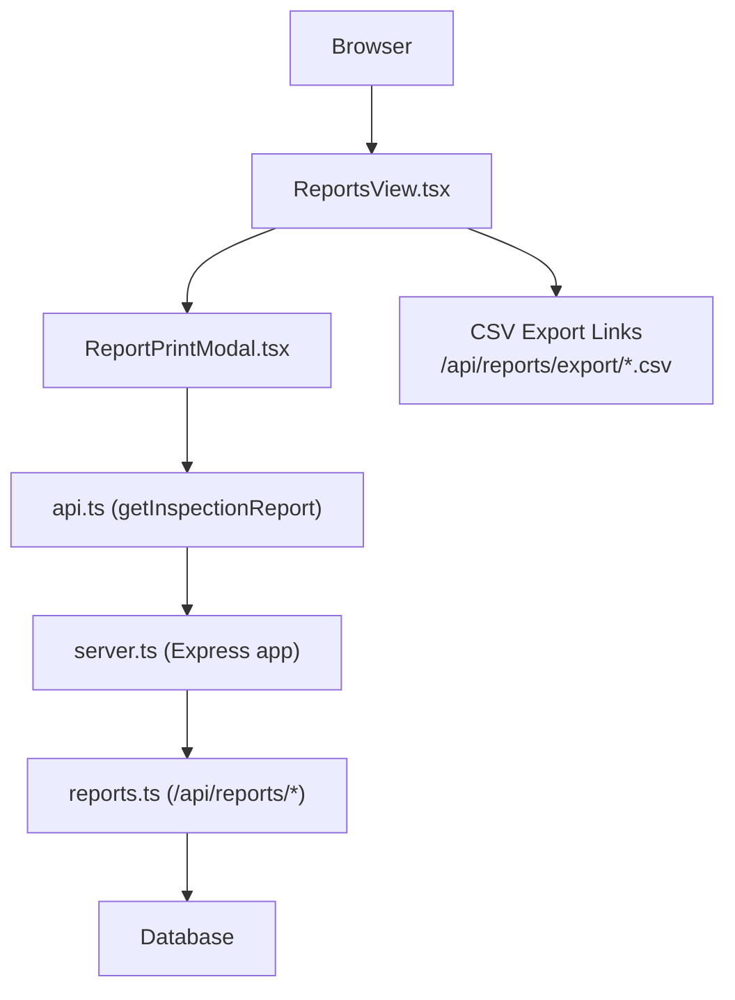
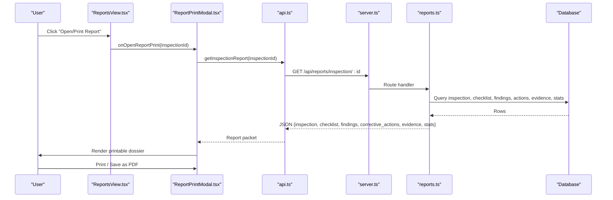
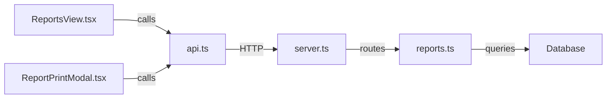

# Reports View

<cite>
**Referenced Files in This Document**
- [ReportsView.tsx](file://src/components/ReportsView.tsx)
- [ReportPrintModal.tsx](file://src/components/modals/ReportPrintModal.tsx)
- [reports.ts](file://server/routes/reports.ts)
- [api.ts](file://src/services/api.ts)
- [index.ts](file://src/types/index.ts)
- [server.ts](file://server.ts)
</cite>

## Table of Contents
1. [Introduction](#introduction)
2. [Project Structure](#project-structure)
3. [Core Components](#core-components)
4. [Architecture Overview](#architecture-overview)
5. [Detailed Component Analysis](#detailed-component-analysis)
6. [Dependency Analysis](#dependency-analysis)
7. [Performance Considerations](#performance-considerations)
8. [Troubleshooting Guide](#troubleshooting-guide)
9. [Conclusion](#conclusion)
10. [Appendices](#appendices)

## Introduction
This document provides comprehensive documentation for the ReportsView component and its supporting backend services that generate and manage inspection and compliance reports. It explains how the system exports data to CSV, assembles official inspection report packets, and renders printable dossiers suitable for PDF generation via browser print-to-PDF. It also clarifies current capabilities and limitations regarding scheduling, distribution, customization, and archival features based on the repository codebase.

## Project Structure
The Reports feature spans both frontend and backend:
- Frontend:
  - ReportsView.tsx: Entry UI for exporting CSVs and listing inspections with a “print” action.
  - ReportPrintModal.tsx: Modal that fetches and displays an official inspection dossier for printing/PDF export.
  - api.ts: Client API methods including fetching inspection reports and other resources used by the UI.
- Backend:
  - reports.ts: Express routes serving full inspection report packets and CSV exports for procurements and findings.
  - server.ts: Mounts all route modules under /api/*, including /api/reports.

**Diagram sources**
- [ReportsView.tsx:52-93](file://src/components/ReportsView.tsx#L52-L93)
- [ReportPrintModal.tsx:19-35](file://src/components/modals/ReportPrintModal.tsx#L19-L35)
- [api.ts:419-425](file://src/services/api.ts#L419-L425)
- [server.ts:44-55](file://server.ts#L44-L55)
- [reports.ts:7-140](file://server/routes/reports.ts#L7-L140)

**Section sources**
- [ReportsView.tsx:1-189](file://src/components/ReportsView.tsx#L1-L189)
- [ReportPrintModal.tsx:1-304](file://src/components/modals/ReportPrintModal.tsx#L1-L304)
- [reports.ts:1-219](file://server/routes/reports.ts#L1-L219)
- [api.ts:1-440](file://src/services/api.ts#L1-L440)
- [server.ts:1-93](file://server.ts#L1-L93)

## Core Components
- ReportsView: Displays CSV export cards for procurements and findings, and lists available inspection dossiers with status and completion percentage. Provides a “Print” button per inspection to open the detailed report modal.
- ReportPrintModal: Fetches a complete inspection report packet (inspection details, checklist results, findings, corrective actions, evidence, statistics), renders an official government-style memo layout, and supports printing or saving as PDF via the browser’s print dialog.
- Backend reports routes: Provide endpoints to retrieve a full inspection report packet and to export CSV datasets for procurements and findings.

Key responsibilities:
- Data retrieval for reports and exports.
- Rendering printable official documents.
- Providing CSV downloads for bulk data analysis.

**Section sources**
- [ReportsView.tsx:19-37](file://src/components/ReportsView.tsx#L19-L37)
- [ReportPrintModal.tsx:25-35](file://src/components/modals/ReportPrintModal.tsx#L25-L35)
- [reports.ts:7-140](file://server/routes/reports.ts#L7-L140)

## Architecture Overview
The reporting flow combines client-side UI interactions with server-side data assembly:

**Diagram sources**
- [ReportPrintModal.tsx:19-35](file://src/components/modals/ReportPrintModal.tsx#L19-L35)
- [api.ts:419-425](file://src/services/api.ts#L419-L425)
- [reports.ts:7-140](file://server/routes/reports.ts#L7-L140)
- [server.ts:44-55](file://server.ts#L44-L55)

## Detailed Component Analysis

### ReportsView Component
- Loads inspections via API and renders a table with key fields such as inspection code, procurement title, office name, lead inspector, completion percentage, and status.
- Provides direct CSV download links for procurements and findings using anchor tags pointing to backend export endpoints.
- Opens the ReportPrintModal for each inspection to view/print the official dossier.

Data flow:
- On mount, fetches inspections list.
- User clicks “Open/Print Report” to trigger modal with inspectionId.

Export behavior:
- Procurements CSV: Direct link to /api/reports/export/procurements.csv.
- Findings CSV: Direct link to /api/reports/export/findings.csv.

Error handling:
- Logs errors when loading inspections; shows loading state and empty state messages.

**Section sources**
- [ReportsView.tsx:23-37](file://src/components/ReportsView.tsx#L23-L37)
- [ReportsView.tsx:52-93](file://src/components/ReportsView.tsx#L52-L93)
- [ReportsView.tsx:95-185](file://src/components/ReportsView.tsx#L95-L185)

### ReportPrintModal Component
- Fetches the full inspection report packet when opened with an inspectionId.
- Renders an official memo header, project details, compliance summary, identified findings, corrective actions, and signature blocks.
- Supports printing via window.print(), enabling users to save as PDF from the browser.

Data usage:
- Uses inspection metadata, checklist statistics, findings, corrective actions, and evidence references to build the printable layout.

Formatting:
- Formats currency values using locale-aware formatting.
- Uses print-specific CSS classes to hide controls during printing.

**Section sources**
- [ReportPrintModal.tsx:19-35](file://src/components/modals/ReportPrintModal.tsx#L19-L35)
- [ReportPrintModal.tsx:37-46](file://src/components/modals/ReportPrintModal.tsx#L37-L46)
- [ReportPrintModal.tsx:79-297](file://src/components/modals/ReportPrintModal.tsx#L79-L297)

### Backend Reports Routes
- GET /api/reports/inspection/:id: Assembles a comprehensive report packet by querying multiple tables (inspections, procurements, offices, ministries, provinces, districts, municipalities, fiscal years, users, checklist items, results, findings, corrective actions, evidence). Returns structured JSON including inspection details, checklist results, findings, corrective actions, evidence, and aggregated statistics.
- GET /api/reports/export/procurements.csv: Exports all procurements with relevant fields into a UTF-8 CSV file with BOM for Excel compatibility.
- GET /api/reports/export/findings.csv: Exports all findings linked to procurements and offices into a UTF-8 CSV file with BOM.

Error handling:
- Returns 404 if inspection not found.
- Returns 500 with error message on failures.

**Section sources**
- [reports.ts:7-140](file://server/routes/reports.ts#L7-L140)
- [reports.ts:142-178](file://server/routes/reports.ts#L142-L178)
- [reports.ts:180-216](file://server/routes/reports.ts#L180-L216)

### API Service Layer
- Provides typed methods for frontend calls, including getInspectionReport which maps to /api/reports/inspection/:id.
- Other methods support master data, procurements, checklists, inspections, findings, corrective actions, evidence, dashboard, and audit logs.

Authentication:
- Attaches Authorization header with bearer token when present.

**Section sources**
- [api.ts:23-32](file://src/services/api.ts#L23-L32)
- [api.ts:419-425](file://src/services/api.ts#L419-L425)

### Types
- Defines interfaces for Inspection, Finding, CorrectiveAction, EvidenceFile, DashboardSummary, and related entities used across the application. These types inform the shape of data returned by APIs and consumed by components.

**Section sources**
- [index.ts:163-203](file://src/types/index.ts#L163-L203)
- [index.ts:205-235](file://src/types/index.ts#L205-L235)
- [index.ts:237-259](file://src/types/index.ts#L237-L259)
- [index.ts:262-279](file://src/types/index.ts#L262-L279)
- [index.ts:294-337](file://src/types/index.ts#L294-L337)

## Dependency Analysis
- ReportsView depends on:
  - api.getInspections for listing inspections.
  - ReportPrintModal for opening detailed reports.
- ReportPrintModal depends on:
  - api.getInspectionReport to fetch the full report packet.
- Backend reports routes depend on:
  - Database queries to assemble report data and CSV content.
- Server mounts routes under /api/*, ensuring consistent URL structure.

**Diagram sources**
- [ReportsView.tsx:27-37](file://src/components/ReportsView.tsx#L27-L37)
- [ReportPrintModal.tsx:25-35](file://src/components/modals/ReportPrintModal.tsx#L25-L35)
- [api.ts:419-425](file://src/services/api.ts#L419-L425)
- [server.ts:44-55](file://server.ts#L44-L55)
- [reports.ts:7-140](file://server/routes/reports.ts#L7-L140)

**Section sources**
- [ReportsView.tsx:1-189](file://src/components/ReportsView.tsx#L1-L189)
- [ReportPrintModal.tsx:1-304](file://src/components/modals/ReportPrintModal.tsx#L1-L304)
- [api.ts:1-440](file://src/services/api.ts#L1-L440)
- [server.ts:1-93](file://server.ts#L1-L93)
- [reports.ts:1-219](file://server/routes/reports.ts#L1-L219)

## Performance Considerations
- CSV exports are generated server-side with direct SQL queries and streamed as text/csv responses, minimizing memory overhead compared to building large objects in memory.
- The inspection report endpoint aggregates multiple tables; ensure database indexes exist on frequently filtered columns (e.g., inspection_id, procurement_id) to optimize query performance.
- Use pagination or filtering on the inspections list endpoint if the dataset grows large to reduce payload size and improve UI responsiveness.
- Browser print-to-PDF is efficient for small to medium-sized reports; for very large dossiers, consider server-side PDF generation to offload rendering work.

[No sources needed since this section provides general guidance]

## Troubleshooting Guide
Common issues and resolutions:
- Failed to load inspections for report:
  - Check network requests to /api/inspections and verify authentication headers.
  - Inspect console errors and server logs for database connectivity issues.
- CSV export fails:
  - Ensure the user is authenticated if required by middleware.
  - Verify database permissions and that referenced tables contain expected data.
- Report packet not found:
  - Confirm the inspectionId exists and is accessible to the authenticated user.
  - Check backend logs for SQL errors or missing joins.

Error handling locations:
- ReportsView catches and logs errors while loading inspections.
- Backend returns appropriate HTTP status codes and error messages for not found and internal errors.

**Section sources**
- [ReportsView.tsx:27-37](file://src/components/ReportsView.tsx#L27-L37)
- [reports.ts:52-55](file://server/routes/reports.ts#L52-L55)
- [reports.ts:136-139](file://server/routes/reports.ts#L136-L139)
- [reports.ts:175-177](file://server/routes/reports.ts#L175-L177)
- [reports.ts:213-215](file://server/routes/reports.ts#L213-L215)

## Conclusion
The ReportsView component provides a streamlined interface for exporting procurement and findings data to CSV and viewing official inspection dossiers for printing or PDF export. The backend consolidates multi-table data into a single report packet and serves CSV exports with proper encoding for international characters. While the current implementation focuses on CSV exports and printable dossiers, advanced features such as scheduled generation, automatic distribution, customizable templates, branding, and archival/versioning are not implemented in the provided codebase.

[No sources needed since this section summarizes without analyzing specific files]

## Appendices

### Current Capabilities Summary
- CSV exports:
  - Procurements CSV via /api/reports/export/procurements.csv.
  - Findings CSV via /api/reports/export/findings.csv.
- Official inspection dossier:
  - Full report packet via /api/reports/inspection/:id.
  - Printable layout rendered in ReportPrintModal with browser print-to-PDF.

### Limitations Based on Repository Code
- No built-in PDF generation library or server-side PDF creation is present; PDF output relies on browser print functionality.
- No Excel (.xlsx) generation; CSV with UTF-8 BOM is used for spreadsheet compatibility.
- No scheduling or automated distribution mechanisms are implemented.
- No template engine or branding configuration is present; layout is hardcoded in the modal.
- No archive system or version control for reports is implemented.

[No sources needed since this section summarizes limitations without analyzing specific files]