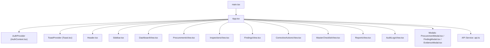
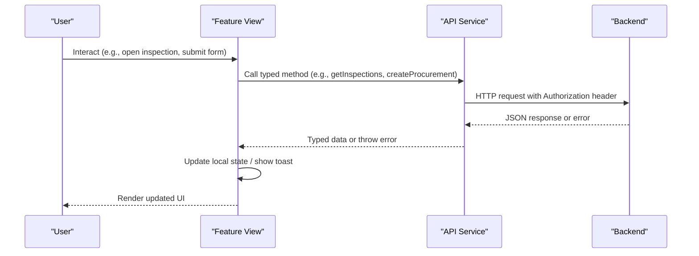
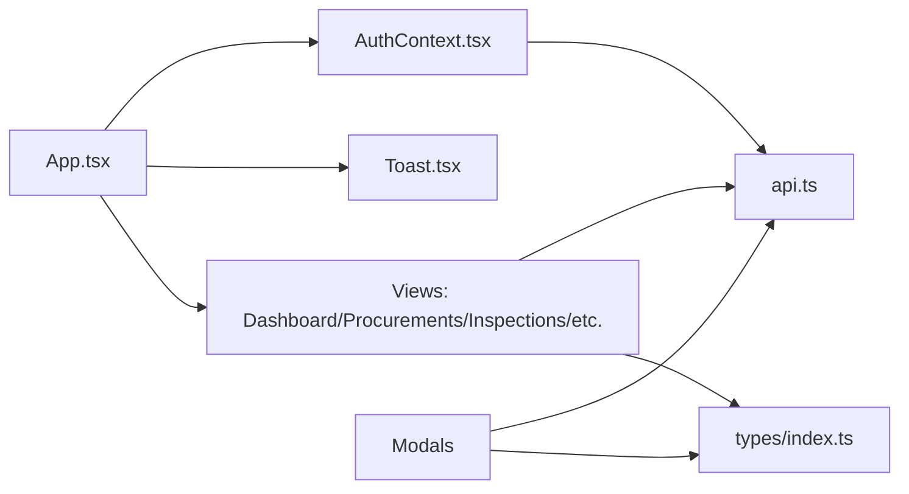

# Frontend Components

<cite>
**Referenced Files in This Document**
- [App.tsx](file://src/App.tsx)
- [main.tsx](file://src/main.tsx)
- [AuthContext.tsx](file://src/context/AuthContext.tsx)
- [api.ts](file://src/services/api.ts)
- [index.ts](file://src/types/index.ts)
- [Header.tsx](file://src/components/Header.tsx)
- [Sidebar.tsx](file://src/components/Sidebar.tsx)
- [DashboardView.tsx](file://src/components/DashboardView.tsx)
- [ProcurementsView.tsx](file://src/components/ProcurementsView.tsx)
- [InspectionsView.tsx](file://src/components/InspectionsView.tsx)
- [FindingModal.tsx](file://src/components/modals/FindingModal.tsx)
- [ProcurementModal.tsx](file://src/components/modals/ProcurementModal.tsx)
- [EvidenceModal.tsx](file://src/components/modals/EvidenceModal.tsx)
- [Toast.tsx](file://src/components/Toast.tsx)
</cite>

## Table of Contents
1. Introduction
2. Project Structure
3. Core Components
4. Architecture Overview
5. Detailed Component Analysis
6. Dependency Analysis
7. Performance Considerations
8. Troubleshooting Guide
9. Conclusion
10. Appendices

## Introduction
This document explains the React frontend components of the NVC Procurement Monitoring & Inspection System. It covers component hierarchy, state management via React Context, routing approach using in-app tabs, modular feature-based views, reusable modal patterns, authentication context and global state, API service layer abstraction, data fetching patterns, props interfaces, event handling, responsive design with Tailwind CSS, accessibility considerations, performance optimizations, and guidance for extending the UI consistently.

## Project Structure
The application is a single-page React app bootstrapped by Vite. The root entry renders the App component inside StrictMode. Global providers wrap the application to provide authentication and toast notifications. Feature-based views are conditionally rendered based on an internal tab state rather than client-side routes.

**Diagram sources**
- [main.tsx:1-11](file://src/main.tsx#L1-L11)
- [App.tsx:1-243](file://src/App.tsx#L1-L243)
- [AuthContext.tsx:1-139](file://src/context/AuthContext.tsx#L1-L139)
- [Toast.tsx:1-90](file://src/components/Toast.tsx#L1-L90)
- [api.ts:1-440](file://src/services/api.ts#L1-L440)

**Section sources**
- [main.tsx:1-11](file://src/main.tsx#L1-L11)
- [App.tsx:1-243](file://src/App.tsx#L1-L243)

## Core Components
- App orchestrates layout, navigation state, badge counts, and modal visibility. It composes Header, Sidebar, feature views, and modals.
- AuthContext provides user identity, token persistence, role switching, and derived permissions used across views.
- ToastProvider offers a global notification system consumed by feature views and modals.
- API service centralizes HTTP calls, auth headers, error mapping, and typed responses.

Key responsibilities:
- Navigation: controlled by currentTab state; no router library is used.
- State: local view state plus shared AuthContext; modals receive props from App.
- Data: feature views call api methods directly; dashboard loads summary for badges.

**Section sources**
- [App.tsx:21-243](file://src/App.tsx#L21-L243)
- [AuthContext.tsx:30-139](file://src/context/AuthContext.tsx#L30-L139)
- [Toast.tsx:35-90](file://src/components/Toast.tsx#L35-L90)
- [api.ts:21-440](file://src/services/api.ts#L21-L440)

## Architecture Overview
The app uses a provider-based architecture:
- Authentication and toast contexts are provided at the root.
- Views are feature modules that fetch data via the API service.
- Modals are reusable, controlled by parent state.

**Diagram sources**
- [api.ts:21-440](file://src/services/api.ts#L21-L440)
- [AuthContext.tsx:30-139](file://src/context/AuthContext.tsx#L30-L139)
- [InspectionsView.tsx:85-127](file://src/components/InspectionsView.tsx#L85-L127)
- [ProcurementModal.tsx:86-127](file://src/components/modals/ProcurementModal.tsx#L86-L127)

## Detailed Component Analysis

### Application Shell and Routing
- Layout: sticky header, sidebar navigation, main content area.
- Routing: conditional rendering based on currentTab string.
- Badge counts: fetched once per tab change to update sidebar badges.
- Modal orchestration: App holds modal open flags and parameters, passes them down.

Props and events:
- Sidebar receives currentTab, onSelectTab, badgeCounts.
- Views receive callbacks like onNavigate, onOpenNewModal, onStartInspection, onOpenReportPrint.

Responsive behavior:
- Uses Tailwind responsive utilities (sm:, md:, lg:) for layout adaptation.

Accessibility:
- Buttons have descriptive labels; icons are decorative; focus rings applied on inputs/selects.

Performance:
- Badge counts loaded only when tab changes.
- Parallel data loading where possible (e.g., inspections + stages).

**Section sources**
- [App.tsx:21-243](file://src/App.tsx#L21-L243)
- [Sidebar.tsx:14-153](file://src/components/Sidebar.tsx#L14-L153)
- [Header.tsx:5-109](file://src/components/Header.tsx#L5-L109)

### Authentication Context
- Provides currentUser, token, isLoading, login, logout, switchRole, and permission booleans.
- On boot, attempts to load current user from server; if invalid or missing, auto-logs in as inspector for demo flow.
- Persists token in localStorage and attaches it to requests via API service.

Derived permissions:
- canEditInspection: admin or inspector.
- canVerify: admin or reviewer.

Usage:
- Header shows role switcher and user info.
- Views gate actions based on permissions.

**Section sources**
- [AuthContext.tsx:1-139](file://src/context/AuthContext.tsx#L1-L139)
- [Header.tsx:10-109](file://src/components/Header.tsx#L10-L109)

### API Service Layer
Centralized module exposing typed methods for:
- Auth: login, getCurrentUser, getUsers, createUser.
- Master data: stages, provinces, districts, municipalities, ministries, offices, fiscal years.
- Procurements: list, detail, create, update, document status updates.
- Checklists: master checklist CRUD.
- Inspections: list, detail, create, update, checklist results, save item.
- Findings: list, detail, create, update, delete.
- Corrective actions: list, create, update, verify.
- Evidence: list, upload, delete.
- Dashboard summary and reports.

Error handling:
- Throws errors with localized messages on non-ok responses.
- Uploads handle FormData and custom headers.

**Section sources**
- [api.ts:1-440](file://src/services/api.ts#L1-L440)

### Dashboard View
- Loads dashboard summary and displays KPI cards, stage heatmap, compliance breakdown, risk matrix, and urgent alerts.
- Supports filtering empty stages and quick navigation to related features.
- Uses Intl.NumberFormat for NPR formatting.

Data flow:
- Calls api.getDashboardSummary on mount.
- Navigates via onNavigate callback with filters.

**Section sources**
- [DashboardView.tsx:22-554](file://src/components/DashboardView.tsx#L22-L554)

### Procurements View
- Lists procurements with search and filters (office, type, method, status).
- Shows procurement details in a modal with statutory document checklist toggles.
- Starts inspection workflow via onStartInspection.

Data flow:
- Fetches procurements, offices, fiscal years in parallel.
- Updates document statuses via api.updateProcurementDoc.

Accessibility:
- Inputs and selects have clear labels and focus states.

**Section sources**
- [ProcurementsView.tsx:22-534](file://src/components/ProcurementsView.tsx#L22-L534)

### Inspections View
- Displays list of inspections and detailed 34-stage evaluation matrix for a selected inspection.
- Stage navigation with progress indicators and issue counts.
- Per-item editing: compliance status, risk level, financial impact, evidence reference, observation.
- Saves items immediately with optimistic UI updates and rollback on failure.
- Integrates with findings creation and evidence upload flows.

Data flow:
- Loads inspections and stages in parallel.
- Opens inspection detail by fetching inspection and checklist results.
- Saves checklist item via api.saveInspectionChecklistItem and updates completion percentage/risk score locally.

Event handling:
- Jump to first pending item.
- Filter items by pending/done/issues within a stage.
- Open finding modal with preloaded context for non-compliant items.

**Section sources**
- [InspectionsView.tsx:30-924](file://src/components/InspectionsView.tsx#L30-L924)

### Reusable Modals
- ProcurementModal: creates new procurement with master dropdowns and validation; triggers onSuccess to refresh badges.
- FindingModal: registers findings with optional preload from inspection context; supports recommended corrective action and deadlines.
- EvidenceModal: uploads, lists, downloads, and deletes evidence files linked to inspections/checklist items.

Common patterns:
- Controlled by isOpen prop and onClose handler.
- Local form state with submission loading and error states.
- Use of api methods for all mutations.

**Section sources**
- [ProcurementModal.tsx:6-375](file://src/components/modals/ProcurementModal.tsx#L6-L375)
- [FindingModal.tsx:6-349](file://src/components/modals/FindingModal.tsx#L6-L349)
- [EvidenceModal.tsx:6-279](file://src/components/modals/EvidenceModal.tsx#L6-L279)

### Toast Notifications
- Global toast system via ToastProvider and useToast hook.
- Types: success, error, info, warning with distinct styles.
- Auto-dismiss with longer duration for errors; max stack limited to prevent clutter.

Usage:
- InspectionsView shows toasts for save failures and status updates.

**Section sources**
- [Toast.tsx:1-90](file://src/components/Toast.tsx#L1-L90)
- [InspectionsView.tsx:129-194](file://src/components/InspectionsView.tsx#L129-L194)

## Dependency Analysis
- App depends on AuthContext, ToastProvider, and all feature views and modals.
- Feature views depend on api service and types.
- Modals depend on api service and types.
- AuthContext depends on api service for login and profile retrieval.

**Diagram sources**
- [App.tsx:1-243](file://src/App.tsx#L1-L243)
- [AuthContext.tsx:1-139](file://src/context/AuthContext.tsx#L1-L139)
- [api.ts:1-440](file://src/services/api.ts#L1-L440)
- [index.ts:1-338](file://src/types/index.ts#L1-L338)

**Section sources**
- [App.tsx:1-243](file://src/App.tsx#L1-L243)
- [api.ts:1-440](file://src/services/api.ts#L1-L440)
- [index.ts:1-338](file://src/types/index.ts#L1-L338)

## Performance Considerations
- Parallel data fetching: e.g., inspections and stages loaded together; procurements, offices, fiscal years loaded together.
- Optimistic UI updates: checklist item saves update local state immediately and revert on error.
- Conditional re-renders: badge counts refreshed only on tab change.
- Minimal reflows: scroll-to-item uses refs and minimal DOM manipulation.
- Avoid heavy computations: derived values computed inline but kept simple.

[No sources needed since this section provides general guidance]

## Troubleshooting Guide
Common issues and resolutions:
- Token expired or invalid: AuthContext auto-logs in as inspector; check backend auth endpoints and token storage.
- Network errors: API methods throw localized errors; ensure CORS and base path configuration.
- Save failures: InspectionsView rolls back local state and shows toast; verify payload and server response.
- File upload errors: EvidenceModal validates file selection and handles server errors; confirm allowed file types and size limits.

**Section sources**
- [AuthContext.tsx:36-65](file://src/context/AuthContext.tsx#L36-L65)
- [api.ts:36-54](file://src/services/api.ts#L36-L54)
- [InspectionsView.tsx:129-180](file://src/components/InspectionsView.tsx#L129-L180)
- [EvidenceModal.tsx:49-81](file://src/components/modals/EvidenceModal.tsx#L49-L81)

## Conclusion
The frontend follows a clean, provider-based architecture with feature-based views and reusable modals. State is managed locally within views and globally via AuthContext and ToastProvider. The API service abstracts network concerns and enforces consistent error handling. Responsive design and accessibility are implemented using Tailwind CSS and semantic markup. The system is extensible: add new views by creating a feature component, wire it into App’s tab logic, and implement corresponding API methods.

[No sources needed since this section summarizes without analyzing specific files]

## Appendices

### Component Props Interfaces Summary
- Header: onSearch?, activeView
- Sidebar: currentTab, onSelectTab, badgeCounts?
- DashboardView: onNavigate, onOpenNewProcurement, onOpenNewFinding
- ProcurementsView: onOpenNewModal, onStartInspection
- InspectionsView: initialProcurementId?, onOpenFindingWithPreload, onOpenEvidenceUpload, onOpenReportPrint
- ProcurementModal: isOpen, onClose, onSuccess
- FindingModal: isOpen, onClose, onSuccess, preloadData?
- EvidenceModal: isOpen, onClose, inspectionId, checklistItemId?

**Section sources**
- [Header.tsx:5-109](file://src/components/Header.tsx#L5-L109)
- [Sidebar.tsx:14-153](file://src/components/Sidebar.tsx#L14-L153)
- [DashboardView.tsx:22-554](file://src/components/DashboardView.tsx#L22-L554)
- [ProcurementsView.tsx:22-534](file://src/components/ProcurementsView.tsx#L22-L534)
- [InspectionsView.tsx:30-924](file://src/components/InspectionsView.tsx#L30-L924)
- [ProcurementModal.tsx:6-375](file://src/components/modals/ProcurementModal.tsx#L6-L375)
- [FindingModal.tsx:6-349](file://src/components/modals/FindingModal.tsx#L6-L349)
- [EvidenceModal.tsx:6-279](file://src/components/modals/EvidenceModal.tsx#L6-L279)

### Extending the UI Consistently
- Add a new feature view:
  - Create a component under src/components with its own props interface.
  - Implement data fetching via api methods.
  - Wire into App’s tab switcher and render conditionally.
  - Provide callbacks for navigation and modal triggers.
- Add a new modal:
  - Follow controlled pattern with isOpen/onClose/onSuccess.
  - Use api methods for mutations and show toasts for feedback.
  - Keep forms accessible with labels and focus states.
- Maintain consistency:
  - Use Tailwind utility classes for spacing, typography, and colors.
  - Reuse shared patterns: loading spinners, error banners, success toasts.
  - Keep types centralized in types/index.ts and import consistently.

[No sources needed since this section provides general guidance]