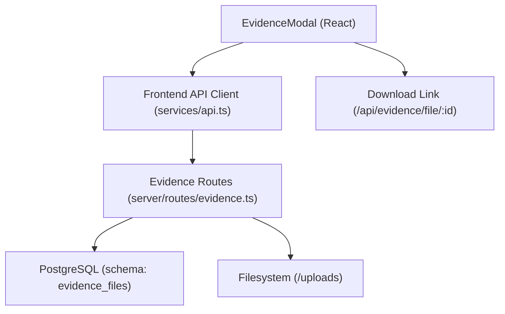
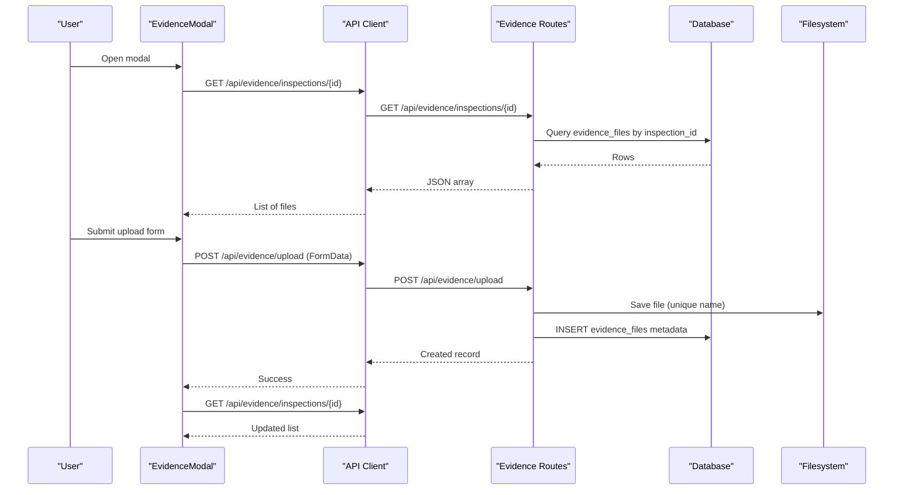
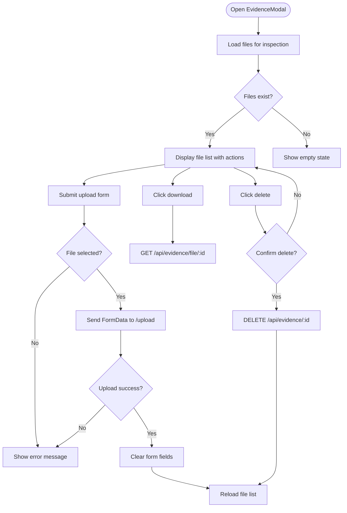
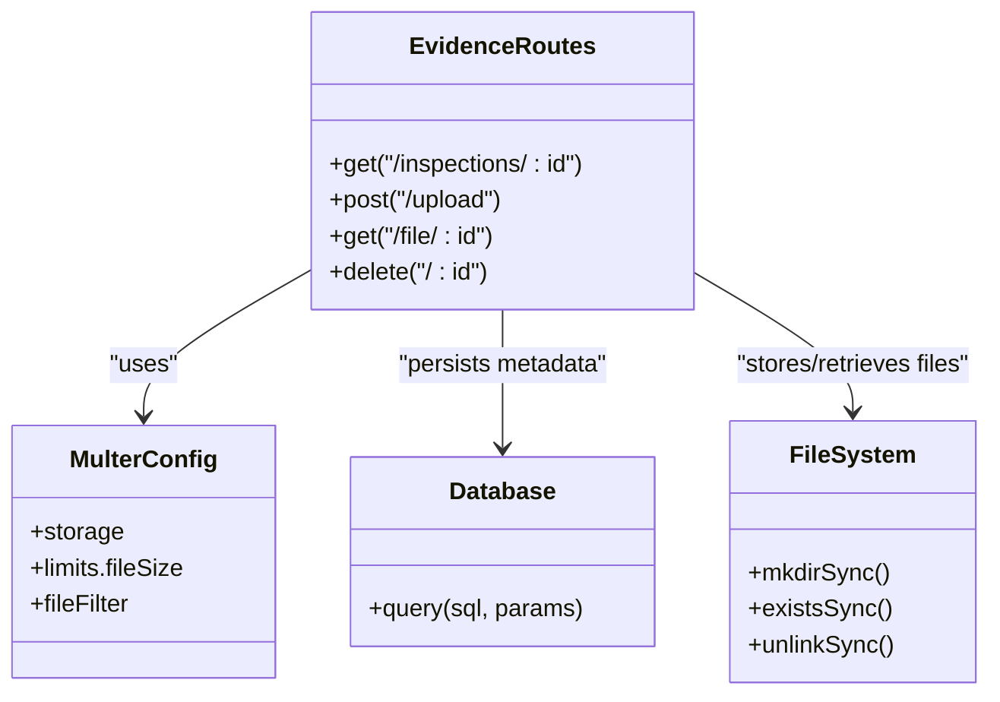
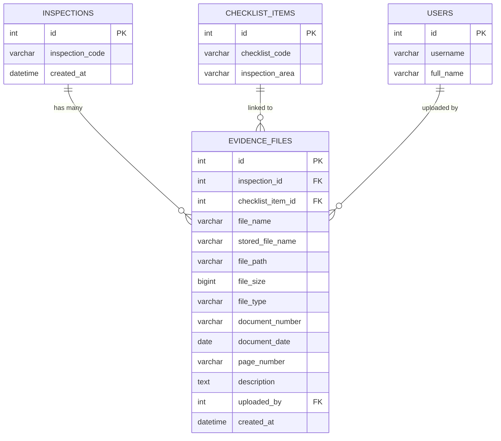
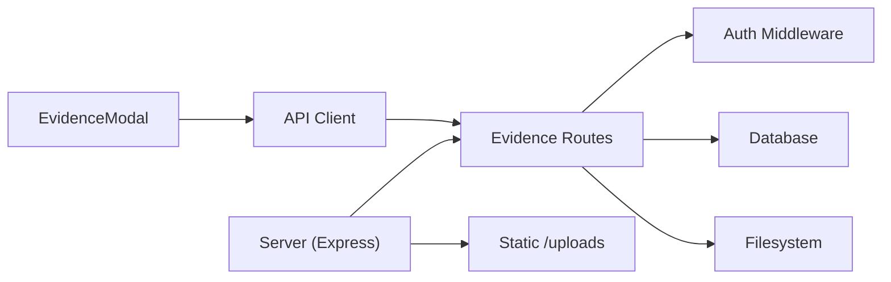

# Evidence Modal

<cite>
**Referenced Files in This Document**
- [EvidenceModal.tsx](file://src/components/modals/EvidenceModal.tsx)
- [evidence.ts](file://server/routes/evidence.ts)
- [api.ts](file://src/services/api.ts)
- [index.ts](file://src/types/index.ts)
- [schema.sql](file://database/schema.sql)
- [auth.ts](file://server/middleware/auth.ts)
- [server.ts](file://server.ts)
</cite>

## Table of Contents
1. [Introduction](#introduction)
2. [Project Structure](#project-structure)
3. [Core Components](#core-components)
4. [Architecture Overview](#architecture-overview)
5. [Detailed Component Analysis](#detailed-component-analysis)
6. [Dependency Analysis](#dependency-analysis)
7. [Performance Considerations](#performance-considerations)
8. [Troubleshooting Guide](#troubleshooting-guide)
9. [Conclusion](#conclusion)
10. [Appendices](#appendices)

## Introduction
This document explains the Evidence Modal component and its end-to-end file upload and evidence management capabilities. It covers supported file types, size limits, progress indicators, linking to inspections and checklist items, metadata handling, storage and retrieval, security considerations, access controls, user interface behaviors, and guidance for extending the system with custom handlers.

## Project Structure
The Evidence Modal is a React component that integrates with backend routes for uploading, listing, downloading, and deleting evidence files. The server uses Multer for file uploads, stores files on disk under an uploads directory, and persists metadata in a PostgreSQL database. Authentication middleware protects sensitive endpoints.

**Diagram sources**
- [EvidenceModal.tsx:1-279](file://src/components/modals/EvidenceModal.tsx#L1-L279)
- [api.ts:382-411](file://src/services/api.ts#L382-L411)
- [evidence.ts:43-194](file://server/routes/evidence.ts#L43-L194)
- [schema.sql:182-198](file://database/schema.sql#L182-L198)
- [server.ts:37-55](file://server.ts#L37-L55)

**Section sources**
- [EvidenceModal.tsx:1-279](file://src/components/modals/EvidenceModal.tsx#L1-L279)
- [evidence.ts:1-195](file://server/routes/evidence.ts#L1-L195)
- [api.ts:1-440](file://src/services/api.ts#L1-L440)
- [schema.sql:182-198](file://database/schema.sql#L182-L198)
- [server.ts:1-93](file://server.ts#L1-L93)

## Core Components
- EvidenceModal (UI): Provides upload form, file list, download, and delete actions; loads files by inspection and optional checklist item.
- Frontend API client: Encapsulates HTTP calls for listing, uploading, and deleting evidence files; attaches authentication token where required.
- Backend evidence routes: Handle file validation, storage, metadata persistence, listing, serving downloads, and deletion; enforce authentication and audit logging.
- Database schema: Defines the evidence_files table and relationships to inspections and checklist_items.
- Authentication middleware: Validates JWT tokens and injects user context into requests.

**Section sources**
- [EvidenceModal.tsx:6-91](file://src/components/modals/EvidenceModal.tsx#L6-L91)
- [api.ts:382-411](file://src/services/api.ts#L382-L411)
- [evidence.ts:43-194](file://server/routes/evidence.ts#L43-L194)
- [schema.sql:182-198](file://database/schema.sql#L182-L198)
- [auth.ts:36-58](file://server/middleware/auth.ts#L36-L58)

## Architecture Overview
The Evidence Modal initiates operations via the frontend API client, which communicates with Express routes. File uploads are processed by Multer, stored on disk, and recorded in the database. Downloads retrieve files from disk after verifying existence and ownership through database lookup. All write operations require authentication.

**Diagram sources**
- [EvidenceModal.tsx:37-81](file://src/components/modals/EvidenceModal.tsx#L37-L81)
- [api.ts:382-403](file://src/services/api.ts#L382-L403)
- [evidence.ts:43-134](file://server/routes/evidence.ts#L43-L134)
- [schema.sql:182-198](file://database/schema.sql#L182-L198)

## Detailed Component Analysis

### EvidenceModal (UI)
- Purpose: Allow users to upload evidence files linked to an inspection and optionally a checklist item; display existing files; enable download and delete.
- Upload flow:
  - Collects file and metadata (document number, date, page number, description).
  - Sends FormData to the backend upload endpoint.
  - On success, clears form fields and reloads the file list.
- Listing flow:
  - Loads files for the given inspectionId and optional checklistItemId.
  - Displays file name, description/document_number, and size when no description exists.
- Actions:
  - Download: Uses a direct link to the server’s file endpoint.
  - Delete: Confirms with the user, then removes the file from the list after successful deletion.
- Error handling:
  - Shows error messages from the backend or generic upload failure messages.
- Progress indicators:
  - Disables submit button during upload and shows localized text indicating upload in progress.
  - No real-time progress bar; consider adding one for large files.

**Diagram sources**
- [EvidenceModal.tsx:31-91](file://src/components/modals/EvidenceModal.tsx#L31-L91)
- [EvidenceModal.tsx:117-203](file://src/components/modals/EvidenceModal.tsx#L117-L203)
- [EvidenceModal.tsx:218-260](file://src/components/modals/EvidenceModal.tsx#L218-L260)

**Section sources**
- [EvidenceModal.tsx:6-91](file://src/components/modals/EvidenceModal.tsx#L6-L91)
- [EvidenceModal.tsx:117-203](file://src/components/modals/EvidenceModal.tsx#L117-L203)
- [EvidenceModal.tsx:218-260](file://src/components/modals/EvidenceModal.tsx#L218-L260)

### Backend Evidence Routes
- Allowed file types: PDF, DOC, DOCX, XLS, XLSX, JPG, JPEG, PNG, MP3, MP4.
- Size limit: 25 MB enforced by Multer configuration.
- Storage:
  - Destination: project root uploads directory.
  - Filename: unique name prefixed with EVD and timestamp plus random number, preserving original extension.
- Metadata persistence:
  - Stores original filename, unique stored filename, path, size, MIME type, document number/date/page, description, uploader user id, and timestamps.
- Endpoints:
  - List: GET /api/evidence/inspections/:id (optional checklist_item_id filter).
  - Upload: POST /api/evidence/upload (requires authentication).
  - Download: GET /api/evidence/file/:id (no explicit auth in route but typically protected by app-level policies).
  - Delete: DELETE /api/evidence/:id (requires authentication).
- Audit logging:
  - Logs UPLOAD_EVIDENCE and DELETE_EVIDENCE actions with relevant context.

**Diagram sources**
- [evidence.ts:16-41](file://server/routes/evidence.ts#L16-L41)
- [evidence.ts:43-194](file://server/routes/evidence.ts#L43-L194)
- [schema.sql:182-198](file://database/schema.sql#L182-L198)

**Section sources**
- [evidence.ts:16-41](file://server/routes/evidence.ts#L16-L41)
- [evidence.ts:43-194](file://server/routes/evidence.ts#L43-L194)
- [schema.sql:182-198](file://database/schema.sql#L182-L198)

### Frontend API Client
- Methods:
  - getEvidenceFiles(inspectionId, checklistItemId?): fetches list for an inspection.
  - uploadEvidence(formData): posts FormData to upload endpoint with Authorization header if token present.
  - deleteEvidence(id): deletes evidence by id with authentication headers.
- Behavior:
  - Throws errors with user-friendly messages on non-ok responses.
  - Handles multipart/form-data for uploads without setting Content-Type manually (browser sets boundary).

**Section sources**
- [api.ts:382-411](file://src/services/api.ts#L382-L411)

### Data Model and Relationships
- EvidenceFile includes identifiers for inspection and optional checklist item, plus rich metadata such as document number/date/page and description.
- Relationships:
  - evidence_files.inspection_id references inspections.id (cascade delete).
  - evidence_files.checklist_item_id references checklist_items.id (set null on delete).
  - evidence_files.uploaded_by references users.id (set null on delete).

**Diagram sources**
- [schema.sql:145-198](file://database/schema.sql#L145-L198)

**Section sources**
- [schema.sql:145-198](file://database/schema.sql#L145-L198)
- [index.ts:262-279](file://src/types/index.ts#L262-L279)

## Dependency Analysis
- EvidenceModal depends on:
  - Types for EvidenceFile.
  - API client methods for evidence operations.
- API client depends on:
  - Browser fetch and localStorage for token.
- Evidence routes depend on:
  - Multer for file handling.
  - Database query utility.
  - Authentication middleware for protected endpoints.
  - Audit logging utility.
- Server mounts routes under /api/evidence and serves static uploads at /uploads.

**Diagram sources**
- [EvidenceModal.tsx:1-4](file://src/components/modals/EvidenceModal.tsx#L1-L4)
- [api.ts:382-411](file://src/services/api.ts#L382-L411)
- [evidence.ts:1-8](file://server/routes/evidence.ts#L1-L8)
- [server.ts:37-55](file://server.ts#L37-L55)

**Section sources**
- [EvidenceModal.tsx:1-4](file://src/components/modals/EvidenceModal.tsx#L1-L4)
- [api.ts:382-411](file://src/services/api.ts#L382-L411)
- [evidence.ts:1-8](file://server/routes/evidence.ts#L1-L8)
- [server.ts:37-55](file://server.ts#L37-L55)

## Performance Considerations
- File size limit: 25 MB per upload; ensure network timeouts accommodate large files.
- Disk I/O: Ensure adequate disk space and fast storage for uploads directory.
- Database queries: Evidence listing filters by inspection_id and optional checklist_item_id; indexes on these columns improve performance.
- Static serving: The server serves uploads statically; consider using a CDN or reverse proxy for better delivery.
- Concurrency: Multer processes uploads synchronously; for high concurrency, consider streaming or queueing.

[No sources needed since this section provides general guidance]

## Troubleshooting Guide
- Upload fails with invalid file type:
  - Check allowed extensions configured in the upload filter.
  - Ensure file extension matches one of the permitted types.
- Upload exceeds size limit:
  - Enforced by Multer; reduce file size or adjust limits if necessary.
- Missing inspection_id:
  - Backend requires inspection_id; ensure it is included in FormData.
- Authentication errors:
  - Ensure Authorization header contains a valid Bearer token for upload and delete endpoints.
- File not found on download:
  - Verify the file exists in the uploads directory and the stored_file_name matches.
- Deletion issues:
  - Confirm the file exists before attempting deletion; backend handles missing files gracefully.

**Section sources**
- [evidence.ts:28-41](file://server/routes/evidence.ts#L28-L41)
- [evidence.ts:71-134](file://server/routes/evidence.ts#L71-L134)
- [evidence.ts:137-194](file://server/routes/evidence.ts#L137-L194)
- [auth.ts:36-58](file://server/middleware/auth.ts#L36-L58)

## Conclusion
The Evidence Modal provides a complete workflow for attaching evidence files to inspections and checklist items, with robust server-side validation, secure storage, and audit logging. While current UI lacks a real-time progress indicator, the system supports reliable uploads, downloads, and deletions with clear error messaging. Extensibility points include adding virus scanning, preview capabilities, and enhanced progress reporting.

[No sources needed since this section summarizes without analyzing specific files]

## Appendices

### Supported File Types and Limits
- Allowed extensions: PDF, DOC, DOCX, XLS, XLSX, JPG, JPEG, PNG, MP3, MP4.
- Maximum file size: 25 MB.

**Section sources**
- [evidence.ts:28-41](file://server/routes/evidence.ts#L28-L41)

### Linking Evidence to Entities
- Evidence files are linked to:
  - Inspections via inspection_id (required).
  - Checklist items via checklist_item_id (optional).
- The modal passes both IDs to the backend; listing can be filtered by checklist item.

**Section sources**
- [EvidenceModal.tsx:60-67](file://src/components/modals/EvidenceModal.tsx#L60-L67)
- [evidence.ts:43-68](file://server/routes/evidence.ts#L43-L68)
- [schema.sql:182-198](file://database/schema.sql#L182-L198)

### Metadata Handling
- Stored metadata includes:
  - Original filename, unique stored filename, path, size, MIME type.
  - Document number, document date, page number, description.
  - Uploader user id and timestamps.

**Section sources**
- [evidence.ts:93-114](file://server/routes/evidence.ts#L93-L114)
- [schema.sql:182-198](file://database/schema.sql#L182-L198)
- [index.ts:262-279](file://src/types/index.ts#L262-L279)

### Security and Access Controls
- Authentication:
  - Upload and delete endpoints require a valid JWT token via Authorization header.
- File validation:
  - Extension whitelist enforced by Multer.
  - Size limit enforced by Multer.
- Audit logging:
  - Upload and delete actions are logged with user context and IP address.

**Section sources**
- [auth.ts:36-58](file://server/middleware/auth.ts#L36-L58)
- [evidence.ts:71-134](file://server/routes/evidence.ts#L71-L134)
- [evidence.ts:159-194](file://server/routes/evidence.ts#L159-L194)

### User Interface Behaviors
- Upload form:
  - Requires file selection; displays accepted formats and size limit hint.
  - Optional fields: document number, document date, page number, description.
- File list:
  - Shows file name, description or document reference, and size fallback.
  - Download link to server file endpoint; delete button with confirmation.
- Loading states:
  - Shows loading indicator while fetching files.
  - Disables submit during upload.

**Section sources**
- [EvidenceModal.tsx:117-203](file://src/components/modals/EvidenceModal.tsx#L117-L203)
- [EvidenceModal.tsx:218-260](file://src/components/modals/EvidenceModal.tsx#L218-L260)

### Extending Evidence Management
- Custom file handlers:
  - Modify Multer fileFilter to add new allowed types or content-type checks.
  - Implement virus scanning by integrating an antivirus library or external service between file save and metadata insertion.
- Preview capabilities:
  - Add server-side conversion or client-side preview for images and PDFs.
- Progress indicators:
  - Use XMLHttpRequest or Fetch with progress events to show upload progress in the UI.
- Access control enhancements:
  - Implement role-based authorization to restrict who can upload or delete evidence.

[No sources needed since this section provides general guidance]