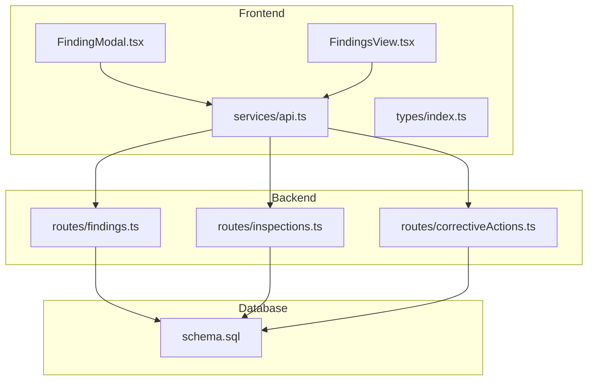
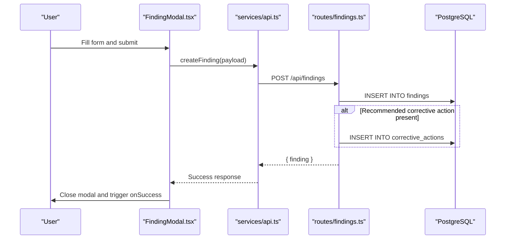
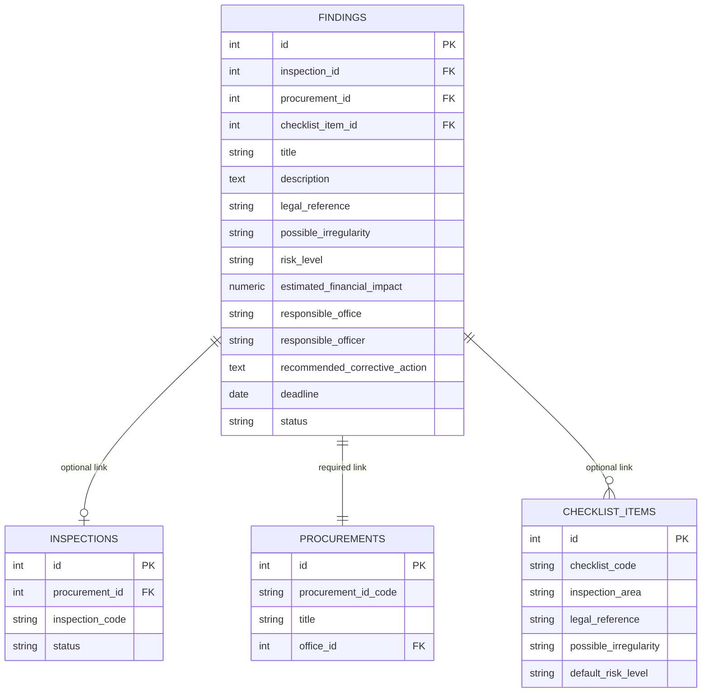
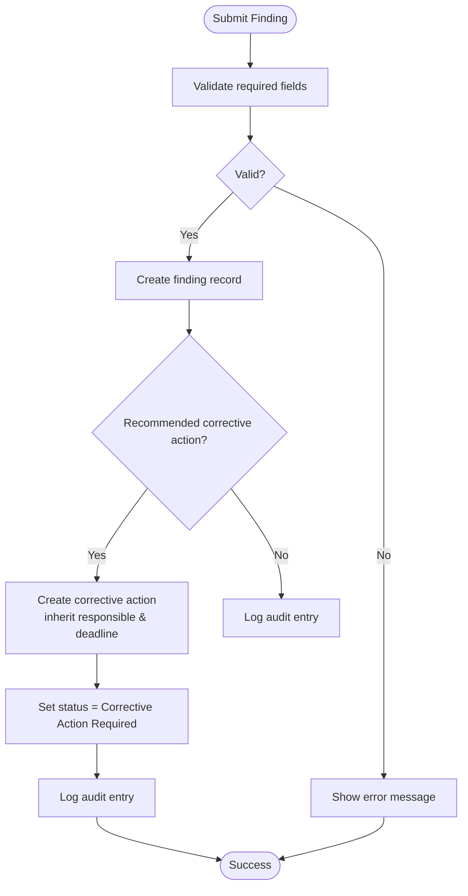
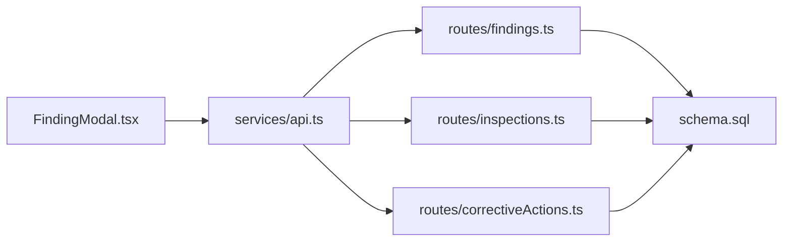

# Finding Modal

<cite>
**Referenced Files in This Document**
- [FindingModal.tsx](file://src/components/modals/FindingModal.tsx)
- [api.ts](file://src/services/api.ts)
- [index.ts](file://src/types/index.ts)
- [findings.ts](file://server/routes/findings.ts)
- [inspections.ts](file://server/routes/inspections.ts)
- [correctiveActions.ts](file://server/routes/correctiveActions.ts)
- [schema.sql](file://database/schema.sql)
- [FindingsView.tsx](file://src/components/FindingsView.tsx)
</cite>

## Table of Contents
1. [Introduction](#introduction)
2. [Project Structure](#project-structure)
3. [Core Components](#core-components)
4. [Architecture Overview](#architecture-overview)
5. [Detailed Component Analysis](#detailed-component-analysis)
6. [Dependency Analysis](#dependency-analysis)
7. [Performance Considerations](#performance-considerations)
8. [Troubleshooting Guide](#troubleshooting-guide)
9. [Conclusion](#conclusion)

## Introduction
This document provides comprehensive documentation for the FindingModal component used to create and manage inspection findings within the procurement monitoring system. It explains how the modal captures severity assessment, description fields, evidence linkage, and status tracking; how findings relate to inspections and checklist items; and how corrective actions are created from findings. It also covers form validation rules, data persistence, API integration, example finding types and scenarios, and the modal’s role in compliance monitoring and issue resolution.

## Project Structure
The FindingModal is part of a full-stack application with:
- Frontend React components (modals, views)
- A TypeScript service layer for API calls
- Backend Express routes for findings, inspections, and corrective actions
- PostgreSQL schema defining entities and relationships

**Diagram sources**
- [FindingModal.tsx:1-349](file://src/components/modals/FindingModal.tsx#L1-L349)
- [api.ts:284-333](file://src/services/api.ts#L284-L333)
- [findings.ts:122-221](file://server/routes/findings.ts#L122-L221)
- [inspections.ts:148-197](file://server/routes/inspections.ts#L148-L197)
- [correctiveActions.ts:68-121](file://server/routes/correctiveActions.ts#L68-L121)
- [schema.sql:200-244](file://database/schema.sql#L200-L244)

**Section sources**
- [FindingModal.tsx:1-349](file://src/components/modals/FindingModal.tsx#L1-L349)
- [api.ts:1-440](file://src/services/api.ts#L1-L440)
- [schema.sql:1-283](file://database/schema.sql#L1-L283)

## Core Components
- FindingModal: User-facing modal for creating findings with preloaded context (inspection, procurement, checklist item), severity/risk selection, legal references, financial impact, responsible parties, deadlines, and recommended corrective actions.
- Findings API: Server endpoints to list, retrieve, create, update, and delete findings; includes filtering by risk level, status, procurement, inspection, office, and search text.
- Inspections API: Provides inspection details and checklist results that can be linked to findings.
- Corrective Actions API: Manages corrective actions derived from findings; supports creation, updates, verification, and overdue detection.
- Data Types: Strongly typed interfaces for Procurement, ChecklistItem, Inspection, Finding, CorrectiveAction, EvidenceFile, etc.

Key responsibilities:
- Form state management and validation
- Preloading dropdowns (procurements, master checklists)
- Auto-filling fields based on selected checklist item
- Submitting findings via API
- Creating corrective actions automatically when recommended action is provided
- Updating status based on presence of corrective action

**Section sources**
- [FindingModal.tsx:29-138](file://src/components/modals/FindingModal.tsx#L29-L138)
- [findings.ts:8-76](file://server/routes/findings.ts#L8-L76)
- [correctiveActions.ts:8-66](file://server/routes/correctiveActions.ts#L8-L66)
- [index.ts:205-260](file://src/types/index.ts#L205-L260)

## Architecture Overview
The FindingModal integrates with the backend through a centralized API service. When a user submits a finding:
- The modal validates required fields and constructs a payload including optional links to inspection_id, procurement_id, and checklist_item_id.
- The API service sends a POST request to /api/findings.
- The server creates a finding record, generates a unique code, and optionally creates a corrective action if a recommended action is provided.
- Audit logging records the creation event.

**Diagram sources**
- [FindingModal.tsx:103-138](file://src/components/modals/FindingModal.tsx#L103-L138)
- [api.ts:305-314](file://src/services/api.ts#L305-L314)
- [findings.ts:122-221](file://server/routes/findings.ts#L122-L221)
- [schema.sql:200-244](file://database/schema.sql#L200-L244)

## Detailed Component Analysis

### FindingModal Form Fields and Validation
- Required fields:
  - Procurement selection (links to procurement entity)
  - Title (finding title)
  - Description (observation and details)
- Optional but important:
  - Checklist item selection (statutory indicator)
  - Legal reference (auto-filled from checklist item if not set)
  - Possible irregularity (auto-filled from checklist item if not set)
  - Risk level (severity assessment)
  - Estimated financial impact
  - Responsible office/officer
  - Recommended corrective action
  - Deadline (default 15 days ahead when preloading)
- Validation behavior:
  - Client-side validation ensures procurement, title, and description are present before submission.
  - Status is set to “Corrective Action Required” if a recommended corrective action is provided; otherwise “Open”.
  - Error messages are shown inline for validation failures or API errors.

**Section sources**
- [FindingModal.tsx:32-47](file://src/components/modals/FindingModal.tsx#L32-L47)
- [FindingModal.tsx:49-67](file://src/components/modals/FindingModal.tsx#L49-L67)
- [FindingModal.tsx:86-101](file://src/components/modals/FindingModal.tsx#L86-L101)
- [FindingModal.tsx:103-138](file://src/components/modals/FindingModal.tsx#L103-L138)

### Relationship Between Findings, Inspections, and Checklist Items
- Findings can be associated with:
  - An inspection (optional inspection_id)
  - A procurement (required procurement_id)
  - A specific checklist item (optional checklist_item_id)
- When a checklist item is selected:
  - Legal reference and possible irregularity auto-fill from the master checklist item.
  - Title may be prefilled using the inspection area.
  - Default risk level is applied from the checklist item.
- The backend queries join findings with procurements, offices, checklist items, and users to provide rich context in listing and detail views.

**Diagram sources**
- [schema.sql:145-162](file://database/schema.sql#L145-L162)
- [schema.sql:126-143](file://database/schema.sql#L126-L143)
- [schema.sql:83-114](file://database/schema.sql#L83-L114)
- [schema.sql:200-224](file://database/schema.sql#L200-L224)

**Section sources**
- [findings.ts:13-76](file://server/routes/findings.ts#L13-L76)
- [findings.ts:78-120](file://server/routes/findings.ts#L78-L120)
- [FindingModal.tsx:86-101](file://src/components/modals/FindingModal.tsx#L86-L101)

### Workflow for Creating Corrective Actions from Findings
- If the modal includes a recommended corrective action, the backend automatically creates a corrective action record linked to the new finding.
- The corrective action inherits responsible office/officer and deadline from the finding.
- Status defaults to pending (“बाँकी”) until updated or verified.
- Verification of corrective actions can update the finding status to “Resolved”.

**Diagram sources**
- [findings.ts:122-221](file://server/routes/findings.ts#L122-L221)
- [correctiveActions.ts:68-121](file://server/routes/correctiveActions.ts#L68-L121)
- [correctiveActions.ts:195-248](file://server/routes/correctiveActions.ts#L195-L248)

**Section sources**
- [findings.ts:187-203](file://server/routes/findings.ts#L187-L203)
- [correctiveActions.ts:222-231](file://server/routes/correctiveActions.ts#L222-L231)

### Evidence Linking
- While the FindingModal does not directly attach files, it supports capturing an evidence summary field in the backend model.
- Evidence files are managed separately and can be linked to inspections and checklist items; findings can reference evidence summaries or be correlated via inspection_id and checklist_item_id.
- The API service provides methods to upload and retrieve evidence files for inspections.

**Section sources**
- [schema.sql:182-198](file://database/schema.sql#L182-L198)
- [api.ts:382-411](file://src/services/api.ts#L382-L411)
- [index.ts:262-279](file://src/types/index.ts#L262-L279)

### Status Tracking and Lifecycle
- Findings statuses include Open, Under Review, Corrective Action Required, Resolved, Closed, Referred.
- The modal sets status based on whether a corrective action is recommended.
- Corrective action verification can transition findings to Resolved.
- Listing and filtering support risk level and status filters.

**Section sources**
- [FindingModal.tsx:122-129](file://src/components/modals/FindingModal.tsx#L122-L129)
- [index.ts:205-235](file://src/types/index.ts#L205-L235)
- [FindingsView.tsx:140-167](file://src/components/FindingsView.tsx#L140-L167)

### Example Finding Types and Usage Scenarios
- Procedural deviation: Missing documents or incorrect bidding method; use high risk and specify legal reference; attach evidence summary and recommend corrective action.
- Financial irregularity: Overpayment or unauthorized cost; set significant estimated financial impact; assign responsible officer and deadline; create corrective action for recovery.
- Compliance gap: Failure to follow statutory requirement; link to checklist item to auto-fill legal reference and possible irregularity; set appropriate risk level and corrective action.
- Low-risk observation: Minor process improvement suggestion; low risk, no corrective action required; mark as Open or Resolved after review.

[No sources needed since this section provides conceptual examples]

## Dependency Analysis
- FindingModal depends on:
  - services/api.ts for fetching procurements and master checklists and submitting findings
  - types/index.ts for strongly-typed models
- Backend dependencies:
  - findings.ts route handles CRUD operations and audit logging
  - inspections.ts route provides inspection and checklist context
  - correctiveActions.ts route manages corrective actions and verification
- Database schema defines relationships and constraints ensuring referential integrity between findings, inspections, procurements, checklist items, and corrective actions.

**Diagram sources**
- [FindingModal.tsx:1-349](file://src/components/modals/FindingModal.tsx#L1-L349)
- [api.ts:1-440](file://src/services/api.ts#L1-L440)
- [findings.ts:1-335](file://server/routes/findings.ts#L1-L335)
- [inspections.ts:1-409](file://server/routes/inspections.ts#L1-L409)
- [correctiveActions.ts:1-251](file://server/routes/correctiveActions.ts#L1-L251)
- [schema.sql:1-283](file://database/schema.sql#L1-L283)

**Section sources**
- [api.ts:284-333](file://src/services/api.ts#L284-L333)
- [findings.ts:122-221](file://server/routes/findings.ts#L122-L221)
- [correctiveActions.ts:68-121](file://server/routes/correctiveActions.ts#L68-L121)
- [schema.sql:200-244](file://database/schema.sql#L200-L244)

## Performance Considerations
- Parallel loading of dropdowns: The modal fetches procurements and master checklists concurrently to reduce load time.
- Efficient querying: Backend uses JOINs and indexed columns (e.g., idx_findings_inspection, idx_findings_risk) to optimize listing and filtering.
- Minimal client-side state: Only necessary fields are stored in local state; defaults are computed on open.
- Avoid unnecessary re-renders: Conditional rendering based on isOpen prevents overhead when modal is closed.

[No sources needed since this section provides general guidance]

## Troubleshooting Guide
Common issues and resolutions:
- Validation errors: Ensure procurement, title, and description are filled; check for empty strings or invalid inputs.
- API errors: Verify authentication token and network connectivity; inspect error messages returned by the backend.
- Missing checklist data: Confirm master checklists are loaded; if not, refresh the page or check backend availability.
- Incorrect auto-fill: If legal reference or possible irregularity do not populate, ensure the selected checklist item has these values defined.
- Corrective action not created: Confirm recommended corrective action is provided; verify backend logic for automatic creation.

**Section sources**
- [FindingModal.tsx:103-138](file://src/components/modals/FindingModal.tsx#L103-L138)
- [findings.ts:122-221](file://server/routes/findings.ts#L122-L221)
- [api.ts:305-314](file://src/services/api.ts#L305-L314)

## Conclusion
The FindingModal streamlines the capture of inspection findings with robust validation, contextual auto-fill, and seamless integration with backend APIs. It supports severity assessment, evidence linking, and status tracking while enabling automatic creation of corrective actions. Its design promotes compliance monitoring and efficient issue resolution by aligning findings with inspections, procurements, and statutory checklists, and by providing clear workflows for corrective action lifecycle management.

[No sources needed since this section summarizes without analyzing specific files]