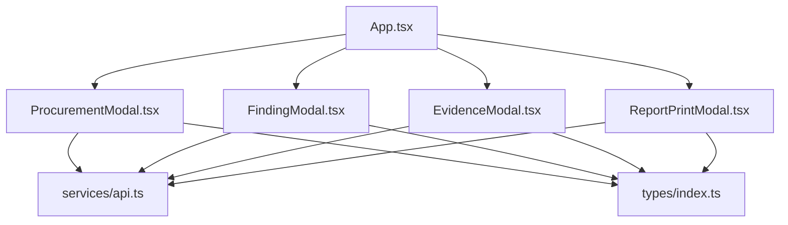
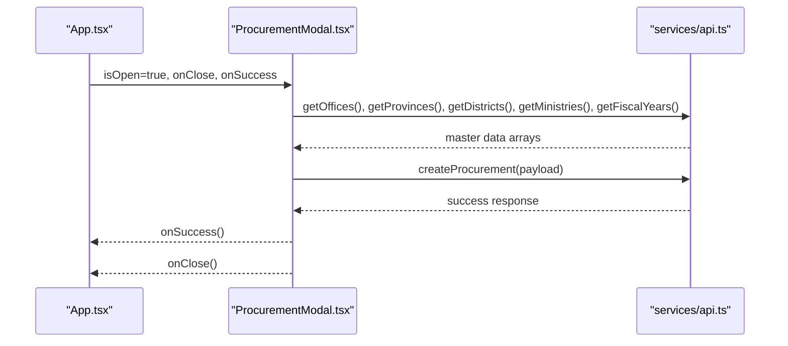
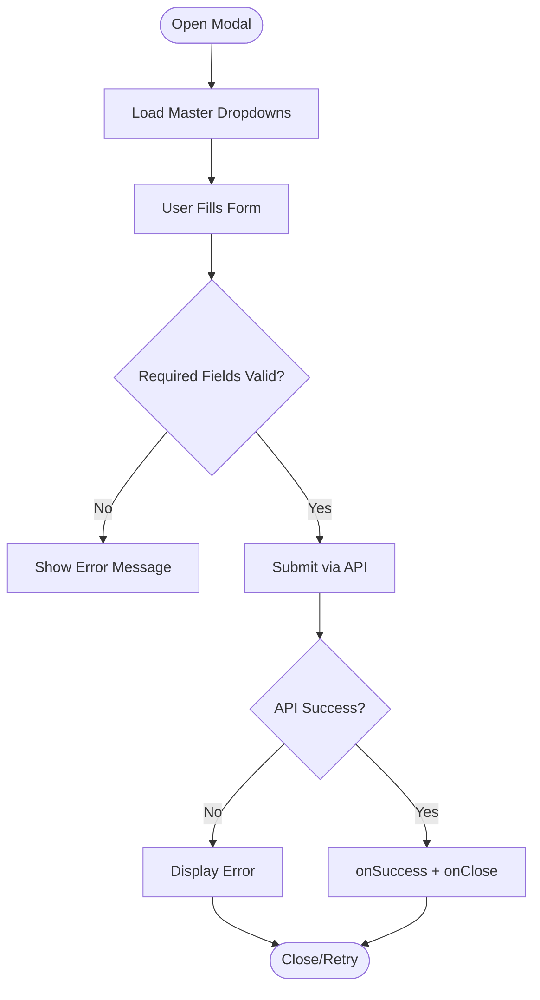
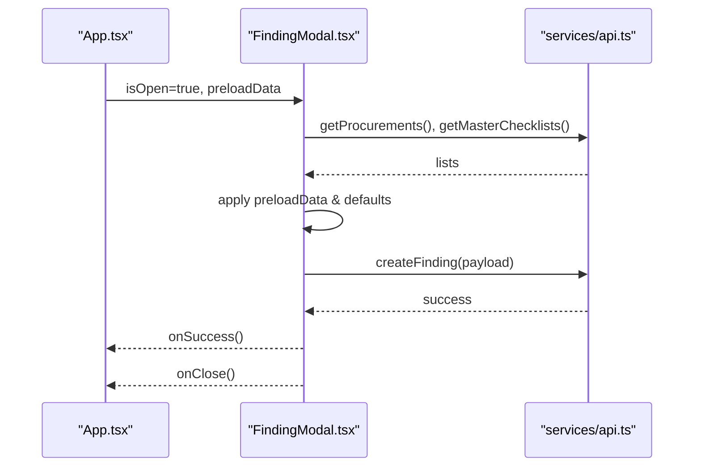
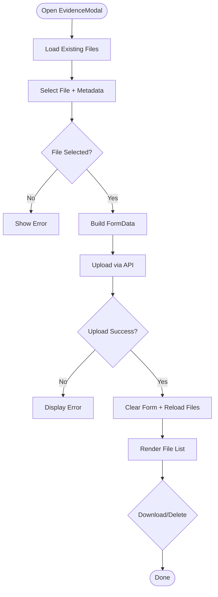
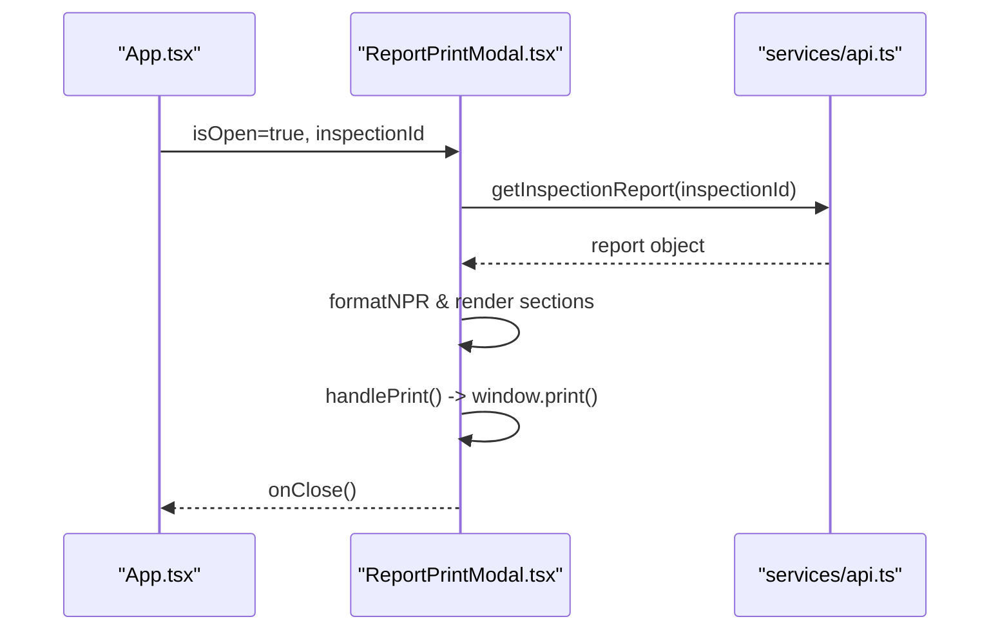
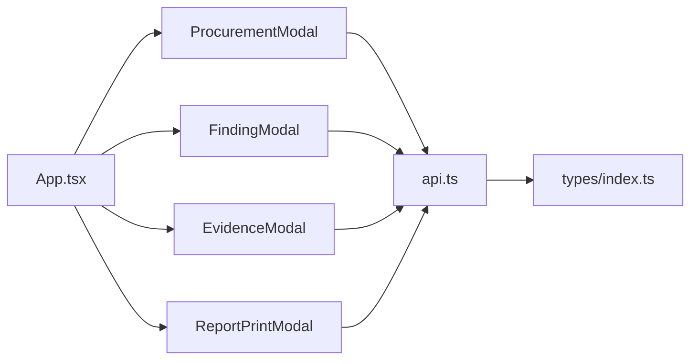

# Modal Components

<cite>
**Referenced Files in This Document**
- [ProcurementModal.tsx](file://src/components/modals/ProcurementModal.tsx)
- [FindingModal.tsx](file://src/components/modals/FindingModal.tsx)
- [EvidenceModal.tsx](file://src/components/modals/EvidenceModal.tsx)
- [ReportPrintModal.tsx](file://src/components/modals/ReportPrintModal.tsx)
- [App.tsx](file://src/App.tsx)
- [api.ts](file://src/services/api.ts)
- [index.ts](file://src/types/index.ts)
</cite>

## Table of Contents
1. Introduction
2. Project Structure
3. Core Components
4. Architecture Overview
5. Detailed Component Analysis
6. Dependency Analysis
7. Performance Considerations
8. Troubleshooting Guide
9. Conclusion
10. Appendices

## Introduction
This document provides comprehensive documentation for the modal component system used in the NVC application. It covers four primary modals: ProcurementModal, FindingModal, EvidenceModal, and ReportPrintModal. The focus includes modal lifecycle management, prop interfaces, event handling patterns, form validation, data submission, error handling, file upload functionality, report generation, complex form handling, positioning, accessibility considerations, keyboard navigation, responsive behavior, and guidance for creating new modals following established patterns.

## Project Structure
The modal components reside under src/components/modals and are integrated into the application via App.tsx. Each modal encapsulates its own state, UI, and API interactions through a centralized api service. Types for shared models are defined in types/index.ts.

**Diagram sources**
- [App.tsx:14-17](file://src/App.tsx#L14-L17)
- [App.tsx:194-229](file://src/App.tsx#L194-L229)
- [api.ts:1-20](file://src/services/api.ts#L1-L20)
- [index.ts:1-338](file://src/types/index.ts#L1-L338)

**Section sources**
- [App.tsx:14-17](file://src/App.tsx#L14-L17)
- [App.tsx:194-229](file://src/App.tsx#L194-L229)
- [api.ts:1-20](file://src/services/api.ts#L1-L20)
- [index.ts:1-338](file://src/types/index.ts#L1-L338)

## Core Components
- ProcurementModal: Creates procurement records with rich master dropdowns (offices, provinces, districts, ministries, fiscal years), validates required fields, and submits via API.
- FindingModal: Registers inspection findings linked to procurements and checklist items, supports preloading data, sets default risk levels, and manages corrective action fields.
- EvidenceModal: Uploads evidence files with metadata, lists existing files, supports deletion, and integrates with the evidence API.
- ReportPrintModal: Loads an official inspection report packet, formats financial values, and enables printing or saving as PDF.

Key responsibilities:
- Lifecycle: Controlled visibility via isOpen prop; internal effects load data when opened.
- State: Local React state for forms, loading, errors, and list data.
- Events: onSubmit handlers call API methods; onSuccess callbacks notify parent; onClose resets state.
- Validation: Client-side checks before submission; server errors surfaced to user.
- Data flow: Modals call api methods that perform fetch calls with authentication headers.

**Section sources**
- [ProcurementModal.tsx:6-16](file://src/components/modals/ProcurementModal.tsx#L6-L16)
- [FindingModal.tsx:6-21](file://src/components/modals/FindingModal.tsx#L6-L21)
- [EvidenceModal.tsx:6-11](file://src/components/modals/EvidenceModal.tsx#L6-L11)
- [ReportPrintModal.tsx:5-9](file://src/components/modals/ReportPrintModal.tsx#L5-L9)
- [api.ts:130-160](file://src/services/api.ts#L130-L160)
- [api.ts:284-325](file://src/services/api.ts#L284-L325)
- [api.ts:382-411](file://src/services/api.ts#L382-L411)
- [api.ts:419-425](file://src/services/api.ts#L419-L425)

## Architecture Overview
Modals are rendered at the root level in App.tsx. Each modal receives props from the parent and communicates back via callbacks. All network requests go through the api service, which centralizes authentication and error handling.

**Diagram sources**
- [App.tsx:194-200](file://src/App.tsx#L194-L200)
- [ProcurementModal.tsx:49-73](file://src/components/modals/ProcurementModal.tsx#L49-L73)
- [ProcurementModal.tsx:86-127](file://src/components/modals/ProcurementModal.tsx#L86-L127)
- [api.ts:76-128](file://src/services/api.ts#L76-L128)
- [api.ts:130-160](file://src/services/api.ts#L130-L160)

**Section sources**
- [App.tsx:194-229](file://src/App.tsx#L194-L229)
- [ProcurementModal.tsx:49-127](file://src/components/modals/ProcurementModal.tsx#L49-L127)
- [api.ts:76-160](file://src/services/api.ts#L76-L160)

## Detailed Component Analysis

### ProcurementModal
Purpose:
- Create new procurement entries with comprehensive fields including title, procurement number, office, ministry, location hierarchy, type/method, fiscal year, budget source, estimated cost, contract amount, contractor details, dates, and inspection team info.

Lifecycle:
- On open: loads master dropdowns using Promise.all for performance.
- On submit: validates required fields, constructs payload, calls API, then triggers onSuccess and onClose.

Form validation:
- Required fields: title, officeId, estimatedCost, contractAmount.
- Error message displayed inline if validation fails.

Data submission:
- Uses api.createProcurement with typed payload mapping local state to API fields.

Error handling:
- Catches server errors and displays localized messages.

Positioning and responsiveness:
- Fixed overlay with backdrop blur, centered flex layout, max-width and scrollable content area. Responsive grid layouts adapt to screen sizes.

Accessibility notes:
- Focus ring styles on inputs/selects for keyboard navigation.
- Close button present; no explicit aria attributes implemented.

Keyboard navigation:
- Standard HTML form controls support Enter to submit and Escape not handled within modal.

Responsive behavior:
- Tailwind classes provide mobile-first responsive grids and spacing.

**Diagram sources**
- [ProcurementModal.tsx:49-73](file://src/components/modals/ProcurementModal.tsx#L49-L73)
- [ProcurementModal.tsx:86-127](file://src/components/modals/ProcurementModal.tsx#L86-L127)

**Section sources**
- [ProcurementModal.tsx:6-16](file://src/components/modals/ProcurementModal.tsx#L6-L16)
- [ProcurementModal.tsx:49-127](file://src/components/modals/ProcurementModal.tsx#L49-L127)
- [ProcurementModal.tsx:131-373](file://src/components/modals/ProcurementModal.tsx#L131-L373)
- [api.ts:76-160](file://src/services/api.ts#L76-L160)

### FindingModal
Purpose:
- Register inspection findings linked to procurements and optional checklist items. Supports preloaded data for editing or quick creation.

Lifecycle:
- On open: loads procurements and checklist items; applies preloadData to populate fields; sets default deadline 15 days ahead.

Complex form handling:
- Dynamic defaults based on selected checklist item (legal reference, possible irregularity, title, risk level).
- Auto-fills responsible office based on selected procurement.

Validation:
- Requires procurement, title, description.

Submission:
- Calls api.createFinding with mapped fields; status set conditionally based on presence of recommended corrective action.

Error handling:
- Displays server error messages; clears submitting state.

Positioning and responsiveness:
- Similar fixed overlay pattern; red-themed header; responsive grid for fields.

Accessibility notes:
- Inputs have focus rings; close button available; no explicit ARIA roles.

Keyboard navigation:
- Standard form controls; no custom keydown handlers.

**Diagram sources**
- [App.tsx:202-212](file://src/App.tsx#L202-L212)
- [FindingModal.tsx:49-84](file://src/components/modals/FindingModal.tsx#L49-L84)
- [FindingModal.tsx:103-138](file://src/components/modals/FindingModal.tsx#L103-L138)
- [api.ts:130-160](file://src/services/api.ts#L130-L160)
- [api.ts:284-325](file://src/services/api.ts#L284-L325)

**Section sources**
- [FindingModal.tsx:6-21](file://src/components/modals/FindingModal.tsx#L6-L21)
- [FindingModal.tsx:49-138](file://src/components/modals/FindingModal.tsx#L49-L138)
- [FindingModal.tsx:142-347](file://src/components/modals/FindingModal.tsx#L142-L347)
- [api.ts:284-325](file://src/services/api.ts#L284-L325)

### EvidenceModal
Purpose:
- Manage evidence files associated with inspections and optionally checklist items. Supports uploading, listing, downloading, and deleting files.

Lifecycle:
- On open: loads existing files via api.getEvidenceFiles(inspectionId, checklistItemId?).

File upload:
- Builds FormData with file and metadata (document number/date, page number, description).
- Calls api.uploadEvidence; clears form fields; reloads file list.

Deletion:
- Confirms deletion via window.confirm; calls api.deleteEvidence; updates local list.

Error handling:
- Shows error messages for upload failures; logs other errors.

Positioning and responsiveness:
- Fixed overlay with scrollable body; responsive grid for metadata fields.

Accessibility notes:
- File input is native; download links use anchor tags; no explicit ARIA attributes.

Keyboard navigation:
- Native file input and buttons; no custom handlers.

**Diagram sources**
- [EvidenceModal.tsx:31-47](file://src/components/modals/EvidenceModal.tsx#L31-L47)
- [EvidenceModal.tsx:49-81](file://src/components/modals/EvidenceModal.tsx#L49-L81)
- [EvidenceModal.tsx:83-91](file://src/components/modals/EvidenceModal.tsx#L83-L91)
- [api.ts:382-411](file://src/services/api.ts#L382-L411)

**Section sources**
- [EvidenceModal.tsx:6-11](file://src/components/modals/EvidenceModal.tsx#L6-L11)
- [EvidenceModal.tsx:31-91](file://src/components/modals/EvidenceModal.tsx#L31-L91)
- [EvidenceModal.tsx:95-277](file://src/components/modals/EvidenceModal.tsx#L95-L277)
- [api.ts:382-411](file://src/services/api.ts#L382-L411)

### ReportPrintModal
Purpose:
- Display an official inspection report packet with procurement details, compliance summary, findings, corrective actions, and signature blocks. Supports printing or saving as PDF.

Lifecycle:
- On open: loads report via api.getInspectionReport(inspectionId); shows loading state until data arrives.

Report generation:
- Formats currency using Intl.NumberFormat for Nepali locale.
- Renders structured sections with tables and summaries.

Printing:
- Triggers window.print(); uses CSS class no-print to hide control bar during print.

Error handling:
- Logs errors; maintains loading state; renders empty states gracefully.

Positioning and responsiveness:
- Wider modal with larger max-width; scrollable content; print-friendly styling.

Accessibility notes:
- Print button accessible; no explicit ARIA roles; relies on semantic HTML structure.

Keyboard navigation:
- Button elements support Enter/Space; no custom keydown handlers.

**Diagram sources**
- [App.tsx:223-229](file://src/App.tsx#L223-L229)
- [ReportPrintModal.tsx:19-35](file://src/components/modals/ReportPrintModal.tsx#L19-L35)
- [ReportPrintModal.tsx:37-46](file://src/components/modals/ReportPrintModal.tsx#L37-L46)
- [api.ts:419-425](file://src/services/api.ts#L419-L425)

**Section sources**
- [ReportPrintModal.tsx:5-9](file://src/components/modals/ReportPrintModal.tsx#L5-L9)
- [ReportPrintModal.tsx:19-46](file://src/components/modals/ReportPrintModal.tsx#L19-L46)
- [ReportPrintModal.tsx:50-303](file://src/components/modals/ReportPrintModal.tsx#L50-L303)
- [api.ts:419-425](file://src/services/api.ts#L419-L425)

## Dependency Analysis
Modals depend on:
- Centralized api service for all HTTP operations, including auth headers and error handling.
- Shared types for consistent data structures across components.
- Parent App.tsx for modal state management and callback wiring.

Coupling and cohesion:
- High cohesion within each modal (self-contained UI and logic).
- Low coupling to parent except for controlled visibility and callbacks.
- Shared dependencies minimized via api and types.

Potential circular dependencies:
- None observed; modals import api and types only.

External integrations:
- Backend endpoints for procurements, checklists, findings, evidence, reports.
- Browser APIs for file input and printing.

Interface contracts:
- api methods return typed promises; errors thrown with descriptive messages.
- Modal props enforce isOpen, onClose, and specific payloads.

**Diagram sources**
- [ProcurementModal.tsx:1-4](file://src/components/modals/ProcurementModal.tsx#L1-L4)
- [FindingModal.tsx:1-4](file://src/components/modals/FindingModal.tsx#L1-L4)
- [EvidenceModal.tsx:1-4](file://src/components/modals/EvidenceModal.tsx#L1-L4)
- [ReportPrintModal.tsx:1-3](file://src/components/modals/ReportPrintModal.tsx#L1-L3)
- [api.ts:1-20](file://src/services/api.ts#L1-L20)
- [index.ts:1-338](file://src/types/index.ts#L1-L338)
- [App.tsx:14-17](file://src/App.tsx#L14-L17)

**Section sources**
- [api.ts:1-20](file://src/services/api.ts#L1-L20)
- [index.ts:1-338](file://src/types/index.ts#L1-L338)
- [App.tsx:14-17](file://src/App.tsx#L14-L17)

## Performance Considerations
- Parallel data loading: ProcurementModal uses Promise.all to fetch multiple master datasets concurrently, reducing latency.
- Conditional rendering: Modals return null when not open, avoiding unnecessary DOM and state updates.
- Efficient state updates: Local state minimizes re-renders; lists updated immutably.
- Printing optimization: ReportPrintModal hides non-printable UI via no-print class to streamline output.

Recommendations:
- Debounce rapid submissions to prevent duplicate requests.
- Implement optimistic UI updates where appropriate to improve perceived performance.
- Add pagination or virtualization for large file lists if needed.

[No sources needed since this section provides general guidance]

## Troubleshooting Guide
Common issues and resolutions:
- Validation errors: Ensure required fields are filled; check error messages displayed in modals.
- Network errors: Verify authentication token and backend availability; inspect console logs for detailed messages.
- File upload failures: Confirm file size limits and supported formats; ensure FormData is constructed correctly.
- Report loading failures: Check inspectionId validity and backend endpoint responses.

Debugging tips:
- Use browser DevTools Network tab to inspect API requests/responses.
- Log payload objects before submission to verify field mappings.
- Temporarily disable validations to isolate server-side issues.

**Section sources**
- [ProcurementModal.tsx:86-127](file://src/components/modals/ProcurementModal.tsx#L86-L127)
- [FindingModal.tsx:103-138](file://src/components/modals/FindingModal.tsx#L103-L138)
- [EvidenceModal.tsx:49-81](file://src/components/modals/EvidenceModal.tsx#L49-L81)
- [ReportPrintModal.tsx:19-35](file://src/components/modals/ReportPrintModal.tsx#L19-L35)
- [api.ts:23-32](file://src/services/api.ts#L23-L32)

## Conclusion
The modal system in the NVC application follows a consistent pattern: controlled visibility via props, local state for forms and data, centralized API interactions, and clear error handling. Each modal addresses specific workflows—procurement creation, finding registration, evidence management, and report printing—with responsive UI and robust data flows. Following the established patterns ensures maintainability and scalability as new modals are added.

[No sources needed since this section summarizes without analyzing specific files]

## Appendices

### Prop Interfaces Summary
- ProcurementModalProps: isOpen, onClose, onSuccess
- FindingModalProps: isOpen, onClose, onSuccess, preloadData (optional)
- EvidenceModalProps: isOpen, onClose, inspectionId, checklistItemId (optional)
- ReportPrintModalProps: isOpen, onClose, inspectionId

**Section sources**
- [ProcurementModal.tsx:6-16](file://src/components/modals/ProcurementModal.tsx#L6-L16)
- [FindingModal.tsx:6-21](file://src/components/modals/FindingModal.tsx#L6-L21)
- [EvidenceModal.tsx:6-11](file://src/components/modals/EvidenceModal.tsx#L6-L11)
- [ReportPrintModal.tsx:5-9](file://src/components/modals/ReportPrintModal.tsx#L5-L9)

### Creating New Modals: Best Practices
- Control visibility with isOpen and manage state in parent component.
- Use useEffect to load data when modal opens; reset state on close.
- Implement client-side validation before submission; display errors inline.
- Call api methods for all network operations; handle errors consistently.
- Provide onSuccess and onClose callbacks to update parent state and refresh data.
- Use responsive Tailwind classes for layout; keep modals focused and accessible.
- Avoid global side effects; keep modals self-contained.

[No sources needed since this section provides general guidance]