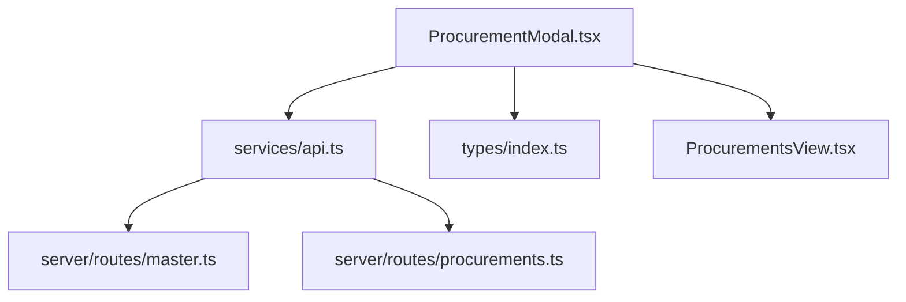
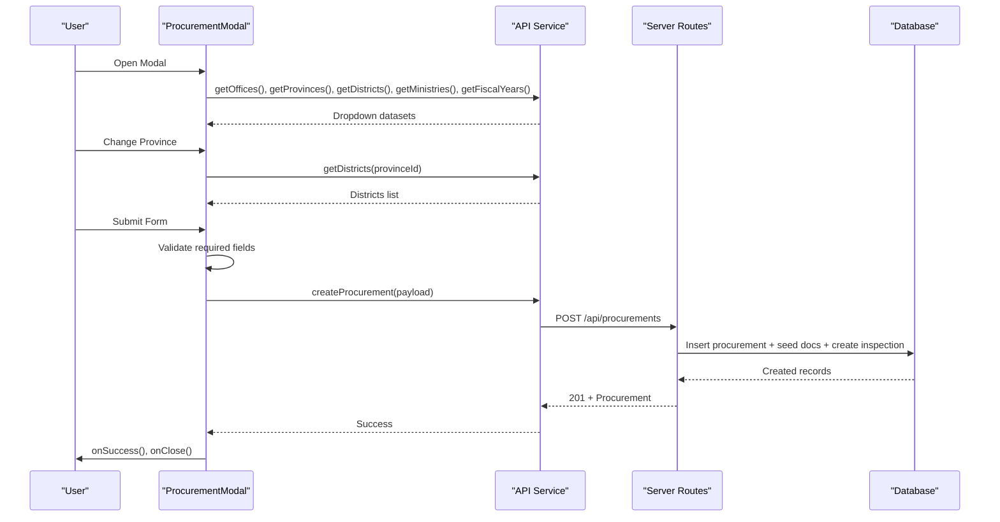
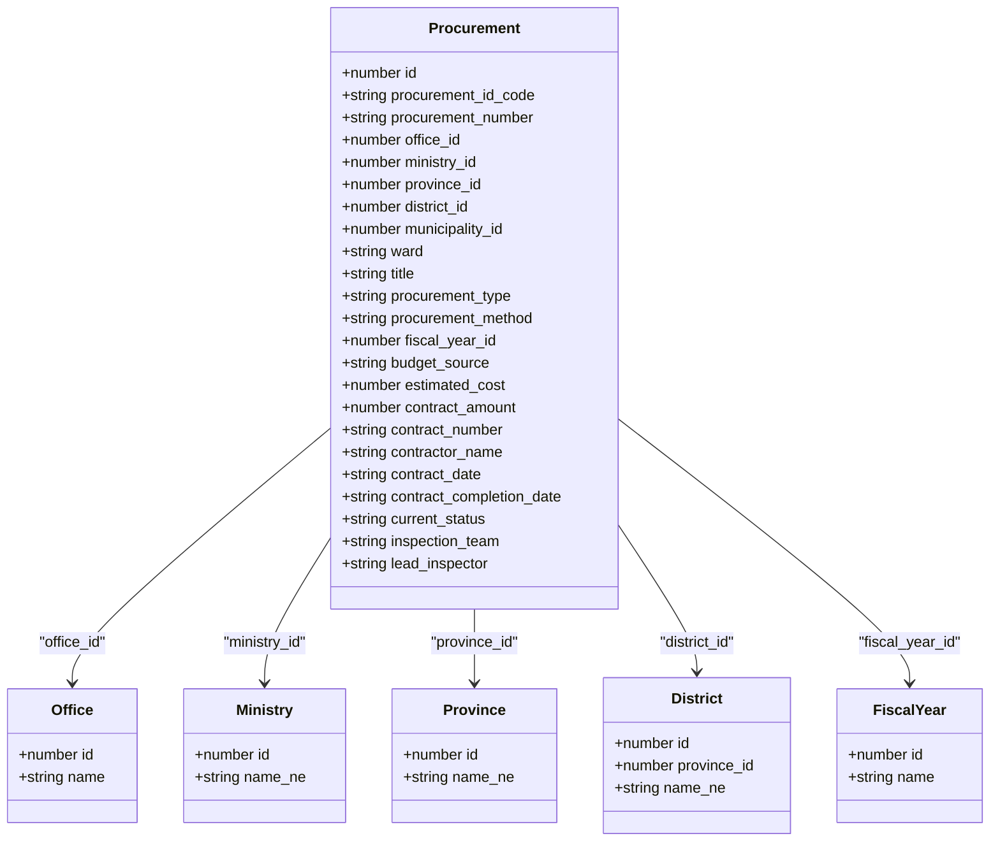
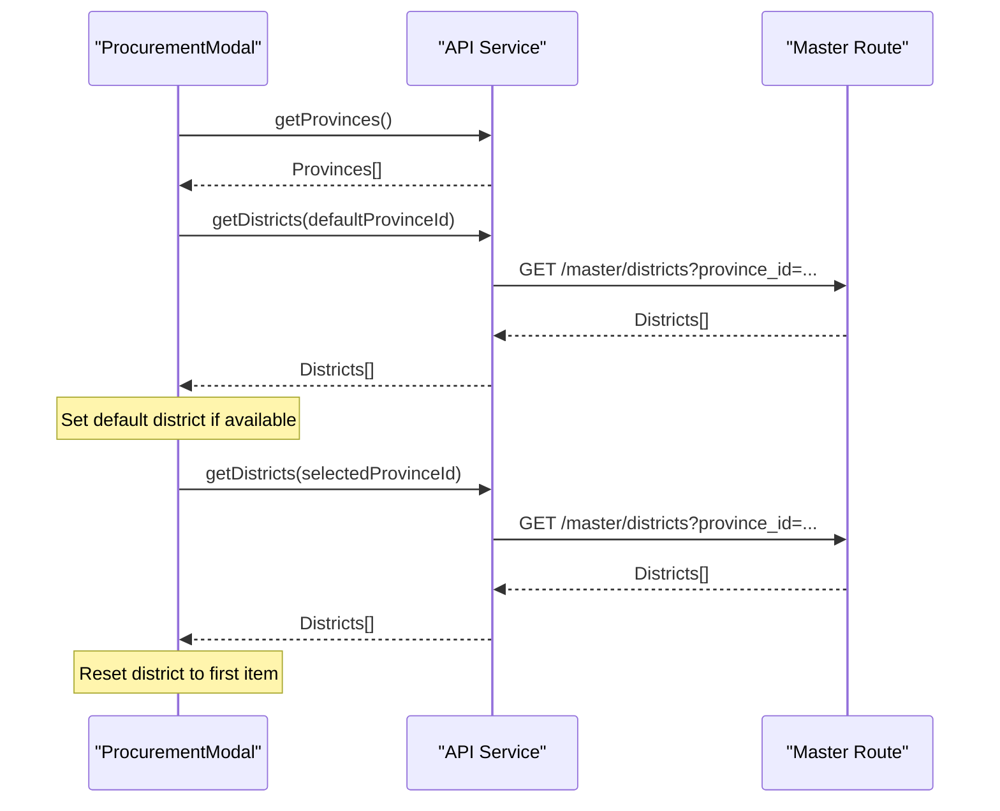
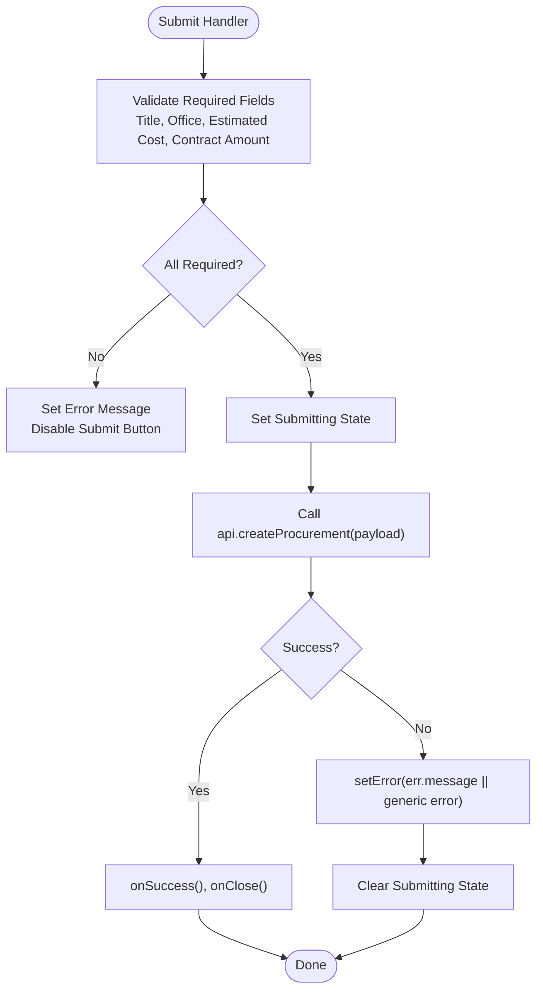
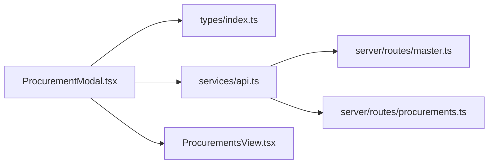

# Procurement Modal

<cite>
**Referenced Files in This Document**
- [ProcurementModal.tsx](file://src/components/modals/ProcurementModal.tsx)
- [api.ts](file://src/services/api.ts)
- [index.ts](file://src/types/index.ts)
- [procurements.ts](file://server/routes/procurements.ts)
- [master.ts](file://server/routes/master.ts)
- [ProcurementsView.tsx](file://src/components/ProcurementsView.tsx)
</cite>

## Table of Contents
1. [Introduction](#introduction)
2. [Project Structure](#project-structure)
3. [Core Components](#core-components)
4. [Architecture Overview](#architecture-overview)
5. [Detailed Component Analysis](#detailed-component-analysis)
6. [Dependency Analysis](#dependency-analysis)
7. [Performance Considerations](#performance-considerations)
8. [Troubleshooting Guide](#troubleshooting-guide)
9. [Conclusion](#conclusion)
10. [Appendices](#appendices)

## Introduction
This document provides comprehensive documentation for the ProcurementModal component used to register new public procurement projects. It explains the form fields, validation logic, error handling, data submission workflow, dynamic dropdowns (offices, provinces, districts, ministries, fiscal years), cascading location selection, bilingual labels and placeholders, and guidance for extending the modal or modifying the creation workflow.

## Project Structure
The ProcurementModal is a React component that renders a registration form and interacts with backend APIs via a centralized API service. Master data endpoints provide dropdown options, while the procurement creation endpoint persists the record and seeds related entities.

**Diagram sources**
- [ProcurementModal.tsx:1-127](file://src/components/modals/ProcurementModal.tsx#L1-L127)
- [api.ts:76-160](file://src/services/api.ts#L76-L160)
- [master.ts:24-149](file://server/routes/master.ts#L24-L149)
- [procurements.ts:174-326](file://server/routes/procurements.ts#L174-L326)
- [ProcurementsView.tsx:126-149](file://src/components/ProcurementsView.tsx#L126-L149)

**Section sources**
- [ProcurementModal.tsx:1-127](file://src/components/modals/ProcurementModal.tsx#L1-L127)
- [api.ts:76-160](file://src/services/api.ts#L76-L160)
- [master.ts:24-149](file://server/routes/master.ts#L24-L149)
- [procurements.ts:174-326](file://server/routes/procurements.ts#L174-L326)
- [ProcurementsView.tsx:126-149](file://src/components/ProcurementsView.tsx#L126-L149)

## Core Components
- ProcurementModal: Renders the registration form, manages local state, loads master data, handles province-district cascade, validates inputs, and submits the procurement.
- API Service: Encapsulates HTTP calls to master and procurement endpoints, including createProcurement.
- Types: Defines interfaces for Office, Province, District, Municipality, Ministry, FiscalYear, and Procurement.
- Backend Routes: Provide master data and handle procurement creation, validation, seeding documents, and inspection initialization.

Key responsibilities:
- Load dropdowns on open: offices, provinces, districts (default province), ministries, fiscal years.
- Cascading location: changing province updates available districts and resets district selection.
- Validation: ensures required fields are present before submission; shows user-facing errors.
- Submission: sends payload to createProcurement, then closes modal and triggers success callback.

**Section sources**
- [ProcurementModal.tsx:17-127](file://src/components/modals/ProcurementModal.tsx#L17-L127)
- [api.ts:131-160](file://src/services/api.ts#L131-L160)
- [index.ts:14-59](file://src/types/index.ts#L14-L59)
- [procurements.ts:174-326](file://server/routes/procurements.ts#L174-L326)

## Architecture Overview
The modal follows a unidirectional data flow:
- On open, it fetches master data concurrently.
- User interactions update local state.
- On submit, the modal validates and calls the API service.
- The API service posts to the server routes.
- The server validates, inserts records, seeds documents, creates an initial inspection, logs audit, and returns the created procurement.
- On success, the modal invokes callbacks to refresh parent views and close.

**Diagram sources**
- [ProcurementModal.tsx:49-127](file://src/components/modals/ProcurementModal.tsx#L49-L127)
- [api.ts:82-160](file://src/services/api.ts#L82-L160)
- [procurements.ts:174-326](file://server/routes/procurements.ts#L174-L326)

## Detailed Component Analysis

### Form Fields and Sections
- Title and Procurement Number
  - Title: required text field with Nepali label and example placeholder.
  - Procurement Number: optional; if omitted, a reference is generated at submission time.
- Public Entity (Office) and Ministry Assignment
  - Office: dropdown loaded from master/offices; first office auto-selected when available.
  - Ministry: optional dropdown loaded from master/ministries.
- Location Hierarchy
  - Province: dropdown from master/provinces; defaults to a specific province.
  - District: dropdown from master/districts filtered by selected province; defaults to a specific district when initially loaded.
  - Municipality and Ward: present in types and API but not rendered in this modal’s form UI.
- Procurement Type and Method
  - Type: Works, Goods, Consultancy Services, Other Services.
  - Method: Open Competitive Bidding, Sealed Quotation, Direct Procurement, Consumer Committee, Consultancy Selection.
- Fiscal Year Management
  - Fiscal Year: dropdown from master/fiscal-years; default set to a specific year.
- Cost Estimation and Contract Details
  - Estimated Cost and Contract Amount: numeric fields, required.
  - Contractor Name, Contract Number, Contract Date, Contract Completion Date: optional contract details.
- Inspection Team Assignment
  - Lead Inspector and Inspection Team: text fields with default values; persisted to the procurement and later used to initialize the inspection.

Validation and Error Handling
- Client-side validation checks title, office, estimated cost, and contract amount; displays a localized error message if missing.
- Server-side validation enforces required fields and returns a 400 error with a localized message if invalid.
- Network or server errors are caught and shown to the user; submitting state disables the button during requests.

Data Submission Workflow
- On submit, the modal constructs a payload mapping UI fields to the Procurement type shape and calls api.createProcurement.
- The server route validates, generates unique codes, inserts the procurement, seeds statutory documents, creates an initial inspection, logs audit, and returns the new record.
- On success, the modal calls onSuccess and onClose to refresh the parent view and dismiss the modal.

Dynamic Dropdowns and Cascading Logic
- loadDropdowns runs when the modal opens and fetches offices, provinces, districts (for default province), ministries, and fiscal years concurrently.
- handleProvinceChange updates the province and re-fetches districts for the selected province, resetting district selection to the first available option.

Bilingual Interface Support
- Labels are primarily in Nepali to match end-user expectations.
- Placeholders and some hints use examples in Nepali; English translations are provided inline where appropriate (e.g., “New Procurement Registration”).

Extensibility Guidance
- To add a new field:
  - Add state in the modal and bind it to a form control.
  - Include it in the payload sent to api.createProcurement.
  - Ensure the server route accepts and persists the field in the insert/update SQL.
  - Update types if necessary.
- To modify workflow:
  - Adjust client validation in handleSubmit.
  - Extend server validation and business logic in the POST route.
  - If additional side effects are needed (e.g., notifications), add them after successful insertion.

**Section sources**
- [ProcurementModal.tsx:24-127](file://src/components/modals/ProcurementModal.tsx#L24-L127)
- [procurements.ts:174-326](file://server/routes/procurements.ts#L174-L326)
- [api.ts:131-160](file://src/services/api.ts#L131-L160)
- [index.ts:69-111](file://src/types/index.ts#L69-L111)

### Class and Data Model Relationships

**Diagram sources**
- [index.ts:14-59](file://src/types/index.ts#L14-L59)
- [index.ts:69-111](file://src/types/index.ts#L69-L111)

### Sequence: Province-District Cascade

**Diagram sources**
- [ProcurementModal.tsx:49-84](file://src/components/modals/ProcurementModal.tsx#L49-L84)
- [api.ts:82-91](file://src/services/api.ts#L82-L91)
- [master.ts:34-50](file://server/routes/master.ts#L34-L50)

### Flowchart: Form Submission and Validation

**Diagram sources**
- [ProcurementModal.tsx:86-127](file://src/components/modals/ProcurementModal.tsx#L86-L127)
- [procurements.ts:174-326](file://server/routes/procurements.ts#L174-L326)

## Dependency Analysis
- ProcurementModal depends on:
  - types for data shapes.
  - api service for all network operations.
  - Parent component (ProcurementsView) for lifecycle callbacks.
- API service depends on:
  - environment base path and authentication headers.
  - typed responses for consistent usage across components.
- Backend routes depend on:
  - database queries for master data and procurement persistence.
  - middleware for authentication and role checks.
  - audit logging utility for compliance.

**Diagram sources**
- [ProcurementModal.tsx:1-127](file://src/components/modals/ProcurementModal.tsx#L1-L127)
- [api.ts:1-160](file://src/services/api.ts#L1-L160)
- [master.ts:24-149](file://server/routes/master.ts#L24-L149)
- [procurements.ts:174-326](file://server/routes/procurements.ts#L174-L326)
- [ProcurementsView.tsx:126-149](file://src/components/ProcurementsView.tsx#L126-L149)

**Section sources**
- [ProcurementModal.tsx:1-127](file://src/components/modals/ProcurementModal.tsx#L1-L127)
- [api.ts:1-160](file://src/services/api.ts#L1-L160)
- [master.ts:24-149](file://server/routes/master.ts#L24-L149)
- [procurements.ts:174-326](file://server/routes/procurements.ts#L174-L326)
- [ProcurementsView.tsx:126-149](file://src/components/ProcurementsView.tsx#L126-L149)

## Performance Considerations
- Concurrent loading of master data reduces perceived latency using Promise.all.
- Cascading district fetch occurs only on province change, minimizing unnecessary requests.
- Numeric inputs use number type to avoid string parsing overhead; server parses floats safely.
- Avoid excessive re-renders by keeping derived lists minimal and stable.

[No sources needed since this section provides general guidance]

## Troubleshooting Guide
Common issues and resolutions:
- Missing required fields:
  - Symptom: Error banner appears; submit disabled until corrected.
  - Resolution: Fill Title, select Office, enter Estimated Cost and Contract Amount.
- Dropdowns empty:
  - Symptom: Offices, Provinces, Districts, Ministries, or Fiscal Years not visible.
  - Resolution: Check network tab for failed GET requests to /api/master/*; verify server availability and database content.
- Submission fails:
  - Symptom: Error message displayed; submit button remains enabled after retry.
  - Resolution: Inspect server response for validation errors; ensure roles allow creating procurements; confirm token validity.
- Province-District mismatch:
  - Symptom: Districts do not reflect selected province.
  - Resolution: Verify handleProvinceChange calls getDistricts with correct provinceId; check master route filtering.

**Section sources**
- [ProcurementModal.tsx:86-127](file://src/components/modals/ProcurementModal.tsx#L86-L127)
- [procurements.ts:174-326](file://server/routes/procurements.ts#L174-L326)
- [master.ts:24-149](file://server/routes/master.ts#L24-L149)

## Conclusion
The ProcurementModal provides a robust, bilingual registration experience for public procurements. It integrates seamlessly with master data endpoints, enforces validation both client and server-side, and automates downstream tasks like document seeding and inspection creation. Its modular design makes it straightforward to extend with additional fields or workflow changes while maintaining consistency with existing patterns.

[No sources needed since this section summarizes without analyzing specific files]

## Appendices

### Field Reference Summary
- Title: required; project title.
- Procurement Number: optional; auto-generated fallback if empty.
- Office: required; public entity dropdown.
- Ministry: optional; ministry assignment.
- Province: dropdown; drives district options.
- District: dropdown; cascaded from province.
- Municipality/Ward: defined in types; not currently in form UI.
- Procurement Type: Works, Goods, Consultancy Services, Other Services.
- Procurement Method: Open Competitive Bidding, Sealed Quotation, Direct Procurement, Consumer Committee, Consultancy Selection.
- Fiscal Year: dropdown; selects accounting period.
- Budget Source: defaults to government source.
- Estimated Cost: required numeric.
- Contract Amount: required numeric.
- Contract Number, Contractor Name, Contract Dates: optional contract metadata.
- Lead Inspector, Inspection Team: optional; used to initialize inspection.

**Section sources**
- [ProcurementModal.tsx:24-127](file://src/components/modals/ProcurementModal.tsx#L24-L127)
- [index.ts:69-111](file://src/types/index.ts#L69-L111)
- [procurements.ts:174-326](file://server/routes/procurements.ts#L174-L326)