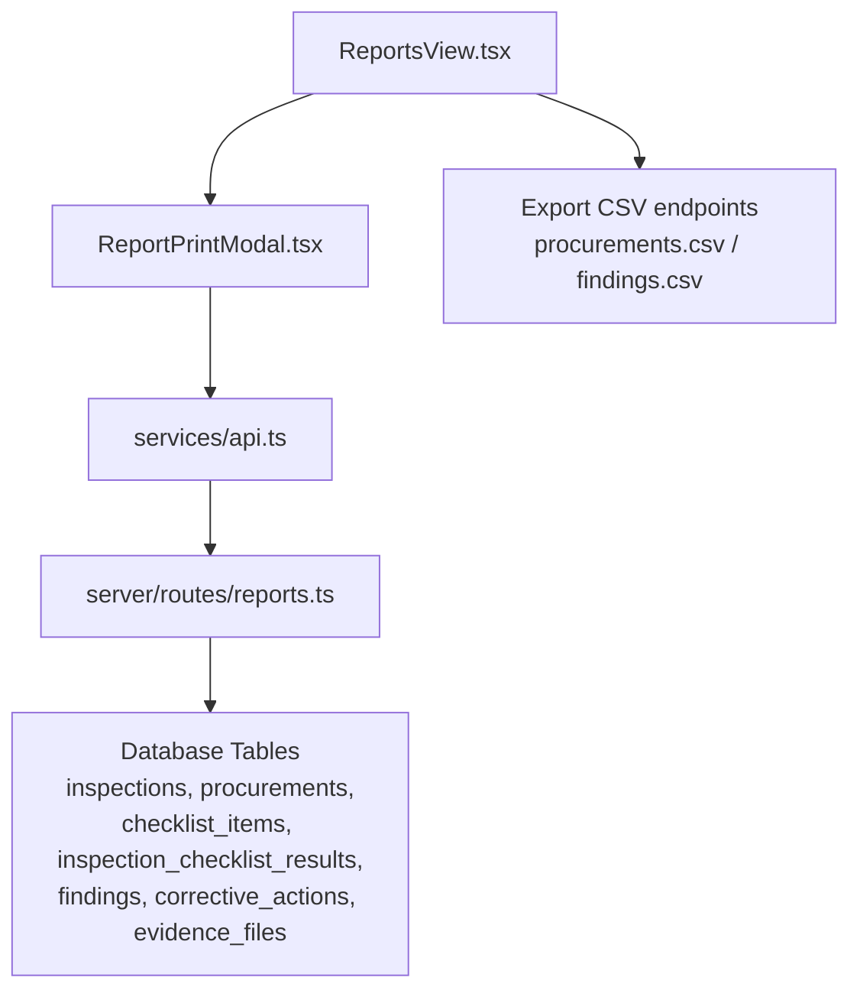
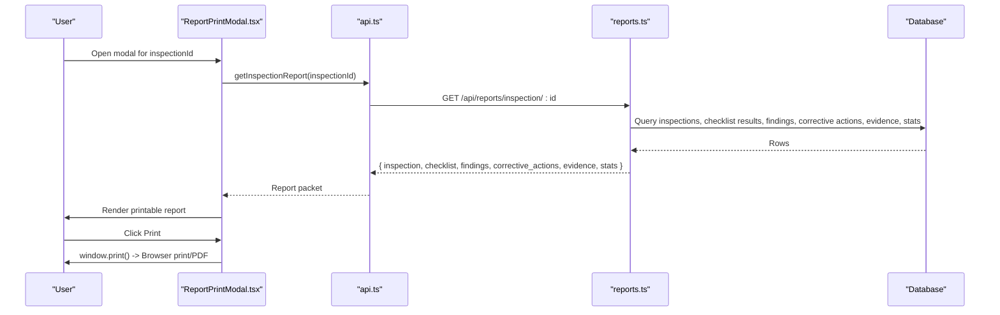
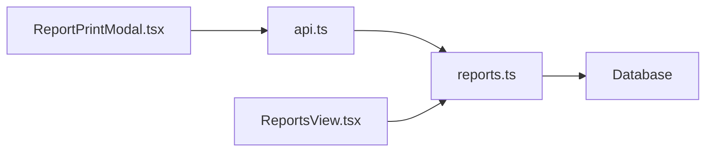

# Report Print Modal

<cite>
**Referenced Files in This Document**
- [ReportPrintModal.tsx](file://src/components/modals/ReportPrintModal.tsx)
- [reports.ts](file://server/routes/reports.ts)
- [api.ts](file://src/services/api.ts)
- [index.ts](file://src/types/index.ts)
- [ReportsView.tsx](file://src/components/ReportsView.tsx)
- [inspections.ts](file://server/routes/inspections.ts)
</cite>

## Table of Contents
1. [Introduction](#introduction)
2. [Project Structure](#project-structure)
3. [Core Components](#core-components)
4. [Architecture Overview](#architecture-overview)
5. [Detailed Component Analysis](#detailed-component-analysis)
6. [Dependency Analysis](#dependency-analysis)
7. [Performance Considerations](#performance-considerations)
8. [Troubleshooting Guide](#troubleshooting-guide)
9. [Conclusion](#conclusion)
10. [Appendices](#appendices)

## Introduction
This document explains the ReportPrintModal component and its end-to-end workflow for generating, previewing, and printing official inspection reports. It covers how data is aggregated from inspections, checklist results, findings, corrective actions, and evidence; how the report is formatted for print; and how CSV export functionality is provided for procurements and findings. It also outlines filtering and selection criteria used to scope report content and provides guidance on extending templates and integrating with external reporting services.

## Project Structure
The report generation flow spans frontend components, API service layer, and server routes:
- Frontend modal renders a printable official document and triggers print via the browser’s print dialog.
- The API service calls the backend endpoint that assembles a full report packet.
- Server queries multiple tables (inspection metadata, checklist results, findings, corrective actions, evidence) and returns a unified JSON payload.
- A separate Reports view exposes CSV exports for procurements and findings.

**Diagram sources**
- [ReportPrintModal.tsx:1-304](file://src/components/modals/ReportPrintModal.tsx#L1-L304)
- [api.ts:419-425](file://src/services/api.ts#L419-L425)
- [reports.ts:8-140](file://server/routes/reports.ts#L8-L140)
- [ReportsView.tsx:52-93](file://src/components/ReportsView.tsx#L52-L93)

**Section sources**
- [ReportPrintModal.tsx:1-304](file://src/components/modals/ReportPrintModal.tsx#L1-L304)
- [api.ts:419-425](file://src/services/api.ts#L419-L425)
- [reports.ts:8-140](file://server/routes/reports.ts#L8-L140)
- [ReportsView.tsx:52-93](file://src/components/ReportsView.tsx#L52-L93)

## Core Components
- ReportPrintModal: Renders an official, print-ready inspection dossier for a given inspectionId. It loads a consolidated report packet, displays compliance statistics, findings, and corrective actions, and supports printing via the browser’s print dialog.
- API Service: Provides getInspectionReport(inspectionId) which calls the backend endpoint to fetch the full report packet.
- Server Reports Route: Aggregates inspection details, checklist results, findings, corrective actions, evidence, and computed statistics into a single response object.
- Reports View: Lists available inspections and offers CSV export endpoints for procurements and findings.

Key responsibilities:
- Data aggregation across related entities for a specific inspection.
- Presentation formatting optimized for print output.
- Export capabilities for CSV datasets.

**Section sources**
- [ReportPrintModal.tsx:15-46](file://src/components/modals/ReportPrintModal.tsx#L15-L46)
- [api.ts:419-425](file://src/services/api.ts#L419-L425)
- [reports.ts:8-140](file://server/routes/reports.ts#L8-L140)
- [ReportsView.tsx:19-37](file://src/components/ReportsView.tsx#L19-L37)

## Architecture Overview
The report generation follows a client-server pattern:
1. User opens the modal for a specific inspection.
2. Modal requests the report packet from the server.
3. Server queries multiple tables and computes statistics.
4. Server returns a unified JSON structure containing inspection metadata, checklist results, findings, corrective actions, evidence, and stats.
5. Modal renders the printable layout and allows users to print or save as PDF using the browser’s print dialog.
6. Separate CSV export endpoints provide downloadable spreadsheets for procurements and findings.

**Diagram sources**
- [ReportPrintModal.tsx:19-39](file://src/components/modals/ReportPrintModal.tsx#L19-L39)
- [api.ts:419-425](file://src/services/api.ts#L419-L425)
- [reports.ts:8-140](file://server/routes/reports.ts#L8-L140)

## Detailed Component Analysis

### ReportPrintModal Component
Responsibilities:
- Load the report packet when opened with an inspectionId.
- Display official header, procurement/project details, compliance summary, findings, corrective actions, and signature blocks.
- Provide print action via the browser’s print dialog.
- Format monetary values using local Nepali Rupee formatting.

Data model usage:
- Uses inspection fields such as inspection_code, inspection_date, procurement_title, office_name, ministry_name, estimated_cost, contract_amount, contractor_name, lead_inspector_name.
- Displays stats like compliant_count, partial_count, non_compliant_count, total_items, missing_evidence_count, high_risk_count.
- Iterates over findings and corrective_actions to render sections.

Print behavior:
- Uses window.print() to trigger native print/PDF saving.
- Control bar elements are hidden during print via CSS classes designed for print media.

Error handling:
- Catches and logs errors while loading the report packet.

**Section sources**
- [ReportPrintModal.tsx:15-46](file://src/components/modals/ReportPrintModal.tsx#L15-L46)
- [ReportPrintModal.tsx:87-297](file://src/components/modals/ReportPrintModal.tsx#L87-L297)

### Server Reports Endpoint
Aggregation logic:
- Fetches inspection and procurement details by joining inspections with procurements and master tables (offices, ministries, provinces, districts, municipalities, fiscal years, users).
- Retrieves checklist items and their results for the inspection, including compliance status, risk level, evidence reference, observation, financial impact, and inspector comments.
- Retrieves findings linked to the inspection, optionally joined with checklist items.
- Retrieves corrective actions linked to findings and filtered by inspection.
- Retrieves evidence files associated with the inspection, optionally joined with checklist items.
- Computes statistics: total items, counts by compliance status, missing evidence count, high-risk count, and total financial impact.

Response shape:
- Returns a JSON object containing inspection, checklist, findings, corrective_actions, evidence, and stats.

Error handling:
- Returns appropriate error messages if inspection not found or on server errors.

**Section sources**
- [reports.ts:8-140](file://server/routes/reports.ts#L8-L140)

### API Service Layer
Provides a typed method to fetch the inspection report:
- getInspectionReport(inspectionId) calls /api/reports/inspection/:id with authentication headers.
- Throws descriptive errors on failure.

**Section sources**
- [api.ts:419-425](file://src/services/api.ts#L419-L425)

### Types and Contracts
Defines core domain types used throughout the application:
- Inspection includes fields for code, dates, status, completion percentage, risk score, and nested stats.
- Finding includes codes, titles, descriptions, legal references, risk levels, financial impacts, deadlines, and statuses.
- CorrectiveAction includes linking to findings, responsible parties, deadlines, progress notes, verification status, and timestamps.
- EvidenceFile includes file metadata and optional linkage to checklist items.

These types inform how the modal renders data and how the server structures responses.

**Section sources**
- [index.ts:163-203](file://src/types/index.ts#L163-L203)
- [index.ts:205-260](file://src/types/index.ts#L205-L260)
- [index.ts:262-279](file://src/types/index.ts#L262-L279)

### Reports View and CSV Exports
Lists inspections and enables opening the ReportPrintModal for each. Also provides direct download links for CSV exports:
- Procurements CSV: Exports procurement records with key fields and UTF-8 BOM for Excel compatibility.
- Findings CSV: Exports findings with risk levels, financial impacts, legal references, deadlines, and statuses.

Filtering and selection:
- Inspections list can be filtered via query parameters (status, procurement_id, office_id, search) at the server level, enabling entity-specific and date-range-based retrieval when combined with additional filters.

**Section sources**
- [ReportsView.tsx:19-37](file://src/components/ReportsView.tsx#L19-L37)
- [ReportsView.tsx:52-93](file://src/components/ReportsView.tsx#L52-L93)
- [inspections.ts:8-67](file://server/routes/inspections.ts#L8-L67)
- [reports.ts:142-178](file://server/routes/reports.ts#L142-L178)
- [reports.ts:180-216](file://server/routes/reports.ts#L180-L216)

## Dependency Analysis
Component relationships:
- ReportPrintModal depends on api.getInspectionReport to fetch data.
- api.getInspectionReport depends on server route /api/reports/inspection/:id.
- Server route depends on database tables and joins to assemble the report packet.
- ReportsView depends on api.getInspections and provides CSV export links to server endpoints.

Potential coupling:
- Modal tightly couples to the shape of the report packet returned by the server. Changes to server response structure require corresponding updates in the modal rendering logic.
- CSV exports are independent endpoints but share similar patterns for querying and formatting data.

External dependencies:
- Browser print dialog for PDF/print output.
- Database for persistent storage of inspections, checklists, findings, corrective actions, and evidence.

**Diagram sources**
- [ReportPrintModal.tsx:19-39](file://src/components/modals/ReportPrintModal.tsx#L19-L39)
- [api.ts:419-425](file://src/services/api.ts#L419-L425)
- [reports.ts:8-140](file://server/routes/reports.ts#L8-L140)
- [ReportsView.tsx:52-93](file://src/components/ReportsView.tsx#L52-L93)

**Section sources**
- [ReportPrintModal.tsx:19-39](file://src/components/modals/ReportPrintModal.tsx#L19-L39)
- [api.ts:419-425](file://src/services/api.ts#L419-L425)
- [reports.ts:8-140](file://server/routes/reports.ts#L8-L140)
- [ReportsView.tsx:52-93](file://src/components/ReportsView.tsx#L52-L93)

## Performance Considerations
- Single request per modal open: The modal fetches a comprehensive report packet in one call, reducing round-trips but increasing payload size. Ensure network efficiency and consider pagination or lazy loading for large evidence sets if needed.
- Database joins: The server performs multiple joins and aggregations. Indexing frequently queried columns (e.g., inspection_id, procurement_id, checklist_item_id) can improve performance.
- Client-side rendering: Rendering large lists of findings and corrective actions should remain responsive. Virtualization or pagination may be considered if datasets grow significantly.
- CSV exports: Generating CSVs on-demand is efficient for moderate datasets. For very large exports, consider background job processing and file downloads.

[No sources needed since this section provides general guidance]

## Troubleshooting Guide
Common issues and resolutions:
- Modal fails to load report packet: Check network errors and ensure the inspectionId is valid. Verify server route availability and authentication headers.
- Missing data in report: Confirm that related records (checklist results, findings, corrective actions, evidence) exist for the inspection. Validate database integrity and foreign key relationships.
- Print layout issues: Use browser print preview to adjust margins and scaling. Ensure CSS print rules hide control bars and format content appropriately.
- CSV export failures: Verify server endpoints are accessible and return correct Content-Type headers. Ensure UTF-8 BOM is included for Excel compatibility.

**Section sources**
- [ReportPrintModal.tsx:25-35](file://src/components/modals/ReportPrintModal.tsx#L25-L35)
- [reports.ts:136-139](file://server/routes/reports.ts#L136-L139)
- [reports.ts:172-177](file://server/routes/reports.ts#L172-L177)
- [reports.ts:210-215](file://server/routes/reports.ts#L210-L215)

## Conclusion
The ReportPrintModal provides a robust, print-ready interface for official inspection reports, aggregating data from inspections, checklists, findings, corrective actions, and evidence. It leverages a unified server endpoint to assemble a comprehensive report packet and uses the browser’s print dialog for PDF generation. CSV exports complement the system by enabling spreadsheet analysis of procurements and findings. Future enhancements can include template customization, advanced filtering, and integration with external reporting services.

[No sources needed since this section summarizes without analyzing specific files]

## Appendices

### Filtering and Selection Criteria
- Inspections listing supports filters: status, procurement_id, office_id, and search text. These enable entity-specific and contextual report generation.
- Date range specifications: While not explicitly exposed in the current inspection listing endpoint, date-based filtering can be added by extending query parameters and server logic to support inspection_date ranges.

**Section sources**
- [inspections.ts:8-67](file://server/routes/inspections.ts#L8-L67)

### Custom Report Templates and External Integrations
- Template customization: Extend the modal’s rendering logic to support configurable sections, branding, and field visibility. Consider extracting reusable template components for different report styles.
- External reporting services: Integrate with third-party PDF generators or analytics platforms by adding new endpoints or modifying existing ones to export structured data or trigger remote report generation.

[No sources needed since this section provides general guidance]