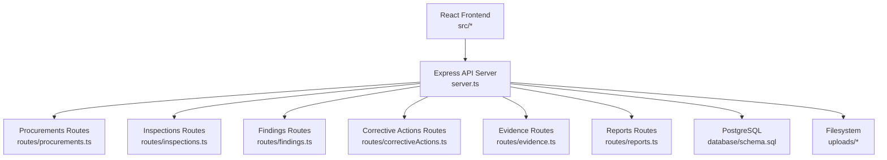
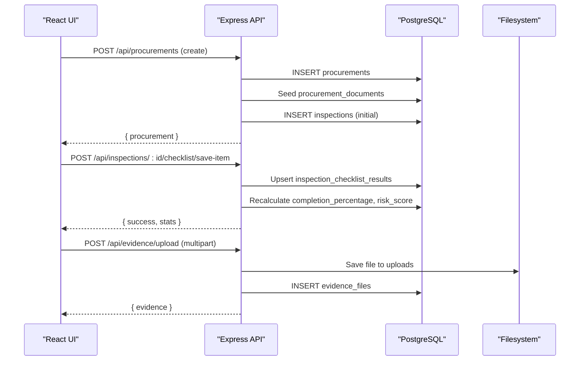
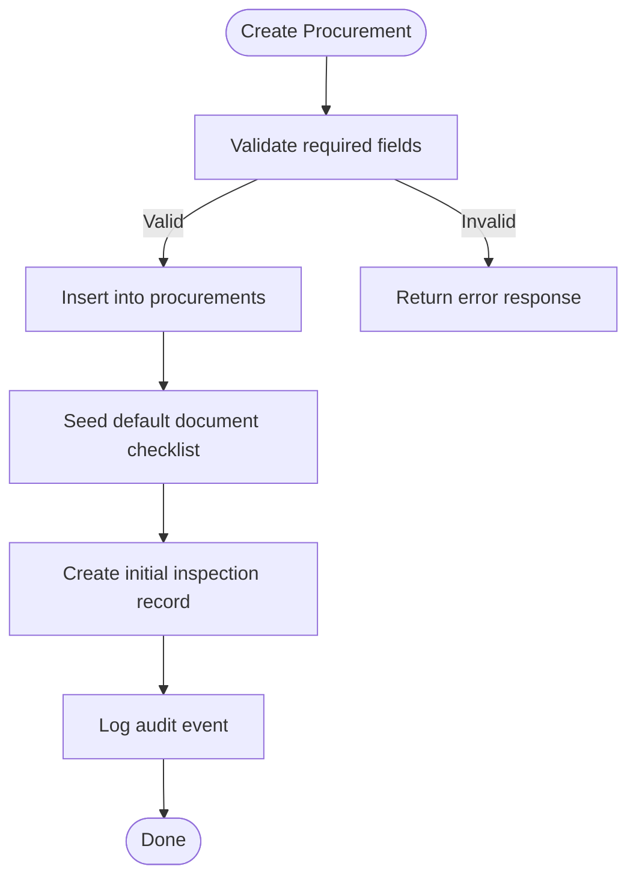
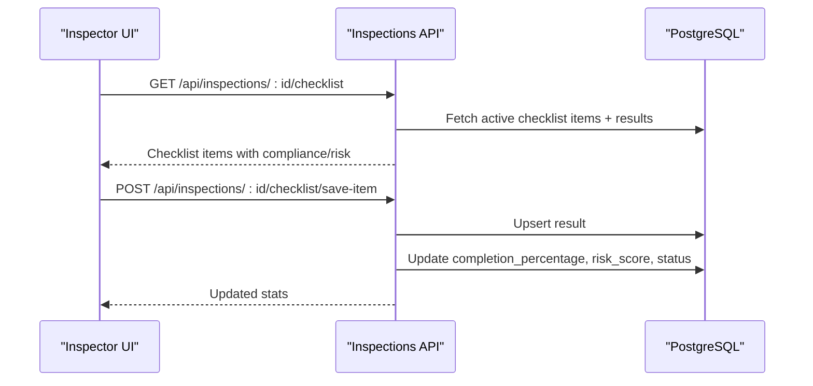
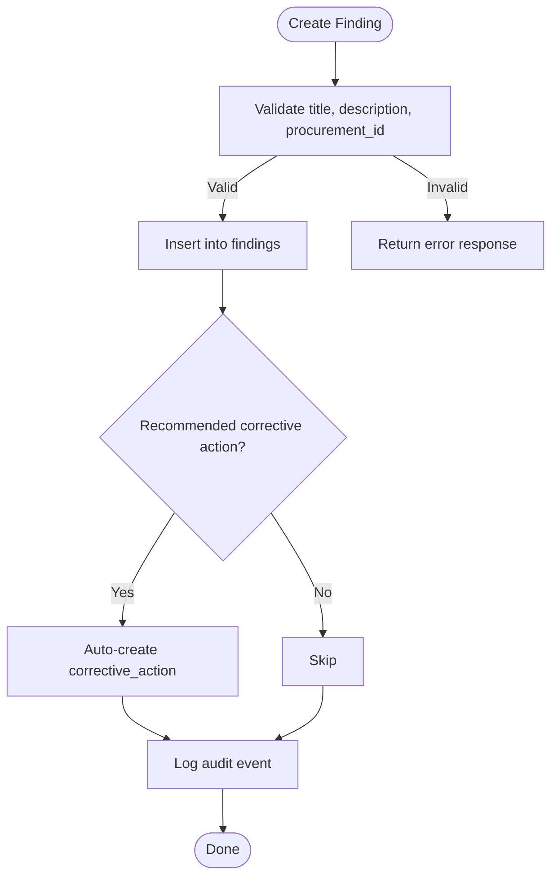
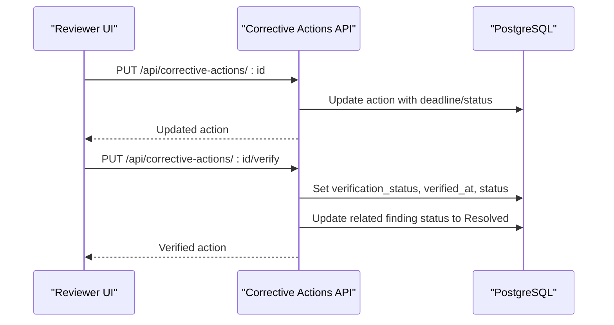
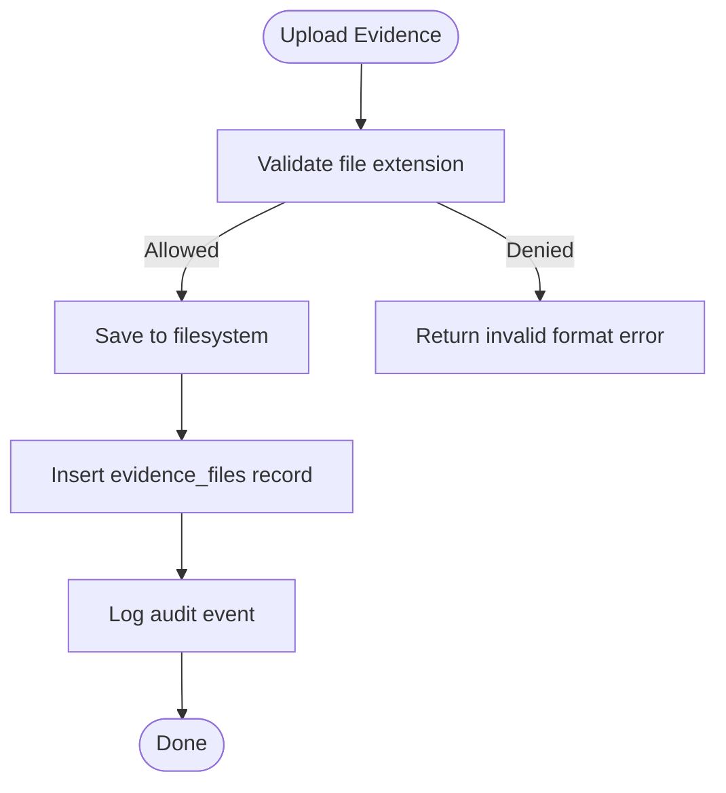
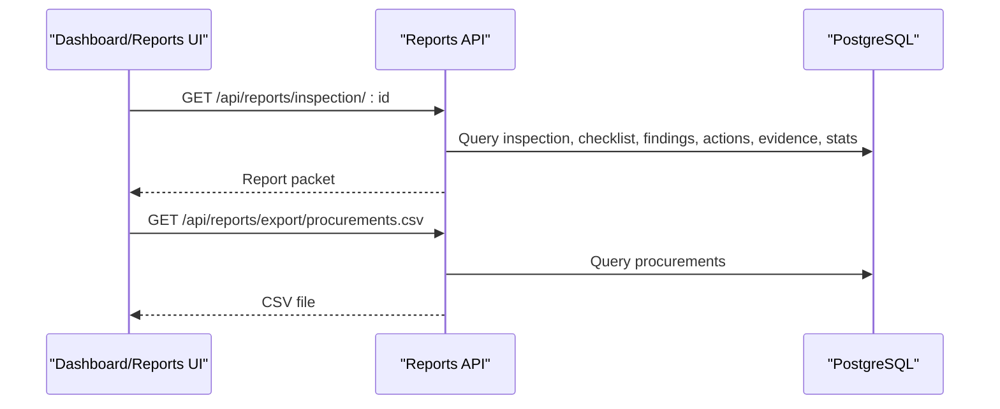
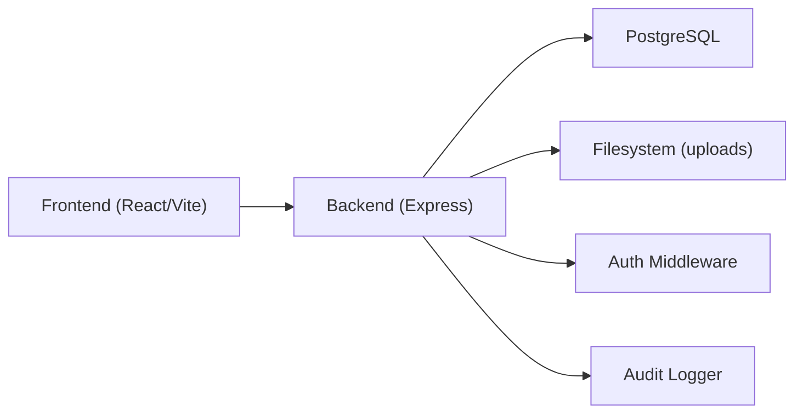

# Project Overview

<cite>
**Referenced Files in This Document**
- [README.md](file://README.md)
- [package.json](file://package.json)
- [server.ts](file://server.ts)
- [src/App.tsx](file://src/App.tsx)
- [database/schema.sql](file://database/schema.sql)
- [src/services/api.ts](file://src/services/api.ts)
- [server/routes/procurements.ts](file://server/routes/procurements.ts)
- [server/routes/inspections.ts](file://server/routes/inspections.ts)
- [server/routes/findings.ts](file://server/routes/findings.ts)
- [server/routes/correctiveActions.ts](file://server/routes/correctiveActions.ts)
- [server/routes/evidence.ts](file://server/routes/evidence.ts)
- [server/routes/reports.ts](file://server/routes/reports.ts)
- [src/components/DashboardView.tsx](file://src/components/DashboardView.tsx)
- [metadata.json](file://metadata.json)
</cite>

## Table of Contents
1. Introduction
2. Project Structure
3. Core Components
4. Architecture Overview
5. Detailed Component Analysis
6. Dependency Analysis
7. Performance Considerations
8. Troubleshooting Guide
9. Conclusion

## Introduction
The NVC Procurement Monitoring & Inspection System is a full-stack application built for Nepal’s National Vigilance Center to monitor public procurement and manage inspections, findings, corrective actions, evidence, and reporting. It provides a structured workflow for government officials, inspectors, and administrators to ensure transparency, compliance, and accountability in public procurement processes. The system supports role-based access, audit logging, risk scoring, and comprehensive reporting to drive informed oversight and corrective action.

Key benefits:
- Centralized procurement tracking with inspection workflows
- Structured checklist-based compliance evaluation
- Findings management with risk classification and financial impact
- Corrective action lifecycle with verification and overdue tracking
- Evidence collection and attachment management
- Dashboard analytics and exportable reports for decision-making

Target audience:
- Government officials overseeing procurement
- Inspectors conducting field and document reviews
- Administrators managing users, master data, and system configuration

[No sources needed since this section summarizes without analyzing specific files]

## Project Structure
The project follows a modern full-stack architecture:
- Frontend: React + TypeScript with Vite build tooling
- Backend: Express.js API server with TypeScript
- Database: PostgreSQL schema with indexes for performance
- File storage: Local uploads directory for evidence attachments
- Routing: Modular route handlers per domain (procurements, inspections, findings, etc.)
- UI: Role-aware dashboard and feature views with modals and navigation

**Diagram sources**
- [server.ts:23-55](file://server.ts#L23-L55)
- [database/schema.sql:1-283](file://database/schema.sql#L1-L283)

**Section sources**
- [server.ts:23-55](file://server.ts#L23-L55)
- [package.json:1-49](file://package.json#L1-L49)

## Core Components
- Procurement Management: Register, update, filter procurements; auto-generate codes; seed default document checklists; create initial inspection records.
- Inspection Workflow: Create inspections, stage-by-stage checklist completion, compliance status, risk scoring, completion percentage, and verification gating by role.
- Findings: Record non-compliance or irregularities with legal references, risk levels, financial impact, deadlines, and linkage to inspections/checklist items.
- Corrective Actions: Track remediation steps, progress notes, deadlines, overdue detection, and verification by reviewers/admins; auto-update finding status upon verification.
- Evidence Collection: Upload, list, download, and delete evidence files with metadata; file type validation and size limits; audit logging on upload/delete.
- Reporting: Generate full inspection report packets (checklist results, findings, corrective actions, evidence), CSV exports for procurements and findings.
- Dashboard: KPIs, compliance breakdown, risk distribution, stage-wise findings heatmap, urgent alerts, quick actions.

**Section sources**
- [server/routes/procurements.ts:8-467](file://server/routes/procurements.ts#L8-L467)
- [server/routes/inspections.ts:8-409](file://server/routes/inspections.ts#L8-L409)
- [server/routes/findings.ts:8-335](file://server/routes/findings.ts#L8-L335)
- [server/routes/correctiveActions.ts:8-251](file://server/routes/correctiveActions.ts#L8-L251)
- [server/routes/evidence.ts:1-195](file://server/routes/evidence.ts#L1-L195)
- [server/routes/reports.ts:1-219](file://server/routes/reports.ts#L1-L219)
- [src/components/DashboardView.tsx:1-554](file://src/components/DashboardView.tsx#L1-L554)

## Architecture Overview
The system uses a layered architecture:
- Presentation Layer: React components render dashboards, lists, forms, and modals; state managed locally and via context; API client abstracted in services.
- Application Layer: Express routes implement business logic, validations, role checks, and orchestrate database operations and file handling.
- Data Layer: PostgreSQL stores all entities with relationships and indexes; schema defines roles, offices, procurements, inspections, checklist items/results, findings, corrective actions, evidence, and audit logs.

**Diagram sources**
- [server/routes/procurements.ts:174-326](file://server/routes/procurements.ts#L174-L326)
- [server/routes/inspections.ts:309-406](file://server/routes/inspections.ts#L309-L406)
- [server/routes/evidence.ts:70-134](file://server/routes/evidence.ts#L70-L134)

**Section sources**
- [src/App.tsx:21-243](file://src/App.tsx#L21-L243)
- [src/services/api.ts:21-440](file://src/services/api.ts#L21-L440)
- [server.ts:23-86](file://server.ts#L23-L86)
- [database/schema.sql:1-283](file://database/schema.sql#L1-L283)

## Detailed Component Analysis

### Procurement Tracking
- Capabilities: List with filters (office, ministry, province, fiscal year, type, method, status), search across titles and codes; single detail view including latest inspection and document completeness; create/update with validation; auto-generated unique codes; default document checklist seeded; audit logging.
- Data model: procurements linked to offices, ministries, provinces, districts, municipalities, fiscal years; documents tracked separately.

**Diagram sources**
- [server/routes/procurements.ts:174-326](file://server/routes/procurements.ts#L174-L326)

**Section sources**
- [server/routes/procurements.ts:8-467](file://server/routes/procurements.ts#L8-L467)
- [database/schema.sql:83-114](file://database/schema.sql#L83-L114)
- [database/schema.sql:246-256](file://database/schema.sql#L246-L256)

### Inspection Workflows
- Capabilities: Create inspections linked to procurements; stage-by-stage checklist retrieval with existing results; save/upsert checklist item results; automatic recalculation of completion percentage and risk score; role-based verification gating (only reviewer/admin can verify/close); statistics and summary.
- Data model: inspections linked to procurements; checklist_items mapped to stages; results stored per inspection; evidence and findings linked to checklist items.

**Diagram sources**
- [server/routes/inspections.ts:257-406](file://server/routes/inspections.ts#L257-L406)

**Section sources**
- [server/routes/inspections.ts:8-409](file://server/routes/inspections.ts#L8-L409)
- [database/schema.sql:116-180](file://database/schema.sql#L116-L180)

### Findings Management
- Capabilities: List/findings with filters (risk level, status, office, procurement, inspection); create with title, description, legal reference, risk level, financial impact, deadline; optional auto-create corrective action if recommended action provided; update/delete with role checks; audit logging.
- Data model: findings linked to inspections, procurements, checklist items/results; corrective actions linked to findings.

**Diagram sources**
- [server/routes/findings.ts:122-221](file://server/routes/findings.ts#L122-L221)

**Section sources**
- [server/routes/findings.ts:8-335](file://server/routes/findings.ts#L8-L335)
- [database/schema.sql:200-224](file://database/schema.sql#L200-L224)

### Corrective Actions
- Capabilities: List with filters (status, finding, inspection, office, overdue); create/update with progress notes and deadlines; auto-flag overdue when past deadline and not completed; verification endpoint for reviewer/admin that updates status and marks finding resolved; audit logging.
- Data model: corrective_actions linked to findings and inspections; includes verification fields and timestamps.

**Diagram sources**
- [server/routes/correctiveActions.ts:123-248](file://server/routes/correctiveActions.ts#L123-L248)

**Section sources**
- [server/routes/correctiveActions.ts:8-251](file://server/routes/correctiveActions.ts#L8-L251)
- [database/schema.sql:226-244](file://database/schema.sql#L226-L244)

### Evidence Collection
- Capabilities: List evidence by inspection and optional checklist item; upload with file type validation and size limit; serve/download by ID; delete with disk cleanup; audit logging on upload/delete.
- Data model: evidence_files linked to inspections and optionally checklist items; metadata includes document number/date/page and description.

**Diagram sources**
- [server/routes/evidence.ts:16-41](file://server/routes/evidence.ts#L16-L41)
- [server/routes/evidence.ts:70-134](file://server/routes/evidence.ts#L70-L134)

**Section sources**
- [server/routes/evidence.ts:1-195](file://server/routes/evidence.ts#L1-L195)
- [database/schema.sql:182-198](file://database/schema.sql#L182-L198)

### Reporting and Analytics
- Capabilities: Full inspection report packet including inspection details, checklist results, findings, corrective actions, evidence, and statistics; CSV exports for procurements and findings; dashboard KPIs and charts.
- Data model: aggregated queries across inspections, checklist results, findings, corrective actions, and evidence.

**Diagram sources**
- [server/routes/reports.ts:7-219](file://server/routes/reports.ts#L7-L219)

**Section sources**
- [server/routes/reports.ts:1-219](file://server/routes/reports.ts#L1-L219)
- [src/components/DashboardView.tsx:1-554](file://src/components/DashboardView.tsx#L1-L554)

## Dependency Analysis
- Frontend dependencies: React, Vite, Tailwind CSS, Lucide icons, motion; API client abstracted in src/services/api.ts with typed methods for each domain.
- Backend dependencies: Express, CORS, JSON parsing, JWT/bcrypt for auth, pg for PostgreSQL, multer for file uploads, dotenv for environment variables.
- Database schema: Comprehensive relational design with foreign keys and indexes for performance; roles, geographic hierarchy (provinces/districts/municipalities), organizational units (ministries/offices), and core entities (procurements, inspections, findings, corrective actions, evidence).
- Integration points:
  - Auth middleware protects routes requiring authentication and role checks
  - Audit utility logs user actions across critical endpoints
  - Filesystem integration for evidence storage and serving

**Diagram sources**
- [package.json:14-47](file://package.json#L14-L47)
- [server.ts:23-55](file://server.ts#L23-L55)
- [database/schema.sql:1-283](file://database/schema.sql#L1-L283)

**Section sources**
- [package.json:1-49](file://package.json#L1-L49)
- [src/services/api.ts:1-440](file://src/services/api.ts#L1-L440)
- [server.ts:23-55](file://server.ts#L23-L55)

## Performance Considerations
- Database indexing: Multiple indexes on frequently queried columns (e.g., procurements.office_id, procurements.current_status, inspections.procurement_id, inspections.status, checklist_items.stage_id, inspection_checklist_results.inspection_id, findings.inspection_id, findings.risk_level, corrective_actions.finding_id, audit_logs.user_id) improve query performance.
- Aggregated queries: Dashboard and report endpoints use efficient joins and subqueries to compute statistics in a single request.
- File uploads: Multer configured with size limits and allowed extensions to prevent abuse and optimize storage.
- Frontend rendering: Dashboard uses conditional visibility and sorting to reduce visual clutter and improve responsiveness.

[No sources needed since this section provides general guidance]

## Troubleshooting Guide
Common issues and resolutions:
- Authentication failures: Ensure token is present in localStorage and Authorization header; verify backend JWT validation and user session.
- Route errors: Check URL paths and headers; confirm routes are mounted under /api/* in the server entrypoint.
- Database connectivity: Verify PostgreSQL connection settings and schema initialization before starting the server.
- File upload errors: Confirm file type and size within allowed limits; ensure uploads directory exists and has write permissions.
- Missing data: Validate required fields in requests; check foreign key constraints and referential integrity.

**Section sources**
- [server/routes/evidence.ts:28-41](file://server/routes/evidence.ts#L28-L41)
- [server/routes/procurements.ts:204-210](file://server/routes/procurements.ts#L204-L210)
- [server/routes/inspections.ts:153-156](file://server/routes/inspections.ts#L153-L156)
- [server/routes/findings.ts:145-148](file://server/routes/findings.ts#L145-L148)
- [server/routes/correctiveActions.ts:81-84](file://server/routes/correctiveActions.ts#L81-L84)

## Conclusion
The NVC Procurement Monitoring & Inspection System delivers a robust, auditable platform for public procurement oversight aligned with Nepal’s regulatory framework. By integrating procurement tracking, structured inspections, findings management, corrective actions, evidence collection, and reporting, it enhances transparency and compliance in government operations. The full-stack architecture ensures scalability, maintainability, and usability for government officials, inspectors, and administrators.

[No sources needed since this section summarizes without analyzing specific files]