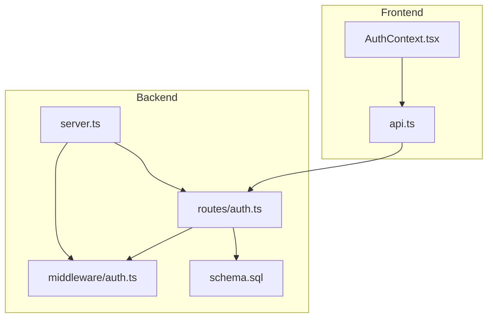
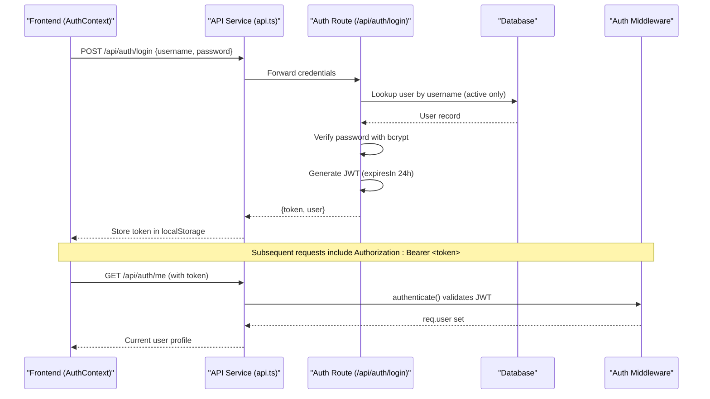
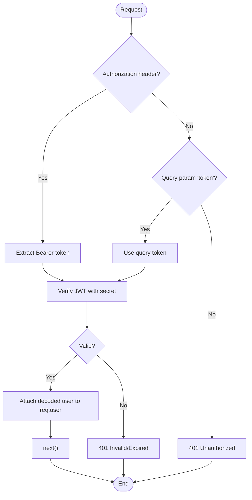
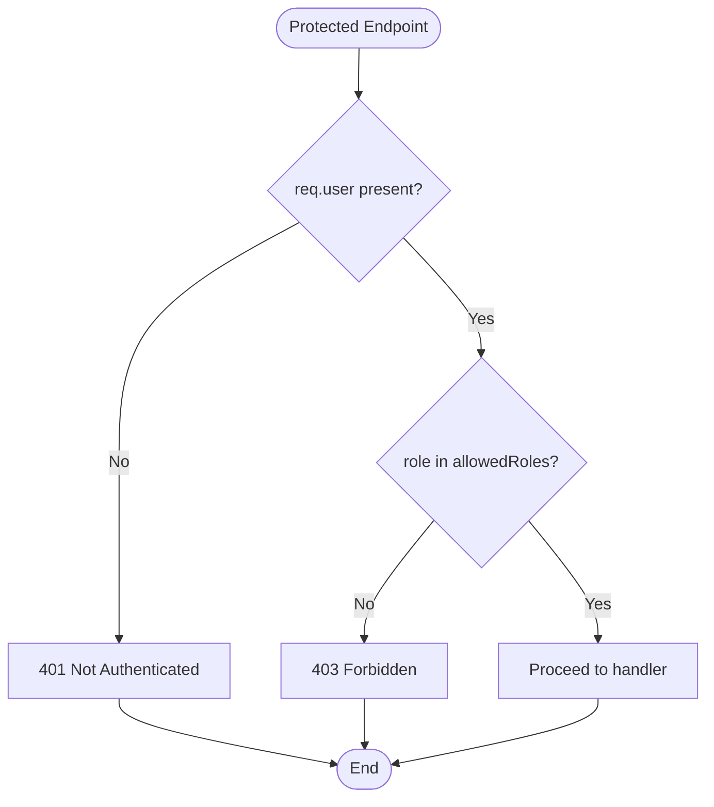
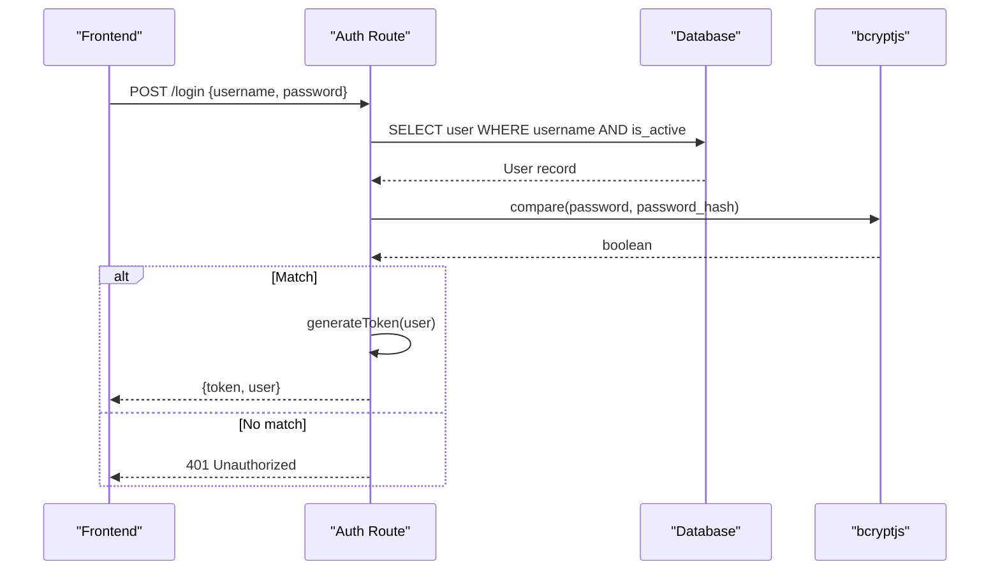
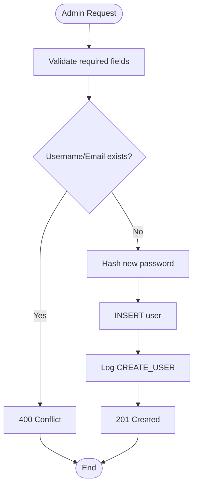
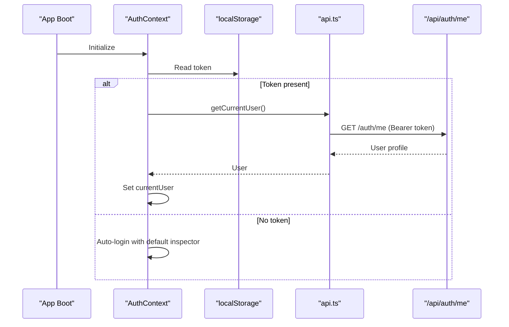
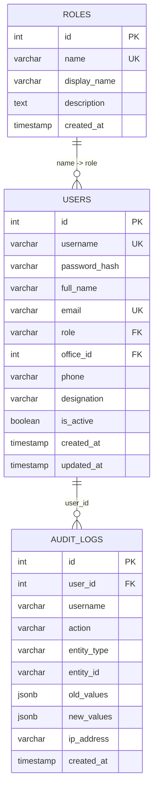
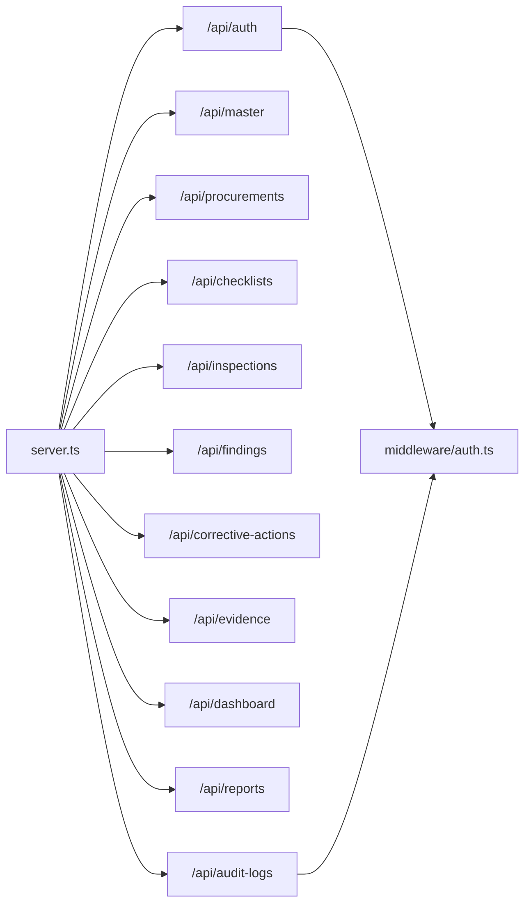

# Authentication & Security Model

<cite>
**Referenced Files in This Document**
- [server.ts](file://server.ts)
- [server/middleware/auth.ts](file://server/middleware/auth.ts)
- [server/routes/auth.ts](file://server/routes/auth.ts)
- [src/context/AuthContext.tsx](file://src/context/AuthContext.tsx)
- [src/services/api.ts](file://src/services/api.ts)
- [database/schema.sql](file://database/schema.sql)
</cite>

## Table of Contents
1. Introduction
2. Project Structure
3. Core Components
4. Architecture Overview
5. Detailed Component Analysis
6. Dependency Analysis
7. Performance Considerations
8. Troubleshooting Guide
9. Conclusion
10. Appendices

## Introduction
This document explains the NVC system’s authentication and security model with a focus on:
- JWT-based authentication flow (token generation, validation, and refresh strategy)
- Role-based access control (RBAC) for admin, inspector, reviewer, and public_officer roles
- Middleware architecture for request protection and authorization checks
- User registration and login workflows, session management via tokens, and password security using bcryptjs
- API security measures, input validation, and protections against common vulnerabilities
- Examples of implementing protected routes and accessing user context in frontend and backend

## Project Structure
The authentication and authorization logic is implemented across server middleware, routes, and the frontend context/service layer. The database schema defines users, roles, and audit logging tables used by the system.

**Diagram sources**
- [server.ts:44-55](file://server.ts#L44-L55)
- [server/routes/auth.ts:1-228](file://server/routes/auth.ts#L1-L228)
- [server/middleware/auth.ts:1-87](file://server/middleware/auth.ts#L1-L87)
- [database/schema.sql:67-81](file://database/schema.sql#L67-L81)

**Section sources**
- [server.ts:44-55](file://server.ts#L44-L55)
- [database/schema.sql:67-81](file://database/schema.sql#L67-L81)

## Core Components
- JWT token lifecycle:
  - Generation at login with a 24-hour expiry
  - Validation on each protected request via middleware
  - No explicit refresh endpoint; clients should re-authenticate when tokens expire
- RBAC:
  - Roles enforced via middleware that checks the role claim in the JWT
  - Supported roles include admin, inspector, reviewer, and public_officer
- Password security:
  - Passwords are hashed with bcryptjs before storage and verified during login
- Session management:
  - Stateless sessions using JWT stored in localStorage on the client side
- Audit logging:
  - Critical actions logged to an audit_logs table

**Section sources**
- [server/middleware/auth.ts:20-34](file://server/middleware/auth.ts#L20-L34)
- [server/middleware/auth.ts:36-58](file://server/middleware/auth.ts#L36-L58)
- [server/middleware/auth.ts:74-86](file://server/middleware/auth.ts#L74-L86)
- [server/routes/auth.ts:10-80](file://server/routes/auth.ts#L10-L80)
- [database/schema.sql:258-270](file://database/schema.sql#L258-L270)

## Architecture Overview
The authentication flow uses Express routes and middleware to protect endpoints. The frontend stores the JWT in localStorage and attaches it as a Bearer token for subsequent requests.

**Diagram sources**
- [server/routes/auth.ts:10-80](file://server/routes/auth.ts#L10-L80)
- [server/middleware/auth.ts:20-58](file://server/middleware/auth.ts#L20-L58)
- [src/services/api.ts:23-54](file://src/services/api.ts#L23-L54)
- [src/context/AuthContext.tsx:30-65](file://src/context/AuthContext.tsx#L30-L65)

## Detailed Component Analysis

### JWT Token Generation and Validation
- Token generation:
  - Payload includes user identity and role claims
  - Expiration set to 24 hours
- Token validation:
  - Extracted from Authorization header or query parameter
  - Verified against secret; invalid/expired tokens return 401
- Optional authentication:
  - Some endpoints can proceed without a valid token but still attach user if present

**Diagram sources**
- [server/middleware/auth.ts:36-58](file://server/middleware/auth.ts#L36-L58)
- [server/middleware/auth.ts:60-72](file://server/middleware/auth.ts#L60-L72)

**Section sources**
- [server/middleware/auth.ts:20-34](file://server/middleware/auth.ts#L20-L34)
- [server/middleware/auth.ts:36-72](file://server/middleware/auth.ts#L36-L72)

### Role-Based Access Control (RBAC)
- Role enforcement:
  - requireRole middleware checks the role claim against allowed roles
  - Returns 401 if not authenticated, 403 if insufficient role
- Roles supported:
  - admin, inspector, reviewer, public_officer
- Usage examples:
  - Admin-only endpoints for user management
  - Reviewer-accessible audit logs

**Diagram sources**
- [server/middleware/auth.ts:74-86](file://server/middleware/auth.ts#L74-L86)

**Section sources**
- [server/routes/auth.ts:107-121](file://server/routes/auth.ts#L107-L121)
- [server/routes/auth.ts:124-163](file://server/routes/auth.ts#L124-L163)
- [server/routes/auth.ts:166-225](file://server/routes/auth.ts#L166-L225)

### Login Workflow and Password Security
- Login process:
  - Validates presence of username and password
  - Retrieves active user by username
  - Compares provided password with stored hash using bcrypt
  - Generates JWT and returns user profile
- Password security:
  - Passwords are hashed with bcryptjs at creation/update time
  - Comparison is performed securely during login

**Diagram sources**
- [server/routes/auth.ts:10-80](file://server/routes/auth.ts#L10-L80)

**Section sources**
- [server/routes/auth.ts:10-80](file://server/routes/auth.ts#L10-L80)

### User Registration and Management
- Create user:
  - Admin-only endpoint
  - Validates required fields
  - Checks for duplicate username/email
  - Hashes password before insertion
- Update user:
  - Admin-only endpoint
  - Allows updating profile fields and optional password change
  - Logs changes via audit

**Diagram sources**
- [server/routes/auth.ts:124-163](file://server/routes/auth.ts#L124-L163)

**Section sources**
- [server/routes/auth.ts:124-163](file://server/routes/auth.ts#L124-L163)
- [server/routes/auth.ts:166-225](file://server/routes/auth.ts#L166-L225)

### Frontend Session Management and Protected Routes
- Token storage:
  - Stored in localStorage under a dedicated key
- Automatic initialization:
  - On app start, attempts to load current user using stored token
  - Falls back to auto-login with demo credentials if needed
- API calls:
  - Attaches Authorization header with Bearer token for all protected endpoints

**Diagram sources**
- [src/context/AuthContext.tsx:30-65](file://src/context/AuthContext.tsx#L30-L65)
- [src/services/api.ts:23-54](file://src/services/api.ts#L23-L54)

**Section sources**
- [src/context/AuthContext.tsx:30-65](file://src/context/AuthContext.tsx#L30-L65)
- [src/services/api.ts:23-54](file://src/services/api.ts#L23-L54)

### Data Models and Database Integration
- Users and roles:
  - Users reference roles by name
  - Roles table provides display names and descriptions
- Audit logs:
  - Captures action, entity type, old/new values, IP address, and timestamp

**Diagram sources**
- [database/schema.sql:8-14](file://database/schema.sql#L8-L14)
- [database/schema.sql:67-81](file://database/schema.sql#L67-L81)
- [database/schema.sql:258-270](file://database/schema.sql#L258-L270)

**Section sources**
- [database/schema.sql:8-14](file://database/schema.sql#L8-L14)
- [database/schema.sql:67-81](file://database/schema.sql#L67-L81)
- [database/schema.sql:258-270](file://database/schema.sql#L258-L270)

## Dependency Analysis
- Server mounts routers under /api/* paths
- Auth middleware is reused across routes to enforce authentication and authorization
- Frontend service layer centralizes API calls and token handling

**Diagram sources**
- [server.ts:44-55](file://server.ts#L44-L55)
- [server/middleware/auth.ts:1-87](file://server/middleware/auth.ts#L1-L87)

**Section sources**
- [server.ts:44-55](file://server.ts#L44-L55)

## Performance Considerations
- JWT verification is lightweight and stateless, avoiding server-side session storage overhead
- Using prepared queries reduces SQL injection risk and improves performance
- Indexes on frequently queried columns (e.g., status, inspection_id) support efficient lookups

[No sources needed since this section provides general guidance]

## Troubleshooting Guide
- 401 Unauthorized:
  - Missing or invalid Authorization header
  - Expired or tampered JWT
- 403 Forbidden:
  - Insufficient role for the requested operation
- Input validation errors:
  - Ensure required fields are present in login and user creation requests
- Audit log issues:
  - Confirm user context is attached before performing sensitive operations

**Section sources**
- [server/middleware/auth.ts:36-58](file://server/middleware/auth.ts#L36-L58)
- [server/middleware/auth.ts:74-86](file://server/middleware/auth.ts#L74-L86)
- [server/routes/auth.ts:10-80](file://server/routes/auth.ts#L10-L80)

## Conclusion
The NVC system implements a robust, stateless authentication model based on JWTs with clear separation of concerns:
- Middleware handles token validation and role checks
- Routes implement business logic and enforce permissions
- Frontend manages token lifecycle and user context
- Passwords are securely hashed and verified
- Audit logging supports accountability and traceability

For production hardening, consider:
- Enforcing HTTPS and secure cookie usage where applicable
- Implementing token refresh flows with short-lived access tokens and long-lived refresh tokens
- Adding rate limiting and input sanitization layers
- Centralizing error responses and internationalization

[No sources needed since this section summarizes without analyzing specific files]

## Appendices

### Example: Implementing Protected Routes (Backend)
- Protect a route:
  - Apply authenticate middleware to require a valid JWT
  - Apply requireRole(['admin']) to restrict to admins
- Example endpoints:
  - List users: GET /api/auth/users
  - Create user: POST /api/auth/users
  - Update user: PUT /api/auth/users/:id

**Section sources**
- [server/routes/auth.ts:107-121](file://server/routes/auth.ts#L107-L121)
- [server/routes/auth.ts:124-163](file://server/routes/auth.ts#L124-L163)
- [server/routes/auth.ts:166-225](file://server/routes/auth.ts#L166-L225)

### Example: Accessing User Context (Frontend)
- Retrieve current user:
  - Call getCurrentUser() which attaches Authorization header automatically
- Persist token:
  - Store token in localStorage after successful login
- Conditional UI:
  - Use role flags (isAdmin, isInspector, etc.) to show/hide features

**Section sources**
- [src/services/api.ts:23-54](file://src/services/api.ts#L23-L54)
- [src/context/AuthContext.tsx:30-65](file://src/context/AuthContext.tsx#L30-L65)