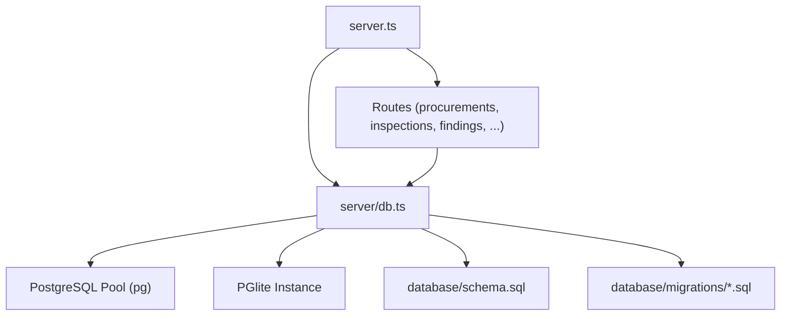
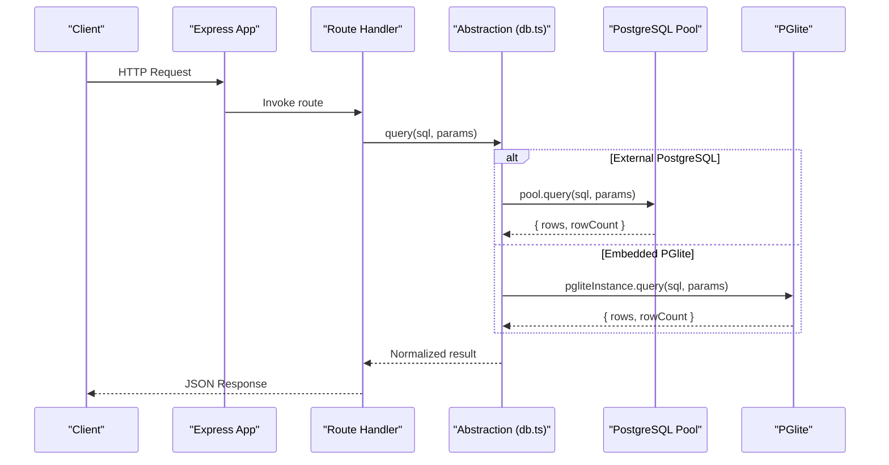
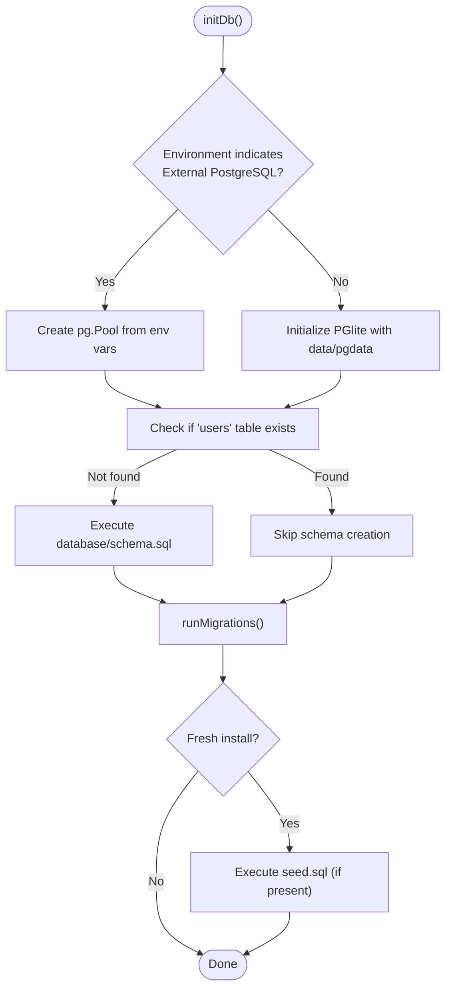
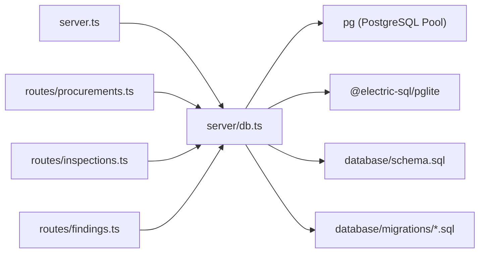

# Database Abstraction Layer

<cite>
**Referenced Files in This Document**
- [server/db.ts](file://server/db.ts)
- [database/schema.sql](file://database/schema.sql)
- [database/migrations/002_full_checklist_34_stages.sql](file://database/migrations/002_full_checklist_34_stages.sql)
- [database/migrations/003_legacy_ref_text_alignment.sql](file://database/migrations/003_legacy_ref_text_alignment.sql)
- [server/routes/procurements.ts](file://server/routes/procurements.ts)
- [server/routes/inspections.ts](file://server/routes/inspections.ts)
- [server/routes/findings.ts](file://server/routes/findings.ts)
- [server.ts](file://server.ts)
</cite>

## Table of Contents
1. [Introduction](#introduction)
2. [Project Structure](#project-structure)
3. [Core Components](#core-components)
4. [Architecture Overview](#architecture-overview)
5. [Detailed Component Analysis](#detailed-component-analysis)
6. [Dependency Analysis](#dependency-analysis)
7. [Performance Considerations](#performance-considerations)
8. [Troubleshooting Guide](#troubleshooting-guide)
9. [Conclusion](#conclusion)
10. [Appendices](#appendices)

## Introduction
This document explains the database abstraction layer that enables dual database support for PostgreSQL and PGlite (embedded PostgreSQL). The abstraction provides a consistent interface for connection management, query execution, schema initialization, migration application, and seeding. It allows the application to run with an external PostgreSQL server or an embedded persistent database without changing business logic.

The abstraction is implemented in a single module that:
- Detects environment configuration to choose between external PostgreSQL and embedded PGlite
- Initializes directories and ensures data persistence
- Applies schema definitions and migrations idempotently
- Seeds initial data on first run
- Exposes unified query APIs used by all API routes

## Project Structure
Key files involved in the database abstraction and usage:
- server/db.ts: Abstraction implementation (connection selection, init, migrations, query wrapper)
- database/schema.sql: Canonical schema definition
- database/migrations/*.sql: Versioned migrations applied at startup
- server.ts: Application bootstrap that initializes the database before starting HTTP routes
- server/routes/*.ts: Route handlers that use the abstraction’s query function

**Diagram sources**
- [server.ts:23-30](file://server.ts#L23-L30)
- [server/db.ts:10-97](file://server/db.ts#L10-L97)
- [server/db.ts:104-149](file://server/db.ts#L104-L149)
- [database/schema.sql:1-283](file://database/schema.sql#L1-L283)

**Section sources**
- [server.ts:23-30](file://server.ts#L23-L30)
- [server/db.ts:10-97](file://server/db.ts#L10-L97)

## Core Components
- Connection manager: Chooses between pg.Pool (external PostgreSQL) and PGlite (embedded) based on environment variables.
- Initialization routine: Creates required directories, detects fresh vs existing databases, applies schema and migrations, seeds demo data once.
- Migration engine: Tracks applied migrations via a schema_migrations table and executes SQL files in order.
- Query abstraction: Unified query(text, params) and executeRaw(sqlText) functions that route calls to the active backend.

Benefits:
- Zero changes in route code when switching backends
- Consistent error handling and logging
- Idempotent setup and migrations
- Persistent embedded mode for local development and deployment simplicity

**Section sources**
- [server/db.ts:10-97](file://server/db.ts#L10-L97)
- [server/db.ts:104-149](file://server/db.ts#L104-L149)
- [server/db.ts:151-180](file://server/db.ts#L151-L180)

## Architecture Overview
The abstraction sits between Express routes and the underlying database engines. Routes call the shared query function; the abstraction decides which engine to use and returns normalized results.

**Diagram sources**
- [server/db.ts:151-169](file://server/db.ts#L151-L169)
- [server/routes/procurements.ts:107-108](file://server/routes/procurements.ts#L107-L108)
- [server/routes/inspections.ts:60-62](file://server/routes/inspections.ts#L60-L62)
- [server/routes/findings.ts:70-71](file://server/routes/findings.ts#L70-L71)

## Detailed Component Analysis

### Connection Management and Engine Selection
- Environment-driven selection: If DATABASE_URL or PGHOST+PGDATABASE are set, the system connects to an external PostgreSQL server using a connection pool. Otherwise, it initializes a persistent PGlite instance under data/pgdata.
- Directory preparation: Ensures data and uploads directories exist.
- Error recovery: If PGlite data is invalid or corrupted, it resets the embedded database directory and reinitializes.

**Diagram sources**
- [server/db.ts:10-97](file://server/db.ts#L10-L97)

**Section sources**
- [server/db.ts:10-97](file://server/db.ts#L10-L97)

### Query Execution Pattern
- All route handlers import and call query(sql, params) from the abstraction.
- The abstraction ensures the database is initialized on first call, then delegates to the active backend.
- Results are normalized to { rows, rowCount }, providing a consistent shape regardless of backend.

Example usage patterns across routes:
- Filtering and listing with dynamic WHERE clauses and parameter binding
- Single record retrieval with JOINs
- Inserting records and returning generated IDs

**Section sources**
- [server/db.ts:151-169](file://server/db.ts#L151-L169)
- [server/routes/procurements.ts:107-108](file://server/routes/procurements.ts#L107-L108)
- [server/routes/inspections.ts:60-62](file://server/routes/inspections.ts#L60-L62)
- [server/routes/findings.ts:70-71](file://server/routes/findings.ts#L70-L71)

### Transaction Handling
- The current abstraction does not expose explicit transaction APIs. Each route typically issues one or more statements sequentially.
- For multi-step writes that must be atomic, wrap multiple statements in a single SQL block executed via executeRaw(sqlText), or refactor to a stored procedure / migration-style script.
- When using external PostgreSQL, you can leverage pg.Pool transactions; for PGlite, use BEGIN/COMMIT within a single exec call.

Recommendation:
- Introduce a beginTransaction(), commitTransaction(), rollbackTransaction() wrapper around the active backend to standardize transactional workflows across both engines.

**Section sources**
- [server/db.ts:171-180](file://server/db.ts#L171-L180)

### Schema Definitions, Relationships, and Constraints
The canonical schema defines entities such as roles, provinces, districts, municipalities, ministries, offices, fiscal years, users, procurements, checklist stages/items, inspections, inspection checklist results, evidence files, findings, corrective actions, procurement documents, and audit logs. Key relationships include:
- Geographical hierarchy: provinces -> districts -> municipalities
- Organizational hierarchy: ministries -> offices
- Procurement lifecycle: procurements -> inspections -> inspection_checklist_results -> findings -> corrective_actions
- Evidence linkage: evidence_files linked to inspections and optionally checklist items
- Audit trail: audit_logs linked to users

Indexes are defined for performance-critical columns such as office_id, status, stage_id, inspection_id, risk_level, and user_id.

Data integrity constraints include:
- Primary keys and unique constraints (e.g., unique codes for procurements, inspections, findings)
- Foreign key references with appropriate ON DELETE behaviors (CASCADE, RESTRICT, SET NULL)
- Unique composite constraint on inspection_checklist_results(inspection_id, checklist_item_id)

**Section sources**
- [database/schema.sql:1-283](file://database/schema.sql#L1-L283)

### Migration Strategy
- Migration tracking: A schema_migrations table records applied migration filenames to ensure idempotency.
- Execution flow: On startup, the system reads all .sql files from database/migrations, sorted lexicographically, and applies any not yet recorded.
- Example migrations:
  - 002_full_checklist_34_stages.sql: Restructures checklist stages and items to a new model
  - 003_legacy_ref_text_alignment.sql: Aligns legacy text references to updated legal references

Best practices:
- Keep migrations idempotent and additive where possible
- Use transactions in migrations when necessary
- Ensure migration filenames sort correctly to maintain order

**Section sources**
- [server/db.ts:104-149](file://server/db.ts#L104-L149)
- [database/migrations/002_full_checklist_34_stages.sql](file://database/migrations/002_full_checklist_34_stages.sql)
- [database/migrations/003_legacy_ref_text_alignment.sql:1-42](file://database/migrations/003_legacy_ref_text_alignment.sql#L1-L42)

### Backup Procedures
- External PostgreSQL: Use native tools like pg_dump to export logical backups. Schedule regular dumps and store securely offsite.
- Embedded PGlite: Back up the entire data/pgdata directory to preserve the embedded database state. Ensure the application is stopped during backup to avoid corruption.

Operational notes:
- For cloud deployments, prefer external PostgreSQL for easier backup automation and point-in-time recovery capabilities.
- For local or edge deployments, treat data/pgdata as a critical artifact and include it in your backup strategy.

[No sources needed since this section provides general guidance]

### Performance Optimization Techniques
- Indexes: The schema includes indexes on frequently filtered/joined columns (office_id, status, stage_id, inspection_id, risk_level, user_id).
- Query design: Routes use parameterized queries and selective joins to reduce payload size.
- Pagination: List endpoints support limit and offset to control result sets.
- Read-heavy workloads: Prefer external PostgreSQL for higher concurrency and advanced optimization features.
- Write-heavy or offline scenarios: PGlite offers simplicity and persistence but may have lower throughput than a full server.

[No sources needed since this section provides general guidance]

### Configuration Options and Environment Settings
- External PostgreSQL:
  - DATABASE_URL or combination of PGHOST, PGUSER, PGPASSWORD, PGDATABASE, PGPORT
  - When set, the system uses pg.Pool to connect to the external server
- Embedded PGlite:
  - When no external settings are detected, the system initializes PGlite with a persistent data directory at data/pgdata
- Startup behavior:
  - The server bootstraps by calling initDb() before mounting routes, ensuring schema and migrations are ready

Environment-specific recommendations:
- Development: Use PGlite for zero-dependency local runs
- Staging/Production: Use external PostgreSQL for reliability, scalability, and tooling

**Section sources**
- [server/db.ts:18-48](file://server/db.ts#L18-L48)
- [server.ts:23-30](file://server.ts#L23-L30)

### Examples of Database Queries and Benefits
Examples of how routes use the abstraction:
- Listing procurements with filters and pagination
- Fetching a single procurement with related metadata
- Creating a procurement and associated default documents and inspection
- Listing and filtering inspections and findings

Benefits of the abstraction approach:
- Uniform API surface across backends simplifies testing and CI
- Switching environments requires only environment variable changes
- Reduced coupling between business logic and database specifics
- Simplified local development with embedded database while supporting production-grade external databases

**Section sources**
- [server/routes/procurements.ts:24-108](file://server/routes/procurements.ts#L24-L108)
- [server/routes/procurements.ts:116-172](file://server/routes/procurements.ts#L116-L172)
- [server/routes/procurements.ts:175-326](file://server/routes/procurements.ts#L175-L326)
- [server/routes/inspections.ts:9-67](file://server/routes/inspections.ts#L9-L67)
- [server/routes/findings.ts:9-76](file://server/routes/findings.ts#L9-L76)

## Dependency Analysis
High-level dependencies:
- server.ts depends on server/db.ts to initialize the database
- Route modules depend on server/db.ts for query operations
- server/db.ts depends on pg (for external PostgreSQL) and @electric-sql/pglite (for embedded)
- server/db.ts reads schema.sql and migration files from disk

**Diagram sources**
- [server.ts:6-18](file://server.ts#L6-L18)
- [server/db.ts:1-4](file://server/db.ts#L1-L4)
- [server/routes/procurements.ts:1-4](file://server/routes/procurements.ts#L1-L4)
- [server/routes/inspections.ts:1-4](file://server/routes/inspections.ts#L1-L4)
- [server/routes/findings.ts:1-4](file://server/routes/findings.ts#L1-L4)

**Section sources**
- [server.ts:6-18](file://server.ts#L6-L18)
- [server/db.ts:1-4](file://server/db.ts#L1-L4)

## Performance Considerations
- Use external PostgreSQL in production for better concurrency, indexing, and maintenance tools
- Leverage existing indexes on high-cardinality and frequently filtered columns
- Avoid SELECT * in list endpoints; project only needed fields to reduce payload
- Use pagination consistently to prevent large result sets
- Monitor slow queries and consider additional indexes or query refactoring
- For PGlite, keep dataset sizes reasonable and avoid heavy concurrent write loads

[No sources needed since this section provides general guidance]

## Troubleshooting Guide
Common issues and resolutions:
- Corrupted embedded database: The system automatically detects invalid PGlite data, resets the data directory, and reinitializes.
- Missing schema or tables: On fresh installs, schema.sql is executed automatically; verify file paths and permissions.
- Migration failures: Check migration files for syntax errors; review logs for the specific migration being applied.
- Connection errors: Validate DATABASE_URL or PG* environment variables; ensure network access to external PostgreSQL.
- Query errors: Inspect logs for SQL and parameters; ensure parameter binding is correct and types match schema.

Operational tips:
- Enable verbose logging during development to capture SQL and errors
- Test migrations locally with PGlite before deploying to external PostgreSQL
- Back up data/pgdata regularly when using embedded mode

**Section sources**
- [server/db.ts:41-47](file://server/db.ts#L41-L47)
- [server/db.ts:61-70](file://server/db.ts#L61-L70)
- [server/db.ts:130-148](file://server/db.ts#L130-L148)
- [server/db.ts:165-168](file://server/db.ts#L165-L168)

## Conclusion
The database abstraction layer cleanly decouples application logic from the underlying database engine, enabling seamless operation with either external PostgreSQL or embedded PGlite. It centralizes initialization, migration, and query execution, ensuring consistency and reducing complexity across environments. With proper configuration, migration practices, and performance tuning, the system supports robust local development and scalable production deployments.

[No sources needed since this section summarizes without analyzing specific files]

## Appendices

### Data Model Overview

```mermaid
erDiagram
ROLES {
int id PK
string name UK
string display_name
text description
timestamp created_at
}
PROVINCES {
int id PK
string name_en
string name_ne
}
DISTRICTS {
int id PK
int province_id FK
string name_en
string name_ne
}
MUNICIPALITIES {
int id PK
int district_id FK
string name_en
string name_ne
string type
}
MINISTRIES {
int id PK
string name_en
string name_ne
}
OFFICES {
int id PK
int ministry_id FK
int province_id FK
int district_id FK
string name
string code UK
string address
boolean is_active
timestamp created_at
}
FISCAL_YEARS {
int id PK
string name UK
boolean is_current
}
USERS {
int id PK
string username UK
string password_hash
string full_name
string email UK
string role FK
int office_id FK
string phone
string designation
boolean is_active
timestamp created_at
timestamp updated_at
}
PROCUREMENTS {
int id PK
string procurement_id_code UK
string procurement_number
int office_id FK
int ministry_id FK
int province_id FK
int district_id FK
int municipality_id FK
string ward
string title
string procurement_type
string procurement_method
int fiscal_year_id FK
string budget_source
numeric estimated_cost
numeric contract_amount
string contract_number
date contract_date
string contractor_name
date contract_start_date
date contract_completion_date
string current_status
date inspection_date
text inspection_team
string lead_inspector
text remarks
int created_by FK
timestamp created_at
timestamp updated_at
}
CHECKLIST_STAGES {
int id PK
int stage_number UK
string title_ne
string title_en
text description
int sort_order
}
CHECKLIST_ITEMS {
int id PK
string checklist_code UK
int stage_id FK
int stage_number
string inspection_area
string legal_reference
text required_documents
string inspection_question
text possible_irregularity
string default_risk_level
text applicable_procurement_methods
int sort_order
boolean is_active
timestamp created_at
timestamp updated_at
}
INSPECTIONS {
int id PK
string inspection_code UK
int procurement_id FK
date inspection_date
string status
int lead_inspector_id FK
text inspection_team
text summary_notes
numeric risk_score
numeric completion_percentage
int verified_by FK
timestamp verified_at
int created_by FK
timestamp created_at
timestamp updated_at
}
INSPECTION_CHECKLIST_RESULTS {
int id PK
int inspection_id FK
int checklist_item_id FK
string compliance_status
string risk_level
text evidence_reference
text observation
numeric financial_impact
text inspector_comment
int completed_by FK
timestamp completed_at
timestamp created_at
timestamp updated_at
unique unique_inspection_checklist
}
EVIDENCE_FILES {
int id PK
int inspection_id FK
int checklist_item_id FK
string file_name
string stored_file_name
string file_path
bigint file_size
string file_type
string document_number
date document_date
string page_number
text description
int uploaded_by FK
timestamp created_at
}
FINDINGS {
int id PK
string finding_code UK
int inspection_id FK
int procurement_id FK
int checklist_item_id FK
int checklist_result_id FK
string title
text description
string legal_reference
text evidence_summary
text possible_irregularity
string risk_level
numeric estimated_financial_impact
string responsible_office
string responsible_officer
text recommended_corrective_action
date deadline
string status
text inspector_remarks
int created_by FK
timestamp created_at
timestamp updated_at
}
CORRECTIVE_ACTIONS {
int id PK
int finding_id FK
int inspection_id FK
text corrective_action_text
string responsible_office
string responsible_officer
date deadline
text progress_notes
date completion_date
string status
string verification_status
text verification_remarks
string verification_officer
timestamp verified_at
timestamp created_at
timestamp updated_at
}
PROCUREMENT_DOCUMENTS {
int id PK
int procurement_id FK
string document_title
string document_type
string status
string file_path
text remarks
timestamp updated_at
}
AUDIT_LOGS {
int id PK
int user_id FK
string username
string action
string entity_type
string entity_id
jsonb old_values
jsonb new_values
string ip_address
timestamp created_at
}
ROLES ||--o{ USERS : "role"
PROVINCES ||--o{ DISTRICTS : "has"
DISTRICTS ||--o{ MUNICIPALITIES : "has"
MINISTRIES ||--o{ OFFICES : "has"
PROVINCES ||--o{ OFFICES : "has"
DISTRICTS ||--o{ OFFICES : "has"
FISCAL_YEARS ||--o{ PROCUREMENTS : "belongs to"
OFFICES ||--o{ PROCUREMENTS : "owns"
OFFICES ||--o{ USERS : "assigned to"
USERS ||--o{ PROCUREMENTS : "created by"
CHECKLIST_STAGES ||--o{ CHECKLIST_ITEMS : "contains"
CHECKLIST_ITEMS ||--o{ INSPECTION_CHECKLIST_RESULTS : "checked in"
PROCUREMENTS ||--o{ INSPECTIONS : "has"
INSPECTIONS ||--o{ INSPECTION_CHECKLIST_RESULTS : "contains"
INSPECTIONS ||--o{ EVIDENCE_FILES : "has"
INSPECTIONS ||--o{ FINDINGS : "has"
FINDINGS ||--o{ CORRECTIVE_ACTIONS : "has"
PROCUREMENTS ||--o{ PROCUREMENT_DOCUMENTS : "has"
USERS ||--o{ AUDIT_LOGS : "performed by"
```

**Diagram sources**
- [database/schema.sql:7-283](file://database/schema.sql#L7-L283)