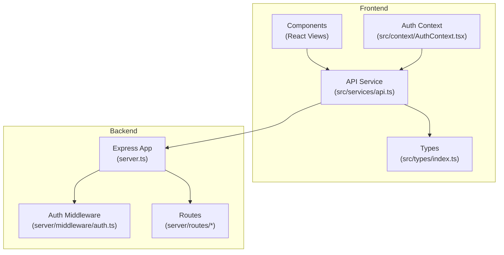
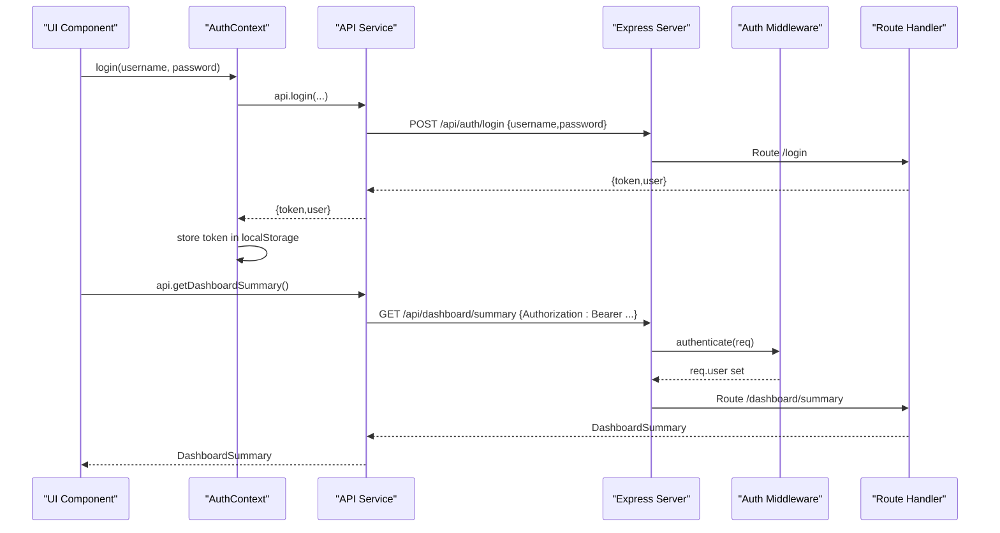
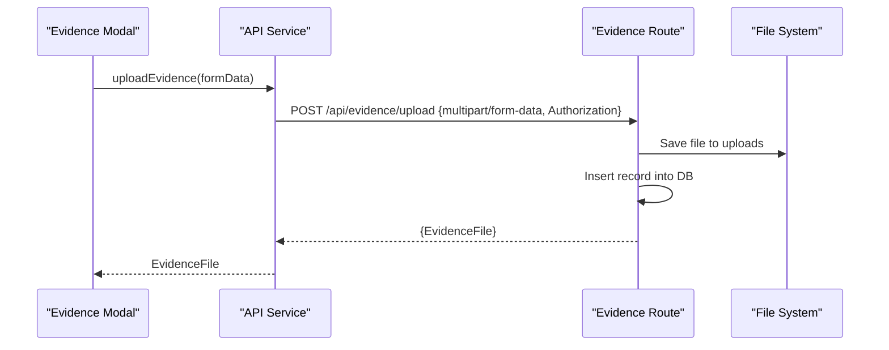
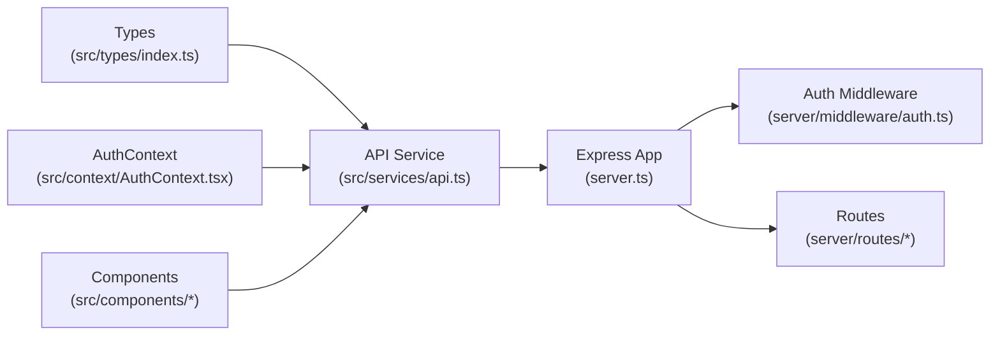

# Frontend-Backend Communication

<cite>
**Referenced Files in This Document**
- [api.ts](file://src/services/api.ts)
- [AuthContext.tsx](file://src/context/AuthContext.tsx)
- [index.ts](file://src/types/index.ts)
- [auth.ts](file://server/middleware/auth.ts)
- [auth.ts](file://server/routes/auth.ts)
- [evidence.ts](file://server/routes/evidence.ts)
- [server.ts](file://server.ts)
- [App.tsx](file://src/App.tsx)
- [Toast.tsx](file://src/components/Toast.tsx)
</cite>

## Table of Contents
1. [Introduction](#introduction)
2. [Project Structure](#project-structure)
3. [Core Components](#core-components)
4. [Architecture Overview](#architecture-overview)
5. [Detailed Component Analysis](#detailed-component-analysis)
6. [Dependency Analysis](#dependency-analysis)
7. [Performance Considerations](#performance-considerations)
8. [Troubleshooting Guide](#troubleshooting-guide)
9. [Conclusion](#conclusion)
10. [Appendices](#appendices)

## Introduction
This document explains the frontend-backend communication architecture of the NVC system. It focuses on the API service layer that abstracts HTTP requests, the RESTful design patterns used across endpoints, error handling strategies, and data transformation between client and server. It also covers authentication integration, request interception via headers, file upload handling, and guidelines for adding new endpoints while maintaining consistency. Real-time updates are not implemented; the system uses synchronous REST calls with local state management.

## Project Structure
The application is split into a React frontend (Vite-based) and an Express backend:
- Frontend:
  - API service layer centralizes all HTTP calls under src/services/api.ts
  - Authentication context manages token lifecycle and user session in src/context/AuthContext.tsx
  - Shared TypeScript interfaces define contracts in src/types/index.ts
  - UI components consume the API service and manage loading/error states locally
- Backend:
  - Express app mounts routers under /api/* in server.ts
  - Authentication middleware validates JWT tokens in server/middleware/auth.ts
  - Feature routes implement REST endpoints (auth, master data, procurements, inspections, findings, corrective actions, evidence, dashboard, reports, audit logs)

**Diagram sources**
- [server.ts:44-55](file://server.ts#L44-L55)
- [api.ts:21-32](file://src/services/api.ts#L21-L32)
- [AuthContext.tsx:30-65](file://src/context/AuthContext.tsx#L30-L65)

**Section sources**
- [server.ts:23-55](file://server.ts#L23-L55)
- [api.ts:21-32](file://src/services/api.ts#L21-L32)
- [AuthContext.tsx:30-65](file://src/context/AuthContext.tsx#L30-L65)

## Core Components
- API Service Layer (src/services/api.ts):
  - Centralized fetch wrapper functions for each domain (auth, master, procurements, checklists, inspections, findings, corrective actions, evidence, dashboard, reports, audit logs)
  - Adds Authorization header using a stored token when present
  - Parses JSON responses and throws errors for non-OK status codes
  - Builds query parameters dynamically for filtering and pagination-like behavior
- Authentication Context (src/context/AuthContext.tsx):
  - Manages login/logout, token persistence in localStorage, and current user profile
  - Auto-initializes session by fetching current user or auto-login for demo
  - Exposes role-based flags to gate UI features
- Shared Types (src/types/index.ts):
  - Strongly typed models for User, Procurement, Inspection, Finding, CorrectiveAction, EvidenceFile, AuditLog, DashboardSummary, and related entities
  - Ensures type safety across API calls and UI state

**Section sources**
- [api.ts:21-439](file://src/services/api.ts#L21-L439)
- [AuthContext.tsx:30-139](file://src/context/AuthContext.tsx#L30-L139)
- [index.ts:1-338](file://src/types/index.ts#L1-L338)

## Architecture Overview
The system follows a standard REST pattern:
- Base URL: /api
- Authenticated requests include Authorization: Bearer <token>
- Server validates tokens via middleware and attaches user info to requests
- Routes respond with JSON payloads matching frontend types
- File uploads use multipart/form-data with server-side validation and storage

**Diagram sources**
- [api.ts:36-45](file://src/services/api.ts#L36-L45)
- [api.ts:414-417](file://src/services/api.ts#L414-L417)
- [auth.ts:36-58](file://server/middleware/auth.ts#L36-L58)
- [auth.ts:10-80](file://server/routes/auth.ts#L10-L80)
- [server.ts:44-55](file://server.ts#L44-L55)

## Detailed Component Analysis

### API Service Layer
Responsibilities:
- Encapsulate HTTP calls with consistent error handling
- Attach Authorization headers for authenticated endpoints
- Build query strings for filters and optional parameters
- Return strongly-typed results based on shared interfaces

Patterns:
- Read operations: GET with optional query params
- Create operations: POST with JSON body
- Update operations: PUT with JSON body
- Delete operations: DELETE with id param
- Specialized operations: POST to action endpoints (e.g., save checklist item, verify corrective action)

Error Handling:
- Non-OK responses throw Error with message from response payload or fallback text
- Consistent error shape expected from backend: { error: string }

Data Transformation:
- Input payloads are serialized via JSON.stringify
- Output parsed via res.json() and cast to TypeScript interfaces
- Query parameters constructed using URLSearchParams for clarity and correctness

Examples of usage:
- Fetching procurements with filters
- Creating/updating procurements
- Saving inspection checklist items
- Uploading evidence files with FormData

**Section sources**
- [api.ts:21-439](file://src/services/api.ts#L21-L439)

### Authentication Integration
Frontend:
- Token stored in localStorage key nvc_token
- getAuthHeaders reads token and sets Authorization header for protected endpoints
- AuthContext initializes session on app start, auto-logs in if needed, and exposes role flags

Backend:
- JWT secret configured via environment variable
- generateToken creates signed tokens with expiration
- authenticate middleware extracts token from Authorization header or query parameter, verifies it, and attaches user to request
- requireRole enforces role-based access control

Flow:
- Login returns token and user profile
- Subsequent requests include Authorization header
- Protected routes validate token and enforce roles

**Section sources**
- [api.ts:23-32](file://src/services/api.ts#L23-L32)
- [AuthContext.tsx:30-139](file://src/context/AuthContext.tsx#L30-L139)
- [auth.ts:20-87](file://server/middleware/auth.ts#L20-L87)
- [auth.ts:10-80](file://server/routes/auth.ts#L10-L80)

### Request Interception and Response Processing
- No global interceptor library is used; instead, a helper function getAuthHeaders builds headers per call
- Each API method handles response.ok checks and throws descriptive errors
- For file uploads, Authorization header is manually added without Content-Type multipart boundary (handled by browser)

Caching:
- No built-in caching mechanism exists in the API service
- Components may implement local caching via state or memoization if needed

Real-time Updates:
- Not implemented; the system relies on polling or explicit refreshes triggered by user actions

**Section sources**
- [api.ts:23-32](file://src/services/api.ts#L23-L32)
- [api.ts:36-439](file://src/services/api.ts#L36-L439)

### File Upload Handling
Frontend:
- Uses FormData to send multipart/form-data
- Sets Authorization header manually for protected uploads
- Calls api.uploadEvidence with inspection_id and metadata

Backend:
- Multer handles file parsing, size limits, and allowed extensions
- Stores files in uploads directory with unique names
- Persists metadata to database and logs audit events
- Provides endpoints to list, download, and delete evidence

**Diagram sources**
- [api.ts:390-403](file://src/services/api.ts#L390-L403)
- [evidence.ts:71-134](file://server/routes/evidence.ts#L71-L134)

**Section sources**
- [api.ts:390-403](file://src/services/api.ts#L390-L403)
- [evidence.ts:11-41](file://server/routes/evidence.ts#L11-L41)
- [evidence.ts:71-134](file://server/routes/evidence.ts#L71-L134)

### Type Safety Approach
- All API methods return strongly-typed promises based on shared interfaces
- Frontend components receive compile-time guarantees for data shapes
- Backend responses align with these interfaces, reducing runtime mismatches

Key Interfaces:
- User, Procurement, Inspection, Finding, CorrectiveAction, EvidenceFile, AuditLog, DashboardSummary

**Section sources**
- [index.ts:1-338](file://src/types/index.ts#L1-L338)
- [api.ts:1-19](file://src/services/api.ts#L1-L19)

### Loading States and Error Responses
- Components manage local loading flags around API calls
- Errors thrown by API methods are caught in components and logged or surfaced via toast notifications
- Toast provider offers success, error, warning, and info messages

Guidelines:
- Wrap API calls in try/catch blocks
- Set loading=true before call and loading=false after completion
- Use toast for user-facing feedback on success or failure

**Section sources**
- [App.tsx:105-116](file://src/App.tsx#L105-L116)
- [Toast.tsx:35-89](file://src/components/Toast.tsx#L35-L89)
- [ProcurementsView.tsx:52-86](file://src/components/ProcurementsView.tsx#L52-L86)

## Dependency Analysis
- Frontend dependencies:
  - API service depends on shared types for return values
  - AuthContext depends on API service for login and current user
  - Components depend on API service and AuthContext
- Backend dependencies:
  - Express app mounts routers under /api
  - Routes depend on auth middleware for protection
  - Evidence route depends on multer for file handling

**Diagram sources**
- [api.ts:1-19](file://src/services/api.ts#L1-L19)
- [AuthContext.tsx:1-4](file://src/context/AuthContext.tsx#L1-L4)
- [server.ts:44-55](file://server.ts#L44-L55)
- [auth.ts:36-58](file://server/middleware/auth.ts#L36-L58)

**Section sources**
- [server.ts:44-55](file://server.ts#L44-L55)
- [api.ts:1-19](file://src/services/api.ts#L1-L19)
- [AuthContext.tsx:1-4](file://src/context/AuthContext.tsx#L1-L4)

## Performance Considerations
- Batch requests where possible using Promise.all to reduce round trips
- Avoid unnecessary re-renders by memoizing derived data in components
- Keep API surface minimal; only fetch required fields
- For large datasets, consider server-side pagination and filtering
- File uploads have size limits; ensure appropriate UX for large files

[No sources needed since this section provides general guidance]

## Troubleshooting Guide
Common issues and resolutions:
- Unauthorized access:
  - Ensure token is present in localStorage and Authorization header is set
  - Verify token validity and expiration on the server
- Network errors:
  - Check CORS configuration and network connectivity
  - Validate endpoint URLs and HTTP methods
- Validation errors:
  - Confirm request payloads match expected schema
  - Review backend validation responses for field-level errors
- File upload failures:
  - Ensure file type and size are within allowed limits
  - Verify multipart/form-data is sent correctly

**Section sources**
- [auth.ts:36-58](file://server/middleware/auth.ts#L36-L58)
- [evidence.ts:28-41](file://server/routes/evidence.ts#L28-L41)
- [api.ts:36-439](file://src/services/api.ts#L36-L439)

## Conclusion
The NVC system employs a clear separation of concerns with a centralized API service layer, strong typing via shared interfaces, and robust authentication middleware. RESTful patterns are consistently applied across domains, with dedicated routes for each feature area. Error handling is uniform, and file uploads are securely managed. While real-time updates are not implemented, the architecture supports scalable enhancements such as caching, pagination, and WebSocket integration if future requirements demand them.

[No sources needed since this section summarizes without analyzing specific files]

## Appendices

### Guidelines for Adding New API Endpoints
- Define TypeScript interfaces for request/response shapes in src/types/index.ts
- Add API methods in src/services/api.ts following existing patterns:
  - Use getAuthHeaders for protected endpoints
  - Construct query parameters with URLSearchParams when needed
  - Handle non-OK responses by throwing Error with descriptive messages
- Implement backend route in server/routes/<feature>.ts:
  - Use authenticate and requireRole as needed
  - Validate inputs and return consistent error objects
  - Log audit events for critical actions
- Update UI components to use new API methods and manage loading/error states

**Section sources**
- [api.ts:76-128](file://src/services/api.ts#L76-L128)
- [auth.ts:74-87](file://server/middleware/auth.ts#L74-L87)
- [evidence.ts:71-134](file://server/routes/evidence.ts#L71-L134)