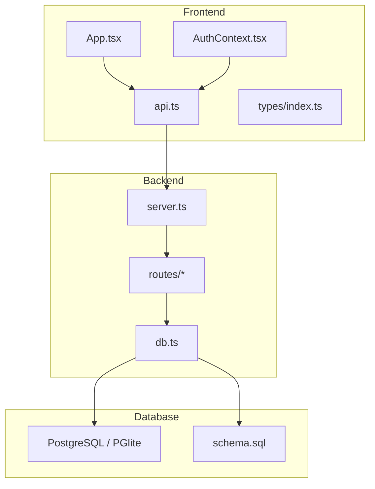
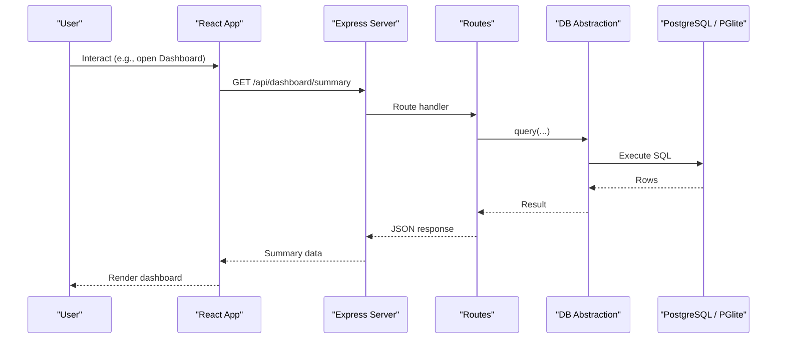
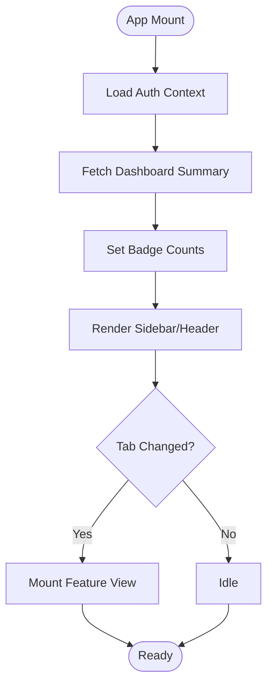
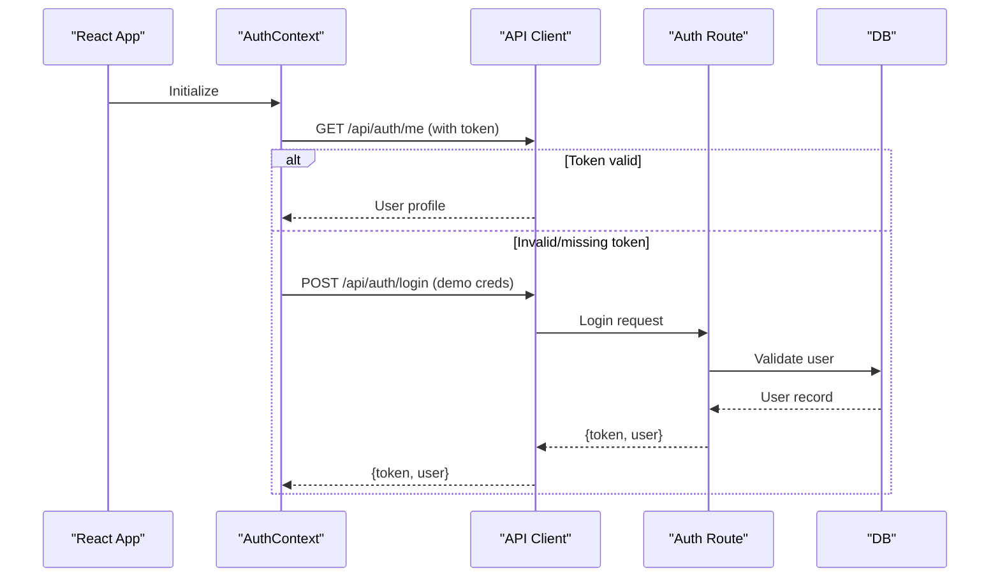
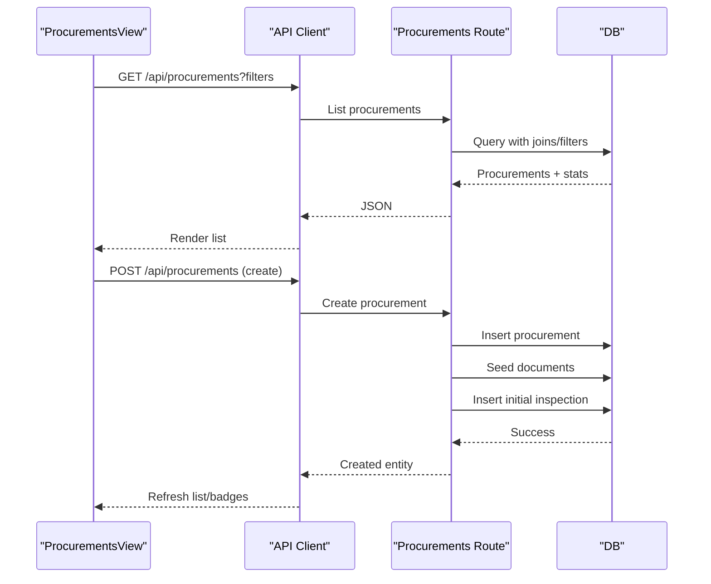
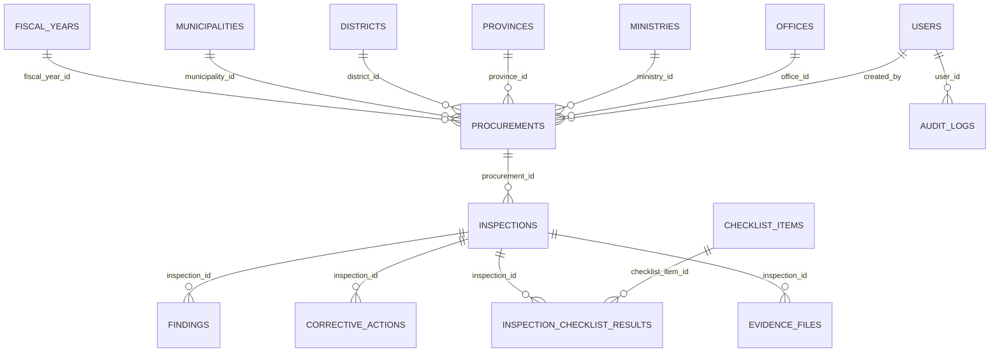
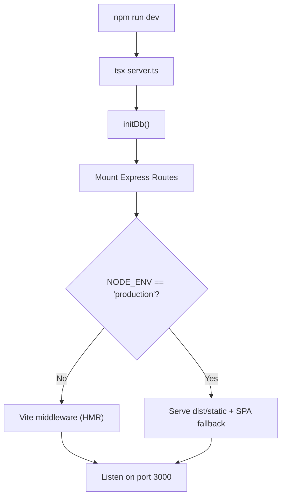
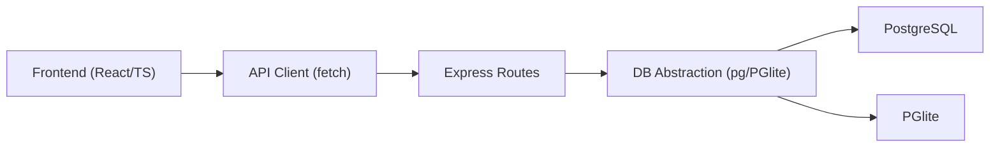

# Overall System Design

<cite>
**Referenced Files in This Document**
- [server.ts](file://server.ts)
- [vite.config.ts](file://vite.config.ts)
- [package.json](file://package.json)
- [src/App.tsx](file://src/App.tsx)
- [src/services/api.ts](file://src/services/api.ts)
- [src/context/AuthContext.tsx](file://src/context/AuthContext.tsx)
- [src/types/index.ts](file://src/types/index.ts)
- [server/db.ts](file://server/db.ts)
- [database/schema.sql](file://database/schema.sql)
- [server/routes/auth.ts](file://server/routes/auth.ts)
- [server/routes/procurements.ts](file://server/routes/procurements.ts)
</cite>

## Table of Contents
1. [Introduction](#introduction)
2. [Project Structure](#project-structure)
3. [Core Components](#core-components)
4. [Architecture Overview](#architecture-overview)
5. [Detailed Component Analysis](#detailed-component-analysis)
6. [Dependency Analysis](#dependency-analysis)
7. [Performance Considerations](#performance-considerations)
8. [Troubleshooting Guide](#troubleshooting-guide)
9. [Conclusion](#conclusion)
10. [Appendices](#appendices)

## Introduction
This document describes the overall system design of the NVC Procurement Monitoring & Inspection System. It explains the MVC-style separation between a React 19 frontend, an Express.js backend, and a PostgreSQL-compatible database layer with dual support for external PostgreSQL and embedded PGlite. It covers technology stack decisions, project structure, build process using Vite, deployment considerations, system boundaries, component interactions, data flow patterns, scalability approaches, performance considerations, and architectural trade-offs.

## Project Structure
The application is organized into three primary layers:
- Frontend (React + TypeScript): UI components, routing state, API client, authentication context, and shared types.
- Backend (Express.js): HTTP server, middleware, route handlers, database abstraction, and utilities.
- Database: PostgreSQL schema, migrations, and optional embedded PGlite runtime.

**Diagram sources**
- [src/App.tsx:1-243](file://src/App.tsx#L1-L243)
- [src/context/AuthContext.tsx:1-139](file://src/context/AuthContext.tsx#L1-L139)
- [src/services/api.ts:1-440](file://src/services/api.ts#L1-L440)
- [src/types/index.ts:1-338](file://src/types/index.ts#L1-L338)
- [server.ts:1-93](file://server.ts#L1-L93)
- [server/db.ts:1-181](file://server/db.ts#L1-L181)
- [database/schema.sql:1-283](file://database/schema.sql#L1-L283)

**Section sources**
- [server.ts:1-93](file://server.ts#L1-L93)
- [vite.config.ts:1-23](file://vite.config.ts#L1-L23)
- [package.json:1-49](file://package.json#L1-L49)

## Core Components
- Frontend App shell: Centralizes navigation, modals, badge counts, and mounts feature views.
- Authentication context: Manages login state, token persistence, role-based capabilities, and auto-login for demo flows.
- API client: Typed service methods over fetch to all backend endpoints, including auth, master data, procurements, inspections, findings, corrective actions, evidence, dashboard, reports, and audit logs.
- Backend server: Express app that initializes DB, mounts routes, serves static assets in production, and integrates Vite dev server in development.
- Database abstraction: Unified query interface supporting external PostgreSQL via pg or embedded PGlite; handles schema initialization, migrations, and seeding.
- Schema: Comprehensive relational model covering roles, geography, ministries/offices, users, procurements, checklists, inspections, results, evidence, findings, corrective actions, documents, and audit logs.

**Section sources**
- [src/App.tsx:1-243](file://src/App.tsx#L1-L243)
- [src/context/AuthContext.tsx:1-139](file://src/context/AuthContext.tsx#L1-L139)
- [src/services/api.ts:1-440](file://src/services/api.ts#L1-L440)
- [server.ts:1-93](file://server.ts#L1-L93)
- [server/db.ts:1-181](file://server/db.ts#L1-L181)
- [database/schema.sql:1-283](file://database/schema.sql#L1-L283)

## Architecture Overview
The system follows a clear MVC-like separation:
- Model: PostgreSQL schema and migration-driven evolution; unified query layer abstracts external vs embedded database.
- View: React components render dashboards, procurements, inspections, findings, corrective actions, master checklist, reports, and audit logs.
- Controller: Express routes handle business logic, validation, authorization, auditing, and orchestrate DB operations.

**Diagram sources**
- [server.ts:1-93](file://server.ts#L1-L93)
- [src/services/api.ts:1-440](file://src/services/api.ts#L1-L440)
- [server/db.ts:1-181](file://server/db.ts#L1-L181)
- [database/schema.sql:1-283](file://database/schema.sql#L1-L283)

## Detailed Component Analysis

### Frontend Application Shell and Navigation
- The root component manages tab-based navigation, modal visibility, and badge counts fetched from the dashboard summary endpoint.
- Feature views are conditionally rendered based on current tab, enabling modular loading of procurement, inspection, findings, corrective actions, master checklist, reports, and audit logs.
- Modals encapsulate complex workflows such as creating procurements, logging findings, uploading evidence, and printing reports.

**Diagram sources**
- [src/App.tsx:1-243](file://src/App.tsx#L1-L243)
- [src/context/AuthContext.tsx:1-139](file://src/context/AuthContext.tsx#L1-L139)

**Section sources**
- [src/App.tsx:1-243](file://src/App.tsx#L1-L243)

### Authentication Flow
- On boot, the context attempts to restore session via stored token; if invalid or missing, it performs an auto-login with a default inspector account for seamless demo experience.
- Login issues JWT tokens used by subsequent requests; the API client attaches Authorization headers automatically.

**Diagram sources**
- [src/context/AuthContext.tsx:1-139](file://src/context/AuthContext.tsx#L1-L139)
- [src/services/api.ts:1-440](file://src/services/api.ts#L1-L440)
- [server/routes/auth.ts:1-228](file://server/routes/auth.ts#L1-L228)
- [server/db.ts:1-181](file://server/db.ts#L1-L181)

**Section sources**
- [src/context/AuthContext.tsx:1-139](file://src/context/AuthContext.tsx#L1-L139)
- [server/routes/auth.ts:1-228](file://server/routes/auth.ts#L1-L228)

### Procurement Management Workflow
- Listing supports rich filtering by office, ministry, province, fiscal year, type, method, status, and search text with pagination.
- Creation auto-generates unique codes, seeds default document checklist items, and creates an initial inspection record.
- Updates preserve partial fields and log audit trails.

**Diagram sources**
- [src/services/api.ts:1-440](file://src/services/api.ts#L1-L440)
- [server/routes/procurements.ts:1-467](file://server/routes/procurements.ts#L1-L467)
- [server/db.ts:1-181](file://server/db.ts#L1-L181)

**Section sources**
- [server/routes/procurements.ts:1-467](file://server/routes/procurements.ts#L1-L467)

### Data Models and Relationships
The schema defines core entities and relationships essential to procurement monitoring and inspection workflows.

**Diagram sources**
- [database/schema.sql:1-283](file://database/schema.sql#L1-L283)

**Section sources**
- [database/schema.sql:1-283](file://database/schema.sql#L1-L283)

### Build Process and Development Server Integration
- Vite config enables React and Tailwind plugins, sets path aliases, and controls HMR behavior via environment variables.
- The Express server integrates Vite in development mode for hot module replacement and SPA handling; in production, it serves built assets from dist and falls back to index.html for client-side routing.

**Diagram sources**
- [vite.config.ts:1-23](file://vite.config.ts#L1-L23)
- [server.ts:1-93](file://server.ts#L1-L93)

**Section sources**
- [vite.config.ts:1-23](file://vite.config.ts#L1-L23)
- [server.ts:1-93](file://server.ts#L1-L93)

### Technology Stack Decisions
- React 19 with TypeScript provides a modern, type-safe frontend with strong ecosystem support.
- Express.js offers a lightweight, flexible backend with middleware-first architecture suitable for REST APIs.
- PostgreSQL ensures robust relational modeling, transactions, and indexing; PGlite enables embedded persistent storage for local/dev environments without external dependencies.
- Vite accelerates development with fast builds and HMR; Tailwind CSS streamlines styling.

**Section sources**
- [package.json:1-49](file://package.json#L1-L49)
- [server/db.ts:1-181](file://server/db.ts#L1-L181)

## Dependency Analysis
The system exhibits clear layering and low coupling:
- Frontend depends on typed API client and shared types; no direct backend knowledge beyond endpoints.
- Backend routes depend on a unified DB abstraction, which abstracts external vs embedded database details.
- Database schema drives both backend queries and frontend types, ensuring consistency.

**Diagram sources**
- [src/services/api.ts:1-440](file://src/services/api.ts#L1-L440)
- [server/db.ts:1-181](file://server/db.ts#L1-L181)

**Section sources**
- [src/services/api.ts:1-440](file://src/services/api.ts#L1-L440)
- [server/db.ts:1-181](file://server/db.ts#L1-L181)

## Performance Considerations
- Database indexing: The schema includes indexes on frequently queried columns (e.g., offices, statuses, inspection IDs, risk levels), improving list and filter performance.
- Pagination and limits: Procurement listing uses limit/offset to control payload size and reduce memory usage.
- Efficient queries: Use of lateral joins and precomputed counts reduces multiple round-trips for dashboard and detail views.
- Embedded vs external DB: PGlite simplifies local development but may not scale to high concurrency; external PostgreSQL is recommended for production workloads.
- File uploads: Large evidence files should be handled with streaming and size limits; consider object storage for scale-out deployments.

[No sources needed since this section provides general guidance]

## Troubleshooting Guide
- Authentication failures: Ensure token presence and validity; verify user credentials and active status in the users table.
- Route errors: Check Express middleware order and CORS configuration; validate request payloads against expected schemas.
- Database connectivity: Confirm DATABASE_URL or PG* environment variables when using external PostgreSQL; ensure PGlite data directory permissions and integrity when using embedded mode.
- Migration issues: Inspect schema_migrations to identify applied migrations; re-run initDb to reset or apply pending migrations if necessary.
- Upload problems: Verify uploads directory existence and write permissions; confirm file size limits and content-type restrictions.

**Section sources**
- [server/db.ts:1-181](file://server/db.ts#L1-L181)
- [server.ts:1-93](file://server.ts#L1-L93)
- [database/schema.sql:1-283](file://database/schema.sql#L1-L283)

## Conclusion
The NVC Procurement Monitoring & Inspection System implements a clean MVC-style architecture with a React 19 frontend, Express.js backend, and a PostgreSQL-compatible database layer supporting both external PostgreSQL and embedded PGlite. The design emphasizes clear separation of concerns, type safety, and maintainable data models. With Vite-powered development, robust schema management, and comprehensive API coverage, the system balances developer productivity with operational flexibility. For production, prefer external PostgreSQL, enforce security best practices, and plan for horizontal scaling and storage offloading as usage grows.

[No sources needed since this section summarizes without analyzing specific files]

## Appendices

### Deployment Considerations
- Environment variables: Configure DATABASE_URL or PG* for external PostgreSQL; set NODE_ENV to production for optimized serving.
- Asset serving: In production, serve built assets from dist and use SPA fallback for client-side routing.
- Security: Enforce HTTPS, secure cookies/tokens, input validation, and rate limiting at the reverse proxy or gateway layer.
- Storage: For large-scale deployments, move evidence files to object storage and store metadata in the database.

[No sources needed since this section provides general guidance]