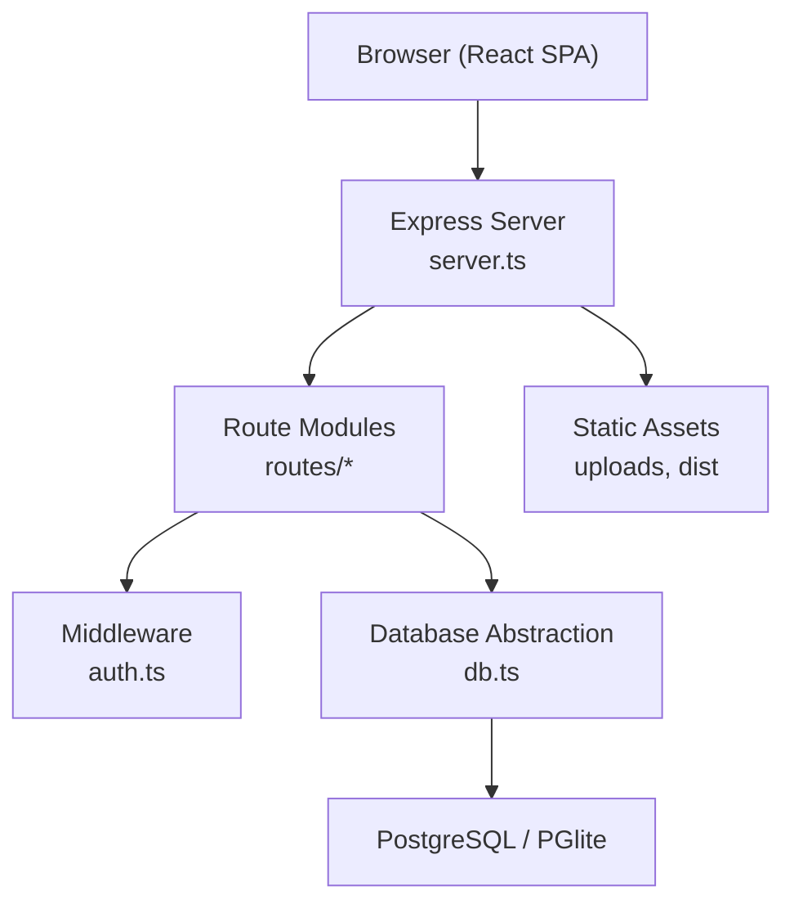
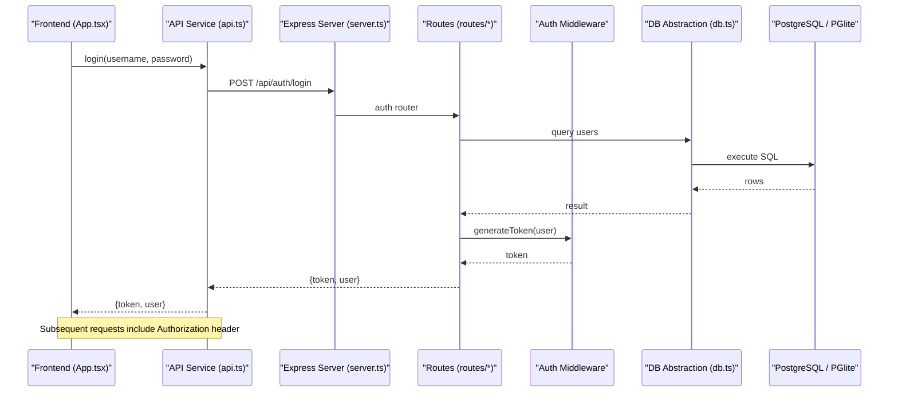
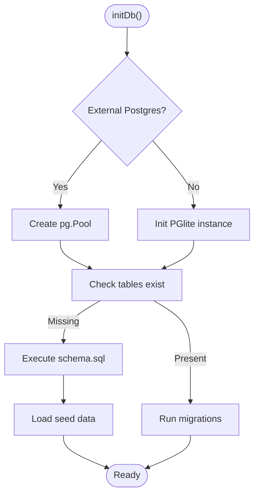
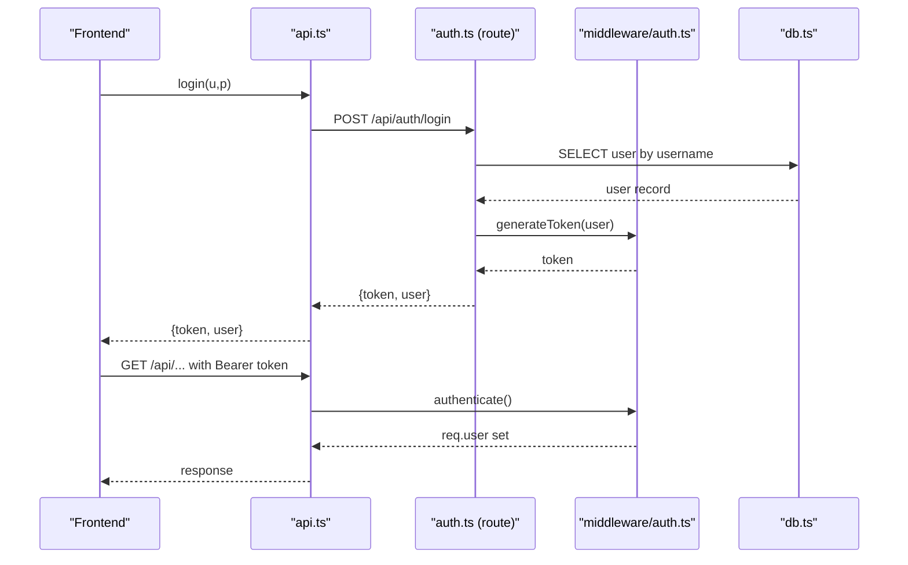
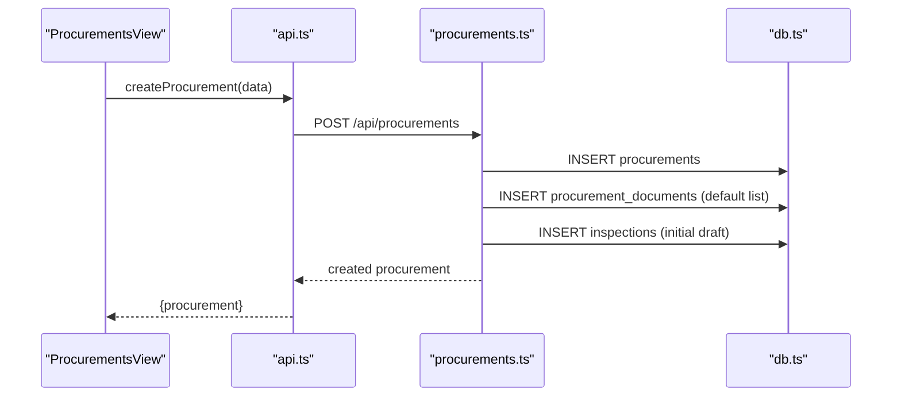
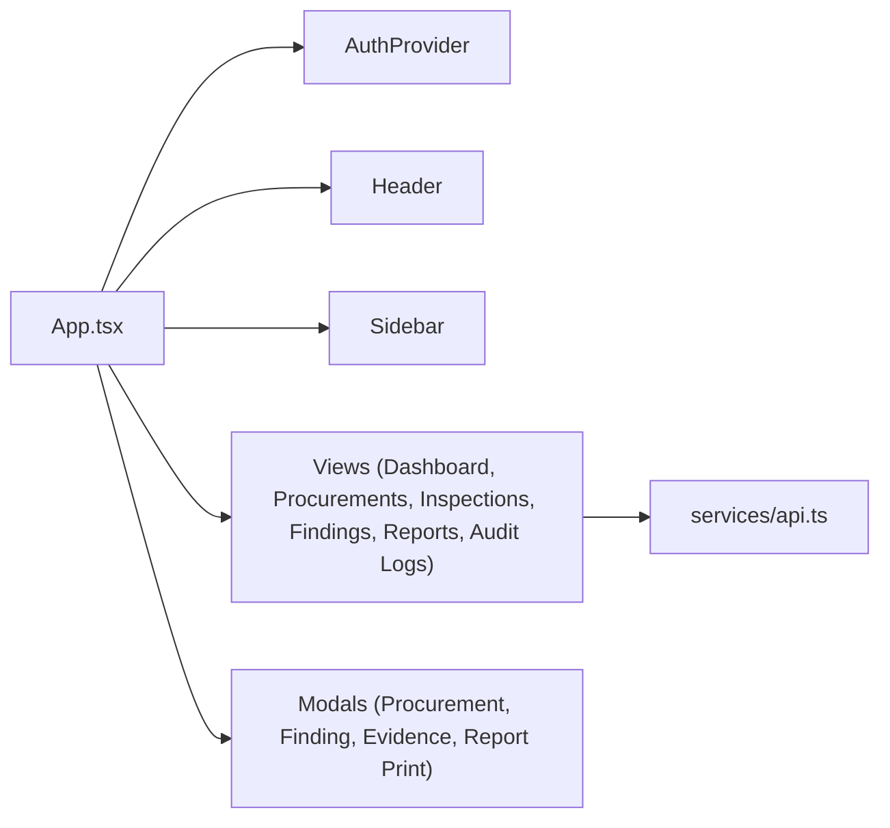
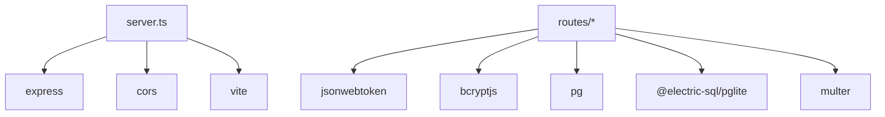

# System Architecture

<cite>
**Referenced Files in This Document**
- [server.ts](file://server.ts)
- [server/db.ts](file://server/db.ts)
- [server/middleware/auth.ts](file://server/middleware/auth.ts)
- [server/routes/auth.ts](file://server/routes/auth.ts)
- [server/routes/procurements.ts](file://server/routes/procurements.ts)
- [src/App.tsx](file://src/App.tsx)
- [src/context/AuthContext.tsx](file://src/context/AuthContext.tsx)
- [src/services/api.ts](file://src/services/api.ts)
- [database/schema.sql](file://database/schema.sql)
- [package.json](file://package.json)
</cite>

## Table of Contents
1. Introduction
2. Project Structure
3. Core Components
4. Architecture Overview
5. Detailed Component Analysis
6. Dependency Analysis
7. Performance Considerations
8. Troubleshooting Guide
9. Conclusion

## Introduction
This document describes the architecture of the NVC Procurement Monitoring & Inspection System. It follows an MVC-style separation:
- Frontend: React application with context-based authentication and a centralized API service layer.
- Backend: Express.js server with route modules, middleware for authentication and authorization, and a database abstraction layer.
- Database: Dual support for external PostgreSQL and embedded PGlite with schema migrations and seeding.

The system supports role-based access control (RBAC), JWT-based authentication, audit logging, and file uploads for evidence.

## Project Structure
High-level layout:
- Server entrypoint initializes DB, mounts routes, serves static assets, and integrates Vite in development.
- Routes are organized by domain: auth, procurements, inspections, findings, corrective actions, evidence, dashboard, reports, audit logs, master data, checklists.
- Middleware provides JWT verification and role checks.
- Database abstraction abstracts queries over either pg.Pool or PGlite.
- Frontend App orchestrates views, modals, and global state; AuthContext manages session and roles; services/api.ts encapsulates HTTP calls.

**Diagram sources**
- [server.ts:23-86](file://server.ts#L23-L86)
- [server/db.ts:10-97](file://server/db.ts#L10-L97)

**Section sources**
- [server.ts:23-86](file://server.ts#L23-L86)
- [package.json:6-12](file://package.json#L6-L12)

## Core Components
- Server bootstrap and routing: Initializes DB, sets up CORS, JSON parsing, static files, mounts API routes, health endpoint, and Vite integration.
- Database abstraction: Detects environment to choose between external PostgreSQL or embedded PGlite, runs schema and migrations, exposes query helpers.
- Authentication middleware: JWT token generation and verification, optional auth, and role-based authorization guard.
- Route handlers: Domain-specific logic for auth, procurements, and other features, using the DB abstraction and audit logging.
- Frontend App and Context: Provides UI shell, navigation, modals, and global auth state; persists token and auto-login behavior.
- API client: Centralized fetch wrapper that attaches Authorization headers and handles errors.

**Section sources**
- [server.ts:23-86](file://server.ts#L23-L86)
- [server/db.ts:10-181](file://server/db.ts#L10-L181)
- [server/middleware/auth.ts:20-86](file://server/middleware/auth.ts#L20-L86)
- [src/App.tsx:21-243](file://src/App.tsx#L21-L243)
- [src/context/AuthContext.tsx:30-139](file://src/context/AuthContext.tsx#L30-L139)
- [src/services/api.ts:21-440](file://src/services/api.ts#L21-L440)

## Architecture Overview
The system implements a layered architecture:
- Presentation Layer (React): Views and modals render UI, use AuthContext for user state, and call api methods.
- Application Layer (Express routes): Validate inputs, enforce RBAC via middleware, orchestrate business operations, and return JSON responses.
- Data Access Layer (db.ts): Abstracts SQL execution against either pg.Pool or PGlite, applies migrations, and seeds data.

**Diagram sources**
- [src/services/api.ts:36-45](file://src/services/api.ts#L36-L45)
- [server/routes/auth.ts:10-79](file://server/routes/auth.ts#L10-L79)
- [server/middleware/auth.ts:20-34](file://server/middleware/auth.ts#L20-L34)
- [server/db.ts:151-169](file://server/db.ts#L151-L169)

## Detailed Component Analysis

### Database Abstraction and Dual Support
- Initialization selects external PostgreSQL if DATABASE_URL or PG* env vars exist; otherwise initializes PGlite with persistent storage under data/pgdata.
- On first run, executes schema.sql and seed data; on subsequent runs, applies incremental migrations tracked in schema_migrations.
- Exposes query(text, params) and executeRaw(sqlText) to route handlers, hiding backend differences.

**Diagram sources**
- [server/db.ts:10-97](file://server/db.ts#L10-L97)
- [server/db.ts:104-149](file://server/db.ts#L104-L149)

**Section sources**
- [server/db.ts:10-181](file://server/db.ts#L10-L181)
- [database/schema.sql:1-283](file://database/schema.sql#L1-L283)

### Authentication Flow and RBAC
- Login verifies credentials, hashes comparison, and issues a JWT with user claims and role.
- Frontend stores token in localStorage and attaches it to all API calls via Authorization header.
- Middleware extracts token from Authorization or query param, decodes JWT, and injects user into request.
- Role-based guard requireRole enforces allowed roles per route.

**Diagram sources**
- [server/routes/auth.ts:10-79](file://server/routes/auth.ts#L10-L79)
- [server/middleware/auth.ts:36-86](file://server/middleware/auth.ts#L36-L86)
- [src/services/api.ts:23-32](file://src/services/api.ts#L23-L32)

**Section sources**
- [server/routes/auth.ts:10-228](file://server/routes/auth.ts#L10-L228)
- [server/middleware/auth.ts:20-86](file://server/middleware/auth.ts#L20-L86)
- [src/context/AuthContext.tsx:30-139](file://src/context/AuthContext.tsx#L30-L139)
- [src/services/api.ts:21-440](file://src/services/api.ts#L21-L440)

### Procurement Module
- List, create, update, and detail endpoints implement filtering, pagination, and joins across offices, ministries, provinces, districts, municipalities, fiscal years, and latest inspection.
- Creating a procurement auto-generates unique codes, seeds default document checklist items, and creates an initial inspection record.
- Updates log audit trails and enforce RBAC where applicable.

**Diagram sources**
- [server/routes/procurements.ts:175-326](file://server/routes/procurements.ts#L175-L326)
- [src/services/api.ts:151-160](file://src/services/api.ts#L151-L160)

**Section sources**
- [server/routes/procurements.ts:9-467](file://server/routes/procurements.ts#L9-L467)

### Frontend Component Hierarchy and State
- App wraps providers (AuthProvider, ToastProvider) and renders Header, Sidebar, and dynamic content based on currentTab.
- Modals manage local state for creating/editing entities and uploading evidence.
- Badge counts are refreshed from dashboard summary to reflect KPIs.

**Diagram sources**
- [src/App.tsx:21-243](file://src/App.tsx#L21-L243)

**Section sources**
- [src/App.tsx:21-243](file://src/App.tsx#L21-L243)

### API Communication Patterns
- All API calls go through a single api object that centralizes base URL, error handling, and Authorization header injection.
- Query parameters are built dynamically for filters and search.
- File uploads use FormData and preserve Authorization header manually.

**Section sources**
- [src/services/api.ts:21-440](file://src/services/api.ts#L21-L440)

### Middleware Architecture
- Global middleware: CORS, JSON parsing, URL-encoded parsing, static file serving for uploads.
- Route-level middleware: authenticate for protected endpoints, requireRole for RBAC, optionalAuth for read-only public endpoints.
- Health endpoint exposed at /api/health.

**Section sources**
- [server.ts:32-65](file://server.ts#L32-L65)
- [server/middleware/auth.ts:36-86](file://server/middleware/auth.ts#L36-L86)

## Dependency Analysis
Key dependencies and their roles:
- Express: Web server and routing.
- cors: Cross-origin requests.
- jsonwebtoken: Token signing and verification.
- bcryptjs: Password hashing and verification.
- pg: PostgreSQL client for external DB.
- @electric-sql/pglite: Embedded PostgreSQL for development/local persistence.
- multer: File upload handling.
- vite: Development server and build tool integrated with Express.

**Diagram sources**
- [package.json:14-36](file://package.json#L14-L36)
- [server.ts:1-18](file://server.ts#L1-L18)

**Section sources**
- [package.json:14-36](file://package.json#L14-L36)
- [server.ts:1-18](file://server.ts#L1-L18)

## Performance Considerations
- Use external PostgreSQL in production for scalability and reliability; PGlite is suitable for development or single-instance deployments.
- Leverage indexes defined in schema for frequent queries (e.g., procurements.office_id, procurements.current_status, inspections.procurement_id).
- Apply pagination and filtering on list endpoints to reduce payload size.
- Avoid unnecessary joins; consider denormalization for high-read dashboards if needed.
- Tune connection pool settings for pg.Pool in high-concurrency environments.
- Cache static assets and enable compression in production.

[No sources needed since this section provides general guidance]

## Troubleshooting Guide
Common issues and resolutions:
- Database initialization failures: Ensure data directory exists and has write permissions; reset PGlite data if corrupted during init.
- Migration conflicts: Confirm schema_migrations table exists and migration files are idempotent; re-run migrations after fixing scripts.
- Authentication errors: Verify JWT_SECRET matches between server and client expectations; ensure tokens are present and not expired.
- Permission denied: Check role assignments and requireRole guards on routes.
- Upload failures: Confirm uploads directory exists and Express static middleware is mounted; validate file size limits.

**Section sources**
- [server/db.ts:38-47](file://server/db.ts#L38-L47)
- [server/db.ts:104-149](file://server/db.ts#L104-L149)
- [server/middleware/auth.ts:36-86](file://server/middleware/auth.ts#L36-L86)
- [server.ts:37-42](file://server.ts#L37-L42)

## Conclusion
The NVC Procurement Monitoring & Inspection System employs a clear MVC separation with robust authentication, RBAC, and a flexible database abstraction supporting both PostgreSQL and PGlite. The frontend uses React with context-driven state and a centralized API client. The backend organizes routes by domain, enforces security via middleware, and maintains audit trails. With proper configuration, indexing, and scaling strategies, the system can serve both development and production needs effectively.

[No sources needed since this section summarizes without analyzing specific files]